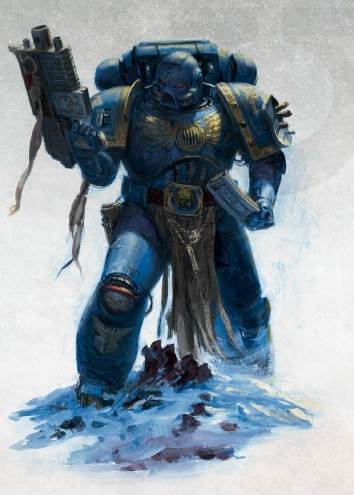
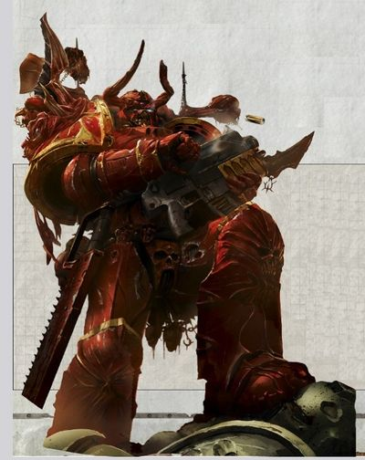
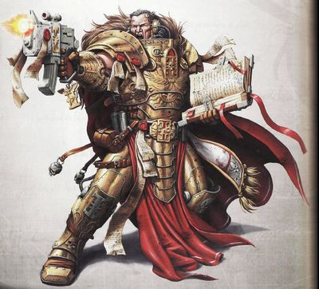
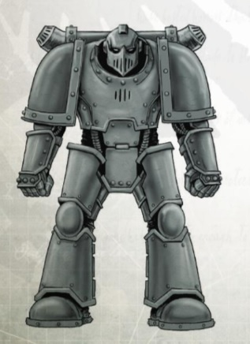
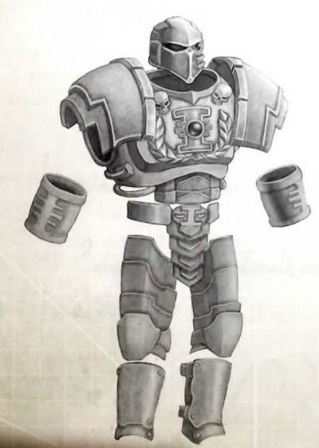
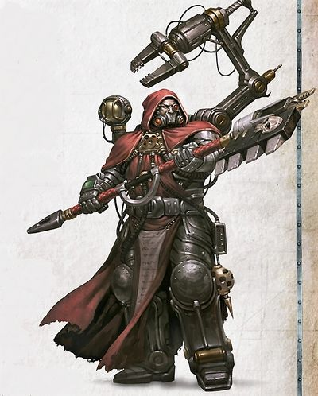

# 1386 动力盔甲 Power Armour

精校状态：中文行文已逐段精校，部分术语仍为暂定

分类：装备 / 盔甲

原文来源：https://www.bilibili.com/opus/1016663143197179909

原作者：帝国神选罐头

原文时间：编辑于 2025年06月24日 22:08

[返回分类目录](目录.md) · [全书目录](../../目录.md)

<!-- A1386-B0001 -->
**英文原文**

Power Armour is worn primarily by the Space Marines, Sisters of Battle, Adeptus Custodes and the Chaos Space Marines. It is a completely enclosed suit of armour, made of thick ceramite plates. The armour would be heavy and cumbersome to wear but for the electrically motivated fibre bundles within the armour that replicate the wearer's movement and enhance his/her strength.

<!-- /A1386-B0001 -->

<!-- A1386-B0002 -->

原译文

动力盔甲主要由星际战士、战斗修女、禁军和混沌星际战士穿着。这是一套完全封闭的盔甲，由厚陶钢板制成。如果不是因为盔甲内的电动纤维束复制了穿着者的动作并增强了他/她的力量，盔甲的穿着会很重很麻烦。

**校订译文**

动力盔甲主要由星际战士、战斗修女、禁军与混沌星际战士使用，是以厚实陶钢板构成的全封闭护甲。内部电驱纤维束随穿戴者动作收缩，并增强其力量，否则这套装甲会极为沉重笨拙。

<!-- /A1386-B0002 -->

<!-- A1386-B0003 图片 -->

<!-- A1386-B0004 -->

原译文

Power Armour 动力盔甲

**校订译文**

Power Armour 动力盔甲

<!-- /A1386-B0004 -->

<!-- A1386-B0005 -->
## Space Marine Power Armour 星际战士动力盔甲

<!-- /A1386-B0005 -->

<!-- A1386-B0006 -->
**英文原文**

Space Marine Power Armour is an extraordinarily sophisticated defensive system which combines huge resistance to physical damage with a sensory array and sealed environment which protects its wearer from the ravages of the void and alien atmospheres. Integrated with the armour are networks of electro-motivated fibre bundles which mimic and augment the muscular strength of the wearer. The true genius of the design, however, lies in its close integration with the already superhuman physiology, senses and reflexes of the Space Marine within. Working in concert, armour and Astartes together become a weapon without equal.

<!-- /A1386-B0006 -->

<!-- A1386-B0007 -->

原译文

星际战士动力装甲是一种非常复杂的防御系统，它结合了对物理损伤的巨大抵抗力、传感阵列和密封环境，保护穿戴者免受虚空和外星大气的破坏。与盔甲融为一体的是电动纤维束网络，可以模仿和增强穿着者的肌肉力量。然而，该设计的真正天才之处在于它与星际战士已经超人的生理、感官和反射的紧密结合。盔甲和阿斯塔特协同工作，成为无与伦比的武器。

**校订译文**

星际战士动力盔甲是一套极其精密的防御系统，将强大的抗损伤能力、感知阵列与密封生存环境结合起来，保护穿戴者免受真空和异星大气侵害。甲内的电驱纤维束网络模拟并增强肌肉力量。设计最卓越之处，在于它与星际战士超人的生理机能、感官和反应速度紧密整合；阿斯塔特与护甲相互配合，共同成为无与伦比的武器。

<!-- /A1386-B0007 -->

<!-- A1386-B0008 -->
### Chaos Space Marines 混沌星际战士

<!-- /A1386-B0008 -->

<!-- A1386-B0009 -->
**英文原文**

At the time of the Heresy, Crusade-pattern armour was in the process of disappearing from the Legions and being replaced by improved iterations of Space Marine power armour. Even so, both sides were forced to reinstate older marks of armour to replace their losses, as well as scavenging from their fallen comrades.

<!-- /A1386-B0009 -->

<!-- A1386-B0010 -->

原译文

在叛乱时代，远征型装甲正在从军团中消失，并被改进的星际战士动力装甲所取代。即便如此，双方都被迫恢复旧型号的盔甲，以弥补损失，并从倒下的战友身上拾荒。

**校订译文**

荷鲁斯之乱爆发时，远征型护甲正在退出军团编制，由改进型动力盔甲取代。但随着战争持续，双方都不得不重新启用旧式护甲以补充损耗，也从阵亡同袍身上回收装备。

<!-- /A1386-B0010 -->

<!-- A1386-B0011 图片 -->

<!-- A1386-B0012 -->

原译文

Chaos Space Marine 混沌星际战士

**校订译文**

Chaos Space Marine 混沌星际战士

<!-- /A1386-B0012 -->

<!-- A1386-B0013 -->
**英文原文**

The armour of the Traitor Legions reflects these turbulent times, often featuring distinctive studded and riveted plasteel plates rather than the smooth ceramite of later designs.

<!-- /A1386-B0013 -->

<!-- A1386-B0014 -->

原译文

叛乱军团的盔甲反映了这些动荡的时代，通常以独特的镶嵌和铆接塑钢板为特色，而不是后来设计的光滑陶钢。

**校订译文**

叛军护甲保留了那个动荡年代的痕迹：常见带有凸钉和铆钉的塑钢板，而非后期设计中光滑的陶钢甲片。

<!-- /A1386-B0014 -->

<!-- A1386-B0015 -->
**英文原文**

Exposed power cables blend with sinew and vein and many Chaos Space Marines individualise their armour with crests, horns, skulls chains and spikes. A Chaos Space Marine’s armour will have been changed by long exposure to the warp. It might sprout spines or bony ridges, be covered in a layer of scales or flicker with coruscating energy.

<!-- /A1386-B0015 -->

<!-- A1386-B0016 -->

原译文

裸露的电源线与肌腱和静脉融为一体，许多混沌星际战士用羽冠、角、头骨链和尖刺来个性化他们的盔甲。混沌星际战士的盔甲因长时间暴露在亚空间中而改变。它可能长出刺或骨脊，被一层鳞片覆盖，或闪烁着闪闪发光的能量。

**校订译文**

裸露的动力缆线与肌腱、血管融合。许多混沌星际战士还用冠饰、角、骷髅、锁链与尖刺装饰护甲，彰显个性。长期暴露于亚空间的护甲会发生变异，可能生出尖刺与骨脊、覆满鳞片，或闪烁耀目的能量。

<!-- /A1386-B0016 -->

<!-- A1386-B0017 -->
## Imperium 帝国

<!-- /A1386-B0017 -->

<!-- A1386-B0018 -->
### Sisters of Battle Power Armour 战斗修女动力盔甲

<!-- /A1386-B0018 -->

<!-- A1386-B0019 -->
**英文原文**

The Sisters of Battle use a version of power armour designed for the human shape and size, known as Sororitas Power Armour.

<!-- /A1386-B0019 -->

<!-- A1386-B0020 -->

原译文

战斗修女使用一种为人类的形状和大小设计的动力盔甲，称为修女动力盔甲。

**校订译文**

战斗修女使用专为普通人类体型设计的型号，称为修女会动力盔甲。

<!-- /A1386-B0020 -->

<!-- A1386-B0021 -->
### Adeptus Custodes Power Armour 禁军动力盔甲

<!-- /A1386-B0021 -->

<!-- A1386-B0022 -->
**英文原文**

The Adeptus Custodes are clad in finely wrought golden armour. Their Power Armour is made from Auramite as opposed to Ceramite.

<!-- /A1386-B0022 -->

<!-- A1386-B0023 -->

原译文

禁军身着精心打造的金色盔甲。他们的动力盔甲是由耀金而不是陶钢制成的。

**校订译文**

禁军身着精心打造的金色盔甲。他们的动力盔甲是由耀金而不是陶钢制成的。

<!-- /A1386-B0023 -->

<!-- A1386-B0024 -->
### Vratine Power Armour 弗拉廷动力盔甲

原题：Vratine Power Armour 瓦拉庭动力盔甲

<!-- /A1386-B0024 -->

<!-- A1386-B0025 -->
**英文原文**

Vratine Armour is a type of armour used by the Sisters of Silence. which shares design elements with both the power armour of the Space Marines and the silicate-mesh of Selenite void-mail

<!-- /A1386-B0025 -->

<!-- A1386-B0026 -->

原译文

瓦拉庭盔甲是寂静修女使用的一种盔甲。它与星际战士的动力盔甲和月光石虚空甲的硅酸盐网格共享设计元素

**校订译文**

弗拉廷护甲由寂静修女使用，融合了星际战士动力盔甲与塞勒奈特虚空链甲的硅酸盐网结构等设计要素。

**校注：** Selenite void-mail 原译月光石虚空甲，未找到支持该材料名称的依据。暂以音译塞勒奈特保留专名，并按 mail 表示链甲；具体所指待核。Vratine沿现有武器型号词根弗拉廷。

<!-- /A1386-B0026 -->

<!-- A1386-B0027 -->
### Inquisition 审判庭

原题：Inquisition 审判官

<!-- /A1386-B0027 -->

<!-- A1386-B0028 -->
**英文原文**

Power armour is also favored for use by agents of the Inquisition and those individuals wealthy enough to afford one, such as Rogue Traders. These suits of armour enhance the user's strength, allow for operation in hostile environments, and include auxiliary systems such as vox-links and auto-senses. Like the Adepta Sororitas though, the lack of a Black Carapace means these users cannot fully interface with their power armour and so do not enjoy the same strength enhancements and other advanced support systems typical to Astartes power armour.

<!-- /A1386-B0028 -->

<!-- A1386-B0029 -->

原译文

动力盔甲也被审判庭的特工和那些有钱买得起的人所青睐，比如行商浪人。这些盔甲增强了使用者的力量，允许在恶劣环境中作战，并包括音阵链接和自动感应等辅助系统。然而，与修女会一样，缺乏黑色甲壳意味着这些使用者无法完全与他们的动力盔甲交互，因此无法享受阿斯塔特动力盔甲所特有的同力量增强和其他先进支持系统。

**校订译文**

审判庭特工，以及行商浪人等有能力负担高昂费用的人，也偏爱动力盔甲。这些护甲增强使用者力量，允许其在恶劣环境中行动，并集成音阵通信与自动感知等辅助系统。不过，与战斗修女一样，这些使用者没有黑色甲壳植入体，无法与护甲实现完整连接，因此享受不到阿斯塔特动力盔甲同等程度的力量强化及其他先进支持功能。

<!-- /A1386-B0029 -->

<!-- A1386-B0030 -->
### Malleus Power Armour 恶魔审判庭动力盔甲

原题：Malleus Power Armour 圣锤动力盔甲

<!-- /A1386-B0030 -->

<!-- A1386-B0031 -->
**英文原文**

Rare even among the Holy Ordos, this power armour is inscribed with pentagrammatic wards in the vaults deep below the Tricorn Palace. It is highly prized by those who expect to fight daemons in hand-to-hand combat, and an Inquisitor who allows an Acolyte access to it must have good (or desperate) reasons. The wards inscribed onto the armour harm Daemonic creatures who directly strike the wearer. The wards are temporary at best, some failing after a single encounter, but servants of the Ordos Malleus regard them as a retributive strike, hoping that with their death they might still weaken or slay such accursed creatures. The power pack used in Ordo Malleus power armour allows it to operate for a week without recharging. Alternatively, it can be equipped with a power supply like that used by the Adeptus Astartes.

<!-- /A1386-B0031 -->

<!-- A1386-B0032 -->

原译文

即使在神圣的圣锤修会，这种动力盔甲也很罕见，在三角宫深处的秘库刻上五角星图案。它受到那些希望与恶魔进行肉搏战的人的高度重视，允许侍从接近它的审判官必须有充分（或绝望）的理由。刻在盔甲上的图案会伤害直接攻击穿戴者的恶魔生物。这些图案充其量是暂时的，有些在一次遭遇后就失效了，但圣锤修会的仆人认为这是一次报复性的打击，希望他们死后仍能削弱或杀死这些被诅咒的生物。圣锤动力盔甲中使用的能量容器使其可以在不充能的情况下运行一周。或者，它可以配备一个类似于阿斯塔特修会所使用的能源。

**校订译文**

这类护甲即便在神圣审判庭中也很罕见，须在三角宫地底深处的秘库内刻上五芒防护符阵。准备与恶魔近身交战者尤其珍视它；审判官若准许侍从使用，必有充分理由，或已被逼到绝境。恶魔直接攻击穿戴者时，符阵便会反伤它们。其效力只是暂时的，有些仅经历一次交战便失效，但恶魔审判庭的仆从仍将其视作复仇手段，希望即使自己死去，也能削弱或杀死这些受诅咒的生物。配套能源包可让护甲在不充电的情况下运行一周，也可换装阿斯塔特式供能系统。

**校注：** Holy Ordos 泛指神圣审判庭各分支，非专指恶魔审判庭；pentagrammatic wards 是具有防护作用的五芒符阵，不仅是装饰图案。装备名按明确用途归属统一，原圣锤动力盔甲保留对照。

<!-- /A1386-B0032 -->

<!-- A1386-B0033 图片 -->

<!-- A1386-B0034 -->

原译文

Ordo Malleus Inquisitor wore Malleus Power Armour 圣锤修会审判官穿圣锤动力盔甲

**校订译文**

Ordo Malleus Inquisitor wore Malleus Power Armour 穿戴恶魔审判庭动力盔甲的恶魔审判庭审判官

<!-- /A1386-B0034 -->

<!-- A1386-B0035 -->

原译文

Delphis Mk.II "Ironclad" Heavy Power Armour 德尔菲斯Mk.II“铁甲”重型动力盔甲

**校订译文**

Delphis Mk.II "Ironclad" Heavy Power Armour 德尔菲斯Mk.II“铁甲”重型动力盔甲

<!-- /A1386-B0035 -->

<!-- A1386-B0036 -->
**英文原文**

A variant of standard power armour, it features increased personal protection at the cost of agility, with huge plates of Plasteel covering the flatter areas of the body. Exposed servo-mechanisms run along the legs and arms and elaborate bracing runs across the spine. The helmet is small by comparison and the gauntlets are unwieldy to the point where basic actions beyond wielding a weapon is impossible. The power cell system in the rear has several thermal fins protruding to shed away excess heat. Ranks of power cells mounted on the rear provide 12 hours of continuous operation before recharging is needed, but require a day of recharging after each prolonged use. The suit is also a fully enclosed void suit and incorporates an inbuilt auspex, good craftsmanship photo-visors, an incorporated vox, and a pair of recoil gloves. If the suit becomes unpowered, vents open automatically in the helmet to ensure the wearer does not suffocate.

<!-- /A1386-B0036 -->

<!-- A1386-B0037 -->

原译文

它是标准动力装甲的一种变体，以牺牲灵活性为代价增加了个人防护，身体较平坦的区域覆盖着巨大的塑钢板。外露的伺服机构沿着腿部和手臂运行，精心设计的支撑横跨脊柱。相比之下，头盔很小，臂铠也很笨重，以至于除了挥舞武器之外的基本动作都是不可能的。后部的动力单元系统有几个突出的散热片，用于散发多余的热量。安装在后部的能量容器在需要充电之前可提供12小时的连续运行，但每次长时间使用后都需要充能一天。这个套装也是一套全封闭的虚空套装，里面有一个内置的鸟卜仪、精工级的成像面罩、一个内置音阵和一副反冲手套。如果套装断电，头盔中的通风口会自动打开，以确保穿戴者不会窒息。

**校订译文**

这是标准动力盔甲的重防护变型，牺牲灵活性，在身体较平坦部位覆以巨大的塑钢板。裸露的伺服机构沿四肢布置，脊背上则是复杂的支撑结构。相比之下，头盔显得很小；臂铠过于笨重，除握持武器外，连许多基本动作都无法完成。背部电池系统伸出多片散热鳍，以排出余热。成列能源电池支持连续运行十二小时，每次长时间使用后，需要充电一整天。护甲也可作为全封闭虚空服，内置鸟卜仪、精工成像目镜、通讯设备和一对抑制后坐力的手套。一旦断电，头盔通风口会自动开启，防止穿戴者窒息。

<!-- /A1386-B0037 -->

<!-- A1386-B0038 图片 -->

<!-- A1386-B0039 -->

原译文

Delphis Mk.II "Ironclad" Heavy Power Armour 德尔菲斯Mk.II“铁甲”重型动力盔甲

**校订译文**

Delphis Mk.II "Ironclad" Heavy Power Armour 德尔菲斯Mk.II“铁甲”重型动力盔甲

<!-- /A1386-B0039 -->

<!-- A1386-B0040 -->
**英文原文**

Each suit is a personal heirloom item, colourful paintwork and elaborate scrolls delineating the history of the various users cover the surface; some users have also added additional ornamental shields to indicate their personal heraldry. The more ostentatious suits include large retractable poles for flying more elaborate personal banners and their vessel’s blazons.

<!-- /A1386-B0040 -->

<!-- A1386-B0041 -->

原译文

每个套装都是个人传家宝，表面覆盖着五颜六色的彩绘和描述不同使用者历史的精美卷轴；一些使用者还添加了额外的装饰盾，以表明他们的个人纹章。更浮夸的套装包括大型可伸缩杆，用于悬挂更精致的个人横幅和他们船上的纹章。

**校订译文**

每套护甲都是传家珍宝，表面绘有缤纷纹饰，并悬挂记述历代使用者经历的精美卷轴。有些还加装饰盾，展示个人纹章；更张扬的型号配有大型伸缩旗杆，用来悬挂精致的个人旗帜和所属舰船的徽记。

<!-- /A1386-B0041 -->

<!-- A1386-B0042 -->
### Ignatus pattern 伊格纳图斯型

<!-- /A1386-B0042 -->

<!-- A1386-B0043 -->
**英文原文**

Ignatus pattern power armours are individuality crafted for representatives of the Holy Inquisition. Not as durable as Adeptus Astartes power armours, the Ignatus-pattern is of a better design than those sold to nobles, Rogue Traders and other agents of the Imperium.

<!-- /A1386-B0043 -->

<!-- A1386-B0044 -->

原译文

伊格纳图斯型的动力盔甲是为神圣审判庭的代表而制作的个性化盔甲。伊格纳图斯型的设计比卖给贵族、行商浪人和帝国其他代理人的型号要好，但不如阿斯塔特修会动力盔甲耐用。

**校订译文**

伊格纳图斯型动力盔甲专为神圣审判庭的代表逐套定制。其坚固程度不及阿斯塔特动力盔甲，设计却优于出售给贵族、行商浪人及帝国其他人员的型号。

<!-- /A1386-B0044 -->

<!-- A1386-B0045 图片 -->

<!-- A1386-B0046 -->

原译文

Ignatus pattern power armour 伊格纳图斯型动力盔甲

**校订译文**

Ignatus pattern power armour 伊格纳图斯型动力盔甲

<!-- /A1386-B0046 -->

<!-- A1386-B0047 -->
**英文原文**

Ignatus power armour is made of thick Ceramite armour plates and incorporated electro-muscles so the user can even use the power armour in the first place. The optional helmet protects the wearer from toxic gasses, allows the wearer to breathe underwater, and even survive in vacuum as long as the suit has power. The helmet has photo-visors so the user can see in the dark and an automatically closing visor renders blind-grenades useless against the wearer. These devices can be controlled by speaking to the armour’s machine spirit, or the wearer can commune with his armour directly if they have a cerebral plug, MIU, or similar device. It is also possible to use a backpack for the suit which acts as external power-source. With this power-backpack the wearer can use his armour for five continuous days in battle conditions.

<!-- /A1386-B0047 -->

<!-- A1386-B0048 -->

原译文

伊格纳图斯动力盔甲由厚的陶钢装甲板制成，并结合了电子肌肉，因此使用甚至可以在第一时间使用动力盔甲。可选的头盔可以保护佩戴者免受有毒气体的伤害，允许佩戴者在水下呼吸，甚至在真空中生存，只要套装有动力。头盔有成像面罩，所以使用者可以在黑暗中看到，自动关闭的面罩使致盲手榴弹对穿戴者毫无用处。这些装置可以通过与盔甲的机魂对话来控制，或者如果穿戴者有脑机接口、MIU或类似装置，他们可以直接与盔甲交流。也可以使用背包作为外部能源。有了这个动力背包，穿戴者可以在战斗条件下连续使用他的盔甲五天。

**校订译文**

伊格纳图斯动力盔甲以厚实陶钢板制成，内置电驱肌肉，提供穿戴者操控整套护甲所需的助力。可选配的头盔能够阻挡毒气，支持水下呼吸；只要供能充足，也可让人存活于真空。成像目镜提供夜视能力，自动闭合的护目面罩则抵御致盲手榴弹。使用者可通过口头指令与机魂沟通，控制这些装置；若有脑部插接装置、思维驱动单元（MIU）或类似接口，也可直接连接护甲。还可加装外置供能背包，支持在战斗条件下连续使用五天。

**校注：** in the first place 指使厚重护甲能够被操控的前提，并非第一时间。MIU依心智连接单元解释，接口类型照存。

<!-- /A1386-B0048 -->

<!-- A1386-B0049 -->
**英文原文**

Because the Inquisition often has to deal with Ruinous Powers and other heretical forces, Ignatus suits are commonly inlaid with hexagrammic wards.

<!-- /A1386-B0049 -->

<!-- A1386-B0050 -->

原译文

因为审判庭经常要对付毁灭力量和其他异端势力，伊格纳图斯套装通常镶嵌着六角星图案。

**校订译文**

由于审判庭常与毁灭诸神及其他异端势力交锋，伊格纳图斯护甲通常嵌有六芒防护符阵。

<!-- /A1386-B0050 -->

<!-- A1386-B0051 -->
### Mechanicus Dragon Scale Armour 机械修会龙鳞盔甲

原题：Mechanicus Dragon Scale Armour 机械教龙鳞盔甲

<!-- /A1386-B0051 -->

<!-- A1386-B0052 -->
**英文原文**

This type of power armour is worn by the tech-priests of the Magos Militant and the Enginseers seconded to the Imperial Guard. Each set of dragon scale is individually hand-forged from adamantine and ceramite plating and woven with prayers of permanence and micro-etched with fractal incantations of defense. While offering protection of the finest powered armour, and augmenting the wearer's strength, dragon scale’s greatest advantage is that it is designed to interface directly with the tech-priest’s cybernetic body and draws its power from his potentia coil, never needing to be recharged while worn. The suit's systems include a photo-visor and a respirator. However, the user must have a cybermantle and potentia coil in order to use this type of power armour.

<!-- /A1386-B0052 -->

<!-- A1386-B0053 -->

原译文

这种动力盔甲由战斗贤者技术神甫和派遣到帝国卫队的工造士穿着。每套龙鳞均由精金和陶钢镀层手工锻造而成，并编织有永恒的祈祷和微蚀刻的防御分形符咒。在提供最好的动力盔甲保护并增强穿戴者力量的同时，龙鳞最大的优势是它的设计可以直接与技术神甫的智控身躯连接，并从他的源能线圈中汲取能量，佩戴时永远不需要充能。该套装的系统包括一个面罩和一个呼吸器。然而，使用必须拥有智控斗篷和源能线圈才能使用这种类型的动力盔甲。

**校订译文**

龙鳞盔甲由战斗贤者等技术祭司，以及派驻帝国卫队的工造士使用。每套均以精金和陶钢甲片手工锻造，编织祈求永固的祷文，再以微型蚀刻刻入分形防护咒纹。它既有顶级动力盔甲的防护力，也能增强穿戴者力量，但最大的优势在于直接连接技术祭司的机械改造躯体，从其源能线圈汲取能源，穿戴期间无需另行充电。系统包括成像目镜与呼吸器；使用者必须具备智控背架和源能线圈，才能使用这种护甲。

**校注：** cybermantle 为使用护甲的前置机械改造部件，暂译智控背架，原智控斗篷可能误作服饰；具体结构与官译待核。potentia coil 沿原源能线圈。

<!-- /A1386-B0053 -->

<!-- A1386-B0054 图片 -->

<!-- A1386-B0055 -->

原译文

Mechanicus Dragon Scale Armour 机械教龙鳞盔甲

**校订译文**

Mechanicus Dragon Scale Armour 机械修会龙鳞盔甲

<!-- /A1386-B0055 -->

<!-- A1386-B0056 -->
### Other Imperial Designs 其他帝国设计

<!-- /A1386-B0056 -->

<!-- A1386-B0057 -->
### Light Power Armour 轻型动力盔甲

<!-- /A1386-B0057 -->

<!-- A1386-B0058 -->
**英文原文**

By reducing the bulk of the ceramite plating, Light Power Armour offers the benefits of servo-boosted strength and a shell of durable ceramite, without sacrificing mobility or nimbleness.

<!-- /A1386-B0058 -->

<!-- A1386-B0059 -->

原译文

通过减少陶钢镀层的体积，轻型动力盔甲提供了伺服增强力量和耐用陶钢外壳的优点，而不会牺牲机动性或灵活性。

**校订译文**

轻型动力盔甲缩减了陶钢甲片体积，在保留坚固外壳与伺服助力的同时，兼顾行动灵活性。

<!-- /A1386-B0059 -->

<!-- A1386-B0060 -->
### Heavy Power Armour 重型动力盔甲

<!-- /A1386-B0060 -->

<!-- A1386-B0061 -->
**英文原文**

Sacrificing mobility for thicker plating and industrial grade actuators, Heavy Power Armour turns its wearer into a walking tank, capable of striding through a storm of small arms fire without so much as flinching.

<!-- /A1386-B0061 -->

<!-- A1386-B0062 -->

原译文

为了获得更厚的镀层和工业级的驱动器，重型动力盔甲牺牲了机动性，将其穿戴者变成了一辆行走的坦克，能够在小型武器的火力风暴中大步前进而不会后退。

**校订译文**

重型动力盔甲牺牲机动性，换取更厚的甲板与工业级驱动器，把穿戴者变成行走的坦克，能够毫不畏缩地顶着轻武器弹雨前进。

<!-- /A1386-B0062 -->

<!-- A1386-B0063 -->
### Lidhl Light Power Armour 利德尔轻型动力盔甲

<!-- /A1386-B0063 -->

<!-- A1386-B0064 -->
**英文原文**

Despite its heavily ornamented and impressive visage, this armour it is at the low end of protective value. It sees the most widespread use among the officers of the Scintillan Guard, for it allows a great deal of customisation to better display their heraldry and accomplishments.

<!-- /A1386-B0064 -->

<!-- A1386-B0065 -->

原译文

尽管它装饰华丽，外表令人印象深刻，但这种盔甲的防护价值很低。它在辛提拉卫队的军官中使用最为广泛，因为它允许大量的定制，以更好地展示他们的纹章和成就。

**校订译文**

利德尔轻型动力盔甲虽然装饰繁复、外观威武，防护能力却处于较低水平。它最常见于辛提拉卫队军官，因其容许大量定制，便于展示个人纹章与功绩。

<!-- /A1386-B0065 -->

<!-- A1386-B0066 -->
### Stormsuit pattern 风暴战甲型

原题：Stormsuit pattern 御寒型

<!-- /A1386-B0066 -->

<!-- A1386-B0067 -->
**英文原文**

Used by the Imperial Guard's Arkan Confederates' Steamblood Zouaves. Stormsuits are powered exoskeletons covered in high quality and resilient carapace armour.

<!-- /A1386-B0067 -->

<!-- A1386-B0068 -->

原译文

被帝国卫队的阿尔坎星盟的蒸汽之血轻步兵使用。御寒型是由高质量、有弹性的甲壳盔甲覆盖的动力外骨骼。

**校订译文**

帝国卫队阿尔坎邦联军的“蒸汽之血”祖阿夫兵使用这种装备。风暴战甲以动力外骨骼为基础，外覆优质坚韧的甲壳护甲。

**校注：** Stormsuit 按动力外骨骼战甲语境暂译风暴战甲，原御寒无相应功能说明。Zouaves 暂音译祖阿夫兵，不把它泛化为所有轻步兵。

<!-- /A1386-B0068 -->

<!-- A1386-B0069 -->
### Zayth Engine Armour 扎伊斯引擎盔甲

<!-- /A1386-B0069 -->

<!-- A1386-B0070 -->
**英文原文**

The complicated exoskeletons used by the Engine Orders of Zayth are marvels of Dark Age technology. While not as advanced as most power armour, Zayth engine armour provides a degree of protection from environmental hazards and its pistons and servos greatly increases the user’s strength. Since no clan would ever willingly trade away even a single one of its irreplaceable suits of Engine Armour, most examples found off world are those salvaged from dead Zaythian cities, casualties of the endless wars. Designed to allow the wearer to operate in the hazardous engine rooms of Zayth's vehicle cities, engine armour also comes equipped with rebreathers capable of sustaining the wearer for up to 10 hours, and its shielding allows the wearer to resist the effects of extreme heat and most forms of electromagnetic radiation. The power cells needed to use the engine armour (without which the exoskeleton is nothing more than dead weight) generally last 10 hours before they must be recharged or replaced.

<!-- /A1386-B0070 -->

<!-- A1386-B0071 -->

原译文

扎伊斯引擎秩序团使用的复杂外骨骼是黑暗技术时代的奇迹。虽然不如大多数动力盔甲先进，但扎伊斯引擎盔甲提供了一定程度的环境危害防护，其活塞和伺服系统大大提高了使用者的力量。由于并没有一个氏族愿意卖掉它不可替代的引擎盔甲中的任何一件，所以在世界各地发现的大多数例子都是从死去的扎伊斯城市中抢救出来的，这些城市是无休止战争的伤亡者。引擎盔甲的设计允许穿戴者在扎伊斯移动城市的危险发动机室中操作，还配备了能够维持佩戴者长达10小时的呼吸器，其防护使佩戴者能够抵抗极端高温和大多数形式的电磁辐射的影响。使用发动机装甲所需的动力能量容器（没有它，外骨骼只不过是自重）通常可持续10小时，然后才能充能或更换。

**校订译文**

扎伊斯引擎修会使用的复杂外骨骼是黑暗科技时代的技术奇迹。它虽然不及多数动力盔甲先进，仍能提供一定环境防护，并以活塞和伺服机构大幅增强力量。此类护甲无法替代，任何氏族都不肯主动出售，星外所见的样本因此大多是从在无尽战争中毁灭的扎伊斯移动城市里打捞出来的。护甲原为在这些载具城市危险的机舱内工作而设计，循环呼吸器能够维生十小时，屏蔽层可以抵御极热和多数电磁辐射。驱动所需的电池通常也可持续十小时，随后须充电或更换；没有电力，外骨骼便只是沉重的负担。

**校注：** off world 指扎伊斯星球之外，不是该星球“世界各地”；Engine Orders 是组织，暂译引擎修会，不是抽象秩序。

<!-- /A1386-B0071 -->

<!-- A1386-B0072 -->
## Non-Imperial Power Armour 非帝国动力盔甲

<!-- /A1386-B0072 -->

<!-- A1386-B0073 -->
### Exo-Armour 外骨骼装甲

原题：Exo-Armour Exo盔甲

<!-- /A1386-B0073 -->

<!-- A1386-B0074 -->
**英文原文**

Exo-Armour is extremely durable and advanced Power Armour produced by the Squats of the Leagues of Votann. Often compared to Terminator Armour, it is capable of shrugging off heavy fire and turning its wearer into a living battering ram.

<!-- /A1386-B0074 -->

<!-- A1386-B0075 -->

原译文

Exo盔甲是由沃坦联盟的矮人生产的极其耐用和先进的动力盔甲。通常与终结者盔甲相比，它能够摆脱猛烈的火力，将佩戴者变成一只活生生的攻城锤。

**校订译文**

外骨骼装甲由沃坦联盟的斯夸特人制造，是极其坚固先进的动力盔甲。它常被拿来与终结者盔甲相比，能够承受猛烈火力，把穿戴者变成活生生的攻城锤。

<!-- /A1386-B0075 -->

<!-- A1386-B0076 -->
### Armour of the Order 秩序骑士团护甲

原题：Armour of the Order 秩序盔甲

<!-- /A1386-B0076 -->

<!-- A1386-B0077 -->
**英文原文**

The Knights of the Order on Caliban used a rudimentary pattern of power armour, before the arrival of the Emperor. Each suit was handed down from knight to knight and repair/maintained throughout the Age of Strife, being one of the few technologies that the armourers of Caliban retained through the Age of Strife.

<!-- /A1386-B0077 -->

<!-- A1386-B0078 -->

原译文

在帝皇到来之前，卡利班秩序骑士团使用了一种基本的动力盔甲。在整个纷争时代，每一套盔甲都是从一个骑士传给另一个骑士并进行维修/维护的，这是卡利班的盔甲师在纷争时代保留的少数技术之一。

**校订译文**

帝皇到来之前，卡利班的秩序骑士团已使用一种较为简陋的动力盔甲。这些护甲在骑士之间世代传承，并在整个纷争时代不断维修保养，是卡利班军械师在那个时代保留下来的少数技术之一。

<!-- /A1386-B0078 -->

<!-- A1386-B0079 -->
### The Auretian Technocracy's power armour 奥瑞提安技术联盟动力盔甲

原题：The Auretian Technocracy's power armour 奥瑞提亚科技联盟

<!-- /A1386-B0079 -->

<!-- A1386-B0080 -->
**英文原文**

The civilization known as the Auretian Technocracy used a model of power armour for its "Brotherhood" order of soldiers. Each suit of power armour was fully enclosed and coloured a gleaming silver with red/black heraldry on their pauldrons. The power armour was noted as being so similar to Astartes power armour that the release catches on the helmet were in the same location. Unlike Astartes power armour, the Auretian Technocracy's power armour did not require the use of a black carapace, and its wearers were not gene-enhanced. These suits were the product of a still fully functional STC that the Technocracy possessed, thus while the Brotherhood numbered in the millions, they were all armoured with this power armour.

<!-- /A1386-B0080 -->

<!-- A1386-B0081 -->

原译文

被称为奥瑞提亚科技联盟的文明为其士兵的“兄弟会”秩序使用了一种动力盔甲模型。每一套动力盔甲都是完全封闭的，并涂上闪闪发光的银色，其宝饰上有红/黑纹章。动力盔甲与阿斯塔特动力盔甲非常相似，头盔上的释放扣位于同一位置。与阿斯塔特的动力盔甲不同，奥瑞提亚科技联盟的动力盔甲不需要使用黑色甲壳，其穿戴者也没有经过基因增强。这些套装是技术官僚拥有的仍然功能齐全的STC的产物，因此，尽管兄弟会的人数达到数百万，但他们都穿着这种动力盔甲。

**校订译文**

奥瑞提安技术联盟为“兄弟会”战士装备一种动力盔甲。每套皆为全封闭式，通体亮银色，肩甲上绘有红黑纹章。它与阿斯塔特动力盔甲极为相似，连头盔解锁扣的位置都一样；不过，它不需要黑色甲壳，穿戴者也未经过基因强化。技术联盟掌握一套仍能完整运作的标准模板构造系统，这些护甲正是其产物，因此即使兄弟会战士多达数百万，仍能人手一套。

**校注：** STC 本段指仍能运行的整套构造系统，后段则是回收的资料残片，按实际形态区分，不把系统与图纸混为一物。

<!-- /A1386-B0081 -->

<!-- A1386-B0082 -->
**英文原文**

After the destruction of the Auretian Technocracy, the STC fragment for this power armour was recovered and presented to the Mechanicum as a new pattern of Astartes power armour.

<!-- /A1386-B0082 -->

<!-- A1386-B0083 -->

原译文

在奥瑞提亚科技联盟被摧毁后，这种动力盔甲的STC碎片被回收并作为阿斯塔特动力装甲的新模式提交给机械神教。

**校订译文**

奥瑞提安技术联盟被摧毁后，这种动力盔甲的 STC 资料残片被回收，作为新的阿斯塔特动力盔甲型号交予机械教。

<!-- /A1386-B0083 -->

<!-- A1386-B0084 -->
### Dulanian power armour 杜拉尼安动力盔甲

<!-- /A1386-B0084 -->

<!-- A1386-B0085 -->
**英文原文**

The Faash (the military cadre of the non-Imperial human civilisation known as the Dulanians) employed a type of reactor-driven power armour utilised by their Scarabine mechanised troopers. This heavy armour incorporated internal shield generators and chem-stimm dispensers and featured built-in arm-mounted weapons, typically interference guns or lasguns and power gauntlets.

<!-- /A1386-B0085 -->

<!-- A1386-B0086 -->

原译文

法什（被称为杜拉尼安的非帝国人类文明的军事干部）使用了一种由斯卡拉宾机械化部队使用的反应堆驱动动力盔甲。这种重型装甲包含内部护盾发生器和化学刺激药分配器，并配有内置的臂装武器，通常是干扰枪或激光枪和动力臂铠。

**校订译文**

杜拉尼安人是一个不属于帝国的人类文明，其军事组织法什为斯卡拉宾机械化士兵配备反应堆驱动的动力盔甲。这种重甲内置护盾发生器和化学兴奋剂分配装置，臂部集成武器，常见组合包括干扰枪或激光枪，以及动力臂铠。

<!-- /A1386-B0086 -->

本篇核心术语与暂定项

以下列出本篇出现的英文原形及核心术语表用词。同形词可能指不同对象，具体词义以本篇正文和校注为准；单复数、别名和仅见于图注的名称可能尚未列入。完整候选见[术语表](../../术语表/双语术语候选.csv)。

| 英文 | 采用中文 | 状态 |
| --- | --- | --- |
| Space Marines | 星际战士 | 官方已核对 |
| Adeptus Astartes | 阿斯塔特修会 | 官方已核对 |
| Adepta Sororitas | 修女会 | 官方已核对 |
| Adeptus Custodes | 帝皇禁军 | 官方已核对 |
| Imperial Guard | 帝国卫队 | 暂定·语境区分 |
| Chaos Space Marines | 混沌星际战士 | 官方已核对 |
| Leagues of Votann | 沃坦联盟 | 官方已核对 |
| Terminator | 终结者 | 官方已核对 |
| Warp | 亚空间 | 官方已核对 |
| Inquisition | 审判庭 | 暂定 |
| Inquisitor | 审判官 | 官方已核对 |
| Imperium | 帝国 | 暂定·简称 |
| Mechanicum | 机械教 | 暂定·历史称谓 |
| Tech-Priest | 技术祭司 | 官方已核对 |
| History | 历史 | 编辑用语已统一 |
| Ordo Malleus | 恶魔审判庭 | 用户指定 |
| Emperor | 帝皇 | 官方已核对 |
| The Order | 秩序 | 暂定·官方待核 |
| Age of Strife | 纷争时代 | 暂定·官方待核 |
| Auretian Technocracy | 奥瑞提安技术联盟 | 暂定·官方待核 |
| STC | 标准建造模板 | 暂定·官方待核 |
| The Brotherhood | 兄弟会 | 暂定·官方待核 |
| Sisters of Battle | 战斗修女 | 暂定·官方待核 |
| Sisters of Silence | 寂静修女 | 暂定·官方待核 |
| Brotherhood | 兄弟会 | 暂定·官方待核 |
| Squats | 矮人 | 暂定·官方待核 |
| Caliban | 卡利班 | 暂定·官方待核 |
| Tech | 技术语 | 暂定·官方待核 |
| Cadre | 骨干连（寂静修女）／核心队（钛族） | 语境定译·钛族词根参考 |
| Power Armour | 动力盔甲 | 暂定·官方待核 |
| Space Marine | 星际战士 | 暂定·官方待核 |
| Black Carapace | 黑色甲壳 | 暂定·官方待核 |
| Powers | 能天使 | 暂定·官方待核 |
| Ruinous Powers | 毁灭诸力 | 暂定·官方待核 |
| Wrought | 锻造秘库 | 暂定·官方待核 |
| The Dark | 《黑暗》 | 暂定·官方待核 |
| System | 星系（恒星系统） | 暂定·官方待核 |
| Ignatus | 伊格纳托斯 | 暂定·官方待核 |
| MIU | 思维驱动单元 | 暂定·官方待核 |
| Auspex | 鸟卜仪 | 暂定·官方待核 |
| Carapace Armour | 甲壳盔甲 | 暂定·官方待核 |
| Selenite void-mail | 塞勒奈特虚空链甲 | 暂定·官方待核 |
| Malleus Power Armour | 恶魔审判庭动力盔甲 | 暂定·官方待核 |
| Tricorn Palace | 三角宫 | 暂定·官方待核 |
| Magos Militant | 战斗贤者 | 暂定·官方待核 |
| Cybermantle | 智控背架 | 暂定·官方待核 |
| Potentia Coil | 源能线圈 | 暂定·官方待核 |
| Arkan Confederates | 阿尔坎邦联军 | 暂定·官方待核 |
| Steamblood Zouaves | 蒸汽之血祖阿夫兵 | 暂定·官方待核 |
| Zayth Engine Armour | 扎伊斯引擎盔甲 | 暂定·官方待核 |
| Engine Orders of Zayth | 扎伊斯引擎修会 | 暂定·官方待核 |
| Exo-Armour | 外骨骼装甲 | 暂定·官方待核 |
| Faash | 法什 | 暂定·官方待核 |
| Scarabine | 斯卡拉宾 | 暂定·官方待核 |
| Terminator Armour | 终结者盔甲 | 暂定·官方待核 |
| Resilient | 坚韧号 | 暂定·官方待核 |
| Hexagrammic Wards | 六芒星防护 | 暂定·官方待核 |

