# 1387 终结者盔甲 Terminator Armour

精校状态：中文行文已逐段精校，部分术语仍为暂定

分类：装备 / 盔甲

原文来源：https://www.bilibili.com/opus/1016663336465465360

原作者：帝国神选罐头

原文时间：编辑于 2026年06月24日 06:49

[返回分类目录](目录.md) · [全书目录](../../目录.md)

<!-- A1387-B0001 -->
**英文原文**

Terminator Armour or Tactical Dreadnought Armour is the toughest and most powerful form of personal armour humanity has ever developed, used by Terminator units. The scarcity and expense to maintain Terminator suits means they are available only to the elite troops from the veteran companies of the Space Marine Chapters.

<!-- /A1387-B0001 -->

<!-- A1387-B0002 -->

原译文

终结者盔甲或战术无畏盔甲是人类有史以来开发的最坚固、最强大的个人装甲形式，由终结者部队使用。终结者套装的稀缺性和维护费用意味着它们只适用于星际战士的老兵连队的精英部队。

**校订译文**

终结者盔甲，又称战术无畏盔甲，是人类有史以来研发的最坚固、最强大的个人装甲，由终结者部队使用。由于数量稀少、维护费用高昂，这类盔甲只配发给星际战士战团老兵连的精锐。

<!-- /A1387-B0002 -->

<!-- A1387-B0003 图片 -->
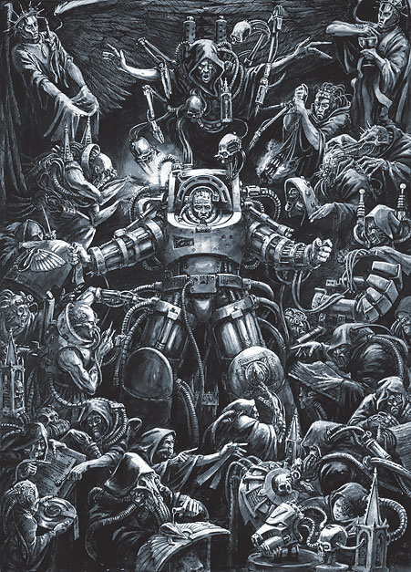

<!-- A1387-B0004 -->

原译文

Terminator Armour being equipped 开始装备的终结者甲

**校订译文**

Terminator Armour being equipped 正在穿戴终结者盔甲

<!-- /A1387-B0004 -->

<!-- A1387-B0005 -->
###### Overview 概述

<!-- /A1387-B0005 -->

<!-- A1387-B0006 -->
## Design 设计

<!-- /A1387-B0006 -->

<!-- A1387-B0007 -->
**英文原文**

Like power armour, Terminator suits have an outer shell of ceramite-bonded plates powered by electrically-motivated fibre bundles. Plates of heavy plasteel further armour the ceramite sections, especially on the front of the suit. This extra armouring provides a level of protection that is far superior to normal Marine armor; not even a Krak missile will penetrate the suit's breastplate. It has even been noted to allow its wearer to survive being stood on by a Titan. It also contributes to the immense weight of the suit, making the wearer less maneuverable and slower. External adamantium ribs help support this weight, while the inclusion of suspensors help the suit carry heavier support weapons.

<!-- /A1387-B0007 -->

<!-- A1387-B0008 -->

原译文

像动力盔甲一样，终结者套装有一个由陶钢结合板组成的外壳，由电动纤维束提供动力。厚塑钢板进一步保护了陶钢部分，尤其是在套装的前部。这种额外的装甲提供了远远优于普通星际战士装甲的保护水平；即使是穿甲导弹也无法穿透套装的胸甲。甚至有人注意到，甚至有人注意到，它能让佩戴者在被一架泰坦踩在脚下时存活下来。这也导致了套装的巨大重量，使穿着者的机动性降低，速度变慢。外部的精金骨架有助于支撑这种重量，而悬带的加入则有助于套装携带更重的支援武器。

**校订译文**

与动力盔甲一样，终结者盔甲以陶钢复合板构成外壳，由电动纤维束驱动。陶钢部位还有厚重的塑钢板加强防护，正面尤其如此。这些额外装甲使其防护能力远胜普通星际战士盔甲；即便穿甲导弹也无法击穿其胸甲。据记载，甚至有穿戴者在遭泰坦踩踏后仍然生还。不过，额外装甲也带来了巨大的重量，使穿戴者行动更慢、机动性更差。外部的精金骨架帮助承重，悬浮装置则使盔甲能够携带更重的支援武器。

<!-- /A1387-B0008 -->

<!-- A1387-B0009 图片 -->
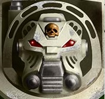

<!-- A1387-B0010 -->

原译文

Indomitus Pattern helmet 不屈型头盔

**校订译文**

Indomitus Pattern helmet 不屈型头盔

<!-- /A1387-B0010 -->

<!-- A1387-B0011 -->
**英文原文**

Displayed on the left shoulder of every Terminator suit is the Crux Terminatus badge - those worn by Terminator Captains are said to contain a piece of the Terminator Armour that the Emperor wore when he fought Horus during the final battle of the Horus Heresy.

<!-- /A1387-B0011 -->

<!-- A1387-B0012 -->

原译文

每件终结者套装的左肩上都展示着终结者十字徽章 - 据说终结者连长佩戴的徽章上有一块终结者盔甲，是帝皇在荷鲁斯叛乱的最后一场战斗中与荷鲁斯作战时穿戴的。

**校订译文**

每套终结者盔甲的左肩上都带有终结者十字章。据说，终结者连长佩戴的十字章中，嵌有一块帝皇在荷鲁斯之乱最终决战中对抗荷鲁斯时所穿终结者盔甲的碎片。

**校注：** 英文明确限定“连长佩戴的徽章”，并称帝皇所穿为Terminator Armour；本篇后文对碎片的分配范围及甲种表述不同。保留各段版本差异，不据记忆统一设定。

<!-- /A1387-B0012 -->

<!-- A1387-B0013 -->
**英文原文**

Like power armor, Terminator armour is fully enclosed with life-support functions, and includes an array of sensors including radiation monitors, biological detectors and self-diagnostic scanners. Terminator Armour also incorporates many more auxiliary systems than normal Marine power armour, including motion sensors and threat detectors. The armour's sensorium, based upon tendril sensors, links directly into the wearer's own awareness. The sensorium allows the wearer to use a vast number of scanners and detectors without conscious thought. Sensoriums can also be linked together, allowing every squad member to see exactly the same view of the battle as his comrades, though often only the Sergeant's suit will broadcast pict-signals.

<!-- /A1387-B0013 -->

<!-- A1387-B0014 -->

原译文

与动力盔甲一样，终结者盔甲完全封闭，具有生命支持功能，并包括一系列传感器，包括辐射监测器、生物探测器和自诊断扫描仪。终结者盔甲还集成了比普通星际战士动力盔甲更多的辅助系统，包括运动传感器和威胁探测器。盔甲的感官基于卷须传感器，直接连接到穿戴者自己的意识中。感觉器官允许穿戴者在没有意识思考的情况下使用大量的扫描仪和探测器。传感器也可以连接在一起，使每个小队成员都能看到与战友完全相同的战斗视图，尽管通常只有军士的套装会播放图片信号。

**校订译文**

与动力盔甲一样，终结者盔甲完全密封，具有生命维持功能，并配备辐射监测器、生物探测器和自诊断扫描仪等传感设备。它的辅助系统比普通星际战士动力盔甲更丰富，还包括运动传感器和威胁探测器。盔甲的感知系统通过触须式传感器，直接与穿戴者的意识相连，使其无需有意识地操控，就能调用大量扫描仪和探测器。各套盔甲的感知系统还可以联网，让小队成员共享战场视野，不过通常只有军士的盔甲会向其他成员传输影像信号。

<!-- /A1387-B0014 -->

<!-- A1387-B0015 -->
**英文原文**

Terminator armour is also notable for incorporating a Teleport homer in each suit. This technology allows the squad to overcome their suits' lack of manoeuvrability by placing them directly in the enemy's midst, though the process is dangerous and sometimes inaccurate. In other cases, Terminator squads will be transported into battle by Drop Pods or Land Raiders.

<!-- /A1387-B0015 -->

<!-- A1387-B0016 -->

原译文

终结者盔甲也因在每件套装中加入一个传送信标而闻名。这项技术使小队能够通过将套装直接放在敌人中间来克服套装缺乏机动性的问题，尽管这个过程很危险，有时甚至不准确。在其他情况下，终结者小队将由空降仓或兰德掠袭者运送到战斗中。

**校订译文**

终结者盔甲的另一项著名配置，是每套盔甲中都装有传送信标。这项技术让小队能够直接传送到敌群之中，弥补机动性不足的问题，尽管传送过程危险，有时落点也不准确。终结者小队也会乘坐空降舱或兰德掠袭者战车投入战斗。

**校注：** 此处沿英文将传送能力与Teleport Homer并述；第1396篇将其解释为引导落点的信标。不要由本句推断信标自身就是传送装置。

<!-- /A1387-B0016 -->

<!-- A1387-B0017 -->
## Armament 军备

<!-- /A1387-B0017 -->

<!-- A1387-B0018 -->
**英文原文**

Due to the massive strength its fibre bundles and advanced servo-motors afford the wearer, weapons normally too heavy to be considered man-portable can be used without impeding performance. Heavy flamers and assault cannons can be wielded as easily as a normal man would a handle a lasgun or boltgun.

<!-- /A1387-B0018 -->

<!-- A1387-B0019 -->

原译文

由于其纤维束和先进的伺服电机为佩戴者提供了巨大的力量，通常太重而不能被认为是便携式的武器可以在不影响性能的情况下使用。重型火焰枪和突击炮可以像普通人挥舞激光枪或爆矢枪一样轻松地使用。

**校订译文**

纤维束和先进的伺服电机为穿戴者提供了惊人的力量，使他们能够正常使用那些通常过于沉重、无法由单兵携行的武器。终结者操纵重型火焰喷射器和突击炮，就像普通人使用激光枪或爆矢枪一样轻松。

<!-- /A1387-B0019 -->

<!-- A1387-B0020 -->
**英文原文**

Terminator Armour has its own integrated weaponry: a storm bolter and a power fist. The Storm Bolter is a multi-chambered, short-barrelled development of the trusty standard bolter already used by the Astartes. It shoots at a faster rate than the original weapon, allowing it to lay down a curtain of fire. It is also quite short, partly because it is built into the exo-armour, making it an ideal close combat weapon. Such a combination in a single weapon has proven useful, to say the least. The power fist is already standard issue in many Chapters, and needs little work to adapt it to exo-armour.

<!-- /A1387-B0020 -->

<!-- A1387-B0021 -->

原译文

终结者盔甲有自己的集成武器：风暴爆矢枪和动力拳。风暴爆矢枪是阿斯塔特已经使用的可靠标准爆矢枪的多管短型发展。它的射击速度比起源武器快，使其能够发射火力弹幕。它也很短，部分原因是它内置于外甲中，使其成为理想的近战武器。至少可以说，这种单一武器的组合已被证明是有用的。在许多战团中，动力拳已经是标准供应，几乎不需要做什么来使其适配外甲。

**校订译文**

终结者盔甲有与之整合的武器：风暴爆矢枪和动力拳。风暴爆矢枪由阿斯塔特一直使用的可靠标准爆矢枪发展而来，采用多膛室、短枪管设计。它的射速高于原型武器，能够形成火力帷幕。枪身也十分紧凑，部分原因在于它与外骨骼装甲整合，使其成为理想的近距离作战武器。将这些特性集于一件武器，显然十分实用。动力拳则早已是许多战团的标准装备，只需少量调整便可与外骨骼装甲适配。

**校注：** multi-chambered为多膛室，非多枪管；close combat在此描述枪械用于近距离战斗，不改称近战格斗武器。

<!-- /A1387-B0021 -->

<!-- A1387-B0022 图片 -->
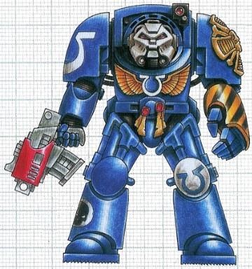

<!-- A1387-B0023 -->

原译文

Terminator with Power Fist and Storm Bolter 装备风暴爆矢枪和动力拳的终结者

**校订译文**

Terminator with Power Fist and Storm Bolter 装备风暴爆矢枪和动力拳的终结者

<!-- /A1387-B0023 -->

<!-- A1387-B0024 -->
**英文原文**

Heavier weapons include the heavy flamer, the assault cannon, Grenade Harness, and the cyclone missile launcher. Normally one squad member will be designated as fire support and carry one of these weapons.

<!-- /A1387-B0024 -->

<!-- A1387-B0025 -->

原译文

较重的武器包括重型火焰枪、突击炮、背带式榴弹发射器和旋风导弹发射器。通常，一名小队成员将被指定为火力支援，并携带其中一件武器。

**校订译文**

可选的重型武器包括重型火焰喷射器、突击炮、背带式榴弹发射器和旋风导弹发射器。通常，小队会指定一名成员负责火力支援，由他携带其中一种武器。

<!-- /A1387-B0025 -->

<!-- A1387-B0026 -->
**英文原文**

Some Terminator squads, designated specifically for close-quarter combat, while eschew any ranged weapons in favor of either Lightning Claws or a combination of Thunder Hammer and Storm Shield.

<!-- /A1387-B0026 -->

<!-- A1387-B0027 -->

原译文

一些终结者小队专门用于近距离战斗，同时避免任何远程武器，转而使用闪电爪或雷霆锤和风暴盾的组合。

**校订译文**

一些终结者小队专门执行近战任务，完全舍弃远程武器，转而装备闪电爪，或雷霆锤与风暴盾的组合。

<!-- /A1387-B0027 -->

<!-- A1387-B0028 -->
## Tactical use 战术使用

<!-- /A1387-B0028 -->

<!-- A1387-B0029 -->
**英文原文**

Most Marine chapters maintain some Terminator suits in their armouries, and train some squads in their use. However, Terminator armour is not used by these Marines as a matter of course, but issued as and when required. Conventionally armoured Marines, for example, would not be expected to clear the densely-packed corridors of a hive world. Their task would be to form a cordon while Terminator-armoured squads carried out the clearance.

<!-- /A1387-B0029 -->

<!-- A1387-B0030 -->

原译文

大多数星际战士战团在他们的军械库中都保留了一些终结者套装，并训练了一些小队使用它们。然而，这些星际战士当然不会使用终结者装甲，而是在需要时发放。例如，着甲的星际战士预计不会清理巢都世界中拥挤的廊道。他们的任务是在终结者盔甲小队进行清理时形成警戒线。

**校订译文**

大多数星际战士战团的军械库都保有一定数量的终结者盔甲，并训练了若干能够使用它们的小队。不过，这些战士并不在日常作战中一概穿着终结者盔甲，而是按任务需要领取。例如，清剿巢都世界拥挤通道的任务，不会交给身穿普通动力盔甲的星际战士；他们会建立警戒线，由终结者小队进入通道清剿。

<!-- /A1387-B0030 -->

<!-- A1387-B0031 -->
**英文原文**

By the 41st millennium, Terminator armour is so prized that its use is reserved for when it will be at its most effective. Terminators may be used in boarding actions, where the cramped conditions and long corridors mean that the Terminator's strength and firepower can be brought to bear without the risk of flanking manoeuvres. Terminator armour may also be deployed on the open battlefield, either to wield devastating long-range fire with their heavy weapons, or deep-strike teleporting to attack the enemy's command structure.

<!-- /A1387-B0031 -->

<!-- A1387-B0032 -->

原译文

到了第41个千年，终结者盔甲变得如此珍贵，以至于只能在最有效的时候使用。终结者可用于跳帮行动，狭窄的状况和漫长的走廊意味着终结者的力量和火力可以在没有侧翼机动风险的情况下发挥作用。终结者装甲也可以部署在开阔的战场上，要么用重型武器进行毁灭性的远程射击，要么通过深入打击传送来攻击敌人的指挥体系。

**校订译文**

到第41个千年，终结者盔甲已极为珍贵，只有在最能发挥其效能的场合才会投入使用。跳帮作战便是其中之一：狭窄的空间和漫长的走廊，能让终结者充分发挥力量与火力，又不必担心敌人绕到侧翼。在开阔战场上，终结者可以用重型武器实施毁灭性的远程射击，也可以通过传送发动深度打击，直袭敌方指挥体系。

<!-- /A1387-B0032 -->

<!-- A1387-B0033 -->
###### History 历史

<!-- /A1387-B0033 -->

<!-- A1387-B0034 -->
## Development 发展

<!-- /A1387-B0034 -->

<!-- A1387-B0035 -->
**英文原文**

Terminator armour was developed during the Great Crusade by the Adeptus Mechanicus Tech Adepts of Mars. Its design is a blend of Dreadnought armour, standard Marine power armour and heavy suits used by engineers working in the most hostile environments (such as micro-debris-plagued orbits or the radioactive engine cores of stellar frigates). It was first intended to provide heavy armour and firepower to troops fighting in cramped battle zones, such as the claustrophobic tunnels of hive worlds and Space Hulks, which are too confined for Dreadnoughts and vehicles. It has been stated that had the Horus Heresy not broken out, the Legiones Astartes may have issued Terminator armour as the de facto wargear.

<!-- /A1387-B0035 -->

<!-- A1387-B0036 -->

原译文

终结者盔甲是在大远征期间由火星的机械神教技术专家开发的。它的设计融合了无畏装甲、标准星际战士动力盔甲和在最恶劣环境（如微型碎片困扰的轨道或恒星护卫舰的放射性发动机核心）中工作的工程师使用的重型套装。它最初的目的是为在狭窄的战区作战的部队提供重型装甲和火力，例如巢都世界和太空废船的恐怖幽闭隧道，这些隧道对无畏和车辆来说过于狭窄。据说，如果荷鲁斯叛乱没有爆发，阿斯塔特军团可能会发放终结者盔甲作为事实上的战争装备。

**校订译文**

终结者盔甲由火星机械修会的技术专家在大远征期间研发。其设计融合了无畏装甲、标准星际战士动力盔甲，以及工程师在极端恶劣环境中使用的重型防护服；这类环境包括遍布微小碎片的轨道，以及星际护卫舰中充满辐射的引擎核心。终结者盔甲最初旨在为狭窄战区中的部队提供重装甲和强大火力，例如巢都世界和太空废船中令人窒息的隧道，那里容不下无畏机甲或车辆。据称，若荷鲁斯之乱没有爆发，阿斯塔特军团或许会将终结者盔甲列为标准作战装备。

**校注：** 英文在大远征历史语境仍称Adeptus Mechanicus；按本稿译名机械修会保留原称，不擅改为Mechanicum。

<!-- /A1387-B0036 -->

<!-- A1387-B0037 图片 -->

<!-- A1387-B0038 -->

原译文

Terminator Armour early design 早期设计的终结者甲

**校订译文**

Terminator Armour early design 早期设计的终结者甲

<!-- /A1387-B0038 -->

<!-- A1387-B0039 -->
**英文原文**

Several designs of Terminator armour evolved in parallel from the forge worlds of the Adeptus Mechanicus and the armouries of the Marines. Often bearing little physical resemblance to each other, these different exo-armour suits in fact have much in common. Massively armoured, sealed against any external conditions and incorporating their own armament, Terminator armour designs proved their worth from the first. Like power armour, the suits were equipped with fibre-bundle muscles and imposed few movement restrictions upon the wearer, despite their immense weight.

<!-- /A1387-B0039 -->

<!-- A1387-B0040 -->

原译文

终结者盔甲的几种设计是从机械神教的锻造世界和星际战士的军械库并行进化而来的。这些不同的外甲通常彼此几乎没有什么相似之处，但实际上有很多共同点。终结者装甲设计坚固耐用，可抵御任何外部状况，并配有自己的武器，从一开始就证明了它们的价值。与动力盔甲一样，这些套装配备了纤维束肌肉，尽管重量巨大，但对穿着者几乎没有运动限制。

**校订译文**

机械修会的各个铸造世界与星际战士军械库曾同时发展出数种终结者盔甲设计。这些外骨骼装甲的外观往往大相径庭，实际上却有许多共同之处：厚重的防护、隔绝外界环境的密封结构，以及与盔甲整合的武器。这些特点使终结者盔甲从问世之初就证明了自身价值。与动力盔甲一样，它们配有纤维束肌肉，虽然重量惊人，却很少限制穿戴者的肢体动作。

**校注：** 本句称助力系统很少限制肢体动作，前文仍明确盔甲沉重导致移动迟缓；保留两处原文表述。

<!-- /A1387-B0040 -->

<!-- A1387-B0041 图片 -->
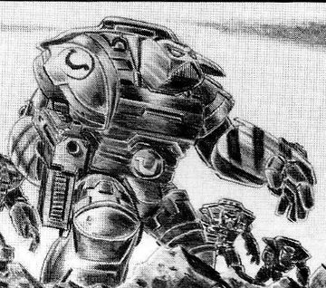

<!-- A1387-B0042 -->

原译文

Terminator Armour early design 早期设计的终结者甲

**校订译文**

Terminator Armour early design 早期设计的终结者甲

<!-- /A1387-B0042 -->

<!-- A1387-B0043 -->
**英文原文**

Terminator armor was originally meant to replace normal power armor, however the destruction wrought by the Horus Heresy destroyed many of these suits, and the limited resources left after the war ended combined with the complexity of building and maintaining Terminator suits contributed to their increase rarity.

<!-- /A1387-B0043 -->

<!-- A1387-B0044 -->

原译文

终结者盔甲最初是为了取代普通的动力盔甲，然而荷鲁斯叛乱造成的破坏摧毁了许多这样的装甲，战争结束后留下的有限资源，再加上建造和维护终结者装甲的复杂性，导致它们越来越稀有。

**校订译文**

终结者盔甲原本是为取代普通动力盔甲而设计的。然而，荷鲁斯之乱摧毁了大量终结者盔甲，战后资源又十分有限，加上制造和维护工艺复杂，使这种装备日益稀少。

<!-- /A1387-B0044 -->

<!-- A1387-B0045 -->
**英文原文**

Today Terminator suits are highly prized by their Chapters and kept in a constant state of repair and renewal. Although the Adeptus Mechanicus still maintains limited production of Terminator suits, the rate is so slow that often a "new" suit is cobbled together from refurbished parts salvaged from the battlefield. This explains the sometimes disparate and ragged look of Terminator squads. Indeed, as time marches onward the knowledge of how to fabricate some of the more complex pieces becomes an increasingly faded memory in the decrepit minds of the Adeptus Mechanicus, and "reverse engineering" is an all-too-common science in the 41st millennium.

<!-- /A1387-B0045 -->

<!-- A1387-B0046 -->

原译文

如今，终结者套装被战团高度重视，并保持不断的维修和更新状态。尽管机械神教仍然保持着有限的终结者套装生产，但速度非常缓慢，以至于经常用从战场上回收的翻新零件拼凑出“新”套装。这就解释了终结者小队有时看起来完全不同、衣衫褴褛的原因。事实上，随着时间的推移，如何制造一些更复杂的零件的知识在机械神教们衰老的头脑中变得越来越淡，“逆向工程”在第41个千年是一门非常普遍的科学。

**校订译文**

如今，各战团都极为珍视终结者盔甲，不断对其进行维修和更新。机械修会虽然仍能少量生产，但速度极慢，所谓“新”盔甲往往是用战场回收后翻修的零件拼装而成。这也解释了为何终结者小队的盔甲有时样式各异、拼接痕迹明显。事实上，随着时间流逝，制造某些精密部件的知识在机械修会成员衰老的头脑中日渐模糊；到了第41个千年，“逆向工程”已是一门极为普遍的学问。

<!-- /A1387-B0046 -->

<!-- A1387-B0047 -->
## Patterns 型号

<!-- /A1387-B0047 -->

<!-- A1387-B0048 -->
### Cataphractii Pattern 铁骑型

<!-- /A1387-B0048 -->

<!-- A1387-B0049 -->
**英文原文**

This pattern was among the first issued to the Space Marine Legions, and was used during the late Great Crusade and Horus Heresy by both the Space Marines and the Legio Custodes. Although it was rare before the Horus Heresy, some Legions, such as the Iron Hands, possessed a large number of suits.

<!-- /A1387-B0049 -->

<!-- A1387-B0050 -->

原译文

这种型号是首批发给星际战士军团的型号之一，在大远征和荷鲁斯叛乱后期，星际战士和禁卫军团都使用了这种型号。虽然在荷鲁斯叛乱之前很少见，但一些军团，如钢铁之手军团，拥有大量的套装。

**校订译文**

铁骑型是最早配发给星际战士军团的终结者盔甲型号之一。大远征晚期及荷鲁斯之乱期间，星际战士和禁军军团都曾使用。尽管它在荷鲁斯之乱爆发前较为少见，钢铁之手等军团仍保有大量铁骑型盔甲。

<!-- /A1387-B0050 -->

<!-- A1387-B0051 图片 -->
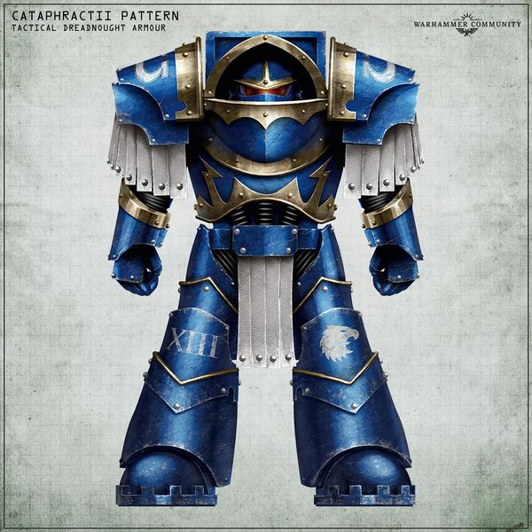

<!-- A1387-B0052 -->

原译文

Cataphractii-pattern Terminator Armour 铁骑型终结者盔甲

**校订译文**

Cataphractii-pattern Terminator Armour 铁骑型终结者盔甲

<!-- /A1387-B0052 -->

<!-- A1387-B0053 -->
**英文原文**

In addition to being distinguished by its large, layered pauldrons, and the pteruges protecting the elbow and thigh joints, it was functionally distinct from other patterns, bearing additional plating and shield generators installed within the shoulder pads. This resulted in severe straining of the suit's exoskeleton and reduced the wearer's movement speed, leading to its decline among some Space Marine Legions during the early battles of the Heresy.

<!-- /A1387-B0053 -->

<!-- A1387-B0054 -->

原译文

除了以其大而分层的肩甲和保护肘关节和大腿关节的翼状物而闻名外，它在功能上与其他型号不同，在肩甲内安装了额外的镀层和屏蔽发生器。这导致了套装外骨骼的严重受力，并降低了穿戴者的移动速度。导致其在叛乱早期战斗中在一些星际战士军团中衰落。

**校订译文**

铁骑型以宽大的层叠肩甲，以及保护肘部和大腿关节的垂片而著称。它在功能上也有别于其他型号：不仅加装了额外甲片，肩甲中还装有护盾发生器。这大大增加了外骨骼的负荷，降低了穿戴者的移动速度，因而在荷鲁斯之乱初期的战斗中，部分军团开始减少对它的使用。

**校注：** pteruges为垂片式护裙构件，非“翼状物”；原文仅将护盾发生器明确置于肩甲中。

<!-- /A1387-B0054 -->

<!-- A1387-B0055 -->
**英文原文**

One sub-type of Cataphractii Armour was known to be used by the Deathwing of the Dark Angels Legion, who made use of late-production, forge-modified Cataphractii pattern Terminator suits, featuring additional Artificer-constructed ablative armour styled as Legion icons. This modification bore ornate livery and insignia unique to the later deployments of the Dark Angels Legion in the era of the Great Crusade and early wars of the Horus Heresy.

<!-- /A1387-B0055 -->

<!-- A1387-B0056 -->

原译文

众所周知，黑暗天使军团的死翼使用了一种铁骑盔甲的子类型，他们利用后期生产，铸造了改良的铁骑型终结者套装，其特征是额外的精工制造的烧蚀盔甲，被称为军团圣像。这种修改带有华丽的色彩和徽章，这是大远征和荷鲁斯叛乱早期战争时期黑暗天使军团后期部署所特有的。

**校订译文**

黑暗天使军团的死翼曾使用一种铁骑型的衍生型号。这些盔甲出自后期生产批次，并经过铸造工坊改装，加装了由精工匠师制作、塑成军团徽记式样的消融装甲。其华丽涂装与徽章，体现了黑暗天使军团在大远征后期及荷鲁斯之乱初期出征时的独特风格。

<!-- /A1387-B0056 -->

<!-- A1387-B0057 图片 -->
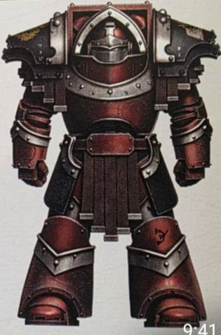

<!-- A1387-B0058 -->

原译文

Cataphractii-pattern Terminator variant 铁骑型终结者盔甲变体

**校订译文**

Cataphractii-pattern Terminator variant 铁骑型终结者盔甲变体

<!-- /A1387-B0058 -->

<!-- A1387-B0059 -->
**英文原文**

Some Cataphractii Armour suits are equipped with a Grenade Harness.

<!-- /A1387-B0059 -->

<!-- A1387-B0060 -->

原译文

一些铁骑盔甲套装配备了背带式榴弹发射器。

**校订译文**

一些铁骑盔甲套装配备了背带式榴弹发射器。

<!-- /A1387-B0060 -->

<!-- A1387-B0061 -->
**英文原文**

In the M42 Cataphractii Armour is still used but as a relic rare armour and used only under the important circumstances.

<!-- /A1387-B0061 -->

<!-- A1387-B0062 -->

原译文

在M42中，铁骑盔甲仍然被使用，但作为一种稀有的盔甲，仅在重要情况下使用。

**校订译文**

到M42，铁骑型仍在服役，但已是稀有的圣物盔甲，仅在重要场合投入使用。

<!-- /A1387-B0062 -->

<!-- A1387-B0063 -->
### Tartaros Pattern 冥府型

<!-- /A1387-B0063 -->

<!-- A1387-B0064 -->
**英文原文**

This pattern was issued after the introduction of the Mk IV Maximus-pattern power armour and is possibly considered the most advanced form of Tactical Dreadnought Armour, and was said to be a technological masterwork. It shared many systems with the Mk.IV, whilst providing greater mobility for the wearer compared to the later Indomitus Pattern with no loss in durability. The Tartaros pattern armour is strong enough to withstand blasts a hundred times more powerful than one produced by an Astartes frag grenade. It was also known to weigh several tonnes, yet is still more lightweight in comparison to other, more common Terminator armour patterns. Tartaros armour is more streamlined and power efficient than its predecessors, making it more agile and providing short bursts of extra speed when needed, but was also more difficult and resource intensive to manufacture.

<!-- /A1387-B0064 -->

<!-- A1387-B0065 -->

原译文

这种模式是在Mk IV 马克西姆型动力盔甲推出后发布的，可能被认为是战术无畏装甲中最先进的形式，据说是一项技术杰作。它与Mk.IV共享许多系统，同时与后来的不屈型相比，为穿戴者提供了更大的机动性，且耐用性没有损失。冥府型盔甲足够坚固，可以承受比阿斯塔特破片榴弹产生的爆炸威力大一百倍的爆炸。众所周知，它的重量为几吨，但与其他更常见的终结者装甲型号相比，它仍然更轻。冥府盔甲比其前身更流线型、更节能，使其更敏捷，并在需要时提供短时间的额外速度，但制造起来也更加困难和资源密集型。

**校订译文**

冥府型在Mk IV马克西姆型动力盔甲推出后问世，被认为可能是最先进的战术无畏盔甲，堪称技术杰作。它与Mk.IV共享许多系统，防护能力不逊于后来的不屈型，机动性却更强。冥府型据称足以承受威力达到阿斯塔特破片榴弹一百倍的爆炸。虽然重达数吨，它仍比其他更常见的终结者盔甲型号轻。其外形比早期型号更流线，能源利用效率也更高，因此行动更加敏捷，必要时还能短暂加速；代价则是制造难度更大，消耗的资源更多。

<!-- /A1387-B0065 -->

<!-- A1387-B0066 -->
**英文原文**

This pattern is issued to the Veterans of a Chapter's 1st Company and is possibly considered the most advanced form of Tactical Dreadnought Armour. It shared many systems with the Mk IV Maximus-pattern power armour whilst providing greater mobility for the wearer compared to the Indomitus with no loss in durability. This pattern was mostly used during the last years of the Great Crusade and during the Horus Heresy.

<!-- /A1387-B0066 -->

<!-- A1387-B0067 -->

原译文

这种型号发给一个战团第一连的老兵，可能被认为是战术无畏装甲的最先进形式。它与Mk IV 马克西姆型动力盔甲共享许多系统，同时与不屈相比，为穿戴者提供了更大的机动性，且耐久性没有损失。这种型号主要在大远征的最后几年和荷鲁斯叛乱时期使用。

**校订译文**

这一型号配发给战团第一连的老兵，被认为可能是最先进的战术无畏盔甲。它与Mk IV马克西姆型动力盔甲共享许多系统，在不牺牲防护能力的前提下，机动性优于不屈型。冥府型主要在大远征最后几年及荷鲁斯之乱时期使用。

**校注：** 本段与前段关于系统共享和机动性的内容重复。原文两段均保留，以便手工取舍。

<!-- /A1387-B0067 -->

<!-- A1387-B0068 -->
**英文原文**

In the M41 such a Armour are incredibly rare. Even so some of the Space Marine Chapters which have this suits in possession deploys these venerable relics, given them to the most able members of the 1st Company.

<!-- /A1387-B0068 -->

<!-- A1387-B0069 -->

原译文

在M41中，这样的装甲非常罕见。即便如此，一些拥有这套套装的星际战士战团还是部署了这些古老的圣物，把它们交给了第一连最有能力的成员。

**校订译文**

到M41，冥府型盔甲已极为罕见。不过，仍有一些保有这种古老圣物的战团会将其投入战斗，交由第一连中最出色的成员穿戴。

<!-- /A1387-B0069 -->

<!-- A1387-B0070 图片 -->
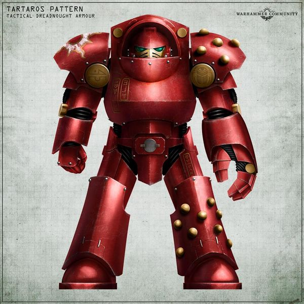

<!-- A1387-B0071 -->

原译文

Tartaros Pattern Terminator Armour 冥府型终结者甲

**校订译文**

Tartaros Pattern Terminator Armour 冥府型终结者甲

<!-- /A1387-B0071 -->

<!-- A1387-B0072 -->
### Indomitus Pattern 不屈型

<!-- /A1387-B0072 -->

<!-- A1387-B0073 -->
**英文原文**

Though they first appeared during the Horus Heresy the Indomitus Pattern Terminator Armour is noted for being the most widespread pattern as of M41, due to its template being held by key Forge Worlds such as Mars.

<!-- /A1387-B0073 -->

<!-- A1387-B0074 -->

原译文

尽管它们最早出现在荷鲁斯叛乱时期，但因其模板被火星等关键铸造世界所持有，不屈型终结者盔甲被认为是M41以来最普遍的型号。

**校订译文**

不屈型最早出现于荷鲁斯之乱时期。由于火星等重要铸造世界掌握其标准建造模板，它成为M41最常见的终结者盔甲型号。

<!-- /A1387-B0074 -->

<!-- A1387-B0075 -->
**英文原文**

It features large rounded pauldrons and an iconic helmet design that resembles the face of a long-extinct species of Terran canid. On each suit’s left shoulder sits the revered Crux Terminatus. These sacred icons are said to incorporate a shard of the golden armour that the Emperor wore in His fateful duel with Horus, and serves a reminder of His noble sacrifice.

<!-- /A1387-B0075 -->

<!-- A1387-B0076 -->

原译文

它的特点是巨大的圆形肩甲和标志性的头盔设计，类似于早已灭绝的泰拉犬科动物的脸。每套套装的左肩甲上都镶嵌着令人尊敬的终结者十字章。据说这些神圣的图符中包含了帝皇在与荷鲁斯的决定性决斗中所穿的金甲碎片，并提醒人们他做出了崇高的牺牲。

**校订译文**

不屈型的特点是宽大圆润的肩甲，以及形似早已灭绝的泰拉犬科动物面孔的标志性头盔。每套盔甲的左肩甲上都镶有备受尊崇的终结者十字章。据说，这些神圣徽记中封存着帝皇与荷鲁斯决战时所穿金甲的碎片，用以纪念他的崇高牺牲。

<!-- /A1387-B0076 -->

<!-- A1387-B0077 图片 -->
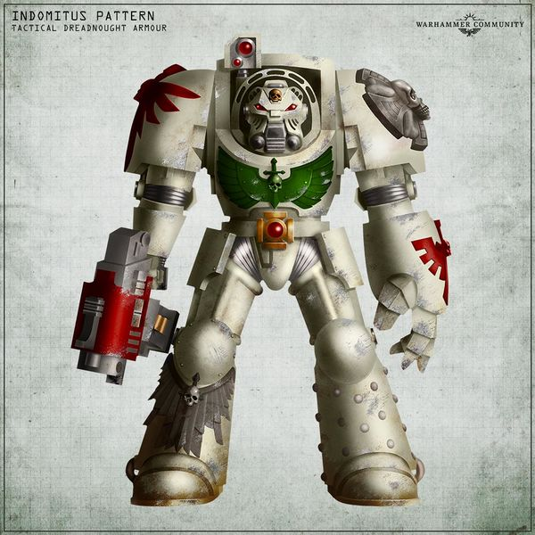

<!-- A1387-B0078 -->

原译文

Indomitus Pattern Terminator 不屈型终结者

**校订译文**

Indomitus Pattern Terminator 不屈型终结者

<!-- /A1387-B0078 -->

<!-- A1387-B0079 -->
### Gorgon Pattern 戈尔贡型

<!-- /A1387-B0079 -->

<!-- A1387-B0080 -->
**英文原文**

A variant of the Indomitus Pattern devised by the Primarch Ferrus Manus and the Iron Fathers, this advanced prototype suit was just going into production at the onset of the Horus Heresy. The design replaced field generators embedded in the armour with experimental systems that converted incoming electromagnetic and kinetic energy into bursts of blinding light, able to incapacitate nearby foes. The heat and electrochemical toxins bleeding from the suit limited the armour's agility, and its effects required a high level of cybernetic modifications for its wearer to endure.

<!-- /A1387-B0080 -->

<!-- A1387-B0081 -->

原译文

这套先进的原型套装是由原体费鲁斯·马努斯和铁父们设计的不屈型的变体，在荷鲁斯叛乱开始时刚刚投入生产。该设计用实验系统取代了嵌入装甲中的力场发生器，该系统将射入的电磁能和动能转化为致盲光，能够使附近的敌人丧失能力。从盔甲中渗出的热能和电化学毒素限制了盔甲的灵活性，其效果需要高度的智控改造才能让穿着者忍受。

**校订译文**

戈尔贡型是不屈型的一种变体，由原体费鲁斯·马努斯与钢铁圣父们设计。荷鲁斯之乱爆发时，这种先进的原型盔甲刚开始投入生产。其设计以实验性系统取代了原有的内置力场发生器，将来袭的电磁能与动能转化为刺眼的闪光，使附近敌人丧失行动能力。盔甲散发的热量和电化学毒素限制了其灵活性；穿戴者也必须接受高度机械改造，才能承受这些副作用。

<!-- /A1387-B0081 -->

<!-- A1387-B0082 图片 -->
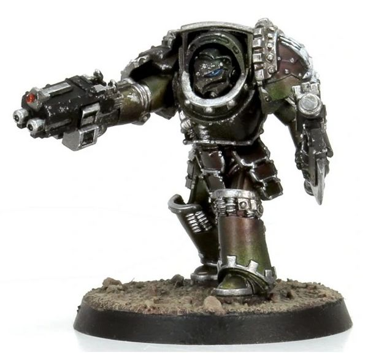

<!-- A1387-B0083 -->

原译文

Gorgon Pattern Terminator Armour 戈尔贡型终结者甲

**校订译文**

Gorgon Pattern Terminator Armour 戈尔贡型终结者甲

<!-- /A1387-B0083 -->

<!-- A1387-B0084 -->
**英文原文**

Despite almost being exiles, Autek Mor's own Iron Hands were able to replicate the Gorgon Pattern and use it themselves during the war.

<!-- /A1387-B0084 -->

<!-- A1387-B0085 -->

原译文

尽管奥泰克·摩尔几乎是流亡者，但他自己的钢铁之手能够复制戈尔贡型，并在战争期间自己使用。

**校订译文**

尽管几乎处于被放逐的境地，奥特克·莫尔麾下的钢铁之手仍成功复制了戈尔贡型，并在战争中自行使用。

<!-- /A1387-B0085 -->

<!-- A1387-B0086 -->
### Salamanders prototype Terminators 火蜥蜴原型终结者

<!-- /A1387-B0086 -->

<!-- A1387-B0087 -->
**英文原文**

These prototypes were designed by Vulkan himself, and used by the Salamanders in the aftermath of the Drop Site Massacre. They were much wider and taller than standard legionary power armour, and featured an additional exoskeleton frame to which slanted reinforced armor plates were attached. Left hands carried Power fists, claws and Chainblades for close combat, opening armour and cutting through bulkheads, while right hands wielded a variety of small arms ranging from simple combi-bolters to triple-barreled autocannons, Plasma Launchers, Rocket Launchers and long-barrelled Volkite Culverin.

<!-- /A1387-B0087 -->

<!-- A1387-B0088 -->

原译文

这些原型是由沃坎自己设计的，并在登陆点大屠杀后被火蜥蜴使用。它们比标准的军团动力盔甲宽得多，高得多，并配有一个额外的外骨骼框架，上面连接着倾斜的加强装甲板。左手手持动力拳、利爪和链锯刃，用于近战、打开盔甲和切割舱壁，而右手则挥舞着各种小型武器，从简单的复合爆矢枪到三管自动炮、等离子发射器、火箭发射器和长管爆燃长炮。

**校订译文**

这些原型盔甲由沃坎亲自设计，在登陆点大屠杀后由火蜥蜴使用。它们远比标准军团动力盔甲高大宽阔，额外的外骨骼框架上固定着倾斜的加强装甲板。左手可装备动力拳、利爪或链锯刃，用于近战、破开装甲和切割舱壁；右手则配备各种射击武器，从简单的复合爆矢枪，到三管自动炮、等离子发射器、火箭发射器以及长管爆燃长炮。

<!-- /A1387-B0088 -->

<!-- A1387-B0089 图片 -->
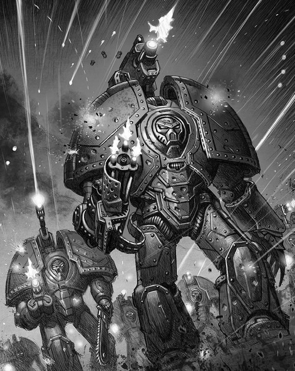

<!-- A1387-B0090 -->

原译文

Vulkan's Terminator Armour prototypes 沃坎的原型终结者甲

**校订译文**

Vulkan's Terminator Armour prototypes 沃坎的原型终结者甲

<!-- /A1387-B0090 -->

<!-- A1387-B0091 -->
### Saturnine Pattern 土星型

<!-- /A1387-B0091 -->

<!-- A1387-B0092 -->
**英文原文**

Saturnine pattern was made available after the MKVI Power Armour, during the latter stages of the Horus Heresy. Its pattern is described as being functionally identical to the Tartaros and Indomitus designs, and it is believed that any divergence in design was largely aesthetic. Little is known about the origins of these Terminator suits, and few examples of this pattern are known to still exist.

<!-- /A1387-B0092 -->

<!-- A1387-B0093 -->

原译文

在荷鲁斯叛乱后期，MKVI动力盔甲之后，土星型开始出现。它的型号被描述为在功能上与冥府和不屈的设计相同，人们认为设计上的任何分歧在很大程度上都是美学上的。人们对这些终结者套装的起源知之甚少，也很少有这种型号的例子仍然存在。

**校订译文**

土星型在荷鲁斯之乱后期、Mk VI动力盔甲问世之后出现。此处将它描述为在功能上与冥府型、不屈型相同，并认为设计差异主要体现在外观上。关于这些终结者盔甲的起源，已知信息很少，留存至今的实例也寥寥无几。

**校注：** 本篇混合不同年代资料：本段称土星型于荷鲁斯之乱后期出现、功能差异主要是外观；后文则追溯至统一战争后，并描述独特反应堆、武装和灵能要求。版本冲突未强行消解。

<!-- /A1387-B0093 -->

<!-- A1387-B0094 -->
**英文原文**

The Saturnine Pattern is the tallest, heaviest, and most technologically advanced type of Tactical Dreadnought Armour. The Saturnine Pattern featured an additional exoskeleton frame to which slanted reinforced armour plates were attached. Though slow and lumbering, they were nearly impenetrable to most forms of fire thanks to their heavy armour and Thermal Diffraction Fields. The armour also possessed superior targeting systems that allowed its users to accurately aim and fire multiple weapons simultaneously. However, like the Saturnine Dreadnought, only a warrior possessing sufficient mental strength and discipline could utilize the armour pattern. It has also been suggested that the user required a measure of cybertheurgic resonance, although few are willing to speak upon this. The exact level of innate psychic ability to operate the armour is unclear, save that it is above that of an average Space Marine but still well below that of a Librarian.

<!-- /A1387-B0094 -->

<!-- A1387-B0095 -->

原译文

土星型是最高、最重、技术最先进的战术无畏盔甲。土星型具有一个额外的外骨骼框架，上面连接着倾斜的加强装甲板。尽管缓慢而笨拙，但由于其厚重的盔甲和热衍射立场，它们几乎无法被大多数形式的火力穿透。该盔甲还拥有卓越的瞄准系统，使使用者能够同时准确瞄准和发射多种武器。然而，像土星无畏一样，只有拥有足够精神力量和纪律的战士才能使用盔甲型号。也有人认为，使用者需要一定程度的智控共鸣，尽管很少有人愿意就此发表意见。操作盔甲的先天灵能能力的确切水平尚不清楚，除了它高于普通星际战士的水平，但仍远低于智库的水平。

**校订译文**

土星型是体积最高大、重量最大、技术最先进的战术无畏盔甲。它具有额外的外骨骼框架，上面固定着倾斜的加强装甲板。虽然行动迟缓笨重，但凭借厚重装甲和热衍射力场，大多数火力都几乎无法将其击穿。先进的瞄准系统还能让穿戴者同时精确瞄准并发射多种武器。然而，与土星型无畏机甲一样，只有具备足够精神力量和自律能力的战士，才能操纵这种盔甲。也有人认为，使用者需要具备一定程度的智控神术共鸣，但鲜有人愿意详谈。操纵盔甲所需的先天灵能水平究竟有多高，尚不清楚；只知道它高于普通星际战士，却仍远低于智库。

**校注：** cybertheurgic resonance暂译智控神术共鸣，未找到官方中文对应；原文对操纵所需灵能仅给出相对水平，未明确数值。

<!-- /A1387-B0095 -->

<!-- A1387-B0096 -->
**英文原文**

Saturnine-pattern Armour originated from a banished Mechanicum Tech-Cabal from Saturn's moon of Phoebe, who thanks to their independence were able to develop technology based on Dark Age of Technology templates outside Martian dogma. Shortly after the Unification Wars, the Emperor signed the Phoebian Accord with the Tech-Enclave, giving them his direct protection while also gaining access to Saturnine Armour outside of the purview of the wider Mechanicum. As part of the Accords, the Tech-Enclaves sent attachés of Tech-Wrights to maintain Saturnine suits distributed to each Space Marine Legion.

<!-- /A1387-B0096 -->

<!-- A1387-B0097 -->

原译文

土星型盔甲起源于土星卫星土卫九的一个被驱逐的机械教技术阴谋团，由于他们的独立性，他们能够开发出基于火星教条之外的黑暗技术时代模板的技术。统一战争后不久，帝皇与技术飞地签署了《菲比安协议》，给予他们直接保护，同时也可以在更广泛的机械教权限之外使用土星盔甲。作为协议的一部分，技术飞地派遣了技术工人的专员来维护分发给每个星际战士军团的土星套装。

**校订译文**

土星型护甲最初出自土星卫星菲比上的一个机械教技术结社。这个遭到放逐的团体独立于火星教条之外，因此能够利用黑暗科技时代的模板发展技术。统一战争结束后不久，帝皇与该技术社群签订《菲比安协议》，给予其直接保护，同时取得不受机械教整体体系管辖的土星型护甲来源。根据协议，这些技术社群向各星际战士军团派驻维护技师，负责保养配发的土星型护甲。

**校注：** Phoebe沿地理定译菲比（即土卫九）；Tech-Cabal为技术结社，不将cabal一概译成阴谋团。

<!-- /A1387-B0097 -->

<!-- A1387-B0098 -->
**英文原文**

However, this proved to be problematic as the Great Crusade wore on and its Expeditionary Fleets outgrew the number of Tech-Wrights the Enclaves could send. Eventually, many fleets were forced to keep their damaged Saturnine Terminator Armour in storage, until they took on Tech-Wrights or returned to the Sol System. By the end of the Great Crusade, this limitation had led the Saturnines to be replaced by the more easily available and repairable Cataphractii and Tartaros Terminator Armours. Saturnine Armour was already fading into myth by the end of the Great Crusade until the Primarch Vulkan sought to recover the design. He was successful, and subsequently handed the revived pattern out to the rest of the Legiones Astartes and wider Mechanicum. Saturnine Armour thus saw use on both sides in the Horus Heresy, though it first appeared on the battlefield in meaningful numbers in Salamanders use during the Drop Site Massacre, in use with units such as the Pyre Wardens and Saturnine Excubitor Cadre. After witnessing its immense destructive power in Salamanders use on Isstvan V, Perturabo quickly issued Saturnine Armour into his own ranks en masse. By the time of the Siege of Inwit there were entire heavy assault companies of the Iron Warriors equipped with this pattern, such as the Tekathikos. The Blood Angels soon followed suit, as seen with units such as the Colossi. Other Saturnine formations included the Helwrought of the Iron Hands, the Phraetus Anointed of the Word Bearers, and the Indurate of the World Eaters. Later Vulkan-derived Saturnine suits were distinguished from older Phoebian ones, which were dubbed Phoebian-issue Saturnine Armour.

<!-- /A1387-B0098 -->

<!-- A1387-B0099 -->

原译文

然而，随着大远征的进行，其远征舰队的数量超过了飞地可以发送的技术工人的数量，这被证明是有问题的。最终，许多舰队被迫将损坏的土星终结者装甲存放起来，直到他们拿到技术工人或返回太阳系。到大远征结束时，这一限制导致土星被更容易获得和维修的铁骑和冥府终结者盔甲所取代。大远征结束时，土星盔甲已经逐渐成为神话，直到原体沃坎试图恢复其设计。他取得了成功，随后将复活的型号交给了阿斯塔特军团的其他成员和更广泛的机械教。因此，土星盔甲在荷鲁斯叛乱中得到了双方的使用，尽管它在登陆点大屠杀期间首次在战场上大量出现在火蜥蜴身上，与柴薪守望者和土星守卫骨干等部队一起使用。在目睹了火蜥蜴在伊斯塔万五号的巨大破坏力后，佩图拉博迅速将土星盔甲集体配发到自己的队伍中。到因维特围城时，钢铁勇士的整个重型突击连队都配备了这种型号，如破山者。圣血天使很快也效仿了，就像巨像这样的部队一样。其他土星编队包括钢铁之手的狱铸、怀言者的弗拉图斯受膏者和吞世者的坚固者。后来，沃坎衍生的土星套装与旧的菲比安版不同，后者被称为菲比安版土星盔甲。

**校订译文**

然而，随着大远征推进，远征舰队不断增加，技术社群却无法派出足够多的维护技师，这套安排逐渐暴露出问题。最终，许多舰队只能将损坏的土星型终结者护甲封存，等待技师到来或返回太阳系。到大远征末期，受此限制，土星型已被更容易获得和维修的铁骑型、冥府型取代，几乎成为传说。直到原体沃坎尝试复原其设计并取得成功，这一型号才重获新生；随后，他将复原的设计交给其他阿斯塔特军团以及机械教。因此，荷鲁斯之乱双方都曾使用土星型护甲。它首次大规模投入战场是在登陆点大屠杀期间，由火蜥蜴的火葬守卫、土星守卫分队等部队使用。目睹其在伊斯塔万五号的巨大破坏力后，佩图拉博迅速为己方部队大量配发土星型护甲。到因维特围城战时，钢铁勇士已有整个重型突击连装备这一型号，例如破山者。圣血天使很快效仿，巨像等部队便是例证。其他土星型部队还包括钢铁之手的狱铸、怀言者的弗拉图斯受膏者，以及吞世者的坚固者。后来，人们将源自沃坎设计的土星型与更古老的菲比版本区分开来，后者称为菲比安配发型土星护甲。

**校注：** 土星型原型的使用时间存在冲突：前文称火蜥蜴在登陆点大屠杀后使用，此段称在大屠杀中首次大规模使用。保留原文差异，待按各版本出处核对。

<!-- /A1387-B0099 -->

<!-- A1387-B0100 -->
**英文原文**

For armament, the Saturnine Pattern was equipped with an array of devastating energy weaponry which could be effectively wielded thanks to its powerful reactor. These weapons included twin-linked Heavy Disintegrators, Plasma Bombards, and Saturnine Disruption Fists with optional Particle Shredders. Praetors equipped in Saturnine Armour also utilized Plasma Blasters, Saturnine War Axes, and Saturnine Concussion Hammers. They also utilized Teleportation Synchronisers to allow for teleporting throughout the battlefield.

<!-- /A1387-B0100 -->

<!-- A1387-B0101 -->

原译文

在武器方面，土星型配备了一系列毁灭性的能量武器，由于其强大的反应堆，这些武器可以有效地使用。这些武器包括双联重型粉碎者、等离子轰击炮和带有可选粒子粉碎者的土星瓦解拳。配备土星盔甲的执政官还使用了等离子爆破炮、土星战斧和土星震动锤。他们还利用传送同步器在整个战场上进行传送。

**校订译文**

土星型强大的反应堆使其能够有效运用一系列毁灭性的能量武器，包括双联重型分解枪、等离子轰击炮，以及可选配粒子粉碎器的土星瓦解拳。穿戴土星型护甲的执政官还会使用等离子爆破枪、土星战斧和土星震荡锤。他们也配备传送同步器，以便在战场各处传送。

<!-- /A1387-B0101 -->

<!-- A1387-B0102 -->
**英文原文**

In Salamanders prototype use, the design carried additional weapon systems mounted across the backpacks and shoulders of the Terminators including: armour-piercing missiles, Lascannons, Multi-meltas, Conversion Beamers or Heavy Bolters. These additional weapon systems were controlled via a Mind Impulse Unit installed in the armour.

<!-- /A1387-B0102 -->

<!-- A1387-B0103 -->

原译文

在火蜥蜴原型的使用中，该设计在终结者的背包和肩膀上安装了额外的武器系统，包括：穿甲导弹、激光炮、多管热熔、转换光束炮或重型爆矢枪。这些额外的武器系统是通过安装在装甲中的思维推动单元来控制的。

**校订译文**

火蜥蜴使用的原型还会在终结者的背包和肩部安装额外武器，包括穿甲导弹、激光炮、多管热熔、转换光束炮或重型爆矢枪。这些武器通过盔甲内置的思维驱动单元操控。

<!-- /A1387-B0103 -->

<!-- A1387-B0104 -->
**英文原文**

Today, few examples of the Saturnine Pattern are known to still exist. There were already precious few left by the time of the Drop Site Massacre and after years of brutal fighting during the subsequent Heresy those left are unlikely to have survived.

<!-- /A1387-B0104 -->

<!-- A1387-B0105 -->

原译文

今天，很少有土星型的实例仍然存在。在登陆点大屠杀发生时，已经剩下的很少了，在随后的叛乱期间经过许多年的残酷战斗，剩下的不太可能幸存下来。

**校订译文**

如今，土星型留存的实例已经极少。此处称，早在登陆点大屠杀发生时，其数量就已所剩无几；经过此后荷鲁斯之乱中多年残酷的战斗，剩余盔甲更不可能大量保存下来。

**校注：** 本段称登陆点大屠杀时土星型已极少，前文则称当时首次大规模投入使用；与问世年代的冲突一并保留，未擅自改写。

<!-- /A1387-B0105 -->

<!-- A1387-B0106 -->
### Arkonak Pattern 阿科纳克型

<!-- /A1387-B0106 -->

<!-- A1387-B0107 -->
**英文原文**

The Minotaurs Chapter are noted as having widespread access to this rare pattern.

<!-- /A1387-B0107 -->

<!-- A1387-B0108 -->

原译文

米诺陶战团被认为可以广泛接触到这种罕见的型号。

**校订译文**

米诺陶战团以大量拥有这种罕见型号而著称。

<!-- /A1387-B0108 -->

<!-- A1387-B0109 -->
### Furor Pattern 狂热型

<!-- /A1387-B0109 -->

<!-- A1387-B0110 -->
**英文原文**

This pattern is used by Deathwatch Terminators.

<!-- /A1387-B0110 -->

<!-- A1387-B0111 -->

原译文

这个型号被死亡守望终结者使用。

**校订译文**

死亡守望的终结者使用这一型号。

<!-- /A1387-B0111 -->

<!-- A1387-B0112 -->
### Aegis Pattern 神盾型

原题：Aegis Pattern 宙斯盾型

<!-- /A1387-B0112 -->

<!-- A1387-B0113 -->
**英文原文**

Used by Grey Knights Terminators, this pattern of Terminator Armour is equipped with the protective Aegis system. The Mk III Crusader-Pattern helm is standard on Grey Knights Terminator armour due to its superior protective properties.

<!-- /A1387-B0113 -->

<!-- A1387-B0114 -->

原译文

灰骑士终结者使用的这种终结者盔甲配备了宙斯盾保护系统。Mk III远征型头盔因其卓越的防护性能而成为灰骑士终结者盔甲的标准配置。

**校订译文**

灰骑士终结者使用的这一型号，配备了神盾防护系统。由于防护性能优异，Mk III远征型头盔成为灰骑士终结者盔甲的标准配置。

<!-- /A1387-B0114 -->

<!-- A1387-B0115 图片 -->
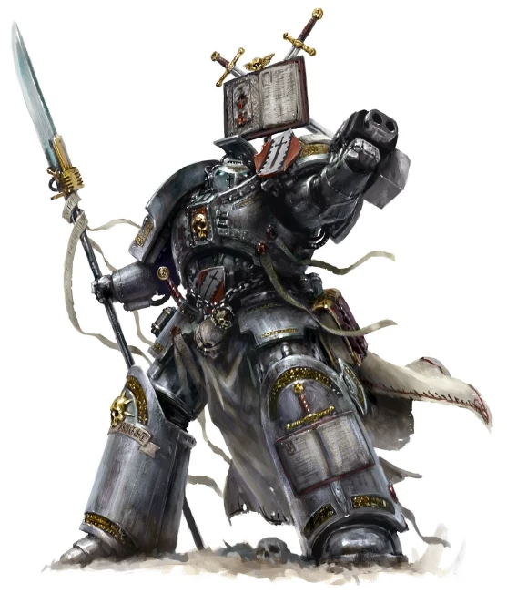

<!-- A1387-B0116 -->

原译文

Grey Knight Aegis-Pattern Terminator Armour 灰骑士宙斯盾型终结者盔甲

**校订译文**

Grey Knight Aegis-Pattern Terminator Armour 灰骑士神盾型终结者盔甲

<!-- /A1387-B0116 -->

<!-- A1387-B0117 -->
### Aquilon Pattern 天鹰型

<!-- /A1387-B0117 -->

<!-- A1387-B0118 -->
**英文原文**

This pattern of Terminator Armour was used by the Adeptus Custodes during the Great Crusade and Horus Heresy. Its origins lie with the Cataphractii suits of the Space Marine Legions, but with far greater power capacity and customized neuro-fibre uplinks, it is said, redesigned by the mind of the Emperor himself. Aquilon Pattern Terminator Armour was said to have adjusted for the enhanced physique of the Custodes, who were capable of bearing more weight and strain than even Space Marines. This allowed it to be fitted with additional power systems and capacitors, increasing its durability and maneuverability. Aquilon Pattern Terminators were given more advanced weaponry than their Astartes counterparts, wielding weapons such as Lastrum Storm Bolters, Solerite Power Gauntlets and Power Talons, and Power Talon, Infernus Firepikes, and twin-linked Adrathic Destructor.

<!-- /A1387-B0118 -->

<!-- A1387-B0119 -->

原译文

这种终结者盔甲型号在大远征和荷鲁斯叛乱期间被禁军使用。它的起源在于星际战士军团的铁骑套装，但据说它具有更大的功率容量和定制的神经纤维上行链路，由帝皇本人重新设计。据说天鹰型终结者盔甲已经适应了禁军的增强体质，他们甚至比星际战士能够承受更多的重量和压力。这使得它可以安装额外的能源系统和电容器，提高了它的耐用性和机动性。天鹰型终结者被赋予了比阿斯塔特终结者更先进的武器，他们挥舞着拉斯穆风暴爆矢枪、太古动力拳套和动力爪、动力爪、炼狱火矛和双联遗迹破坏者等武器。

**校订译文**

禁军在大远征及荷鲁斯之乱期间使用天鹰型终结者盔甲。它源于星际战士军团的铁骑型，但据说经过帝皇亲自重新设计，动力容量大幅提升，并配备定制的神经纤维上行链路。禁军的体质比星际战士更强，能够承受更大的重量和负荷；天鹰型据称正是为此作了适配，得以安装额外动力系统与电容器，进一步提高耐用性和机动性。天鹰型终结者的武器也比阿斯塔特同行更先进，包括拉斯穆风暴爆矢枪、太古动力拳套与动力爪、炼狱火矛，以及双联遗迹破坏者。

**校注：** 英文清单重复Power Talon两次，中文去除重复；Solerite、Adrathic此处沿现稿太古、遗迹，尚无官方对应证据。

<!-- /A1387-B0119 -->

<!-- A1387-B0120 -->
**英文原文**

Within the ranks of the Custodes, Aquilon Pattern Terminator Armour was deployed by the Tharanatoi Caste.

<!-- /A1387-B0120 -->

<!-- A1387-B0121 -->

原译文

在禁军的队伍中，塔拉纳托伊阶级部署了天鹰型终结者盔甲。

**校订译文**

在禁军内部，天鹰型终结者盔甲由雷殇卫士阶层使用。

<!-- /A1387-B0121 -->

<!-- A1387-B0122 图片 -->
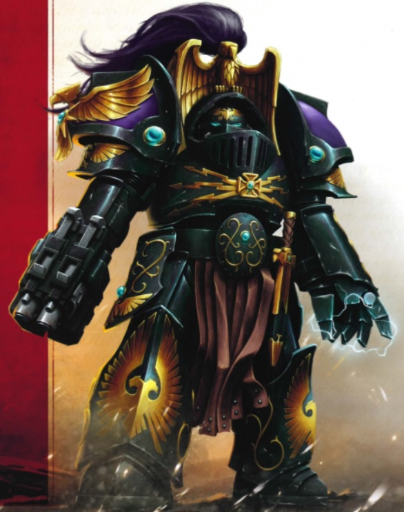

<!-- A1387-B0123 -->

原译文

Custodian in Aquilon Pattern Terminator Armour 天鹰型终结者甲中的禁军

**校订译文**

Custodian in Aquilon Pattern Terminator Armour 身穿天鹰型终结者盔甲的禁军

<!-- /A1387-B0123 -->

<!-- A1387-B0124 -->
### Allarus Pattern 阿拉鲁斯型

<!-- /A1387-B0124 -->

<!-- A1387-B0125 -->
**英文原文**

The Allarus Pattern Terminator Armour is used by the Adeptus Custodes of the Allarus Terminators in the present setting. Driven by magnatomic generator-shrines, articulated with leonus-class actuators, and fashioned from layered auramite and adamantium, Allarus armour is a marvel of craftsmanship. It provides its wearer with an exceptional range of movement and near-unencumbered speed, augmented strength and resilience, and the survivability to stride unharmed from the blast of a macro-cannon shell. Coupled with the protective blessings of the Emperor, Allarus Terminator plate is arguably the most effective man-portable combat armour in the entire Imperium. These expertly crafted suits are each individually worth entire worlds.

<!-- /A1387-B0125 -->

<!-- A1387-B0126 -->

原译文

在当前环境中，阿拉鲁斯型终结者盔甲由禁军的阿拉鲁斯终结者使用。由大原子发生器神龛驱动，与莱昂纳斯级驱动器铰接，由分层的耀金和精金制成，阿拉鲁斯盔甲是工艺的奇迹。它为穿戴者提供了非凡的运动范围和近乎无阻碍的速度，增强了力量和恢复力，以及在大型火炮炮弹爆炸中不受伤害地行走的生存能力。再加上帝皇的保护祝福，阿拉鲁斯终结者板可以说是整个帝国中最有效的便携式战斗盔甲。这些精心制作的套装每一件都价值整个世界。

**校订译文**

在当代设定中，阿拉鲁斯型终结者护甲由禁军的阿拉鲁斯亲卫使用。这种盔甲由磁原子发生器神龛供能，以莱昂纳斯级驱动器带动关节，采用多层耀金与精金打造，堪称工艺奇迹。它使穿戴者拥有极大的活动范围和几乎不受妨碍的行动速度，同时增强力量与耐受力，甚至能够从宏炮炮弹的爆炸中毫发无伤地走出。再加上帝皇的庇佑，阿拉鲁斯终结者护甲堪称整个帝国最有效的单兵作战盔甲。每一套这样的精工造物，都抵得上整颗世界的价值。

<!-- /A1387-B0126 -->

<!-- A1387-B0127 图片 -->
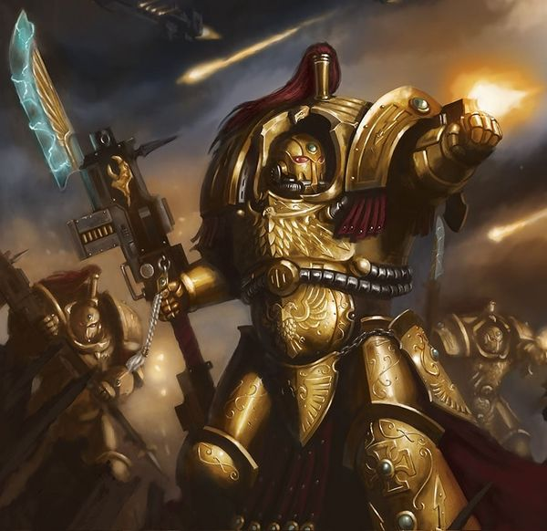

<!-- A1387-B0128 -->

原译文

Custodian in Allarus Pattern Terminator Armour 阿拉鲁斯型终结者甲中的禁军

**校订译文**

Custodian in Allarus Pattern Terminator Armour 身穿阿拉鲁斯型终结者护甲的禁军

<!-- /A1387-B0128 -->

<!-- A1387-B0129 -->
## Unique Suits

**补译**

独有盔甲

<!-- /A1387-B0129 -->

<!-- A1387-B0130 -->
**英文原文**

The Armour of Antilochus: an Ultramarines relic, worn exclusively by Chapter Master Marneus Augustus Calgar.

<!-- /A1387-B0130 -->

<!-- A1387-B0131 -->

原译文

安提罗科斯之盔：一件极限战士的圣物，由站团长马涅乌斯·奥古斯特·卡尔加唯一穿戴。

**校订译文**

安提洛克斯战甲：极限战士的圣物，仅由战团长马涅乌斯·奥古斯图斯·卡尔加穿戴。

**校注：** 安提洛克斯战甲依据GW-09第32页中文单位名“身穿安提洛克斯战甲的马涅乌斯·卡尔加”所证实的装备词根；英文旧版仅列Marneus Calgar，故独立英文全称尚待核。原安提罗科斯之甲。

<!-- /A1387-B0131 -->

<!-- A1387-B0132 -->
**英文原文**

The Serpent's Scales: Ornate suit worn by the traitorous Warmaster Horus.

<!-- /A1387-B0132 -->

<!-- A1387-B0133 -->

原译文

毒蛇之鳞：反叛的战帅荷鲁斯穿的华丽套装。

**校订译文**

毒蛇之鳞：叛徒战帅荷鲁斯穿戴的华丽盔甲。

<!-- /A1387-B0133 -->

<!-- A1387-B0134 -->
**英文原文**

The Logos: Highly advanced suit worn by Perturabo

<!-- /A1387-B0134 -->

<!-- A1387-B0135 -->

原译文

理性：佩图拉博穿的高级套装

**校订译文**

逻辑：佩图拉博穿戴的高度先进的盔甲。

<!-- /A1387-B0135 -->

<!-- A1387-B0136 -->
**英文原文**

The Medusan Carapace: Worn by Ferrus Manus

<!-- /A1387-B0136 -->

<!-- A1387-B0137 -->

原译文

美杜莎背甲：由费鲁斯·马努斯穿戴

**校订译文**

美杜莎之甲：费鲁斯·马努斯穿戴的盔甲。

<!-- /A1387-B0137 -->

<!-- A1387-B0138 -->
## Trivia 琐事

<!-- /A1387-B0138 -->

<!-- A1387-B0139 -->
**英文原文**

In White Dwarf 304 (UK) Adam Troke and Andy Hoare presented a look back at the story of Terminator armour in Games Workshop's games.

<!-- /A1387-B0139 -->

<!-- A1387-B0140 -->

原译文

在《白矮星第304期》（英国）中，亚当·特罗克和安迪·霍尔回顾了Games Workshop游戏中终结者盔甲的故事。

**校订译文**

在英国版《白矮星》第304期中，亚当·特罗克与安迪·霍尔回顾了终结者盔甲在Games Workshop游戏中的发展历程。

<!-- /A1387-B0140 -->

<!-- A1387-B0141 -->
### Saturnine/Nocturne 土星/夜曲

<!-- /A1387-B0141 -->

<!-- A1387-B0142 -->
**英文原文**

Notes 1 : According to a twitter post made by author Gav Thorpe, the artwork depicting the terminator armour in the Deeds Endure (Short Story) could have been called Nocturne but he pointed out that was not official. The Saturnine pattern terminator armour released in 2025 for the 3rd edition of the Horus Heresy game bears a ressemblance to this artwork, as well as a 1988 model of a "Terminator Marine".

<!-- /A1387-B0142 -->

<!-- A1387-B0143 -->

原译文

注释1：根据作者加夫·索普在推特上发布的一篇帖子，《持久契约》（短篇小说）中描绘终结者盔甲的插图本可以被称为夜曲，但他指出这不是官方的。2025年为荷鲁斯叛乱游戏第三版发布的土星型终结者盔甲，以及1988年的“终结者战士”模型，都与这张插图有相似之处。

**校订译文**

注1：作家加夫·索普曾在推特上表示，短篇小说《功业长存》（Deeds Endure）所配插图中的终结者盔甲可以称为“夜曲”，但他同时说明，这并非官方名称。2025年随《荷鲁斯之乱》游戏第三版推出的土星型终结者护甲，在外观上既与该插图相似，也与1988年的“终结者战士”模型相似。

**校注：** Deeds Endure指功业长存，原《持久契约》误解deeds；书名暂定待核。关于2025年模型及《白矮星》515的陈述来自所给底稿，本轮未另作官网认证。

<!-- /A1387-B0143 -->

<!-- A1387-B0144 -->
**英文原文**

White Dwarf 515 confirmed that the artwork depicted in Deeds Endure is Saturnine armour.

<!-- /A1387-B0144 -->

<!-- A1387-B0145 -->

原译文

《白矮人第515期》证实，《持久契约》中描绘的插图是土星盔甲。

**校订译文**

《白矮星》第515期确认，《功业长存》插图中描绘的是土星型护甲。

<!-- /A1387-B0145 -->

<!-- A1387-B0146 图片 -->
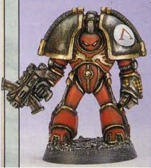

<!-- A1387-B0147 -->

原译文

Terminator marine model released in 1988, labelled as "MK1" 1988年发布的终结者战士模型，标记为“MK1”

**校订译文**

Terminator marine model released in 1988, labelled as "MK1" 1988年发布的终结者战士模型，标记为“MK1”

<!-- /A1387-B0147 -->

<!-- A1387-B0148 图片 -->
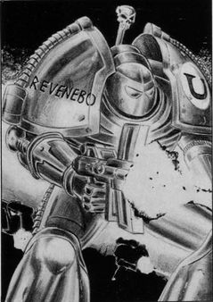

<!-- A1387-B0149 -->

原译文

Artwork the aforementioned model is based on (1988)上述模型所基于的插图（1988）

**校订译文**

Artwork the aforementioned model is based on (1988)上述模型所基于的插图（1988）

<!-- /A1387-B0149 -->

<!-- A1387-B0150 图片 -->

<!-- A1387-B0151 -->

原译文

Unnamed artwork, unnoficially named "Nocturne" by Gav Thorpe (2015)未命名的插图，由加夫·索普非正式命名为“夜曲”（2015）

**校订译文**

Unnamed artwork, unnoficially named "Nocturne" by Gav Thorpe (2015)未命名的插图，由加夫·索普非正式命名为“夜曲”（2015）

<!-- /A1387-B0151 -->

本篇核心术语与暂定项

以下列出本篇出现的英文原形及核心术语表用词。同形词可能指不同对象，具体词义以本篇正文和校注为准；单复数、别名和仅见于图注的名称可能尚未列入。完整候选见[术语表](../../术语表/双语术语候选.csv)。

| 英文 | 采用中文 | 状态 |
| --- | --- | --- |
| Space Marines | 星际战士 | 官方已核对 |
| Blood Angels | 圣血天使 | 官方已核对 |
| Dark Angels | 黑暗天使 | 官方已核对 |
| Deathwatch | 死亡守望 | 官方已核对 |
| Grey Knights | 灰骑士 | 官方已核对 |
| Adeptus Custodes | 帝皇禁军 | 官方已核对 |
| Adeptus Mechanicus | 机械修会 | 官方已核对 |
| World Eaters | 吞世者 | 官方已核对 |
| Librarian | 智库员 | 官方已核对 |
| Terminator | 终结者 | 官方已核对 |
| Boltgun | 爆矢枪 | 官方已核对 |
| Ultramarines | 极限战士 | 官方已核对 |
| Horus Heresy | 荷鲁斯之乱 | 官方已核对 |
| Imperium | 帝国 | 暂定·简称 |
| Mechanicum | 机械教 | 暂定·历史称谓 |
| Dark Age of Technology | 黑暗科技时代 | 暂定 |
| Teleportation | 传送 | 暂定 |
| Indomitus | 不屈学派 | 暂定·学派语境 |
| Notes | 注释 | 编辑用语已统一 |
| Teleport Homer | 传送信标 | 暂定·官方待核 |
| Emperor | 帝皇 | 官方已核对 |
| Primarch | 原体 | 官方已核对 |
| Hive World | 巢都世界 | 暂定·官方待核 |
| Word Bearers | 怀言者 | 暂定·官方待核 |
| Iron Warriors | 钢铁勇士 | 暂定·官方待核 |
| Great Crusade | 大远征 | 暂定·官方待核 |
| Ferrus Manus | 费鲁斯·马努斯 | 暂定·官方待核 |
| Horus | 荷鲁斯 | 暂定·官方待核 |
| Iron Hands | 钢铁之手 | 暂定·官方待核 |
| Legiones Astartes | 阿斯塔特军团 | 暂定·官方待核 |
| Unification Wars | 统一战争 | 暂定·官方待核 |
| Cabal | 密教 | 暂定·官方待核 |
| Vulkan | 沃坎 | 暂定·官方待核 |
| Salamanders | 火蜥蜴 | 暂定·官方待核 |
| Mars | 火星 | 暂定·官方待核 |
| Nocturne | 夜曲星 | 暂定·官方待核 |
| Titan | 泰坦 | 暂定·官方待核 |
| Tech | 技术语 | 暂定·官方待核 |
| Clear | 清明 | 暂定·官方待核 |
| Master | 导师（审判庭职衔）／舰务官（舰员职务） | 语境定译·官方待核 |
| Minotaurs | 米诺陶 | 暂定·官方待核 |
| Pyre Wardens | 火葬守卫 | 暂定·官方待核 |
| Cadre | 骨干连（寂静修女）／核心队（钛族） | 语境定译·钛族词根参考 |
| Tharanatoi | 雷殇卫士 | 暂定·官方待核 |
| Space Marine Legion | 星际战士军团 | 暂定·官方待核 |
| Autek Mor | 奥特克·莫尔 | 暂定·官方待核 |
| Sol | 太阳系 | 暂定·官方待核 |
| Isstvan | 伊斯塔万 | 暂定·官方待核 |
| Power Armour | 动力盔甲 | 暂定·官方待核 |
| Space Marine | 星际战士 | 暂定·官方待核 |
| Chapter | 战团 | 暂定·官方待核 |
| Chapter Master | 战团长 | 暂定·官方待核 |
| Veteran | 老兵 | 暂定·官方待核 |
| Terminators | 终结者 | 暂定·官方待核 |
| Sergeant | 军士 | 暂定·官方待核 |
| Land Raiders | 兰德掠袭者 | 暂定·官方待核 |
| Terminator Squads | 终结者小队 | 暂定·官方待核 |
| Artificer | 技工 | 暂定·官方待核 |
| Marneus Augustus Calgar | 马涅乌斯·奥古斯图斯·卡尔加 | 暂定·官方待核 |
| Anointed | 受膏者 | 暂定·官方待核 |
| Flamers | 火妖（奸奇单位）／火焰喷射器（武器） | 语境定译·对应官译已核 |
| Destructor | 破坏者（史洛斯类别） | 暂定·官方待核 |
| Indurate | 坚固者 | 暂定·官方待核 |
| Saturnine Armour | 土星型护甲 | 暂定·官方待核 |
| Phraetus Anointed | 弗拉图斯受膏者 | 暂定·官方待核 |
| Strain | 群系 | 暂定·官方待核 |
| Gav Thorpe | 加夫·索普 | 暂定·官方待核 |
| Dreadnought | 无畏机甲 | 暂定·官方待核 |
| Iron Fathers | 钢铁圣父 | 暂定·官方待核 |
| Antilochus | 安提罗科斯 | 暂定·官方待核 |
| Armour of Antilochus | 安提洛克斯战甲 | 官方词根参考·装备全称待核 |
| Wrought | 锻造秘库 | 暂定·官方待核 |
| The Logos | 逻辑 | 暂定·官方待核 |
| Bear | 熊 | 暂定·官方待核 |
| Saturnine Pattern Terminator Armour | 土星型终结者护甲 | 暂定·官方待核 |
| Saturnine Terminator | 土星型终结者 | 暂定·官方待核 |
| The Dark | 《黑暗》 | 暂定·官方待核 |
| The Blood | 鲜血 | 暂定·官方待核 |
| System | 星系（恒星系统） | 暂定·官方待核 |
| Phoebe | 菲比 | 暂定·官方待核 |
| Crux | 南十字 | 暂定·官方待核 |
| Medusan Carapace | 美杜莎之甲 | 暂定·官方待核 |
| Thunder Hammer | 雷霆锤 | 暂定·官方待核 |
| Missile Launcher | 导弹发射器 | 暂定·官方待核 |
| Cyclone Missile Launcher | 旋风导弹发射器 | 暂定·官方待核 |
| Grenade Harness | 背带式榴弹发射器 | 暂定·官方待核 |
| Assault Cannon | 突击炮 | 暂定·官方待核 |
| Bolter | 爆矢枪 | 暂定·官方待核 |
| Storm bolter | 风暴爆矢枪 | 官方已核对 |
| Flamer | 火焰喷射器（武器）／火妖（奸奇单位） | 语境定译·对应官译已核 |
| Heavy flamer | 重型火焰喷射器 | 官方已核对 |
| Volkite Culverin | 爆燃长炮 | 暂定·官方待核 |
| Mind Impulse Unit | 思维驱动单元 | 暂定·官方待核 |
| Grenade | 手榴弹 | 暂定·官方待核 |
| Frag Grenade | 破片手榴弹 | 暂定·官方待核 |
| Power fist | 动力拳 | 官方已核对 |
| Storm Shield | 风暴盾 | 暂定·官方待核 |
| Exo-Armour | 外骨骼装甲 | 暂定·官方待核 |
| Terminator Armour | 终结者盔甲 | 暂定·官方待核 |
| Crux Terminatus | 终结者十字章 | 暂定·官方待核 |
| Cataphractii Pattern | 铁骑型 | 暂定·官方待核 |
| Tartaros Pattern | 冥府型 | 暂定·官方待核 |
| Indomitus Pattern | 不屈型 | 暂定·官方待核 |
| Gorgon Pattern | 戈尔贡型 | 暂定·官方待核 |
| cybertheurgic resonance | 智控神术共鸣 | 暂定·官方待核 |
| Phoebian Accord | 菲比安协议 | 暂定·官方待核 |
| Tech-Cabal | 技术结社 | 暂定·官方待核 |
| Saturnine Excubitor Cadre | 土星守卫分队 | 暂定·官方待核 |
| Tekathikos | 破山者 | 暂定·官方待核 |
| Colossi | 巨像 | 暂定·官方待核 |
| Helwrought | 狱铸 | 暂定·官方待核 |
| Aquilon Pattern | 天鹰型 | 暂定·官方待核 |
| Allarus Pattern Terminator Armour | 阿拉鲁斯型终结者护甲 | 暂定·官方待核 |
| Deeds Endure | 功业长存 | 暂定·官方待核 |
| Adrathic destructor | 遗迹破坏炮 | 暂定·官方待核 |
| Games Workshop | Games Workshop | 暂定·官方待核 |
| Andy Hoare | 安迪·霍尔 | 暂定·官方待核 |
| Enclaves | 飞地 | 暂定·官方待核 |
| Gorgon | 戈尔贡 | 暂定·官方待核 |
| Ablative Armour | 消融装甲 | 暂定·官方待核 |
| Saturn | 土星 | 暂定·官方待核 |
| Sol System | 太阳系 | 暂定·官方待核 |

