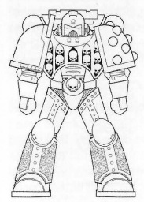
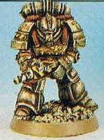
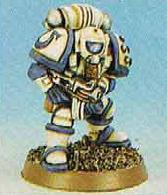

# 1389 精工盔甲 Artificer Armour

精校状态：中文行文已逐段精校，部分术语仍为暂定

分类：装备 / 盔甲

原文来源：https://www.bilibili.com/opus/1016277261849985049

原作者：帝国神选罐头

原文时间：编辑于 2025年02月12日 18:41

[返回分类目录](目录.md) · [全书目录](../../目录.md)

<!-- A1389-B0001 -->
**英文原文**

Artificer Armour is the name given to individualised and heavily modified suits of Power Armour. Existing suits of Artificer armour have generally been modified and decorated for a certain individual at point in the Chapters. These suits are kept within the Chapter even after the death of their original wearers and then inherited by high ranking and honoured individuals. Commonly this type of armour incorporates elements of the various "marks" of power armour as well as more unique, customised armour plates and helmets.

<!-- /A1389-B0001 -->

<!-- A1389-B0002 -->

原译文

精工盔甲是动力盔甲的个性化和大量修改的套装的名称。在战团中，现有的精工盔甲通常会针对某个人进行修改和装饰。即使在最初的穿着者去世后，这些套装也会保留在战团内，然后由等级高和受人尊敬的个体继承。通常，这种类型的盔甲结合了各种“型号”的动力盔甲元素，以及更独特、定制的装甲和头盔。

**校订译文**

精工盔甲是经过个性化设计和大幅改装的动力盔甲。现存的这类盔甲，大多曾由战团为某位特定成员改造并装饰。即使最初的穿戴者去世，盔甲仍会留在战团中，由地位崇高、功勋卓著的成员继承。它们通常融合了不同型号动力盔甲的部件，以及独特的定制甲片和头盔。

<!-- /A1389-B0002 -->

<!-- A1389-B0003 图片 -->

<!-- A1389-B0004 -->

原译文

Artificer Armour 精工盔甲

**校订译文**

Artificer Armour 精工盔甲

<!-- /A1389-B0004 -->

<!-- A1389-B0005 -->
## Construction 制造

<!-- /A1389-B0005 -->

<!-- A1389-B0006 -->
**英文原文**

Suits of Power Armour are difficult to manufacture and so must be maintained in the best possible condition for as long as is possible, hence a Space Marine Chapter may well have a number of archaic suits, which now are kept as heirlooms. Although even the earliest forms of Power Armour are far from obsolete, many of the older suits lack auxiliary systems found in the most recent suits.

<!-- /A1389-B0006 -->

<!-- A1389-B0007 -->

原译文

动力装甲套装很难制造，因此必须尽可能长时间地保持在最佳状态，因此星际战士战团很可能有一些古老的套装，现在作为圣物保存下来。尽管即使是最早形号的动力盔甲也远未过时，但许多旧套装缺乏最新套装中的辅助系统。

**校订译文**

动力盔甲制造不易，必须尽可能长久地维持最佳状态。因此，星际战士战团往往保有一些古老盔甲，将其作为传世之宝珍藏。即使最早的型号也远未过时，但许多旧式盔甲缺少最新型号配备的辅助系统。

<!-- /A1389-B0007 -->

<!-- A1389-B0008 图片 -->

<!-- A1389-B0009 -->

原译文

1st Edition Artificer Armour 第一版精工盔甲

**校订译文**

1st Edition Artificer Armour 第一版精工盔甲

<!-- /A1389-B0009 -->

<!-- A1389-B0010 -->
**英文原文**

To maintain, repair and upgrade suits so that they carry the latest systems, the Chapter's Techmarines and Artificers have to constantly work on all the suits that a Chapter owns. Many of the changes made are non-standard and are one-offs for the particular suit they are on, and many additional, purely ornamental adornments are added to recall major campaigns or battles the Chapter has fought in. In time suits become encrusted with unique decorations and individual upgrades and becomes known as Artificer Armour. Because of these heavy modifications, Artificer Armour is often highly superior to newer suits of standard issue Power Armour, and afford much better protection.

<!-- /A1389-B0010 -->

<!-- A1389-B0011 -->

原译文

为了维护、修理和升级套装，使其携带最新的系统，该战团的技术军士和工匠必须不断地处理该战团拥有的所有套装。所做的许多更改都是非标准的，是针对他们所穿的特定套装的一次性更改，并且添加了许多额外的纯粹装饰性装饰，以回忆该战团参加过的主要战役或战斗。随着时间的推移，套装会镶嵌上独特的装饰和个人升级，并被称为精工盔甲。由于这些重大改进，精工盔甲通常比新的标准动力盔甲套装优越得多，并且提供了更好的保护。

**校订译文**

为维护、修复盔甲，并为其升级最新系统，战团的科技战士与精工匠师必须持续照料战团拥有的全部盔甲。许多改动并非标准设计，而是专为某一套盔甲量身打造。此外，他们还会添加纯粹用于纪念战团重要战役的饰物。随着时间推移，盔甲布满独有的装饰和定制改装，便成为所谓的精工盔甲。由于经过大量改良，其性能往往远胜新造的标准动力盔甲，能够提供更强的防护。

<!-- /A1389-B0011 -->

<!-- A1389-B0012 图片 -->

<!-- A1389-B0013 -->

原译文

1st Edition Artificer Armour 第一版精工盔甲

**校订译文**

1st Edition Artificer Armour 第一版精工盔甲

<!-- /A1389-B0013 -->

<!-- A1389-B0014 -->
**英文原文**

Nevertheless, Artificer Armour is priceless to a Chapter and wearing it is not undertaken lightly, for it cannot be replaced if it is lost. Only the greatest heroes are entitled to wear such armour on the battlefield, and when a Space Marine does it is often as a symbol of his martial prowess as well as protection, and may even be chosen over Terminator Armour if it is available. However, the Salamanders chapter creates more artificer armour than any other chapter, due to their renowned craftsmanship skills.

<!-- /A1389-B0014 -->

<!-- A1389-B0015 -->

原译文

然而，精工盔甲队一个战团来说是无价的，穿戴它不是轻而易举的，因为如果它丢失了，无法更换。只有最伟大的英雄才有权在战场上穿这种盔甲，当一名星际战士这样做时，这通常是他武艺和保护的象征，如果可以，甚至可以选择终结者盔甲。然而，由于著名的工艺技能，火蜥蜴战团制造的精工盔甲比其他任何战团都多。

**校订译文**

精工盔甲对战团而言是无价之宝，是否穿戴它出战必须慎重考虑，因为一旦遗失便无法替代。只有最杰出的英雄才有资格身着这种盔甲踏上战场；它既提供防护，也象征穿戴者卓越的武艺。有些战士即便能够使用终结者盔甲，也会优先选择精工盔甲。凭借闻名遐迩的制造技艺，火蜥蜴打造的精工盔甲数量超过其他任何战团。

**校注：** 原译倒置选择关系：英文是即使有终结者盔甲，也可能优先穿精工盔甲。

<!-- /A1389-B0015 -->

<!-- A1389-B0016 -->
## Effects and Distribution 性能与配备情况

原题：Effects and Distribution 影响和分布

<!-- /A1389-B0016 -->

<!-- A1389-B0017 -->
**英文原文**

The Space Marines of the Adeptus Astartes hold the largest number of suits of Power Armour that could be classified as Artificer, but numbers of suits of similar quality have been acquired by high ranking members of the Inquisition, who often collect such items in their line of work.

<!-- /A1389-B0017 -->

<!-- A1389-B0018 -->

原译文

阿斯塔特修会的星际战士拥有最多可归类为精工的动力盔甲套装，但审判庭的高级成员也获得了类似质量的套装，他们经常在工作中收集此类物品。

**校订译文**

在所有堪称精工盔甲的动力盔甲中，阿斯塔特星际战士拥有的数量最多。审判庭的一些高层成员也获得了品质相近的盔甲；他们经常在执行职务时收集此类物品。

<!-- /A1389-B0018 -->

<!-- A1389-B0019 -->
## Famous Suits of Artificer Armour 著名精工盔甲套装

<!-- /A1389-B0019 -->

<!-- A1389-B0020 -->
**英文原文**

Gilded Panoply - Worn by Fulgrim

<!-- /A1389-B0020 -->

<!-- A1389-B0021 -->

原译文

覆金之铠 - 福格瑞姆穿戴

**校订译文**

覆金之铠 - 福格瑞姆穿戴

<!-- /A1389-B0021 -->

<!-- A1389-B0022 -->
**英文原文**

Armour of the Word - Worn by Lorgar

<!-- /A1389-B0022 -->

<!-- A1389-B0023 -->

原译文

言语之甲 - 珞珈穿戴

**校订译文**

圣言之甲——珞珈穿戴。

<!-- /A1389-B0023 -->

<!-- A1389-B0024 -->
**英文原文**

Draken Scale - Worn by Vulkan

<!-- /A1389-B0024 -->

<!-- A1389-B0025 -->

原译文

火龙之麟 - 沃坎穿戴

**校订译文**

火龙之鳞——沃坎穿戴。

<!-- /A1389-B0025 -->

<!-- A1389-B0026 -->
**英文原文**

Nightmare Mantle - Worn by Konrad Curze

<!-- /A1389-B0026 -->

<!-- A1389-B0027 -->

原译文

梦魇斗篷 - 康拉德·科兹穿戴

**校订译文**

梦魇斗篷 - 康拉德·科兹穿戴

<!-- /A1389-B0027 -->

<!-- A1389-B0028 -->
**英文原文**

Armour Elavagar - Worn by Leman Russ

<!-- /A1389-B0028 -->

<!-- A1389-B0029 -->

原译文

冰波战甲 - 黎曼·鲁斯穿戴

**校订译文**

埃拉瓦加尔之甲——黎曼·鲁斯穿戴。

<!-- /A1389-B0029 -->

<!-- A1389-B0030 -->
**英文原文**

The Protector - Worn by Azrael

<!-- /A1389-B0030 -->

<!-- A1389-B0031 -->

原译文

守护者 - 阿兹瑞尔穿戴

**校订译文**

守护者 - 阿兹瑞尔穿戴

<!-- /A1389-B0031 -->

<!-- A1389-B0032 -->
**英文原文**

Secret's Shield - Worn by Ezekiel

<!-- /A1389-B0032 -->

<!-- A1389-B0033 -->

原译文

守密之盾 - 以西结装备

**校订译文**

秘密之盾——以西结穿戴。

<!-- /A1389-B0033 -->

<!-- A1389-B0034 -->
**英文原文**

Armour of the Forest - Worn by Corswain

<!-- /A1389-B0034 -->

<!-- A1389-B0035 -->

原译文

森林之甲 - 考斯韦恩穿戴

**校订译文**

森林之甲 - 考斯韦恩穿戴

<!-- /A1389-B0035 -->

<!-- A1389-B0036 -->

原译文

The Armour of Dante 但丁之甲

**校订译文**

The Armour of Dante 但丁之甲

<!-- /A1389-B0036 -->

<!-- A1389-B0037 -->
**英文原文**

The Armour of Mephiston, Chief Librarian of the Blood Angels

<!-- /A1389-B0037 -->

<!-- A1389-B0038 -->

原译文

墨菲斯顿之甲，圣血天使的首席智库

**校订译文**

圣血天使首席智库墨菲斯顿的盔甲。

<!-- /A1389-B0038 -->

<!-- A1389-B0039 -->
**英文原文**

The Armour of Brother-Captain Erasmus Tycho of the Blood Angels

<!-- /A1389-B0039 -->

<!-- A1389-B0040 -->

原译文

圣血天使连长修士伊拉斯谟·第谷之甲

**校订译文**

圣血天使兄弟连长伊拉斯谟·第谷的盔甲。

**校注：** Brother-Captain 在此为圣血天使的连长修士，不能套用灰骑士特定编制职衔“兄弟会连长”。 非灰骑士的Brother-Captain通称与248及核心分义统一为兄弟连长。

<!-- /A1389-B0040 -->

<!-- A1389-B0041 -->
**英文原文**

The Armour of Inquisitor Torquemada Coteaz of the Ordo Malleus

<!-- /A1389-B0041 -->

<!-- A1389-B0042 -->

原译文

圣锤修会审判官托尔克马达·科特兹之甲

**校订译文**

恶魔审判庭审判官托尔克马达·克提兹的盔甲。

<!-- /A1389-B0042 -->

本篇核心术语与暂定项

以下列出本篇出现的英文原形及核心术语表用词。同形词可能指不同对象，具体词义以本篇正文和校注为准；单复数、别名和仅见于图注的名称可能尚未列入。完整候选见[术语表](../../术语表/双语术语候选.csv)。

| 英文 | 采用中文 | 状态 |
| --- | --- | --- |
| Space Marines | 星际战士 | 官方已核对 |
| Adeptus Astartes | 阿斯塔特修会 | 官方已核对 |
| Blood Angels | 圣血天使 | 官方已核对 |
| Librarian | 智库员 | 官方已核对 |
| Terminator | 终结者 | 官方已核对 |
| Inquisition | 审判庭 | 暂定 |
| Inquisitor | 审判官 | 官方已核对 |
| Ordo Malleus | 恶魔审判庭 | 用户指定 |
| Fulgrim | 福格瑞姆 | 官方已核对 |
| Vulkan | 沃坎 | 暂定·官方待核 |
| Protector | 守护者 | 暂定·官方待核 |
| Salamanders | 火蜥蜴 | 暂定·官方待核 |
| Konrad Curze | 康拉德·科兹 | 暂定·官方待核 |
| Chief Librarian | 首席智库员 | 暂定·官方待核 |
| Torquemada Coteaz | 托尔克马达·克提兹 | 官方词根参考·全名待核 |
| Corswain | 考斯韦恩 | 暂定·官方待核 |
| Power Armour | 动力盔甲 | 暂定·官方待核 |
| Space Marine | 星际战士 | 暂定·官方待核 |
| Chapter | 战团 | 暂定·官方待核 |
| Captain | 连长 | 暂定·官方待核 |
| Brother | 修士 | 暂定·官方待核 |
| Azrael | 阿兹瑞尔 | 官方已核 |
| Ezekiel | 以西结 | 暂定·官方待核 |
| Mephiston | 墨菲斯顿 | 暂定·官方待核 |
| Artificer | 技工 | 暂定·官方待核 |
| Erasmus Tycho | 伊拉斯谟·第谷 | 暂定·官方待核 |
| Brother-Captain | 兄弟会连长（灰骑士）／兄弟连长（通称） | 语境定译·灰骑士职衔官译已核 |
| Lorgar | 珞珈 | 暂定·官方待核 |
| The Protector | 守护者 | 暂定·官方待核 |
| Secret's Shield | 秘密之盾 | 暂定·官方待核 |
| Gilded Panoply | 覆金之铠 | 暂定·官方待核 |
| Armour Elavagar | 埃拉瓦加尔之甲 | 暂定·官方待核 |
| Nightmare Mantle | 梦魇斗篷 | 暂定·官方待核 |
| The Blood | 鲜血 | 暂定·官方待核 |
| Terminator Armour | 终结者盔甲 | 暂定·官方待核 |
| Artificer Armour | 精工盔甲 | 暂定·官方待核 |
| Armour of the Forest | 森林之甲 | 暂定·官方待核 |

