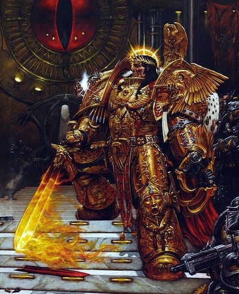

# 1391 真一盔甲 One True Armour

精校状态：中文行文已逐段精校，部分术语仍为暂定

分类：装备 / 盔甲

原文来源：https://www.bilibili.com/opus/1084131749325176832

原作者：帝国神选罐头

原文时间：2025年06月30日 12:24

[返回分类目录](目录.md) · [全书目录](../../目录.md)

<!-- A1391-B0001 -->
**英文原文**

The One True Armour is a suit of Power Armour commonly seen worn by the Emperor during the Great Crusade and Horus Heresy.

<!-- /A1391-B0001 -->

<!-- A1391-B0002 -->

原译文

真一盔甲是一套动力盔甲，通常在大远征和荷鲁斯叛乱期间由帝皇穿着。

**校订译文**

真一盔甲是一套动力盔甲。大远征及荷鲁斯之乱期间，人们经常见到帝皇穿戴它。

<!-- /A1391-B0002 -->

<!-- A1391-B0003 图片 -->

<!-- A1391-B0004 -->

原译文

The One True Armour 真一盔甲

**校订译文**

The One True Armour 真一盔甲

<!-- /A1391-B0004 -->

<!-- A1391-B0005 -->
**英文原文**

Always depicted as golden, after his wounding by Horus during the Siege of Terra it is said that the Emperor's armour was removed and melted down at his own order in order to create badges to honour the Imperial Fists Terminators that had fought beside him. Pieces of the Armour are placed inside the Crux Terminatus worn by an especially honoured Space Marine Terminators. Meanwhile, all Grey Knights Cruxes contain a shard of the Armour.

<!-- /A1391-B0005 -->

<!-- A1391-B0006 -->

原译文

在泰拉围城中被荷鲁斯打伤后，帝皇的盔甲总是被描绘成金色的，据说帝皇的盔甲是按照自己的命令被拆除和熔化的，以制作徽章来纪念与他并肩作战的帝国之拳终结者。盔甲的碎片被放置在一位特别受人尊敬的星际战士终结者佩戴的终结者十字章内。与此同时，所有灰骑士十字都包含一块盔甲碎片。

**校订译文**

这套盔甲在各种描绘中始终呈金色。据说，帝皇在泰拉围城战中被荷鲁斯重创后，亲自下令将盔甲卸下熔化，制成徽章，表彰曾与他并肩作战的帝国之拳终结者。部分盔甲碎片封存在那些功勋卓著的星际战士终结者所佩戴的终结者十字章中；而灰骑士的每一枚终结者十字章都包含这样的碎片。

<!-- /A1391-B0006 -->

<!-- A1391-B0007 -->
**英文原文**

The right Gauntlet of the One True Armour is currently in possession of the Dark Angels, who used it to create thousands of Crux Terminatus badges.

<!-- /A1391-B0007 -->

<!-- A1391-B0008 -->

原译文

黑暗天使目前拥有一件真一盔甲的右臂铠，他们用它创造了数千个终结者十字章。

**校订译文**

真一盔甲的右手臂铠如今由黑暗天使保管；他们曾用其中的材料制作数千枚终结者十字章。

<!-- /A1391-B0008 -->

<!-- A1391-B0009 -->
**英文原文**

The armour's primary material is Auramite, the same as the armour of the Adeptus Custodes, that is styled after it. Auramite was chosen as it is almost quantum-inert, and so is an effective material for the use of psychic abilities and the manipulation of warp energy, second only to bare skin in terms of conductivity.

<!-- /A1391-B0009 -->

<!-- A1391-B0010 -->

原译文

盔甲的主要材料是耀金，与禁军的盔甲相同，禁军的盔甲是仿照它设计的。选择耀金是因为它几乎是量子惰性的，因此是一种有效的材料，用于使用灵能能力和操纵亚空间能量，在传导性方面仅次于裸露的皮肤。

**校订译文**

这套盔甲主要以耀金制成，仿照它设计的禁军盔甲也使用同样的材料。耀金几乎具有量子惰性，因此适合施展灵能和操纵亚空间能量；在传导性上，仅次于裸露的皮肤。

<!-- /A1391-B0010 -->

本篇核心术语与暂定项

以下列出本篇出现的英文原形及核心术语表用词。同形词可能指不同对象，具体词义以本篇正文和校注为准；单复数、别名和仅见于图注的名称可能尚未列入。完整候选见[术语表](../../术语表/双语术语候选.csv)。

| 英文 | 采用中文 | 状态 |
| --- | --- | --- |
| Dark Angels | 黑暗天使 | 官方已核对 |
| Grey Knights | 灰骑士 | 官方已核对 |
| Adeptus Custodes | 帝皇禁军 | 官方已核对 |
| Horus Heresy | 荷鲁斯之乱 | 官方已核对 |
| Warp | 亚空间 | 官方已核对 |
| Imperial Fists | 帝国之拳 | 暂定 |
| Emperor | 帝皇 | 官方已核对 |
| Great Crusade | 大远征 | 暂定·官方待核 |
| Terra | 泰拉 | 暂定·官方待核 |
| Horus | 荷鲁斯 | 暂定·官方待核 |
| Power Armour | 动力盔甲 | 暂定·官方待核 |
| Space Marine | 星际战士 | 暂定·官方待核 |
| Terminators | 终结者 | 暂定·官方待核 |
| The Dark | 《黑暗》 | 暂定·官方待核 |
| Crux | 南十字 | 暂定·官方待核 |
| Crux Terminatus | 终结者十字章 | 暂定·官方待核 |
| One True Armour | 真一盔甲 | 暂定·官方待核 |

