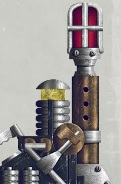

# 1396 传送信标 Teleport Homer

精校状态：中文行文已逐段精校，部分术语仍为暂定

分类：装备 / 信标

原文来源：https://www.bilibili.com/opus/1015578268792782867

原作者：帝国神选罐头

原文时间：2024年12月27日 18:42

[返回分类目录](目录.md) · [全书目录](../../目录.md)

<!-- A1396-B0001 -->
**英文原文**

Teleport Homers are antique pieces of equipment used by Space Marines, Chaos Space Marines and Daemonhunters. They produce a signal which can be locked onto by Terminator Armour suits and which enable them to teleport onto the battlefield with much greater accuracy than simply arriving and scattering. This is a useful piece of equipment, however to be effective it needs to be on the battlefield and in the correct position, which could put the bearer in substantial danger.

<!-- /A1396-B0001 -->

<!-- A1396-B0002 -->

原译文

传送信标是星际战士、混沌星际战士和恶魔猎手使用的古老设备。它们产生的信号可以被终结者盔甲套装锁定，使它们能够以比简单到达和散落空降更高的精度传送到战场上。这是一种有用的设备，但要有效，它需要在战场上处于正确的位置，这可能会使携带者面临巨大的危险。

**校订译文**

传送信标是星际战士、混沌星际战士与恶魔猎手使用的古老设备。它发出的信号可供终结者盔甲锁定，显著提高传送落点的准确度，减少偏移。这种装置十分有用，但要发挥作用，就必须事先放置在战场上的适当位置，因此携带者可能面临极大危险。

<!-- /A1396-B0002 -->

<!-- A1396-B0003 图片 -->

<!-- A1396-B0004 -->

原译文

Teleport Homer 传送信标

**校订译文**

Teleport Homer 传送信标

<!-- /A1396-B0004 -->

本篇核心术语与暂定项

以下列出本篇出现的英文原形及核心术语表用词。同形词可能指不同对象，具体词义以本篇正文和校注为准；单复数、别名和仅见于图注的名称可能尚未列入。完整候选见[术语表](../../术语表/双语术语候选.csv)。

| 英文 | 采用中文 | 状态 |
| --- | --- | --- |
| Space Marines | 星际战士 | 官方已核对 |
| Chaos Space Marines | 混沌星际战士 | 官方已核对 |
| Terminator | 终结者 | 官方已核对 |
| Equipment | 装备 | 编辑用语已统一 |
| Terminator Armour | 终结者盔甲 | 暂定·官方待核 |

