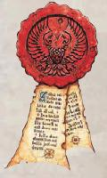
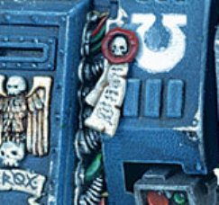

# 1402 纯洁印记 Purity seal

精校状态：中文行文已逐段精校，部分术语仍为暂定

分类：装备 / 信标

原文来源：https://www.bilibili.com/opus/1014775371888853001

原作者：帝国神选罐头

原文时间：2024年12月25日 14:46

[返回分类目录](目录.md) · [全书目录](../../目录.md)

<!-- A1402-B0001 -->
**英文原文**

Purity seals are borne by various Imperial troops, applied to weapons, armor and vehicles. They take the form of wax seals and parchment inscribed with declarations and prayers. They are prominently displayed on armour, and symbolize that the wearer is uncontaminated by the slightest taint of Chaos.

<!-- /A1402-B0001 -->

<!-- A1402-B0002 -->

原译文

纯洁印记由各种帝国军队佩戴，应用于武器、盔甲和车辆。它们以蜡印和羊皮纸的形式出现，上面写着圣言和祷告。它们突出地显示在盔甲上，象征着佩戴者没有受到丝毫混沌的污染。

**校订译文**

帝国各类部队都会使用纯洁印记，将其附在武器、盔甲和车辆上。印记由封蜡与写有宣言、祷文的羊皮纸组成，通常置于盔甲的醒目位置，象征穿戴者未受丝毫混沌污染。

<!-- /A1402-B0002 -->

<!-- A1402-B0003 图片 -->

<!-- A1402-B0004 -->

原译文

Purity seals 纯洁印记

**校订译文**

Purity seals 纯洁印记

<!-- /A1402-B0004 -->

<!-- A1402-B0005 -->
## Space Marine 星际战士

<!-- /A1402-B0005 -->

<!-- A1402-B0006 -->
**英文原文**

A Purity Seal takes the form of prayers or litanies inscribed onto paper and then affixed to the Space Marine armour with red or black wax usually then coated with protective sealants or for more permanence electrum casings. Often it is responsibility of the Chapter's serfs to affix purity seals. They can be affixed to any part of a Space Marine's armour or weapon. Other common places include leg plates and the rims or tops of the shoulder pads. Purity Seals should also not be confused with the prayer sheets and paper litanies worn by the Black Templars, sometimes arrayed in large fluttering layers on their armour. These are specific to that Chapter and part of their own systems of faith and honour, and not taken from the teachings of the Codex Astartes.

<!-- /A1402-B0006 -->

<!-- A1402-B0007 -->

原译文

纯洁印记的形式是在纸上刻下祷言或连祷，然后用红色或黑色蜡贴在星际战士装甲上，通常然后涂上保护性密封剂或更持久的琥珀金外壳。通常，加盖纯洁印记是战团侍从的责任。它们可以附着在星际战士装甲或武器的任何部分。其他常见的地方包括腿甲和肩甲的边缘或顶部。纯洁印记也不应与黑色圣堂佩戴的祷言板和纸质连祷文混淆，有时他们的盔甲上排列着大而飘动的层状物。这些是该战团特有的，也是他们自己的信仰和荣誉体系的一部分，而不是来自阿斯塔特圣典的教义。

**校订译文**

星际战士的纯洁印记由写有祷文或连祷的纸条构成，用红色或黑色封蜡固定在盔甲上，通常再涂上保护性密封剂，或加装更耐久的琥珀金外壳。粘贴印记往往由战团农奴负责。印记可以附在盔甲或武器的任何部位，腿甲、肩甲边缘及顶部都是常见位置。纯洁印记不应与黑色圣堂穿戴的祷文纸条混为一谈；后者有时在盔甲上层层叠叠，迎风飘动，属于黑色圣堂独有的信仰与荣誉体系，并非源自《阿斯塔特圣典》。

<!-- /A1402-B0007 -->

<!-- A1402-B0008 -->
**英文原文**

Purity seals are a mark of a Space Marine's pure faith or morality in the eyes of the Emperor of Mankind and the Chapter. Such seals are only ever awarded by the Chapter’s Chaplains, bestowed upon a Space Marine before battle as the Chaplain bestows a blessing onto the ranks of Space Marines. In many Chapters, this is a solemn ceremony accompanied by chanted litanies in honour of the Primarch and the Emperor. Such ceremonies may be performed because the ranks receiving them are about to undertake a special task or mission, or because they are not expected to survive. Unlike other Honours, the right to actually bear a Purity Seal comes only after a Space Marine has worn it in battle and proven his courage to live up to its ideals. Typically a Chaplain will bestow a Purity Seal on a Space Marine with a specific blessing, such as killing a certain foe or number of enemies for the Emperor, or for completing his duty even when mortally wounded. If the Space Marine returns successful, he has proven the blessing true. He is considered to have the favour of the Emperor and is granted the right to wear the Purity Seal on his armour permanently so that others might recognised his faith and devotion.

<!-- /A1402-B0008 -->

<!-- A1402-B0009 -->

原译文

纯洁印记是人类帝皇和战团眼中星际战士纯洁信仰或道德的标志。这种印章只由战团的牧师颁发，在战斗前授予星际战士，因为牧师会祝福星际战士。在许多战团中，这是一个庄严的仪式，伴随着对原体和帝皇的吟唱。这样的仪式可能是因为接收它们的队伍即将承担特殊任务或使命，或者因为他们不希望幸存下来。与其他荣誉不同，只有在星际战士在战斗中佩戴了纯洁印记并证明了他有勇气实现其理想后，才能真正获得佩戴纯洁印记的权利。通常，牧师会为星际战士授予纯洁印记，并附上特定的祝福，例如为帝皇杀死一定数量的敌人，或者即使在受了致命伤的情况下也能完成任务。如果星际战士成功归来，他已经证明了祝福是真的。他被认为得到了帝皇的青睐，并被授予在盔甲上永久佩戴纯洁印记的权利，以便其他人能够认可他的信仰和奉献。

**校订译文**

纯洁印记象征着星际战士在帝皇与战团眼中的信仰和品德纯洁无瑕。它只能由战团教士授予：教士会在战斗前祝福战士，并赐下印记。在许多战团中，这是庄严的仪式，伴有歌颂原体和帝皇的连祷。接受印记的战士可能即将执行特殊任务，也可能预计无法生还。与其他荣誉不同，战士必须佩戴印记投入战斗，以勇气证明自己配得上其中的理想，才真正获得长期佩戴的资格。教士通常会给予具体祝福，例如为帝皇斩杀某个强敌或一定数量的敌人，或即使身负致命伤也能完成职责。如果战士成功归来，就证明他实现了祝福，被视为蒙受帝皇眷顾，获准将印记永久佩戴在盔甲上，让其他人见证他的信仰与忠诚。

**校注：** not expected to survive为预计无法生还，不是战士不希望活下来；补回杀死特定敌人的祝福。

<!-- /A1402-B0009 -->

<!-- A1402-B0010 图片 -->

<!-- A1402-B0011 -->

原译文

On this Dreadnought, a purity seal is located just left of the Ultramarine insignia 在这个无畏上，一个纯洁印记位于极限战士徽章的左侧。

**校订译文**

On this Dreadnought, a purity seal is located just left of the Ultramarine insignia 在这个无畏上，一个纯洁印记位于极限战士徽章的左侧。

<!-- /A1402-B0011 -->

<!-- A1402-B0012 -->
**英文原文**

Each Purity Seal carries with it a different invocation of blessing as devised by the Chaplain depending on his assessment of the Space Marine's own purity. The exact nature of the blessing depends on the Chaplain, and is chosen when the blessing is bestowed. Common blessings include such things as 'no xenos blade shall piece the brothers flesh'; 'once within the brother’s sight, no enemy shall live to see another day'; or 'this brother’s boltgun shall never grow cold from firing or his chainsword dry from blood once the enemy has been encountered'. The effect of these blessings is mostly to spur the Space Marine in an effort to prove his valour to his Chapter and to the Emperor by bringing the blessing to pass, and it may even cause him to change his tactics or become reckless with bravery. A Battle-Brother can also draw strength from his Purity Seal by reciting its prayer and reaffirming his sense of duty to his Chapter and to the Emperor. It could also mean resisting some manner of subversion if it would break the nature of the Purity Seal’s blessing, granting the Space Marine another burst of effort fuelled by his unbreakable sense of honour. Finally, those that bear a Purity Seal are recognized for their devotion and loyalty, in a similar way to the Imperialis, and as a result respected for their achievements.

<!-- /A1402-B0012 -->

<!-- A1402-B0013 -->

原译文

每个纯洁印记都带有牧师根据他对星际战士自身纯度的评估而设计的不同祝福。祝福的确切性质取决于牧师，并在祝福时被选择。常见的祝福包括“没有异型之刃能刺穿战斗兄弟的血肉”“一旦进入战斗兄弟的视野，敌人就活不到次日”；或者“一旦遭遇敌人，战斗兄弟的爆弹枪射击时将永远不会过热，他的链锯剑也永远不会因缺少鲜血而干涸”。这些祝福的效果主要是激励星际战士通过祝福来向他的战团和帝皇证明他的勇气，甚至可能导致他改变战术或变得鲁莽勇敢。战斗兄弟也可以通过背诵其纯洁印记的祷言，并重申他对战团和帝皇的责任，从中汲取力量。这也可能意味着，如果某种颠覆行为会破坏纯洁印记的祝福本质，那么就要进行抵抗。这种抵抗会让星际战士凭借其坚不可摧的荣誉感，获得另一股力量的爆发。最后，那些带有纯洁印记的人因其奉献和忠诚而受到认可，就像帝国勋章一样，因此他们的成就也受到尊重。

**校订译文**

每一枚纯洁印记都载有不同的祝祷，由教士根据对战士纯洁程度的判断拟定。祝福的具体内容由教士在授予时决定，常见的包括：“异形之刃不得刺穿这位兄弟的血肉”；“凡进入这位兄弟视野的敌人，都无法活着见到明日”；或“迎敌之后，这位兄弟的爆矢枪不得因停火而冷却，他的链锯剑不得因无血可饮而干涸”。这些祝福主要是激励战士努力使祷文成真，向战团与帝皇证明勇气，甚至可能促使他改变战术，奋勇到近乎鲁莽的地步。战斗兄弟也能通过诵读祷文、重申对战团与帝皇的职责，从印记中汲取力量。如果某种蛊惑会使他违背印记中的祝福，他便会凭借不屈的荣誉感奋力抵抗。与帝国徽记一样，纯洁印记彰显佩戴者的忠诚与奉献，使他们因自身功绩而受到尊重。

**校注：** never grow cold指枪口因不断射击而不冷却，原译“不再过热”意义相反；Imperialis沿帝国徽记。

<!-- /A1402-B0013 -->

本篇核心术语与暂定项

以下列出本篇出现的英文原形及核心术语表用词。同形词可能指不同对象，具体词义以本篇正文和校注为准；单复数、别名和仅见于图注的名称可能尚未列入。完整候选见[术语表](../../术语表/双语术语候选.csv)。

| 英文 | 采用中文 | 状态 |
| --- | --- | --- |
| Space Marines | 星际战士 | 官方已核对 |
| Black Templars | 黑色圣堂 | 官方已核对 |
| Boltgun | 爆矢枪 | 官方已核对 |
| Chainsword | 链锯剑 | 官方已核对 |
| Emperor of Mankind | 人类帝皇 | 暂定 |
| Emperor | 帝皇 | 官方已核对 |
| Primarch | 原体 | 官方已核对 |
| Mission | 教团／传教机构 | 暂定 |
| Chaplain | 教士 | 官方已核对 |
| Space Marine | 星际战士 | 暂定·官方待核 |
| Chapter | 战团 | 暂定·官方待核 |
| Brother | 修士 | 暂定·官方待核 |
| Battle-Brother | 战斗兄弟 | 暂定·官方待核 |
| Codex Astartes | 阿斯塔特圣典 | 暂定·官方待核 |
| The Black Templars | 黑色圣堂 | 暂定·官方待核 |
| Xenos | 异形 | 暂定·官方待核 |
| Imperialis | 帝国徽记 | 暂定·官方待核 |
| Chaplains | 教士 | 暂定·官方待核 |
| Bear | 熊 | 暂定·官方待核 |

