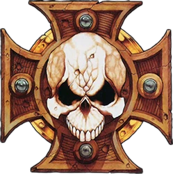

# 1406 终结者十字章 Crux Terminatus

精校状态：中文行文已逐段精校，部分术语仍为暂定

分类：装备 / 信标

原文来源：https://www.bilibili.com/opus/1015955027612663810

原作者：帝国神选罐头

原文时间：2024年12月28日 19:04

[返回分类目录](目录.md) · [全书目录](../../目录.md)

<!-- A1406-B0001 -->
**英文原文**

The Crux Terminatus, or Terminator Honors, is a stone medallion set into the left shoulder plate of every Terminator armour,

<!-- /A1406-B0001 -->

<!-- A1406-B0002 -->

原译文

终结者十字章，或称终结者荣誉勋章，是镶嵌在每个终结者盔甲左肩板上的一块石制勋章，

**校订译文**

终结者十字章，又称终结者荣誉勋章，是镶嵌在每套终结者盔甲左肩甲上的石制徽章。

<!-- /A1406-B0002 -->

<!-- A1406-B0003 图片 -->

<!-- A1406-B0004 -->

原译文

Crux Terminatus 终结者十字章

**校订译文**

Crux Terminatus 终结者十字章

<!-- /A1406-B0004 -->

<!-- A1406-B0005 -->
**英文原文**

It is said to incorporate fragments of the Emperor's Armour. During his struggle against Horus aboard the Vengeful Spirit at the climax of the Horus Heresy, the Emperor was aided by a squad of Terminators from the Imperial Fists. In recognition of their act of valour, the mortally wounded Emperor ordered that his own suit of armour be taken off and melted down, and its shards incorporated into badges that all Terminator Captains should wear. Therefore all efforts are made to recover the suits of Captains killed in action as the loss of such a relic brings great dishonour to the squad and the Chapter.

<!-- /A1406-B0005 -->

<!-- A1406-B0006 -->

原译文

据说里面有帝皇盔甲的碎片。在荷鲁斯叛乱达到高潮时，帝皇登上复仇之魂号与荷鲁斯进行斗争，期间得到了帝国之拳中一队终结者的帮助。为了表彰他们的英勇行为，身受重伤的帝皇下令脱下自己的盔甲并将其熔化，并将其碎片融入所有终结者连长都应该佩戴的勋章中。因此所有人会尽一切努力夺回在战斗中牺牲的连长的盔甲套装，因为丢失这样的圣物会给小队和战团带来极大的耻辱。

**校订译文**

据说，十字章中封存着帝皇盔甲的碎片。荷鲁斯之乱的最终决战中，帝皇在复仇之魂号上与荷鲁斯交战，曾得到一队帝国之拳终结者的协助。为表彰他们的英勇，身负致命伤的帝皇下令将自己的盔甲卸下熔化，把碎片封入徽章，交由所有终结者连长佩戴。因此，战士们会竭尽全力回收阵亡连长的盔甲；丢失这样的圣物，将给小队与战团带来莫大的耻辱。

**校注：** 本篇按英文保留帝国之拳助战、帝皇下令熔甲的说法；与其他版本的终局描写可能不同，不据设定记忆覆盖。

<!-- /A1406-B0006 -->

<!-- A1406-B0007 -->
**英文原文**

This Honour appears most commonly as a skull set onto a cruciform shape of red iron or bone. Terminator sergeants often add crossed bones behind the skull, whilst lightning bolts behind the skull are often added for Terminators trained as Assault units wielding lightning claws and thunder hammers with storm shields. Variations include the size and dimensions of the skull and the removal of the crossed lightning bolts or bones or their scale in relation to the shape of the cruciform. The Crux Terminatus is almost always worn on the left shoulder pad, though it may also be worn on one knee pad (this is usually done only in combination with the shoulder pad, however).

<!-- /A1406-B0007 -->

<!-- A1406-B0008 -->

原译文

这种荣誉最常见的表现是一个镶嵌在十字形红铁或骨头上的头骨。终结者军士经常在头骨后面添加交叉的骨头，而头骨后面的闪电通常是为训练有素的终结者添加的，他们挥舞着闪电爪和带有风暴盾的雷霆锤。变化包括头骨的大小和尺寸，移除交叉的闪电或骨头或者它们与十字形状的关系。终结者十字章几乎总是佩戴在左肩甲上，尽管它也可以佩戴在一个膝甲上（但这通常只与肩甲结合使用）。

**校订译文**

这种荣誉徽记最常见的形式，是在红铁或骨质十字底座上嵌入一枚骷髅。终结者军士通常会在骷髅后添加交叉的骨饰；受训担任突击兵、使用闪电爪，或雷霆锤与风暴盾的终结者，则常在骷髅后添加闪电纹。徽记还存在多种变体，包括改变骷髅的大小与比例、移除交叉骨饰或闪电纹，以及调整这些元素相对于十字底座的比例。终结者十字章几乎总是佩戴在左肩甲上，有时也出现在一侧膝甲上，不过膝甲徽记通常与肩甲徽记同时使用。

<!-- /A1406-B0008 -->

<!-- A1406-B0009 -->
**英文原文**

They vary from chapter to chapter; among the Space Wolves, for instance, the human skull is replaced by a wolf skull; or by a sword among the Deathwing of the Dark Angels. While only the most precious Cruxes of most Chapters contain a shard of the Emperor's Armour, all those used by the Grey Knights have such an honor.

<!-- /A1406-B0009 -->

<!-- A1406-B0010 -->

原译文

它们因战团而异；例如，在太空野狼中，人类头骨被狼头骨所取代；或者在黑暗天使的死翼中用剑取代。虽然大多数战团中只有最珍贵的十字章包含帝皇盔甲的碎片，但灰骑士使用的所有十字章都有这样的荣誉。

**校订译文**

不同战团的样式也不尽相同。例如，太空野狼会以狼颅代替人类骷髅，黑暗天使的死翼则以剑代替。大多数战团只有最珍贵的十字章中才封存帝皇盔甲碎片，而灰骑士的每一枚十字章都享有这种殊荣。

<!-- /A1406-B0010 -->

<!-- A1406-B0011 -->
## Crux Argentum 银十字章

<!-- /A1406-B0011 -->

<!-- A1406-B0012 -->
**英文原文**

The Crux Terminatus can be adorned with The Crux Argentum, a silver badge encrusted with gems, rewarding acts of extreme valour on the field.

<!-- /A1406-B0012 -->

<!-- A1406-B0013 -->

原译文

终结者十字章也可以被银十字章装饰，这是一个镶嵌着宝石的银色勋章，奖励在战场上的极度英勇行为。

**校订译文**

终结者十字章还可以加饰银十字章。这是一枚镶嵌宝石的银质徽章，用于表彰战场上极为英勇的表现。

<!-- /A1406-B0013 -->

本篇核心术语与暂定项

以下列出本篇出现的英文原形及核心术语表用词。同形词可能指不同对象，具体词义以本篇正文和校注为准；单复数、别名和仅见于图注的名称可能尚未列入。完整候选见[术语表](../../术语表/双语术语候选.csv)。

| 英文 | 采用中文 | 状态 |
| --- | --- | --- |
| Dark Angels | 黑暗天使 | 官方已核对 |
| Grey Knights | 灰骑士 | 官方已核对 |
| Space Wolves | 太空野狼 | 官方已核对 |
| Terminator | 终结者 | 官方已核对 |
| Horus Heresy | 荷鲁斯之乱 | 官方已核对 |
| Imperial Fists | 帝国之拳 | 暂定 |
| Emperor | 帝皇 | 官方已核对 |
| Horus | 荷鲁斯 | 暂定·官方待核 |
| Vengeful Spirit | 复仇之魂号 | 暂定·官方待核 |
| Chapter | 战团 | 暂定·官方待核 |
| Terminators | 终结者 | 暂定·官方待核 |
| The Dark | 《黑暗》 | 暂定·官方待核 |
| Crux | 南十字 | 暂定·官方待核 |
| Terminator Armour | 终结者盔甲 | 暂定·官方待核 |
| Crux Terminatus | 终结者十字章 | 暂定·官方待核 |
| Crux Argentum | 银十字章 | 暂定·官方待核 |
| The Loss | 失落 | 暂定·官方待核 |

