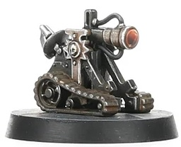

# 1410 智控改造任务单元 Cyber-Altered Task unit

精校状态：中文行文已逐段精校，部分术语仍为暂定

分类：装备 / 智控

原文来源：https://www.bilibili.com/opus/1043725246774902801

原作者：帝国神选罐头

原文时间：2025年03月13日 15:07

[返回分类目录](目录.md) · [全书目录](../../目录.md)

<!-- A1410-B0001 -->
**英文原文**

Cyber-Altered Task units ("CATs") are mechanical drones designed to perform simple tasks, like inorganic servitors. Programmed with a set of very simple instructions, they are occasionally used by the Adeptus Mechanicus and some chapters of the Adeptus Astartes as remote probes and retrieval units. Though they do not possess any biological components, their extremely limited programing prevents them from being classified as examples of Abominable Intelligence.

<!-- /A1410-B0001 -->

<!-- A1410-B0002 -->

原译文

智控改造任务单元（“CAT”）是设计用于执行简单任务的机械无人机，如无机机仆。它们用一组非常简单的指令编程，偶尔被机械神教和阿斯塔特修会的一些战团用作远程探测器和数据检索单元。尽管它们不具有任何生物成分，但它们极其有限的程序使它们无法被归类为憎恶智能的范畴。

**校订译文**

智控改造任务单元（简称CAT）是为执行简单任务而设计的无人机械，类似不含有机部件的机仆。它们只运行一组极简单的指令，机械修会及部分星际战士战团偶尔将其用作远程探测和回收单元。虽然完全不含生物部件，但由于程序能力极其有限，它们不被归入憎恶智能。

<!-- /A1410-B0002 -->

<!-- A1410-B0003 图片 -->

<!-- A1410-B0004 -->

原译文

CAT Drone CAT无人机

**校订译文**

CAT Drone CAT无人机

<!-- /A1410-B0004 -->

<!-- A1410-B0005 -->
**英文原文**

The drones utilise a simple Vox circuit that traverses in a straight line and relay's Picts and other relevant environmental data to the user. When the drone encounters an obstacle they can't negotiate, they rotate ten degrees and continue forward, repeating the process until they can move without impediment.

<!-- /A1410-B0005 -->

<!-- A1410-B0006 -->

原译文

无人机利用一个简单的音阵回路，该回路沿直线移动，并将图片和其他相关环境数据传递给使用者。当无人机遇到无法通过的障碍物时，它们会旋转十度并继续前进，重复这个过程，直到它们可以毫无阻碍地移动。

**校订译文**

这种无人机械沿直线行进，通过简单的音阵电路向使用者传回影像及相关环境数据。遇到无法越过的障碍时，它会转向十度，继续前进；如此反复，直到能够畅通行进。

**校注：** 英文关系从句误挂在vox circuit后；按整段行为主体译为无人机械行进，电路只传输数据。

<!-- /A1410-B0006 -->

<!-- A1410-B0007 -->
**英文原文**

As of M42, CATs had been in service with both bodies for several centuries, or even millennia, although the Mechanicum and the Astartes prefer the versatility and expertise of a servitor or a Scout, respectively. Nevertheless, constructing CATs is a popular hobby for Mechanicus Adepts and Techmarines, who claim that the activity is a useful meditative exercise, and CATs are frequently underfoot at any shrine to the Omnissiah.

<!-- /A1410-B0007 -->

<!-- A1410-B0008 -->

原译文

截至M42，CAT已经在这两个组织服役了几个世纪，甚至几千年，尽管机械神教和阿斯塔特分别更喜欢机仆或侦察兵的多才多艺和专业知识。然而，CATs是机械神教和技术军士的一种流行爱好，他们声称这项活动是一种有用的冥想练习，CATs经常出现在任何欧姆尼赛亚神龛的脚下。

**校订译文**

到M42，CAT已在上述两个组织中服役了数百年，甚至数千年。不过，机械教更青睐机仆，阿斯塔特则更依赖侦察兵，因为它们各自更加多能、熟练。尽管如此，制作CAT仍是机械修会技术人员和科技战士的热门爱好。他们声称，这是一种有益的冥想练习。在欧姆尼赛亚的神龛附近，人们经常能见到CAT在脚边来回穿行。

**校注：** 英文在当代语境混用Mechanicum与Adeptus Mechanicus，本稿仍按各自名称译机械教、机械修会，不由此新增两个使用组织。

<!-- /A1410-B0008 -->

<!-- A1410-B0009 -->
**英文原文**

In fact, some suspicious members of the Inquisition have observed that their creators seem to treat their CATs almost like pets, though the Mechanicum claims to be above such emotional attachments.

<!-- /A1410-B0009 -->

<!-- A1410-B0010 -->

原译文

事实上，审判庭的一些多疑的成员观察到，它们的创造者似乎把CATs当作宠物对待，尽管机械教声称他们没有这种情感依恋。

**校订译文**

事实上，审判庭中一些心存疑虑的成员发现，制造者对待CAT的方式几乎如同饲养宠物，尽管机械教自称不受这类情感依恋影响。

<!-- /A1410-B0010 -->

<!-- A1410-B0011 -->
**英文原文**

CATs were deployed by the exploratory team sent from the Reclaimers Space Marines aboard the Space Hulk Spawn of Damnation.

<!-- /A1410-B0011 -->

<!-- A1410-B0012 -->

原译文

CATs由回收者星际战士派出的探险队部署在太空废船诅咒之子号上。

**校订译文**

回收者战团派往太空废船诅咒之子号的探索队，曾使用CAT。

<!-- /A1410-B0012 -->

本篇核心术语与暂定项

以下列出本篇出现的英文原形及核心术语表用词。同形词可能指不同对象，具体词义以本篇正文和校注为准；单复数、别名和仅见于图注的名称可能尚未列入。完整候选见[术语表](../../术语表/双语术语候选.csv)。

| 英文 | 采用中文 | 状态 |
| --- | --- | --- |
| Space Marines | 星际战士 | 官方已核对 |
| Adeptus Astartes | 阿斯塔特修会 | 官方已核对 |
| Adeptus Mechanicus | 机械修会 | 官方已核对 |
| Inquisition | 审判庭 | 暂定 |
| Mechanicum | 机械教 | 暂定·历史称谓 |
| Servitor | 机仆 | 暂定 |
| Abominable Intelligence | 憎恶智能 | 暂定·官方待核 |
| Omnissiah | 欧姆尼赛亚 | 暂定·官方待核 |
| Scout | 侦察兵 | 暂定·官方待核 |
| Reclaimers | 回收者 | 暂定·官方待核 |
| Spawn of Damnation | 诅咒之子号 | 暂定·官方待核 |

