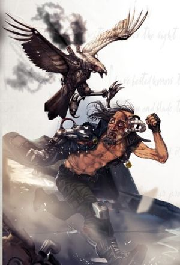

# 1413 格斗天鹰 Grapplehawk

精校状态：中文行文已逐段精校，部分术语仍为暂定

分类：装备 / 智控

原文来源：https://www.bilibili.com/opus/1214755049271459881

原作者：帝国神选罐头

原文时间：2026年06月17日 12:30

[返回分类目录](目录.md) · [全书目录](../../目录.md)

原篇名：搏斗鹰 Grapplehawk

<!-- A1413-B0001 -->
**英文原文**

Grapplehawks are cyber-familiars often used by the Adeptus Arbites that resemble birds of prey.

<!-- /A1413-B0001 -->

<!-- A1413-B0002 -->

原译文

搏斗鹰是智控单位，经常被法务部使用，类似猛禽。

**校订译文**

格斗天鹰是一种形似猛禽的智控魔宠，常由法务部使用。

<!-- /A1413-B0002 -->

<!-- A1413-B0003 -->
## Overview 概述

<!-- /A1413-B0003 -->

<!-- A1413-B0004 -->
**英文原文**

Although most commonly employed by the Arbites, Grapplehawks are also used by some bounty hunters, Rogue Traders and Adeptus Mechanicus Magi. Grapplehawks are technically a type of servitor and take the form of elegant shining steel hawks. Their glittering crania contain the transplanted instincts of avians trained to seize moving targets without damaging them. These instincts, transferred to mechanical constructs fitted with powerful suspensors and talons capable of tearing through cast-iron, enable Arbites handlers to arrest suspects quickly (if brutally) on the streets of the Calixian Hives. Designed to be carried on the hip, or to perch elsewhere on the handler's armour.

<!-- /A1413-B0004 -->

<!-- A1413-B0005 -->

原译文

虽然搏斗鹰最常被法务部使用，但也被一些赏金猎人、行商浪人和机械神教贤者使用。搏斗鹰在技术上是一种机仆，其形态是优雅闪亮的钢鹰。它们闪闪发光的头骨包含着鸟类移植的本能，这些鸟类经过训练，可以在不损坏移动目标的情况下抓住它们。这些本能被转移到装有强大韧带和能够撕裂铸铁的爪子的机械结构中，使法务部的驯兽员能够在卡利西安巢都的街头快速逮捕嫌疑人（如果残忍的话）。设计用于髋部携带，或栖息在驯兽员盔甲的其他地方。

**校订译文**

格斗天鹰最常见于法务部，但一些赏金猎人、行商浪人和机械修会贤者也会使用。从技术上说，它是一种机仆，外形如优雅而闪亮的钢铁猎鹰。其金属头颅中植入了鸟类的本能；这些鸟类事先受过训练，能够捕捉移动目标而不将其伤害。机械躯体配有强大的悬浮装置，以及足以撕裂铸铁的利爪。凭借这些装备和移植的本能，法务部驯养员能在卡利西斯诸巢都的街道上迅速制服嫌疑人，尽管手段可能相当粗暴。格斗天鹰可以挂在腰侧，也可栖停在驯养员盔甲的其他位置。

**校注：** suspensors是悬浮装置，原“韧带”错误；Calixian沿卡利西斯星区地名词根。

<!-- /A1413-B0005 -->

<!-- A1413-B0006 图片 -->

<!-- A1413-B0007 -->

原译文

Grapplehawk catching its prey 搏斗鹰捕捉猎物

**校订译文**

Grapplehawk catching its prey 格斗天鹰捕捉猎物

<!-- /A1413-B0007 -->

<!-- A1413-B0008 -->
## Known Variants 已知型号

<!-- /A1413-B0008 -->

<!-- A1413-B0009 -->
**英文原文**

Calixian Pattern — A lighter variant with built-in shock talons.

<!-- /A1413-B0009 -->

<!-- A1413-B0010 -->

原译文

卡里西安型 — 一种更轻的变体，内置震撼爪。

**校订译文**

卡利西斯型——重量较轻，内置电击爪。

<!-- /A1413-B0010 -->

<!-- A1413-B0011 -->
**英文原文**

Falax Pattern — Favoured by Thulian Magos and large enough to lift a human.

<!-- /A1413-B0011 -->

<!-- A1413-B0012 -->

原译文

法拉克斯型 — 受到图利安贤者的青睐，大到足以举起一个人。

**校订译文**

法拉克斯型——图利安贤者偏爱的型号，体型足以吊起一个人。

<!-- /A1413-B0012 -->

<!-- A1413-B0013 -->
**英文原文**

Subrique Pattern — Commonly used by the Adeptus Arbites.

<!-- /A1413-B0013 -->

<!-- A1413-B0014 -->

原译文

萨布里克型 —通常由法务部使用。

**校订译文**

萨布里克型——法务部常用的型号。

<!-- /A1413-B0014 -->

本篇核心术语与暂定项

以下列出本篇出现的英文原形及核心术语表用词。同形词可能指不同对象，具体词义以本篇正文和校注为准；单复数、别名和仅见于图注的名称可能尚未列入。完整候选见[术语表](../../术语表/双语术语候选.csv)。

| 英文 | 采用中文 | 状态 |
| --- | --- | --- |
| Adeptus Mechanicus | 机械修会 | 官方已核对 |
| Servitor | 机仆 | 暂定 |
| Adeptus Arbites | 法务部 | 暂定 |
| Cyber-familiars | 智控魔宠 | 暂定·官方待核 |
| Calixian Pattern | 卡利西斯型 | 暂定·官方待核 |
| Falax Pattern | 法拉克斯型 | 暂定·官方待核 |
| Subrique Pattern | 萨布里克型 | 暂定·官方待核 |
| Thulian Magos | 图利安贤者 | 暂定·官方待核 |

