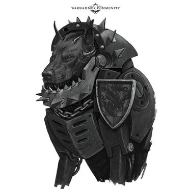
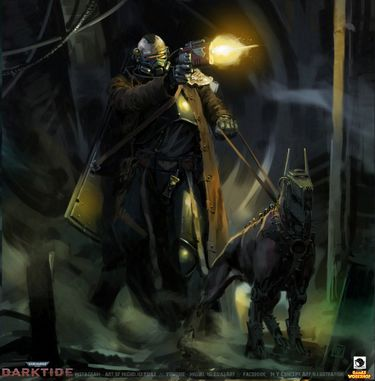
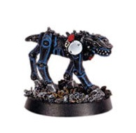
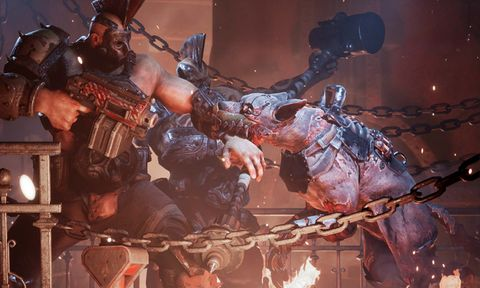
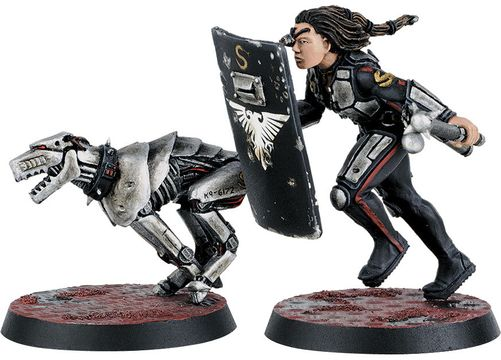
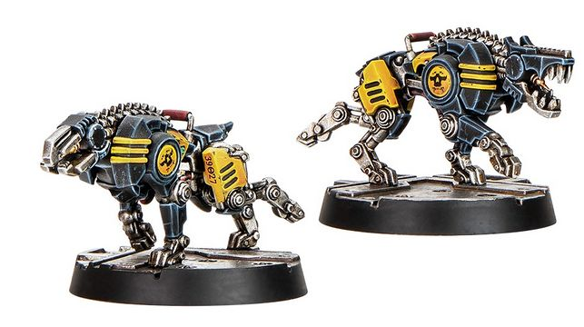
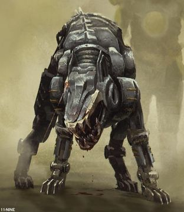
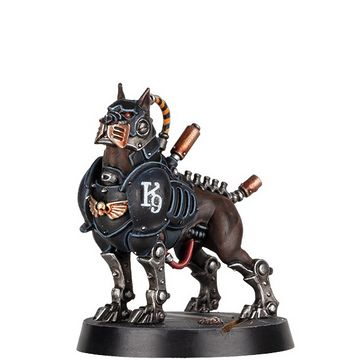
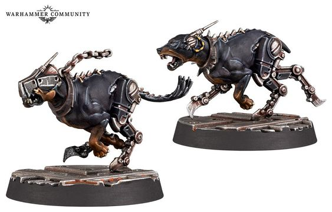

# 1414 智控獒犬 Cyber-Mastiffs

精校状态：中文行文已逐段精校，部分术语仍为暂定

分类：装备 / 智控

原文来源：https://www.bilibili.com/opus/1215211174830800904

原作者：帝国神选罐头

原文时间：2026年06月18日 18:00

[返回分类目录](目录.md) · [全书目录](../../目录.md)

<!-- A1414-B0001 -->
**英文原文**

Cyber-Mastiffs are caniform servitors created from Mastiffs, or other canids, that have received varying amounts of bionic upgrades. Some are almost entirely mechanical creatures resembling a hound and guided by the brain and nervous system of a hunting creature, after such components have been integrated by members of the Adeptus Mechanicus. It isn't uncommon, however, to see mostly biological canines who have only received a minimal amount of cybernetic upgrades.

<!-- /A1414-B0001 -->

<!-- A1414-B0002 -->

原译文

智控獒犬是由獒或其他犬科动物创造的犬型造物，它们已经接受了不同程度的仿生升级。有些几乎完全是机械生物，类似于猎犬，由狩猎生物的大脑和神经系统引导，在这些组件被机械神教的成员整合后。然而，看到大多数生物犬只接受了少量的智控升级并不罕见。

**校订译文**

智控獒犬是以獒犬或其他犬科动物为基础、经过不同程度机械改造的犬形机仆。有些几乎全为机械结构，外形如猎犬，由机械修会人员植入猎食动物的大脑和神经系统进行控制。也有不少仍以生物组织为主，只接受了少量机械改造。

<!-- /A1414-B0002 -->

<!-- A1414-B0003 图片 -->

<!-- A1414-B0004 -->

原译文

House Orlock Cyber-Mastiff 奥洛克家族智控獒犬

**校订译文**

House Orlock Cyber-Mastiff 欧洛克家族智控獒犬

<!-- /A1414-B0004 -->

<!-- A1414-B0005 -->
## Overview 概述

<!-- /A1414-B0005 -->

<!-- A1414-B0006 -->
**英文原文**

Commonly known as kill-dogs, razorfangs and rending rovers, Cyber-Mastiffs have an in-built hunting and attack instinct and can only respond to the simplest of commands from their assigned handler, but are still fully capable of defending themselves and their masters. They can be fitted with additional sensors, such as an Auspex, which are always used on passive. It is said that Cyber-Mastiff can rip off an Ogryn's arm in just one snap of its powerful jaws. Some cyber-mastiffs are vat-grown; furred-slabs bulked out with vat-grown muscles and ridged with augmetic implants. Some cyber-mastiffs share a noospheric connection with one another.

<!-- /A1414-B0006 -->

<!-- A1414-B0007 -->

原译文

智控獒犬通常被称为杀戮犬、剃刀牙和撕碎漫游者，它们有一种内在的狩猎和攻击本能，只能对分配给它们的训犬员的最简单的命令做出反应，但仍然完全有能力保护自己和主人。它们可以配备额外的传感器，如鸟卜仪，这些传感器通常用于被动。据说，智控獒犬可以用它强大的下颚一次就扯下欧格林的手臂。一些智控獒犬是缸生；毛茸茸的厚块上长满了缸生的肌肉，脊上长着螺旋状的植入物。一些智控獒犬彼此之间有一种通感联系。

**校订译文**

智控獒犬俗称杀戮犬、剃刀牙或撕裂游猎犬，具有内在的追猎与攻击本能。它们只能服从指定训犬员最简单的指令，但完全能够保护自己及主人。它们还可加装鸟卜仪等传感器，这些设备始终以被动模式运作。据说，智控獒犬只需猛咬一次，就能扯断欧格林的手臂。有些智控獒犬以培养槽培育，毛皮下隆起的是培养肌肉，体表则突起一道道机械植入物。有些还能通过思维空间彼此联结。

**校注：** noospheric沿已定思维空间；augmetic implants指机械植入物，英文没有螺旋形。

<!-- /A1414-B0007 -->

<!-- A1414-B0008 图片 -->

<!-- A1414-B0009 -->

原译文

Arbitrator and their Cyber-Mastiff 仲裁员和他们的智控獒犬

**校订译文**

Arbitrator and their Cyber-Mastiff 仲裁员和他们的智控獒犬

<!-- /A1414-B0009 -->

<!-- A1414-B0010 -->
**英文原文**

Cyber-Mastiffs are often deployed under the control of Adeptus Arbites Patrol and Enforcer units for hunting down their prey and to catch criminal fugitives who attempt to escape. Some cyber-mastiffs will pin a target with their teeth barely penetrating their throat, pinning them to the ground with their bulk, waiting for their handler's kill-command to be given. Cyber-Mastiffs are a fearsome extension of the Emperor's Law, and a truly terrible sight to see unleashed.

<!-- /A1414-B0010 -->

<!-- A1414-B0011 -->

原译文

智控獒犬经常被部署在法务部巡逻和执法者单位的控制下，以追捕猎物并抓捕试图逃跑的犯罪逃犯。一些智控獒犬会用牙齿刚刚好刺穿喉咙，把目标钉在地上，等待主人发出杀死的命令。智控獒犬是帝皇的律法的可怕延伸，看到它被释放是真实可怕的景象。

**校订译文**

法务部巡逻队与执法部队经常操纵智控獒犬追踪目标、捉拿逃犯。有些獒犬会将牙齿轻轻刺入目标的喉部，以庞大的身躯将其压倒在地，等待训犬员下达杀戮命令。作为帝皇律法的可怕延伸，智控獒犬一旦脱缰出动，便足以令人胆寒。

<!-- /A1414-B0011 -->

<!-- A1414-B0012 图片 -->

<!-- A1414-B0013 -->

原译文

Necromunda's Enforcers Patrol Team Cyber-Mastiff 涅克罗蒙达的执法者巡逻小队智控獒犬

**校订译文**

Necromunda's Enforcers Patrol Team Cyber-Mastiff 涅克罗蒙达的执法者巡逻小队智控獒犬

<!-- /A1414-B0013 -->

<!-- A1414-B0014 -->
**英文原文**

House Orlock of Necromunda is also known to make use of cyber-mastiffs, and one of their legendary gangs from 201.M40 was the Gunshy Girls, with their shotgun-toting cyber-mastiffs.

<!-- /A1414-B0014 -->

<!-- A1414-B0015 -->

原译文

涅克罗蒙达的奥洛克家族也以使用智控獒犬而闻名，他们在201.M40的一个传奇帮派是枪炮女孩，和他们携带霰弹枪的智控獒犬。

**校订译文**

涅克罗蒙达的欧洛克家族也以使用智控獒犬闻名。201.M40，该家族的传奇帮派之一“怯枪女孩”，便拥有携带霰弹枪的智控獒犬。

**校注：** Gunshy Girls暂译怯枪女孩，保留其怕枪却携枪的名称反差；原枪炮女孩遗漏gunshy词义。

<!-- /A1414-B0015 -->

<!-- A1414-B0016 图片 -->

<!-- A1414-B0017 -->

原译文

Member of House Goliath being attacked by a Cyber-Mastiff 歌利亚家族的成员被一只智控獒犬攻击

**校订译文**

Member of House Goliath being attacked by a Cyber-Mastiff 歌利亚家族的成员被一只智控獒犬攻击

<!-- /A1414-B0017 -->

<!-- A1414-B0018 -->
**英文原文**

Cyber-mastiffs are also used by the forces of Chaos like the Blood Pact. These are known as hate-dogs and can weigh two hundred pounds.

<!-- /A1414-B0018 -->

<!-- A1414-B0019 -->

原译文

智控獒犬也被像血契这样的混沌部队所使用。这些被称为仇恨犬，体重可达200磅。

**校订译文**

智控獒犬也被像血契这样的混沌部队所使用。这些被称为仇恨犬，体重可达200磅。

<!-- /A1414-B0019 -->

<!-- A1414-B0020 图片 -->

<!-- A1414-B0021 -->

原译文

Inquisitor's Special Security Enforcer Barbaretta and a Cyber-Mastiff 审判官的特别安全执法者巴巴勒塔和一只智控獒犬

**校订译文**

Inquisitor's Special Security Enforcer Barbaretta and a Cyber-Mastiff 审判官的特别安全执法者巴巴勒塔和一只智控獒犬

<!-- /A1414-B0021 -->

<!-- A1414-B0022 -->
## Known Types of Cyber-Mastiffs 已知智控獒犬类别

<!-- /A1414-B0022 -->

<!-- A1414-B0023 图片 -->

<!-- A1414-B0024 -->

原译文

Palanite Enforcer Cyber-Mastiffs 帕拉蒂尼执法者智控獒犬

**校订译文**

Palanite Enforcer Cyber-Mastiffs 帕拉蒂尼执法者智控獒犬

<!-- /A1414-B0024 -->

<!-- A1414-B0025 -->
**英文原文**

Cybercanids - Used as mechanized cavalry mounts by the Serberys Corps.

<!-- /A1414-B0025 -->

<!-- A1414-B0026 -->

原译文

智控犬 -瑟贝瑞斯兵团用作机械化骑兵坐骑。

**校订译文**

智控犬——塞波利斯兵团将其用作机械骑兵的坐骑。

<!-- /A1414-B0026 -->

<!-- A1414-B0027 -->
**英文原文**

Dymaxion Procyon - A tracking model cyber-mastiff produced on Alecto.

<!-- /A1414-B0027 -->

<!-- A1414-B0028 -->

原译文

戴马克松·小犬座α -阿莱克托上制作的追踪设计智控獒犬。

**校订译文**

戴马克松·南河三——阿勒克图生产的追踪型智控獒犬。

**校注：** Procyon是南河三（小犬座α）的专名，此处作为产品型号，不将希腊字母与中文拼成姓名。

<!-- /A1414-B0028 -->

<!-- A1414-B0029 -->
**英文原文**

Gunhound - More sophisticated version of a cyber-mastiff.

<!-- /A1414-B0029 -->

<!-- A1414-B0030 -->

原译文

枪猎犬 - 更复杂的智控獒犬。

**校订译文**

枪猎犬 - 更复杂的智控獒犬。

<!-- /A1414-B0030 -->

<!-- A1414-B0031 -->

原译文

Hardcase Cyber-Mastiff 硬壳智控獒犬

**校订译文**

Hardcase Cyber-Mastiff 硬壳智控獒犬

<!-- /A1414-B0031 -->

<!-- A1414-B0032 图片 -->

<!-- A1414-B0033 -->

原译文

Hardcase Cyber-Mastiff 硬壳智控獒犬

**校订译文**

Hardcase Cyber-Mastiff 硬壳智控獒犬

<!-- /A1414-B0033 -->

<!-- A1414-B0034 -->

原译文

Malfi-Pattern Eliminator-Mastiff 马尔菲型歼灭者獒犬

**校订译文**

Malfi-Pattern Eliminator-Mastiff 马尔菲型歼灭者獒犬

<!-- /A1414-B0034 -->

<!-- A1414-B0035 -->
**英文原文**

R-VR

<!-- /A1414-B0035 -->

<!-- A1414-B0036 图片 -->

<!-- A1414-B0037 -->

原译文

R-VR Cyber-Mastiff R-VR智控獒犬

**校订译文**

R-VR Cyber-Mastiff R-VR智控獒犬

<!-- /A1414-B0037 -->

<!-- A1414-B0038 -->
**英文原文**

Sirius Six - Sold on Alecto. Advertised to have a bite force of 4,000 pounds per square inch.

<!-- /A1414-B0038 -->

<!-- A1414-B0039 -->

原译文

天狼星六号 - 在阿莱克托上出售。广告宣称其咬合力为每平方英寸4000磅。

**校订译文**

天狼星六号——在阿勒克图销售。广告宣称其咬合压强达到每平方英寸4000磅。

**校注：** 单位为磅每平方英寸，量纲是压强；原咬合力表述按单位校正。广告数值仅转述原文。

<!-- /A1414-B0039 -->

<!-- A1414-B0040 -->

原译文

Subrique "Bullpup" Cyber-Mastiff 萨布里克“斗牛犬”智控獒犬

**校订译文**

Subrique "Bullpup" Cyber-Mastiff 萨布里克“斗牛犬”智控獒犬

<!-- /A1414-B0040 -->

<!-- A1414-B0041 -->

原译文

Subrique "Bloodhound" Cyber-Mastiff 萨布里克“鲜血猎犬”智控獒犬

**校订译文**

Subrique "Bloodhound" Cyber-Mastiff 萨布里克“寻血猎犬”智控獒犬

<!-- /A1414-B0041 -->

<!-- A1414-B0042 图片 -->

<!-- A1414-B0043 -->

原译文

House Orlock Cyber-Mastiffs 奥洛克家族智控獒犬

**校订译文**

House Orlock Cyber-Mastiffs 欧洛克家族智控獒犬

<!-- /A1414-B0043 -->

<!-- A1414-B0044 -->
## Named Cyber-Mastiffs 著名智控獒犬

<!-- /A1414-B0044 -->

<!-- A1414-B0045 -->
**英文原文**

6AW - Local Arbites precinct serfs have a particular dislike for 6AW. The kill-dog's hyper aggression makes its razor-jaw implant very difficult to clean without losing a finger.

<!-- /A1414-B0045 -->

<!-- A1414-B0046 -->

原译文

6AW - 当地的法务部警区农奴特别不喜欢6AW。杀戮犬的极度攻击性使得它的剃刀下巴植入物很难在不失去一根手指的情况下进行清洁。

**校订译文**

6AW——当地法务部辖区的仆役格外厌恶它。它攻击性极强，替它清洁剃刀颚植入物时，很难保住自己的全部手指。

<!-- /A1414-B0046 -->

<!-- A1414-B0047 -->
**英文原文**

A4 - Arbites Cyber-Masriff.

<!-- /A1414-B0047 -->

<!-- A1414-B0048 -->

原译文

A4 - 法务部智控獒犬。

**校订译文**

A4 - 法务部智控獒犬。

<!-- /A1414-B0048 -->

<!-- A1414-B0049 -->
**英文原文**

D060-K13 – Wandering Hardcase-pattern Cyber-Mastiff.

<!-- /A1414-B0049 -->

<!-- A1414-B0050 -->

原译文

D060-K13 – 流浪硬壳型智控獒犬。

**校订译文**

D060-K13 – 流浪硬壳型智控獒犬。

<!-- /A1414-B0050 -->

<!-- A1414-B0051 -->
**英文原文**

Faceripper – Cyber-Mastiff of Maeder Jones of the Sons of Iron.

<!-- /A1414-B0051 -->

<!-- A1414-B0052 -->

原译文

撕脸者 — 铁之子的梅德·琼斯的智控獒犬。

**校订译文**

撕脸者——铁之子帮派成员梅德·琼斯的智控獒犬。

<!-- /A1414-B0052 -->

<!-- A1414-B0053 -->
**英文原文**

GB1 - Arbites Cyber-Masriff.

<!-- /A1414-B0053 -->

<!-- A1414-B0054 -->

原译文

GB1 - 法务部智控獒犬。

**校订译文**

GB1 - 法务部智控獒犬。

<!-- /A1414-B0054 -->

<!-- A1414-B0055 -->
**英文原文**

GL-80 - "Glaito", Cyber-Mastiff of Proctor-Exactant Solomorne Anthar.

<!-- /A1414-B0055 -->

<!-- A1414-B0056 -->

原译文

GL-80 - “格莱托”，强征监督员索洛莫恩·安萨尔的智控獒犬。

**校订译文**

GL-80——昵称“格莱托”，是强征监督员索洛莫恩·安萨尔的智控獒犬。

<!-- /A1414-B0056 -->

<!-- A1414-B0057 -->
**英文原文**

Groinripper – Cyber-Mastiff of Ajax Jones of the Ashtown Angels.

<!-- /A1414-B0057 -->

<!-- A1414-B0058 -->

原译文

撕腹者 - 灰镇天使的阿贾克斯·琼斯的智控獒犬。

**校订译文**

撕腹者——灰镇天使帮派成员阿贾克斯·琼斯的智控獒犬。

<!-- /A1414-B0058 -->

<!-- A1414-B0059 -->
**英文原文**

Kanis – Cyber-Mastiff of Gorman of the Ashline Raiders.

<!-- /A1414-B0059 -->

<!-- A1414-B0060 -->

原译文

卡尼斯 - 灰线突袭者的戈尔曼的智控獒犬。

**校订译文**

卡尼斯——灰线突袭者帮派成员戈尔曼的智控獒犬。

<!-- /A1414-B0060 -->

<!-- A1414-B0061 -->
**英文原文**

KB-88 – Cyber-Mastiff assigned to Scrutinator-Primus Servalen.

<!-- /A1414-B0061 -->

<!-- A1414-B0062 -->

原译文

KB-88 - 分配给首席审查官塞尔瓦伦的智库獒犬。

**校订译文**

KB-88——配属首席审查官塞尔瓦伦的智控獒犬。

<!-- /A1414-B0062 -->

<!-- A1414-B0063 -->
**英文原文**

Macula – Cyber-Mastiff of Slate Merdena.

<!-- /A1414-B0063 -->

<!-- A1414-B0064 -->

原译文

黄斑 - 斯莱特·默德纳的智控獒犬

**校订译文**

黄斑——斯莱特·默德纳的智控獒犬。

<!-- /A1414-B0064 -->

<!-- A1414-B0065 -->
**英文原文**

Old Scartooth – House Orlock Cyber-Mastiff

<!-- /A1414-B0065 -->

<!-- A1414-B0066 -->

原译文

老疤牙 – 奥洛克家族智控獒犬

**校订译文**

老疤牙——欧洛克家族的智控獒犬。

<!-- /A1414-B0066 -->

<!-- A1414-B0067 -->

原译文

Rex Imperialis 帝国君王

**校订译文**

Rex Imperialis 帝国君王

<!-- /A1414-B0067 -->

<!-- A1414-B0068 -->
**英文原文**

S60T - Arbites Cyber Mastiff with 85 confirmed kills, 104 apprehensions, and 18 separate Leashmasters. An impressive tally for a mere 4 years of service.

<!-- /A1414-B0068 -->

<!-- A1414-B0069 -->

原译文

S60T - 法务部智控獒犬已确认85人死亡，104人被捕，18名分离的训犬大师。仅仅4年的服务就取得了令人印象深刻的成绩。

**校订译文**

S60T——法务部智控獒犬，已确认击杀85人、逮捕104人，先后由18名牵犬师操纵。服役仅四年，就有了这份惊人的履历。

**校注：** 18 separate Leashmasters指先后18名不同牵犬师，原“18名分离的训犬大师”误译；不推断其死因。

<!-- /A1414-B0069 -->

<!-- A1414-B0070 -->

原译文

Scrappy 斗志昂扬

**校订译文**

Scrappy 斗志昂扬

<!-- /A1414-B0070 -->

<!-- A1414-B0071 -->
**英文原文**

Theta-17 - An Arbites Cyber-Mastiff noted for its unmatched ferocity.

<!-- /A1414-B0071 -->

<!-- A1414-B0072 -->

原译文

西塔-17 - 一只以其无与伦比的凶猛而闻名的法务部智控獒犬。

**校订译文**

西塔-17 - 一只以其无与伦比的凶猛而闻名的法务部智控獒犬。

<!-- /A1414-B0072 -->

<!-- A1414-B0073 -->
**英文原文**

UY-07 - During an Arbitrator's investigation in Hive Tertium's Metalfab HM-56, UY-07 is said to have bitten clean through a reinforced plasteel plate to get to their designated target.

<!-- /A1414-B0073 -->

<!-- A1414-B0074 -->

原译文

UY-07 - 在仲裁员对第三巢都的金属制造厂HM-56进行调查期间，据说UY-07咬穿了一块加固的塑钢板，到达了指定的目标。

**校订译文**

UY-07——据说，在一名仲裁员调查第三巢都HM-56金属制造厂期间，它曾直接咬穿一块加固塑钢板，直扑指定目标。

<!-- /A1414-B0074 -->

<!-- A1414-B0075 -->
**英文原文**

Wotan – Cyber-Mastiff of Kal Jerico, formerly his half-sister Merelda's

<!-- /A1414-B0075 -->

<!-- A1414-B0076 -->

原译文

沃坦 - 卡尔·杰里科的智控獒犬，以前是他的同父异母妹妹梅蕾尔达的

**校订译文**

沃坦——卡尔·杰里科的智控獒犬，原本属于与他只有一方父母相同的姐妹梅蕾尔达。

**校注：** half-sister只说明共享一方父母，未交代父系母系或长幼，撤去原译“同父异母妹妹”的无依据限定。

<!-- /A1414-B0076 -->

<!-- A1414-B0077 -->
**英文原文**

X7 - Arbites Cyber-Masriff.

<!-- /A1414-B0077 -->

<!-- A1414-B0078 -->

原译文

X7 - 法务部智控獒犬。

**校订译文**

X7 - 法务部智控獒犬。

<!-- /A1414-B0078 -->

<!-- A1414-B0079 -->
**英文原文**

XX9 - Last operator was Leashmaster Hendrych Kron, who was killed during a cartel raid in the Torrent. XX9 dispatched the remaining thugs and dragged Kron's corpse to the extraction point.

<!-- /A1414-B0079 -->

<!-- A1414-B0080 -->

原译文

XX9 - 最后一名操作者是训犬大师亨德里奇·克朗，他在洪流中的卡特尔突袭中丧生。XX9处理了剩下的暴徒，把克朗的尸体拖到提取点。

**校订译文**

XX9——上一任操作者是牵犬师亨德里奇·克朗，他在洪流地区的一次卡特尔突袭中丧生。XX9杀死了剩余暴徒，并将克朗的尸体拖回撤离点。

<!-- /A1414-B0080 -->

本篇核心术语与暂定项

以下列出本篇出现的英文原形及核心术语表用词。同形词可能指不同对象，具体词义以本篇正文和校注为准；单复数、别名和仅见于图注的名称可能尚未列入。完整候选见[术语表](../../术语表/双语术语候选.csv)。

| 英文 | 采用中文 | 状态 |
| --- | --- | --- |
| Adeptus Mechanicus | 机械修会 | 官方已核对 |
| Ogryn | 欧格林 | 官方已核对 |
| Emperor | 帝皇 | 官方已核对 |
| Adeptus Arbites | 法务部 | 暂定 |
| Necromunda | 涅克罗蒙达 | 暂定·官方待核 |
| Alecto | 阿勒克图 | 暂定·官方待核 |
| Cyber-Mastiff | 智控獒犬 | 暂定·官方待核 |
| Serberys Corps | 塞波利斯兵团 | 暂定·官方待核 |
| Arbitrator | 仲裁官 | 暂定·官方待核 |
| Leashmaster | 牵犬师 | 暂定·官方待核 |
| Primus | 领军 | 官方已核对 |
| Ferocity | 凶猛 | 暂定·官方待核 |
| The Blood | 鲜血 | 暂定·官方待核 |
| System | 星系（恒星系统） | 暂定·官方待核 |
| Shotgun | 霰弹枪 | 暂定·官方待核 |
| Auspex | 鸟卜仪 | 暂定·官方待核 |
| House Orlock | 欧洛克家族 | 暂定·官方待核 |
| Gunshy Girls | 怯枪女孩 | 暂定·官方待核 |
| Dymaxion Procyon | 戴马克松·南河三 | 暂定·官方待核 |
| Gunhound | 枪猎犬 | 暂定·官方待核 |
| Sirius Six | 天狼星六号 | 暂定·官方待核 |
| Faceripper | 撕脸者 | 暂定·官方待核 |
| Maeder Jones | 梅德·琼斯 | 暂定·官方待核 |
| Solomorne Anthar | 索洛莫恩·安萨尔 | 暂定·官方待核 |
| Proctor-Exactant | 强征监督员 | 暂定·官方待核 |
| Glaito | 格莱托 | 暂定·官方待核 |
| Groinripper | 撕腹者 | 暂定·官方待核 |
| Ajax Jones | 阿贾克斯·琼斯 | 暂定·官方待核 |
| Ashtown Angels | 灰镇天使 | 暂定·官方待核 |
| Ashline Raiders | 灰线突袭者 | 暂定·官方待核 |
| Kanis | 卡尼斯 | 暂定·官方待核 |
| Scrutinator-Primus Servalen | 首席审查官塞尔瓦伦 | 暂定·官方待核 |
| Macula | 黄斑 | 暂定·官方待核 |
| Slate Merdena | 斯莱特·默德纳 | 暂定·官方待核 |
| Old Scartooth | 老疤牙 | 暂定·官方待核 |
| Wotan | 沃坦 | 暂定·官方待核 |
| Kal Jerico | 卡尔·杰里科 | 暂定·官方待核 |
| Merelda | 梅蕾尔达 | 暂定·官方待核 |
| Hendrych Kron | 亨德里奇·克朗 | 暂定·官方待核 |

