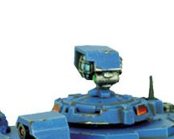

# 1415 探照灯 Searchlight

精校状态：中文行文已逐段精校，部分术语仍为暂定

分类：装备 / 载具升级

原文来源：https://www.bilibili.com/opus/1048519817543286792

原作者：帝国神选罐头

原文时间：2025年03月26日 13:12

[返回分类目录](目录.md) · [全书目录](../../目录.md)

<!-- A1415-B0001 -->
**英文原文**

The Searchlight is an Imperial and Chaos vehicle upgrade for use during night fighting scenarios. While it is useful for illuminating enemies, it also makes the vehicle with the searchlight mounted on vulnerable to return fire from the enemy.

<!-- /A1415-B0001 -->

<!-- A1415-B0002 -->

原译文

探照灯是帝国和混沌的车辆升级，用于夜间战斗场景。虽然它对照亮敌人很有用，但它也使装有探照灯的车辆容易受到敌人的还击。

**校订译文**

探照灯是帝国与混沌载具用于夜战的加装设备。它能照亮敌人，却也会暴露自身位置，使安装它的载具更容易遭到还击。

<!-- /A1415-B0002 -->

<!-- A1415-B0003 图片 -->

<!-- A1415-B0004 -->

原译文

Searchlight on the Vindicator 维护者上的探照灯

**校订译文**

Searchlight on the Vindicator 维护者战车上的探照灯

<!-- /A1415-B0004 -->

<!-- A1415-B0005 -->
**英文原文**

Searchlights come in two types, those that use white light and those that use infrared light.

<!-- /A1415-B0005 -->

<!-- A1415-B0006 -->

原译文

探照灯有两种类型，一种使用白光，另一种使用红外光。

**校订译文**

探照灯有两种类型，一种使用白光，另一种使用红外光。

<!-- /A1415-B0006 -->

<!-- A1415-B0007 -->
**英文原文**

The Departmento Munitorum suggests that Searchlights should only be employed when other means of battle illuminations are unavailable.

<!-- /A1415-B0007 -->

<!-- A1415-B0008 -->

原译文

军需部建议，只有在其他作战照明手段不可用的情况下，才应使用探照灯。

**校订译文**

军务部建议，只有在无法采用其他战场照明手段时，才应使用探照灯。

<!-- /A1415-B0008 -->

本篇核心术语与暂定项

以下列出本篇出现的英文原形及核心术语表用词。同形词可能指不同对象，具体词义以本篇正文和校注为准；单复数、别名和仅见于图注的名称可能尚未列入。完整候选见[术语表](../../术语表/双语术语候选.csv)。

| 英文 | 采用中文 | 状态 |
| --- | --- | --- |
| Departmento Munitorum | 军务部 | 暂定 |
| Illuminations | 插画 | 暂定·官方待核 |

