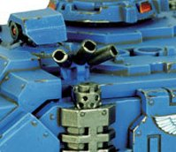

# 1417 烟雾发射器 Smoke Launcher

精校状态：中文行文已逐段精校，部分术语仍为暂定

分类：装备 / 载具升级

原文来源：https://www.bilibili.com/opus/1048520122507984905

原作者：帝国神选罐头

原文时间：2025年03月26日 13:13

[返回分类目录](目录.md) · [全书目录](../../目录.md)

<!-- A1417-B0001 -->
**英文原文**

Smoke Launchers are used by all Imperial forces and the Chaos Space Marines as a vehicle upgrade.

<!-- /A1417-B0001 -->

<!-- A1417-B0002 -->

原译文

烟雾发射器被所有帝国军队和混沌星际战士用作车辆升级。

**校订译文**

烟雾发射器被所有帝国军队和混沌星际战士用作车辆升级。

<!-- /A1417-B0002 -->

<!-- A1417-B0003 图片 -->

<!-- A1417-B0004 -->

原译文

Smoke launcher on a Vindicator 维护者上的烟雾发射器

**校订译文**

Smoke launcher on a Vindicator 维护者战车上的烟雾发射器

<!-- /A1417-B0004 -->

<!-- A1417-B0005 -->
**英文原文**

They are effectively small grenade launchers mounted to the front of vehicles loaded with smoke charges. They temporarily hide the vehicle behind a wall of smoke and is useful for providing cover, especially when the vehicle is out in the open. With the concept of their use stretching back to ancient Terra, smoke launchers allow for hasty retreats or sudden assaults. Many smoke launchers are single-use items, and must be replaced when expended. The overall coverage if some variants is 15 meters.

<!-- /A1417-B0005 -->

<!-- A1417-B0006 -->

原译文

它们实际上是安装在装有烟雾弹的车辆前部的小型榴弹发射器。它们暂时将车辆隐藏在烟雾墙后面，可用于提供掩护，特别是在车辆露天行驶时。由于其使用概念可以追溯到古代泰拉，烟雾发射器允许仓促撤退或突然攻击。许多烟雾发射器都是一次性物品，用完后必须更换。某些变体的总覆盖范围为15米。

**校订译文**

烟雾发射器实际上是安装在车体前部、装填烟雾弹的小型榴弹发射器。它能短暂形成烟墙，遮蔽载具，尤其适合为开阔地带中的车辆提供掩护。这种用法可以追溯到古代泰拉，既能掩护紧急撤退，也能协助突然进攻。许多烟雾发射器为一次性设备，使用后必须更换。部分型号的覆盖范围可达15米。

<!-- /A1417-B0006 -->

<!-- A1417-B0007 -->
### Frag Defender 破片防御者

<!-- /A1417-B0007 -->

<!-- A1417-B0008 -->
**英文原文**

A simple but effective modification of the standard smoke launcher, when activated by the vehicle's commander or gunner frag defenders explode upwards in a shower of hot shards that patter harmlessly off the tank’s hull but are far more lethal to anyone foolish enough to be attacking the tank in melee. Many frag defenders are single-use items, and must be replaced after each use.

<!-- /A1417-B0008 -->

<!-- A1417-B0009 -->

原译文

标准烟雾发射器的一个简单但有效的修改，当由车辆指挥官或炮手激活时，破片防御者会向上爆炸，形成炽热破片雨，这些破片会无害地从坦克外壳上飞溅下来，但对任何愚蠢到在近战中攻击坦克的人来说都要致命得多。许多榴弹防御者是一次性物品，每次使用后都必须更换。

**校订译文**

破片防御者是标准烟雾发射器的一种简单而有效的改型。车长或炮手将其启动后，装置便向上爆散，洒下炽热的破片。破片落在坦克外壳上无伤大雅，却足以杀伤那些愚蠢地靠近坦克进行近战的敌人。许多破片防御者为一次性设备，每次使用后都必须更换。

<!-- /A1417-B0009 -->

本篇核心术语与暂定项

以下列出本篇出现的英文原形及核心术语表用词。同形词可能指不同对象，具体词义以本篇正文和校注为准；单复数、别名和仅见于图注的名称可能尚未列入。完整候选见[术语表](../../术语表/双语术语候选.csv)。

| 英文 | 采用中文 | 状态 |
| --- | --- | --- |
| Space Marines | 星际战士 | 官方已核对 |
| Chaos Space Marines | 混沌星际战士 | 官方已核对 |
| Terra | 泰拉 | 暂定·官方待核 |
| Ancient | 旗手 | 官方已核对 |
| Grenade | 手榴弹 | 暂定·官方待核 |
| Smoke Launcher | 烟雾发射器 | 暂定·官方待核 |

