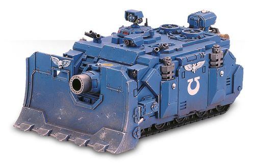

# 1418 攻城盾 Siege Shield

精校状态：中文行文已逐段精校，部分术语仍为暂定

分类：装备 / 载具升级

原文来源：https://www.bilibili.com/opus/1016663199013928961

原作者：帝国神选罐头

原文时间：2024年12月30日 16:52

[返回分类目录](目录.md) · [全书目录](../../目录.md)

<!-- A1418-B0001 -->
**英文原文**

Siege Shields are large armored shields mounted on the front of Imperial siege vehicles. In addition to helping protect against incoming fire, these large dozer blades allow vehicles to push aside debris and rubble without putting the vehicle at risk. Perhaps the most notable Imperial vehicle equipped with siege shields is the Space Marine Vindicator.

<!-- /A1418-B0001 -->

<!-- A1418-B0002 -->

原译文

攻城盾是安装在帝国攻城车前部的大型装甲盾牌。除了有助于防止即将到来的火力外，这些大型推土机铲刀还允许车辆将碎片和瓦砾推到一边，而不会使车辆面临风险。也许最著名的配备攻城盾牌的帝国车辆是星际战士维护者。

**校订译文**

攻城盾是安装在帝国攻城载具正面的巨大装甲盾板。它不仅能抵御来袭火力，也相当于一副大型推土铲刀，可安全推开残骸与瓦砾。最著名的使用者，或许就是星际战士的维护者战车。

<!-- /A1418-B0002 -->

<!-- A1418-B0003 图片 -->

<!-- A1418-B0004 -->

原译文

Siege Shield mounted on an Ultramarines Vindicator 安装在极限战士维护者上的攻城盾

**校订译文**

Siege Shield mounted on an Ultramarines Vindicator 极限战士维护者战车上的攻城盾

<!-- /A1418-B0004 -->

本篇核心术语与暂定项

以下列出本篇出现的英文原形及核心术语表用词。同形词可能指不同对象，具体词义以本篇正文和校注为准；单复数、别名和仅见于图注的名称可能尚未列入。完整候选见[术语表](../../术语表/双语术语候选.csv)。

| 英文 | 采用中文 | 状态 |
| --- | --- | --- |
| Vindicator | 维护者战车 | 官方已核对 |
| Space Marine | 星际战士 | 暂定·官方待核 |

