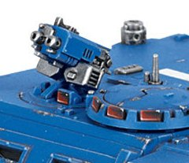

# 1421 枢轴武器 Pintle weapon

精校状态：中文行文已逐段精校，部分术语仍为暂定

分类：装备 / 载具升级

原文来源：https://www.bilibili.com/opus/1048519293550985218

原作者：帝国神选罐头

原文时间：2025年03月26日 13:10

[返回分类目录](目录.md) · [全书目录](../../目录.md)

<!-- A1421-B0001 -->
**英文原文**

Pintle weapons are extra weapons mounted on the top of Imperial and Chaos Space Marine vehicles.

<!-- /A1421-B0001 -->

<!-- A1421-B0002 -->

原译文

枢轴武器是安装在帝国和混沌星际战士车辆顶部的额外武器。

**校订译文**

枢轴武器是安装在帝国和混沌星际战士车辆顶部的额外武器。

<!-- /A1421-B0002 -->

<!-- A1421-B0003 图片 -->

<!-- A1421-B0004 -->

原译文

pintle-mounted storm bolter 枢轴式风暴爆矢枪

**校订译文**

pintle-mounted storm bolter 枢轴式风暴爆矢枪

<!-- /A1421-B0004 -->

<!-- A1421-B0005 -->
## Pintle-mounted Storm Bolter 枢轴式风暴爆矢枪

<!-- /A1421-B0005 -->

<!-- A1421-B0006 -->
**英文原文**

The Pintle-mounted Storm Bolter may be fired from an open top or remotely from inside the vehicle. They are treated as an extra defensive weapon.

<!-- /A1421-B0006 -->

<!-- A1421-B0007 -->

原译文

安装在枢轴上的风暴爆矢枪可以从敞开的顶部或从车内远程射击。它们被视为一种额外的防御武器。

**校订译文**

枢轴式风暴爆矢枪可由乘员从敞开的车顶舱口操纵，也可从车内遥控射击，作为一件额外的防御武器。

<!-- /A1421-B0007 -->

<!-- A1421-B0008 -->
## Pintle-mounted Heavy Stubber 枢轴式重机枪

原题：Pintle-mounted Heavy Stubber 枢轴式重型伐木枪

<!-- /A1421-B0008 -->

<!-- A1421-B0009 -->
**英文原文**

The Pintle-mounted Heavy Stubber is similar to the Storm Bolter version and differs only that it is a Heavy Stubber as opposed to a Storm Bolter.

<!-- /A1421-B0009 -->

<!-- A1421-B0010 -->

原译文

安装在枢轴上的重型伐木枪与风暴爆矢枪版本相似，不同之处仅在于它是一个重型伐木枪，而不是风暴爆矢枪。

**校订译文**

枢轴式重机枪与风暴爆矢枪版本相似，只是将所安装的武器换成重机枪。

<!-- /A1421-B0010 -->

<!-- A1421-B0011 -->
## Pintle Combi-Bolter 枢轴式复合爆矢枪

<!-- /A1421-B0011 -->

<!-- A1421-B0012 -->
**英文原文**

Used by Chaos only, the Combi-Bolter is an old design, usually consisting of two Bolters strapped together. The Combi-Bolter can be upgraded to either a Combi-Flamer or Combi-Melta. They may only be mounted on vehicles, not Dreadnoughts or Defilers and only one may be attached to any one vehicle.

<!-- /A1421-B0012 -->

<!-- A1421-B0013 -->

原译文

仅由混沌使用，复合爆矢枪是一种旧设计，通常由两个绑在一起的爆矢枪组成。复合爆矢枪可以升级为复合火焰枪或复合热熔枪。它们只能安装在车辆上，不能安装在无畏或污染者上，任何一辆车上只能安装一个。

**校订译文**

此处的枢轴式复合爆矢枪仅供混沌部队使用。它采用古老设计，通常将两支爆矢枪组合在一起，也可升级为复合喷火器或复合热熔枪。该加装武器只能安装在车辆上，不能安装在无畏机甲或污染者上，而且每辆车最多安装一件。

**校注：** 只供混沌使用及不可安装无畏等限制属于本段枢轴加装武器语境，不扩展为所有复合爆矢枪的通用设定。

<!-- /A1421-B0013 -->

本篇核心术语与暂定项

以下列出本篇出现的英文原形及核心术语表用词。同形词可能指不同对象，具体词义以本篇正文和校注为准；单复数、别名和仅见于图注的名称可能尚未列入。完整候选见[术语表](../../术语表/双语术语候选.csv)。

| 英文 | 采用中文 | 状态 |
| --- | --- | --- |
| Space Marine | 星际战士 | 暂定·官方待核 |
| Combi-Bolter | 复合爆矢枪 | 暂定·官方待核 |
| Combi-Flamer | 复合喷火器 | 暂定·官方待核 |
| Combi-Melta | 复合热熔枪 | 暂定·官方待核 |
| Heavy stubber | 重机枪 | 官方已核对 |
| Bolter | 爆矢枪 | 暂定·官方待核 |
| Storm bolter | 风暴爆矢枪 | 官方已核对 |
| Flamer | 火焰喷射器（武器）／火妖（奸奇单位） | 语境定译·对应官译已核 |

