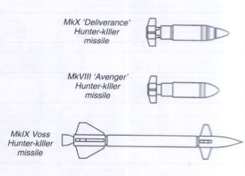

# 1422 猎杀导弹 Hunter-Killer Missile

精校状态：中文行文已逐段精校，部分术语仍为暂定

分类：装备 / 载具升级

原文来源：https://www.bilibili.com/opus/1004737535099797504

原作者：帝国神选罐头

原文时间：2024年11月28日 13:34

[返回分类目录](目录.md) · [全书目录](../../目录.md)

原篇名：猎杀飞弹 Hunter-Killer Missile

<!-- A1422-B0001 -->
**英文原文**

The Hunter-Killer Missile is used by the Imperial Guard, Space Marines, Inquisition and Sisters of Battle as a common upgrade for vehicles.

<!-- /A1422-B0001 -->

<!-- A1422-B0002 -->

原译文

猎杀飞弹被帝国卫队、星际战士、审判庭和战斗修女用作车辆的常见升级。

**校订译文**

猎杀导弹是帝国卫队、星际战士、审判庭和战斗修女常用的载具加装武器。

<!-- /A1422-B0002 -->

<!-- A1422-B0003 -->
**英文原文**

They are effectively Krak Missiles with massively extended range, although only one can be mounted on a vehicle due to their vast size. They are also unique in that they are guided weapons with an on-board artificial intelligence, known as a "logis-engine." Sensors in the missile's nose transmit information on the target and surrounding environment to the logis-engine, which guides the missile in flight by manipulating its stabilising fins, allowing the missile to match the target's movements and avoid obstacles. Alternatively, the missile can be directly guided by the machine spirit and auspex of the vehicle it was fired from, even allowing the missile to operate in top-attack mode.

<!-- /A1422-B0003 -->

<!-- A1422-B0004 -->

原译文

它们实际上是射程大大延长的穿甲导弹，尽管由于体积庞大，只能在车辆上安装一枚。它们的独特之处还在于，它们是带有机载智能的制导武器，被称为“逻辑引擎”。导弹头中的传感器将目标和周围环境的信息传输到逻辑引擎，逻辑引擎通过操纵其稳定翼来引导导弹飞行，使导弹能够与目标的运动相匹配并避开障碍物。或者，导弹可以直接由发射它的车辆的机魂和鸟卜仪制导，甚至允许导弹在顶部攻击模式下运行。

**校订译文**

它本质上是射程大幅增加的穿甲导弹，但体积庞大，每辆载具只能安装一枚。其独特之处在于内置了称作“逻辑引擎”的人工智能制导系统。弹头传感器将目标与周围环境信息传给逻辑引擎，后者通过调整稳定翼控制飞行，使导弹追随目标运动并避开障碍。导弹也可由发射载具的机魂和鸟卜仪直接引导，甚至能以攻顶模式打击目标。

**校注：** 英文明确写artificial intelligence，忠实译出，不因帝国憎恶智能禁令改写原文；可据具体版本进一步辨别有限制导逻辑。

<!-- /A1422-B0004 -->

<!-- A1422-B0005 -->
**英文原文**

The missile's warhead is an impact fused shaped charge, designed for maximum armour penetration. Other instruments include an internal gyroscope for stable flight and a small battery to power the sensor and logis-engine.

<!-- /A1422-B0005 -->

<!-- A1422-B0006 -->

原译文

导弹的弹头是一种冲击熔融聚能装药，设计用于最大程度地穿透装甲。其他仪器包括用于稳定飞行的内部陀螺仪和为传感器和逻辑引擎供电的小型电池。

**校订译文**

导弹弹头采用触发引信和聚能装药，以获得最大的穿甲能力。内部还装有保持飞行稳定的陀螺仪，以及为传感器和逻辑引擎供电的小型电池。

**校注：** impact fused是碰撞触发的引信，非冲击熔融。

<!-- /A1422-B0006 -->

<!-- A1422-B0007 -->
**英文原文**

A variety of different Hunter-killer missiles exist, including the MkX 'Deliverance', MkVIII 'Avenger' and MkIX 'Voss' patterns.

<!-- /A1422-B0007 -->

<!-- A1422-B0008 -->

原译文

存在各种不同的猎杀飞弹，包括MkX“拯救”、MkVIII“复仇者”和MkIX“沃斯”型。

**校订译文**

猎杀导弹有多种型号，包括Mk X“拯救”、Mk VIII“复仇者”和Mk IX“沃斯”型。

<!-- /A1422-B0008 -->

<!-- A1422-B0009 图片 -->

<!-- A1422-B0010 -->

原译文

Various types of Hunter-Killer Missiles 不同型号的猎杀飞弹

**校订译文**

Various types of Hunter-Killer Missiles 不同型号的猎杀导弹

<!-- /A1422-B0010 -->

本篇核心术语与暂定项

以下列出本篇出现的英文原形及核心术语表用词。同形词可能指不同对象，具体词义以本篇正文和校注为准；单复数、别名和仅见于图注的名称可能尚未列入。完整候选见[术语表](../../术语表/双语术语候选.csv)。

| 英文 | 采用中文 | 状态 |
| --- | --- | --- |
| Space Marines | 星际战士 | 官方已核对 |
| Imperial Guard | 帝国卫队 | 暂定·语境区分 |
| Inquisition | 审判庭 | 暂定 |
| Hunter-Killer | 猎杀者 | 暂定·官方待核 |
| Sisters of Battle | 战斗修女 | 暂定·官方待核 |
| Deliverance | 拯救星 | 暂定·官方待核 |
| Logis | 逻辑士 | 暂定·官方待核 |
| Voss | 沃斯 | 暂定·官方待核 |
| Avenger | 复仇者号 | 暂定·官方待核 |
| Hunter-killer missile | 猎杀导弹 | 官方已核对 |
| Auspex | 鸟卜仪 | 暂定·官方待核 |

