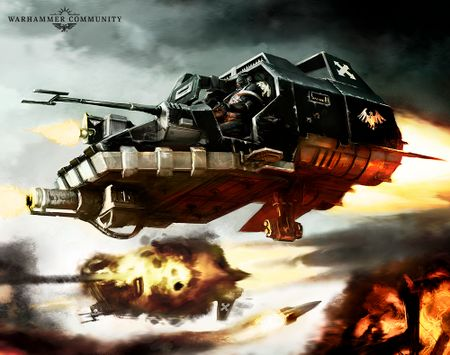
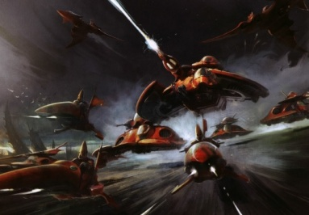

# 1423 反重力载具 Grav-vehicle

精校状态：中文行文已逐段精校，部分术语仍为暂定

分类：载具

原文来源：https://www.bilibili.com/opus/1211492592099786790

原作者：帝国神选罐头

原文时间：2026年06月08日 17:30

[返回分类目录](目录.md) · [全书目录](../../目录.md)

<!-- A1423-B0001 -->
**英文原文**

Grav-vehicles, also known as Skimmers and Hoverers are a type of vehicle which generates an anti-gravitational field, allowing them to hover a short distance over the ground. Some grav-vehicles are also Flyers - being capable of full flight - and exist among different species, including Humankind. One example is the Eldar Falcon.

<!-- /A1423-B0001 -->

<!-- A1423-B0002 -->

原译文

反重力载具，也称为掠行者和悬停者，是一种产生反重力立场的载具，使它们能够在地面上悬停一小段距离。一些反重力载具也是飞行器，能够完全飞行，存在于包括人类在内的不同物种中。一个例子是灵族猎鹰。

**校订译文**

反重力载具也称掠行载具或悬浮载具，通过产生反重力力场，悬浮于离地不远处。部分反重力载具还具备完整的飞行能力，因而也属于飞行器。包括人类在内的多个种族都使用这类装备，灵族猎鹰坦克便是一例。

<!-- /A1423-B0002 -->

<!-- A1423-B0003 -->
## Overview 概述

<!-- /A1423-B0003 -->

<!-- A1423-B0004 -->
**英文原文**

Grav-tanks are designed to be manoeuvrable but much more heavily armoured than grav-vehicles. The extra weight, however, would slow them down a lot, so many vehicles make use of advanced Force Fields with more moderate armour. Since anti-grav technology is very difficult to create and maintain, only a few races employ them regularly. The Eldar and Tau have mastered the technology and make heavy use of it in their systems. Anti-grav vehicles are used for many different tasks which any other type of Tank would be. These include Armoured Infantry Vehicles, Battle Tanks, Tank Destroyers, Artillery Tanks and Air Defence Tanks.

<!-- /A1423-B0004 -->

<!-- A1423-B0005 -->

原译文

反重力坦克的设计是机动的，但装甲比反重力载具重得多。然而，额外的重量会大大减缓它们的速度，因此许多载具使用了更先进的力场和更适度的装甲。由于反重力技术很难创造和维护，只有少数种族经常使用它们。灵族和钛已经掌握了这项技术，并在他们的系统中大量使用它。反重力载具用于许多不同的工作，任何其他类型的坦克都是如此。这些包括装甲步兵载具、战斗坦克、坦克歼击车、火炮坦克和防空坦克。

**校订译文**

反重力坦克注重机动性，同时比一般反重力载具配备更厚重的装甲。然而，额外重量会显著降低速度，因此许多型号采用厚度适中的装甲，再辅以先进力场。反重力技术难以制造和维护，只有少数种族经常使用；灵族和钛族已掌握这项技术，并广泛应用于自身装备。反重力载具能承担普通坦克的各类任务，包括装甲步兵输送、坦克作战、反坦克、自行火炮及防空等。

<!-- /A1423-B0005 -->

<!-- A1423-B0006 -->
## List of Grav-vehicles 反重力载具列表

<!-- /A1423-B0006 -->

<!-- A1423-B0007 -->
## Imperial 帝国

<!-- /A1423-B0007 -->

<!-- A1423-B0008 -->
### Bikes & Personal Transports 摩托&个人运输

<!-- /A1423-B0008 -->

<!-- A1423-B0009 -->

原译文

Imperial Jetbike 帝国悬浮摩托

**校订译文**

Imperial Jetbike 帝国悬浮摩托

<!-- /A1423-B0009 -->

<!-- A1423-B0010 -->

原译文

Grav-Bike 反重力摩托

**校订译文**

Grav-Bike 反重力摩托

<!-- /A1423-B0010 -->

<!-- A1423-B0011 -->

原译文

Magos Sky Platform 贤者天空平台

**校订译文**

Magos Sky Platform 贤者天空平台

<!-- /A1423-B0011 -->

<!-- A1423-B0012 -->

原译文

Hover Pulpit 悬浮讲道台

**校订译文**

Hover Pulpit 悬浮讲道台

<!-- /A1423-B0012 -->

<!-- A1423-B0013 -->

原译文

Power-board 动力板

**校订译文**

Power-board 动力板

<!-- /A1423-B0013 -->

<!-- A1423-B0014 -->
### Light Vehicle 轻载具

<!-- /A1423-B0014 -->

<!-- A1423-B0015 -->

原译文

Grav-Car 反重力车

**校订译文**

Grav-Car 反重力车

<!-- /A1423-B0015 -->

<!-- A1423-B0016 -->

原译文

Land Speeder 兰德速攻艇

**校订译文**

Land Speeder 兰德速攻艇

<!-- /A1423-B0016 -->

<!-- A1423-B0017 图片 -->

<!-- A1423-B0018 -->

原译文

Imperial Land Speeder 帝国兰德掠袭者

**校订译文**

Imperial Land Speeder 帝国兰德速攻艇

**校注：** Land Speeder是兰德速攻艇，原图注误作Land Raider兰德掠袭者。

<!-- /A1423-B0018 -->

<!-- A1423-B0019 -->

原译文

Storm Speeder 风暴速攻艇

**校订译文**

Storm Speeder 风暴速攻艇

<!-- /A1423-B0019 -->

<!-- A1423-B0020 -->

原译文

Javelin Attack Speeder 标枪攻击艇

**校订译文**

Javelin Attack Speeder 标枪突击艇

<!-- /A1423-B0020 -->

<!-- A1423-B0021 -->

原译文

Speeder Carriage 速行车厢

**校订译文**

Speeder Carriage 速行车厢

<!-- /A1423-B0021 -->

<!-- A1423-B0022 -->
### Tanks & APC/IFVs 坦克&装甲人员运输车/步兵战车

<!-- /A1423-B0022 -->

<!-- A1423-B0023 -->

原译文

Grav-Attack Tank 反重力攻击坦克

**校订译文**

Grav-Attack Tank 反重力攻击坦克

<!-- /A1423-B0023 -->

<!-- A1423-B0024 -->

原译文

Grav-Rhino 反重力犀牛

**校订译文**

Grav-Rhino 反重力犀牛

<!-- /A1423-B0024 -->

<!-- A1423-B0025 -->

原译文

Grav-Raider 反重力掠袭者

**校订译文**

Grav-Raider 反重力掠袭者战车

<!-- /A1423-B0025 -->

<!-- A1423-B0026 -->

原译文

Grav-Spartan 反重力斯巴达

**校订译文**

Grav-Spartan 反重力斯巴达

<!-- /A1423-B0026 -->

<!-- A1423-B0027 -->

原译文

Gun-Cutter 枪炮切割者

**校订译文**

Gun-Cutter 武装小艇

<!-- /A1423-B0027 -->

<!-- A1423-B0028 -->

原译文

Caladius 卡拉狄乌斯

**校订译文**

Caladius 神鸟反重力坦克

<!-- /A1423-B0028 -->

<!-- A1423-B0029 -->

原译文

Pallas 帕拉斯

**校订译文**

Pallas 帕拉斯

<!-- /A1423-B0029 -->

<!-- A1423-B0030 -->

原译文

Coronus 克洛诺斯

**校订译文**

Coronus 克洛诺斯反重力运兵车

<!-- /A1423-B0030 -->

<!-- A1423-B0031 -->

原译文

Kharon 卡戎

**校订译文**

Kharon 卡戎

<!-- /A1423-B0031 -->

<!-- A1423-B0032 -->

原译文

Impulsor 冲击者

**校订译文**

Impulsor 脉冲战车

<!-- /A1423-B0032 -->

<!-- A1423-B0033 -->

原译文

Gladiator 角斗士

**校订译文**

Gladiator 角斗士坦克

<!-- /A1423-B0033 -->

<!-- A1423-B0034 -->

原译文

Repulsor 反击者

**校订译文**

Repulsor 反重力战车

<!-- /A1423-B0034 -->

<!-- A1423-B0035 -->

原译文

Repulsor Executioner 反击者处刑者

**校订译文**

Repulsor Executioner 处决者型反重力战车

<!-- /A1423-B0035 -->

<!-- A1423-B0036 -->

原译文

Astraeus 阿斯特赖俄斯

**校订译文**

Astraeus 阿斯特赖俄斯超重型坦克

<!-- /A1423-B0036 -->

<!-- A1423-B0037 -->
## Eldar 灵族

<!-- /A1423-B0037 -->

<!-- A1423-B0038 图片 -->

<!-- A1423-B0039 -->

原译文

A host of Eldar Grav-tanks, Jetbikes, and aircraft 一群灵族反重力坦克，悬浮摩托和飞行器

**校订译文**

A host of Eldar Grav-tanks, Jetbikes, and aircraft 大批灵族反重力坦克、悬浮摩托与飞行器

<!-- /A1423-B0039 -->

<!-- A1423-B0040 -->
### Bikes & Personal Transports 摩托&个人运输

<!-- /A1423-B0040 -->

<!-- A1423-B0041 -->

原译文

Eldar Jetbike 灵族悬浮摩托

**校订译文**

Eldar Jetbike 灵族悬浮摩托

<!-- /A1423-B0041 -->

<!-- A1423-B0042 -->

原译文

Vyper Jetbike 蝮蛇悬浮摩托

**校订译文**

Vyper Jetbike 蝮蛇飞艇

<!-- /A1423-B0042 -->

<!-- A1423-B0043 -->
### Tanks & APC/IFVs 坦克&装甲人员运输车/步兵战车

<!-- /A1423-B0043 -->

<!-- A1423-B0044 -->

原译文

Wave Serpent 波蛇

**校订译文**

Wave Serpent 波蛇飞艇

<!-- /A1423-B0044 -->

<!-- A1423-B0045 -->

原译文

Falcon 猎鹰

**校订译文**

Falcon 猎鹰坦克

<!-- /A1423-B0045 -->

<!-- A1423-B0046 -->

原译文

Fire Prism 炎晶

**校订译文**

Fire Prism 炎晶坦克

<!-- /A1423-B0046 -->

<!-- A1423-B0047 -->

原译文

Night Spinner 夜纺者

**校订译文**

Night Spinner 织夜者坦克

<!-- /A1423-B0047 -->

<!-- A1423-B0048 -->

原译文

Firestorm 火风暴

**校订译文**

Firestorm 火风暴

<!-- /A1423-B0048 -->

<!-- A1423-B0049 -->

原译文

Warp Hunter 次元猎手

**校订译文**

Warp Hunter 次元猎手

<!-- /A1423-B0049 -->

<!-- A1423-B0050 -->

原译文

Cobra 眼镜蛇

**校订译文**

Cobra 眼镜蛇

<!-- /A1423-B0050 -->

<!-- A1423-B0051 -->

原译文

Scorpion 蝎

**校订译文**

Scorpion 蝎

<!-- /A1423-B0051 -->

<!-- A1423-B0052 -->

原译文

Storm Serpent 风暴蛇

**校订译文**

Storm Serpent 风暴蝮蛇

<!-- /A1423-B0052 -->

<!-- A1423-B0053 -->

原译文

Void Spinner 虚纺者

**校订译文**

Void Spinner 虚纺者

<!-- /A1423-B0053 -->

<!-- A1423-B0054 -->

原译文

Lynx 猞猁

**校订译文**

Lynx 猞猁

<!-- /A1423-B0054 -->

<!-- A1423-B0055 -->

原译文

Hornet 大黄蜂

**校订译文**

Hornet 大黄蜂

<!-- /A1423-B0055 -->

<!-- A1423-B0056 -->

原译文

Starweaver 星织者

**校订译文**

Starweaver 织星者飞艇

<!-- /A1423-B0056 -->

<!-- A1423-B0057 -->

原译文

Voidweaver 虚织者

**校订译文**

Voidweaver 织虚者飞艇

<!-- /A1423-B0057 -->

<!-- A1423-B0058 -->
**英文原文**

Skyweaver (Harlequin)

<!-- /A1423-B0058 -->

<!-- A1423-B0059 -->

原译文

天织者（丑角）

**校订译文**

织空者摩托（丑角）

<!-- /A1423-B0059 -->

<!-- A1423-B0060 -->
**英文原文**

Starweaver (Harlequin)

<!-- /A1423-B0060 -->

<!-- A1423-B0061 -->

原译文

星织者（丑角）

**校订译文**

织星者飞艇（丑角）

<!-- /A1423-B0061 -->

<!-- A1423-B0062 -->
**英文原文**

Voidweaver (Harlequin)

<!-- /A1423-B0062 -->

<!-- A1423-B0063 -->

原译文

虚织者（丑角）

**校订译文**

织虚者飞艇（丑角）

<!-- /A1423-B0063 -->

<!-- A1423-B0064 -->
## Dark Eldar 黑暗灵族

原题：Dark Eldar 黑暗天使

**校注：** Dark Eldar为黑暗灵族，原黑暗天使误译成星际战士战团。

<!-- /A1423-B0064 -->

<!-- A1423-B0065 -->
### Bikes & Personal Transports 摩托&个人运输

<!-- /A1423-B0065 -->

<!-- A1423-B0066 -->

原译文

Reaver Jetbike 掠夺者悬浮摩托

**校订译文**

Reaver Jetbike 劫掠者摩托

<!-- /A1423-B0066 -->

<!-- A1423-B0067 -->
### Tanks & APC/IFVs 坦克&装甲人员运输车/步兵战车

<!-- /A1423-B0067 -->

<!-- A1423-B0068 -->

原译文

Venom 毒液

**校订译文**

Venom 毒液飞艇

<!-- /A1423-B0068 -->

<!-- A1423-B0069 -->

原译文

Raider 掠夺者

**校订译文**

Raider 掠袭者飞艇

<!-- /A1423-B0069 -->

<!-- A1423-B0070 -->

原译文

Ravager 蹂躏者

**校订译文**

Ravager 破坏者飞艇

<!-- /A1423-B0070 -->

<!-- A1423-B0071 -->

原译文

Reaper 收割者

**校订译文**

Reaper 收割者

<!-- /A1423-B0071 -->

<!-- A1423-B0072 -->

原译文

Tantalus 折磨

**校订译文**

Tantalus 折磨

**校注：** Tantalus是黑暗灵族载具专名，现稿折磨暂沿用，不据同词根另造其他实体。

<!-- /A1423-B0072 -->

<!-- A1423-B0073 -->
## Orks 欧克蛮人

原题：Orks 欧克

<!-- /A1423-B0073 -->

<!-- A1423-B0074 -->
### Tanks & APC/IFVs 坦克&装甲人员运输车/步兵战车

<!-- /A1423-B0074 -->

<!-- A1423-B0075 -->

原译文

Ork Minelayer 欧克布雷者

**校订译文**

Ork Minelayer 欧克布雷者

<!-- /A1423-B0075 -->

<!-- A1423-B0076 -->
**英文原文**

Some Deffkoptas utilise anti-grav technology

<!-- /A1423-B0076 -->

<!-- A1423-B0077 -->

原译文

一些死死直升机利用反重力技术

**校订译文**

部分死亡直升机采用反重力技术。

<!-- /A1423-B0077 -->

<!-- A1423-B0078 -->
## Tau 钛族

原题：Tau 钛

<!-- /A1423-B0078 -->

<!-- A1423-B0079 -->
### Light Vehicle 轻型载具

<!-- /A1423-B0079 -->

<!-- A1423-B0080 -->

原译文

Tetra 脂鲤

**校订译文**

Tetra 脂鲤

<!-- /A1423-B0080 -->

<!-- A1423-B0081 -->

原译文

Piranha 水虎鱼

**校订译文**

Piranha 食人鱼战机

<!-- /A1423-B0081 -->

<!-- A1423-B0082 -->
### Tanks & APC/IFVs 坦克&装甲人员运输车/步兵战车

<!-- /A1423-B0082 -->

<!-- A1423-B0083 -->

原译文

Devilfish 魔鬼鱼

**校订译文**

Devilfish 魔鬼鱼运输艇

<!-- /A1423-B0083 -->

<!-- A1423-B0084 -->

原译文

Hammerhead 锤头鲨

**校订译文**

Hammerhead 锤头鲨炮艇

<!-- /A1423-B0084 -->

<!-- A1423-B0085 -->

原译文

Sky Ray Gunship 天鳐炮艇

**校订译文**

Sky Ray Gunship 天鳐炮艇

<!-- /A1423-B0085 -->

<!-- A1423-B0086 -->
## Necrons 太空死灵

原题：Necrons 死灵

<!-- /A1423-B0086 -->

<!-- A1423-B0087 -->
### Bikes & Personal Transports 摩托&个人运输

<!-- /A1423-B0087 -->

<!-- A1423-B0088 -->

原译文

Tomb Blade 墓穴之刃

**校订译文**

Tomb Blade 墓穴之刃

<!-- /A1423-B0088 -->

<!-- A1423-B0089 -->
### Heavy Vehicles 重型载具

<!-- /A1423-B0089 -->

<!-- A1423-B0090 -->

原译文

Catacomb Command Barge 地下墓穴指挥驳船

**校订译文**

Catacomb Command Barge 墓穴指挥舰

<!-- /A1423-B0090 -->

<!-- A1423-B0091 -->

原译文

Annihilation Barge 湮灭驳船

**校订译文**

Annihilation Barge 毁灭炮艇

<!-- /A1423-B0091 -->

<!-- A1423-B0092 -->

原译文

Doomsday Ark 末日方舟

**校订译文**

Doomsday Ark 末日方舟

<!-- /A1423-B0092 -->

<!-- A1423-B0093 -->

原译文

Ghost Ark 幽灵方舟

**校订译文**

Ghost Ark 幽灵方舟

<!-- /A1423-B0093 -->

<!-- A1423-B0094 -->

原译文

Monolith 巨石

**校订译文**

Monolith 巨石堡垒

<!-- /A1423-B0094 -->

<!-- A1423-B0095 -->
## Kin 炉裔

<!-- /A1423-B0095 -->

<!-- A1423-B0096 -->

原译文

Magna-Coil Bike 大线圈摩托

**校订译文**

Magna-Coil Bike 麦格纳线圈摩托

<!-- /A1423-B0096 -->

<!-- A1423-B0097 -->

原译文

Kapricus 摩羯座

**校订译文**

Kapricus 摩羯座

<!-- /A1423-B0097 -->

本篇核心术语与暂定项

以下列出本篇出现的英文原形及核心术语表用词。同形词可能指不同对象，具体词义以本篇正文和校注为准；单复数、别名和仅见于图注的名称可能尚未列入。完整候选见[术语表](../../术语表/双语术语候选.csv)。

| 英文 | 采用中文 | 状态 |
| --- | --- | --- |
| Eldar | 灵族 | 暂定·语境区分 |
| Harlequin | 丑角 | 暂定 |
| Destroyers | 毁灭者 | 暂定·官方待核 |
| Falcon | 猎鹰坦克 | 官方已核·中英对照 |
| Starweaver | 织星者飞艇 | 官方已核·中英对照 |
| Voidweaver | 织虚者飞艇 | 官方已核·中英对照 |
| Deffkoptas | 死亡直升机 | 官方已核·中英对照 |

