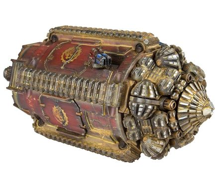
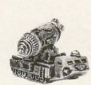

# 1429 白蚁隧道运输车 Termite Tunneling Transport Vehicle

精校状态：中文行文已逐段精校，部分术语仍为暂定

分类：载具 / 地面 / 辅助

原文来源：https://www.bilibili.com/opus/1046643921899225091

原作者：帝国神选罐头

原文时间：编辑于 2025年03月21日 14:14

[返回分类目录](目录.md) · [全书目录](../../目录.md)

<!-- A1429-B0001 -->
**英文原文**

The Termite is an Imperial and Squat tunneling transport vehicle.

<!-- /A1429-B0001 -->

<!-- A1429-B0002 -->

原译文

白蚁是一种帝国和矮人隧道运输车。

**校订译文**

白蚁是帝国与斯夸特使用的隧道运输车。

<!-- /A1429-B0002 -->

<!-- A1429-B0003 图片 -->

<!-- A1429-B0004 -->

原译文

Terrax Pattern Termite 特拉克斯型白蚁

**校订译文**

Terrax Pattern Termite 特拉克斯型白蚁

<!-- /A1429-B0004 -->

<!-- A1429-B0005 -->
## Overview 概述

<!-- /A1429-B0005 -->

<!-- A1429-B0006 -->
**英文原文**

The Termite was originally developed on Terra for rooting out burrowing Xenos during the Great Crusade.

<!-- /A1429-B0006 -->

<!-- A1429-B0007 -->

原译文

白蚁最初是在大远征期间在泰拉上开发的，用于根除穴居的异型。

**校订译文**

白蚁最初于大远征期间在泰拉研发，用于清剿掘地而居的异形。

<!-- /A1429-B0007 -->

<!-- A1429-B0008 -->
**英文原文**

Termites vary in form and function, from heavy-duty mining units and exploration crafts to military siege breakers. Most are used by the Mechanicus and their servants due to the techno-arcana required for construction. Launched from a mobile surface transporter, the Termite is used to transport troops through the earth, safely hidden from incoming enemy fire. In addition to providing greater protection for its passengers, the Termite's tunneling ability, which operates via an array of Melta cutters and phase-shield generators, means they are often used for launching surprise attacks, appearing behind enemy lines and causing chaos amongst their unsuspecting foes. The entire First Company of the Imperial Fists were deployed in this fashion on Abfall B, assaulting the traitors' stronghold directly and playing a decisive part in bringing the planet under Imperial control.

<!-- /A1429-B0008 -->

<!-- A1429-B0009 -->

原译文

白蚁的形式和功能各不相同，从重型采矿设备和勘探到军事攻城突破。由于制造所需的技术秘密，大多数被机械神教及其仆从使用。白蚁从移动地表运输车上发射，用于在大地中运输部队，安全地躲避敌人的火力。除了为乘员提供更大的保护外，白蚁的隧道掘进能力还通过一系列热熔切割机和相位屏蔽发生器运行，这意味着它们经常被用来发动突然袭击，出现在敌后，在毫无戒心的敌人中制造混乱。帝国之拳的整个第一连都以这种方式部署在废料B，直接攻击叛徒的据点，并在将星球置于帝国控制之下发挥了决定性作用。

**校订译文**

白蚁的外形与用途多种多样，既有重型采矿设备、勘探载具，也有用于攻城突破的军用型号。由于制造需要掌握秘奥技术，大多数白蚁由机械修会及其仆从使用。它从移动式地面运输平台出发，在地下输送部队，避开敌方火力。除了保护乘员，白蚁还能依靠一组热熔切割器与相位护盾发生器掘进，突然在敌后钻出，使毫无防备的敌军陷入混乱。在阿布法尔B，帝国之拳整个第一连就曾以这种方式直袭叛徒据点，为帝国夺取该星球发挥了决定性作用。

**校注：** Abfall B为行星专名，原废料B按普通德语词义直译易误解，暂作阿布法尔B。

<!-- /A1429-B0009 -->

<!-- A1429-B0010 图片 -->

<!-- A1429-B0011 -->

原译文

Imperial Termite on its transport vehicle 运输车上的帝国白蚁

**校订译文**

Imperial Termite on its transport vehicle 运输车上的帝国白蚁

<!-- /A1429-B0011 -->

<!-- A1429-B0012 -->
**英文原文**

The Termite has a transport capacity of around ten individuals and is often armed with heavy weapons such as Lascannons, Heavy Flamers, Volkite Chargers, and Heavy Bolters which it can fire as it breaches the surface. Once a Termite has surfaced and dispatched its payload it is essentially immobilized. Termites are equipped with a full live support system, giving them considerable operational range. The Termite's surface transport vehicle is unarmed.

<!-- /A1429-B0012 -->

<!-- A1429-B0013 -->

原译文

白蚁的运输能力约为十人，通常配备有重型武器，如激光炮、重型火焰炮、爆燃突击铳和重型爆矢枪，当它突破地面时可以发射。一旦白蚁钻出地面并释放其乘客，它基本上就被固定住了。白蚁配备了完整的实时支持系统，使其具有相当大的作战范围。白蚁的地面运输车没有武装。

**校订译文**

白蚁约可搭载十人，常配备激光炮、重型火焰喷射器、爆燃突击铳和重型爆矢枪等武器，钻出地表时便能开火。白蚁一旦出土并卸下乘员，基本上就无法继续移动。它配备完整的生命维持系统，因此具备相当大的作战范围。用于运载白蚁的地面运输车辆本身没有武装。

**校注：** 英文live support疑为life support笔误，按上下文译生命维持系统，非实时支持。

<!-- /A1429-B0013 -->

<!-- A1429-B0014 -->
## Known Pattern 已知型号

<!-- /A1429-B0014 -->

<!-- A1429-B0015 -->
### Io Pattern Termite 木卫一型白蚁

<!-- /A1429-B0015 -->

<!-- A1429-B0016 -->
**英文原文**

The Io Pattern Termite is an utilitarian multi-purpose model that can transport a dozen persons over long distances with relative comfort and safety. It has a cruising speed of 10kph and a maximum speed of 30kph.

<!-- /A1429-B0016 -->

<!-- A1429-B0017 -->

原译文

木卫一型白蚁是一种实用的多用途模式，可以在相对舒适和安全的情况下长途运输十几个人。它的巡航速度为10公里/小时，最高速度为30公里/小时。

**校订译文**

木卫一型白蚁是一种实用的多用途型号，能够较为舒适、安全地搭载十二人长途行进。其巡航速度为每小时10公里，最高速度为每小时30公里。

<!-- /A1429-B0017 -->

本篇核心术语与暂定项

以下列出本篇出现的英文原形及核心术语表用词。同形词可能指不同对象，具体词义以本篇正文和校注为准；单复数、别名和仅见于图注的名称可能尚未列入。完整候选见[术语表](../../术语表/双语术语候选.csv)。

| 英文 | 采用中文 | 状态 |
| --- | --- | --- |
| Imperial Fists | 帝国之拳 | 暂定 |
| Great Crusade | 大远征 | 暂定·官方待核 |
| Terra | 泰拉 | 暂定·官方待核 |
| Xenos | 异形 | 暂定·官方待核 |
| Flamers | 火妖（奸奇单位）／火焰喷射器（武器） | 语境定译·对应官译已核 |
| System | 星系（恒星系统） | 暂定·官方待核 |
| Abfall B | 阿布法尔B | 暂定·官方待核 |
| Io Pattern Termite | 木卫一型白蚁 | 暂定·官方待核 |

