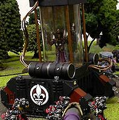

# 1430 监禁者灵能隔离载具 Incarcerator Psychic Shielded Vehicle

精校状态：中文行文已逐段精校，部分术语仍为暂定

分类：载具 / 地面 / 辅助

原文来源：https://www.bilibili.com/opus/1214376233173778433

原作者：帝国神选罐头

原文时间：2026年06月16日 12:00

[返回分类目录](目录.md) · [全书目录](../../目录.md)

<!-- A1430-B0001 -->
**英文原文**

The Incarcerator is a psychic shielded vehicle used by the Ordo Hereticus and Ecclesiarchy to transport prisoners of the Imperial Church to their eventual judgment and execution.

<!-- /A1430-B0001 -->

<!-- A1430-B0002 -->

原译文

监禁者是一种灵能隔离载具，由讨逆修会和国教使用，将帝国教会的囚犯运送到最终的审判和处决地点。

**校订译文**

监禁者是一种具备灵能屏蔽功能的载具，由异端审判庭和国教会使用，将国教囚犯运往审判及处决地点。

<!-- /A1430-B0002 -->

<!-- A1430-B0003 图片 -->

<!-- A1430-B0004 -->

原译文

Incarcerator carrying a captured Heretic 监禁者携带一名被俘的异端

**校订译文**

Incarcerator carrying a captured Heretic 监禁者携带一名被俘的异端

<!-- /A1430-B0004 -->

<!-- A1430-B0005 -->
**英文原文**

They are crewed by the Sisters of Battle and are equipped with a jet turbine whose compression chamber also serves as the holding cell for as many as ten prisoners. However, if the psychic shielding is breached or there is a risk of the prisoners escaping, the Incarcerator's turbine can be activated to purge the heretics within in a huge blast of swirling pure flame, as befits the Emperor's judgment.

<!-- /A1430-B0005 -->

<!-- A1430-B0006 -->

原译文

他们由战斗修女组成，配备了一台喷流涡轮，其压缩室也可作为多达十名囚犯的关押室。然而，如果灵能屏障被破坏或囚犯有逃跑的风险，可以激活监禁者的涡轮，在巨大的旋转纯净火焰中净化里面的异端，这符合帝皇的审判。

**校订译文**

监禁者由战斗修女驾驶，装有一台喷气涡轮，其压缩室兼作囚室，最多可关押十人。如果灵能屏蔽遭到突破，或囚犯有逃脱危险，车组便可启动涡轮，以猛烈翻涌的纯净烈焰焚尽其中的异端，执行帝皇的审判。

**校注：** 喷气涡轮压缩室兼作囚室，是所给原文明述的结构；忠实保留，不按现实工程推测改写。

<!-- /A1430-B0006 -->

本篇核心术语与暂定项

以下列出本篇出现的英文原形及核心术语表用词。同形词可能指不同对象，具体词义以本篇正文和校注为准；单复数、别名和仅见于图注的名称可能尚未列入。完整候选见[术语表](../../术语表/双语术语候选.csv)。

| 英文 | 采用中文 | 状态 |
| --- | --- | --- |
| Emperor | 帝皇 | 官方已核对 |
| Ecclesiarchy | 国教会 | 暂定 |
| Sisters of Battle | 战斗修女 | 暂定·官方待核 |
| Ordo Hereticus | 异端审判庭 | 用户指定 |

