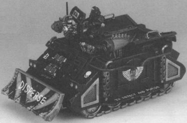

# 1431 斥责者人群控制载具 Castigator Crowd Control Vehicle

精校状态：中文行文已逐段精校，部分术语仍为暂定

分类：载具 / 地面 / 辅助

原文来源：https://www.bilibili.com/opus/1215489493019131928

原作者：帝国神选罐头

原文时间：2026年06月19日 12:00

[返回分类目录](目录.md) · [全书目录](../../目录.md)

<!-- A1431-B0001 -->
**英文原文**

Castigator Crowd Control Vehicles are a type of Rhino that the Adeptus Arbites use for crowd control.

<!-- /A1431-B0001 -->

<!-- A1431-B0002 -->

原译文

斥责者人群控制载具是一种犀牛，法务部用它来控制人群。

**校订译文**

斥责者人群控制载具是犀牛的一个改型，由法务部用于管控人群。

<!-- /A1431-B0002 -->

<!-- A1431-B0003 图片 -->

<!-- A1431-B0004 -->

原译文

Castigator Crowd Control Vehicle 斥责者人群控制载具

**校订译文**

Castigator Crowd Control Vehicle 斥责者人群控制载具

<!-- /A1431-B0004 -->

<!-- A1431-B0005 -->
## Description 描述

<!-- /A1431-B0005 -->

<!-- A1431-B0006 -->
**英文原文**

They are equipped with reinforced doors, a Heavy Webber, Riot Plough, Auto Launchers and a Searchlight. Castigators are also able to carry a squad of Adeptus Arbites or be used to transport prisoners.

<!-- /A1431-B0006 -->

<!-- A1431-B0007 -->

原译文

它们配备了加固门、重型射网枪、防暴犁、自动发射器和探照灯。斥责者还可以携带一个法务部小队或用于运送囚犯。

**校订译文**

它配有加强舱门、重型射网枪、防暴犁、自动发射器和探照灯。斥责者可搭载一支法务部小队，也能用于运送囚犯。

<!-- /A1431-B0007 -->

<!-- A1431-B0008 -->
## Trivia 琐事

<!-- /A1431-B0008 -->

<!-- A1431-B0009 -->
**英文原文**

The Castigator Crowd Control Vehicle first appeared as the Castigator in an The Citadel Journal 22 article, written by the Games Workshop employee Richard Galland (aka Wolfrik). He was assisted by his fellow employee Gav Tyler, who played as the Adeptus Arbites against Galland's Angels of Wrath Chapter. However no pictures of it were shown.

<!-- /A1431-B0009 -->

<!-- A1431-B0010 -->

原译文

斥责者人群控制载具首次以斥责者的身份出现在《城堡杂志》第22期的一篇文章中，该文章由GW员工理查德·加兰德（又名沃尔夫里克）撰写。他的同事加夫·泰勒为他提供了帮助，他在对抗加兰德的愤怒天使战团的比赛中作为法务部使用。然而，没有显示它的照片。

**校订译文**

这款载具最早以“斥责者”之名出现在《城堡杂志》第22期的一篇文章中，作者是Games Workshop员工理查德·加兰德（又名沃尔夫里克）。同事加夫·泰勒协助撰文，并在对局中使用法务部军队，对抗加兰德的愤怒天使战团。不过，该文没有刊登载具图片。

<!-- /A1431-B0010 -->

<!-- A1431-B0011 -->
**英文原文**

A miniature of the Castigator did appear in The Citadel Journal 23 and it was created by the Games Workshop employee Steve Hambrook.

<!-- /A1431-B0011 -->

<!-- A1431-B0012 -->

原译文

斥责者的微型模型确实出现在《城堡杂志》第23期上，它是由GW员工史蒂夫·汉布鲁克创造的。

**校订译文**

《城堡杂志》第23期刊登了斥责者模型，由Games Workshop员工史蒂夫·汉布鲁克制作。

<!-- /A1431-B0012 -->

<!-- A1431-B0013 -->
**英文原文**

It was named the Castigator Crowd Control Vehicle in The Citadel Journal 29, in an article written by the Games Workshop employees Ian Pickstock, Andy Chambers and Gav Thorpe.

<!-- /A1431-B0013 -->

<!-- A1431-B0014 -->

原译文

GW员工伊恩·皮克斯托克、安迪·钱伯斯和加夫·索普在《城堡杂志》第29期上发表的一篇文章中将其命名为斥责者人群控制载具。

**校订译文**

在《城堡杂志》第29期中，Games Workshop员工伊恩·皮克斯托克、安迪·钱伯斯和加夫·索普合写的文章，将它称为“斥责者人群控制载具”。

<!-- /A1431-B0014 -->

本篇核心术语与暂定项

以下列出本篇出现的英文原形及核心术语表用词。同形词可能指不同对象，具体词义以本篇正文和校注为准；单复数、别名和仅见于图注的名称可能尚未列入。完整候选见[术语表](../../术语表/双语术语候选.csv)。

| 英文 | 采用中文 | 状态 |
| --- | --- | --- |
| Adeptus Arbites | 法务部 | 暂定 |
| Castigator | 惩戒者坦克 | 官方已核对 |
| Rhino | 犀牛战车 | 官方已核对 |
| Chapter | 战团 | 暂定·官方待核 |
| Angels of Wrath | 愤怒天使 | 暂定·官方待核 |
| Gav Thorpe | 加夫·索普 | 暂定·官方待核 |
| Andy Chambers | 安迪·钱伯斯 | 暂定·官方待核 |
| Webber | 射网枪 | 暂定·官方待核 |
| Heavy Webber | 重型射网枪 | 暂定·官方待核 |
| Ian Pickstock | 伊恩·皮克斯托克 | 暂定·官方待核 |
| Castigator Crowd Control Vehicle | 斥责者人群控制载具 | 暂定·官方待核 |
| Games Workshop | Games Workshop | 暂定·官方待核 |

