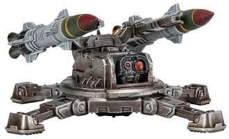
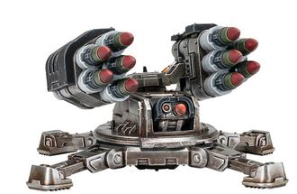
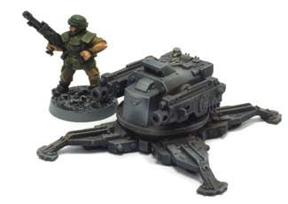
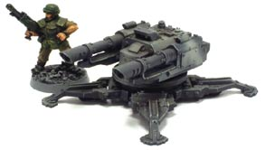
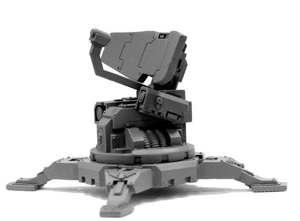
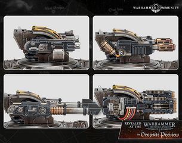

# 1433 狼蛛哨戒炮 Tarantula Sentry Gun

精校状态：中文行文已逐段精校，部分术语仍为暂定

分类：载具 / 地面 / 炮台

原文来源：https://www.bilibili.com/opus/1043725027738910724

原作者：帝国神选罐头

原文时间：编辑于 2026年08月31日 09:01

[返回分类目录](目录.md) · [全书目录](../../目录.md)

原篇名：狼蛛哨兵枪 Tarantula Sentry Gun

<!-- A1433-B0001 -->
**英文原文**

The Sentry Gun, more commonly referred to as a Tarantula, is an Imperial automated mobile weapon system based upon ancient Imperial technology.

<!-- /A1433-B0001 -->

<!-- A1433-B0002 -->

原译文

哨兵枪，通常被称为狼蛛，是一种基于古代帝国技术的帝国自动移动武器系统。

**校订译文**

哨兵枪通常被称为“狼蛛”，是一种以帝国古老技术为基础的自动移动武器系统。

<!-- /A1433-B0002 -->

<!-- A1433-B0003 -->
###### Overview 概述

<!-- /A1433-B0003 -->

<!-- A1433-B0004 -->
**英文原文**

Useful in a variety of roles, it is most notably used by the Imperial Guard, but is also utilized by other groups including the Adeptus Astartes and the Adeptus Arbites. The exact origin for its nickname is unknown also it is fair to assume that their multi-legged appearance can be attributed in part to this.

<!-- /A1433-B0004 -->

<!-- A1433-B0005 -->

原译文

它在各种角色中都很有用，最著名的是被帝国卫队使用，但也被其他组织使用，包括阿斯塔特修会和法务部。它的绰号的确切来源尚不清楚，也可以公平地假设，它们的多足外观在一定程度上可以归因于此。

**校订译文**

狼蛛用途广泛，最常见于帝国卫队，星际战士与法务部等组织也会使用。其绰号的确切由来不明，但很可能与多足外形有关。

<!-- /A1433-B0005 -->

<!-- A1433-B0006 -->
**英文原文**

It is said that some Veteran Guardsmen venerate this arcane devices that saved their life on more than one occasions. It is not unheard of for dedications to the sentry's gun machine spirit to be found reverentially placed around it. This practice is frowned upon by most Imperial commanders and Commissars have been known to issue severe penalties to anyone Guardsman caught participating in such acts of unsanctioned worship.

<!-- /A1433-B0006 -->

<!-- A1433-B0007 -->

原译文

据说，一些老兵卫队崇拜这种在多个场合拯救他们生命的神秘装置。在哨兵周围虔诚地供奉它的枪械机魂并非闻所未闻。这种做法是大多数帝国指挥官和政委所不赞成的，众所周知，任何被发现参与这种未经批准的礼拜行为的卫兵都会受到严厉的惩罚。

**校订译文**

据说，一些帝国卫队老兵会敬奉这种曾多次救过自己性命的神秘装置，在哨兵枪周围虔诚地摆放献给其机魂的供物。这类做法令大多数帝国指挥官不悦；政委也曾严惩被发现参与这种未经许可崇拜的卫兵。

<!-- /A1433-B0007 -->

<!-- A1433-B0008 -->
**英文原文**

The main Forge Worlds of Tarantula's origin are Lucius, M'khand, Voss and Metalica.

<!-- /A1433-B0008 -->

<!-- A1433-B0009 -->

原译文

狼蛛主要的起源锻造世界是卢修斯、麦克汉德、沃斯和梅塔利卡。

**校订译文**

狼蛛的主要生产地包括卢修斯、姆'坎德、沃斯与梅塔利卡等铸造世界。

<!-- /A1433-B0009 -->

<!-- A1433-B0010 -->
## Design 设计

<!-- /A1433-B0010 -->

<!-- A1433-B0011 -->
**英文原文**

The Tarantula is a semi-robotic weapons platform, capable of moving and firing with heavy weapons. Its base has four wide feet which contain gravitic-reaction jets allowing it to hover and lift itself into place.

<!-- /A1433-B0011 -->

<!-- A1433-B0012 -->

原译文

狼蛛是一种半机器人武器平台，能够移动和用重型武器射击。它的底座有四个宽脚，里面有反重力射流，使它能够悬停并将自己抬到适当的位置。

**校订译文**

狼蛛是一种半自动机械武器平台，能够移动并发射重型武器。其底座有四只宽足，内置重力反作用喷流装置，使平台能够悬浮并升至部署位置。

<!-- /A1433-B0012 -->

<!-- A1433-B0013 图片 -->

<!-- A1433-B0014 -->

原译文

Tarantula with Orias Frag Missile 装备奥里亚斯破片导弹的狼蛛

**校订译文**

Tarantula with Orias Frag Missile 装备奥里亚斯破片导弹的狼蛛

<!-- /A1433-B0014 -->

<!-- A1433-B0015 -->
**英文原文**

The Tarantula is controlled by a simple logic engine and infused with "the machine spirit," which allows it to operate without a controller. However, due to limits in the logic engine's targeting capabilities, it must be pre-set to fire in one of three distinct modes prior to being deployed into battle. In point defense mode the Tarantula will fire at targets that enter its fixed firing arc, designed to cover a particular area of the battlefield. Sentry mode is meant for close defense of the Tarantula's immediate area, allowing it to traverse completely to engage targets though at a shorter range. When engaged in interceptor mode, the Tarantula engages enemy craft such as drop pods which attempt to land in the area.

<!-- /A1433-B0015 -->

<!-- A1433-B0016 -->

原译文

狼蛛由一个简单的逻辑引擎控制，并注入了“机魂”，使其可以在没有控制器的情况下运行。然而，由于逻辑引擎的瞄准能力有限，在部署到战斗中之前，必须将其预设为以三种不同模式之一射击。在点防御模式下，狼蛛将向进入其固定射击弧线的目标开火，该弧线旨在覆盖战场的特定区域。哨兵模式旨在近距离防御狼蛛的邻近区域，使其能够完全穿过区域去攻击目标，不过有效射程会更短一些。当处于拦截模式时，狼蛛会与试图降落在该地区的敌方飞行器（如空投舱）交战。

**校订译文**

狼蛛由简单的逻辑引擎控制，并被赋予“机魂”，因而无需操作者即可运行。不过，逻辑引擎的瞄准能力有限，投入战场前必须预设三种射击模式之一。点防御模式用于掩护特定区域，只攻击进入固定射界的目标。哨戒模式保护平台近旁，炮台可以全周旋转射击，但射程较短。拦截模式则用于打击试图在区域内降落的敌方飞行器，例如空降舱。

**校注：** traverse completely指炮台全周回转，不是整个平台穿过区域。

<!-- /A1433-B0016 -->

<!-- A1433-B0017 -->
**英文原文**

Each Tarantula includes its own targeting auspex and on-board power cell, though it is possible to hook multiple sentry guns to a single power generator for prolonged use. Once deployed the weapon system will continue to operate until it has run out of ammunition or it is destroyed and, unlike normal sentries, won't doze off or daydream while on duty.

<!-- /A1433-B0017 -->

<!-- A1433-B0018 -->

原译文

每架狼蛛都有自己的瞄准占卜仪和机载电源，但也可以将多支哨兵枪连在一台发电机上长期使用。一旦部署，武器系统将继续运行，直到弹药耗尽或被摧毁，与普通哨兵不同，在执勤时不会打盹或做白日梦。

**校订译文**

每座狼蛛都自带瞄准鸟卜仪与动力电池，也可将多座哨兵枪接入同一台发电机，供其长期运行。一旦部署，它们便会持续工作，直到弹药耗尽或被摧毁；与普通哨兵不同，它们在执勤时绝不会打盹或走神。

<!-- /A1433-B0018 -->

<!-- A1433-B0019 图片 -->

<!-- A1433-B0020 -->

原译文

Tarantula with Hyperios Missile Launcher 装备许珀里翁导弹发射器的狼蛛

**校订译文**

Tarantula with Hyperios Missile Launcher 装备许珀里翁导弹发射器的狼蛛

<!-- /A1433-B0020 -->

<!-- A1433-B0021 -->
**英文原文**

Many types of sentry guns exist, although the two most common variants are equipped either with twin Heavy Bolters for anti-infantry or twin Lascannons for anti-tank duty.

<!-- /A1433-B0021 -->

<!-- A1433-B0022 -->

原译文

存在许多类型的哨兵枪，尽管两种最常见的变体要么配备了用于反步兵的双联重型爆矢枪，要么配备了双联激光炮用于反坦克任务。

**校订译文**

哨兵枪有多种型号，最常见的两种分别配备双联重型爆矢枪和双联激光炮，用于反步兵与反坦克任务。

<!-- /A1433-B0022 -->

<!-- A1433-B0023 -->
## Tactical Use 战术使用

<!-- /A1433-B0023 -->

<!-- A1433-B0024 -->
**英文原文**

The uses for these sentry guns are many and varied, from defending a perimeter from surprise attack to establishing a roadblock or operating as part of a static defensive line. However, their lack of inherit mobility restricts their use on a fluid battlefield. However, with their gravitic jets and ability to slowly hover they are able to simultaneously move and fire their heavy weapons, something baseline human weapons crews would be unable to do without lengthy set up and deployment . A Tarantula can be carried on the back of a Chimera, Rhino or by a Valkyrie in addition to their normal passenger compliment. Tarantulas can even be air-dropped via grav-chute and deployed from packing crates. Drop Regiments such as the famous Elysian Drop Troops often use Sentry Guns equipped with grav-chutes dropped from Valkyrie airborne assault carriers to help form defensive perimeters around captured objectives, especially when using them as part of a 'Castellan' Sentry Gun Defence Force.

<!-- /A1433-B0024 -->

<!-- A1433-B0025 -->

原译文

这些哨兵枪的用途多种多样，从保护周边免受突袭到设置路障或作为静态防线的一部分。然而，它们缺乏固有的机动性，限制了它们在流动的战场上的使用。然而，凭借其反重力喷流和缓慢悬停的能力，它们能够同时移动和发射重型武器，是人类常规武器操作人员在没有经过长时间的准备和部署的情况下无法做到的。除了能搭载正常数量的乘客之外，奇美拉、犀牛或瓦尔基里的背上也可以搭载狼蛛。狼蛛甚至可以通过重力伞空投，并从板条箱中展开。空投部队，如著名的艾丽西亚空投部队，经常使用配备有从瓦尔基里空降突击运输机上投掷的配重力伞的哨兵枪，以帮助在捕获的目标周围形成防御周界，特别是在将其用作“堡主”哨兵枪防御部队的一部分时。

**校订译文**

哨戒炮用途多样，可以保护周边免遭突袭、设置路障，也能组成固定防线。不过，机动性有限，使其不适应快速变化的战场。借助重力喷流和缓慢悬浮能力，狼蛛可以一边移动一边发射重型武器；普通人类炮组若不经过耗时的准备与部署，无法做到这一点。奇美拉、犀牛和女武神炮艇在搭载正常数量乘员的同时，还能额外运载狼蛛。狼蛛也可通过重力伞空投，从包装箱中展开。艾丽西亚空降兵等著名空降部队经常利用女武神炮艇，投放带重力伞的哨戒炮，在夺取的目标周围建立防御圈；“堡主”哨戒炮防御部队尤其擅长这种用法。

<!-- /A1433-B0025 -->

<!-- A1433-B0026 -->
**英文原文**

Arbites sentry guns are often used for crowd control and riot suppression in addition to defending their precinct houses.

<!-- /A1433-B0026 -->

<!-- A1433-B0027 -->

原译文

除了保卫他们的警区房屋外，法务哨兵枪还经常用于人群控制和骚乱镇压。

**校订译文**

法务部除用哨兵枪保卫辖区警署外，也常用其管控人群、镇压骚乱。

<!-- /A1433-B0027 -->

<!-- A1433-B0028 -->
## Technical Information 技术资料

原题：Technical Information 技术信息

<!-- /A1433-B0028 -->

<!-- A1433-B0029 图片 -->

<!-- A1433-B0030 -->

原译文

Tarantula with a pair of heavy bolters 狼蛛配备一组重型爆矢枪

**校订译文**

Tarantula with a pair of heavy bolters 狼蛛配备一组重型爆矢枪

<!-- /A1433-B0030 -->

<!-- A1433-B0031 -->
**英文原文**

Vehicle Name:Tarantula Sentry Gun

<!-- /A1433-B0031 -->

<!-- A1433-B0032 -->

原译文

载具名称：狼蛛哨兵枪

**校订译文**

载具名称：狼蛛哨戒炮

<!-- /A1433-B0032 -->

<!-- A1433-B0033 -->
**英文原文**

Forge World of Origin:Metalica

<!-- /A1433-B0033 -->

<!-- A1433-B0034 -->

原译文

起源铸造世界：梅塔利卡

**校订译文**

起源铸造世界：梅塔利卡

<!-- /A1433-B0034 -->

<!-- A1433-B0035 -->
**英文原文**

Known Patterns:I-V

<!-- /A1433-B0035 -->

<!-- A1433-B0036 -->

原译文

已知型号：I - V

**校订译文**

已知型号：I - V

<!-- /A1433-B0036 -->

<!-- A1433-B0037 -->
**英文原文**

Crew:None

<!-- /A1433-B0037 -->

<!-- A1433-B0038 -->

原译文

乘员：无

**校订译文**

乘员：无

<!-- /A1433-B0038 -->

<!-- A1433-B0039 -->
**英文原文**

Powerplant:Power Cell

<!-- /A1433-B0039 -->

<!-- A1433-B0040 -->

原译文

动力装置：动力电池

**校订译文**

动力装置：动力电池

<!-- /A1433-B0040 -->

<!-- A1433-B0041 -->
**英文原文**

Weight:1.1 tonnes

<!-- /A1433-B0041 -->

<!-- A1433-B0042 -->

原译文

重量：1.1吨

**校订译文**

重量：1.1吨

<!-- /A1433-B0042 -->

<!-- A1433-B0043 -->
**英文原文**

Length:5.3m

<!-- /A1433-B0043 -->

<!-- A1433-B0044 -->

原译文

长度：5.3米

**校订译文**

长度：5.3米

<!-- /A1433-B0044 -->

<!-- A1433-B0045 -->
**英文原文**

Width:5.3m

<!-- /A1433-B0045 -->

<!-- A1433-B0046 -->

原译文

宽度：5.3米

**校订译文**

宽度：5.3米

<!-- /A1433-B0046 -->

<!-- A1433-B0047 -->
**英文原文**

Height:1.6m

<!-- /A1433-B0047 -->

<!-- A1433-B0048 -->

原译文

高度：1.6米

**校订译文**

高度：1.6米

<!-- /A1433-B0048 -->

<!-- A1433-B0049 -->
**英文原文**

Ground Clearance:N/A

<!-- /A1433-B0049 -->

<!-- A1433-B0050 -->

原译文

离地间隙：无

**校订译文**

离地间隙：N/A（原表未列）

<!-- /A1433-B0050 -->

<!-- A1433-B0051 -->
**英文原文**

Fording Depth:{{{Fording Depth}}}

<!-- /A1433-B0051 -->

<!-- A1433-B0052 -->

原译文

涉水深度：｛｛｛涉水深度｝｝

**校订译文**

涉水深度：未提供

**校注：** 原始资料此处为空或保留未展开的模板字段，没有可据以补写的数值。

<!-- /A1433-B0052 -->

<!-- A1433-B0053 -->
**英文原文**

Max Speed - on road N/A

<!-- /A1433-B0053 -->

<!-- A1433-B0054 -->

原译文

最大速度-在路上无

**校订译文**

公路最高速度：N/A（原表未列）

<!-- /A1433-B0054 -->

<!-- A1433-B0055 -->
**英文原文**

Max Speed - off road:N/A

<!-- /A1433-B0055 -->

<!-- A1433-B0056 -->

原译文

最大速度-越野：无

**校订译文**

越野最高速度：N/A（原表未列）

<!-- /A1433-B0056 -->

<!-- A1433-B0057 -->
**英文原文**

Transport Capacity:N/A

<!-- /A1433-B0057 -->

<!-- A1433-B0058 -->

原译文

运输能力：无

**校订译文**

运输能力：N/A（原表未列）

<!-- /A1433-B0058 -->

<!-- A1433-B0059 -->
**英文原文**

Access Points:N/A

<!-- /A1433-B0059 -->

<!-- A1433-B0060 -->

原译文

入口：无

**校订译文**

入口：N/A（原表未列）

<!-- /A1433-B0060 -->

<!-- A1433-B0061 -->
**英文原文**

Main Armament:2 x Heavy Bolters

<!-- /A1433-B0061 -->

<!-- A1433-B0062 -->

原译文

主武器：2个重型爆矢枪

**校订译文**

主武器：2挺重型爆矢枪

<!-- /A1433-B0062 -->

<!-- A1433-B0063 -->
**英文原文**

Secondary Armament:N/A

<!-- /A1433-B0063 -->

<!-- A1433-B0064 -->

原译文

次要武器：无

**校订译文**

次要武器：N/A（原表未列）

<!-- /A1433-B0064 -->

<!-- A1433-B0065 -->
**英文原文**

Traverse:360°

<!-- /A1433-B0065 -->

<!-- A1433-B0066 -->

原译文

横向：360°

**校订译文**

水平射界：360°

<!-- /A1433-B0066 -->

<!-- A1433-B0067 -->
**英文原文**

Elevation:From -0° to +70°

<!-- /A1433-B0067 -->

<!-- A1433-B0068 -->

原译文

仰角：从-0°到+70°

**校订译文**

仰角：从-0°到+70°

<!-- /A1433-B0068 -->

<!-- A1433-B0069 -->
**英文原文**

Main Ammunition:600 rounds

<!-- /A1433-B0069 -->

<!-- A1433-B0070 -->

原译文

主要弹药：600发

**校订译文**

主要弹药：600发

<!-- /A1433-B0070 -->

<!-- A1433-B0071 -->
**英文原文**

Secondary Ammunition:N/A

<!-- /A1433-B0071 -->

<!-- A1433-B0072 -->

原译文

次要弹药：无Armour 装甲

**校订译文**

次要弹药：N/A（原表未列）

Armour 装甲

<!-- /A1433-B0072 -->

<!-- A1433-B0073 -->
**英文原文**

Superstructure:10mm

<!-- /A1433-B0073 -->

<!-- A1433-B0074 -->

原译文

上部结构：10毫米

**校订译文**

上部结构：10毫米

<!-- /A1433-B0074 -->

<!-- A1433-B0075 -->
**英文原文**

Hull:N/A

<!-- /A1433-B0075 -->

<!-- A1433-B0076 -->

原译文

车体：无

**校订译文**

车体：N/A（原表未列）

<!-- /A1433-B0076 -->

<!-- A1433-B0077 -->
**英文原文**

Gun Mantlet:N/A

<!-- /A1433-B0077 -->

<!-- A1433-B0078 -->

原译文

炮盾：无

**校订译文**

炮盾：N/A（原表未列）

<!-- /A1433-B0078 -->

<!-- A1433-B0079 -->
**英文原文**

Vehicle Designation:0427-941-4098-TA551

<!-- /A1433-B0079 -->

<!-- A1433-B0080 -->

原译文

载具编号：0427-941-4098-TA551

**校订译文**

载具编号：0427-941-4098-TA551

<!-- /A1433-B0080 -->

<!-- A1433-B0081 -->
**英文原文**

Firing Ports:N/A

<!-- /A1433-B0081 -->

<!-- A1433-B0082 -->

原译文

开火口：无

**校订译文**

开火口：N/A（原表未列）

<!-- /A1433-B0082 -->

<!-- A1433-B0083 -->
**英文原文**

Turret:10mm

<!-- /A1433-B0083 -->

<!-- A1433-B0084 -->

原译文

炮塔：10毫米

**校订译文**

炮塔：10毫米

<!-- /A1433-B0084 -->

<!-- A1433-B0085 图片 -->

<!-- A1433-B0086 -->

原译文

Tarantula with a pair of lascannons 狼蛛配备一组激光炮

**校订译文**

Tarantula with a pair of lascannons 狼蛛配备一组激光炮

<!-- /A1433-B0086 -->

<!-- A1433-B0087 -->
**英文原文**

Vehicle Name:Tarantula Sentry Gun

<!-- /A1433-B0087 -->

<!-- A1433-B0088 -->

原译文

载具名称：狼蛛哨兵枪

**校订译文**

载具名称：狼蛛哨戒炮

<!-- /A1433-B0088 -->

<!-- A1433-B0089 -->
**英文原文**

Forge World of Origin:Estaban III

<!-- /A1433-B0089 -->

<!-- A1433-B0090 -->

原译文

起源铸造世界：埃斯塔班三号

**校订译文**

起源铸造世界：埃斯塔班三号

<!-- /A1433-B0090 -->

<!-- A1433-B0091 -->
**英文原文**

Known Patterns:I-VII

<!-- /A1433-B0091 -->

<!-- A1433-B0092 -->

原译文

已知型号：I - VII

**校订译文**

已知型号：I - VII

<!-- /A1433-B0092 -->

<!-- A1433-B0093 -->
**英文原文**

Crew:None

<!-- /A1433-B0093 -->

<!-- A1433-B0094 -->

原译文

乘员：无

**校订译文**

乘员：无

<!-- /A1433-B0094 -->

<!-- A1433-B0095 -->
**英文原文**

Powerplant:Power Cell

<!-- /A1433-B0095 -->

<!-- A1433-B0096 -->

原译文

动力装置：动力电池

**校订译文**

动力装置：动力电池

<!-- /A1433-B0096 -->

<!-- A1433-B0097 -->
**英文原文**

Weight:1.1 tonnes

<!-- /A1433-B0097 -->

<!-- A1433-B0098 -->

原译文

重量：1.1吨

**校订译文**

重量：1.1吨

<!-- /A1433-B0098 -->

<!-- A1433-B0099 -->
**英文原文**

Length:5.3m

<!-- /A1433-B0099 -->

<!-- A1433-B0100 -->

原译文

长度：5.3米

**校订译文**

长度：5.3米

<!-- /A1433-B0100 -->

<!-- A1433-B0101 -->
**英文原文**

Width:5.3m

<!-- /A1433-B0101 -->

<!-- A1433-B0102 -->

原译文

宽度：5.3米

**校订译文**

宽度：5.3米

<!-- /A1433-B0102 -->

<!-- A1433-B0103 -->
**英文原文**

Height:1.6m

<!-- /A1433-B0103 -->

<!-- A1433-B0104 -->

原译文

高度：1.6米

**校订译文**

高度：1.6米

<!-- /A1433-B0104 -->

<!-- A1433-B0105 -->
**英文原文**

Ground Clearance:N/A

<!-- /A1433-B0105 -->

<!-- A1433-B0106 -->

原译文

离地间隙：无

**校订译文**

离地间隙：N/A（原表未列）

<!-- /A1433-B0106 -->

<!-- A1433-B0107 -->
**英文原文**

Fording Depth:{{{Fording Depth}}}

<!-- /A1433-B0107 -->

<!-- A1433-B0108 -->

原译文

涉水深度：｛｛｛涉水深度｝｝

**校订译文**

涉水深度：未提供

**校注：** 原始资料此处为空或保留未展开的模板字段，没有可据以补写的数值。

<!-- /A1433-B0108 -->

<!-- A1433-B0109 -->
**英文原文**

Max Speed - on road N/A

<!-- /A1433-B0109 -->

<!-- A1433-B0110 -->

原译文

最大速度-在路上无

**校订译文**

公路最高速度：N/A（原表未列）

<!-- /A1433-B0110 -->

<!-- A1433-B0111 -->
**英文原文**

Max Speed - off road:N/A

<!-- /A1433-B0111 -->

<!-- A1433-B0112 -->

原译文

最大速度-越野：无

**校订译文**

越野最高速度：N/A（原表未列）

<!-- /A1433-B0112 -->

<!-- A1433-B0113 -->
**英文原文**

Transport Capacity:N/A

<!-- /A1433-B0113 -->

<!-- A1433-B0114 -->

原译文

运输能力：无

**校订译文**

运输能力：N/A（原表未列）

<!-- /A1433-B0114 -->

<!-- A1433-B0115 -->
**英文原文**

Access Points:N/A

<!-- /A1433-B0115 -->

<!-- A1433-B0116 -->

原译文

入口：无

**校订译文**

入口：N/A（原表未列）

<!-- /A1433-B0116 -->

<!-- A1433-B0117 -->
**英文原文**

Main Armament:2 x Lascannons

<!-- /A1433-B0117 -->

<!-- A1433-B0118 -->

原译文

主武器：2门激光炮

**校订译文**

主武器：2门激光炮

<!-- /A1433-B0118 -->

<!-- A1433-B0119 -->
**英文原文**

Traverse:360°

<!-- /A1433-B0119 -->

<!-- A1433-B0120 -->

原译文

横向：360°

**校订译文**

水平射界：360°

<!-- /A1433-B0120 -->

<!-- A1433-B0121 -->
**英文原文**

Elevation:From -0° to +70°

<!-- /A1433-B0121 -->

<!-- A1433-B0122 -->

原译文

仰角：从-0°到+70°

**校订译文**

仰角：从-0°到+70°

<!-- /A1433-B0122 -->

<!-- A1433-B0123 -->
**英文原文**

Main Ammunition:20 shots from powerpack

<!-- /A1433-B0123 -->

<!-- A1433-B0124 -->

原译文

主弹药：能量包20发

**校订译文**

主武器弹药：每个能源包可供射击20次

<!-- /A1433-B0124 -->

<!-- A1433-B0125 -->
**英文原文**

Secondary Ammunition:N/A

<!-- /A1433-B0125 -->

<!-- A1433-B0126 -->

原译文

次要弹药：无Armour 装甲

**校订译文**

次要弹药：N/A（原表未列）

Armour 装甲

<!-- /A1433-B0126 -->

<!-- A1433-B0127 -->
**英文原文**

Superstructure:10mm

<!-- /A1433-B0127 -->

<!-- A1433-B0128 -->

原译文

上部结构：10mm

**校订译文**

上部结构：10mm

<!-- /A1433-B0128 -->

<!-- A1433-B0129 -->
**英文原文**

Hull:N/A

<!-- /A1433-B0129 -->

<!-- A1433-B0130 -->

原译文

车体：无

**校订译文**

车体：N/A（原表未列）

<!-- /A1433-B0130 -->

<!-- A1433-B0131 -->
**英文原文**

Gun Mantlet:N/A

<!-- /A1433-B0131 -->

<!-- A1433-B0132 -->

原译文

炮盾：无

**校订译文**

炮盾：N/A（原表未列）

<!-- /A1433-B0132 -->

<!-- A1433-B0133 -->
**英文原文**

Vehicle Designation:5463-028-8338-TA021

<!-- /A1433-B0133 -->

<!-- A1433-B0134 -->

原译文

载具编号：5463-028-8338-TA021

**校订译文**

载具编号：5463-028-8338-TA021

<!-- /A1433-B0134 -->

<!-- A1433-B0135 -->
**英文原文**

Firing Ports:N/A

<!-- /A1433-B0135 -->

<!-- A1433-B0136 -->

原译文

开火口：无

**校订译文**

开火口：N/A（原表未列）

<!-- /A1433-B0136 -->

<!-- A1433-B0137 -->
**英文原文**

Turret:10mm

<!-- /A1433-B0137 -->

<!-- A1433-B0138 -->

原译文

炮塔：10mmSpace Marines 星际战士Many Chapters maintain a supply of Tarantula sentry guns which help alleviate some of the manpower concerns they face. Though they favor a highly-mobile form of warfare, Space Marines still find many uses for the Tarantula. This includes defending landing sites and extraction routes by providing a remote rearguard to delay any pursuing enemies. Space Marine Scouts have also used sentry guns to create an automated ambush, infiltrating into enemy territory to set up a disassembled camouflaged Tarantula and withdrawing to safety. Tarantulas can also be deployed from the backs of Land Raiders, Rhino and Razorback transports, as well as via grav-chute from Thunderhawk gunships. Some variants used by Space Marines are even able to be deployed via drop pod. Groups of sentry guns used to defend an area are often known as an Automated Defence Force.许多战团都有狼蛛哨兵枪的供应，这有助于缓解他们面临的一些人力问题。尽管星际战士喜欢高度机动的战争形式，但他们仍然发现狼蛛有很多用途。这包括通过提供远程后卫来延迟任何追击的敌人，从而保卫登陆点和撤离路线。星际战士侦察兵还使用哨兵枪进行自动伏击，渗透到敌方领土，设置一个可拆卸的伪装狼蛛，并撤退到安全地带。狼蛛也可以从兰德掠袭者、犀牛和豪猪运输车的后部部署，也可以通过雷鹰炮艇的重力伞部署。星际战士使用的一些变体甚至可以通过空投舱进行部署。用于保卫一个地区的哨兵枪组通常被称为自动防御部队。

**校订译文**

炮塔：10mm

Space Marines 星际战士

Many Chapters maintain a supply of Tarantula sentry guns which help alleviate some of the manpower concerns they face. Though they favor a highly-mobile form of warfare, Space Marines still find many uses for the Tarantula. This includes defending landing sites and extraction routes by providing a remote rearguard to delay any pursuing enemies. Space Marine Scouts have also used sentry guns to create an automated ambush, infiltrating into enemy territory to set up a disassembled camouflaged Tarantula and withdrawing to safety. Tarantulas can also be deployed from the backs of Land Raiders, Rhino and Razorback transports, as well as via grav-chute from Thunderhawk gunships. Some variants used by Space Marines are even able to be deployed via drop pod. Groups of sentry guns used to defend an area are often known as an Automated Defence Force.

许多战团储备狼蛛哨戒炮，以缓解兵力不足。尽管星际战士偏重高机动战术，狼蛛仍有诸多用途，例如充当遥控后卫，拖延追兵，保护登陆地点与撤离路线。侦察兵也会潜入敌境，组装并伪装拆卸运来的狼蛛，随后撤至安全地带，构成自动伏击。狼蛛可从兰德掠袭者、犀牛和豪猪运输车后部部署，也可由雷鹰炮艇使用重力伞空投。某些星际战士型号甚至能通过空降舱投放。用于保卫一片区域的哨兵枪编组，常被称为自动防御部队。

**校注：** 底稿将技术表末行、章节标题、整段英文及中文连成一段；本处恢复段落层次，并逐字保留其中英文。

<!-- /A1433-B0138 -->

<!-- A1433-B0139 图片 -->

<!-- A1433-B0140 -->

原译文

automated Hyperios Missile launcher 自动许珀里翁导弹发射器

**校订译文**

automated Hyperios Missile launcher 自动许珀里翁导弹发射器

<!-- /A1433-B0140 -->

<!-- A1433-B0141 -->
**英文原文**

These Tarantulas utilize the same technology found in the automated turrets of Razorback transports. More often than not they are created by salvaging the turret from a destroyed Razorback and converting it into a sentry gun, with the aid of a Techmarine reading the appropriate Rite of Salvage.

<!-- /A1433-B0141 -->

<!-- A1433-B0142 -->

原译文

这些狼蛛采用了与豪猪运输车自动炮塔相同的技术。通常，它们是通过从被摧毁的豪猪上回收炮塔并将其改装成哨兵枪，在技术军士宣读适当的拯救仪式的帮助下制造的。

**校订译文**

这些狼蛛采用了豪猪运输车自动炮塔的同类技术。制造者常从被毁的豪猪上回收炮塔，再由科技战士诵读相应的回收仪式，将其改装为哨兵枪。

<!-- /A1433-B0142 -->

<!-- A1433-B0143 图片 -->

<!-- A1433-B0144 -->

原译文

Hyperios Air Defense Command Platform 许珀里翁防空指挥平台

**校订译文**

Hyperios Air Defense Command Platform 许珀里翁防空指挥平台

<!-- /A1433-B0144 -->

<!-- A1433-B0145 -->
**英文原文**

Space Marines also make use of a unique Tarantula mounting a Hyperios missile launcher. These Hyperios Platforms are controlled by a central command platform and fielded in batteries of up to four platforms each. The command platform, though unarmed, is equipped with a logis-engine and scanning equipment to detect incoming aircraft. Once an enemy is within range, it relays the targeting information to the nearest launcher which activates, tracks the target and fires on it. A battery of these systems are often used to defend important strategic locations from air attack; although not as effective as a true Whirlwind Hyperios due to the limits of the logis-engine, they are sufficient for static defense.

<!-- /A1433-B0145 -->

<!-- A1433-B0146 -->

原译文

星际战士还使用了一种独特的狼蛛，上面安装着许珀里翁导弹发射器。这些许珀里翁平台由一个中央指挥平台控制，每个平台最多由四个平台组成。指挥平台虽然没有武装，但配备了逻辑引擎和扫描设备，用于探测来袭的飞机。一旦敌人进入射程内，它就会将目标信息传递给最近的发射器，发射器会激活、跟踪目标并向其开火。这些系统中的一组通常用于防御重要的战略位置免受空袭；尽管由于逻辑引擎的限制，它们不如真正的旋风许珀里翁有效，但它们足以进行静态防御。

**校订译文**

星际战士还使用一种装有许珀里翁导弹发射器的特殊狼蛛。这类平台编为炮组，每组最多四座，由中央指挥平台统一控制。指挥平台虽然没有武器，却配有逻辑引擎和扫描设备，用于侦测来袭飞行器。敌机一旦进入射程，它就把瞄准信息传给最近的发射器；发射器随即启动、跟踪并开火。这些炮组常用于保护重要战略地点免遭空袭。虽然逻辑引擎的局限使其效能不如真正的许珀里翁型旋风，但足以承担固定防空任务。

**校注：** batteries of up to four platforms指每个炮组最多四个平台，原“每个平台由四个平台组成”错误。

<!-- /A1433-B0146 -->

<!-- A1433-B0147 -->
**英文原文**

During the Great Crusade and Horus Heresy Tarantulas were equipped with a wider variety of weapons including not just Heavy Bolters or Lascannons but also Sentry Melta Arrays, Volkite Culverins,, Orias Frag Missiles, and Hyperios Missiles.

<!-- /A1433-B0147 -->

<!-- A1433-B0148 -->

原译文

在大远征和荷鲁斯叛乱期间狼蛛配备了各种各样的武器，不仅包括重型爆矢枪或激光炮，还包括哨兵热熔阵列、爆燃长炮、奥里亚斯破片导弹和许珀里翁导弹。

**校订译文**

大远征及荷鲁斯之乱期间，狼蛛可配备的武器更加多样，除重型爆矢枪与激光炮外，还包括哨兵热熔阵列、爆燃长炮、奥里亚斯破片导弹及许珀里翁导弹。

<!-- /A1433-B0148 -->

<!-- A1433-B0149 图片 -->

<!-- A1433-B0150 -->

原译文

Tarantula 狼蛛

**校订译文**

Tarantula 狼蛛

<!-- /A1433-B0150 -->

<!-- A1433-B0151 -->
**英文原文**

Vehicle Name:Hyperios Anti-Aircraft Platform

<!-- /A1433-B0151 -->

<!-- A1433-B0152 -->

原译文

载具名称：许珀里翁防空平台

**校订译文**

载具名称：许珀里翁防空平台

<!-- /A1433-B0152 -->

<!-- A1433-B0153 -->
**英文原文**

Forge World of Origin:Phaeton

<!-- /A1433-B0153 -->

<!-- A1433-B0154 -->

原译文

起源铸造世界：法厄同

**校订译文**

起源铸造世界：法厄同

<!-- /A1433-B0154 -->

<!-- A1433-B0155 -->
**英文原文**

Known Patterns:I-III

<!-- /A1433-B0155 -->

<!-- A1433-B0156 -->

原译文

已知型号：I - III

**校订译文**

已知型号：I - III

<!-- /A1433-B0156 -->

<!-- A1433-B0157 -->
**英文原文**

Crew:None

<!-- /A1433-B0157 -->

<!-- A1433-B0158 -->

原译文

乘员：无

**校订译文**

乘员：无

<!-- /A1433-B0158 -->

<!-- A1433-B0159 -->
**英文原文**

Powerplant:Power Cell

<!-- /A1433-B0159 -->

<!-- A1433-B0160 -->

原译文

动力装置：动力电池

**校订译文**

动力装置：动力电池

<!-- /A1433-B0160 -->

<!-- A1433-B0161 -->
**英文原文**

Weight:2.1 tonnes

<!-- /A1433-B0161 -->

<!-- A1433-B0162 -->

原译文

重量：2.1吨

**校订译文**

重量：2.1吨

<!-- /A1433-B0162 -->

<!-- A1433-B0163 -->
**英文原文**

Length:5.3m

<!-- /A1433-B0163 -->

<!-- A1433-B0164 -->

原译文

长度：5.3米

**校订译文**

长度：5.3米

<!-- /A1433-B0164 -->

<!-- A1433-B0165 -->
**英文原文**

Width:5.3m

<!-- /A1433-B0165 -->

<!-- A1433-B0166 -->

原译文

宽度：5.3米

**校订译文**

宽度：5.3米

<!-- /A1433-B0166 -->

<!-- A1433-B0167 -->
**英文原文**

Height:1.8m

<!-- /A1433-B0167 -->

<!-- A1433-B0168 -->

原译文

高度：1.8米

**校订译文**

高度：1.8米

<!-- /A1433-B0168 -->

<!-- A1433-B0169 -->
**英文原文**

Ground Clearance:N/A

<!-- /A1433-B0169 -->

<!-- A1433-B0170 -->

原译文

离地间隙：无

**校订译文**

离地间隙：N/A（原表未列）

<!-- /A1433-B0170 -->

<!-- A1433-B0171 -->
**英文原文**

Fording Depth:{{{Fording Depth}}}

<!-- /A1433-B0171 -->

<!-- A1433-B0172 -->

原译文

涉水深度：｛｛｛涉水深度｝｝

**校订译文**

涉水深度：未提供

**校注：** 原始资料此处为空或保留未展开的模板字段，没有可据以补写的数值。

<!-- /A1433-B0172 -->

<!-- A1433-B0173 -->
**英文原文**

Max Speed - on road N/A

<!-- /A1433-B0173 -->

<!-- A1433-B0174 -->

原译文

最大速度-在路上无

**校订译文**

公路最高速度：N/A（原表未列）

<!-- /A1433-B0174 -->

<!-- A1433-B0175 -->
**英文原文**

Max Speed - off road:N/A

<!-- /A1433-B0175 -->

<!-- A1433-B0176 -->

原译文

最大速度-越野：无

**校订译文**

越野最高速度：N/A（原表未列）

<!-- /A1433-B0176 -->

<!-- A1433-B0177 -->
**英文原文**

Transport Capacity:N/A

<!-- /A1433-B0177 -->

<!-- A1433-B0178 -->

原译文

运输能力：无

**校订译文**

运输能力：N/A（原表未列）

<!-- /A1433-B0178 -->

<!-- A1433-B0179 -->
**英文原文**

Access Points:N/A

<!-- /A1433-B0179 -->

<!-- A1433-B0180 -->

原译文

入口：无

**校订译文**

入口：N/A（原表未列）

<!-- /A1433-B0180 -->

<!-- A1433-B0181 -->
**英文原文**

Main Armament: Twin-linked Hyperios missile launcher

<!-- /A1433-B0181 -->

<!-- A1433-B0182 -->

原译文

主武器：双联许珀里翁导弹发射器

**校订译文**

主武器：双联许珀里翁导弹发射器

<!-- /A1433-B0182 -->

<!-- A1433-B0183 -->
**英文原文**

Traverse:360°

<!-- /A1433-B0183 -->

<!-- A1433-B0184 -->

原译文

横向：360°

**校订译文**

水平射界：360°

<!-- /A1433-B0184 -->

<!-- A1433-B0185 -->
**英文原文**

Elevation:From -0° to +70°

<!-- /A1433-B0185 -->

<!-- A1433-B0186 -->

原译文

仰角：从-0°到+70°

**校订译文**

仰角：从-0°到+70°

<!-- /A1433-B0186 -->

<!-- A1433-B0187 -->
**英文原文**

Main Ammunition:20 missiles

<!-- /A1433-B0187 -->

<!-- A1433-B0188 -->

原译文

主弹药：20发导弹

**校订译文**

主武器弹药：20枚导弹

<!-- /A1433-B0188 -->

<!-- A1433-B0189 -->
**英文原文**

Secondary Ammunition:N/A

<!-- /A1433-B0189 -->

<!-- A1433-B0190 -->

原译文

次要弹药：无Armour 装甲

**校订译文**

次要弹药：N/A（原表未列）

Armour 装甲

<!-- /A1433-B0190 -->

<!-- A1433-B0191 -->
**英文原文**

Superstructure:10mm

<!-- /A1433-B0191 -->

<!-- A1433-B0192 -->

原译文

上部结构：10mm

**校订译文**

上部结构：10mm

<!-- /A1433-B0192 -->

<!-- A1433-B0193 -->
**英文原文**

Hull:N/A

<!-- /A1433-B0193 -->

<!-- A1433-B0194 -->

原译文

车体：无

**校订译文**

车体：N/A（原表未列）

<!-- /A1433-B0194 -->

<!-- A1433-B0195 -->
**英文原文**

Gun Mantlet:N/A

<!-- /A1433-B0195 -->

<!-- A1433-B0196 -->

原译文

炮盾：无

**校订译文**

炮盾：N/A（原表未列）

<!-- /A1433-B0196 -->

<!-- A1433-B0197 -->
**英文原文**

Vehicle Designation:5463-028-8339-TA024

<!-- /A1433-B0197 -->

<!-- A1433-B0198 -->

原译文

载具编号：5463-028-8339-TA024

**校订译文**

载具编号：5463-028-8339-TA024

<!-- /A1433-B0198 -->

<!-- A1433-B0199 -->
**英文原文**

Firing Ports:N/A

<!-- /A1433-B0199 -->

<!-- A1433-B0200 -->

原译文

开火口：无

**校订译文**

开火口：N/A（原表未列）

<!-- /A1433-B0200 -->

<!-- A1433-B0201 -->
**英文原文**

Turret:10mm

<!-- /A1433-B0201 -->

<!-- A1433-B0202 -->

原译文

炮塔：10mm

**校订译文**

炮塔：10mm

<!-- /A1433-B0202 -->

<!-- A1433-B0203 -->
## Regiments known to contain Tarantulas 已知装备狼蛛的兵团

原题：Regiments known to contain Tarantulas 已知控制狼蛛的兵团

<!-- /A1433-B0203 -->

<!-- A1433-B0204 -->

原译文

Cadian 98th Armoured Regiment 卡迪安第98装甲团

**校订译文**

Cadian 98th Armoured Regiment 卡迪亚第98装甲团

<!-- /A1433-B0204 -->

<!-- A1433-B0205 -->

原译文

Catachan 18th Jungle Fighters Regiment 卡塔昌第18丛林战士团

**校订译文**

Catachan 18th Jungle Fighters Regiment 卡塔昌第18丛林斗士团

<!-- /A1433-B0205 -->

<!-- A1433-B0206 -->

原译文

Krieg 28th Armoured Regiment 克里格第28装甲团

**校订译文**

Krieg 28th Armoured Regiment 克里格第28装甲团

<!-- /A1433-B0206 -->

<!-- A1433-B0207 -->

原译文

Mordian 16th Armoured Regiment 莫迪安第16装甲团

**校订译文**

Mordian 16th Armoured Regiment 莫迪安第16装甲团

<!-- /A1433-B0207 -->

<!-- A1433-B0208 -->

原译文

Valhallan 193rd Armoured Regiment 瓦尔哈拉第193装甲团

**校订译文**

Valhallan 193rd Armoured Regiment 瓦尔哈拉第193装甲团

<!-- /A1433-B0208 -->

<!-- A1433-B0209 -->
## Chapters known to contain Tarantulas 已知装备狼蛛的战团

原题：Chapters known to contain Tarantulas 已知控制狼蛛的战团

<!-- /A1433-B0209 -->

<!-- A1433-B0210 -->

原译文

Blood Ravens 血鸦

**校订译文**

Blood Ravens 血鸦

<!-- /A1433-B0210 -->

<!-- A1433-B0211 -->
## Rogue Trader Dynasties known to use Tarantulas 已知使用狼蛛的行商浪人王朝

<!-- /A1433-B0211 -->

<!-- A1433-B0212 -->

原译文

House von Valancius 冯·瓦兰修斯家族

**校订译文**

House von Valancius 冯·瓦兰修斯家族

<!-- /A1433-B0212 -->

本篇核心术语与暂定项

以下列出本篇出现的英文原形及核心术语表用词。同形词可能指不同对象，具体词义以本篇正文和校注为准；单复数、别名和仅见于图注的名称可能尚未列入。完整候选见[术语表](../../术语表/双语术语候选.csv)。

| 英文 | 采用中文 | 状态 |
| --- | --- | --- |
| Space Marines | 星际战士 | 官方已核对 |
| Adeptus Astartes | 阿斯塔特修会 | 官方已核对 |
| Imperial Guard | 帝国卫队 | 暂定·语境区分 |
| Chimera | 奇美拉 | 官方已核对 |
| Horus Heresy | 荷鲁斯之乱 | 官方已核对 |
| Equipment | 装备 | 编辑用语已统一 |
| Techmarine | 科技战士 | 官方已核对 |
| Adeptus Arbites | 法务部 | 暂定 |
| Forge World | 铸造世界 | 暂定·官方待核 |
| Great Crusade | 大远征 | 暂定·官方待核 |
| Horus | 荷鲁斯 | 暂定·官方待核 |
| Lucius | 卢修斯 | 暂定·官方待核 |
| Metalica | 梅塔利卡 | 暂定·官方待核 |
| Ancient | 旗手 | 官方已核对 |
| Rhino | 犀牛战车 | 官方已核对 |
| Razorback | 豪猪战车 | 官方已核对 |
| Tarantula Sentry Gun | 狼蛛哨戒炮 | 暂定·官方待核 |
| Whirlwind | 旋风战车 | 官方已核对 |
| Logis | 逻辑士 | 暂定·官方待核 |
| Veteran | 老兵 | 暂定·官方待核 |
| Tarantulas | 狼蛛 | 暂定·官方待核 |
| Castellan | 堡主 | 官方已核对 |
| Valkyrie | 女武神炮艇 | 官方已核对 |
| Orias | 欧里亚斯 | 暂定·官方待核 |
| The Weapon | 武器 | 暂定·官方待核 |
| Gun | 甘 | 暂定·官方待核 |
| System | 星系（恒星系统） | 暂定·官方待核 |
| Estaban III | 埃斯塔班三号 | 暂定·官方待核 |
| M'khand | 姆'坎德 | 暂定·官方待核 |
| Phaeton | 法厄同 | 暂定·官方待核 |
| Voss | 沃斯 | 暂定·官方待核 |
| Missile Launcher | 导弹发射器 | 暂定·官方待核 |
| Hyperios Missile Launcher | 许珀里翁导弹发射器 | 暂定·官方待核 |
| Hyperios Missile | 许珀里翁导弹 | 暂定·官方待核 |
| Auspex | 鸟卜仪 | 暂定·官方待核 |
| Elysian Drop Troops | 艾丽西亚空降兵 | 暂定·官方待核 |
| Rite of Salvage | 回收仪式 | 暂定·官方待核 |
| Hyperios Anti-Aircraft Platform | 许珀里翁防空平台 | 暂定·官方待核 |
| Whirlwind Hyperios | 许珀里翁型旋风战车 | 暂定·官方待核 |

