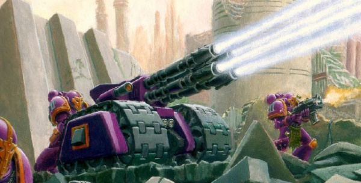
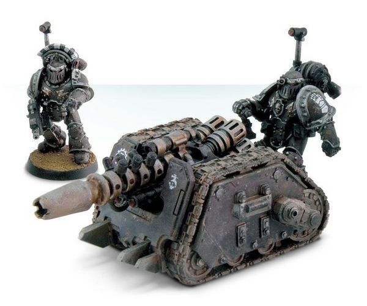
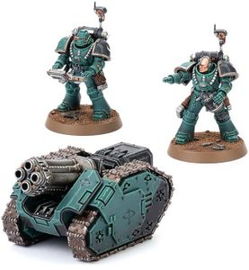
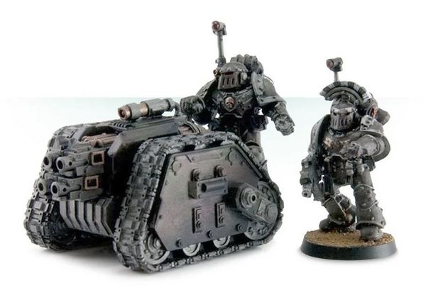

# 1435 细剑装甲载具 Rapier Armoured Carrier

精校状态：中文行文已逐段精校，部分术语仍为暂定

分类：载具 / 地面 / 炮台

原文来源：https://www.bilibili.com/opus/1043725109375795201

原作者：帝国神选罐头

原文时间：编辑于 2026年09月10日 09:42

[返回分类目录](目录.md) · [全书目录](../../目录.md)

<!-- A1435-B0001 -->
**英文原文**

The Rapier Armoured Carrier or Rapier Laser Destroyer is a semi-automated tracked weapons carrier used by the Imperium of Man, including the Imperial Guard, Adeptus Mechanicus and Space Marines. A potent anti-tank weapon, it mounts a powerful multi-barrelled laser cannon with which it shares its name. However Rapiers have also been seen wielding Graviton Cannons, quad Multi-Lasers, quad Mortars, and quad Heavy Bolters.

<!-- /A1435-B0001 -->

<!-- A1435-B0002 -->

原译文

细剑装甲运输车或细剑激光破坏者是一种半自动履带式武器运输车，由帝国卫队、机械神教和星际战士使用。作为一种强大的反坦克武器，它安装了一门强大的多管激光炮，并与之同名。然而，细剑也被看到配备重力炮、四联多管激光、四联迫击炮和四联重型爆矢枪。

**校订译文**

细剑装甲载具，又称细剑激光毁灭炮，是人类帝国使用的半自动履带式武器平台，使用者包括帝国卫队、机械修会和星际战士。它通常搭载同名的强力多管激光炮，是威力可观的反坦克武器。其他型号也可装备重力炮、四联多管激光、四联迫击炮或四联重型爆矢枪。

<!-- /A1435-B0002 -->

<!-- A1435-B0003 图片 -->

<!-- A1435-B0004 -->

原译文

Light Hammer Rapier Carrier as used by pre heresy Emperor's Children 叛乱前帝皇之子使用的轻锤细剑运输车

**校订译文**

Light Hammer Rapier Carrier as used by pre heresy Emperor's Children 荷鲁斯之乱前帝皇之子使用的轻锤型细剑载具

<!-- /A1435-B0004 -->

<!-- A1435-B0005 -->
## History 历史

<!-- /A1435-B0005 -->

<!-- A1435-B0006 -->
## The Great Crusade 大远征

<!-- /A1435-B0006 -->

<!-- A1435-B0007 -->
**英文原文**

In the early years of the Imperium's history the Rapier was a common weapons platform used by the Imperial Army at both the company and regimental level. Under ideal conditions each company would have a support squad with five Rapier carriers plus other weapons, while regiments had support companies of ten machines each, such as five Rapiers and five Mole Mortars, though attrition often accounted for fewer numbers of these weapons. Rapier crewmen wore the blue uniform of artillerymen, with yellow shoulder pads displaying their company insignia or red ones displaying their regimental insignia depending on their assignment.

<!-- /A1435-B0007 -->

<!-- A1435-B0008 -->

原译文

在帝国历史的早期，细剑是帝国军队在连队和兵团等级使用的常见武器平台。在理想情况下，每个连都有一个由五辆细剑运输车和其他武器组成的支援小队，而各团则有十辆机械组成的支援连队，如五辆细剑和五辆鼹鼠迫击炮，不过，由于损耗，这类武器的数量通常会更少。细剑小队的乘员穿着炮兵的蓝色制服，根据他们的任务，黄色的肩甲显示他们的连队徽章，红色的肩甲则显示他们的兵团徽章。

**校订译文**

在帝国历史早期，细剑是帝国军连级与团级单位常见的武器平台。理想情况下，每个连都有一支支援小队，配备五辆细剑及其他武器；每个团则有一支配备十台武器系统的支援连，例如五辆细剑与五门鼹鼠迫击炮。不过，战损通常会使实际数量低于编制。细剑炮组穿着炮兵的蓝色制服；连属炮组佩戴标有连队徽记的黄色肩甲，团属炮组则佩戴标有兵团徽记的红色肩甲。

<!-- /A1435-B0008 -->

<!-- A1435-B0009 图片 -->

<!-- A1435-B0010 -->

原译文

Rapier with Graviton Cannon 装备重力炮的细剑

**校订译文**

Rapier with Graviton Cannon 装备重力炮的细剑

<!-- /A1435-B0010 -->

<!-- A1435-B0011 -->
## Post Heresy 荷鲁斯之乱后

原题：Post Heresy 叛乱后

<!-- /A1435-B0011 -->

<!-- A1435-B0012 -->
**英文原文**

Over the millennia, however, the number and use of Rapiers declined due to difficulties in manufacturing these complex devices, and they have been largely supplanted by designs simpler to construct and easier to maintain. There still remain tens of thousands deployed throughout the Imperium, mostly in the hands of the Adeptus Mechanicus or those Planetary Defense Forces on worlds which still retain the capability to produce and maintain them. They are in more limited use by the Space Marines and Imperial Guard regiments. They are widely used by the PDF but are in more limited use by the Space Marines and Imperial Guard regiments. This is because a rapier typically needs much more in the way of service facilities, power sources, and typically lacks the anti-grav suspensors more common to other Imperial Guard heavy weapons. Hence it is often relegated to second-line defensive formations, rather than more offensive based forces like the Imperial Guard.

<!-- /A1435-B0012 -->

<!-- A1435-B0013 -->

原译文

然而，在数千年的时间里，由于制造这些复杂设备的困难，细剑的数量和使用量都在下降，它们在很大程度上被更简单、更容易维护的设计所取代。整个帝国仍有数万人部署，其中大部分掌握在机械神教或行星防御部队手中，这些部队仍有能力生产和维护它们。PDF广泛使用它们，但星际战士和帝国卫队兵团对它们的使用更为有限。这是因为细剑通常需要更多的服务设备、能源，并且通常缺乏其他帝国卫队重型武器更常见的反重力悬架。因此，它经常被降级为二线防御编队，而不是像帝国卫队这样更具进攻性的部队。

**校订译文**

数千年来，细剑因结构复杂、制造困难，数量与使用范围不断缩减，大多被更易生产和维护的设计取代。帝国各地仍部署着数万台，主要掌握在机械修会，以及仍有能力制造和保养它们的世界的行星防御部队手中。星际战士与帝国卫队兵团使用得较少，行星防御部队则较为普遍。这是因为细剑通常需要更多维修设施与能源供给，又往往缺少其他帝国卫队重型武器常见的反重力悬浮装置。因此，它更常被编入二线防御部队，而非帝国卫队这类偏重进攻的军队。

**校注：** tens of thousands指设备数万台，原数万人误解量词；原文重复一次使用者对比，中文合并同义重复并保留全部信息。

<!-- /A1435-B0013 -->

<!-- A1435-B0014 图片 -->

<!-- A1435-B0015 -->

原译文

Rapier with Quad-Mortar 装备四联迫击炮的细剑

**校订译文**

Rapier with Quad-Mortar 装备四联迫击炮的细剑

<!-- /A1435-B0015 -->

<!-- A1435-B0016 -->
**英文原文**

Those Chapters which descend from the Imperial Fists and Iron Hands Legions are especially known users of Rapiers, and have even employed them for boarding assaults.

<!-- /A1435-B0016 -->

<!-- A1435-B0017 -->

原译文

那些来自帝国之拳和钢铁之手军团的战团是细剑的特别知名的使用者，甚至还使用它们进行跳帮攻击。

**校订译文**

源自帝国之拳与钢铁之手军团的战团，尤以使用细剑而闻名，甚至会带着它们执行跳帮突击。

<!-- /A1435-B0017 -->

<!-- A1435-B0018 -->
## Technical Information 技术资料

原题：Technical Information 技术信息

<!-- /A1435-B0018 -->

<!-- A1435-B0019 -->
**英文原文**

The armoured carrier is built around the weapon system with which it has become synonymous, the Rapier Laser Destroyer. This multi-barrelled weapon achieves greater firepower than even a normal lascannon by focusing its four separate laser systems with precise accuracy on a single point. This is possible thanks to a weak machine spirit which can adjust the convergence of the beams depending on the target's range. However, the weapon system has tremendous power requirements, along with increased maintenance and heat build-up due to its moving parts and the close proximity of multiple laser chambers to each other. Rapiers have also been seen mounted with Graviton Cannons, quad Multi-Lasers, quad Mortars, and quad Heavy Bolters though as of the M41 the technology to manufacture Rapiers with Graviton Cannons seems all but lost.

<!-- /A1435-B0019 -->

<!-- A1435-B0020 -->

原译文

这辆装甲运输车是围绕它已经成为同义词的武器系统，细剑激光破坏炮而制造的。这种多管武器通过将四个独立的激光系统精确地聚焦在一个点上，实现了比普通激光炮更大的火力。这是可能的，因为较弱的机魂可以根据目标的范围调整光束的汇聚。然而，该武器系统具有巨大的功率要求，由于其运动部件和多个激光室彼此靠近，维护和热量积聚也增加了。也有人看到细剑装备了重力炮、四联多管激光、四联迫击炮和四联重型爆矢枪，尽管截至M41，用制造重力炮细剑的技术似乎几乎已经消失了。

**校订译文**

细剑装甲载具围绕同名的细剑激光毁灭炮构建。这种多管武器能将四套独立激光系统的光束精确汇聚于一点，火力甚至超过普通激光炮。其内部的低阶机魂可根据目标距离调整光束交会位置，从而实现这一效果。不过，武器耗能巨大；活动部件增加了维护需求，多个激光腔室紧密排列，也容易积聚热量。细剑还可安装重力炮、四联多管激光、四联迫击炮和四联重型爆矢枪，但到M41，制造重力炮型细剑的技术似乎已几近失传。

<!-- /A1435-B0020 -->

<!-- A1435-B0021 图片 -->

<!-- A1435-B0022 -->

原译文

Rapier with quad Heavy Bolters 装备四联重型爆矢枪的细剑

**校订译文**

Rapier with quad Heavy Bolters 装备四联重型爆矢枪的细剑

<!-- /A1435-B0022 -->

<!-- A1435-B0023 -->
**英文原文**

As it was initially designed for defending cities and fortresses the Rapier has limited mobility, enough to move into ambush positions and across rough terrain, and is often fielded in special batteries of one to three Rapiers used to break up enemy armour attacks. The system can move and fire at the same time thanks to an auto-drive and benefits from targeter equipment. Actual aiming and firing of the laser destroyer, however, is handled by the on-board machine spirit, making the Rapier a semi-independent system; its crew is necessary only for moving the weapon and operational mode selection.

<!-- /A1435-B0023 -->

<!-- A1435-B0024 -->

原译文

由于它最初是为保卫城市和堡垒而设计的，因此细剑的机动性有限，但足以进入伏击位置和穿越崎岖地形，并且经常被部署在一到三个细剑的特殊群组中，用于粉碎敌人的装甲攻击。得益于自动驾驶和目标设备，该系统可以同时移动和射击。然而，激光破坏炮的实际瞄准和射击是由机载机魂处理的，使细剑成为一个半独立的系统；它的乘员只需要移动武器和选择作战模式。

**校订译文**

细剑最初为保卫城市与堡垒而设计，机动性有限，只足以驶入伏击阵位并穿越崎岖地形。它通常以一至三辆组成专门炮组，用于瓦解敌方装甲攻势。自动驱动机构与瞄准设备使其能够边移动边射击。不过，激光毁灭炮实际的瞄准和开火由内置机魂控制，因此细剑属于半自主系统；炮组只需负责移动武器及选择作战模式。

<!-- /A1435-B0024 -->

<!-- A1435-B0025 -->
**英文原文**

Despite having originally built to fire with four convergent beams, the most common version of the Rapier as of M41 uses a two-chambered gun. This is because maintaining and restoring the original specification is nearly a lost art, and the two-chambered version contains less of the originals drawbacks. Despite its decreased firepower, it is still able to penetrate the front armour of a Leman Russ Battle Tank at a one kilometer range.

<!-- /A1435-B0025 -->

<!-- A1435-B0026 -->

原译文

尽管最初是用四个汇聚光束射击的，但截至M41，最常见的细剑版本使用双膛炮。这是因为维护和恢复原始规格几乎是一门失传的技艺，而双膛版本包含的原始缺陷更少。尽管火力有所下降，但它仍然能够在一公里范围内穿透黎曼鲁斯战斗坦克的前装甲。

**校订译文**

虽然最初的细剑以四束汇聚激光开火，但到M41，最常见的版本已采用双腔室炮。这是因为按原规格维护和修复武器的技艺几近失传，而双腔室版本也减少了原设计的若干缺陷。即使火力下降，它仍能在一公里外击穿黎曼鲁斯战斗坦克的正面装甲。

<!-- /A1435-B0026 -->

<!-- A1435-B0027 -->
### Lucius Pattern 卢修斯型

<!-- /A1435-B0027 -->

<!-- A1435-B0028 -->
**英文原文**

Vehicle Name:Rapier Laser Destroyer

<!-- /A1435-B0028 -->

<!-- A1435-B0029 -->

原译文

载具名称：细剑激光破坏者

**校订译文**

载具名称：细剑激光毁灭炮

<!-- /A1435-B0029 -->

<!-- A1435-B0030 -->
**英文原文**

Forge World of Origin:Lucius

<!-- /A1435-B0030 -->

<!-- A1435-B0031 -->

原译文

起源铸造世界：卢修斯

**校订译文**

起源铸造世界：卢修斯

<!-- /A1435-B0031 -->

<!-- A1435-B0032 -->
**英文原文**

Known Patterns:N/A

<!-- /A1435-B0032 -->

<!-- A1435-B0033 -->

原译文

已知型号：无

**校订译文**

已知型号：N/A（原表未列）

<!-- /A1435-B0033 -->

<!-- A1435-B0034 -->
**英文原文**

Crew:1-3 Gunners

<!-- /A1435-B0034 -->

<!-- A1435-B0035 -->

原译文

乘员：1-3名炮手

**校订译文**

乘员：1-3名炮手

<!-- /A1435-B0035 -->

<!-- A1435-B0036 -->
**英文原文**

Powerplant:N/A

<!-- /A1435-B0036 -->

<!-- A1435-B0037 -->

原译文

动力装置：无

**校订译文**

动力装置：N/A（原表未列）

<!-- /A1435-B0037 -->

<!-- A1435-B0038 -->
**英文原文**

Weight:3.5 tonnes

<!-- /A1435-B0038 -->

<!-- A1435-B0039 -->

原译文

重量：3.5吨

**校订译文**

重量：3.5吨

<!-- /A1435-B0039 -->

<!-- A1435-B0040 -->
**英文原文**

Length:2.6m

<!-- /A1435-B0040 -->

<!-- A1435-B0041 -->

原译文

长度：2.6米

**校订译文**

长度：2.6米

<!-- /A1435-B0041 -->

<!-- A1435-B0042 -->
**英文原文**

Width:1.8m

<!-- /A1435-B0042 -->

<!-- A1435-B0043 -->

原译文

宽度：1.8米

**校订译文**

宽度：1.8米

<!-- /A1435-B0043 -->

<!-- A1435-B0044 -->
**英文原文**

Height:1.5m

<!-- /A1435-B0044 -->

<!-- A1435-B0045 -->

原译文

高度：1.5米

**校订译文**

高度：1.5米

<!-- /A1435-B0045 -->

<!-- A1435-B0046 -->
**英文原文**

Ground Clearance:0.3m

<!-- /A1435-B0046 -->

<!-- A1435-B0047 -->

原译文

离地间隙：0.3米

**校订译文**

离地间隙：0.3米

<!-- /A1435-B0047 -->

<!-- A1435-B0048 -->
**英文原文**

Fording Depth:

<!-- /A1435-B0048 -->

<!-- A1435-B0049 -->

原译文

涉水深度：

**校订译文**

涉水深度：未提供

**校注：** 原始资料此处为空或保留未展开的模板字段，没有可据以补写的数值。

<!-- /A1435-B0049 -->

<!-- A1435-B0050 -->
**英文原文**

Max Speed - on road12KPH

<!-- /A1435-B0050 -->

<!-- A1435-B0051 -->

原译文

最大速度-在路上12公里/小时

**校订译文**

公路最高速度：12公里／小时

<!-- /A1435-B0051 -->

<!-- A1435-B0052 -->
**英文原文**

Max Speed - off road:8KPH

<!-- /A1435-B0052 -->

<!-- A1435-B0053 -->

原译文

最大速度-越野：8公里/小时

**校订译文**

越野最高速度：8公里／小时

<!-- /A1435-B0053 -->

<!-- A1435-B0054 -->
**英文原文**

Transport Capacity:N/A

<!-- /A1435-B0054 -->

<!-- A1435-B0055 -->

原译文

运输能力：无

**校订译文**

运输能力：N/A（原表未列）

<!-- /A1435-B0055 -->

<!-- A1435-B0056 -->
**英文原文**

Access Points:Open Topped

<!-- /A1435-B0056 -->

<!-- A1435-B0057 -->

原译文

入口：敞篷

**校订译文**

入口：敞篷

<!-- /A1435-B0057 -->

<!-- A1435-B0058 -->
**英文原文**

Main Armament:1 x Rapier Laser Destroyer

<!-- /A1435-B0058 -->

<!-- A1435-B0059 -->

原译文

主武器：1 x 细剑激光破坏炮

**校订译文**

主武器：1 x 细剑激光毁灭炮

<!-- /A1435-B0059 -->

<!-- A1435-B0060 -->
**英文原文**

Traverse:N/A

<!-- /A1435-B0060 -->

<!-- A1435-B0061 -->

原译文

横向：无

**校订译文**

水平射界：N/A（原表未列）

<!-- /A1435-B0061 -->

<!-- A1435-B0062 -->
**英文原文**

Elevation:N/A

<!-- /A1435-B0062 -->

<!-- A1435-B0063 -->

原译文

仰角：无

**校订译文**

仰角：N/A（原表未列）

<!-- /A1435-B0063 -->

<!-- A1435-B0064 -->
**英文原文**

Main Ammunition:12 rounds from powerpack

<!-- /A1435-B0064 -->

<!-- A1435-B0065 -->

原译文

主弹药：能量包内12发

**校订译文**

主武器弹药：每个能源包可供射击12次

<!-- /A1435-B0065 -->

<!-- A1435-B0066 -->
**英文原文**

Secondary Ammunition:N/A

<!-- /A1435-B0066 -->

<!-- A1435-B0067 -->

原译文

次要弹药：无Armour 装甲

**校订译文**

次要弹药：N/A（原表未列）

Armour 装甲

<!-- /A1435-B0067 -->

<!-- A1435-B0068 -->
**英文原文**

Superstructure:N/A

<!-- /A1435-B0068 -->

<!-- A1435-B0069 -->

原译文

上部结构：无

**校订译文**

上部结构：N/A（原表未列）

<!-- /A1435-B0069 -->

<!-- A1435-B0070 -->
**英文原文**

Hull:20mm

<!-- /A1435-B0070 -->

<!-- A1435-B0071 -->

原译文

车体：20毫米

**校订译文**

车体：20毫米

<!-- /A1435-B0071 -->

<!-- A1435-B0072 -->
**英文原文**

Gun Mantlet:N/A

<!-- /A1435-B0072 -->

<!-- A1435-B0073 -->

原译文

炮盾：无

**校订译文**

炮盾：N/A（原表未列）

<!-- /A1435-B0073 -->

<!-- A1435-B0074 -->
**英文原文**

Vehicle Designation:N/A

<!-- /A1435-B0074 -->

<!-- A1435-B0075 -->

原译文

载具编号：无

**校订译文**

载具编号：N/A（原表未列）

<!-- /A1435-B0075 -->

<!-- A1435-B0076 -->
**英文原文**

Firing Ports:Open Topped

<!-- /A1435-B0076 -->

<!-- A1435-B0077 -->

原译文

开火口：敞篷

**校订译文**

开火口：敞篷

<!-- /A1435-B0077 -->

<!-- A1435-B0078 -->
**英文原文**

Turret:N/A

<!-- /A1435-B0078 -->

<!-- A1435-B0079 -->

原译文

炮塔：无

**校订译文**

炮塔：N/A（原表未列）

<!-- /A1435-B0079 -->

<!-- A1435-B0080 -->
### Graia Pattern 格拉亚型

<!-- /A1435-B0080 -->

<!-- A1435-B0081 -->
**英文原文**

Vehicle Name:Rapier Laser Destroyer

<!-- /A1435-B0081 -->

<!-- A1435-B0082 -->

原译文

载具名称：细剑激光破坏者

**校订译文**

载具名称：细剑激光毁灭炮

<!-- /A1435-B0082 -->

<!-- A1435-B0083 -->
**英文原文**

Forge World of Origin:Graia

<!-- /A1435-B0083 -->

<!-- A1435-B0084 -->

原译文

起源铸造世界：格拉亚

**校订译文**

起源铸造世界：格拉亚

<!-- /A1435-B0084 -->

<!-- A1435-B0085 -->
**英文原文**

Known Patterns:N/A

<!-- /A1435-B0085 -->

<!-- A1435-B0086 -->

原译文

已知型号：无

**校订译文**

已知型号：N/A（原表未列）

<!-- /A1435-B0086 -->

<!-- A1435-B0087 -->
**英文原文**

Crew:1-3 Gunners

<!-- /A1435-B0087 -->

<!-- A1435-B0088 -->

原译文

乘员：1-3名炮手

**校订译文**

乘员：1-3名炮手

<!-- /A1435-B0088 -->

<!-- A1435-B0089 -->
**英文原文**

Powerplant:N/A

<!-- /A1435-B0089 -->

<!-- A1435-B0090 -->

原译文

动力装置：无

**校订译文**

动力装置：N/A（原表未列）

<!-- /A1435-B0090 -->

<!-- A1435-B0091 -->
**英文原文**

Weight:3.3 tonnes

<!-- /A1435-B0091 -->

<!-- A1435-B0092 -->

原译文

重量：3.3吨

**校订译文**

重量：3.3吨

<!-- /A1435-B0092 -->

<!-- A1435-B0093 -->
**英文原文**

Length:2.6m

<!-- /A1435-B0093 -->

<!-- A1435-B0094 -->

原译文

长度：2.6米

**校订译文**

长度：2.6米

<!-- /A1435-B0094 -->

<!-- A1435-B0095 -->
**英文原文**

Width:1.8m

<!-- /A1435-B0095 -->

<!-- A1435-B0096 -->

原译文

宽度：1.8米

**校订译文**

宽度：1.8米

<!-- /A1435-B0096 -->

<!-- A1435-B0097 -->
**英文原文**

Height:1.5m

<!-- /A1435-B0097 -->

<!-- A1435-B0098 -->

原译文

高度：1.5米

**校订译文**

高度：1.5米

<!-- /A1435-B0098 -->

<!-- A1435-B0099 -->
**英文原文**

Ground Clearance:0.3m

<!-- /A1435-B0099 -->

<!-- A1435-B0100 -->

原译文

离地间隙：0.3米

**校订译文**

离地间隙：0.3米

<!-- /A1435-B0100 -->

<!-- A1435-B0101 -->
**英文原文**

Fording Depth:

<!-- /A1435-B0101 -->

<!-- A1435-B0102 -->

原译文

涉水深度：

**校订译文**

涉水深度：未提供

**校注：** 原始资料此处为空或保留未展开的模板字段，没有可据以补写的数值。

<!-- /A1435-B0102 -->

<!-- A1435-B0103 -->
**英文原文**

Max Speed - on road14KPH

<!-- /A1435-B0103 -->

<!-- A1435-B0104 -->

原译文

最大速度-在路上14公里/小时

**校订译文**

公路最高速度：14公里／小时

<!-- /A1435-B0104 -->

<!-- A1435-B0105 -->
**英文原文**

Max Speed - off road:9KPH

<!-- /A1435-B0105 -->

<!-- A1435-B0106 -->

原译文

最大速度-越野：9公里/小时

**校订译文**

越野最高速度：9公里／小时

<!-- /A1435-B0106 -->

<!-- A1435-B0107 -->
**英文原文**

Transport Capacity:N/A

<!-- /A1435-B0107 -->

<!-- A1435-B0108 -->

原译文

运输能力：无

**校订译文**

运输能力：N/A（原表未列）

<!-- /A1435-B0108 -->

<!-- A1435-B0109 -->
**英文原文**

Access Points:Open Topped

<!-- /A1435-B0109 -->

<!-- A1435-B0110 -->

原译文

入口：敞篷

**校订译文**

入口：敞篷

<!-- /A1435-B0110 -->

<!-- A1435-B0111 -->
**英文原文**

Main Armament:1 x Rapier Laser Destroyer

<!-- /A1435-B0111 -->

<!-- A1435-B0112 -->

原译文

主武器：1 x 细剑激光破坏炮

**校订译文**

主武器：1 x 细剑激光毁灭炮

<!-- /A1435-B0112 -->

<!-- A1435-B0113 -->
**英文原文**

Traverse:N/A

<!-- /A1435-B0113 -->

<!-- A1435-B0114 -->

原译文

横向：无

**校订译文**

水平射界：N/A（原表未列）

<!-- /A1435-B0114 -->

<!-- A1435-B0115 -->
**英文原文**

Elevation:N/A

<!-- /A1435-B0115 -->

<!-- A1435-B0116 -->

原译文

仰角：无

**校订译文**

仰角：N/A（原表未列）

<!-- /A1435-B0116 -->

<!-- A1435-B0117 -->
**英文原文**

Main Ammunition:12 rounds from powerpack

<!-- /A1435-B0117 -->

<!-- A1435-B0118 -->

原译文

主弹药：能量包内12发

**校订译文**

主武器弹药：每个能源包可供射击12次

<!-- /A1435-B0118 -->

<!-- A1435-B0119 -->
**英文原文**

Secondary Ammunition:N/A

<!-- /A1435-B0119 -->

<!-- A1435-B0120 -->

原译文

次要弹药：无Armour 装甲

**校订译文**

次要弹药：N/A（原表未列）

Armour 装甲

<!-- /A1435-B0120 -->

<!-- A1435-B0121 -->
**英文原文**

Superstructure:N/A

<!-- /A1435-B0121 -->

<!-- A1435-B0122 -->

原译文

上部结构：无

**校订译文**

上部结构：N/A（原表未列）

<!-- /A1435-B0122 -->

<!-- A1435-B0123 -->
**英文原文**

Hull:18mm

<!-- /A1435-B0123 -->

<!-- A1435-B0124 -->

原译文

车体：18毫米

**校订译文**

车体：18毫米

<!-- /A1435-B0124 -->

<!-- A1435-B0125 -->
**英文原文**

Gun Mantlet:N/A

<!-- /A1435-B0125 -->

<!-- A1435-B0126 -->

原译文

炮盾：无

**校订译文**

炮盾：N/A（原表未列）

<!-- /A1435-B0126 -->

<!-- A1435-B0127 -->
**英文原文**

Vehicle Designation:N/A

<!-- /A1435-B0127 -->

<!-- A1435-B0128 -->

原译文

载具编号：无

**校订译文**

载具编号：N/A（原表未列）

<!-- /A1435-B0128 -->

<!-- A1435-B0129 -->
**英文原文**

Firing Ports:Open Topped

<!-- /A1435-B0129 -->

<!-- A1435-B0130 -->

原译文

开火口：敞篷

**校订译文**

开火口：敞篷

<!-- /A1435-B0130 -->

<!-- A1435-B0131 -->
**英文原文**

Turret:N/A

<!-- /A1435-B0131 -->

<!-- A1435-B0132 -->

原译文

炮塔：无

**校订译文**

炮塔：N/A（原表未列）

<!-- /A1435-B0132 -->

<!-- A1435-B0133 -->
### Voss Pattern 沃斯型

<!-- /A1435-B0133 -->

<!-- A1435-B0134 -->
**英文原文**

Vehicle Name:Rapier Laser Destroyer

<!-- /A1435-B0134 -->

<!-- A1435-B0135 -->

原译文

载具名称：细剑激光破坏者

**校订译文**

载具名称：细剑激光毁灭炮

<!-- /A1435-B0135 -->

<!-- A1435-B0136 -->
**英文原文**

Forge World of Origin:Voss

<!-- /A1435-B0136 -->

<!-- A1435-B0137 -->

原译文

起源铸造世界：沃斯

**校订译文**

起源铸造世界：沃斯

<!-- /A1435-B0137 -->

<!-- A1435-B0138 -->
**英文原文**

Known Patterns:N/A

<!-- /A1435-B0138 -->

<!-- A1435-B0139 -->

原译文

已知型号：无

**校订译文**

已知型号：N/A（原表未列）

<!-- /A1435-B0139 -->

<!-- A1435-B0140 -->
**英文原文**

Crew:1-3 Gunners

<!-- /A1435-B0140 -->

<!-- A1435-B0141 -->

原译文

乘员：1-3名炮手

**校订译文**

乘员：1-3名炮手

<!-- /A1435-B0141 -->

<!-- A1435-B0142 -->
**英文原文**

Powerplant:N/A

<!-- /A1435-B0142 -->

<!-- A1435-B0143 -->

原译文

动力装置：无

**校订译文**

动力装置：N/A（原表未列）

<!-- /A1435-B0143 -->

<!-- A1435-B0144 -->
**英文原文**

Weight:3 tonnes

<!-- /A1435-B0144 -->

<!-- A1435-B0145 -->

原译文

重量：3吨

**校订译文**

重量：3吨

<!-- /A1435-B0145 -->

<!-- A1435-B0146 -->
**英文原文**

Length:2.6m

<!-- /A1435-B0146 -->

<!-- A1435-B0147 -->

原译文

长度：2.6米

**校订译文**

长度：2.6米

<!-- /A1435-B0147 -->

<!-- A1435-B0148 -->
**英文原文**

Width:1.8m

<!-- /A1435-B0148 -->

<!-- A1435-B0149 -->

原译文

宽度：1.8米

**校订译文**

宽度：1.8米

<!-- /A1435-B0149 -->

<!-- A1435-B0150 -->
**英文原文**

Height:1.5m

<!-- /A1435-B0150 -->

<!-- A1435-B0151 -->

原译文

高度：1.5米

**校订译文**

高度：1.5米

<!-- /A1435-B0151 -->

<!-- A1435-B0152 -->
**英文原文**

Ground Clearance:0.3m

<!-- /A1435-B0152 -->

<!-- A1435-B0153 -->

原译文

离地间隙：0.3米

**校订译文**

离地间隙：0.3米

<!-- /A1435-B0153 -->

<!-- A1435-B0154 -->
**英文原文**

Fording Depth:

<!-- /A1435-B0154 -->

<!-- A1435-B0155 -->

原译文

涉水深度：

**校订译文**

涉水深度：未提供

**校注：** 原始资料此处为空或保留未展开的模板字段，没有可据以补写的数值。

<!-- /A1435-B0155 -->

<!-- A1435-B0156 -->
**英文原文**

Max Speed - on road14KPH

<!-- /A1435-B0156 -->

<!-- A1435-B0157 -->

原译文

最大速度-在路上14公里/小时

**校订译文**

公路最高速度：14公里／小时

<!-- /A1435-B0157 -->

<!-- A1435-B0158 -->
**英文原文**

Max Speed - off road:10KPH

<!-- /A1435-B0158 -->

<!-- A1435-B0159 -->

原译文

最大速度-越野：10公里/小时

**校订译文**

越野最高速度：10公里／小时

<!-- /A1435-B0159 -->

<!-- A1435-B0160 -->
**英文原文**

Transport Capacity:N/A

<!-- /A1435-B0160 -->

<!-- A1435-B0161 -->

原译文

运输能力：无

**校订译文**

运输能力：N/A（原表未列）

<!-- /A1435-B0161 -->

<!-- A1435-B0162 -->
**英文原文**

Access Points:Open Topped

<!-- /A1435-B0162 -->

<!-- A1435-B0163 -->

原译文

入口：敞篷

**校订译文**

入口：敞篷

<!-- /A1435-B0163 -->

<!-- A1435-B0164 -->
**英文原文**

Main Armament:1 x Rapier Laser Destroyer

<!-- /A1435-B0164 -->

<!-- A1435-B0165 -->

原译文

主武器：1 x 细剑激光破坏炮

**校订译文**

主武器：1 x 细剑激光毁灭炮

<!-- /A1435-B0165 -->

<!-- A1435-B0166 -->
**英文原文**

Traverse:N/A

<!-- /A1435-B0166 -->

<!-- A1435-B0167 -->

原译文

横向：无

**校订译文**

水平射界：N/A（原表未列）

<!-- /A1435-B0167 -->

<!-- A1435-B0168 -->
**英文原文**

Elevation:N/A

<!-- /A1435-B0168 -->

<!-- A1435-B0169 -->

原译文

仰角：无

**校订译文**

仰角：N/A（原表未列）

<!-- /A1435-B0169 -->

<!-- A1435-B0170 -->
**英文原文**

Main Ammunition:12 rounds from powerpack

<!-- /A1435-B0170 -->

<!-- A1435-B0171 -->

原译文

主弹药：能量包内12发

**校订译文**

主武器弹药：每个能源包可供射击12次

<!-- /A1435-B0171 -->

<!-- A1435-B0172 -->
**英文原文**

Secondary Ammunition:N/A

<!-- /A1435-B0172 -->

<!-- A1435-B0173 -->

原译文

次要弹药：无Armour 装甲

**校订译文**

次要弹药：N/A（原表未列）

Armour 装甲

<!-- /A1435-B0173 -->

<!-- A1435-B0174 -->
**英文原文**

Superstructure:N/A

<!-- /A1435-B0174 -->

<!-- A1435-B0175 -->

原译文

上部结构：无

**校订译文**

上部结构：N/A（原表未列）

<!-- /A1435-B0175 -->

<!-- A1435-B0176 -->
**英文原文**

Hull:15mm

<!-- /A1435-B0176 -->

<!-- A1435-B0177 -->

原译文

车体：15毫米

**校订译文**

车体：15毫米

<!-- /A1435-B0177 -->

<!-- A1435-B0178 -->
**英文原文**

Gun Mantlet:N/A

<!-- /A1435-B0178 -->

<!-- A1435-B0179 -->

原译文

炮盾：无

**校订译文**

炮盾：N/A（原表未列）

<!-- /A1435-B0179 -->

<!-- A1435-B0180 -->
**英文原文**

Vehicle Designation:N/A

<!-- /A1435-B0180 -->

<!-- A1435-B0181 -->

原译文

载具编号：无

**校订译文**

载具编号：N/A（原表未列）

<!-- /A1435-B0181 -->

<!-- A1435-B0182 -->
**英文原文**

Firing Ports:Open Topped

<!-- /A1435-B0182 -->

<!-- A1435-B0183 -->

原译文

开火口：敞篷

**校订译文**

开火口：敞篷

<!-- /A1435-B0183 -->

<!-- A1435-B0184 -->
**英文原文**

Turret:N/A

<!-- /A1435-B0184 -->

<!-- A1435-B0185 -->

原译文

炮塔：无

**校订译文**

炮塔：N/A（原表未列）

<!-- /A1435-B0185 -->

本篇核心术语与暂定项

以下列出本篇出现的英文原形及核心术语表用词。同形词可能指不同对象，具体词义以本篇正文和校注为准；单复数、别名和仅见于图注的名称可能尚未列入。完整候选见[术语表](../../术语表/双语术语候选.csv)。

| 英文 | 采用中文 | 状态 |
| --- | --- | --- |
| Space Marines | 星际战士 | 官方已核对 |
| Adeptus Mechanicus | 机械修会 | 官方已核对 |
| Imperial Guard | 帝国卫队 | 暂定·语境区分 |
| Imperial Army | 帝国军 | 暂定·官方待核 |
| Imperium of Man | 人类帝国 | 官方已核对 |
| Imperium | 帝国 | 暂定·简称 |
| History | 历史 | 编辑用语已统一 |
| Equipment | 装备 | 编辑用语已统一 |
| Imperial Fists | 帝国之拳 | 暂定 |
| Forge World | 铸造世界 | 暂定·官方待核 |
| Iron Hands | 钢铁之手 | 暂定·官方待核 |
| Planetary Defense Forces | 行星防卫军 | 暂定·官方待核 |
| Lucius | 卢修斯 | 暂定·官方待核 |
| Graia | 格莱亚 | 暂定·官方待核 |
| Assignment | 灵能分级 | 暂定·官方待核 |
| Destroyer | 毁灭者 | 暂定·官方待核 |
| Leman Russ Battle Tank | 黎曼鲁斯战斗坦克 | 官方已核对 |
| The Weapon | 武器 | 暂定·官方待核 |
| Gun | 甘 | 暂定·官方待核 |
| System | 星系（恒星系统） | 暂定·官方待核 |
| Voss | 沃斯 | 暂定·官方待核 |
| Rapier Laser Destroyer | 细剑激光毁灭炮 | 暂定·官方待核 |
| Lascannon | 激光炮 | 官方已核对 |
| Laser Destroyer | 激光毁灭炮 | 暂定·官方待核 |
| Rapier Armoured Carrier | 细剑装甲载具 | 暂定·官方待核 |

