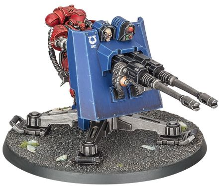

# 1436 炎击伺服炮台 Firestrike Servo-turret

精校状态：中文行文已逐段精校，部分术语仍为暂定

分类：载具 / 地面 / 炮台

原文来源：https://www.bilibili.com/opus/1023297759550111797

原作者：帝国神选罐头

原文时间：2025年01月17日 13:57

[返回分类目录](目录.md) · [全书目录](../../目录.md)

原篇名：炎击伺服炮塔 Firestrike Servo-turret

<!-- A1436-B0001 -->
**英文原文**

Firestrike Servo-turrets are Primaris heavy weapon platform turrets that can be armed with either twin accelerator autocannons or twin las-talons.

<!-- /A1436-B0001 -->

<!-- A1436-B0002 -->

原译文

炎击伺服炮塔是原铸重型武器平台炮塔，可以配备双联加速自动炮或双联激光爪。

**校订译文**

炎击伺服炮台是原铸星际战士使用的重型武器平台，可配备双联加速自动炮或双联激光爪。

<!-- /A1436-B0002 -->

<!-- A1436-B0003 图片 -->

<!-- A1436-B0004 -->

原译文

Ultramarines Firestrike Servo-turret 极限战士炎击伺服炮塔

**校订译文**

Ultramarines Firestrike Servo-turret 极限战士炎击伺服炮台

<!-- /A1436-B0004 -->

<!-- A1436-B0005 -->
**英文原文**

Firestrike Turrets are primarily defensive weapons which lay down withering volleys of fire to secure the flanks of Space Marine bases of operations. They are mounted on gravitic ventral plates, hovering across the battlefield to ideal firing positions.

<!-- /A1436-B0005 -->

<!-- A1436-B0006 -->

原译文

炎击炮塔主要是防御性武器，可以发射猛烈的火力，以保护星际战士作战基地的侧翼。它们安装在重力腹板上，在战场上盘旋到理想的射击位置。

**校订译文**

炎击伺服炮台主要用于防御，以猛烈齐射保护星际战士作战基地的侧翼。炮台底部装有重力悬浮板，能够悬浮移动至理想的射击阵位。

<!-- /A1436-B0006 -->

<!-- A1436-B0007 -->
## Named Turrets 著名炮塔

<!-- /A1436-B0007 -->

<!-- A1436-B0008 -->

原译文

Retributor's Strike 天罚之击

**校订译文**

Retributor's Strike 天罚之击

<!-- /A1436-B0008 -->

本篇核心术语与暂定项

以下列出本篇出现的英文原形及核心术语表用词。同形词可能指不同对象，具体词义以本篇正文和校注为准；单复数、别名和仅见于图注的名称可能尚未列入。完整候选见[术语表](../../术语表/双语术语候选.csv)。

| 英文 | 采用中文 | 状态 |
| --- | --- | --- |
| Space Marine | 星际战士 | 暂定·官方待核 |
| Firestrike Servo-turrets | 炎击伺服炮台 | 官方已核·中英对照 |

