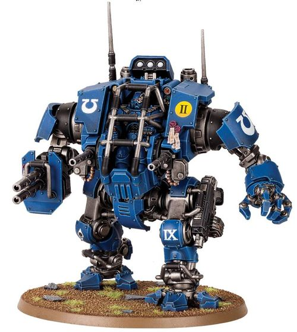

# 1437 不败者战术机甲 Invictor Tactical Warsuit

精校状态：中文行文已逐段精校，部分术语仍为暂定

分类：载具 / 地面 / 步行者

原文来源：https://www.bilibili.com/opus/1039569986208661512

原作者：帝国神选罐头

原文时间：2025年03月02日 10:22

[返回分类目录](目录.md) · [全书目录](../../目录.md)

<!-- A1437-B0001 -->
**英文原文**

The Invictor Tactical Warsuit is a lightly armoured walker that is often found fighting alongside Vanguard Space Marines on recon missions. It is designed with sound-dampening materials, enabling the Warsuit to move at great speed with minimal noise output, in support of the the pilot's Vanguard brethren.

<!-- /A1437-B0001 -->

<!-- A1437-B0002 -->

原译文

不败者战术机甲是一种轻型装甲步行机，经常与先锋星际战士一起执行侦察任务。它采用隔音材料设计，使机甲能够以最小的噪音输出高速移动，以支持先锋兄弟驾驶员。

**校订译文**

不败者战术机甲是一种轻装甲步行载具，常与先锋星际战士一同执行侦察任务。机甲采用消声材料，能够以极低噪声高速移动，支援驾驶员的先锋战斗兄弟。

**校注：** support的是驾驶员的先锋战斗兄弟，不是“支援先锋兄弟驾驶员”。

<!-- /A1437-B0002 -->

<!-- A1437-B0003 图片 -->

<!-- A1437-B0004 -->

原译文

Ultramarines Invictor Tactical Warsuit 极限战士不败者战术机甲

**校订译文**

Ultramarines Invictor Tactical Warsuit 极限战士不败者战术机甲

<!-- /A1437-B0004 -->

<!-- A1437-B0005 -->
## Overview 概述

<!-- /A1437-B0005 -->

<!-- A1437-B0006 -->
**英文原文**

The Invictor is a stripped-back variant of the Redemptor Dreadnought frame. Instead of an injured hero of the Chapter, the warsuit is piloted by a live Primaris Space Marine whose controls are directly plugged into his Power Armour. The pilots are chosen from those warriors who display an aptitude for swift and independent thought and a protective stance towards their battle-brothers. These qualities are essential, for while an Invictor pilot has no additional authority, they are permitted a great deal of tactical autonomy. Most Invictor pilots seek to support and defend their comrades against particularly large and deadly threats, spearhead assaults against heavily defended positions, or form a bulwark against enemy forces. In practice, however, Invictor suits are deployed in every capacity, from armored escort duties to close-range siege-breaking and urban monster-hunts.

<!-- /A1437-B0006 -->

<!-- A1437-B0007 -->

原译文

不败者是救赎者无畏框架的精简变体。机甲不是由战团受伤的英雄驾驶，而是由一名活着的原铸星际战士驾驶，它的控制装置直接插入驾驶员的动力盔甲。驾驶员是从那些表现出快速独立思考能力和对战斗兄弟保护态度的战士中挑选出来的。这些品质是必不可少的，因为虽然不败者驾驶员没有额外的权力，但他们被允许有很大的战术自主权。大多数不败者驾驶员寻求支援和保护他们的战友免受特别大和致命的威胁，带头攻击防御严密的阵地，或形成抵御敌军的堡垒。然而，在实践中，不败者机甲被部署在各种情况中，从装甲护送任务到近距离攻城和城市怪物狩猎。

**校订译文**

不败者以救赎者无畏机甲的框架为基础简化而成。它不以收容战团重伤英雄的石棺为核心，而由一名原铸星际战士直接驾驶，操纵系统接入其动力盔甲。驾驶员从思维敏捷、善于独立判断，并重视保护战友的战士中选拔。这些素质至关重要：不败者驾驶员虽然没有额外指挥权，却享有很大的战术自主权。他们通常致力于保护战友免受庞大而致命的威胁，率先冲击防御坚固的阵地，或成为阻挡敌军的屏障。实际运用中，不败者承担的任务十分广泛，从装甲护送、近距离破围攻坚，到城市中的巨兽猎杀皆可胜任。

<!-- /A1437-B0007 -->

<!-- A1437-B0008 -->
**英文原文**

The most iconic role for these walkers is supporting Vanguard Space Marine forces. Their reactors and servos are rigged to run with minimum sound, and their weapon loadouts allows for them to unleash firepower from either twin ironhail Autocannons or a compact Incendium Cannon. While they remain at range, each Invictor's servo-fist can use a modified Heavy Bolter that acts as an oversized sidearm. As the foe draws close, the pilot mag-locks the weapon to the machine's hip so that it may use its claw for melee battle. This combination of mid-to-close-range firepower, armored resilience, and selfless mindset proves do provide exceptional support to Vanguard forces.

<!-- /A1437-B0008 -->

<!-- A1437-B0009 -->

原译文

这些步行机最具代表性的角色是支援先锋星际战士。他们的反应堆和伺服系统被设计成以最小的声音运行，他们的武器装载使他们能够从双联铁雹自动炮或紧凑型燃烧炮中释放火力。当它们在射程内时，每个不败者的伺服拳都可以使用经过修改的重型爆矢枪，作为超大的手枪。当敌人靠近时，驾驶员将武器锁定在机甲的臀部，这样它就可以用爪子进行近战。事实证明，这种中近程火力、装甲韧性和无私心态的结合确实为先锋部队提供了卓越的支援。

**校订译文**

这类步行机甲最具代表性的任务，是支援先锋星际战士。其反应堆和伺服机构经过专门调校，运行噪声极低；双联铁雹自动炮或紧凑的燃烧炮则提供强大火力。与敌人保持距离时，不败者还能用伺服拳握持一支改装重型爆矢枪，如同使用一件超大型随身武器。敌人逼近后，驾驶员会将枪磁力固定在机甲腰侧，腾出利爪投入近战。中近程火力、坚固装甲，加上驾驶员保护战友的信念，使其能为先锋部队提供出色支援。

<!-- /A1437-B0009 -->

本篇核心术语与暂定项

以下列出本篇出现的英文原形及核心术语表用词。同形词可能指不同对象，具体词义以本篇正文和校注为准；单复数、别名和仅见于图注的名称可能尚未列入。完整候选见[术语表](../../术语表/双语术语候选.csv)。

| 英文 | 采用中文 | 状态 |
| --- | --- | --- |
| Space Marines | 星际战士 | 官方已核对 |
| Power Armour | 动力盔甲 | 暂定·官方待核 |
| Space Marine | 星际战士 | 暂定·官方待核 |
| Chapter | 战团 | 暂定·官方待核 |
| Vanguard | 先锋 | 暂定·官方待核 |
| Vanguard Space Marine | 先锋星际战士 | 暂定·官方待核 |
| Primaris Space Marine | 原铸星际战士 | 暂定·官方待核 |
| Redemptor Dreadnought | 救赎者无畏机甲 | 官方已核对 |
| Invictor Tactical Warsuit | 不败者战术机甲 | 官方已核·中英对照 |
| Dreadnought | 无畏机甲 | 暂定·官方待核 |
| Bulwark | 壁垒号 | 暂定·官方待核 |
| The Weapon | 武器 | 暂定·官方待核 |
| claw | 利爪分队 | 暂定·官方待核 |
| Bolter | 爆矢枪 | 暂定·官方待核 |
| Heavy bolter | 重型爆矢枪 | 官方已核对 |
| Incendium Cannon | 燃烧炮 | 暂定·官方待核 |

