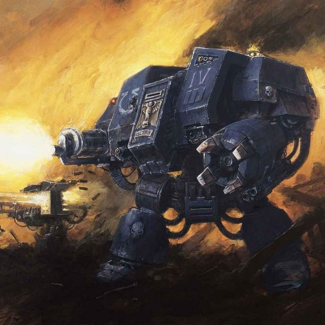
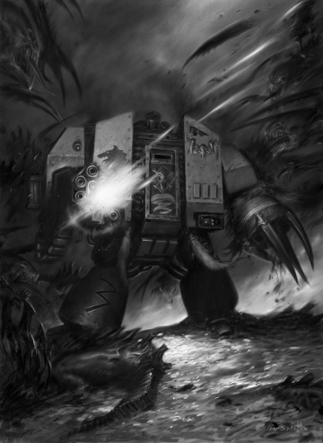
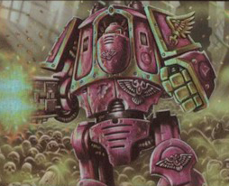
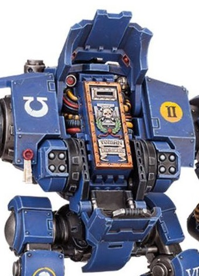
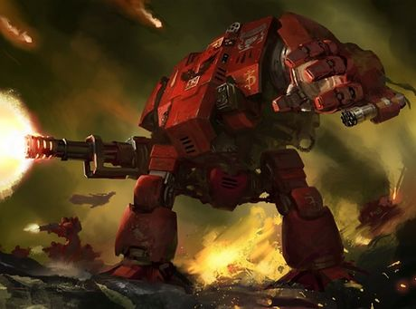

# 1438 无畏机甲 Dreadnought

精校状态：中文行文已逐段精校，部分术语仍为暂定

分类：载具 / 地面 / 步行者

原文来源：https://www.bilibili.com/opus/1037679921390944258

原作者：帝国神选罐头

原文时间：编辑于 2025年08月21日 09:27

[返回分类目录](目录.md) · [全书目录](../../目录.md)

<!-- A1438-B0001 -->
**英文原文**

Dreadnoughts are massive war-machines piloted by an honoured Space Marine hero whose body has been ravaged in battle. Dreadnoughts are also known as the Old Ones in the Space Marines Chapters.

<!-- /A1438-B0001 -->

<!-- A1438-B0002 -->

原译文

无畏机甲是由一位受人尊敬的星际战士英雄驾驶的大型战争机器，他的身体在战斗中被摧毁。无畏在星际战士战团中也被称为长者。

**校订译文**

无畏机甲是巨大的战争机器，由在战斗中遭受重创的星际战士英雄驾驶。星际战士战团也尊称这些英雄为“长者”。

<!-- /A1438-B0002 -->

<!-- A1438-B0003 图片 -->

<!-- A1438-B0004 -->

原译文

Castaferrum Pattern Dreadnought of the Ultramarines 极限战士铸铁型无畏

**校订译文**

Castaferrum Pattern Dreadnought of the Ultramarines 极限战士铸铁型无畏

<!-- /A1438-B0004 -->

<!-- A1438-B0005 -->
## Imperial Dreadnoughts 帝国无畏机甲

<!-- /A1438-B0005 -->

<!-- A1438-B0006 -->
### Space Marines Dreadnoughts 星际战士无畏机甲

<!-- /A1438-B0006 -->

<!-- A1438-B0007 -->
**英文原文**

A Dreadnought is a large, armored walker which carries both powerful guns and lethal close combat weaponry, armoured to withstand all but the most powerful of enemy firepower and often relied on by Space Marine forces to tear an opening in enemy defenses. Each Dreadnought contains a living being, permanently interfaced with the machine through a form of Mind Impulse Unit. Dreadnoughts are surprisingly agile, able to walk and balance with the ease of a living creature. It is said that old proto-Dreadnoughts of the Unification wars could be piloted by non-Adeptus Astartes warriors, but later only Space Marines could be interred in them.

<!-- /A1438-B0007 -->

<!-- A1438-B0008 -->

原译文

无畏是一种大型装甲步行机，携带强大的枪支和致命的近战武器，装甲可以承受除最强大的敌人火力外的所有火力，星际战士经常依靠它来撕裂敌人的防御。每一台无畏机甲都容纳着一个生命体，通过一种形式的思想驱动单元与机器永久连接。无畏出奇地敏捷，能够像生物一样轻松地行走和平衡。据说，统一战争的旧原型无畏可以由非阿斯塔特修会战士驾驶，但后来只有星际战士可以埋葬在里面。

**校订译文**

无畏机甲是配有强力枪炮与致命近战武器的大型装甲步行载具，除最猛烈的敌方火力外，通常都能抵挡。星际战士常依靠它们撕开敌方防线。每台机甲内都有一名活着的驾驶员，通过一种思维驱动单元与机器永久相连。无畏机甲的行动出奇敏捷，能够像活物一样自如行走、维持平衡。据说，统一战争时期的早期原型曾可由非阿斯塔特战士驾驶，后来才只有星际战士能够被安置其中。

<!-- /A1438-B0008 -->

<!-- A1438-B0009 图片 -->

<!-- A1438-B0010 -->

原译文

Dreadnought of the Space Wolves 太空野狼无畏

**校订译文**

Dreadnought of the Space Wolves 太空野狼无畏

<!-- /A1438-B0010 -->

<!-- A1438-B0011 -->
**英文原文**

Dreadnought machines themselves are ancient, the oldest dating back tens of thousands of years to the Age of Strife. Because the art of constructing them has been almost lost, Dreadnoughts are revered as rare machines, though the most revered specialists still dare to construct 'new' Dreadnoughts. Although a Dreadnought can be damaged and disabled, it can survive unless the actual armoured tomb containing the occupant's form is destroyed. Extended neural interface with a vehicle as large and complex as a Dreadnought causes immense mental stress on the occupant, creating conditions such as lethargy, confusion, dyschronometria, and even senility. Thus when not fighting, the Chapter's Techmarines will allow the fallen heroes to sleep away the centuries, sealed in stasis vaults, until once more they are called to battle. Usually Dreadnoughts waked from their slumber only in time of great need or when their advice is needed for some special missions.

<!-- /A1438-B0011 -->

<!-- A1438-B0012 -->

原译文

无畏机甲本身很古老，最古老的机甲可以追溯到数万年前的纷争时代。由于建造它们的技艺几乎已经失传，无畏被尊为稀有，尽管最受尊敬的专家仍然敢于制造“新”的无畏。尽管无畏可能会被损坏和致残，但除非包含乘员的实际装甲坟墓被摧毁，否则它就可以存活。像无畏这样庞大而复杂的载具的扩展神经接口会给乘员带来巨大的精神压力，造成嗜睡、混乱、时间异常甚至衰老等情况。因此，当不战斗时，该战团的技术军士将允许倒下的英雄们在休眠库中沉睡几个世纪，直到他们再次被召唤作战。通常，无畏只有在非常需要的时候，或者在某些特殊任务需要他们的建议时，才会从睡梦中醒来。

**校订译文**

无畏机甲本身极为古老，最早的实例可追溯至数万年前的纷争时代。制造技艺几近失传，使它们成为备受尊崇的稀有机械，只有最负盛名的专家仍敢尝试制造“新”机甲。即使机体受损瘫痪，只要容纳驾驶员的装甲石棺未被摧毁，其中的战士仍能存活。长期通过神经接口连接这种庞大复杂的机器，会造成巨大的精神压力，带来嗜睡、意识混乱、时间感障碍，甚至老年性认知衰退。因此，不在作战时，战团科技战士会将这些重伤英雄封存于静滞舱，让他们沉睡数百年，直至再次奉召出战。通常只有在危急时刻，或特殊任务需要他们的指点时，才会将其唤醒。

**校注：** Extended neural interface指长期维持神经连接，而非扩展接口；dyschronometria为时间感障碍。

<!-- /A1438-B0012 -->

<!-- A1438-B0013 图片 -->

<!-- A1438-B0014 -->

原译文

Pre-Heresy Emperor's Children Contemptor Dreadnought 叛乱前帝皇之子蔑视者无畏

**校订译文**

Pre-Heresy Emperor's Children Contemptor Dreadnought 荷鲁斯之乱前帝皇之子的蔑视者无畏机甲

<!-- /A1438-B0014 -->

<!-- A1438-B0015 -->
### Pilot 驾驶员

<!-- /A1438-B0015 -->

<!-- A1438-B0016 -->
**英文原文**

The pilots within Dreadnoughts are Marines who have suffered mortal wounds in battle, maimed and crippled beyond recovery - instead of being mercifully killed, the greatest heroes are instead given what is considered the honour of continuing to serve the Emperor past their normal life. Once interred within the Dreadnought, the Marine cannot leave the metal womb and is destined for a life of endless battle until destroyed. Some are so ancient their memories may extend back to the founding of their chapter and its earliest history. For this reason they are revered not just as powerful warriors but also as ageless forebears and living embodiments of battles fought long ago. If a dreadnought is destroyed, the Space Marines will fight to retrieve the armoured shell so that the occupant can be returned to the chapter's mausoleum for his long-deserved final rest.

<!-- /A1438-B0016 -->

<!-- A1438-B0017 -->

原译文

无畏的驾驶员是星际战士，他们在战斗中遭受了致命的伤害，致残或残废，无法恢复 - 最伟大的英雄不是被仁慈地杀死，而是被赋予了在正常生活后继续为帝皇服务的荣誉。一旦被埋葬在无畏中，星际战士就无法离开金属坟墓，注定要经历无休止的战斗，直到被摧毁。有些是如此古老，他们的记忆可能可以追溯到他们战团的成立及其最早的历史。因此，他们不仅被尊为强大的战士，而且被尊为永恒先祖和上古战斗化身。如果无畏被摧毁，星际战士将奋力夺回无畏躯体，以便乘员可以返回战团的陵墓，进行他应得的最后休息。

**校订译文**

无畏机甲的驾驶员都是在战斗中身负致命伤、躯体残缺到无法恢复的星际战士。最伟大的英雄不会被施以仁慈的安乐死，而是获赐一种荣誉：超越原本寿命的限制，继续效忠帝皇。一旦安置于机甲内部，战士便无法离开这副金属躯壳，余生注定征战不休，直到毁灭。其中一些极为古老，记忆能追溯至战团建立之初。因此，他们不仅因战力强大而受尊敬，也被视为不老的先辈，以及遥远战役的活见证。若无畏机甲被摧毁，星际战士会奋力夺回装甲残骸，将驾驶员送回战团陵墓，给予他早已应得的最终安息。

<!-- /A1438-B0017 -->

<!-- A1438-B0018 图片 -->

<!-- A1438-B0019 -->

原译文

Redemptor Dreadnought with its Sarcophagus exposed 露出石棺的救赎者无畏

**校订译文**

Redemptor Dreadnought with its Sarcophagus exposed 露出石棺的救赎者无畏机甲

<!-- /A1438-B0019 -->

<!-- A1438-B0020 -->
**英文原文**

All Dreadnoughts contains speakers and the warrior within can communicate with other Space Marines. The synthesized, crackling voice emanates from within the machine, making a conversation with a Dreadnought in eerie experience. Also traditionally every Dreadnought bear a scroll with the inscribed name of the hero on it. When the new warrior is interred as a pilot, Dreadnought will take a new name.

<!-- /A1438-B0020 -->

<!-- A1438-B0021 -->

原译文

所有无畏都包含扬声器，里面的战士可以与其他星际战士交流。合成的噼啪声从机器内部发出，在怪异的体验中与无畏进行对话。传统上，每个无畏都有一个卷轴，上面刻着英雄的名字。当新战士作为驾驶员下葬时，无畏将取一个新名字。

**校订译文**

每台无畏机甲都配有扬声器，内部战士能够与其他星际战士交谈。机器深处传出的合成嗓音夹杂着噼啪杂音，使这种交谈带有诡异的气氛。依照传统，机甲上还悬挂着写有英雄姓名的卷轴；新战士被安置为驾驶员时，机甲也会随之采用新的名字。

**校注：** 原文明确新驾驶员可使机甲改名；因此机体与历任驾驶员不能一概按同一人物合并。

<!-- /A1438-B0021 -->

<!-- A1438-B0022 -->
### Armour and Systems 装甲与系统

<!-- /A1438-B0022 -->

<!-- A1438-B0023 -->
**英文原文**

Dreadnoughts are armoured with ceramite and adamantium, their muscles are formed of electro-fibre bundles and magna-coils. They are usually armed with weapons to suit a particular role, such as destroying other heavy armoured vehicles.

<!-- /A1438-B0023 -->

<!-- A1438-B0024 -->

原译文

无畏的装甲由陶钢和精金制成，其肌肉由电纤维束和磁振线圈组成。他们通常配备武器以适应特定的角色，例如摧毁其他重型装甲车。

**校订译文**

无畏机甲的装甲由陶钢与精金制成，驱动“肌肉”则由电纤维束和麦格纳线圈组成。它们通常按任务配备武器，例如专门用于摧毁重装甲载具。

<!-- /A1438-B0024 -->

<!-- A1438-B0025 -->
### Patterns 型号

<!-- /A1438-B0025 -->

<!-- A1438-B0026 -->

原译文

Castraferrum Dreadnought 铸铁无畏

**校订译文**

Castraferrum Dreadnought 铸铁无畏

<!-- /A1438-B0026 -->

<!-- A1438-B0027 -->

原译文

Venerable Dreadnought 神圣无畏

**校订译文**

Venerable Dreadnought 神圣无畏机甲

<!-- /A1438-B0027 -->

<!-- A1438-B0028 -->

原译文

Siege Dreadnought 攻城无畏

**校订译文**

Siege Dreadnought 攻城无畏

<!-- /A1438-B0028 -->

<!-- A1438-B0029 -->
**英文原文**

Ironclad Dreadnought (reinforced front armour)

<!-- /A1438-B0029 -->

<!-- A1438-B0030 -->

原译文

铁甲无畏（加强前装甲）

**校订译文**

铁甲无畏（加强前装甲）

<!-- /A1438-B0030 -->

<!-- A1438-B0031 -->

原译文

Hellfire Dreadnought 地狱火无畏

**校订译文**

Hellfire Dreadnought 地狱火无畏

<!-- /A1438-B0031 -->

<!-- A1438-B0032 -->

原译文

Chaplain Dreadnought 牧师无畏

**校订译文**

Chaplain Dreadnought 教士无畏机甲

<!-- /A1438-B0032 -->

<!-- A1438-B0033 -->
**英文原文**

Furioso Dreadnought — Blood Angels and successors

<!-- /A1438-B0033 -->

<!-- A1438-B0034 -->

原译文

暴烈无畏 — 圣血天使及其子战团

**校订译文**

暴烈无畏机甲 — 圣血天使及其子战团

<!-- /A1438-B0034 -->

<!-- A1438-B0035 -->
**英文原文**

Death Company Dreadnought — Blood Angels and successors

<!-- /A1438-B0035 -->

<!-- A1438-B0036 -->

原译文

死亡连无畏 — 圣血天使及其子战团

**校订译文**

死亡连队无畏机甲 — 圣血天使及其子战团

<!-- /A1438-B0036 -->

<!-- A1438-B0037 -->
**英文原文**

Librarian Dreadnought — Blood Angels and occasionally the Deathwatch

<!-- /A1438-B0037 -->

<!-- A1438-B0038 -->

原译文

智库无畏 — 圣血天使，偶尔死亡守望

**校订译文**

智库无畏机甲——由圣血天使使用，死亡守望偶尔也会部署。

<!-- /A1438-B0038 -->

<!-- A1438-B0039 -->

原译文

Deathwatch Dreadnoughts 死亡守望无畏

**校订译文**

Deathwatch Dreadnoughts 死亡守望无畏

<!-- /A1438-B0039 -->

<!-- A1438-B0040 -->
**英文原文**

Mortis Dreadnought — Dark Angels and successors

<!-- /A1438-B0040 -->

<!-- A1438-B0041 -->

原译文

莫迪斯无畏 — 黑暗天使及其子战团

**校订译文**

莫提斯无畏机甲——黑暗天使及其子战团使用。

<!-- /A1438-B0041 -->

<!-- A1438-B0042 -->
**英文原文**

Wulfen Dreadnought — Space Wolves

<!-- /A1438-B0042 -->

<!-- A1438-B0043 -->

原译文

狼人无畏 — 太空野狼

**校订译文**

狼人无畏机甲 — 太空野狼

<!-- /A1438-B0043 -->

<!-- A1438-B0044 -->
**英文原文**

Grey Knights Dreadnought, the only dreadnought other than the Librarian Dreadnought which routinely houses a psyker

<!-- /A1438-B0044 -->

<!-- A1438-B0045 -->

原译文

灰骑士无畏，除了智库无畏外唯一的灵能者无畏

**校订译文**

灰骑士无畏机甲——除智库无畏机甲外，唯一常规搭载灵能者驾驶员的无畏机甲。

**校注：** routinely为通常或常规情况，非绝对不存在其他灵能者机甲；补回该限定。

<!-- /A1438-B0045 -->

<!-- A1438-B0046 -->

原译文

Redemptor Dreadnought 救赎者无畏

**校订译文**

Redemptor Dreadnought 救赎者无畏机甲

<!-- /A1438-B0046 -->

<!-- A1438-B0047 图片 -->

<!-- A1438-B0048 -->

原译文

Blood Angels Redemptor Dreadnought 圣血天使救赎者无畏

**校订译文**

Blood Angels Redemptor Dreadnought 圣血天使救赎者无畏机甲

<!-- /A1438-B0048 -->

<!-- A1438-B0049 -->

原译文

Brutalis Dreadnought 蛮兽无畏

**校订译文**

Brutalis Dreadnought 残暴无畏机甲

<!-- /A1438-B0049 -->

<!-- A1438-B0050 -->

原译文

Ballistus Dreadnought 射手无畏

**校订译文**

Ballistus Dreadnought 射手型无畏机甲

<!-- /A1438-B0050 -->

<!-- A1438-B0051 -->

原译文

Contemptor Pattern Dreadnought 蔑视者型无畏

**校订译文**

Contemptor Pattern Dreadnought 蔑视者型无畏机甲

<!-- /A1438-B0051 -->

<!-- A1438-B0052 -->

原译文

Deredeo Dreadnought 德雷都无畏

**校订译文**

Deredeo Dreadnought 德雷都无畏

<!-- /A1438-B0052 -->

<!-- A1438-B0053 -->

原译文

Leviathan Dreadnought 利维坦无畏

**校订译文**

Leviathan Dreadnought 利维坦无畏

<!-- /A1438-B0053 -->

<!-- A1438-B0054 -->

原译文

Furibundus Dreadnought 富里布杜斯无畏

**校订译文**

Furibundus Dreadnought 狂怒无畏机甲

<!-- /A1438-B0054 -->

<!-- A1438-B0055 -->

原译文

Lucifer Pattern 路西法型

**校订译文**

Lucifer Pattern 路西法型

<!-- /A1438-B0055 -->

<!-- A1438-B0056 -->
### Adeptus Custodes Dreadnoughts 禁军无畏

<!-- /A1438-B0056 -->

<!-- A1438-B0057 -->
**英文原文**

The Adeptus Custodes also employ Dreadnought technology:

<!-- /A1438-B0057 -->

<!-- A1438-B0058 -->

原译文

禁军也采用了无畏技术：

**校订译文**

禁军也采用了无畏技术：

<!-- /A1438-B0058 -->

<!-- A1438-B0059 -->

原译文

Contemptor-Galatus Dreadnought 蔑视者-格拉图斯无畏

**校订译文**

Contemptor-Galatus Dreadnought 角斗士型蔑视者无畏机甲

<!-- /A1438-B0059 -->

<!-- A1438-B0060 -->

原译文

Contemptor-Achillus Dreadnought 蔑视者-阿基里斯无畏

**校订译文**

Contemptor-Achillus Dreadnought 阿喀琉斯型蔑视者无畏机甲

<!-- /A1438-B0060 -->

<!-- A1438-B0061 -->

原译文

Venerable Contemptor Dreadnought 神圣蔑视者无畏

**校订译文**

Venerable Contemptor Dreadnought 神圣蔑视者无畏机甲

<!-- /A1438-B0061 -->

<!-- A1438-B0062 -->

原译文

Telemon Heavy Dreadnought 特拉蒙重型无畏

**校订译文**

Telemon Heavy Dreadnought 特拉蒙重型无畏机甲

<!-- /A1438-B0062 -->

<!-- A1438-B0063 -->
### Other Types of Imperium War Walkers 其他类型的帝国战争步行机

<!-- /A1438-B0063 -->

<!-- A1438-B0064 -->

原译文

Imperial Dreadnought 帝国无畏

**校订译文**

Imperial Dreadnought 帝国无畏

<!-- /A1438-B0064 -->

<!-- A1438-B0065 -->

原译文

Invictor Tactical Warsuit 不败者战术机甲

**校订译文**

Invictor Tactical Warsuit 不败者战术机甲

<!-- /A1438-B0065 -->

<!-- A1438-B0066 -->

原译文

Mortifier / Penitent Engine 苦行者/赎罪引擎

**校订译文**

Mortifier / Penitent Engine 苦行者/赎罪引擎

<!-- /A1438-B0066 -->

<!-- A1438-B0067 -->

原译文

Nemesis Dreadknight 天罚恐惧骑士

**校订译文**

Nemesis Dreadknight 涅墨西斯骇骑机甲

<!-- /A1438-B0067 -->

<!-- A1438-B0068 -->

原译文

Paragon Warsuit 楷模战甲

**校订译文**

Paragon Warsuit 楷模战甲

<!-- /A1438-B0068 -->

<!-- A1438-B0069 -->

原译文

Proto-Dreadnought 原型无畏

**校订译文**

Proto-Dreadnought 原型无畏

<!-- /A1438-B0069 -->

<!-- A1438-B0070 -->
## Chaos Dreadnoughts 混沌无畏

<!-- /A1438-B0070 -->

<!-- A1438-B0071 -->
**英文原文**

A Chaos Dreadnought is a Dreadnought in the service of the Chaos Space Marines. Under the influence of Chaos, many Chaos Dreadnoughts have degenerated into insane monsters, known as Helbrutes. However exemplars of ancient Dreadnought patterns still exist, having become dark reflections of their imperial counterparts.

<!-- /A1438-B0071 -->

<!-- A1438-B0072 -->

原译文

混沌无畏是为混沌星际战士服务的无畏。在混沌的影响下，许多混沌无畏已经退化成疯狂的怪物，被称为地狱兽。然而，古代无畏型号的范例仍然存在，已经成为帝国型号的黑暗反映。

**校订译文**

混沌无畏机甲效力于混沌星际战士。在混沌影响下，许多机甲已退化为疯狂的怪物，被称作地狱兽。不过，一些古老型号仍然存在，成为帝国同类装备的黑暗倒影。

<!-- /A1438-B0072 -->

<!-- A1438-B0073 -->
## Other Uses of "Dreadnought" 其他关于“无畏”的使用

<!-- /A1438-B0073 -->

<!-- A1438-B0074 -->
### Ork Dreadnoughts 欧克无畏

<!-- /A1438-B0074 -->

<!-- A1438-B0075 -->
**英文原文**

Orks also have their own version of a Dreadnought, one named the Deff Dreads, and a smaller version called a Killa Kan.

<!-- /A1438-B0075 -->

<!-- A1438-B0076 -->

原译文

欧克也有自己的无畏变体，一个名为死亡机兵，还有一个较小的版本，名为杀戮铁罐。

**校订译文**

欧克蛮人也有自己的无畏机甲，称为死亡无畏机甲；另有体型较小的杀戮机甲。

<!-- /A1438-B0076 -->

<!-- A1438-B0077 -->

原译文

Deff Dread 死亡机兵

**校订译文**

Deff Dread 死亡无畏机甲

<!-- /A1438-B0077 -->

<!-- A1438-B0078 -->

原译文

Killa Kan 杀戮铁罐

**校订译文**

Killa Kan 杀戮机甲

<!-- /A1438-B0078 -->

<!-- A1438-B0079 -->
### Eldar Dreadnoughts 灵族无畏

<!-- /A1438-B0079 -->

<!-- A1438-B0080 -->
**英文原文**

Wraithlords (also known as Iron Knights, Wraith-Giants and Eldar Dreadnoughts) are giant Wraith-constructs made of wraithbone and inhabited by the souls of dead Eldar heroes.

<!-- /A1438-B0080 -->

<!-- A1438-B0081 -->

原译文

幽冥领主（也称为钢铁骑士、幽灵巨人和灵族无畏）是由灵骨制成的巨型幽冥结构体，安置着死去的灵族英雄的灵魂。

**校订译文**

幽冥领主又称钢铁骑士、幽冥巨人或灵族无畏，是以灵骨制成的巨大幽冥构造体，内部寄宿着逝去灵族英雄的灵魂。

<!-- /A1438-B0081 -->

<!-- A1438-B0082 -->

原译文

Wraithlord 幽冥领主

**校订译文**

Wraithlord 幽冥领主

<!-- /A1438-B0082 -->

本篇核心术语与暂定项

以下列出本篇出现的英文原形及核心术语表用词。同形词可能指不同对象，具体词义以本篇正文和校注为准；单复数、别名和仅见于图注的名称可能尚未列入。完整候选见[术语表](../../术语表/双语术语候选.csv)。

| 英文 | 采用中文 | 状态 |
| --- | --- | --- |
| Space Marines | 星际战士 | 官方已核对 |
| Adeptus Astartes | 阿斯塔特修会 | 官方已核对 |
| Blood Angels | 圣血天使 | 官方已核对 |
| Dark Angels | 黑暗天使 | 官方已核对 |
| Deathwatch | 死亡守望 | 官方已核对 |
| Grey Knights | 灰骑士 | 官方已核对 |
| Space Wolves | 太空野狼 | 官方已核对 |
| Adeptus Custodes | 帝皇禁军 | 官方已核对 |
| Chaos Space Marines | 混沌星际战士 | 官方已核对 |
| Eldar | 灵族 | 暂定·语境区分 |
| Orks | 欧克蛮人 | 官方已核对 |
| Psyker | 灵能者 | 官方已核对 |
| Librarian | 智库员 | 官方已核对 |
| Old Ones | 古圣 | 暂定 |
| History | 历史 | 编辑用语已统一 |
| Emperor | 帝皇 | 官方已核对 |
| Age of Strife | 纷争时代 | 暂定·官方待核 |
| Unification Wars | 统一战争 | 暂定·官方待核 |
| Ancient | 旗手 | 官方已核对 |
| Founding | 建军 | 暂定·官方待核 |
| Space Marine | 星际战士 | 暂定·官方待核 |
| Chapter | 战团 | 暂定·官方待核 |
| Exemplars | 模范者 | 暂定·官方待核 |
| Iron Knights | 钢铁骑士 | 暂定·官方待核 |
| Mortal | 凡人 | 暂定·官方待核 |
| Death Company Dreadnought | 死亡连队无畏机甲 | 官方已核 |
| Wulfen | 狼人 | 官方已核对 |
| Wulfen Dreadnought | 狼人无畏机甲 | 官方已核对 |
| Wraithbone | 灵骨 | 暂定·官方待核 |
| Furioso Dreadnought | 暴烈无畏机甲 | 暂定·官方待核 |
| Dreadnought | 无畏机甲 | 暂定·官方待核 |
| Bear | 熊 | 暂定·官方待核 |
| Mind Impulse Unit | 思维驱动单元 | 暂定·官方待核 |
| Mortis Dreadnought | 莫提斯无畏机甲 | 暂定·官方待核 |
| Librarian Dreadnought | 智库无畏机甲 | 暂定·官方待核 |
| Ironclad Dreadnought | 铁甲无畏机甲 | 暂定·官方待核 |
| Grey Knights Dreadnought | 灰骑士无畏机甲 | 暂定·官方待核 |

