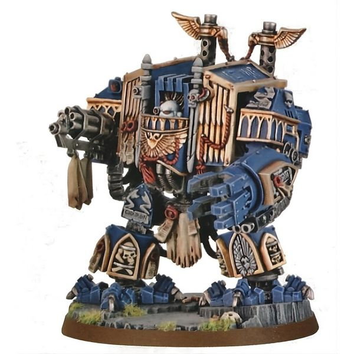
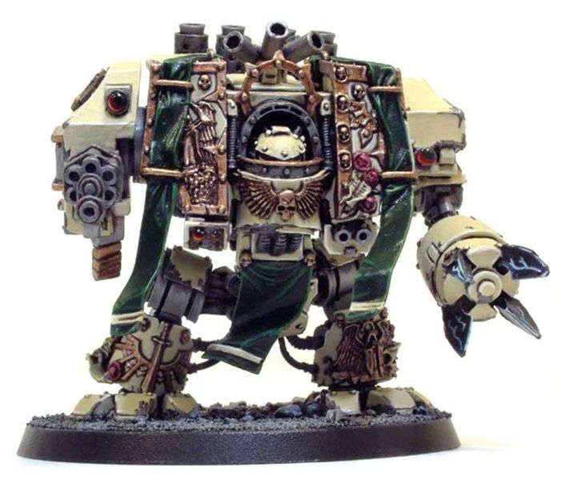
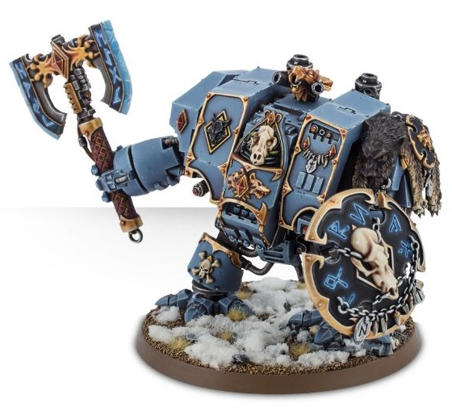
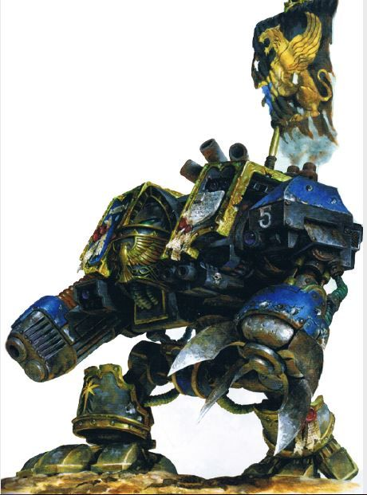

# 1439 神圣无畏机甲 Venerable Dreadnought

精校状态：中文行文已逐段精校，部分术语仍为暂定

分类：载具 / 地面 / 步行者

原文来源：https://www.bilibili.com/opus/1045149655485120513

原作者：帝国神选罐头

原文时间：2025年03月17日 11:14

[返回分类目录](目录.md) · [全书目录](../../目录.md)

原篇名：神圣无畏 Venerable Dreadnought

<!-- A1439-B0001 -->
**英文原文**

Venerable Dreadnoughts are the oldest Space Marine Dreadnoughts still in service.

<!-- /A1439-B0001 -->

<!-- A1439-B0002 -->

原译文

神圣无畏是仍在服役的最古老的星际战士无畏。

**校订译文**

神圣无畏机甲是仍在服役的最古老的星际战士无畏机甲。

<!-- /A1439-B0002 -->

<!-- A1439-B0003 图片 -->

<!-- A1439-B0004 -->

原译文

Ultramarines Venerable Dreadnought 极限战士神圣无畏

**校订译文**

Ultramarines Venerable Dreadnought 极限战士神圣无畏机甲

<!-- /A1439-B0004 -->

<!-- A1439-B0005 -->
## Overview 概述

<!-- /A1439-B0005 -->

<!-- A1439-B0006 -->
**英文原文**

Venerable Dreadnoughts are the sarcophagus of heroes of a Chapter's past, entombed into the Mark VI Castaferrum pattern, believed to be inherently susceptible to the corruption of Chaos, and as such are covered in purity seals and daemonic wards. Like all dreadnoughts, they are kept in stasis chambers prolonging their existence when not in battle, and only awoken for key battles or in direst need.

<!-- /A1439-B0006 -->

<!-- A1439-B0007 -->

原译文

神圣无畏是一个战团过去英雄的石棺，埋葬在MKVI铸铁型无畏中，被认为更容易受到混沌腐化的影响，因此被纯洁印记和反恶魔纹章所覆盖。像所有无畏一样，它们被放置在停滞室中，在不战斗时延续它们的存在，只有在关键战斗或最迫切需要时才会被唤醒。

**校订译文**

神圣无畏机甲将战团往昔英雄的石棺安置在Mark VI铸铁型机体中。原文称，这种机体本身容易受到混沌侵蚀，因此覆盖着纯洁印记与防魔符文。与其他无畏机甲一样，不出战时，它们被保存在静滞舱中以延续生命，只在关键战役或危急时刻才被唤醒。

**校注：** 英文明确称铸铁型易受混沌腐化；此为原文观点，未凭常见印象反改成免疫。Mark VI亦按原文保留。

<!-- /A1439-B0007 -->

<!-- A1439-B0008 图片 -->

<!-- A1439-B0009 -->

原译文

Dark Angels Venerable Dreadnought 黑暗天使神圣无畏

**校订译文**

Dark Angels Venerable Dreadnought 黑暗天使神圣无畏机甲

<!-- /A1439-B0009 -->

<!-- A1439-B0010 -->
**英文原文**

The memories of the ancient heroes who pilot them can extend back to the founding of their Chapter and its earliest history. Thus they are revered by other Space Marines, not just as potent warriors of legend, but also as ageless forebears and living embodiments of battles fought long ago. Venerable Dreadnoughts are keepers of tradition and custodians of knowledge, whose advice is sought by battle-brother and Chapter Master alike, lending wisdom to strategy as they do fury to the battlefield.

<!-- /A1439-B0010 -->

<!-- A1439-B0011 -->

原译文

驾驶它们的古代英雄的记忆可以追溯到他们战团的成立及其最早的历史。因此，他们受到其他星际战士的尊敬，不仅是传说中的强大战士，也是很久以前战斗的不朽先祖和活化身。神圣无畏是传统的守护者和知识的守护者，他们的建议被战斗兄弟和战团长所寻求，就像他们在战场上的愤怒一样，为战略提供智慧。

**校订译文**

驾驶这些机甲的古老英雄，记忆可追溯至战团创立及早期历史。因此，其他星际战士尊敬他们，不仅因为他们是强大的传奇战士，也因为他们是不老的先辈、远古战役的活见证。神圣无畏机甲守护着传统与知识，从普通战斗兄弟到战团长都会向他们请教。他们既为战场带来怒火，也为战略贡献智慧。

<!-- /A1439-B0011 -->

<!-- A1439-B0012 图片 -->

<!-- A1439-B0013 -->

原译文

Space Wolves Venerable Dreadnought 太空野狼神圣无畏

**校订译文**

Space Wolves Venerable Dreadnought 太空野狼神圣无畏机甲

<!-- /A1439-B0013 -->

<!-- A1439-B0014 -->
**英文原文**

Having fought in thousands of battles over millenias, they have gained vast knowledge of warfare and are experienced in almost any situation. Having become nearly impervious to harm and and combined with their knowledge of warfare and the galaxy, these Dreadnoughts have become very difficult to destroy. Ultimately, it requires the utter destruction of their sarcophagus to stop them.

<!-- /A1439-B0014 -->

<!-- A1439-B0015 -->

原译文

经过数千年的战斗，他们获得了丰富的战争知识，几乎在任何情况下都有经验。这些无畏几乎不受伤害，再加上他们对战争和银河系的了解，变得非常难以摧毁。最终，需要彻底摧毁他们的石棺才能阻止他们。

**校订译文**

他们在数千年间参加过成千上万场战斗，积累了丰富的战争知识，几乎经历过任何可能的战况。近乎刀枪不入的躯体，加上对战争与银河的深刻了解，使他们极难被摧毁。唯有彻底毁掉石棺，才能让他们停下。

<!-- /A1439-B0015 -->

<!-- A1439-B0016 -->
**英文原文**

Space Marine Chaplains who are entombed in dreadnoughts are known as Chaplain Dreadnoughts.

<!-- /A1439-B0016 -->

<!-- A1439-B0017 -->

原译文

埋在无畏中的星际战士牧师被称为牧师无畏。

**校订译文**

被安置于无畏机甲中的星际战士教士，称为教士无畏机甲。

<!-- /A1439-B0017 -->

<!-- A1439-B0018 -->
## Notable Venerable Dreadnoughts 著名神圣无畏机甲

原题：Notable Venerable Dreadnoughts 著名神圣无畏

<!-- /A1439-B0018 -->

<!-- A1439-B0019 -->
**英文原文**

Aeton Macramus of the Deathwatch

<!-- /A1439-B0019 -->

<!-- A1439-B0020 -->

原译文

死亡守望的艾顿·麦克雷莫斯

**校订译文**

死亡守望的艾顿·麦克雷莫斯

<!-- /A1439-B0020 -->

<!-- A1439-B0021 -->
**英文原文**

Alenso of the Silver Skulls

<!-- /A1439-B0021 -->

<!-- A1439-B0022 -->

原译文

银色颅骨的阿连索

**校订译文**

银色颅骨的阿伦索。

<!-- /A1439-B0022 -->

<!-- A1439-B0023 -->
**英文原文**

Agrippan of the Ultramarines

<!-- /A1439-B0023 -->

<!-- A1439-B0024 -->

原译文

极限战士的阿格里潘

**校订译文**

极限战士的阿格里潘

<!-- /A1439-B0024 -->

<!-- A1439-B0025 -->
**英文原文**

Altarion of the Ultramarines

<!-- /A1439-B0025 -->

<!-- A1439-B0026 -->

原译文

极限战士的奥塔里安

**校订译文**

极限战士的奥塔里安

<!-- /A1439-B0026 -->

<!-- A1439-B0027 -->
**英文原文**

Bannus of the Iron Hands, leader of Clan Kaargul

<!-- /A1439-B0027 -->

<!-- A1439-B0028 -->

原译文

钢铁之手的班努斯，卡拉古氏族的领袖

**校订译文**

钢铁之手的班努斯，卡尔古氏族领袖。

<!-- /A1439-B0028 -->

<!-- A1439-B0029 -->
**英文原文**

Bjorn the Fell-Handed of the Space Wolves, the oldest Dreadnought in the Imperium;

<!-- /A1439-B0029 -->

<!-- A1439-B0030 -->

原译文

太空野狼的断手比约恩，帝国最古老的无畏

**校订译文**

太空野狼的断手比约恩，帝国最古老的无畏机甲。

<!-- /A1439-B0030 -->

<!-- A1439-B0031 -->
**英文原文**

Damos of the Angels Porphyr

<!-- /A1439-B0031 -->

<!-- A1439-B0032 -->

原译文

紫红天使的达莫斯

**校订译文**

斑岩天使的达莫斯。

<!-- /A1439-B0032 -->

<!-- A1439-B0033 -->
**英文原文**

Eyranthos of the Imperial Fists

<!-- /A1439-B0033 -->

<!-- A1439-B0034 -->

原译文

帝国之拳的埃兰索斯

**校订译文**

帝国之拳的埃兰索斯

<!-- /A1439-B0034 -->

<!-- A1439-B0035 -->
**英文原文**

Furnous of the Iron Hands

<!-- /A1439-B0035 -->

<!-- A1439-B0036 -->

原译文

钢铁之手的弗努斯

**校订译文**

钢铁之手的弗努斯

<!-- /A1439-B0036 -->

<!-- A1439-B0037 -->
**英文原文**

Kleitor of the Astral Claws

<!-- /A1439-B0037 -->

<!-- A1439-B0038 -->

原译文

星辰之爪的克莱托

**校订译文**

星辰之爪的克莱托

<!-- /A1439-B0038 -->

<!-- A1439-B0039 图片 -->

<!-- A1439-B0040 -->

原译文

Ancient Kleitor 旗手克莱托

**校订译文**

Ancient Kleitor 古老者克莱托

**校注：** Ancient在此为无畏机甲资历尊称，不是承担战旗职务的旗手。

<!-- /A1439-B0040 -->

<!-- A1439-B0041 -->
**英文原文**

Moriar the Chosen of the Blood Angels (also a Furioso Dreadnought)

<!-- /A1439-B0041 -->

<!-- A1439-B0042 -->

原译文

圣血天使的受选者莫里亚尔

**校订译文**

圣血天使的受选者莫里亚（同时也是暴烈无畏机甲）。

**校注：** Moriar沿已定Morleo Moriar莫尔莱奥·莫里亚；补回原译漏掉的暴烈型号。

<!-- /A1439-B0042 -->

<!-- A1439-B0043 -->
**英文原文**

Selatonus of the Ultramarines

<!-- /A1439-B0043 -->

<!-- A1439-B0044 -->

原译文

极限战士的塞拉托努斯

**校订译文**

极限战士的塞拉托努斯

<!-- /A1439-B0044 -->

<!-- A1439-B0045 -->
**英文原文**

Sybra of the Exorcists

<!-- /A1439-B0045 -->

<!-- A1439-B0046 -->

原译文

驱魔者的西布拉

**校订译文**

驱魔者的西布拉

<!-- /A1439-B0046 -->

<!-- A1439-B0047 -->
**英文原文**

Thrane Sagaborn - Space Wolves

<!-- /A1439-B0047 -->

<!-- A1439-B0048 -->

原译文

太空野狼的斯兰·萨加博恩

**校订译文**

太空野狼的斯兰·萨加博恩

<!-- /A1439-B0048 -->

<!-- A1439-B0049 -->
**英文原文**

Vordyn Kasz - Raven Guard

<!-- /A1439-B0049 -->

<!-- A1439-B0050 -->

原译文

暗鸦守卫的沃丁·卡斯

**校订译文**

暗鸦守卫的沃丁·卡斯

<!-- /A1439-B0050 -->

<!-- A1439-B0051 -->
**英文原文**

Vos'kyr - Salamanders

<!-- /A1439-B0051 -->

<!-- A1439-B0052 -->

原译文

火蜥蜴的沃斯凯尔

**校订译文**

火蜥蜴的沃斯凯尔

<!-- /A1439-B0052 -->

本篇核心术语与暂定项

以下列出本篇出现的英文原形及核心术语表用词。同形词可能指不同对象，具体词义以本篇正文和校注为准；单复数、别名和仅见于图注的名称可能尚未列入。完整候选见[术语表](../../术语表/双语术语候选.csv)。

| 英文 | 采用中文 | 状态 |
| --- | --- | --- |
| Space Marines | 星际战士 | 官方已核对 |
| Blood Angels | 圣血天使 | 官方已核对 |
| Deathwatch | 死亡守望 | 官方已核对 |
| Space Wolves | 太空野狼 | 官方已核对 |
| Ultramarines | 极限战士 | 官方已核对 |
| Imperium | 帝国 | 暂定·简称 |
| History | 历史 | 编辑用语已统一 |
| Imperial Fists | 帝国之拳 | 暂定 |
| Iron Hands | 钢铁之手 | 暂定·官方待核 |
| Salamanders | 火蜥蜴 | 暂定·官方待核 |
| Master | 导师（审判庭职衔）／舰务官（舰员职务） | 语境定译·官方待核 |
| Chaplain | 教士 | 官方已核对 |
| Ancient | 旗手 | 官方已核对 |
| Raven Guard | 暗鸦守卫 | 官方已核 |
| Founding | 建军 | 暂定·官方待核 |
| Silver Skulls | 银色颅骨 | 暂定·官方待核 |
| Space Marine | 星际战士 | 暂定·官方待核 |
| Chapter | 战团 | 暂定·官方待核 |
| Chapter Master | 战团长 | 暂定·官方待核 |
| Brother | 修士 | 暂定·官方待核 |
| Battle-Brother | 战斗兄弟 | 暂定·官方待核 |
| Bjorn the Fell-Handed | 断手比约恩 | 官方已核 |
| Exorcists | 驱魔者 | 暂定·官方待核 |
| Angels Porphyr | 斑岩天使 | 暂定·官方待核 |
| Furioso Dreadnought | 暴烈无畏机甲 | 暂定·官方待核 |
| Dreadnought | 无畏机甲 | 暂定·官方待核 |
| Venerable Dreadnoughts | 神圣无畏机甲 | 暂定·官方待核 |
| Clan Kaargul | 卡尔古氏族 | 暂定·官方待核 |
| Chaplains | 教士 | 暂定·官方待核 |
| Altarion | 奥塔里安 | 暂定·官方待核 |
| The Blood | 鲜血 | 暂定·官方待核 |
| Astral Claws | 星辰之爪 | 暂定·官方待核 |
| Damos | 达莫斯 | 暂定·官方待核 |
| Corruption | 腐败 | 暂定·官方待核 |
| Aeton Macramus | 艾顿·麦克雷莫斯 | 暂定·官方待核 |
| Agrippan | 阿格里潘 | 暂定·官方待核 |
| Bannus | 班努斯 | 暂定·官方待核 |
| Eyranthos | 埃兰索斯 | 暂定·官方待核 |
| Furnous | 弗努斯 | 暂定·官方待核 |
| Kleitor | 克莱托 | 暂定·官方待核 |
| Moriar the Chosen | 受选者莫里亚 | 暂定·官方待核 |
| Selatonus | 塞拉托努斯 | 暂定·官方待核 |
| Sybra | 西布拉 | 暂定·官方待核 |
| Thrane Sagaborn | 斯兰·萨加博恩 | 暂定·官方待核 |
| Vordyn Kasz | 沃丁·卡斯 | 暂定·官方待核 |
| Vos'kyr | 沃斯凯尔 | 暂定·官方待核 |

