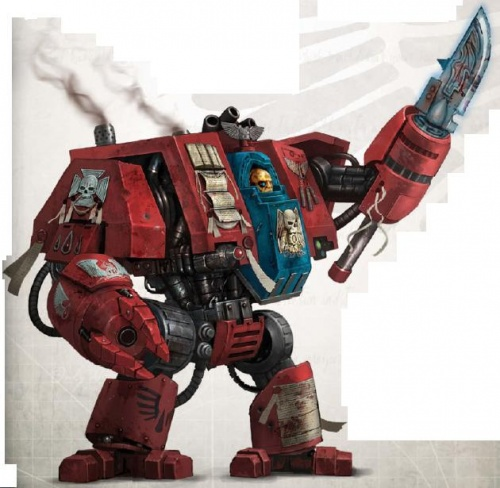
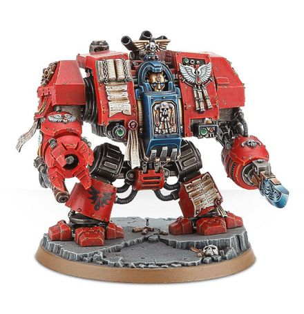

# 1440 智库无畏机甲 Librarian Dreadnought

精校状态：中文行文已逐段精校，部分术语仍为暂定

分类：载具 / 地面 / 步行者

原文来源：https://www.bilibili.com/opus/1038072876552421398

原作者：帝国神选罐头

原文时间：2025年02月26日 09:32

[返回分类目录](目录.md) · [全书目录](../../目录.md)

原篇名：智库无畏 Librarian Dreadnought

<!-- A1440-B0001 -->
**英文原文**

The Librarian Dreadnought is a variant of the Furioso Dreadnought design utilized by the Blood Angels.

<!-- /A1440-B0001 -->

<!-- A1440-B0002 -->

原译文

智库无畏是圣血天使使用的暴烈无畏设计的变体。

**校订译文**

智库无畏机甲是圣血天使采用的暴烈无畏机甲的一个改型。

<!-- /A1440-B0002 -->

<!-- A1440-B0003 图片 -->

<!-- A1440-B0004 -->

原译文

Librarian Dreadnought 智库无畏

**校订译文**

Librarian Dreadnought 智库无畏

<!-- /A1440-B0004 -->

<!-- A1440-B0005 -->
## Overview 概述

<!-- /A1440-B0005 -->

<!-- A1440-B0006 -->
**英文原文**

Piloted by crippled and wounded Librarians from the Chapter, Librarian Dreadnoughts are perhaps the most lethal of their kind. They combine the psychic might of a Librarian with the unyielding body and heavy firepower of a Dreadnought.

<!-- /A1440-B0006 -->

<!-- A1440-B0007 -->

原译文

由战团残疾和受伤的智库驾驶，智库无畏可能是同类中最致命的。他们将智库的灵能力量与无畏的顽强身体和强大火力相结合。

**校订译文**

它由战团中负伤致残的智库驾驶，或许是同类机甲中最致命的型号，将智库的灵能力量与无畏机甲坚韧的身躯、强大的火力合为一体。

<!-- /A1440-B0007 -->

<!-- A1440-B0008 -->
**英文原文**

The Deathwatch has become one of the rare non-Blood Angels Successor Chapter to utilize the Librarian Dreadnought. A few Deathwatch Librarians wounded in battle have been known to not be returned to their home chapter, instead choosing a Librarian Dreadnought configuration.

<!-- /A1440-B0008 -->

<!-- A1440-B0009 -->

原译文

死亡守望已成为少有的使用智库无畏的非圣血天使子战团之一。据了解，一些在战斗中受伤的死亡守望智库不会返回他们的起源战团，而是选择了智库无畏配置。

**校订译文**

死亡守望是少数不属于圣血天使血脉、却使用智库无畏机甲的战团之一。少数在战斗中负伤的死亡守望智库，没有返回原属战团，而是选择被安置在智库无畏机甲中继续服役。

<!-- /A1440-B0009 -->

<!-- A1440-B0010 图片 -->

<!-- A1440-B0011 -->

原译文

Librarian Dreadnought 智库无畏

**校订译文**

Librarian Dreadnought 智库无畏

<!-- /A1440-B0011 -->

<!-- A1440-B0012 -->
### Armament 军备

<!-- /A1440-B0012 -->

<!-- A1440-B0013 -->
**英文原文**

The Librarian Dreadnought is equipped with two Fists, one armed with a built-in Storm Bolter and the other equipped with a Dreadnought Force Weapon.

<!-- /A1440-B0013 -->

<!-- A1440-B0014 -->

原译文

智库无畏配备了双拳，一把装有内置的风暴爆矢枪，另一把装有无畏灵能武器。

**校订译文**

智库无畏机甲配有双拳，其中一只内置风暴爆矢枪，另一只配备无畏灵能武器。

<!-- /A1440-B0014 -->

<!-- A1440-B0015 -->
## Known Librarian Dreadnoughts 著名智库无畏

<!-- /A1440-B0015 -->

<!-- A1440-B0016 -->

原译文

Galen 加兰

**校订译文**

Galen 加兰

<!-- /A1440-B0016 -->

<!-- A1440-B0017 -->

原译文

Marest 马雷斯特

**校订译文**

Marest 马雷斯特

<!-- /A1440-B0017 -->

本篇核心术语与暂定项

以下列出本篇出现的英文原形及核心术语表用词。同形词可能指不同对象，具体词义以本篇正文和校注为准；单复数、别名和仅见于图注的名称可能尚未列入。完整候选见[术语表](../../术语表/双语术语候选.csv)。

| 英文 | 采用中文 | 状态 |
| --- | --- | --- |
| Blood Angels | 圣血天使 | 官方已核对 |
| Deathwatch | 死亡守望 | 官方已核对 |
| Librarian | 智库员 | 官方已核对 |
| Chapter | 战团 | 暂定·官方待核 |
| Furioso Dreadnought | 暴烈无畏机甲 | 暂定·官方待核 |
| Dreadnought | 无畏机甲 | 暂定·官方待核 |
| The Blood | 鲜血 | 暂定·官方待核 |
| Force weapon | 灵能武器 | 暂定·官方待核 |
| Bolter | 爆矢枪 | 暂定·官方待核 |
| Storm bolter | 风暴爆矢枪 | 官方已核对 |
| Librarian Dreadnought | 智库无畏机甲 | 暂定·官方待核 |

