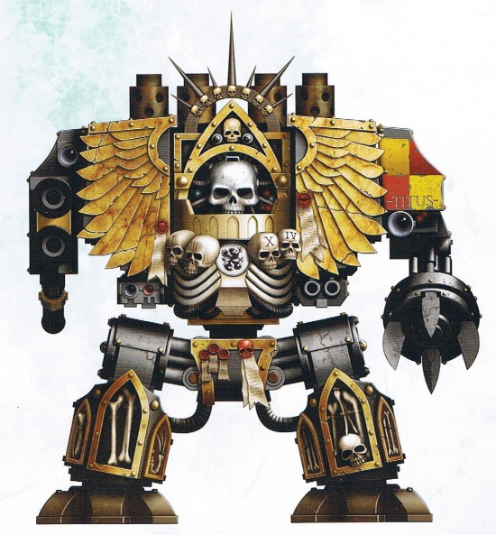

# 1441 教士无畏机甲 Chaplain Dreadnought

精校状态：中文行文已逐段精校，部分术语仍为暂定

分类：载具 / 地面 / 步行者

原文来源：https://www.bilibili.com/opus/1037679998698258457

原作者：帝国神选罐头

原文时间：2025年02月25日 08:08

[返回分类目录](目录.md) · [全书目录](../../目录.md)

原篇名：牧师无畏 Chaplain Dreadnought

<!-- A1441-B0001 -->
**英文原文**

Chaplain Dreadnoughts are variant Venerable Dreadnoughts which house the remains of Chaplains which have been crippled in battle.

<!-- /A1441-B0001 -->

<!-- A1441-B0002 -->

原译文

牧师无畏是神圣无畏的变体，里面存放着在战斗中致残的牧师残躯。

**校订译文**

教士无畏机甲是神圣无畏机甲的一个变体，用来安置在战斗中伤残的教士。

<!-- /A1441-B0002 -->

<!-- A1441-B0003 -->
## Overview 概述

<!-- /A1441-B0003 -->

<!-- A1441-B0004 -->
**英文原文**

Chaplain Dreadnoughts offer their battle brothers unparalleled spiritual leadership, and a Chaplain afforded the honour of transforming into a Dreadnought becomes a highly respected living shrine to the glory of the chapter. Chaplain Dreadnoughts demonstrate a ferocious hatred for the enemies of the Imperium that is devastating when combined with the powerful weapons a Dreadnought suit offers its occupant.

<!-- /A1441-B0004 -->

<!-- A1441-B0005 -->

原译文

牧师无畏为他们的战斗兄弟提供了无与伦比的精神领导力，一位牧师获得了转化为牧师无畏的荣誉，成为了该战团荣耀的备受尊敬的活神龛。牧师无畏表现出对帝国之敌的凶猛仇恨，当与无无畏机甲为其乘员提供的强大武器相结合时，这种仇恨是毁灭性的。

**校订译文**

教士无畏机甲为战斗兄弟提供无可比拟的精神指引。获此殊荣、被安置于无畏机甲中的教士，会成为备受尊崇的活圣坛，彰显战团的荣耀。他们对帝国之敌怀有炽烈仇恨；当这种仇恨与机甲的强大武器结合，便能造成毁灭性的打击。

<!-- /A1441-B0005 -->

<!-- A1441-B0006 图片 -->

<!-- A1441-B0007 -->

原译文

Chaplain Dreadnought 牧师无畏

**校订译文**

Chaplain Dreadnought 教士无畏机甲

<!-- /A1441-B0007 -->

<!-- A1441-B0008 -->
**英文原文**

Chaplain Dreadnoughts are equipped with weaponry similar to the standard pattern, with options for twin Heavy Bolters, twin Lascannons, or a Plasma Cannon on one arm and a Dreadnought Close Combat Weapon with built-in Storm Bolter on the other.

<!-- /A1441-B0008 -->

<!-- A1441-B0009 -->

原译文

牧师无畏配备了类似于标准型号的武器，一只手臂上有双联重型爆矢枪、双联激光炮或等离子炮，另一只手臂有内置风暴爆矢枪的无畏近战武器。

**校订译文**

教士无畏机甲的武器配置与标准型号相近：一侧手臂可选双联重型爆矢枪、双联激光炮或等离子炮，另一侧则安装内置风暴爆矢枪的无畏近战武器。

<!-- /A1441-B0009 -->

<!-- A1441-B0010 -->
## Notable Chaplain Dreadnoughts 著名教士无畏机甲

原题：Notable Chaplain Dreadnoughts 著名牧师无畏

<!-- /A1441-B0010 -->

<!-- A1441-B0011 -->
**英文原文**

Armand Titus — Howling Griffons

<!-- /A1441-B0011 -->

<!-- A1441-B0012 -->

原译文

阿曼德·泰图斯 — 咆哮狮鹫

**校订译文**

阿曼德·泰图斯 — 咆哮狮鹫

<!-- /A1441-B0012 -->

<!-- A1441-B0013 -->
**英文原文**

Bachorath — Black Templars/Imperial Fists

<!-- /A1441-B0013 -->

<!-- A1441-B0014 -->

原译文

巴彻拉斯 — 黑色圣堂/帝国之拳

**校订译文**

巴彻拉斯 — 黑色圣堂/帝国之拳

<!-- /A1441-B0014 -->

<!-- A1441-B0015 -->
**英文原文**

Nalr — Red Scorpions

<!-- /A1441-B0015 -->

<!-- A1441-B0016 -->

原译文

纳尔 — 红蝎

**校订译文**

纳尔 — 红蝎

<!-- /A1441-B0016 -->

<!-- A1441-B0017 -->
**英文原文**

Paderi Tentera — Angels Eradicant. Killed by Khârn the Betrayer.

<!-- /A1441-B0017 -->

<!-- A1441-B0018 -->

原译文

帕德里·坦特拉 — 根除天使，被背叛者卡恩所杀

**校订译文**

帕德里·坦特拉 — 根除天使，被背叛者卡恩所杀

<!-- /A1441-B0018 -->

本篇核心术语与暂定项

以下列出本篇出现的英文原形及核心术语表用词。同形词可能指不同对象，具体词义以本篇正文和校注为准；单复数、别名和仅见于图注的名称可能尚未列入。完整候选见[术语表](../../术语表/双语术语候选.csv)。

| 英文 | 采用中文 | 状态 |
| --- | --- | --- |
| Black Templars | 黑色圣堂 | 官方已核对 |
| Imperium | 帝国 | 暂定·简称 |
| Imperial Fists | 帝国之拳 | 暂定 |
| Chaplain | 教士 | 官方已核对 |
| Khârn | 卡恩 | 暂定·官方待核 |
| Chapter | 战团 | 暂定·官方待核 |
| Red Scorpions | 红蝎 | 暂定·官方待核 |
| Angels Eradicant | 根除天使 | 暂定·官方待核 |
| Howling Griffons | 咆哮狮鹫 | 暂定·官方待核 |
| Khârn the Betrayer | 背叛者卡恩 | 官方已核对 |
| Dreadnought | 无畏机甲 | 暂定·官方待核 |
| Venerable Dreadnoughts | 神圣无畏机甲 | 暂定·官方待核 |
| Chaplains | 教士 | 暂定·官方待核 |
| Bolter | 爆矢枪 | 暂定·官方待核 |
| Storm bolter | 风暴爆矢枪 | 官方已核对 |
| Plasma cannon | 等离子炮 | 官方已核对 |
| Armand Titus | 阿曼德·泰图斯 | 暂定·官方待核 |
| Bachorath | 巴彻拉斯 | 暂定·官方待核 |
| Nalr | 纳尔 | 暂定·官方待核 |
| Paderi Tentera | 帕德里·坦特拉 | 暂定·官方待核 |

