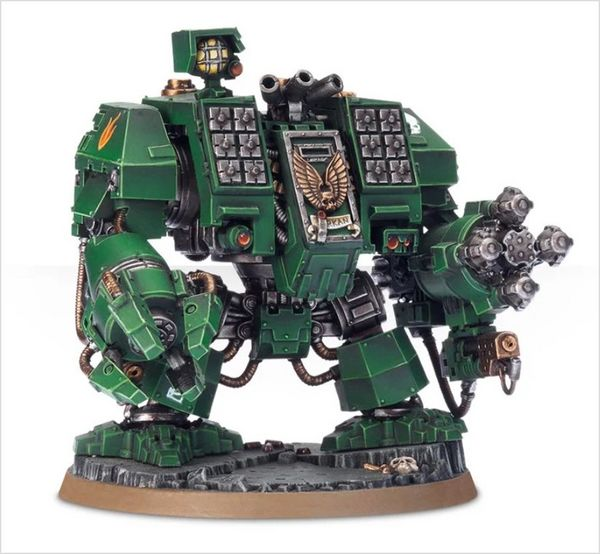
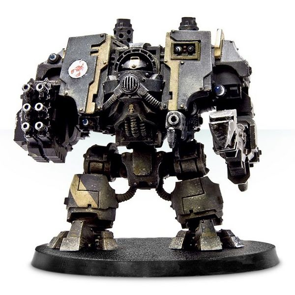

# 1442 铁甲无畏机甲 Ironclad Dreadnought

精校状态：中文行文已逐段精校，部分术语仍为暂定

分类：载具 / 地面 / 步行者

原文来源：https://www.bilibili.com/opus/1038072713317449729

原作者：帝国神选罐头

原文时间：2025年02月26日 09:32

[返回分类目录](目录.md) · [全书目录](../../目录.md)

原篇名：铁甲无畏 Ironclad Dreadnought

<!-- A1442-B0001 -->
**英文原文**

The Ironclad Dreadnought is a variation of the Space Marine Dreadnought designed for close combat.

<!-- /A1442-B0001 -->

<!-- A1442-B0002 -->

原译文

铁甲无畏是星际战士无畏的变体，专为近战而设计。

**校订译文**

铁甲无畏是星际战士无畏的变体，专为近战而设计。

<!-- /A1442-B0002 -->

<!-- A1442-B0003 图片 -->

<!-- A1442-B0004 -->

原译文

MKV Ironclad Dreadnought MKV铁甲无畏

**校订译文**

MKV Ironclad Dreadnought MKV铁甲无畏

<!-- /A1442-B0004 -->

<!-- A1442-B0005 -->
## Overview 概述

<!-- /A1442-B0005 -->

<!-- A1442-B0006 -->
**英文原文**

It is the most heavily armored type of Dreadnought in the Space Marine arsenal, trading long-range weaponry for thicker ceramite plating. They often spearhead assaults against heavily defended positions, their superior armor able to withstand the firepower of a garrisoned fortress. Akin to gigantic battering rams, Ironclad Dreadnoughts drive a wedge through enemy lines and their deployment often means a quick end to any siege.

<!-- /A1442-B0006 -->

<!-- A1442-B0007 -->

原译文

它是星际战士军械库中装甲最重的无畏，用远程武器换取更厚的陶钢板。他们经常带头攻击防御严密的阵地，他们的高级装甲能够抵御驻军堡垒的火力。与巨大的猛击攻城槌类似，铁甲无畏会在敌人的战线上制造楔子，他们的部署通常意味着任何围攻都会迅速结束。

**校订译文**

铁甲无畏是星际战士军械库中装甲最厚重的无畏型号，以牺牲远程武器为代价，换取更厚的陶钢甲片。它常率先冲击坚固阵地，凭借优异防护承受堡垒守军的火力。铁甲无畏如同巨大的攻城锤，楔入敌方战线；它一旦投入战斗，往往就预示着围城战即将迅速结束。

**校注：** “装甲最厚重”是本段来源时期的说法，未据后来型号补写绝对排序。

<!-- /A1442-B0007 -->

<!-- A1442-B0008 图片 -->

<!-- A1442-B0009 -->

原译文

MKIV Ironclad Dreadnought MKIV铁甲无畏

**校订译文**

MKIV Ironclad Dreadnought MKIV铁甲无畏

<!-- /A1442-B0009 -->

<!-- A1442-B0010 -->
## Armament 军备

<!-- /A1442-B0010 -->

<!-- A1442-B0011 -->
**英文原文**

The ironclad dreadnought may be armed with the following:

<!-- /A1442-B0011 -->

<!-- A1442-B0012 -->

原译文

铁甲无畏可能配备以下装备：

**校订译文**

铁甲无畏可能配备以下装备：

<!-- /A1442-B0012 -->

<!-- A1442-B0013 -->

原译文

Dreadnought Close Combat Weapon 无畏近战武器

**校订译文**

Dreadnought Close Combat Weapon 无畏近战武器

<!-- /A1442-B0013 -->

<!-- A1442-B0014 -->

原译文

Seismic Hammer 地震锤

**校订译文**

Seismic Hammer 震地锤

<!-- /A1442-B0014 -->

<!-- A1442-B0015 -->

原译文

Hurricane Bolter 飓风爆矢枪

**校订译文**

Hurricane Bolter 飓风爆矢枪

<!-- /A1442-B0015 -->

<!-- A1442-B0016 -->

原译文

Ironclad Chainfist 铁甲链锯拳

**校订译文**

Ironclad Chainfist 铁甲链锯拳

<!-- /A1442-B0016 -->

<!-- A1442-B0017 -->

原译文

Meltagun 热熔枪

**校订译文**

Meltagun 热熔枪

<!-- /A1442-B0017 -->

<!-- A1442-B0018 -->

原译文

Heavy Flamer 重型火焰枪

**校订译文**

Heavy Flamer 重型火焰喷射器

<!-- /A1442-B0018 -->

<!-- A1442-B0019 -->

原译文

Storm Bolter 风暴爆矢枪

**校订译文**

Storm Bolter 风暴爆矢枪

<!-- /A1442-B0019 -->

<!-- A1442-B0020 -->

原译文

Hunter-Killer Missile (up to 2) 猎杀飞弹（最多2个）

**校订译文**

Hunter-Killer Missile (up to 2) 猎杀导弹（最多2枚）

<!-- /A1442-B0020 -->

<!-- A1442-B0021 -->

原译文

Ironclad Assault Launchers 铁甲突击发射器

**校订译文**

Ironclad Assault Launchers 铁甲突击发射器

<!-- /A1442-B0021 -->

本篇核心术语与暂定项

以下列出本篇出现的英文原形及核心术语表用词。同形词可能指不同对象，具体词义以本篇正文和校注为准；单复数、别名和仅见于图注的名称可能尚未列入。完整候选见[术语表](../../术语表/双语术语候选.csv)。

| 英文 | 采用中文 | 状态 |
| --- | --- | --- |
| Space Marine | 星际战士 | 暂定·官方待核 |
| Dreadnought | 无畏机甲 | 暂定·官方待核 |
| Ironclad Dreadnought | 铁甲无畏机甲 | 暂定·官方待核 |

