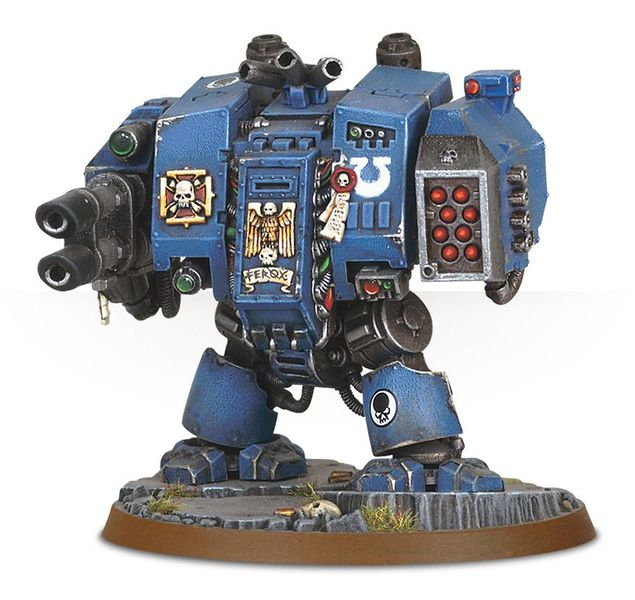

# 1443 地狱火无畏机甲 Hellfire Dreadnought

精校状态：中文行文已逐段精校，部分术语仍为暂定

分类：载具 / 地面 / 步行者

原文来源：https://www.bilibili.com/opus/1038072571588771848

原作者：帝国神选罐头

原文时间：2025年02月26日 09:31

[返回分类目录](目录.md) · [全书目录](../../目录.md)

原篇名：地狱火无畏 Hellfire Dreadnought

<!-- A1443-B0001 -->
**英文原文**

Hellfire Dreadnoughts are a variant of the Space Marine Dreadnought designed for long-range fire support, which come equipped with a Missile Launcher.

<!-- /A1443-B0001 -->

<!-- A1443-B0002 -->

原译文

地狱火无畏是星际战士无畏的一种变体，专为远程火力支援而设计，配备导弹发射器。

**校订译文**

地狱火无畏是星际战士无畏的一种变体，专为远程火力支援而设计，配备导弹发射器。

<!-- /A1443-B0002 -->

<!-- A1443-B0003 图片 -->

<!-- A1443-B0004 -->

原译文

Ultramarines MKV Dreadnought with Missile Launcher 配备导弹发射器的极限战士MKV无畏

**校订译文**

Ultramarines MKV Dreadnought with Missile Launcher 配备导弹发射器的极限战士MKV无畏

<!-- /A1443-B0004 -->

<!-- A1443-B0005 -->
## Notable Hellfire Dreadnoughts 著名地狱火无畏

<!-- /A1443-B0005 -->

<!-- A1443-B0006 -->
**英文原文**

Agies — Ultramarines 2nd Company.

<!-- /A1443-B0006 -->

<!-- A1443-B0007 -->

原译文

阿格尼斯 — 极限战士第二连

**校订译文**

阿格尼斯 — 极限战士第二连

<!-- /A1443-B0007 -->

<!-- A1443-B0008 -->
**英文原文**

Deis — Dark Angels 4th Company.

<!-- /A1443-B0008 -->

<!-- A1443-B0009 -->

原译文

戴斯 — 黑暗天使第四连

**校订译文**

戴斯 — 黑暗天使第四连

<!-- /A1443-B0009 -->

<!-- A1443-B0010 -->
**英文原文**

Fidelis — Grey Knights Dreadnought known as the "Beast of Barac".

<!-- /A1443-B0010 -->

<!-- A1443-B0011 -->

原译文

菲德利斯 — 被称为“巴拉克野兽”的灰骑士无畏

**校订译文**

菲德利斯 — 被称为“巴拉克野兽”的灰骑士无畏

<!-- /A1443-B0011 -->

<!-- A1443-B0012 -->
**英文原文**

Kallas — Dark Hands.

<!-- /A1443-B0012 -->

<!-- A1443-B0013 -->

原译文

卡拉斯 — 黑暗之手

**校订译文**

卡拉斯 — 黑暗之手

<!-- /A1443-B0013 -->

本篇核心术语与暂定项

以下列出本篇出现的英文原形及核心术语表用词。同形词可能指不同对象，具体词义以本篇正文和校注为准；单复数、别名和仅见于图注的名称可能尚未列入。完整候选见[术语表](../../术语表/双语术语候选.csv)。

| 英文 | 采用中文 | 状态 |
| --- | --- | --- |
| Dark Angels | 黑暗天使 | 官方已核对 |
| Grey Knights | 灰骑士 | 官方已核对 |
| Ultramarines | 极限战士 | 官方已核对 |
| Space Marine | 星际战士 | 暂定·官方待核 |
| Dark Hands | 黑暗之手 | 暂定·官方待核 |
| Dreadnought | 无畏机甲 | 暂定·官方待核 |
| Kallas | 卡拉斯 | 暂定·官方待核 |
| Missile Launcher | 导弹发射器 | 暂定·官方待核 |
| Agies | 阿格尼斯 | 暂定·官方待核 |
| Deis | 戴斯 | 暂定·官方待核 |
| Fidelis | 菲德利斯 | 暂定·官方待核 |
| Beast of Barac | 巴拉克野兽 | 暂定·官方待核 |
| Grey Knights Dreadnought | 灰骑士无畏机甲 | 暂定·官方待核 |

