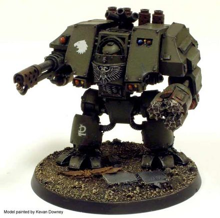

# 1444 攻城无畏机甲 Siege Dreadnought

精校状态：中文行文已逐段精校，部分术语仍为暂定

分类：载具 / 地面 / 步行者

原文来源：https://www.bilibili.com/opus/1038073134261993480

原作者：帝国神选罐头

原文时间：2025年02月26日 09:33

[返回分类目录](目录.md) · [全书目录](../../目录.md)

原篇名：攻城无畏 Siege Dreadnought

<!-- A1444-B0001 -->
**英文原文**

Siege Dreadnoughts are a variant of Space Marine Dreadnought equipped for breaking through fortified enemy positions.

<!-- /A1444-B0001 -->

<!-- A1444-B0002 -->

原译文

攻城无畏是星际战士无畏的一种变体，用于突破敌人的防御阵地。

**校订译文**

攻城无畏机甲是专为突破敌方坚固阵地而配装的星际战士无畏机甲。

<!-- /A1444-B0002 -->

<!-- A1444-B0003 图片 -->

<!-- A1444-B0004 -->

原译文

Siege Dreadnought of the Raptors 猛禽的攻城无畏

**校订译文**

Siege Dreadnought of the Raptors 猛禽的攻城无畏

<!-- /A1444-B0004 -->

<!-- A1444-B0005 -->
## Overview 概述

<!-- /A1444-B0005 -->

<!-- A1444-B0006 -->
**英文原文**

Siege Dreadnoughts are armed with an assault drill with a built-in heavy flamer on one arm and an Inferno Cannon on the other. The assault drill is designed to grind through defensive walls and bunkers. Once the wall is penetrated, the incorporated heavy flamer unleashes a torrent of flame that can engulf an entire bunker and incinerate anything within. The Inferno cannon uses huge amounts of fuel and is uncontrollable in its consumption so the likelihood of running out of fuel mid-battle is greater than on normal flame weapons.

<!-- /A1444-B0006 -->

<!-- A1444-B0007 -->

原译文

攻城无畏装备了突击钻，一只手臂上装有内置的重型火焰枪，另一只手臂装有炼狱炮。突击钻旨在穿透防御墙和掩体。一旦墙壁被穿透，内置的重型火焰枪就会释放出一股火焰，可以吞没整个掩体并焚烧其中的任何东西。炼狱炮使用大量燃料，并且消耗量无法控制，因此在战斗中耗尽燃料的可能性比普通火焰武器更大。

**校订译文**

攻城无畏机甲的一侧手臂装备突击钻，钻具中内置重型火焰喷射器；另一侧手臂则装备炼狱炮。突击钻用于钻穿防御墙与地堡。一旦破开墙体，内置喷火武器便会喷出烈焰，吞没整座地堡，将其中一切焚毁。炼狱炮耗油量巨大，而且难以控制燃料消耗，因此比普通喷火武器更容易在战斗中途耗尽燃料。

<!-- /A1444-B0007 -->

<!-- A1444-B0008 -->
**英文原文**

Due to their specialised equipment, Siege Dreadnoughts only get deployed for street fighting or to break through static defence lines.

<!-- /A1444-B0008 -->

<!-- A1444-B0009 -->

原译文

由于其专业装备，攻城无畏只被部署用于巷战或突破静态防线。

**校订译文**

由于装备高度专门化，攻城无畏机甲只用于巷战或突破固定防线。

<!-- /A1444-B0009 -->

<!-- A1444-B0010 -->
## Notable Siege Dreadnoughts 著名攻城无畏

<!-- /A1444-B0010 -->

<!-- A1444-B0011 -->
**英文原文**

Daeres - Red Scorpions 6th Company, fought in the Siege of Vraks.

<!-- /A1444-B0011 -->

<!-- A1444-B0012 -->

原译文

达瑞斯 - 红蝎第六连，在弗拉克斯攻城战中作战

**校订译文**

达瑞斯 - 红蝎第六连，在弗拉克斯攻城战中作战

<!-- /A1444-B0012 -->

<!-- A1444-B0013 -->
**英文原文**

Herulian - Novamarines.

<!-- /A1444-B0013 -->

<!-- A1444-B0014 -->

原译文

赫鲁利安 - 新星战士

**校订译文**

赫鲁里安——新星战士。

<!-- /A1444-B0014 -->

<!-- A1444-B0015 -->
**英文原文**

Sura'kan Foehammer - Salamanders.

<!-- /A1444-B0015 -->

<!-- A1444-B0016 -->

原译文

萨拉肯·克敌之锤 - 火蜥蜴

**校订译文**

萨拉肯·克敌之锤 - 火蜥蜴

<!-- /A1444-B0016 -->

本篇核心术语与暂定项

以下列出本篇出现的英文原形及核心术语表用词。同形词可能指不同对象，具体词义以本篇正文和校注为准；单复数、别名和仅见于图注的名称可能尚未列入。完整候选见[术语表](../../术语表/双语术语候选.csv)。

| 英文 | 采用中文 | 状态 |
| --- | --- | --- |
| Equipment | 装备 | 编辑用语已统一 |
| Salamanders | 火蜥蜴 | 暂定·官方待核 |
| Space Marine | 星际战士 | 暂定·官方待核 |
| Red Scorpions | 红蝎 | 暂定·官方待核 |
| Novamarines | 新星战士 | 暂定·官方待核 |
| Dreadnought | 无畏机甲 | 暂定·官方待核 |
| Herulian | 赫鲁里安 | 暂定·官方待核 |
| Foehammer | 破敌锤 | 暂定·官方待核 |
| Flame Weapons | 火焰武器 | 暂定·官方待核 |
| Inferno Cannon | 炼狱加农炮 | 暂定·官方待核 |
| Flamer | 火焰喷射器（武器）／火妖（奸奇单位） | 语境定译·对应官译已核 |
| Heavy flamer | 重型火焰喷射器 | 官方已核对 |
| Assault Drill | 突击钻 | 暂定·官方待核 |
| Daeres | 达瑞斯 | 暂定·官方待核 |
| Sura'kan Foehammer | 萨拉肯·克敌之锤 | 暂定·官方待核 |

