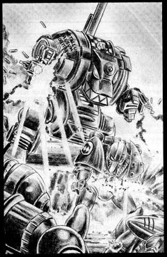

# 1445 狂怒无畏机甲 Furibundus dreadnought

精校状态：中文行文已逐段精校，部分术语仍为暂定

分类：载具 / 地面 / 步行者

原文来源：https://www.bilibili.com/opus/1044403426444705800

原作者：帝国神选罐头

原文时间：2025年03月15日 10:58

[返回分类目录](目录.md) · [全书目录](../../目录.md)

原篇名：狂怒无畏 Furibundus dreadnought

<!-- A1445-B0001 -->
**英文原文**

The Furibundus dreadnought was a type of Imperial Dreadnought.

<!-- /A1445-B0001 -->

<!-- A1445-B0002 -->

原译文

狂怒无畏是一种帝国无畏。

**校订译文**

狂怒无畏机甲是帝国无畏机甲的一种型号。

<!-- /A1445-B0002 -->

<!-- A1445-B0003 图片 -->

<!-- A1445-B0004 -->
**英文原文**

Very little is known about this pattern in the 41st Millennium aside from its name.

<!-- /A1445-B0004 -->

<!-- A1445-B0005 -->

原译文

在第41个千年，除了它的名字之外，人们对这种型号所知甚少。

**校订译文**

在第41个千年，除了它的名字之外，人们对这种型号所知甚少。

<!-- /A1445-B0005 -->

本篇核心术语与暂定项

以下列出本篇出现的英文原形及核心术语表用词。同形词可能指不同对象，具体词义以本篇正文和校注为准；单复数、别名和仅见于图注的名称可能尚未列入。完整候选见[术语表](../../术语表/双语术语候选.csv)。

| 英文 | 采用中文 | 状态 |
| --- | --- | --- |
| Dreadnought | 无畏机甲 | 暂定·官方待核 |
| Furibundus Dreadnought | 狂怒无畏机甲 | 暂定·官方待核 |

