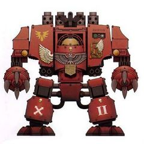
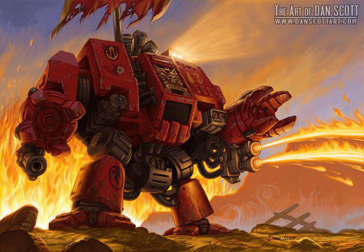
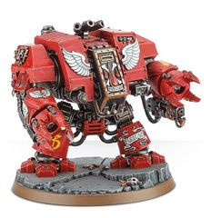

# 1446 暴烈无畏机甲 Furioso Dreadnought

精校状态：中文行文已逐段精校，部分术语仍为暂定

分类：载具 / 地面 / 步行者

原文来源：https://www.bilibili.com/opus/1037680174826520581

原作者：帝国神选罐头

原文时间：2025年02月25日 08:09

[返回分类目录](目录.md) · [全书目录](../../目录.md)

原篇名：暴烈无畏 Furioso Dreadnought

<!-- A1446-B0001 -->
**英文原文**

The Furioso Dreadnought is a Space Marine Dreadnought pattern used by the Blood Angels and their successor Chapters.

<!-- /A1446-B0001 -->

<!-- A1446-B0002 -->

原译文

暴烈无畏是圣血天使及其子战团使用的星际战士无畏型号。

**校订译文**

暴烈无畏机甲由圣血天使及其子战团使用。

<!-- /A1446-B0002 -->

<!-- A1446-B0003 图片 -->

<!-- A1446-B0004 -->

原译文

MKIV Furioso Variant MKIV暴烈变体

**校订译文**

MKIV Furioso Variant MKIV暴烈变体

<!-- /A1446-B0004 -->

<!-- A1446-B0005 -->
## Overview 概述

<!-- /A1446-B0005 -->

<!-- A1446-B0006 -->
**英文原文**

The Blood Angels Master of the Forges conceived this pattern in M35, although others believe that these warriors earned their scars in the Battle of Terra. Reflecting his chapter's preference for close combat, the Furioso pattern enters battle with two Dreadnought Close Combat Weapons (Blood Talons or Blood Fists) and forgoes any heavy weaponry, although one arm may be replaced with a frag cannon as an assault weapon. It also has one built in storm bolter or heavy flamer to deal with large numbers of light infantry as well as a meltagun for anti-armour duty.

<!-- /A1446-B0006 -->

<!-- A1446-B0007 -->

原译文

圣血天使铸造大师在M35中构想了这种型号，尽管其他人认为这些战士在泰拉之战中赢得了伤疤。反映了他所在战团对近战的偏好，暴烈型使用两种无畏近战武器（圣血之爪或圣血动力拳）进入战斗，并放弃了任何重型武器，尽管其中一只手臂可以用破片炮代替作为攻击武器。它还有一个内置的风暴爆矢枪或重型火焰枪，可以对付大量的轻步兵，还有一个用于反装甲任务的热熔枪。

**校订译文**

圣血天使的铸造大师于M35构思出这一型号，不过也有人认为，这些战士早在泰拉之战中便已留下战痕。暴烈型体现了战团偏好近战的传统：通常装备两件无畏近战武器，即圣血之爪或血拳，舍弃重型射击武器；其中一侧手臂也可改装为破片炮，用于突击。它还内置风暴爆矢枪或重型火焰喷射器，以应对大批轻步兵，并配有执行反装甲任务的热熔枪。

**校注：** 原文一方面将型号研发定于M35，一方面转述战士已参加泰拉之战的说法，可能区分机体与驾驶员，也可能出自不同资料；未强行统一年代。

<!-- /A1446-B0007 -->

<!-- A1446-B0008 图片 -->

<!-- A1446-B0009 -->

原译文

Zariah, a Furioso Dreadnought 扎利亚，一名暴烈无畏

**校订译文**

Zariah, a Furioso Dreadnought 扎利亚，一名暴烈无畏机甲

<!-- /A1446-B0009 -->

<!-- A1446-B0010 -->
**英文原文**

Mortally wounded Librarians are sometimes interred in a suit of modified furioso armour and are equipped with a force weapon and close combat weapon. Dreadnoughts inducted into the Death Company are solely comprised of Furioso variants and Librarian Furiosos may also be found in use by the Blood Angels and their successors.

<!-- /A1446-B0010 -->

<!-- A1446-B0011 -->

原译文

受致命伤的智库有时会被埋葬在一套经过改装的暴烈机甲中，并配备了灵能武器和近战武器。加入死亡连的无畏仅由暴烈变体组成，圣血天使及其子战团也可能使用智库暴烈无畏。

**校订译文**

身负致命伤的智库有时会被安置于改装的暴烈型机体中，装备灵能武器与近战武器。此处资料称，编入死亡连的无畏机甲全部属于暴烈型变体；圣血天使及其子战团也使用智库型暴烈无畏机甲。

**校注：** “死亡连无畏全部为暴烈型”与第1447篇后补的残暴型死亡连机甲冲突。保留本段来源时期的描述并明确标注，不删除新资料。

<!-- /A1446-B0011 -->

<!-- A1446-B0012 图片 -->

<!-- A1446-B0013 -->

原译文

Furioso Dreadnought 暴烈无畏

**校订译文**

Furioso Dreadnought 暴烈无畏机甲

<!-- /A1446-B0013 -->

<!-- A1446-B0014 -->
## Variants 变体

<!-- /A1446-B0014 -->

<!-- A1446-B0015 -->

原译文

Librarian Dreadnought 智库无畏

**校订译文**

Librarian Dreadnought 智库无畏

<!-- /A1446-B0015 -->

<!-- A1446-B0016 -->
## Notable Furioso Dreadnoughts 著名暴烈无畏机甲

原题：Notable Furioso Dreadnoughts 著名暴烈无畏

<!-- /A1446-B0016 -->

<!-- A1446-B0017 -->
**英文原文**

Agnolinus of the Blood Angels

<!-- /A1446-B0017 -->

<!-- A1446-B0018 -->

原译文

圣血天使的阿尼奥利努斯

**校订译文**

圣血天使的阿尼奥利努斯

<!-- /A1446-B0018 -->

<!-- A1446-B0019 -->
**英文原文**

Astramael of the Blood Angels

<!-- /A1446-B0019 -->

<!-- A1446-B0020 -->

原译文

圣血天使的阿斯塔麦尔

**校订译文**

圣血天使的阿斯塔麦尔

<!-- /A1446-B0020 -->

<!-- A1446-B0021 -->
**英文原文**

Faustus of the Blood Angels

<!-- /A1446-B0021 -->

<!-- A1446-B0022 -->

原译文

圣血天使的浮士德

**校订译文**

圣血天使的浮士德

<!-- /A1446-B0022 -->

<!-- A1446-B0023 -->
**英文原文**

Moriar the Chosen of the Blood Angels

<!-- /A1446-B0023 -->

<!-- A1446-B0024 -->

原译文

圣血天使的受选者莫里亚尔

**校订译文**

圣血天使的受选者莫里亚。

<!-- /A1446-B0024 -->

<!-- A1446-B0025 -->
**英文原文**

Zariah of the Blood Angels

<!-- /A1446-B0025 -->

<!-- A1446-B0026 -->

原译文

圣血天使的扎利亚

**校订译文**

圣血天使的扎利亚

<!-- /A1446-B0026 -->

<!-- A1446-B0027 -->
**英文原文**

Zorael of the Blood Angels

<!-- /A1446-B0027 -->

<!-- A1446-B0028 -->

原译文

圣血天使的泽拉尔

**校订译文**

圣血天使的泽拉尔

<!-- /A1446-B0028 -->

<!-- A1446-B0029 -->
**英文原文**

Xavion of the Blood Angels

<!-- /A1446-B0029 -->

<!-- A1446-B0030 -->

原译文

圣血天使的泽维恩

**校订译文**

圣血天使的泽维恩

<!-- /A1446-B0030 -->

本篇核心术语与暂定项

以下列出本篇出现的英文原形及核心术语表用词。同形词可能指不同对象，具体词义以本篇正文和校注为准；单复数、别名和仅见于图注的名称可能尚未列入。完整候选见[术语表](../../术语表/双语术语候选.csv)。

| 英文 | 采用中文 | 状态 |
| --- | --- | --- |
| Blood Angels | 圣血天使 | 官方已核对 |
| Librarian | 智库员 | 官方已核对 |
| Terra | 泰拉 | 暂定·官方待核 |
| Master | 导师（审判庭职衔）／舰务官（舰员职务） | 语境定译·官方待核 |
| Scars | 伤疤 | 暂定·官方待核 |
| Space Marine | 星际战士 | 暂定·官方待核 |
| Chapter | 战团 | 暂定·官方待核 |
| Furioso Dreadnought | 暴烈无畏机甲 | 暂定·官方待核 |
| Dreadnought | 无畏机甲 | 暂定·官方待核 |
| The Blood | 鲜血 | 暂定·官方待核 |
| Force weapon | 灵能武器 | 暂定·官方待核 |
| Bolter | 爆矢枪 | 暂定·官方待核 |
| Storm bolter | 风暴爆矢枪 | 官方已核对 |
| Flamer | 火焰喷射器（武器）／火妖（奸奇单位） | 语境定译·对应官译已核 |
| Heavy flamer | 重型火焰喷射器 | 官方已核对 |
| Meltagun | 热熔枪 | 官方已核对 |
| Moriar the Chosen | 受选者莫里亚 | 暂定·官方待核 |
| Agnolinus | 阿尼奥利努斯 | 暂定·官方待核 |
| Astramael | 阿斯塔麦尔 | 暂定·官方待核 |
| Zariah | 扎利亚 | 暂定·官方待核 |
| Xavion | 泽维恩 | 暂定·官方待核 |
| Blood Talons | 圣血之爪 | 暂定·官方待核 |

