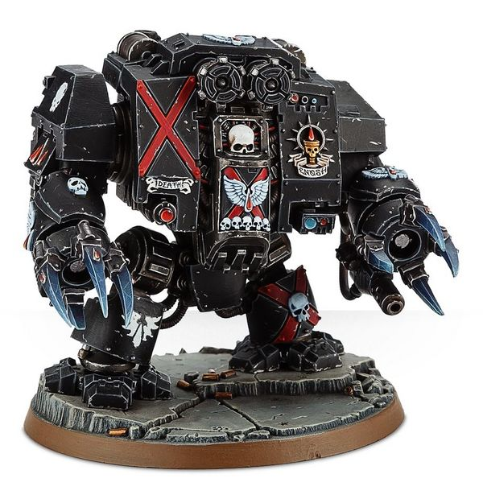
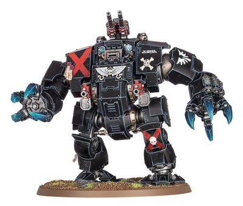

# 1447 死亡连队无畏机甲 Death Company Dreadnought

精校状态：中文行文已逐段精校，部分术语仍为暂定

分类：载具 / 地面 / 步行者

原文来源：https://www.bilibili.com/opus/1037680084608090119

原作者：帝国神选罐头

原文时间：2025年02月25日 08:08

[返回分类目录](目录.md) · [全书目录](../../目录.md)

原篇名：死亡连无畏 Death Company Dreadnought

<!-- A1447-B0001 -->
**英文原文**

The Death Company Dreadnought is a Space Marine Dreadnought pattern used by the Blood Angels and their Successor Chapters.

<!-- /A1447-B0001 -->

<!-- A1447-B0002 -->

原译文

死亡连无畏是圣血天使及其子战团使用的星际战士无畏型号。

**校订译文**

死亡连队无畏机甲是圣血天使及其子战团使用的星际战士无畏机甲。

<!-- /A1447-B0002 -->

<!-- A1447-B0003 -->
## Overview 概述

<!-- /A1447-B0003 -->

<!-- A1447-B0004 -->
**英文原文**

The Blood Angels' fiercest warriors are entombed in a Dreadnought when mortally wounded and their bodies can fight no more. But even the Blood Angel buried deep within the sarcophagus cannot escape the maddening Black Rage that affects all the Sons of Sanguinius. A Dreadnought can wreak havoc on any battlefield and with a Blood Angel who has fallen to the Black Rage they become unstoppable.

<!-- /A1447-B0004 -->

<!-- A1447-B0005 -->

原译文

圣血天使最凶猛的战士在受了致命伤后被埋葬在无畏中，他们的身体无法再战斗。但即使是深埋在石棺里的圣血天使，也无法逃脱影响所有圣吉列斯之子的令人发狂的黑怒。无畏可以在任何战场上造成严重破坏，而一个陷入黑怒的圣血天使，让他们变得势不可挡。

**校订译文**

圣血天使最凶猛的战士身负致命伤、躯体再也无法作战时，会被安置于无畏机甲中。然而，即使藏身石棺深处，也无法逃避困扰圣吉列斯所有子嗣的疯狂黑怒。无畏机甲本就能在战场上造成巨大破坏；若驾驶它的圣血天使陷入黑怒，便更是势不可挡。

<!-- /A1447-B0005 -->

<!-- A1447-B0006 图片 -->

<!-- A1447-B0007 -->

原译文

Death Company Dreadnought 死亡连无畏

**校订译文**

Death Company Dreadnought 死亡连队无畏机甲

<!-- /A1447-B0007 -->

<!-- A1447-B0008 -->
**英文原文**

Even when the battle has been won, the maddened Dreadnought cannot be subdued and will often rampage for days afterwards until a Techmarine is able to shut down the war machine. Only then can the decision be made to either allow the occupant who has succumbed to the Black Rage to continue into the next battle or be replaced with one who has yet to fall into madness.

<!-- /A1447-B0008 -->

<!-- A1447-B0009 -->

原译文

即使赢得了战斗，疯狂的无畏也无法被制服，而且之后经常会横冲直撞数天，直到技术军士能够关闭战争机器。只有到那时，才能做出决定，要么让屈服于黑怒的驾驶者继续进行下一场战斗，要么让一个尚未陷入疯狂的驾驶者取而代之。

**校订译文**

即使战斗已经获胜，疯狂的无畏机甲也难以平息，往往继续肆虐数日，直到科技战士设法关闭机体。此后，战团才能决定：让陷入黑怒的驾驶员继续参加下一场战斗，还是换上一位尚未疯狂的战士。

<!-- /A1447-B0009 -->

<!-- A1447-B0010 -->
## Armament 军备

<!-- /A1447-B0010 -->

<!-- A1447-B0011 -->
**英文原文**

The Death Company Dreadnought is primarily an assault-based melee walker that is armed with two Blood Fists, one equipped with a built-in storm bolter and the other with a built-in meltagun. The Blood Fists can also be upgraded to Blood Talons, that are as deadly as Lightning Claws, while still retaining the storm bolter and meltagun for increased effectiveness.

<!-- /A1447-B0011 -->

<!-- A1447-B0012 -->

原译文

死亡连无畏主要是一种基于近战攻击的步行机，装备有两把圣血动力拳，一把装备有内置的风暴爆矢枪，另一把装备了内置的热熔枪。圣血动力拳也可以升级为圣血之爪，与闪电爪一样致命，同时仍然保留风暴爆矢枪和热熔枪以提高效能。

**校订译文**

死亡连队无畏机甲主要用于近战突击，配备双血拳，一只内置风暴爆矢枪，另一只内置热熔枪。血拳也可升级为与闪电爪同样致命的圣血之爪，同时保留两种射击武器，以增强作战效能。

<!-- /A1447-B0012 -->

<!-- A1447-B0013 图片 -->

<!-- A1447-B0014 -->

原译文

Brutalis Dreadnought of the Death Company 死亡连蛮兽无畏

**校订译文**

Brutalis Dreadnought of the Death Company 死亡连队的残暴无畏机甲

<!-- /A1447-B0014 -->

<!-- A1447-B0015 -->
**英文原文**

Some Death Company Dreadnoughts carry the armaments and makeup of the Brutalis variant.

<!-- /A1447-B0015 -->

<!-- A1447-B0016 -->

原译文

一些死亡连无畏携带蛮兽变体的武器和装备。

**校订译文**

部分死亡连队无畏机甲采用残暴型的机体结构与武器配置。

<!-- /A1447-B0016 -->

<!-- A1447-B0017 -->
## Notable Death Company Dreadnoughts 著名死亡连队无畏机甲

原题：Notable Death Company Dreadnoughts 著名死亡连无畏

<!-- /A1447-B0017 -->

<!-- A1447-B0018 -->

原译文

Moriar the Chosen 受选者莫里亚尔

**校订译文**

Moriar the Chosen 受选者莫里亚

<!-- /A1447-B0018 -->

<!-- A1447-B0019 -->

原译文

Mortis Requiem 死亡安魂曲

**校订译文**

Mortis Requiem 死亡安魂曲

<!-- /A1447-B0019 -->

<!-- A1447-B0020 -->

原译文

Kezellon 凯泽隆

**校订译文**

Kezellon 凯泽隆

<!-- /A1447-B0020 -->

本篇核心术语与暂定项

以下列出本篇出现的英文原形及核心术语表用词。同形词可能指不同对象，具体词义以本篇正文和校注为准；单复数、别名和仅见于图注的名称可能尚未列入。完整候选见[术语表](../../术语表/双语术语候选.csv)。

| 英文 | 采用中文 | 状态 |
| --- | --- | --- |
| Blood Angels | 圣血天使 | 官方已核对 |
| Techmarine | 科技战士 | 官方已核对 |
| Space Marine | 星际战士 | 暂定·官方待核 |
| Sons of Sanguinius | 圣吉列斯之子 | 暂定·官方待核 |
| Death Company Dreadnought | 死亡连队无畏机甲 | 官方已核 |
| Dreadnought | 无畏机甲 | 暂定·官方待核 |
| The Blood | 鲜血 | 暂定·官方待核 |
| Bolter | 爆矢枪 | 暂定·官方待核 |
| Storm bolter | 风暴爆矢枪 | 官方已核对 |
| Meltagun | 热熔枪 | 官方已核对 |
| Blood Talons | 圣血之爪 | 暂定·官方待核 |

