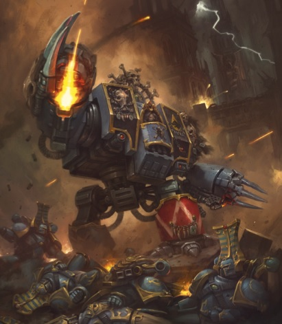
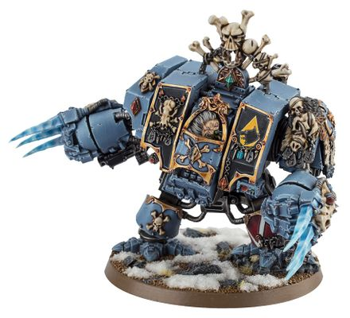

# 1448 狼人无畏机甲 Wulfen Dreadnought

精校状态：中文行文已逐段精校，部分术语仍为暂定

分类：载具 / 地面 / 步行者

原文来源：https://www.bilibili.com/opus/1038438154925768705

原作者：帝国神选罐头

原文时间：2025年02月27日 09:10

[返回分类目录](目录.md) · [全书目录](../../目录.md)

原篇名：狼人无畏 Wulfen Dreadnought

<!-- A1448-B0001 -->
**英文原文**

Wulfen Dreadnoughts are Castraferrum Dreadnoughts in the Space Wolves Chapter that have fallen to the curse of the Wulfen.

<!-- /A1448-B0001 -->

<!-- A1448-B0002 -->

原译文

狼人无畏是太空野狼战团中因狼人诅咒堕落的铸铁无畏。

**校订译文**

狼人无畏机甲是太空野狼战团中受到狼人诅咒影响的铸铁型无畏机甲。

<!-- /A1448-B0002 -->

<!-- A1448-B0003 图片 -->

<!-- A1448-B0004 -->

原译文

Wulfen Dreadnought 狼人无畏

**校订译文**

Wulfen Dreadnought 狼人无畏机甲

<!-- /A1448-B0004 -->

<!-- A1448-B0005 -->
**英文原文**

Wulfen Dreadnoughts are created when the Canis Helix of an entombed Dreadnought mutates unexpectedly, creating a drastic mutation known as the Curse of the Wulfen. Sometimes the process distorts their crippled body as well as their mind, causing Iron Priests to refit the machine to better reflect its new condition. While some Dreadnoughts are mechanical and cold, Wulfen Dreadnoughts howl, twitch and spasm like a crazed animal, as their machine spirits are provoked by the Wulfen's fury. Now consumed with a singular predatory instinct, Wulfen Dreadnoughts seek only to maul and eviscerate their enemies, until the metallic beast is eventually stared down by their Wolf Lord. Because of this, their typical weaponry is replaced with close-range weapons such as Fenrisian axes and Great Wolf Claws. Some Wulfen bear a Blizzard Shield, its powerful forcefields allowing them to weather even more punishment as they plunge into battle.

<!-- /A1448-B0005 -->

<!-- A1448-B0006 -->

原译文

当一艘被埋葬的无畏的狼之螺旋意外突变，产生了一种被称为“狼人诅咒”的剧烈突变时，狼人无畏就诞生了。有时，这个过程会扭曲他们残缺的身体和心灵，导致钢铁牧师重新安装机器，以更好地反映其新状态。虽然有些无畏是机械的、冰冷的，但狼人无畏却像疯狂的动物一样嚎叫、抽搐和痉挛，因为它们的机魂被狼人的愤怒激怒了。现在，狼人无畏被一种独特的掠食本能所吞噬，它们只会攻击和挖出敌人的内脏，直到这头金属巨兽最终被他们的狼主逼视屈服。正因为如此，他们的典型武器被近距离武器所取代，如芬里斯斧和头狼爪。一些狼人无畏拥有暴雪盾，其强大的力场使他们在投入战斗时能够承受更多的攻击。

**校订译文**

无畏机甲内战士的狼之螺旋有时会意外变化，引发被称为“狼人诅咒”的剧烈突变，从而诞生狼人无畏机甲。这一过程有时会同时扭曲战士残缺的躯体与心智，钢铁牧师必须改装机甲，以适应其新状态。有些无畏机甲显得冷漠而机械，狼人无畏机甲却像发狂的野兽般嚎叫、抽搐、痉挛，机魂也被狼人的暴怒激发。它们被单一的捕食本能支配，只想撕碎敌人、剖腹掏肠，直至狼主以目光慑服这头钢铁野兽。因此，其常规武器会被芬里斯战斧、巨狼之爪等近战装备取代。有些还携带暴雪盾，借助强大力场承受更多攻击，猛冲敌阵。

**校注：** 突变发生在机甲内战士的狼之螺旋，不是整台机甲“埋葬”的基因；Great Wolf Claw沿巨狼之爪。

<!-- /A1448-B0006 -->

<!-- A1448-B0007 -->
## Notable Wulfen Dreadnoughts 著名狼人无畏机甲

原题：Notable Wulfen Dreadnoughts 著名狼人无畏

<!-- /A1448-B0007 -->

<!-- A1448-B0008 -->

原译文

Murderfang 弑牙

**校订译文**

Murderfang 杀戮牙

<!-- /A1448-B0008 -->

<!-- A1448-B0009 图片 -->

<!-- A1448-B0010 -->

原译文

Murderfang, a Wulfen Dreadnought 弑牙，一名狼人无畏

**校订译文**

Murderfang, a Wulfen Dreadnought 狼人无畏机甲杀戮牙

<!-- /A1448-B0010 -->

<!-- A1448-B0011 -->

原译文

Magni Morkaisson 马格尼・莫尔凯松

**校订译文**

Magni Morkaisson 马格尼・莫尔凯松

<!-- /A1448-B0011 -->

<!-- A1448-B0012 -->

原译文

Brothers Berzerk 贝塞克兄弟

**校订译文**

Brothers Berzerk 贝塞克兄弟

<!-- /A1448-B0012 -->

本篇核心术语与暂定项

以下列出本篇出现的英文原形及核心术语表用词。同形词可能指不同对象，具体词义以本篇正文和校注为准；单复数、别名和仅见于图注的名称可能尚未列入。完整候选见[术语表](../../术语表/双语术语候选.csv)。

| 英文 | 采用中文 | 状态 |
| --- | --- | --- |
| Space Wolves | 太空野狼 | 官方已核对 |
| Chapter | 战团 | 暂定·官方待核 |
| Canis Helix | 狼之螺旋 | 暂定·官方待核 |
| Wulfen | 狼人 | 官方已核对 |
| Dreadnought | 无畏机甲 | 暂定·官方待核 |
| Bear | 熊 | 暂定·官方待核 |
| Blizzard Shield | 暴雪盾 | 暂定·官方待核 |

