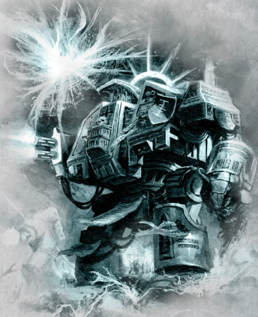
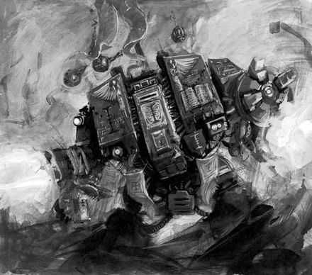
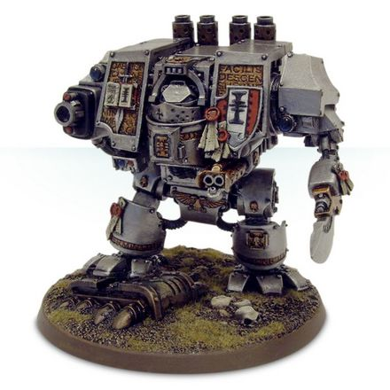

# 1449 灰骑士无畏机甲 Grey Knights Dreadnought

精校状态：中文行文已逐段精校，部分术语仍为暂定

分类：载具 / 地面 / 步行者

原文来源：https://www.bilibili.com/opus/1037680312260231170

原作者：帝国神选罐头

原文时间：编辑于 2025年09月24日 14:00

[返回分类目录](目录.md) · [全书目录](../../目录.md)

原篇名：灰骑士无畏 Grey Knights Dreadnought

<!-- A1449-B0001 -->
**英文原文**

The Grey Knights Dreadnought is a similar design to the Space Marine Dreadnought, but unlike other chapters, being interred inside a Dreadnought chassis is not seen as a great honour, and Knights who aspire to such a fate are rare; most simply yearn to rest in the cool of Titan for the rest of time. However, if the warrior is gravely wounded, but not enough to die, then he will often see the necessity of being placed within a machine.

<!-- /A1449-B0001 -->

<!-- A1449-B0002 -->

原译文

灰骑士无畏的设计与星际战士无畏相似，但与其他战团不同，被埋葬在无畏机甲内并不被视为一种荣誉，渴望这种命运的骑士很少；大多数人只是渴望在土卫六的凉爽中休息一段时间。然而，如果战士受了重伤，但还不足以死亡，那么他经常会看到被放在机器里的必要性。

**校订译文**

灰骑士无畏机甲的设计与普通星际战士无畏相近。不过，灰骑士不像其他战团那样，将被安置其中视为无上荣誉；主动向往这种命运的人很少，多数只渴望在泰坦清冷的陵墓中永远安息。然而，若战士伤势极重却仍未死去，他通常会认识到继续借助机甲服役的必要性。

**校注：** for the rest of time指永恒安息，原“休息一段时间”误译。Titan沿泰坦地名。

<!-- /A1449-B0002 -->

<!-- A1449-B0003 图片 -->

<!-- A1449-B0004 -->

原译文

Grey Knights Dreadnought 灰骑士无畏

**校订译文**

Grey Knights Dreadnought 灰骑士无畏

<!-- /A1449-B0004 -->

<!-- A1449-B0005 -->
## Overview 概述

<!-- /A1449-B0005 -->

<!-- A1449-B0006 -->
**英文原文**

Standing twice the height of a man, a Dreadnought's fury is an awesome sight to behold, and each is armed with the most fearsome weaponry that the Chapter holds. Their very movements cause the ground to shake as their furnaces roar in the heat of battle.

<!-- /A1449-B0006 -->

<!-- A1449-B0007 -->

原译文

一个人身高的两倍，无畏的狂怒令人叹为观止，每一个无畏都配备了本战团所拥有的最可怕的武器。他们的动作使地面震动，他们的熔炉在激烈的战斗中咆哮。

**校订译文**

无畏机甲约有常人两倍高，怒战时令人震撼；每台都配有战团最骇人的武器。它们在战火中引擎轰鸣，每一步都撼动大地。

<!-- /A1449-B0007 -->

<!-- A1449-B0008 -->
**英文原文**

Their advances on the battlefield can cause enemies to scatter and their adamantium-armoured hides can shrug off weapons fire from their foes. Though fearsome opponents, the greatest gift a Grey Knight Dreadnought can provide is support to their brethren in the form of psychic defences. This is because their sarcophagi contain psyber-circuitry which can link their own Aegis field to that of their Battle-Brothers, thus creating a series of wards that are much stronger than the sum of their parts.

<!-- /A1449-B0008 -->

<!-- A1449-B0009 -->

原译文

他们在战场上的推进会导致敌人四散，他们的坚硬装甲可以抵挡敌人的武器火力。虽然是可怕的对手，但灰骑士无畏所能提供的最大天赋就是以灵能防御的形式支援他们的兄弟。这是因为他们的石棺中含有灵能回路，可以将他们自己的宙斯盾立场与他们战斗兄弟的连接起来，从而创造出一系列防护结界，这些结界的整体威力远大于各部分的简单相加。

**校订译文**

它们向前推进，便能使敌人四散溃逃，精金甲壳则抵挡着来袭火力。不过，灰骑士无畏机甲给予战友最宝贵的支援，是灵能防护。石棺内的灵能控制电路能将自身神盾力场与战斗兄弟的力场相连，构成一组整体远强于各部分简单相加的防护结界。

<!-- /A1449-B0009 -->

<!-- A1449-B0010 图片 -->

<!-- A1449-B0011 -->

原译文

Grey Knights Dreadnought in combat 格斗中的灰骑士无畏

**校订译文**

Grey Knights Dreadnought in combat 格斗中的灰骑士无畏

<!-- /A1449-B0011 -->

<!-- A1449-B0012 -->
**英文原文**

It is ultimately considered not the weaponry nor the armour of the Dreadnought that makes them such terrifying weapons, but the warriors within who long ago were wounded to the point that they now dwell within a cyber-organic sarcophagus. As only the mightiest are ever given this honour, fighting them is no simple feat, as their enemies face not a mere machine or a great hero of the Chapter but a warrior whose mechanised form is as unflagging as their will.

<!-- /A1449-B0012 -->

<!-- A1449-B0013 -->

原译文

最终被认为不是无畏的武器或装甲使它们成为如此可怕的武器，而是很久以前受伤的战士，他们现在住在一个智控有机石棺里。因为只有最强大的人才能获得这一荣誉，所以与他们作战绝非易事，因为他们的敌人面对的不仅仅是一台机甲或一位伟大的英雄，而是一位意志坚定不移的机械化战士。

**校订译文**

真正使它们成为可怕战争兵器的，归根结底是内部的战士，而非武器或装甲。这些英雄早年遭受重创，如今寄身于机械与有机组织结合的石棺之中。唯有最强大的战士才会获得这种殊荣。面对他们，敌人对抗的不只是一台机器，或一位伟大的英雄，而是一名机械躯体与坚定意志同样不知疲倦的战士。

<!-- /A1449-B0013 -->

<!-- A1449-B0014 -->
**英文原文**

A Grey Knights Dreadnought is seen as a living connection to the Chapter's many years of history, and each chassis is considered an ancient artefact, rather than a weapon of war. The Dreadnoughts represent the living embodiment of glorious victories, great deeds, slain heroes, unquestionable loyalties and proven honour. Thus, they serve as a potent symbol of what the Grey Knights are and what they stand for in their service to the Imperium. In this way, they provide their Battle-Brothers with a legend that the latter strive to emulate.

<!-- /A1449-B0014 -->

<!-- A1449-B0015 -->

原译文

灰骑士无畏被视为与战团历史的活生生的联系，每个机甲都被认为是一件古代圣物，而不是战争武器。无畏象征着光荣的胜利、伟大的事迹、牺牲的英雄、无可置疑的忠诚和公认的荣誉。因此，它们是灰骑士的有力象征，也是他们为帝国服务的象征。通过这种方式，他们为战斗兄弟提供了一个传说，以便后者努力效仿。

**校订译文**

灰骑士无畏机甲是连接战团悠久历史的活纽带。每副机体首先被视为古代圣物，其次才是战争武器。它们承载着辉煌胜利、伟大功业、牺牲英雄、无可置疑的忠诚，以及久经考验的荣誉，象征着灰骑士的身份与效忠帝国的信念，也为战斗兄弟树立了努力追随的传奇榜样。

<!-- /A1449-B0015 -->

<!-- A1449-B0016 -->
**英文原文**

This makes them precious and worthy of the utmost respect, as they are venerated for the wealth of experience and wise council that they provide to their brethren. Through a Dreadnought, the spirits of the Chapter's ancestors continue to live on and this helps the Grey Knights in their fights on the battlefield. Each of the ten companies has its own Dreadnought, all of whom are former heroes of the company. Typically, they are former Grand Masters, Brother-Captains or, in special cases, low-ranking Battle-Brothers who demonstrated exceptional courage and heroism in battle.

<!-- /A1449-B0016 -->

<!-- A1449-B0017 -->

原译文

这使他们变得珍贵，值得最高的尊重，因为他们向兄弟提供丰富的经验和明智的建议而受到尊敬。通过无畏，该战团先祖之魂继续存在，这有助于灰骑士在战场上的战斗。这十个连队都有自己的无畏，他们都是连队的前代英雄。通常，他们是前大师、兄弟连长，或者在特殊情况下，是在战斗中表现出非凡勇气和应用的下级战斗兄弟。

**校订译文**

丰富的经验和睿智的建议，使这些英雄无比珍贵，受到至高敬意。通过无畏机甲，战团先辈的精神得以延续，继续帮助灰骑士战斗。按此处资料的编制，十个连各有自己的无畏机甲，驾驶员都是该连昔日的英雄，通常为前任大导师或兄弟会连长；特殊情况下，也会选入在战场上表现出非凡勇气与英雄气概的普通战斗兄弟。

**校注：** 本段沿英文ten companies十连的旧式编制表述，后文另有第七兄弟会，不据现行组织表重写。

<!-- /A1449-B0017 -->

<!-- A1449-B0018 -->
**英文原文**

Dreadnoughts are such experienced warriors that they can adopt any role on the field of battle once they are fully awakened. They are equally capable of spearheading an assault, providing long-range fire support, or even serving as a secondary commander of the main strike force. These Venerable Dreadnoughts are seen as living legends to their Battle-Brothers who often redouble their efforts whilst in their shadow and are never found wanting.

<!-- /A1449-B0018 -->

<!-- A1449-B0019 -->

原译文

无畏是经验丰富的战士，一旦完全觉醒，他们可以在战场上扮演任何角色。他们同样有能力带头进攻，提供远程火力支援，甚至担任主要打击部队的二级指挥官。这些可敬的无畏被视为他们的战斗兄弟的活传奇，他们经常在阴影下加倍努力，从未被发现有任何不足。

**校订译文**

这些战士经验极为丰富，一旦完全苏醒，便能承担任何战场职责：率先发起突击、提供远程火力支援，甚至担任主力打击部队的副指挥官。战斗兄弟将这些神圣无畏机甲视为活传奇，在他们身旁会加倍奋战，竭力不负厚望。

<!-- /A1449-B0019 -->

<!-- A1449-B0020 -->
**英文原文**

It is customary for personal consent to be given before the procedure can begin to place a mortally wounded Grey Knight Space Marine into a Dreadnought. This is because many Battle-Brothers prefer to rest in peace as heroes of the Chapter in the tombs below the Fortress-Monastery on Titan. There, the name of the Grey Knight is engraved in their crypt alongside other great warriors which is a fitting end for their lifetime of service to the Imperium.

<!-- /A1449-B0020 -->

<!-- A1449-B0021 -->

原译文

按照惯例，在将一名受致命伤的灰骑士星际战士放入无畏之前，必须征得个人同意。这是因为许多战斗兄弟更喜欢在泰坦要塞修道院下方的坟墓中作为战团的英雄安息。在那里，灰骑士的名字与其他伟大的战士一起刻在他们的地下墓室里，这是他们为帝国服务一生的完美结局。

**校订译文**

依照惯例，将身负致命伤的灰骑士安置于无畏机甲之前，必须征得其本人同意。许多战斗兄弟宁愿以战团英雄的身份，安息在泰坦要塞修道院下的陵墓中。他们的名字将与其他伟大战士并列镌刻在墓室里，为终生效忠帝国的历程画上合宜的句点。

<!-- /A1449-B0021 -->

<!-- A1449-B0022 -->
**英文原文**

One notable case of consent, according to legend, is the story of Grand Master Orias, who lay in the Apothecarium after battling the Daemon Prince Herperitus. Whilst being tended to by the Chief Apothecary and his servo-meds, the entire Chapter assembled to await his death, with all ten Brother-Captain's watching over him until his soul would fall into the Emperor's care. Orias's shattered body remained unmoving like this for three days, which made it appear as if he had already died, but instead the Grand Master simply gave a single nod of his head. The Brother-Captains debated and ultimately agreed that Orias had signaled his consent to being placed within a Dreadnought.

<!-- /A1449-B0022 -->

<!-- A1449-B0023 -->

原译文

据传说，一个值得注意的同意案例是欧里亚斯大导师的故事，他在与恶魔王子赫佩里图斯战斗后躺在药剂部。在首席药剂师和他的伺服机械的照料下，整个战团聚集在一起等待他的死亡，十位兄弟连长都在看着他，直到他的灵魂落入皇帝之手。欧里亚斯破碎的身体三天没有动，这让他看起来好像已经死了，但大导师简单地点了点头。兄弟连长们进行了辩论，最终一致同意将欧里亚斯安置在无畏内。

**校订译文**

传说中，大导师欧里亚斯的故事便是一例。他与恶魔亲王赫佩里图斯交战后，重伤躺在药剂部，由首席药剂师及医疗机仆照料。全战团聚集起来，等待他的生命终结；十位兄弟会连长守在身旁，准备目送他的灵魂归于帝皇庇护。欧里亚斯残破的身体三天一动不动，仿佛已经死去，随后却轻轻点了一下头。兄弟会连长们商议后认定，这个动作表示他同意被安置于无畏机甲之中。

**校注：** 原文连长们认定的是“点头表示本人同意”，不是只由他们投票决定安置；保留主体意愿。

<!-- /A1449-B0023 -->

<!-- A1449-B0024 -->
**英文原文**

These great warriors are summoned only during times of great battle, where victory cannot be achieved through the valour of mortal men alone. In such times, it is decided that the greatest heroes of the Chapter need to be assembled, and during such moments the Master Armourers of the Grey Knights enter into the Chamber of Heroes in order to awaken the Dreadnoughts. To wake them more frequently, the Grand Masters feel, is to dishonour their gift of service. Thus, once the dark time the Chapter faces is over, they return to the Chamber of Heroes to dream of battles yet to come.

<!-- /A1449-B0024 -->

<!-- A1449-B0025 -->

原译文

这些伟大的战士只有在伟大的战斗中才会被召唤，在那里，仅靠凡人的英勇无法取得胜利。在这样的时候，决定需要召集战团最伟大的英雄，在这样的时刻，灰骑士的军械大师进入英雄大厅，以唤醒无畏机甲。大师们觉得，频繁地叫醒他们，是对他们服务才能的侮辱。因此，一旦战团面临的黑暗时期结束，他们就会回到英雄大厅，梦想着未来的战斗。

**校订译文**

只有在单凭凡人的勇气已不足以获胜的重大战斗中，这些伟大战士才会受到召唤。届时，灰骑士的军械大师会进入英雄大厅，唤醒无畏机甲，召集战团最伟大的英雄。大导师们认为，过于频繁地惊扰他们，是对这份继续效忠的奉献的不敬。因此，战团渡过黑暗时刻后，他们便返回英雄大厅，在睡梦中等待未来的战斗。

<!-- /A1449-B0025 -->

<!-- A1449-B0026 -->
## Equipment 装备

<!-- /A1449-B0026 -->

<!-- A1449-B0027 -->
**英文原文**

Grey Knights Dreadnoughts possess Aegis Armour, allowing them to fend off attacks by Psykers and Daemons.

<!-- /A1449-B0027 -->

<!-- A1449-B0028 -->

原译文

灰骑士无畏拥有宙斯盾装甲，可以抵御灵能者和恶魔的攻击。

**校订译文**

灰骑士无畏机甲配有神盾护甲，能够抵御灵能者与恶魔的攻击。

<!-- /A1449-B0028 -->

<!-- A1449-B0029 -->
**英文原文**

Their left arms are usually armed with one Dreadnought Close Combat Weapon or Nemesis Doomfist and a built-in Storm Bolter, which can be upgraded to either a Heavy flamer or an Incinerator.

<!-- /A1449-B0029 -->

<!-- A1449-B0030 -->

原译文

他们的左臂通常装备有一个无畏近战武器或复仇女神毁灭之拳和一个内置的风暴爆矢枪，可以升级为重型火焰枪或焚化枪。

**校订译文**

其左臂通常装备无畏近战武器或复仇女神毁灭拳，并内置风暴爆矢枪；后者可换装为重型火焰喷射器或焚化枪。

<!-- /A1449-B0030 -->

<!-- A1449-B0031 -->
**英文原文**

Their right arms are usually fitted with either a Twin-linked Lascannon, a Heavy Bolter, an Autocannon, an Assault Cannon, a Multi-melta or a Plasma cannon.

<!-- /A1449-B0031 -->

<!-- A1449-B0032 -->

原译文

他们的右臂通常配备有双联激光炮、重型爆矢枪、自动炮、突击炮、多管火箭炮或等离子炮。

**校订译文**

右臂通常配备双联激光炮、重型爆矢枪、自动炮、突击炮、多管热熔或等离子炮。

**校注：** Multi-melta按已核官译多管热熔，原多管火箭炮错误。

<!-- /A1449-B0032 -->

<!-- A1449-B0033 -->
**英文原文**

They are also commonly upgraded with blessings, extra armour, hunter-killer missiles, psycannon bolts, a sacred hull, and searchlights; virtually all of them possess smoke launchers.

<!-- /A1449-B0033 -->

<!-- A1449-B0034 -->

原译文

它们通常还会升级祝福、额外的盔甲、猎杀飞弹、灵能炮爆矢、神圣机体和探照灯；他们几乎都有烟雾发射器。

**校订译文**

常见的附加配置还包括祝福、额外装甲、猎杀导弹、灵能炮爆矢、神圣机体及探照灯；几乎所有型号都装有烟雾发射器。

<!-- /A1449-B0034 -->

<!-- A1449-B0035 -->

原译文

'Doomglaive' Dreadnoughts “毁灭长刀”无畏

**校订译文**

'Doomglaive' Dreadnoughts “毁灭长刀”无畏

<!-- /A1449-B0035 -->

<!-- A1449-B0036 -->
**英文原文**

This configuration of Grey Knights Dreadnought appeared during the Garanhir Rebellion, where the 7th Brotherhood of the Grey Knights was faced with great hordes of the Bloodletters. In such harsh circumstances it was decided to arm Dreadnoughts with Nemesis Doomglaives, psychically-attuned blades which were fitted to one arm of the Mk IV Dreadnoughts, and also with a Psycannon in the other hand. This combination proved so efficient that only through those Dreadnoughts did the 7th Brotherhood manage to destroy a huge wave of advancing Daemons and eventually achieve victory. Since that day, this type of Dreadnought was codified 'Doomglaive' and entered the basic doctrine of the Grey Knights, especially used in battles when the chapter was confronted with the massed daemonic infantry, mutants, or Chaos cultists.

<!-- /A1449-B0036 -->

<!-- A1449-B0037 -->

原译文

这种灰骑士无畏的配置出现在加拉尼尔叛乱期间，在那里，第七灰骑士兄弟会面临着大量的放血魔军团。在这种恶劣的情况下，决定用复仇女神毁灭长刀来武装无畏，这是一种协调灵能的刀刃，安装在Mk IV无畏的一只手臂上，另一只手上还装有灵能炮。这种组合被证明是如此有效，以至于只有通过这些无畏，第七兄弟会才设法摧毁了一大批前进的恶魔，并最终取得了胜利。从那天起，这种类型的无畏舰就被编纂为“毁灭长刀”，并进入了灰骑士的基本教义，尤其是在面对大量的恶魔步兵、变种人或混沌邪教徒的战斗中使用。

**校订译文**

这种灰骑士无畏机甲配置首次出现于加拉尼尔叛乱。当时，第七兄弟会面对成群的放血魔，于是决定在Mk IV无畏机甲的一侧手臂安装复仇女神毁灭长刀——一种与灵能调谐的利刃——另一侧安装灵能炮。这种组合极为有效，第七兄弟会正是凭借这些机甲，才摧毁不断涌来的恶魔大军，最终获胜。此后，该配置被正式定名为“毁灭长刀”，纳入灰骑士的常规战术体系，尤其适合对抗密集的恶魔步兵、变种人和混沌邪教徒。

<!-- /A1449-B0037 -->

<!-- A1449-B0038 图片 -->

<!-- A1449-B0039 -->

原译文

Doomglaive Dreadnought 末日长刀无畏

**校订译文**

Doomglaive Dreadnought 毁灭长刀无畏机甲

<!-- /A1449-B0039 -->

<!-- A1449-B0040 -->
## Known Grey Knights Dreadnoughts 著名灰骑士无畏

<!-- /A1449-B0040 -->

<!-- A1449-B0041 -->

原译文

Aeneas 埃涅阿斯

**校订译文**

Aeneas 埃涅阿斯

<!-- /A1449-B0041 -->

<!-- A1449-B0042 -->

原译文

Branor 布兰诺

**校订译文**

Branor 布兰诺

<!-- /A1449-B0042 -->

<!-- A1449-B0043 -->

原译文

Fidelis 菲德利斯

**校订译文**

Fidelis 菲德利斯

<!-- /A1449-B0043 -->

<!-- A1449-B0044 -->

原译文

Moritar 莫里塔

**校订译文**

Moritar 莫里塔

<!-- /A1449-B0044 -->

<!-- A1449-B0045 -->

原译文

Orias 欧里亚斯

**校订译文**

Orias 欧里亚斯

<!-- /A1449-B0045 -->

<!-- A1449-B0046 -->

原译文

Steel Vigilance 钢铁警戒

**校订译文**

Steel Vigilance 钢铁警戒

<!-- /A1449-B0046 -->

<!-- A1449-B0047 -->

原译文

Uphur 乌弗尔

**校订译文**

Uphur 乌弗尔

<!-- /A1449-B0047 -->

<!-- A1449-B0048 -->

原译文

Valafar 华拉法

**校订译文**

Valafar 华拉法

<!-- /A1449-B0048 -->

本篇核心术语与暂定项

以下列出本篇出现的英文原形及核心术语表用词。同形词可能指不同对象，具体词义以本篇正文和校注为准；单复数、别名和仅见于图注的名称可能尚未列入。完整候选见[术语表](../../术语表/双语术语候选.csv)。

| 英文 | 采用中文 | 状态 |
| --- | --- | --- |
| Grey Knights | 灰骑士 | 官方已核对 |
| Imperium | 帝国 | 暂定·简称 |
| History | 历史 | 编辑用语已统一 |
| Emperor | 帝皇 | 官方已核对 |
| Daemon Prince | 恶魔亲王 | 官方已核对 |
| Hunter-Killer | 猎杀者 | 暂定·官方待核 |
| Brotherhood | 兄弟会 | 暂定·官方待核 |
| Titan | 泰坦 | 暂定·官方待核 |
| Nod | 诺德 | 暂定·官方待核 |
| Master | 导师（审判庭职衔）／舰务官（舰员职务） | 语境定译·官方待核 |
| Chief Apothecary | 首席药剂师 | 暂定·官方待核 |
| Apothecary | 药剂师 | 官方已核对 |
| Ancient | 旗手 | 官方已核对 |
| Space Marine | 星际战士 | 暂定·官方待核 |
| Chapter | 战团 | 暂定·官方待核 |
| Fortress-monastery | 要塞修道院 | 暂定·官方待核 |
| Captain | 连长 | 暂定·官方待核 |
| Brother | 修士 | 暂定·官方待核 |
| Nemesis | 复仇女神 | 暂定·官方待核 |
| Mortal | 凡人 | 暂定·官方待核 |
| Brother-Captain | 兄弟会连长（灰骑士）／兄弟连长（通称） | 语境定译·灰骑士职衔官译已核 |
| Bloodletters | 放血者 | 官方已核对 |
| Aegis Armour | 神盾护甲 | 暂定·官方待核 |
| Dreadnought | 无畏机甲 | 暂定·官方待核 |
| Venerable Dreadnoughts | 神圣无畏机甲 | 暂定·官方待核 |
| Grand Master | 大导师 | 暂定·官方待核 |
| Incinerator | 焚化枪 | 暂定·官方待核 |
| Psycannon | 灵能炮 | 暂定·官方待核 |
| Orias | 欧里亚斯 | 暂定·官方待核 |
| Dwell | 德威尔 | 暂定·官方待核 |
| The Dark | 《黑暗》 | 暂定·官方待核 |
| Nemesis Doomfist | 复仇女神毁灭拳 | 暂定·官方待核 |
| Autocannon | 自动炮 | 暂定·官方待核 |
| Assault Cannon | 突击炮 | 暂定·官方待核 |
| Psycannon Bolts | 灵能炮爆矢 | 暂定·官方待核 |
| Bolter | 爆矢枪 | 暂定·官方待核 |
| Heavy bolter | 重型爆矢枪 | 官方已核对 |
| Storm bolter | 风暴爆矢枪 | 官方已核对 |
| Flamer | 火焰喷射器（武器）／火妖（奸奇单位） | 语境定译·对应官译已核 |
| Heavy flamer | 重型火焰喷射器 | 官方已核对 |
| Multi-melta | 多管热熔 | 官方已核对 |
| Plasma cannon | 等离子炮 | 官方已核对 |
| Lascannon | 激光炮 | 官方已核对 |
| Extra Armour | 额外装甲 | 暂定·官方待核 |
| Grey Knights Dreadnought | 灰骑士无畏机甲 | 暂定·官方待核 |
| Herperitus | 赫佩里图斯 | 暂定·官方待核 |
| Chamber of Heroes | 英雄大厅 | 暂定·官方待核 |
| Garanhir Rebellion | 加拉尼尔叛乱 | 暂定·官方待核 |
| The Chamber of Heroes | 英雄大厅 | 暂定·官方待核 |

