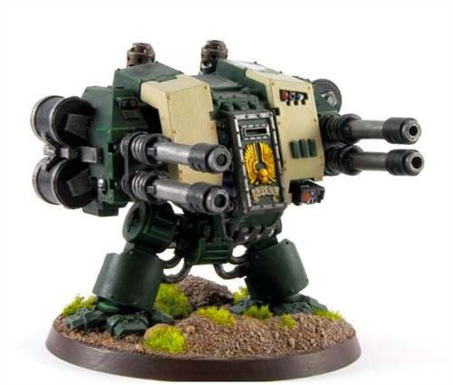
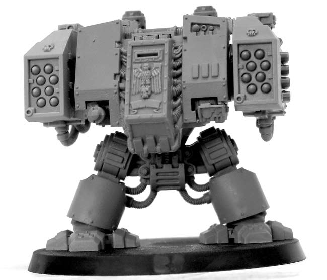
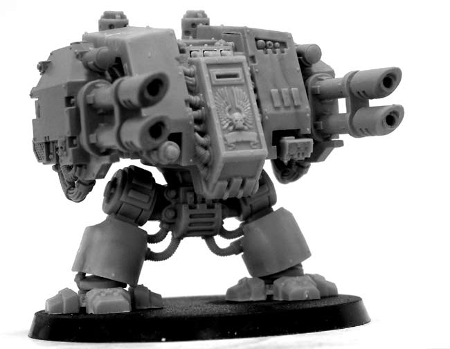
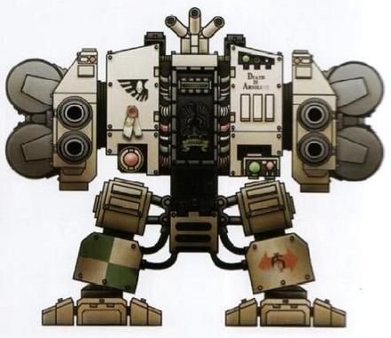

# 1450 莫提斯无畏机甲 Mortis Dreadnought

精校状态：中文行文已逐段精校，部分术语仍为暂定

分类：载具 / 地面 / 步行者

原文来源：https://www.bilibili.com/opus/1038073044041465874

原作者：帝国神选罐头

原文时间：2025年02月26日 09:33

[返回分类目录](目录.md) · [全书目录](../../目录.md)

原篇名：莫迪斯无畏 Mortis Dreadnought

<!-- A1450-B0001 -->
**英文原文**

The Mortis Dreadnought is a rare Space Marine Dreadnought pattern used by the Dark Angels and their successor chapters. Its origins and why only the Unforgiven possess them are mysteries.

<!-- /A1450-B0001 -->

<!-- A1450-B0002 -->

原译文

莫迪斯无畏是黑暗天使及其子战团使用的罕见星际战士无畏型号。它的起源以及为什么只有不可饶恕者拥有它们是个谜。

**校订译文**

莫提斯无畏机甲是黑暗天使及其子战团使用的罕见型号。它的起源，以及为何只有戴罪者拥有它，至今仍是谜团。

**校注：** Mortis沿已定Contemptor-Mortis的莫提斯词根，原莫迪斯保留在对照原译。Unforgiven沿戴罪者。

<!-- /A1450-B0002 -->

<!-- A1450-B0003 图片 -->

<!-- A1450-B0004 -->

原译文

Mortis Dreadnought with four Autocannons 配备四个自动炮的莫迪斯无畏

**校订译文**

Mortis Dreadnought with four Autocannons 配备四门自动炮的莫提斯无畏机甲

<!-- /A1450-B0004 -->

<!-- A1450-B0005 -->
## History 历史

<!-- /A1450-B0005 -->

<!-- A1450-B0006 -->
**英文原文**

It is said that in the times of the Great Crusade, the Space Marine Legions deployed large assault spearheads made entirely of Dreadnoughts and this sub-type was a much needed source of dedicated fire support during those terrible campaigns. The Mortis Dreadnought comes in both Castaferrum Pattern and Contemptor Patterns.

<!-- /A1450-B0006 -->

<!-- A1450-B0007 -->

原译文

据说，在大远征时期，星际战士部署了完全由无畏组成的大型突击矛头，这种亚型是这些可怕战役中急需的专用火力支援来源。莫迪斯无畏有铸铁型和蔑视者型。

**校订译文**

据说，大远征期间，星际战士军团曾部署完全由无畏机甲组成的大型突击先锋。在那些惨烈战役中，莫提斯型提供了不可或缺的专门火力支援。它同时具有铸铁型和蔑视者型机体版本。

<!-- /A1450-B0007 -->

<!-- A1450-B0008 图片 -->

<!-- A1450-B0009 -->

原译文

Mortis Dreadnought with missile launchers 配备导弹发射器的莫迪斯无畏

**校订译文**

Mortis Dreadnought with missile launchers 配备导弹发射器的莫提斯无畏机甲

<!-- /A1450-B0009 -->

<!-- A1450-B0010 -->
### Armament 军备

<!-- /A1450-B0010 -->

<!-- A1450-B0011 -->
**英文原文**

The Mortis is armed with a pair of heavy weapons consisting of either two missile launchers or two twin-linked heavy bolters, autocannons, or lascannons.

<!-- /A1450-B0011 -->

<!-- A1450-B0012 -->

原译文

莫迪斯配备了一对重型武器，包括两个导弹发射器或两个双联重型爆矢枪、自动炮或激光炮。

**校订译文**

莫提斯的两侧手臂均装备重型武器，可选两具导弹发射器，或两组双联重型爆矢枪、双联自动炮、双联激光炮。

<!-- /A1450-B0012 -->

<!-- A1450-B0013 图片 -->

<!-- A1450-B0014 -->

原译文

Mortis Dreadnought with lascannons 配备激光炮的莫迪斯无畏

**校订译文**

Mortis Dreadnought with lascannons 配备激光炮的莫提斯无畏机甲

<!-- /A1450-B0014 -->

<!-- A1450-B0015 -->
**英文原文**

In addition, the Mortis is equipped with the advanced Helical Targeting Array. This advanced system of augurs and combat-cogitators allows the Mortis to track and destroy even the swiftest moving foes with ease. However, due to the Helical's array delicacy and power consumption, the dreadnought is immobilized while the system is in operation.

<!-- /A1450-B0015 -->

<!-- A1450-B0016 -->

原译文

此外，莫迪斯还配备了先进的螺旋目标阵列。这种先进的预兆和战斗协同系统使莫迪斯能够轻松追踪和摧毁快速移动的敌人。然而，由于螺旋阵列的精细性和功耗，无畏在系统运行时无法移动。

**校订译文**

此外，莫提斯还装有先进的螺旋瞄准阵列。这套由探测设备与战斗沉思者组成的系统，使它能够轻松跟踪并摧毁高速移动的敌人。不过，由于阵列结构精密、耗能巨大，系统运行时，机甲必须保持静止。

**校注：** augurs为探测设备、cogitators为沉思者，原“预兆和战斗协同”误解设备名。

<!-- /A1450-B0016 -->

<!-- A1450-B0017 -->
## Notable Mortis Dreadnoughts 著名莫提斯无畏机甲

原题：Notable Mortis Dreadnoughts 著名莫迪斯无畏

<!-- /A1450-B0017 -->

<!-- A1450-B0018 -->
**英文原文**

Malach — Angels of Absolution, 6th tactical company.

<!-- /A1450-B0018 -->

<!-- A1450-B0019 -->

原译文

马列赫 — 赦免天使，第六战术连

**校订译文**

马列赫 — 赦免天使，第六战术连

<!-- /A1450-B0019 -->

<!-- A1450-B0020 图片 -->

<!-- A1450-B0021 -->

原译文

Malach, Mortis Dreadnought from the Angels of Absolution 马列赫，赦免天使的莫迪斯无畏

**校订译文**

Malach, Mortis Dreadnought from the Angels of Absolution 赦免天使的莫提斯无畏机甲马列赫

<!-- /A1450-B0021 -->

本篇核心术语与暂定项

以下列出本篇出现的英文原形及核心术语表用词。同形词可能指不同对象，具体词义以本篇正文和校注为准；单复数、别名和仅见于图注的名称可能尚未列入。完整候选见[术语表](../../术语表/双语术语候选.csv)。

| 英文 | 采用中文 | 状态 |
| --- | --- | --- |
| Dark Angels | 黑暗天使 | 官方已核对 |
| Great Crusade | 大远征 | 暂定·官方待核 |
| Unforgiven | 戴罪者 | 暂定·官方待核 |
| Space Marine | 星际战士 | 暂定·官方待核 |
| Angels of Absolution | 赦免天使 | 暂定·官方待核 |
| Missile Launchers | 导弹发射器 | 暂定·官方待核 |
| Dreadnought | 无畏机甲 | 暂定·官方待核 |
| The Dark | 《黑暗》 | 暂定·官方待核 |
| System | 星系（恒星系统） | 暂定·官方待核 |
| Helical Targeting Array | 螺旋瞄准阵列 | 暂定·官方待核 |
| Mortis Dreadnought | 莫提斯无畏机甲 | 暂定·官方待核 |
| Malach | 马列赫 | 暂定·官方待核 |

