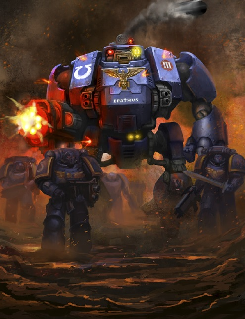
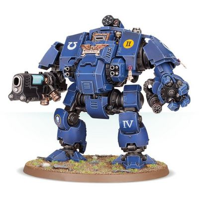
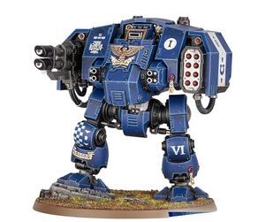
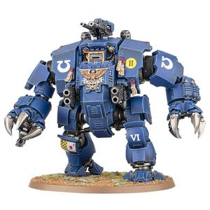

# 1451 救赎者无畏机甲 Redemptor Dreadnought

精校状态：中文行文已逐段精校，部分术语仍为暂定

分类：载具 / 地面 / 步行者

原文来源：https://www.bilibili.com/opus/1038438064742989840

原作者：帝国神选罐头

原文时间：2025年02月27日 09:10

[返回分类目录](目录.md) · [全书目录](../../目录.md)

原篇名：救赎者无畏 Redemptor Dreadnought

<!-- A1451-B0001 -->
**英文原文**

The Redemptor Dreadnought is a newly created variation of the Space Marine Dreadnought and is designed to allow maimed Primaris Space Marines to continue to fight the Imperium's many enemies.

<!-- /A1451-B0001 -->

<!-- A1451-B0002 -->

原译文

救赎者无畏是星际战士无畏的新变体，旨在让残废的原铸星际战士继续与帝国的许多敌人作战。

**校订译文**

救赎者无畏机甲是一种新型星际战士无畏机甲，能让身负残疾的原铸星际战士继续与帝国的诸多敌人作战。

<!-- /A1451-B0002 -->

<!-- A1451-B0003 图片 -->

<!-- A1451-B0004 -->

原译文

Redemptor Dreadnought 救赎者无畏

**校订译文**

Redemptor Dreadnought 救赎者无畏机甲

<!-- /A1451-B0004 -->

<!-- A1451-B0005 -->
## Overview 概述

<!-- /A1451-B0005 -->

<!-- A1451-B0006 -->
**英文原文**

Taller, broader and more cleverly wrought than the traditional Dreadnought design, these goliaths are powered by hyper-dense reactors and sophisticated fibre bundles. Such is the miraculous design of the Redemptor’s neural links that its inhabitant, despite being entombed in the sarcophagus within the Dreadnought’s chest, can exercise control with surprising dexterity and speed.

<!-- /A1451-B0006 -->

<!-- A1451-B0007 -->

原译文

这些巨人比传统的无畏设计更高、更宽、更巧妙，由超密反应堆和复杂的纤维束提供动力。这就是救赎者神经连接的神奇设计，尽管它的乘员被埋在无畏胸部的石棺里，但他们可以以惊人的灵活性和速度进行控制。

**校订译文**

这些巨大的战争机器比传统无畏机甲更高大、更宽阔，构造也更精巧，由超高密度反应堆和复杂的纤维束驱动。救赎者的神经连接系统设计精妙：即使驾驶员已被安置在机甲胸部的石棺中，仍能以惊人的灵活性和速度操控机体。

<!-- /A1451-B0007 -->

<!-- A1451-B0008 -->
**英文原文**

The Mechanicum Tech-Priests that first built these walking machines of destruction spared little thought to the health of the incumbent, seeing him as little more than another part to be interred or replaced as necessary. Many of those Redemptors that have fought for a sustained period have already had their sarcophagi replaced, their original pilots burned out by the intensity of the machine’s destructive prowess. Sometimes though the Dreadnoughts surging energies leech the occupant’s life force until he is reduced to nothing but a sac of blackened organs, fit only to be reinterred, this time in a true mausoleum dedicated to his selfless sacrifice.

<!-- /A1451-B0008 -->

<!-- A1451-B0009 -->

原译文

首先建造这些破坏性步行机器的机械神教技术神甫们几乎没有考虑驾驶员的健康状况，认为他只不过是另一个需要埋葬或更换的部分。许多已经战斗了一段时间的救赎者已经更换了他们的石棺，他们最初的驾驶员被机器的破坏力烧毁了。有时，无畏汹涌的能量会吞噬驾驶员的生命力，直到他只剩下一堆焦黑的器官，只适合被重新安葬，而这次，应葬于一座真正的陵墓中，以纪念他的无私奉献。

**校订译文**

最初制造这些毁灭性步行机甲的机械教技术祭司几乎不顾驾驶员的健康，只把他视为另一个可以安置其中、也可以更换的部件。许多服役已久的救赎者都换过石棺，最初的驾驶员已被机体释放的强大毁灭能量耗尽。有时，无畏机甲中奔涌的能量会不断榨取驾驶员的生命力，直至他只剩下一团焦黑的器官，只能再次下葬。这一次，等待他的是一座真正的陵墓，用以纪念他的无私牺牲。

**校注：** 英文用 Mechanicum，故译机械教；没有擅自将其改写为机械修会。

<!-- /A1451-B0009 -->

<!-- A1451-B0010 图片 -->

<!-- A1451-B0011 -->

原译文

Redemptor Dreadnought 救赎者无畏

**校订译文**

Redemptor Dreadnought 救赎者无畏机甲

<!-- /A1451-B0011 -->

<!-- A1451-B0012 -->
**英文原文**

Redemptor Dreadnoughts wield an array of devastating weaponry including a Onslaught Heavy Gatling Cannon or Macro Plasma Incinerator on its right arm and a Redemptor Fist with Heavy Flamer or Onslaught Gatling Cannon on its left. It is also equipped with 2 chest-mounted fragstorm grenade launchers or storm bolters and a carapace-mounted Icarus Rocket Pod for air defence.

<!-- /A1451-B0012 -->

<!-- A1451-B0013 -->

原译文

救赎者无畏挥舞着一系列毁灭性的武器，包括右臂上的突击重型加特林炮或重型等离子体焚化炮，左臂上的带重型火焰枪或突击加特林炮的救赎者之拳。它还配备了2个安装在胸前的破片风暴榴弹发射器或风暴爆矢枪，以及一个安装在装甲上的伊卡洛斯火箭巢，用于防空。

**校订译文**

救赎者无畏机甲配备一系列毁灭性武器：右臂可安装猛攻重型加特林炮或巨型等离子焚化炮，左臂的救赎者之拳则配有重型火焰喷射器或猛攻加特林炮。此外，胸部还装有两具破片风暴榴弹发射器或两挺风暴爆矢枪，机体顶部可安装用于防空的伊卡洛斯火箭舱。

<!-- /A1451-B0013 -->

<!-- A1451-B0014 -->
## Variants 变体

<!-- /A1451-B0014 -->

<!-- A1451-B0015 -->
### Ballistus Dreadnought 射手型无畏机甲

原题：Ballistus Dreadnought 射手无畏

**校注：** 据 GW09 中文第32页/GW10 英文第31页，统一官方单位名“射手型无畏机甲”；原稿“射手无畏”。

<!-- /A1451-B0015 -->

<!-- A1451-B0016 -->
**英文原文**

The Ballistus is a ranged-focused variant of the Redemptor that is armed with a versatile missile launcher and a devastating lascannon.

<!-- /A1451-B0016 -->

<!-- A1451-B0017 -->

原译文

射手是救赎者的远程聚焦变体，配备了多功能导弹发射器和毁灭性的激光炮。

**校订译文**

射手型无畏机甲是侧重远程火力的救赎者变体，配备多用途导弹发射器和威力强大的激光炮。

<!-- /A1451-B0017 -->

<!-- A1451-B0018 图片 -->

<!-- A1451-B0019 -->

原译文

Ballistus Dreadnought 射手无畏

**校订译文**

Ballistus Dreadnought 射手型无畏机甲

<!-- /A1451-B0019 -->

<!-- A1451-B0020 -->
### Brutalis Dreadnought 残暴无畏机甲

原题：Brutalis Dreadnought 蛮兽无畏

<!-- /A1451-B0020 -->

<!-- A1451-B0021 -->
**英文原文**

Brutalis are a melee-focused variant of the Redemptor that is armed with Brutalis Fists or Claws, along with twin Icarus Ironhail Heavy Stubbers, Heavy Bolters, Heavy Flamers, and Bolt Rifles.

<!-- /A1451-B0021 -->

<!-- A1451-B0022 -->

原译文

蛮兽是以近战为重点的救赎者变体，装备有蛮兽之拳或爪，以及双联伊卡洛斯铁雹重机枪、重型爆矢枪、重型火焰枪和爆矢步枪。

**校订译文**

残暴无畏机甲是侧重近战的救赎者变体，装备残暴之拳或残暴之爪，以及双联伊卡洛斯铁雹重机枪、重型爆矢枪、重型火焰喷射器和爆矢步枪。

<!-- /A1451-B0022 -->

<!-- A1451-B0023 图片 -->

<!-- A1451-B0024 -->

原译文

Brutalis Dreadnought 蛮兽无畏

**校订译文**

Brutalis Dreadnought 残暴无畏机甲

<!-- /A1451-B0024 -->

<!-- A1451-B0025 -->
## Notable Redemptor Dreadnoughts 著名救赎者无畏机甲

原题：Notable Redemptor Dreadnoughts 著名救赎者无畏

<!-- /A1451-B0025 -->

<!-- A1451-B0026 -->
**英文原文**

Malcades - Ultramarines, the first Primaris Space Marine to fall in Ultramar.

<!-- /A1451-B0026 -->

<!-- A1451-B0027 -->

原译文

马尔卡德斯 - 极限战士，第一名倒在奥特拉玛的原铸星际战士。

**校订译文**

马尔卡德斯——极限战士，首位在奥特拉玛倒下的原铸星际战士。

**校注：** fallen 在本句未明确等同战死，且该人物后被安置于无畏机甲，保留“倒下”的范围。

<!-- /A1451-B0027 -->

<!-- A1451-B0028 -->
**英文原文**

Tallus - Dark Angels

<!-- /A1451-B0028 -->

<!-- A1451-B0029 -->

原译文

塔卢斯 - 黑暗天使

**校订译文**

塔卢斯 - 黑暗天使

<!-- /A1451-B0029 -->

<!-- A1451-B0030 -->
**英文原文**

Oriax - Sons of Guilliman

<!-- /A1451-B0030 -->

<!-- A1451-B0031 -->

原译文

奥里亚克斯 - 基里曼之子

**校订译文**

奥里亚克斯 - 基里曼之子

<!-- /A1451-B0031 -->

<!-- A1451-B0032 -->
**英文原文**

Lazarius - Silver Skulls

<!-- /A1451-B0032 -->

<!-- A1451-B0033 -->

原译文

拉扎里乌斯 - 银色颅骨

**校订译文**

拉扎琉斯——银色颅骨。

<!-- /A1451-B0033 -->

<!-- A1451-B0034 -->
**英文原文**

Rahellion - Deathwatch

<!-- /A1451-B0034 -->

<!-- A1451-B0035 -->

原译文

拉海利恩 - 死亡守望

**校订译文**

拉海利恩 - 死亡守望

<!-- /A1451-B0035 -->

<!-- A1451-B0036 -->
**英文原文**

Gideon - Deathwatch

<!-- /A1451-B0036 -->

<!-- A1451-B0037 -->

原译文

基甸 - 死亡守望

**校订译文**

基甸 - 死亡守望

<!-- /A1451-B0037 -->

<!-- A1451-B0038 -->
**英文原文**

Zachorial - Deathwatch

<!-- /A1451-B0038 -->

<!-- A1451-B0039 -->

原译文

扎克霍瑞尔 - 死亡守望

**校订译文**

扎克霍瑞尔 - 死亡守望

<!-- /A1451-B0039 -->

<!-- A1451-B0040 -->
**英文原文**

Purgatus Rex - Deathwatch

<!-- /A1451-B0040 -->

<!-- A1451-B0041 -->

原译文

普尔加图斯·雷克斯 - 死亡守望

**校订译文**

普尔加图斯·雷克斯 - 死亡守望

<!-- /A1451-B0041 -->

<!-- A1451-B0042 -->
**英文原文**

Asger - Space Wolves

<!-- /A1451-B0042 -->

<!-- A1451-B0043 -->

原译文

阿斯格 - 太空野狼

**校订译文**

阿斯格 - 太空野狼

<!-- /A1451-B0043 -->

<!-- A1451-B0044 -->
**英文原文**

Kurggar Fyrfist - Space Wolves

<!-- /A1451-B0044 -->

<!-- A1451-B0045 -->

原译文

库加·火拳 - 太空野狼

**校订译文**

库加·火拳 - 太空野狼

<!-- /A1451-B0045 -->

<!-- A1451-B0046 -->
**英文原文**

Indomator - Ultramarines

<!-- /A1451-B0046 -->

<!-- A1451-B0047 -->

原译文

因多马特 - 极限战士

**校订译文**

因多马特 - 极限战士

<!-- /A1451-B0047 -->

<!-- A1451-B0048 -->
**英文原文**

Marius - Ultramarines

<!-- /A1451-B0048 -->

<!-- A1451-B0049 -->

原译文

马里乌斯 - 极限战士

**校订译文**

马里乌斯 - 极限战士

<!-- /A1451-B0049 -->

<!-- A1451-B0050 -->
**英文原文**

Alessor - Blood Angels

<!-- /A1451-B0050 -->

<!-- A1451-B0051 -->

原译文

阿莱索 - 圣血天使

**校订译文**

阿莱索 - 圣血天使

<!-- /A1451-B0051 -->

<!-- A1451-B0052 -->
**英文原文**

Scipius - Ultramarines

<!-- /A1451-B0052 -->

<!-- A1451-B0053 -->

原译文

斯基皮乌斯 - 极限战士

**校订译文**

斯基皮乌斯 - 极限战士

<!-- /A1451-B0053 -->

本篇核心术语与暂定项

以下列出本篇出现的英文原形及核心术语表用词。同形词可能指不同对象，具体词义以本篇正文和校注为准；单复数、别名和仅见于图注的名称可能尚未列入。完整候选见[术语表](../../术语表/双语术语候选.csv)。

| 英文 | 采用中文 | 状态 |
| --- | --- | --- |
| Space Marines | 星际战士 | 官方已核对 |
| Blood Angels | 圣血天使 | 官方已核对 |
| Dark Angels | 黑暗天使 | 官方已核对 |
| Deathwatch | 死亡守望 | 官方已核对 |
| Space Wolves | 太空野狼 | 官方已核对 |
| Ultramar | 奥特拉玛 | 官方已核对 |
| Ultramarines | 极限战士 | 官方已核对 |
| Imperium | 帝国 | 暂定·简称 |
| Mechanicum | 机械教 | 暂定·历史称谓 |
| Tech | 技术语 | 暂定·官方待核 |
| Plasma Incinerator | 等离子焚化枪 | 暂定·官方待核 |
| Silver Skulls | 银色颅骨 | 暂定·官方待核 |
| Space Marine | 星际战士 | 暂定·官方待核 |
| Primaris Space Marine | 原铸星际战士 | 暂定·官方待核 |
| Redemptor Dreadnought | 救赎者无畏机甲 | 官方已核对 |
| Redemptors | 救世主 | 暂定·官方待核 |
| Sons of Guilliman | 基里曼之子 | 暂定·官方待核 |
| Flamers | 火妖（奸奇单位）／火焰喷射器（武器） | 语境定译·对应官译已核 |
| Dreadnought | 无畏机甲 | 暂定·官方待核 |
| Incinerator | 焚化枪 | 暂定·官方待核 |
| Wrought | 锻造秘库 | 暂定·官方待核 |
| Onslaught Gatling Cannon | 猛攻加特林炮 | 暂定·官方待核 |
| Purgatus | 净化者 | 暂定·官方待核 |
| Missile Launcher | 导弹发射器 | 暂定·官方待核 |
| Rocket Pod | 火箭吊舱 | 暂定·官方待核 |
| Icarus Rocket Pod | 伊卡洛斯火箭舱 | 暂定·官方待核 |
| Onslaught Heavy Gatling Cannon | 猛攻重型加特林炮 | 暂定·官方待核 |
| Bolt | 爆矢 | 暂定·官方待核 |
| Flamer | 火焰喷射器（武器）／火妖（奸奇单位） | 语境定译·对应官译已核 |
| Heavy flamer | 重型火焰喷射器 | 官方已核对 |
| Macro Plasma Incinerator | 巨型等离子焚化炮 | 暂定·官方待核 |
| Redemptor Fist | 救赎者之拳 | 暂定·官方待核 |
| Lascannon | 激光炮 | 官方已核对 |
| Grenade | 手榴弹 | 暂定·官方待核 |
| Brutalis Fists | 残暴之拳 | 暂定·官方待核 |
| Malcades | 马尔卡德斯 | 暂定·官方待核 |
| Kurggar Fyrfist | 库加·火拳 | 暂定·官方待核 |
| Lazarius | 拉扎琉斯 | 暂定·官方待核 |

