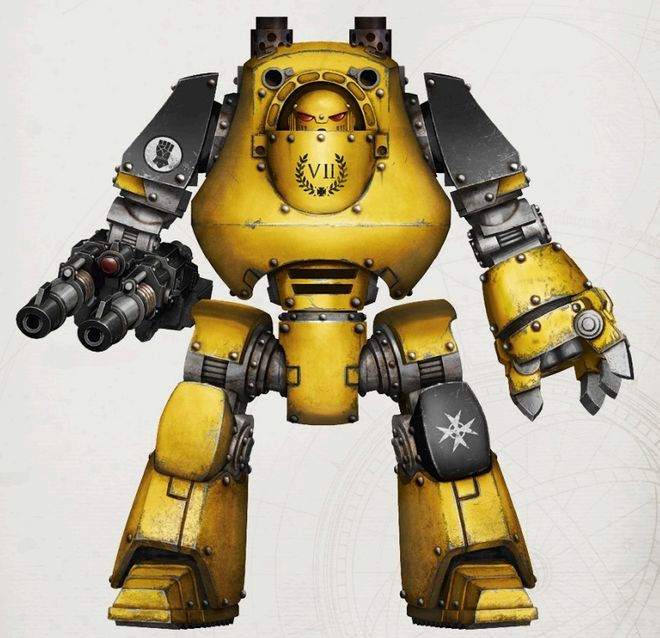
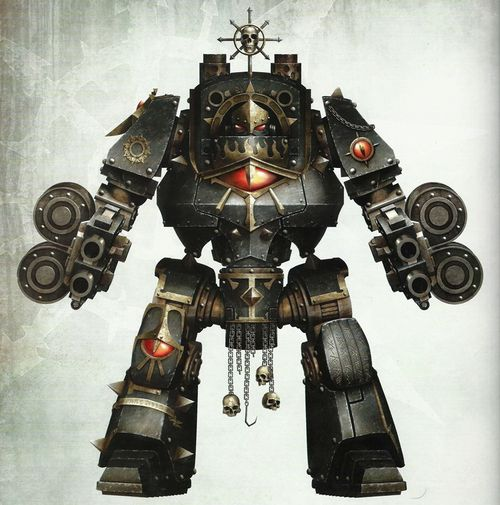
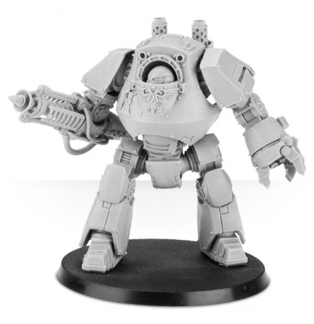
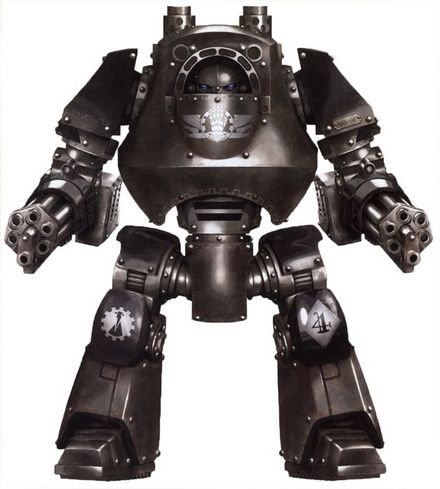
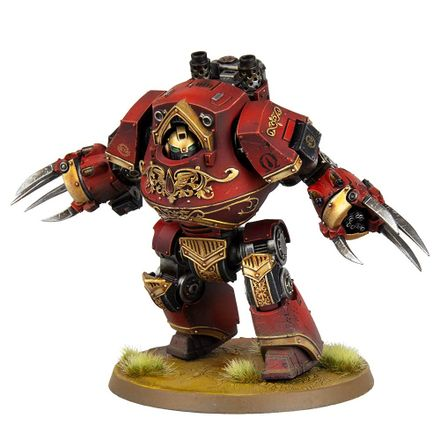
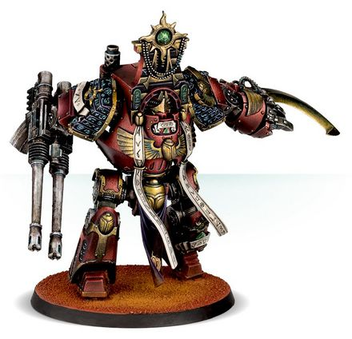
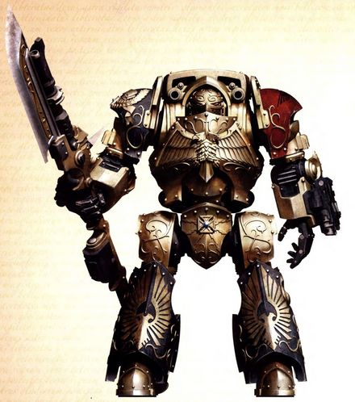
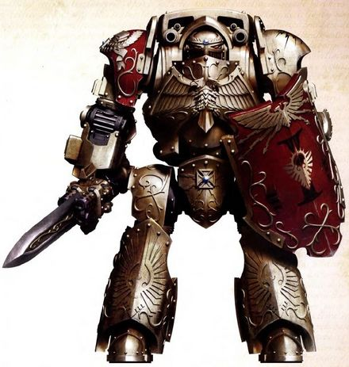

# 1452 蔑视者型无畏机甲 Contemptor Pattern Dreadnought

精校状态：中文行文已逐段精校，部分术语仍为暂定

分类：载具 / 地面 / 步行者

原文来源：https://www.bilibili.com/opus/1044126108992143361

原作者：帝国神选罐头

原文时间：2025年03月14日 17:02

[返回分类目录](目录.md) · [全书目录](../../目录.md)

原篇名：蔑视者无畏 Contemptor Pattern Dreadnought

<!-- A1452-B0001 -->
**英文原文**

The Contemptor Pattern Dreadnought is a Space Marine Dreadnought developed prior to the Horus Heresy.

<!-- /A1452-B0001 -->

<!-- A1452-B0002 -->

原译文

蔑视者型无畏是在荷鲁斯叛乱之前开发的一种星际战士无畏。

**校订译文**

蔑视者型无畏机甲是在荷鲁斯之乱前研制的一种星际战士无畏机甲。

<!-- /A1452-B0002 -->

<!-- A1452-B0003 -->
**英文原文**

The Contemptor is larger and more powerful than standard Dreadnought patterns, featuring systems similar to those used by the automatons of the Mechanicum's Legio Cybernetica branch, including Atomantic Shielding field generator technology that would be implemented into the Storm Shields of Space Marine Terminators.

<!-- /A1452-B0003 -->

<!-- A1452-B0004 -->

原译文

蔑视者比标准无畏型号更大、更强力，其系统类似于机械神教智控军团分支的自动机兵所使用的系统，包括应用于星际战士终结者风暴盾的原子屏蔽立场发生器技术。

**校订译文**

蔑视者比标准型号的无畏机甲更庞大、更强劲，其系统与机械教智控军团的自动机兵所用系统相近。其中的原子护盾力场发生器技术后来也被用于星际战士终结者的风暴盾。

**校注：** 原译“立场”应为“力场”；Atomantic 暂沿原子技术词根，不据此宣称为现实原子物理装置。

<!-- /A1452-B0004 -->

<!-- A1452-B0005 图片 -->

<!-- A1452-B0006 -->

原译文

Imperial Fists Contemptor Dreadnought 帝国之拳蔑视者无畏

**校订译文**

Imperial Fists Contemptor Dreadnought 帝国之拳蔑视者无畏机甲

<!-- /A1452-B0006 -->

<!-- A1452-B0007 -->
## Overview 概述

<!-- /A1452-B0007 -->

<!-- A1452-B0008 -->
**英文原文**

At the time of the Horus Heresy it was a recent design, compared to the older Lucifer and Castraferrum pattern Dreadnoughts. It was equipped with an Atomantic arc-reactor, that allowed for enhanced speed and strength as well as defensive energy field systems. These advantages came with a price, however, for it requires a higher degree of maintenance and a catastrophic meltdown may occur if its arc reactor is breached.

<!-- /A1452-B0008 -->

<!-- A1452-B0009 -->

原译文

在荷鲁斯叛乱时代，这是一种新的设计，与旧的路西法和铸铁型无畏相比。它配备了一个原子电弧反应堆，可以提高速度和强度，以及防御能量立场系统。然而，这些优势是有代价的，因为它需要更高程度的维护，如果其电弧反应堆被破坏，可能会发生灾难性的熔毁。

**校订译文**

在荷鲁斯之乱时期，相较于较早的路西法型和铸铁型无畏机甲，蔑视者仍是较新的设计。它搭载原子电弧反应堆，以提供更高的速度、更强的力量，并为防御能量力场供能。不过，这些优势也有代价：机体需要更精细的维护，而电弧反应堆一旦受损，便可能发生灾难性的熔毁。

<!-- /A1452-B0009 -->

<!-- A1452-B0010 -->
**英文原文**

Once the standard pattern of Dreadnought in the Great Crusade-era, the ability to create new Contemptors is now beyond the Adeptus Mechanicus or perhaps a closely guarded secret by certain Tech-Priest factions. Sacred Chapter memento-mori and ancient monuments on worlds like Necromunda and Lorin Alpha give notion to the important place the Contemptor had in the earliest Imperial forces raised from Terra, serving with other Dreadnought patterns in spearhead units in the Great Crusade, the Horus Heresy and its aftermath, suffering incredibly high loses.

<!-- /A1452-B0010 -->

<!-- A1452-B0011 -->

原译文

曾经是大远征时期无畏的标准型号，制造新的藐视者的能力现在已经超出了机械神教的能力范围，或者可能是某些技术神甫派系严格保守的秘密。神圣战团死亡纪念品和涅克洛蒙达和洛林阿尔法等世界上的古代纪念碑让人意识到，蔑视者在从泰拉出发的最早的帝国军队中占有重要地位，在大远征、荷鲁斯叛乱及其后续中，与其他无畏型号一起在先锋部队服役，遭受了令人难以置信的巨大损失。

**校订译文**

蔑视者曾是大远征时期的标准无畏型号，如今机械修会已无力制造新的蔑视者；也有可能，制造技术仍是某些技术祭司派系严守的秘密。战团保存的神圣悼亡遗物，以及涅克洛蒙达、洛林阿尔法等世界的古老纪念碑，都表明蔑视者在最早于泰拉组建的帝国军队中地位重要。在大远征、荷鲁斯之乱及其后的战事中，它们与其他型号的无畏机甲一同编入突击先锋部队，损失极为惨重。

<!-- /A1452-B0011 -->

<!-- A1452-B0012 -->
### Post-heresy 叛乱后

<!-- /A1452-B0012 -->

<!-- A1452-B0013 -->
**英文原文**

In the 41st Millennium, the Castaferrum Pattern Dreadnought had become the most common. The design of the Contemptor shares systems with the near-mythical battle-automata of the Legio Cybernetica, which may explain why so few Contemptors remain in service as of M41.

<!-- /A1452-B0013 -->

<!-- A1452-B0014 -->

原译文

在第41个千年，铸铁型无畏已经成为最常见的。蔑视者的设计与智控军团中近乎神话般的战斗自动机兵共享系统，这可能解释了为什么截至M41，很少有蔑视者仍在服役。

**校订译文**

到第41千年，铸铁型已成为最常见的无畏机甲。蔑视者与智控军团那些近乎传说的战斗自动机兵采用相同的部分系统，这或许解释了为何至第41千年，仍在服役的蔑视者已寥寥无几。

<!-- /A1452-B0014 -->

<!-- A1452-B0015 -->
**英文原文**

Given the rarity of the Contemptor-pattern chassis, those few that still remain in service are revered as relics amongst the Space Marine Chapters blessed enough to count these ancient war machines amongst their arsenal. It is not uncommon for those Chapters to embellish their armoured sarcophagus with scripture, honour scrolls and additional details to commemorate the heroism and indomitable valour of the Ancient enshrined within.

<!-- /A1452-B0015 -->

<!-- A1452-B0016 -->

原译文

鉴于蔑视者型底盘的罕见性，那些仍在服役的少数人被视为星际战士的圣物，他们有幸将这些古老的战争机器纳入他们的军械库。这些战团经常用经文、荣誉卷轴和其他细节来装饰他们的装甲石棺，以纪念里面所供奉的神圣长者的英勇和不屈不挠的勇气。

**校订译文**

蔑视者型底盘极为罕见。有幸将这些古老战争机器保留在军械库中的星际战士战团，都将剩余的少数机体奉为圣物。战团常在其装甲石棺上装饰经文、荣誉卷轴和其他饰物，以纪念安置其中的长者所展现的英雄气概与不屈勇武。

<!-- /A1452-B0016 -->

<!-- A1452-B0017 -->
**英文原文**

Chaos Space Marines still make us of this pattern in the form of the corrupted Chaos Contemptor Dreadnoughts, while the Adeptus Custodes maintain Venerable Contemptor Dreadnoughts of their own.

<!-- /A1452-B0017 -->

<!-- A1452-B0018 -->

原译文

混沌星际战士仍然以堕落的混沌蔑视者无畏的形式让我们看到这种型号，而禁军则保持着他们自己的可敬的蔑视者者无畏。

**校订译文**

混沌星际战士仍在使用这一型号，只是其机体已腐化为混沌蔑视者无畏机甲；帝皇禁军也保有自己的神圣蔑视者无畏机甲。

**校注：** 英文 make us 为 make use 的明显笔误，译为“使用”，原译误作“让我们看到”。

<!-- /A1452-B0018 -->

<!-- A1452-B0019 -->
### Wargear 战备

<!-- /A1452-B0019 -->

<!-- A1452-B0020 -->
**英文原文**

The Contemptor comes equipped with a twin-linked Heavy Bolter, a Dreadnought Close Combat Weapon with inbuilt Storm Bolter, and smoke launchers. It can also be fitted with a carapace-mounted Havoc Launcher. The Contemptor is protected by Atomantic Shielding.

<!-- /A1452-B0020 -->

<!-- A1452-B0021 -->

原译文

蔑视者配备了一个双联重型爆矢枪、一个内置风暴爆矢枪的无畏近战武器和烟雾发射器。它还可以配备安装在背甲上的浩劫发射器。蔑视者受到原子屏蔽的保护。

**校订译文**

蔑视者配备双联重型爆矢枪、内置风暴爆矢枪的无畏近战武器，以及烟雾发射器；还可在机体顶部加装浩劫发射器。原子护盾为它提供防护。

<!-- /A1452-B0021 -->

<!-- A1452-B0022 图片 -->

<!-- A1452-B0023 -->

原译文

Salaghast of the Black Legion 黑色军团的萨拉加斯特

**校订译文**

Salaghast of the Black Legion 黑色军团的萨拉加斯特

<!-- /A1452-B0023 -->

<!-- A1452-B0024 -->
**英文原文**

The Contemptor can replace its standard equipment with a variety of weaponry, including: a Rotor Cannon, Multi-melta, twin-linked Heavy Flamers, twin-linked Autocannons, Plasma Cannon, heavy Conversion Beamer, or twin-linked Lascannons. The Contemptor can also replace its inbuilt twin-linked Bolter with a heavy flamer. The Contemptor can also be upgraded with Extra armour, a Missile Launcher, and a Searchlight.

<!-- /A1452-B0024 -->

<!-- A1452-B0025 -->

原译文

蔑视者可以用各种武器代替其标准装备，包括：旋转炮、多管热熔、双联重型火焰枪、双联自动炮、等离子炮、重型转换光束或双联激光炮。灭世者还可以用重型火焰枪替换其内置的双联爆矢枪。蔑视者还可以升级额外装甲、导弹发射器和探照灯。

**校订译文**

蔑视者可将标准装备换成多种武器，包括转管炮、多管热熔、双联重型火焰喷射器、双联自动炮、等离子炮、重型转化光束炮或双联激光炮。内置的双联爆矢枪也可换成重型火焰喷射器。此外，还能加装附加装甲、导弹发射器和探照灯。

**校注：** 英文此处写内置 twin-linked Bolter，前段则写 Storm Bolter；两处配置差异按源文保留。

<!-- /A1452-B0025 -->

<!-- A1452-B0026 -->
### Technical Information 技术资料

原题：Technical Information 技术信息

<!-- /A1452-B0026 -->

<!-- A1452-B0027 -->
**英文原文**

Vehicle Name:Contemptor Pattern Dreadnought

<!-- /A1452-B0027 -->

<!-- A1452-B0028 -->

原译文

载具名称：蔑视者型无畏

**校订译文**

载具名称：蔑视者型无畏机甲

<!-- /A1452-B0028 -->

<!-- A1452-B0029 -->
**英文原文**

Forge World of Origin:Mars

<!-- /A1452-B0029 -->

<!-- A1452-B0030 -->

原译文

起源铸造世界：火星

**校订译文**

起源铸造世界：火星

<!-- /A1452-B0030 -->

<!-- A1452-B0031 -->
**英文原文**

Known Patterns:I-XXVI

<!-- /A1452-B0031 -->

<!-- A1452-B0032 -->

原译文

已知型号：I - XXVI

**校订译文**

已知型号：I - XXVI

<!-- /A1452-B0032 -->

<!-- A1452-B0033 -->
**英文原文**

Crew:Interred Space Marine

<!-- /A1452-B0033 -->

<!-- A1452-B0034 -->

原译文

乘员：星际战士残躯

**校订译文**

乘员：安置于石棺中的星际战士

<!-- /A1452-B0034 -->

<!-- A1452-B0035 -->
**英文原文**

Powerplant:Atomantic arc reactor

<!-- /A1452-B0035 -->

<!-- A1452-B0036 -->

原译文

动力装置：原子电弧反应堆

**校订译文**

动力装置：原子电弧反应堆

<!-- /A1452-B0036 -->

<!-- A1452-B0037 -->
**英文原文**

Weight:14.5 tonnes

<!-- /A1452-B0037 -->

<!-- A1452-B0038 -->

原译文

重量：14.5吨

**校订译文**

重量：14.5吨

<!-- /A1452-B0038 -->

<!-- A1452-B0039 -->
**英文原文**

Length:2.1m

<!-- /A1452-B0039 -->

<!-- A1452-B0040 -->

原译文

长度：2.1米

**校订译文**

长度：2.1米

<!-- /A1452-B0040 -->

<!-- A1452-B0041 -->
**英文原文**

Width:3.1m

<!-- /A1452-B0041 -->

<!-- A1452-B0042 -->

原译文

宽度：3.1米

**校订译文**

宽度：3.1米

<!-- /A1452-B0042 -->

<!-- A1452-B0043 -->
**英文原文**

Height:4.5m

<!-- /A1452-B0043 -->

<!-- A1452-B0044 -->

原译文

高度：4.5米

**校订译文**

高度：4.5米

<!-- /A1452-B0044 -->

<!-- A1452-B0045 -->
**英文原文**

Ground Clearance:N/A

<!-- /A1452-B0045 -->

<!-- A1452-B0046 -->

原译文

离地间隙：无

**校订译文**

离地间隙：不适用

<!-- /A1452-B0046 -->

<!-- A1452-B0047 -->
**英文原文**

Fording Depth:

<!-- /A1452-B0047 -->

<!-- A1452-B0048 -->

原译文

涉水深度：

**校订译文**

涉水深度：

**校注：** 英文未提供涉水深度数值，保留空项。

<!-- /A1452-B0048 -->

<!-- A1452-B0049 -->
**英文原文**

Max Speed - on road12kph

<!-- /A1452-B0049 -->

<!-- A1452-B0050 -->

原译文

最大速度-公路12公里/小时

**校订译文**

最大公路速度：12公里/小时

<!-- /A1452-B0050 -->

<!-- A1452-B0051 -->
**英文原文**

Max Speed - off road:7kph

<!-- /A1452-B0051 -->

<!-- A1452-B0052 -->

原译文

最大速度-越野：7公里/小时

**校订译文**

最大越野速度：7公里/小时

<!-- /A1452-B0052 -->

<!-- A1452-B0053 -->
**英文原文**

Transport Capacity:N/A

<!-- /A1452-B0053 -->

<!-- A1452-B0054 -->

原译文

运输能力：无

**校订译文**

载员能力：不适用

<!-- /A1452-B0054 -->

<!-- A1452-B0055 -->
**英文原文**

Access Points:N/A

<!-- /A1452-B0055 -->

<!-- A1452-B0056 -->

原译文

入口：无

**校订译文**

出入口：不适用

<!-- /A1452-B0056 -->

<!-- A1452-B0057 -->
**英文原文**

Main Armament:Twin-linked Heavy Bolters，Lascannons,

<!-- /A1452-B0057 -->

<!-- A1452-B0058 -->

原译文

主要武器：双联重型爆矢枪，激光炮，

**校订译文**

主要武器：双联重型爆矢枪、激光炮、

<!-- /A1452-B0058 -->

<!-- A1452-B0059 -->
**英文原文**

Volkite Culverins, or Heavy Flamers, or single Multi-Melta,

<!-- /A1452-B0059 -->

<!-- A1452-B0060 -->

原译文

爆燃长炮，或重型火焰枪，或单个多管热熔，

**校订译文**

爆燃长炮或重型火焰喷射器；或单具多管热熔、

<!-- /A1452-B0060 -->

<!-- A1452-B0061 -->
**英文原文**

Plasma Cannon, Conversion Beamer, Rotor Cannon

<!-- /A1452-B0061 -->

<!-- A1452-B0062 -->

原译文

等离子炮、转换光束、旋转炮

**校订译文**

等离子炮、转化光束炮、转管炮

<!-- /A1452-B0062 -->

<!-- A1452-B0063 -->
**英文原文**

Secondary Armament:Dreadnought Close Combat Weapon, Storm Bolter or Heavy Flamer, Havoc Launcher

<!-- /A1452-B0063 -->

<!-- A1452-B0064 -->

原译文

次要武器：无畏近战武器、风暴爆矢枪或重型火焰枪、浩劫发射器

**校订译文**

次要武器：无畏近战武器、风暴爆矢枪或重型火焰喷射器、浩劫发射器

<!-- /A1452-B0064 -->

<!-- A1452-B0065 -->
**英文原文**

Traverse:360°

<!-- /A1452-B0065 -->

<!-- A1452-B0066 -->

原译文

横向：360°

**校订译文**

水平射界：360°

<!-- /A1452-B0066 -->

<!-- A1452-B0067 -->
**英文原文**

Elevation:From -90° to +90°

<!-- /A1452-B0067 -->

<!-- A1452-B0068 -->

原译文

仰角：-90°至+90°

**校订译文**

俯仰角：−90°至+90°

<!-- /A1452-B0068 -->

<!-- A1452-B0069 -->
**英文原文**

Main Ammunition:Variable

<!-- /A1452-B0069 -->

<!-- A1452-B0070 -->

原译文

主要弹药：可变

**校订译文**

主武器载弹量：依配置而定

<!-- /A1452-B0070 -->

<!-- A1452-B0071 -->
**英文原文**

Secondary Ammunition:Variable

<!-- /A1452-B0071 -->

<!-- A1452-B0072 -->

原译文

次要弹药：可变

**校订译文**

副武器载弹量：依配置而定

<!-- /A1452-B0072 -->

<!-- A1452-B0073 -->
### Armour 装甲

原题：Armour 盔甲

<!-- /A1452-B0073 -->

<!-- A1452-B0074 -->
**英文原文**

Superstructure:75mm

<!-- /A1452-B0074 -->

<!-- A1452-B0075 -->

原译文

上部结构：75毫米

**校订译文**

上部结构：75毫米

<!-- /A1452-B0075 -->

<!-- A1452-B0076 -->
**英文原文**

Hull:75mm

<!-- /A1452-B0076 -->

<!-- A1452-B0077 -->

原译文

机体：75毫米

**校订译文**

机体：75毫米

<!-- /A1452-B0077 -->

<!-- A1452-B0078 -->
**英文原文**

Gun Mantlet:N/A

<!-- /A1452-B0078 -->

<!-- A1452-B0079 -->

原译文

炮盾：无

**校订译文**

炮盾：不适用

<!-- /A1452-B0079 -->

<!-- A1452-B0080 -->
**英文原文**

Vehicle Designation:8681-756-127-DR 081

<!-- /A1452-B0080 -->

<!-- A1452-B0081 -->

原译文

载具编号：8681-756-127-DR 081

**校订译文**

载具编号：8681-756-127-DR 081

<!-- /A1452-B0081 -->

<!-- A1452-B0082 -->
**英文原文**

Firing Ports:N/A

<!-- /A1452-B0082 -->

<!-- A1452-B0083 -->

原译文

开火口：无

**校订译文**

射击孔：不适用

<!-- /A1452-B0083 -->

<!-- A1452-B0084 -->
**英文原文**

Turret:N/A

<!-- /A1452-B0084 -->

<!-- A1452-B0085 -->

原译文

炮塔：无

**校订译文**

炮塔：不适用

<!-- /A1452-B0085 -->

<!-- A1452-B0086 -->
## Variants 变体

<!-- /A1452-B0086 -->

<!-- A1452-B0087 -->
### Contemptor-Cortus Dreadnought 蔑视者科尔图斯无畏机甲

原题：Contemptor-Cortus Dreadnought 蔑视者科尔图斯无畏

<!-- /A1452-B0087 -->

<!-- A1452-B0088 -->
**英文原文**

The Contemptor-Cortus was a lesser variant of the ‘Prime’ Contemptor pattern. Utilizing many of its base components, the most sophisticated systems were replaced with less potent ones which could be more readily fabricated in the field by the Legiones Astartes. The result was a war machine with unique strengths and combat characteristics, but also a reputation for instability, due to the barbaric indifference to the sanity or biological stability of the one entombed within.

<!-- /A1452-B0088 -->

<!-- A1452-B0089 -->

原译文

蔑视者科尔图斯是“原初”蔑视者型号的较小变体。利用其许多基础组件，最复杂的系统被效力较低的系统所取代，这些系统可以更容易地由阿斯塔特军团在现场制造。其结果是一台具有独特优势和战斗特征的战争机器，但由于野蛮地漠视被埋葬者的理智或生物稳定性，它也以不稳定而闻名。

**校订译文**

蔑视者科尔图斯是标准“原初”蔑视者的简化型号。它沿用许多基础部件，但将最复杂的系统换成效能较低、却更便于阿斯塔特军团在战地制造的替代品。由此诞生的战争机器拥有独特的优势和作战特点，却也以不稳定著称，因为设计者野蛮地忽视了石棺中驾驶员的理智与生理状态。

**校注：** lesser 指简化、性能较低的变体，未说明尺寸更小。

<!-- /A1452-B0089 -->

<!-- A1452-B0090 图片 -->

<!-- A1452-B0091 -->

原译文

Contemptor-Cortus Class Dreadnought with a heavy Conversion Beamer 配备重型转换光束的蔑视者科尔图斯无畏

**校订译文**

Contemptor-Cortus Class Dreadnought with a heavy Conversion Beamer 配备重型转化光束炮的蔑视者科尔图斯无畏机甲

<!-- /A1452-B0091 -->

<!-- A1452-B0092 -->
**英文原文**

First created during the Ullanor Crusade, the Mechanicum strongly disapproved of this makeshift design, and it was abandoned for a time. However, as the Horus Heresy broke out, this more-easily produced variant was returned to widespread service.

<!-- /A1452-B0092 -->

<!-- A1452-B0093 -->

原译文

最初制造于乌兰诺远征期间，机械神教强烈反对这种临时设计，并被废弃了一段时间。然而，随着荷鲁斯叛乱的爆发，这种更容易生产的变体被重新广泛使用。

**校订译文**

这种应急设计最初诞生于乌兰诺远征期间，遭到机械教强烈反对，一度被弃用。但荷鲁斯之乱爆发后，这种更易生产的变体又重新得到广泛使用。

<!-- /A1452-B0093 -->

<!-- A1452-B0094 -->
### Contemptor-Mortis Dreadnought 蔑视者莫提斯无畏机甲

原题：Contemptor-Mortis Dreadnought 蔑视者莫提斯无畏

<!-- /A1452-B0094 -->

<!-- A1452-B0095 -->
**英文原文**

Instead of standard twin-linked heavy bolters, this class is armed with two weapons of the same type - Multi-Meltas, twin-linked Autocannons, Kheres pattern Assault Cannons, or twin-linked Lascannons. The Mortis is often fitted with a helical targeting array slaved to enhanced target-cursing logis engines that allow it to track its foe with unprecedented accuracy and which make it particularly deadly against enemy flyers. The Mortis also features Atomantic Shielding and an auger cluster surrounding it's 'head unit'. It may be equipped with Extra Armour, a Searchlight and a carapace-mounted Cyclone Missile Launcher.

<!-- /A1452-B0095 -->

<!-- A1452-B0096 -->

原译文

该类无畏配备了两种相同类型的武器，而不是标准的双联重型爆矢枪 - 多管热熔、双联自动炮、克雷斯型突击炮或双联激光炮。莫提斯通常配备螺旋瞄准阵列，该阵列由增强的目标诅咒逻辑引擎驱动，使其能够以前所未有的精度跟踪敌人，并使其对敌方驾驶员特别致命。莫提斯还具有原子屏蔽和围绕其“头部单元”的俄歇电子簇。它可能配备额外装甲、探照灯和安装在装甲上的旋风导弹发射器。

**校订译文**

这一型号用两件相同类型的武器取代标准双联重型爆矢枪，可选多管热熔、双联自动炮、克雷斯型突击炮或双联激光炮。莫提斯常配备螺旋瞄准阵列，由增强型目标诅咒逻辑引擎控制，能以前所未有的精度追踪敌人，对敌方飞行器尤其致命。机体还具备原子护盾，并在“头部单元”周围装有探测器组；此外可加装附加装甲、探照灯和顶部旋风导弹发射器。

**校注：** flyers 指飞行器，不是驾驶员；auger 在本语境为探测装置，不是俄歇电子。

<!-- /A1452-B0096 -->

<!-- A1452-B0097 图片 -->

<!-- A1452-B0098 -->

原译文

Contemptor-Mortis Urien 蔑视者莫提斯尤里安

**校订译文**

Contemptor-Mortis Urien 蔑视者莫提斯无畏机甲尤里安

<!-- /A1452-B0098 -->

<!-- A1452-B0099 -->
**英文原文**

Although used by all Space Marine Legions, the Contemptor-Mortis was most often deployed by the Dark Angels and Iron Warrior Legions during the later years of the Great Crusade. After thousands of years, a number of revered Contemptor-Mortis are still operational.

<!-- /A1452-B0099 -->

<!-- A1452-B0100 -->

原译文

尽管所有星际战士军团都使用了蔑视者莫提斯，但在大远征的后期，黑暗天使和钢铁勇士军团最常部署它。数千年后，许多受人尊敬的蔑视者莫提斯仍在运作。

**校订译文**

所有星际战士军团都使用过蔑视者莫提斯，但在大远征后期，黑暗天使和钢铁勇士部署得最为频繁。数千年后，仍有一些备受尊崇的蔑视者莫提斯能够作战。

<!-- /A1452-B0100 -->

<!-- A1452-B0101 -->
**英文原文**

Initially, the majority of Mortis sub-pattern Dreadnoughts were of the Contemptor type, but as the Castraferrum patterns Dreadnoughts have entered service in increasing numbers, this sub-pattern has been pressed into the anti-air role across all of the war zones of the Imperium.

<!-- /A1452-B0101 -->

<!-- A1452-B0102 -->

原译文

最初，大多数莫提斯子型无畏都是蔑视者型，但随着越来越多的铸铁型无畏投入使用，这种子型在帝国的所有战区都发挥了防空作用。

**校订译文**

最初，莫提斯子型号的无畏机甲大多采用蔑视者底盘；随着铸铁型无畏机甲日益普及，莫提斯子型号也在帝国各大战区被投入防空任务。

<!-- /A1452-B0102 -->

<!-- A1452-B0103 -->
### Variants used by specific Legions 特定军团使用的变体

<!-- /A1452-B0103 -->

<!-- A1452-B0104 -->
### Contemptor-Incaendius Dreadnought 蔑视者因坎迪厄斯无畏机甲

原题：Contemptor-Incaendius Dreadnought 蔑视者因坎迪厄斯无畏

<!-- /A1452-B0104 -->

<!-- A1452-B0105 -->
**英文原文**

The Contemptor-Incaendius Class Dreadnought was a variant of Contemptor used by the Blood Angels Legion in devastating shock assaults. The chassis was equipped with a Incaendius Booster Pack, a massive rocket booster pack installed on the rear torso of the Contemptor-Incaendius, with enough fuel for a single prolonged burn. This was used either to drop the Dreadnought from orbit, or to allow it to cover the distance to its foe in a series of long leaps. Once its fuel is exhausted, the booster pack is purged from the Dreadnought’s chassis by a system of explosive bolts.

<!-- /A1452-B0105 -->

<!-- A1452-B0106 -->

原译文

蔑视者因坎迪厄斯级无畏是圣血天使军团在毁灭性震撼袭击中使用的蔑视者的变体。底盘配备了因坎迪厄斯级助推背包，这是一个安装在蔑视者因坎迪厄斯背后的大型火箭助推背包，有足够的燃料进行单次长时间燃烧。这要么是用来将无畏从轨道上投下，要么是让它在一系列长距离跳跃中覆盖到敌人的范围。一旦燃料耗尽，助推背包组就会通过爆炸螺栓系统从无畏的底盘上清除。

**校订译文**

蔑视者因坎迪厄斯级无畏机甲是圣血天使军团用于发动毁灭性突击的蔑视者变体。其躯干后部安装有大型的因坎迪厄斯火箭助推背包，燃料足以支持一次持续燃烧。它既可用于使无畏机甲从轨道空降，也可让机体连续进行远距离跳跃，迅速逼近敌人。燃料耗尽后，爆炸螺栓系统会将助推背包从机体上抛离。

<!-- /A1452-B0106 -->

<!-- A1452-B0107 图片 -->

<!-- A1452-B0108 -->

原译文

Contemptor-Incaendius Dreadnought 蔑视者因坎迪厄斯无畏

**校订译文**

Contemptor-Incaendius Dreadnought 蔑视者因坎迪厄斯无畏机甲

<!-- /A1452-B0108 -->

<!-- A1452-B0109 -->
**英文原文**

This class of Dreadnought was only built within Mechanicum enclaves located on Baal's first moon as per an agreement between the Blood Angels homeworld and the Forge World of Anvillus. Armed with twin Talons of Perdition with built-in Heavy Flamers, the Incaendius served as a shock assault unit of unparalleled ferocity.

<!-- /A1452-B0109 -->

<!-- A1452-B0110 -->

原译文

根据圣血天使家园世界和安维鲁斯铸造世界之间的协议，这类无畏只建造在巴尔第一颗卫星上的机械神教飞地内。配备有内置重型火焰枪的双毁灭之爪，因坎迪厄斯是一支无与伦比的凶猛突击部队。

**校订译文**

根据圣血天使母星与安维鲁斯铸造世界的协议，这类无畏机甲只在巴尔第一颗卫星上的机械教飞地内制造。因坎迪厄斯装备一对内置重型火焰喷射器的毁灭之爪，是凶猛无匹的突击单位。

<!-- /A1452-B0110 -->

<!-- A1452-B0111 -->
### Osiron Class Dreadnought 奥希隆级无畏机甲

原题：Osiron Class Dreadnought 奥希隆级无畏

<!-- /A1452-B0111 -->

<!-- A1452-B0112 -->
**英文原文**

The Osiron Class Dreadnought was a type of Contemptor used by the Thousand Sons. These dreadnoughts were created by Magnus himself, and consisted of a mortally wounded psyker Space Marine laced with a psychometric barrier protecting his brain. This allowed the Dreadnought to perform psychic abilities that was far safer to the user and its allies. As such, these Dreadnoughts were equipped with Gravis Force Blades and Æther-Fire Weapons.

<!-- /A1452-B0112 -->

<!-- A1452-B0113 -->

原译文

奥希隆级无畏是千子使用的一种蔑视者。这些无畏是由马格努斯本人制造的，由一名受了致命伤的星际战士灵能者组成，并配有一个灵能屏障来保护他的大脑。这使得无畏能够执行对使用者及其盟友来说安全得多的灵能能力。因此，这些无畏舰配备了重型灵能刃和以太火焰武器。

**校订译文**

奥希隆级无畏机甲是千子使用的一种蔑视者变体，由马格努斯亲自创制。其内部安置着身负致命伤的星际战士灵能者，并以灵能感应屏障保护其大脑，使驾驶员在施展灵能力量时，自身及友军都更加安全。这类无畏机甲配备重型灵能刃和以太火焰武器。

<!-- /A1452-B0113 -->

<!-- A1452-B0114 图片 -->

<!-- A1452-B0115 -->

原译文

Osiron Class Dreadnought 奥希隆级无畏

**校订译文**

Osiron Class Dreadnought 奥希隆级无畏机甲

<!-- /A1452-B0115 -->

<!-- A1452-B0116 -->
**英文原文**

Records indicate that not long before the Council of Nikaea, Magnus gave the schematics to create such Dreadnoughts freely to the other Legions, though it is likely most spurned this gift entirely.

<!-- /A1452-B0116 -->

<!-- A1452-B0117 -->

原译文

记录显示，在尼凯亚会议召开前不久，马格努斯将制造这种无畏的示意图慷慨的交给了其他军团，不过，很可能大多数人都完全拒绝了这份礼物。

**校订译文**

记录表明，在尼凯亚会议召开前不久，马格努斯曾无偿向其他军团提供制造这类无畏机甲的设计图，不过，大多数军团很可能彻底拒绝了这份馈赠。

<!-- /A1452-B0117 -->

<!-- A1452-B0118 -->
### Legio Custodes Variants 禁军军团变体

<!-- /A1452-B0118 -->

<!-- A1452-B0119 -->
### Contemptor-Achillus Dreadnought 阿喀琉斯型蔑视者无畏机甲

原题：Contemptor-Achillus Dreadnought 蔑视者阿基里斯无畏

<!-- /A1452-B0119 -->

<!-- A1452-B0120 -->
**英文原文**

The Contemptor Achilus Dreadnought is a model used by the Custodian Guard.

<!-- /A1452-B0120 -->

<!-- A1452-B0121 -->

原译文

蔑视者阿基里斯无畏是禁军卫队使用的模式。

**校订译文**

阿喀琉斯型蔑视者无畏机甲是禁军卫队使用的一种型号。

<!-- /A1452-B0121 -->

<!-- A1452-B0122 -->
**英文原文**

In those isolated cases where the body has been all but irrevocably destroyed but the Custodian’s mind remains intact and their will to survive undimmed, internment within the cold and unyielding body of a Dreadnought is the next step. To this purpose, the few Dreadnoughts of the Legio Custodes are as singularly advanced as their other wargear, outfitted with weapons and systems artificer-made by the servants of the Imperial Court. At the time of the outbreak of the Horus Heresy, the most widely employed was the Contemptor-Achillus, a general battle unit which combined phenomenal strength and speed with the echoes of the interned Custodes’ own unmatched martial skill.

<!-- /A1452-B0122 -->

<!-- A1452-B0123 -->

原译文

在那些单独的情况下，尸体几乎不可逆转地被摧毁，但禁军的思维仍然完好无损，他们的生存意志也没有减弱，下一步是将他们封入无畏冰冷不屈的身体里。为此，禁军的无畏与其他战争装备一样先进，配备了由帝国宫廷的工匠们亲手打造的武器和系统。在荷鲁斯叛乱爆发时，使用最广泛的是蔑视者阿基里斯，这是一个综合作战部队，将惊人的力量和速度与被安置的禁军自己无与伦比的军事技能相结合。

**校订译文**

极少数情况下，一名禁军战士的躯体已遭到近乎无法挽回的毁伤，但其心智仍然完整，求生意志也未消退。这时，他便会被安置进无畏机甲冰冷而坚硬的躯体。禁军军团仅有的少量无畏机甲与其余装备一样，拥有独特而先进的技术，搭载由帝国宫廷侍从中的工匠精制的武器和系统。荷鲁斯之乱爆发时，使用最广泛的是阿喀琉斯型蔑视者。这种通用作战机体兼具惊人的力量和速度，并保留了驾驶员无与伦比的武艺。

<!-- /A1452-B0123 -->

<!-- A1452-B0124 图片 -->

<!-- A1452-B0125 -->

原译文

Contemptor-Achillus Abram Hasrubal 蔑视者阿基里斯亚伯兰·哈斯鲁巴尔

**校订译文**

Contemptor-Achillus Abram Hasrubal 阿喀琉斯型蔑视者无畏机甲亚伯兰·哈斯鲁巴尔

<!-- /A1452-B0125 -->

<!-- A1452-B0126 -->
**英文原文**

The primary weapon of the Contemptor-Achillus was the mighty Dreadspear, a weapon modeled closely on the Custodes Guardian Spear but larger and equipped with a Corve Las-Pulser. It was also equipped with two wrist-mounted storm bolters, incinerators or Adrathic destructors.

<!-- /A1452-B0126 -->

<!-- A1452-B0127 -->

原译文

蔑视者阿基里斯的主要武器是强大的恐惧长炮，这是一种模仿卫士长矛的武器，但更大，并配备了轨道脉冲激光。它还配备了两个腕式风暴爆矢枪、焚化炮或遗迹破坏炮。

**校订译文**

阿喀琉斯型蔑视者的主武器是威力强大的恐惧长矛，其设计与禁军的卫士之矛相近，但尺寸更大，并装有科尔夫激光脉冲炮。机体还配备两件腕部武器，可选风暴爆矢枪、焚化枪或遗迹破坏炮。

**校注：** Dreadspear 是长矛而非长炮；Corve 为型号专名，不是轨道。

<!-- /A1452-B0127 -->

<!-- A1452-B0128 -->
### Contemptor-Galatus Dreadnought 角斗士型蔑视者无畏机甲

原题：Contemptor-Galatus Dreadnought 蔑视者加拉图斯无畏

<!-- /A1452-B0128 -->

<!-- A1452-B0129 -->
**英文原文**

Similar in aspect to the Contemptor Dreadnoughts of the Legiones Astartes, the Contemptor-Galatus is a markedly superior war machine. The unrivalled skills of the warrior entombed within its sarcophagus notwithstanding, the Contemptor-Galatus is stronger, faster and better armoured.

<!-- /A1452-B0129 -->

<!-- A1452-B0130 -->

原译文

与阿斯塔特军团的现代无畏相似，现代加拉图斯是一台明显优越的战争机器。尽管埋葬在石棺中的战士拥有无与伦比的技能，但蔑视者加拉图斯更强壮、更快、装甲更好。

**校订译文**

角斗士型蔑视者无畏机甲外形与阿斯塔特军团的蔑视者相似，性能却明显更优。即便不考虑石棺中战士那无与伦比的技艺，角斗士型本身也更强劲、更迅捷，装甲防护更佳。

**校注：** Contemptor 为型号，原译两次误作“现代”；notwithstanding 此处意为暂且不计驾驶员技艺。

<!-- /A1452-B0130 -->

<!-- A1452-B0131 图片 -->

<!-- A1452-B0132 -->

原译文

Contemptor-Galatus Vettranio Shapura 蔑视者加拉图斯韦特拉尼奥·沙普拉

**校订译文**

Contemptor-Galatus Vettranio Shapura 角斗士型蔑视者无畏机甲韦特拉尼奥·沙普拉

<!-- /A1452-B0132 -->

<!-- A1452-B0133 -->
**英文原文**

Designed to provide an anchor for a Legio Custodes battleline, the Contemptor-Galatus is armed in similar fashion to the Custodes themselves – wielding a huge Galatus Warblade with its inbuilt twin-linked infernus incinerator, and equipped with a vastly enlarged version of the Custodes Praesidium shield. Already able to withstand heavy assaults with its armour and refractor field, the Praesidium shield allows the Contemptor-Galatus stand nigh on impregnable, enduring the enemy onslaught and reaping a murderous toll with its immense power blade.

<!-- /A1452-B0133 -->

<!-- A1452-B0134 -->

原译文

为了给禁军军团的战线提供一个锚点，蔑视者加拉图斯的武装方式与禁军本身相似 - 挥舞着巨大的加拉图斯战刃及其内置的双联炼狱焚化炮，并配备了大幅放大的禁军禁卫盾牌。禁卫盾牌能够用它的装甲和折射立场抵御猛烈的攻击，它让蔑视者加拉图斯几乎坚不可摧，抵抗着敌人的攻击，并用它巨大的动力刃造成了致命的伤亡

**校订译文**

角斗士型蔑视者旨在成为禁军军团战线上的坚固支点，其武装方式也与禁军战士相似：一手挥舞内置双联炼狱焚化枪的巨大角斗士战刃，另一手持有放大许多倍的禁卫盾。机体原本就能凭借装甲和折射力场抵御猛烈攻击，再加上禁卫盾，便几乎牢不可破。它能顶住敌军猛攻，并用巨大的动力刃造成惨重杀伤。

**校注：** 装甲和折射力场先属于无畏机体，禁卫盾提供额外防护；修正原译施受关系。

<!-- /A1452-B0134 -->

<!-- A1452-B0135 -->
## Notable Contemptor Pattern Dreadnoughts 著名蔑视者型无畏机甲

原题：Notable Contemptor Pattern Dreadnoughts 著名蔑视者型无畏

<!-- /A1452-B0135 -->

<!-- A1452-B0136 -->
**英文原文**

Aesir of the Space Wolves

<!-- /A1452-B0136 -->

<!-- A1452-B0137 -->

原译文

太空野狼的埃西尔

**校订译文**

太空野狼的埃西尔

<!-- /A1452-B0137 -->

<!-- A1452-B0138 -->
**英文原文**

Appius of the Imperial Fists

<!-- /A1452-B0138 -->

<!-- A1452-B0139 -->

原译文

帝国之拳的亚庇乌斯

**校订译文**

帝国之拳的亚庇乌斯

<!-- /A1452-B0139 -->

<!-- A1452-B0140 -->
**英文原文**

Berossus of the Iron Warriors

<!-- /A1452-B0140 -->

<!-- A1452-B0141 -->

原译文

钢铁勇士的贝罗索斯

**校订译文**

钢铁勇士的贝罗索斯

<!-- /A1452-B0141 -->

<!-- A1452-B0142 -->
**英文原文**

Bombastus of the Iron Hands

<!-- /A1452-B0142 -->

<!-- A1452-B0143 -->

原译文

钢铁之手的庞巴斯图斯

**校订译文**

钢铁之手的庞巴斯图斯

<!-- /A1452-B0143 -->

<!-- A1452-B0144 -->
**英文原文**

Brantar of the Iron Hands

<!-- /A1452-B0144 -->

<!-- A1452-B0145 -->

原译文

钢铁之手的布兰特

**校订译文**

钢铁之手的布兰特

<!-- /A1452-B0145 -->

<!-- A1452-B0146 -->
**英文原文**

Dhekarst of the Sons of Horus

<!-- /A1452-B0146 -->

<!-- A1452-B0147 -->

原译文

荷鲁斯之子的德卡斯特

**校订译文**

荷鲁斯之子的德卡斯特

<!-- /A1452-B0147 -->

<!-- A1452-B0148 -->
**英文原文**

Har Skrinn of the Space Wolves

<!-- /A1452-B0148 -->

<!-- A1452-B0149 -->

原译文

太空野狼的哈尔·斯克林

**校订译文**

太空野狼的哈尔·斯克林

<!-- /A1452-B0149 -->

<!-- A1452-B0150 -->
**英文原文**

Hecaton Aiakos of the Minotaurs

<!-- /A1452-B0150 -->

<!-- A1452-B0151 -->

原译文

米诺陶的赫卡顿·埃阿科斯

**校订译文**

米诺陶的赫卡顿·埃阿科斯

<!-- /A1452-B0151 -->

<!-- A1452-B0152 -->
**英文原文**

Hamonah of the Blood Angels

<!-- /A1452-B0152 -->

<!-- A1452-B0153 -->

原译文

圣血天使的哈摩那

**校订译文**

圣血天使的哈摩那

<!-- /A1452-B0153 -->

<!-- A1452-B0154 -->
**英文原文**

Kargul of the Death Guard

<!-- /A1452-B0154 -->

<!-- A1452-B0155 -->

原译文

死亡守卫的卡古尔

**校订译文**

死亡守卫的卡古尔

<!-- /A1452-B0155 -->

<!-- A1452-B0156 -->
**英文原文**

Lhorke of the World Eaters

<!-- /A1452-B0156 -->

<!-- A1452-B0157 -->

原译文

吞世者的洛克

**校订译文**

吞世者的洛克

<!-- /A1452-B0157 -->

<!-- A1452-B0158 -->
**英文原文**

Svell Graniteback of the Space Wolves

<!-- /A1452-B0158 -->

<!-- A1452-B0159 -->

原译文

太空野狼的斯韦尔·岩背

**校订译文**

太空野狼的斯韦尔·岩背

<!-- /A1452-B0159 -->

<!-- A1452-B0160 -->
**英文原文**

Hrend of the Iron Warriors

<!-- /A1452-B0160 -->

<!-- A1452-B0161 -->

原译文

钢铁勇士的赫伦德

**校订译文**

钢铁勇士的赫伦德

<!-- /A1452-B0161 -->

<!-- A1452-B0162 -->
**英文原文**

Promodon of the Iron Warriors

<!-- /A1452-B0162 -->

<!-- A1452-B0163 -->

原译文

钢铁勇士的普罗莫顿

**校订译文**

钢铁勇士的普罗莫顿

<!-- /A1452-B0163 -->

<!-- A1452-B0164 -->
**英文原文**

Romuald of the Imperial Fists

<!-- /A1452-B0164 -->

<!-- A1452-B0165 -->

原译文

帝国之拳的罗穆阿尔德

**校订译文**

帝国之拳的罗穆阿尔德

<!-- /A1452-B0165 -->

<!-- A1452-B0166 -->
**英文原文**

Rubellus of the Death Guard

<!-- /A1452-B0166 -->

<!-- A1452-B0167 -->

原译文

死亡守卫的鲁贝卢斯

**校订译文**

死亡守卫的鲁贝卢斯

<!-- /A1452-B0167 -->

<!-- A1452-B0168 -->
**英文原文**

Sagittarus Malacque of the Custodian Guard

<!-- /A1452-B0168 -->

<!-- A1452-B0169 -->

原译文

禁军守卫的萨杰塔瑞斯·马拉克

**校订译文**

禁军卫队的萨杰塔瑞斯·马拉克

<!-- /A1452-B0169 -->

<!-- A1452-B0170 -->
**英文原文**

Seraphis of the Thousand Sons

<!-- /A1452-B0170 -->

<!-- A1452-B0171 -->

原译文

千子的塞拉菲斯

**校订译文**

千子的塞拉菲斯

<!-- /A1452-B0171 -->

<!-- A1452-B0172 -->
**英文原文**

Sor Gharax of the Word Bearers

<!-- /A1452-B0172 -->

<!-- A1452-B0173 -->

原译文

怀言者的索尔·加拉克斯

**校订译文**

怀言者的索尔·加拉克斯

<!-- /A1452-B0173 -->

<!-- A1452-B0174 -->
**英文原文**

Talon of the Ultramarines

<!-- /A1452-B0174 -->

<!-- A1452-B0175 -->

原译文

极限战士的塔隆

**校订译文**

极限战士的塔隆

<!-- /A1452-B0175 -->

<!-- A1452-B0176 -->
**英文原文**

Tegusai of the White Scars

<!-- /A1452-B0176 -->

<!-- A1452-B0177 -->

原译文

白色疤痕的特古赛

**校订译文**

白疤的特古赛

<!-- /A1452-B0177 -->

<!-- A1452-B0178 -->
**英文原文**

Urien of the Iron Hands

<!-- /A1452-B0178 -->

<!-- A1452-B0179 -->

原译文

钢铁之手的尤里安

**校订译文**

钢铁之手的尤里安

<!-- /A1452-B0179 -->

<!-- A1452-B0180 -->
**英文原文**

Vestenar of the Blood Angels

<!-- /A1452-B0180 -->

<!-- A1452-B0181 -->

原译文

圣血天使的维斯泰纳尔

**校订译文**

圣血天使的维斯泰纳尔

<!-- /A1452-B0181 -->

<!-- A1452-B0182 -->
**英文原文**

Vortum the Thrice-Fallen of the Sons of Horus

<!-- /A1452-B0182 -->

<!-- A1452-B0183 -->

原译文

荷鲁斯之子的三度堕落沃尔图姆

**校订译文**

荷鲁斯之子的三度堕落沃尔图姆

<!-- /A1452-B0183 -->

<!-- A1452-B0184 -->
**英文原文**

Ynnades of the Adeptus Custodes

<!-- /A1452-B0184 -->

<!-- A1452-B0185 -->

原译文

禁军的伊纳德斯

**校订译文**

帝皇禁军的伊纳德斯

<!-- /A1452-B0185 -->

<!-- A1452-B0186 -->
**英文原文**

Zhamar of the Emperor's Children

<!-- /A1452-B0186 -->

<!-- A1452-B0187 -->

原译文

帝皇之子的扎马尔

**校订译文**

帝皇之子的扎马尔

<!-- /A1452-B0187 -->

本篇核心术语与暂定项

以下列出本篇出现的英文原形及核心术语表用词。同形词可能指不同对象，具体词义以本篇正文和校注为准；单复数、别名和仅见于图注的名称可能尚未列入。完整候选见[术语表](../../术语表/双语术语候选.csv)。

| 英文 | 采用中文 | 状态 |
| --- | --- | --- |
| Space Marines | 星际战士 | 官方已核对 |
| Blood Angels | 圣血天使 | 官方已核对 |
| Dark Angels | 黑暗天使 | 官方已核对 |
| Space Wolves | 太空野狼 | 官方已核对 |
| Adeptus Custodes | 帝皇禁军 | 官方已核对 |
| Adeptus Mechanicus | 机械修会 | 官方已核对 |
| Chaos Space Marines | 混沌星际战士 | 官方已核对 |
| Death Guard | 死亡守卫 | 官方已核对 |
| Thousand Sons | 千子 | 官方已核对 |
| World Eaters | 吞世者 | 官方已核对 |
| Psyker | 灵能者 | 官方已核对 |
| Ultramarines | 极限战士 | 官方已核对 |
| Horus Heresy | 荷鲁斯之乱 | 官方已核对 |
| Imperium | 帝国 | 暂定·简称 |
| Mechanicum | 机械教 | 暂定·历史称谓 |
| Tech-Priest | 技术祭司 | 官方已核对 |
| Legio Cybernetica | 智控军团 | 暂定 |
| Equipment | 装备 | 编辑用语已统一 |
| Imperial Fists | 帝国之拳 | 暂定 |
| Emperor | 帝皇 | 官方已核对 |
| Forge World | 铸造世界 | 暂定·官方待核 |
| Necromunda | 涅克罗蒙达 | 暂定·官方待核 |
| Word Bearers | 怀言者 | 暂定·官方待核 |
| Emperor's Children | 帝皇之子 | 官方已核对 |
| Iron Warriors | 钢铁勇士 | 暂定·官方待核 |
| Great Crusade | 大远征 | 暂定·官方待核 |
| Terra | 泰拉 | 暂定·官方待核 |
| Horus | 荷鲁斯 | 暂定·官方待核 |
| Sons of Horus | 荷鲁斯之子 | 暂定·官方待核 |
| Iron Hands | 钢铁之手 | 暂定·官方待核 |
| Legiones Astartes | 阿斯塔特军团 | 暂定·官方待核 |
| Mars | 火星 | 暂定·官方待核 |
| Baal | 巴尔 | 暂定·官方待核 |
| Tech | 技术语 | 暂定·官方待核 |
| Council of Nikaea | 尼凯亚会议 | 暂定·官方待核 |
| Minotaurs | 米诺陶 | 暂定·官方待核 |
| Conversion Beamer | 转化光束炮 | 暂定·官方待核 |
| Ancient | 旗手 | 官方已核对 |
| Custodian Guard | 禁军卫队 | 官方已核对 |
| Logis | 逻辑士 | 暂定·官方待核 |
| Ullanor | 乌兰诺 | 暂定·官方待核 |
| White Scars | 白疤 | 官方已核 |
| Scars | 伤疤 | 暂定·官方待核 |
| Lhorke | 洛克 | 暂定·官方待核 |
| Berossus | 贝罗索斯 | 暂定·官方待核 |
| Refractor Field | 折射力场 | 暂定·官方待核 |
| Space Marine | 星际战士 | 暂定·官方待核 |
| Chapter | 战团 | 暂定·官方待核 |
| Terminators | 终结者 | 暂定·官方待核 |
| Artificer | 技工 | 暂定·官方待核 |
| Flamers | 火妖（奸奇单位）／火焰喷射器（武器） | 语境定译·对应官译已核 |
| Rotor Cannon | 转管炮 | 暂定·官方待核 |
| Contemptor-Incaendius Class Dreadnought | 蔑视者因坎迪厄斯级无畏机甲 | 暂定·官方待核 |
| Dreadnought | 无畏机甲 | 暂定·官方待核 |
| Hamonah | 哈摩那 | 暂定·官方待核 |
| Incinerator | 焚化枪 | 暂定·官方待核 |
| Anvillus | 安维鲁斯 | 暂定·官方待核 |
| Hrend | 赫伦德 | 暂定·官方待核 |
| Appius | 阿庇乌斯 | 暂定·官方待核 |
| Ferocity | 凶猛 | 暂定·官方待核 |
| Gun | 甘 | 暂定·官方待核 |
| The Dark | 《黑暗》 | 暂定·官方待核 |
| The Blood | 鲜血 | 暂定·官方待核 |
| Price | 普莱斯 | 暂定·官方待核 |
| System | 星系（恒星系统） | 暂定·官方待核 |
| Guardian Spear | 卫士之矛 | 暂定·官方待核 |
| Missile Launcher | 导弹发射器 | 暂定·官方待核 |
| Havoc Launcher | 浩劫发射器 | 暂定·官方待核 |
| Cyclone Missile Launcher | 旋风导弹发射器 | 暂定·官方待核 |
| Bolter | 爆矢枪 | 暂定·官方待核 |
| Heavy bolter | 重型爆矢枪 | 官方已核对 |
| Storm bolter | 风暴爆矢枪 | 官方已核对 |
| Heavy Conversion Beamer | 重型转化光束炮 | 暂定·官方待核 |
| Flamer | 火焰喷射器（武器）／火妖（奸奇单位） | 语境定译·对应官译已核 |
| Heavy flamer | 重型火焰喷射器 | 官方已核对 |
| Multi-melta | 多管热熔 | 官方已核对 |
| Galatus Warblade | 角斗士战刃 | 暂定·官方待核 |
| Dreadspear | 恐惧长矛 | 暂定·官方待核 |
| Plasma cannon | 等离子炮 | 官方已核对 |
| Corve Las-Pulser | 科尔夫激光脉冲炮 | 暂定·官方待核 |
| Contemptor Pattern Dreadnought | 蔑视者型无畏机甲 | 暂定·官方待核 |
| Atomantic Shielding | 原子护盾 | 暂定·官方待核 |
| Atomantic arc-reactor | 原子电弧反应堆 | 暂定·官方待核 |
| Osiron Class Dreadnought | 奥希隆级无畏机甲 | 暂定·官方待核 |
| Praesidium shield | 禁卫盾 | 暂定·官方待核 |
| Helical Targeting Array | 螺旋瞄准阵列 | 暂定·官方待核 |
| Enclaves | 飞地 | 暂定·官方待核 |
| Extra Armour | 额外装甲 | 暂定·官方待核 |
| Nikaea | 尼凯亚 | 暂定·官方待核 |

