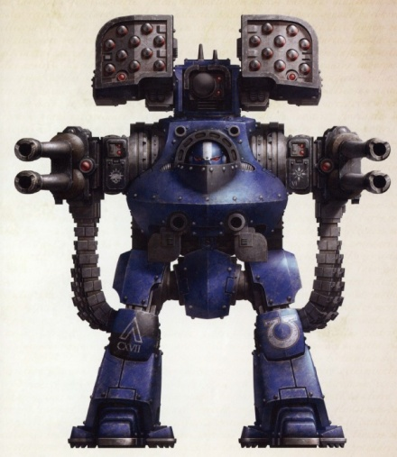
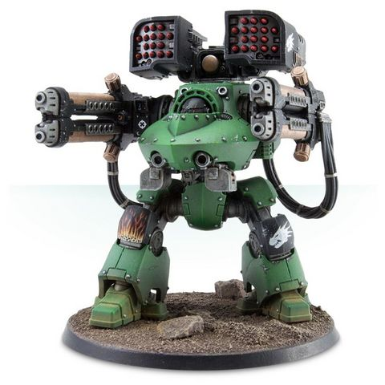
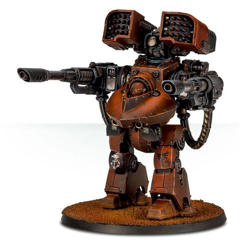
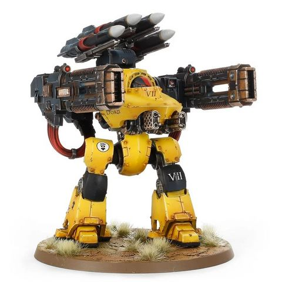

# 1453 德雷都型无畏机甲 Deredeo Pattern Dreadnought

精校状态：中文行文已逐段精校，部分术语仍为暂定

分类：载具 / 地面 / 步行者

原文来源：https://www.bilibili.com/opus/1044403173013323778

原作者：帝国神选罐头

原文时间：2025年03月15日 10:57

[返回分类目录](目录.md) · [全书目录](../../目录.md)

原篇名：德雷都无畏 Deredeo Pattern Dreadnought

<!-- A1453-B0001 -->
**英文原文**

The Deredeo Pattern Dreadnought is a type of Space Marine Dreadnought used during the Great Crusade and Horus Heresy.

<!-- /A1453-B0001 -->

<!-- A1453-B0002 -->

原译文

德雷都型无畏是大远征和荷鲁斯叛乱时期使用的一种星际战士无畏。

**校订译文**

德雷都型无畏机甲是大远征和荷鲁斯之乱时期使用的一种星际战士无畏机甲。

<!-- /A1453-B0002 -->

<!-- A1453-B0003 图片 -->

<!-- A1453-B0004 -->

原译文

Ultramarines Deredeo Dreadnought Marcellus 极限战士德雷都无畏马塞勒斯

**校订译文**

Ultramarines Deredeo Dreadnought Marcellus 极限战士德雷都无畏机甲马塞勒斯

<!-- /A1453-B0004 -->

<!-- A1453-B0005 -->
## Overview 概述

<!-- /A1453-B0005 -->

<!-- A1453-B0006 -->
**英文原文**

The Deredeo pattern Dreadnought was developed as an outgrowth of the same project to improve upon the fusion of Terran and Mechanicum technology which gave birth to the first Legiones Astartes Dreadnoughts, such as the Castraferrum and Lucifer patterns. It shares many core components and systems with the hugely successful Contemptor class, but rather than being a general assault unit, the Deredeo is an expressly designed heavy weapons platform, intended to combine superior firepower with the flexibility and durability of a Dreadnought chassis.

<!-- /A1453-B0006 -->

<!-- A1453-B0007 -->

原译文

德雷都型无畏是同一项目的产物，旨在改进泰拉和机械教技术的融合，从而诞生了第一位阿斯塔特军团无畏，如铸铁和路西法型。它与非常成功的蔑视者级共享许多核心组件和系统，但德雷都不是一个通用突击部队，而是一个专门设计的重型武器平台，旨在将卓越的火力与无畏底盘的灵活性和耐用性相结合。

**校订译文**

最初的阿斯塔特军团无畏机甲，如铸铁型和路西法型，诞生于融合泰拉与机械教技术的研发项目；德雷都型则是该项目继续改进的成果。它与极为成功的蔑视者级共用许多核心部件和系统，但其定位是专用重武器平台，旨在将强大火力与无畏机甲底盘的灵活性、坚固性结合起来。

<!-- /A1453-B0007 -->

<!-- A1453-B0008 图片 -->

<!-- A1453-B0009 -->

原译文

Salamanders Deredeo Dreadnought with Hellfire Plasma Cannonade 火蜥蜴德雷都无畏配备地狱火等离子炮

**校订译文**

Salamanders Deredeo Dreadnought with Hellfire Plasma Cannonade 配备狱火等离子大炮的火蜥蜴德雷都无畏机甲

<!-- /A1453-B0009 -->

<!-- A1453-B0010 -->
**英文原文**

It was initially deployed in limited numbers to each of the Legions, which saw the Deredeo treated as a specialist unit due to difficulties in manufacture, as it proved highly resource intensive to produce and maintain, but its undoubted survivability and killing power saw a resurgence in its use after the initial wave of internecine strife during the Horus Heresy, and it was in high demand by Traitor and Loyalist alike from the few Forge Worlds able to fashion them.

<!-- /A1453-B0010 -->

<!-- A1453-B0011 -->

原译文

它最初以有限的数量部署到每个军团，由于制造困难，德雷都被视为一个专业单位，因为它的生产和维护被证明是高度资源密集型的，但在荷鲁斯叛乱时期的最初一波内战之后，它的生存能力和杀伤力无疑得到了复苏，并且在少数能够制造它们的铸造世界中，叛徒和忠诚者都对它有很高的需求。

**校订译文**

德雷都起初只少量配发给各个军团。由于制造困难，生产与维护又耗费大量资源，它被当作特种作战单位使用。但荷鲁斯之乱最初一轮内斗之后，其可靠的生存能力和杀伤力促使各方重新扩大使用规模。叛徒与忠诚派都迫切希望从少数能够制造德雷都的铸造世界获得更多机体。

**校注：** 英文复苏的是该型号的使用规模，不是其生存能力或杀伤力。

<!-- /A1453-B0011 -->

<!-- A1453-B0012 图片 -->

<!-- A1453-B0013 -->

原译文

Blood Angels Deredeo Dreadnought with twin Arachnus Heavy Lascannons 圣血天使德雷都无畏配备双阿拉克努斯重型激光炮

**校订译文**

Blood Angels Deredeo Dreadnought with twin Arachnus Heavy Lascannons 配备双阿拉克纳斯重型激光炮的圣血天使德雷都无畏机甲

<!-- /A1453-B0013 -->

<!-- A1453-B0014 -->
**英文原文**

The Deredeo pattern Dreadnought, with its formidable carrying capacity and battlefield stability, was once used as a test-bed platform for a number of advanced Legiones Astartes weapons systems, including the Anvilus Autocannon Battery, hellfire plasma cannonade, Arachnus Heavy Lascannon Battery, Volkite Falconet, and the carapace mounted Aiolos missile launcher which was capable of independently targeting enemies. The Deredeo is also capable of mounting Heavy Flamers or Heavy Bolters. For an anti-aircraft role, it is capable of firing Boreas Air Defence Missiles. The Deredeo also features a Helical Targeting Array and Atomantic Shielding.

<!-- /A1453-B0014 -->

<!-- A1453-B0015 -->

原译文

德雷都型无畏以其强大的运载能力和战场稳定性，曾被用作许多先进的阿斯塔特军团武器系统的试验平台，包括安维鲁斯自动炮组、地狱火等离子炮、阿拉克努斯重型激光炮组、爆燃隼炮和能够独立瞄准敌人的背式埃俄罗斯导弹发射器。德雷都还能够安装重型火焰枪或重型爆矢枪。对于防空任务，它能够发射玻瑞亚斯防空导弹。德雷都还具有螺旋目标阵列和原子屏蔽。

**校订译文**

德雷都型无畏机甲拥有很强的负载能力和战场稳定性，曾被用作多种先进阿斯塔特军团武器系统的试验平台，包括安维鲁斯自动炮组、狱火等离子大炮、阿拉克纳斯重型激光炮组、爆燃隼炮，以及能够独立锁定敌人的顶部埃俄罗斯导弹发射器。它还可安装重型火焰喷射器或重型爆矢枪，执行防空任务时则能发射北风防空导弹。此外，德雷都还配有螺旋瞄准阵列和原子护盾。

<!-- /A1453-B0015 -->

<!-- A1453-B0016 图片 -->

<!-- A1453-B0017 -->

原译文

Imperial Fists Deredeo Dreadnought with Boreas Air Defence Missiles and Volkite Falconet 帝国之拳德雷都无畏配备玻瑞亚斯防空导弹和爆燃隼炮

**校订译文**

Imperial Fists Deredeo Dreadnought with Boreas Air Defence Missiles and Volkite Falconet 配备北风防空导弹和爆燃隼炮的帝国之拳德雷都无畏机甲

<!-- /A1453-B0017 -->

<!-- A1453-B0018 -->
## Notable Deredeo Dreadnoughts 著名德雷都无畏机甲

原题：Notable Deredeo Dreadnoughts 著名德雷都无畏

<!-- /A1453-B0018 -->

<!-- A1453-B0019 -->
**英文原文**

Argan - Ultramarines

<!-- /A1453-B0019 -->

<!-- A1453-B0020 -->

原译文

阿尔甘 - 极限战士

**校订译文**

阿尔甘 - 极限战士

<!-- /A1453-B0020 -->

<!-- A1453-B0021 -->
**英文原文**

Menarrio - Ultramarines

<!-- /A1453-B0021 -->

<!-- A1453-B0022 -->

原译文

梅纳里奥 - 极限战士

**校订译文**

梅纳里奥 - 极限战士

<!-- /A1453-B0022 -->

<!-- A1453-B0023 -->
**英文原文**

Thaxxos - World Eaters

<!-- /A1453-B0023 -->

<!-- A1453-B0024 -->

原译文

萨索斯 - 吞世者

**校订译文**

萨索斯 - 吞世者

<!-- /A1453-B0024 -->

本篇核心术语与暂定项

以下列出本篇出现的英文原形及核心术语表用词。同形词可能指不同对象，具体词义以本篇正文和校注为准；单复数、别名和仅见于图注的名称可能尚未列入。完整候选见[术语表](../../术语表/双语术语候选.csv)。

| 英文 | 采用中文 | 状态 |
| --- | --- | --- |
| World Eaters | 吞世者 | 官方已核对 |
| Ultramarines | 极限战士 | 官方已核对 |
| Horus Heresy | 荷鲁斯之乱 | 官方已核对 |
| Mechanicum | 机械教 | 暂定·历史称谓 |
| Great Crusade | 大远征 | 暂定·官方待核 |
| Horus | 荷鲁斯 | 暂定·官方待核 |
| Legiones Astartes | 阿斯塔特军团 | 暂定·官方待核 |
| Space Marine | 星际战士 | 暂定·官方待核 |
| Flamers | 火妖（奸奇单位）／火焰喷射器（武器） | 语境定译·对应官译已核 |
| Dreadnought | 无畏机甲 | 暂定·官方待核 |
| Argan | 阿尔甘 | 暂定·官方待核 |
| Boreas | 波瑞亚斯 | 暂定·官方待核 |
| Arachnus | 阿拉克纳斯 | 暂定·官方待核 |
| Missile Launcher | 导弹发射器 | 暂定·官方待核 |
| Autocannon | 自动炮 | 暂定·官方待核 |
| Anvilus Autocannon Battery | 安维鲁斯自动炮组 | 暂定·官方待核 |
| Anvilus | 安维鲁斯 | 暂定·官方待核 |
| Hellfire Plasma Cannonade | 狱火等离子大炮 | 暂定·官方待核 |
| Arachnus Heavy Lascannon | 阿拉克纳斯重型激光炮 | 暂定·官方待核 |
| Lascannon | 激光炮 | 官方已核对 |
| Volkite Falconet | 爆燃隼炮 | 暂定·官方待核 |
| Atomantic Shielding | 原子护盾 | 暂定·官方待核 |
| Deredeo Pattern Dreadnought | 德雷都型无畏机甲 | 暂定·官方待核 |
| Helical Targeting Array | 螺旋瞄准阵列 | 暂定·官方待核 |
| Aiolos missile launcher | 埃俄罗斯导弹发射器 | 暂定·官方待核 |

