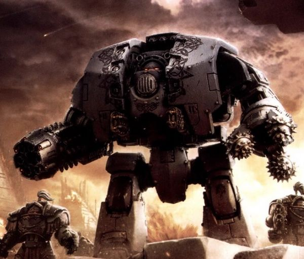
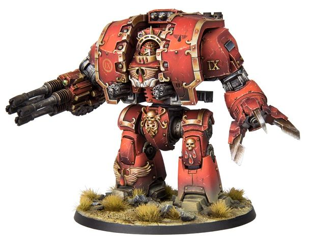
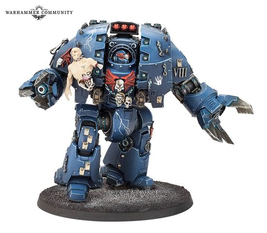
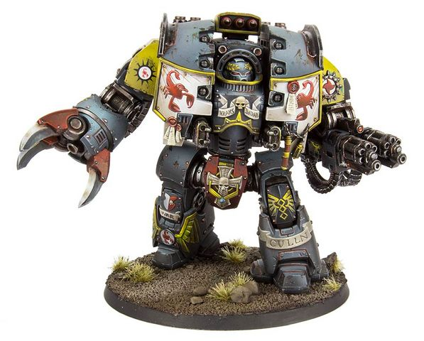

# 1455 利维坦攻城无畏机甲 Leviathan pattern Siege Dreadnought

精校状态：中文行文已逐段精校，部分术语仍为暂定

分类：载具 / 地面 / 步行者

原文来源：https://www.bilibili.com/opus/1044403258926301207

原作者：帝国神选罐头

原文时间：2025年03月15日 10:58

[返回分类目录](目录.md) · [全书目录](../../目录.md)

原篇名：利维坦攻城无畏 Leviathan pattern Siege Dreadnought

<!-- A1455-B0001 -->
**英文原文**

The Leviathan pattern Siege Dreadnought was a large type of Space Marine Dreadnought used during the Great Crusade and Horus Heresy by the Legiones Astartes.

<!-- /A1455-B0001 -->

<!-- A1455-B0002 -->

原译文

利维坦型攻城无畏是阿斯塔特军团在大远征和荷鲁斯叛乱期间使用的一种大型星际战士无畏。

**校订译文**

利维坦型攻城无畏机甲是阿斯塔特军团在大远征和荷鲁斯之乱期间使用的一种大型星际战士无畏机甲。

<!-- /A1455-B0002 -->

<!-- A1455-B0003 图片 -->

<!-- A1455-B0004 -->

原译文

Space Wolves Leviathan Siege Dreadnought 太空野狼利维坦攻城无畏

**校订译文**

Space Wolves Leviathan Siege Dreadnought 太空野狼利维坦攻城无畏机甲

<!-- /A1455-B0004 -->

<!-- A1455-B0005 -->
## Overview 概述

<!-- /A1455-B0005 -->

<!-- A1455-B0006 -->
**英文原文**

Built in limited numbers during the latter days of the Crusade, the Leviathan was developed in secret on Terra without the knowledge of the Mechanicum. Its massive frame incorporates hybridised technologies, some dating back to the Dark Age of Technology. The resources to build these machines were nearly equal to that of a Knight. They were made available to the Legions only in limited quantities before the outbreak of the Horus Heresy and were highly valued and recognised as savagely powerful siege and hunter-killer units. The First Legion alone were able to field these machine’s in great numbers, as no other Legion held the resources nor the means to commit so many to action, but even then they were still used sparingly by the Dark Angels. Many in the Mechanicum were deeply uneasy over the design, seeing it as purposed-designed to match and destroy the Mechanicum's own battle-automata in some future, unforeseen crisis or dispute. Towering over later Imperial walker patterns, this heavily armoured dreadnought is savagely powerful and powered by an potent Atomantic Arc Reactor.

<!-- /A1455-B0006 -->

<!-- A1455-B0007 -->

原译文

在大远征后期建造的数量有限，利维坦是在机械神教不知情的情况下在泰拉上秘密开发的。其巨大的框架融合了混合技术，其中一些可以追溯到黑暗技术时代。制造这些机器的资源几乎相当于一个骑士的资源。在荷鲁斯叛乱爆发之前，他们只向军团提供了有限的数量，并且被高度重视和认可为野蛮强大的攻城和猎杀单位。只有第一军团能够大量部署这些机械，因为没有其他军团拥有资源或手段来投入如此多进入行动，但即使如此，黑暗天使仍然很少使用它们。机械神教中的许多人对这个设计深感不安，认为它是有目的的，旨在在未来的某个不可预见的危机或争议中匹配和摧毁机械神教自己的战斗机兵。这种重甲无畏超越了后来的帝国步行者型，威力凶猛，由强大的原子电弧反应堆提供动力。

**校订译文**

利维坦在泰拉秘密研制，机械教对此并不知情；大远征后期，只有少量机体建成。其庞大的躯体融合了多种技术，其中一些可追溯至科技黑暗时代，建造一台所需的资源几乎相当于一台骑士机甲。荷鲁斯之乱爆发前，各军团只能获得少量利维坦，但都十分珍视这些威力凶猛的攻城与猎杀单位。只有第一军团具备大规模部署它们的资源和手段，即便如此，黑暗天使也极为节制地使用这些机体。机械教内不少人对此设计深感不安，认为它是专为某场尚不可预见的未来危机或冲突而造，目的是匹敌并摧毁机械教自己的战斗自动机兵。这种重装甲无畏比帝国后来的步行机甲型号更高大，由强劲的原子电弧反应堆驱动，破坏力惊人。

**校注：** towering over 指体形高大，原译“超越”易误读为所有性能均胜出；按原文明确空间关系。

<!-- /A1455-B0007 -->

<!-- A1455-B0008 -->
**英文原文**

During the Horus Heresy, Loyalists with access to Terra were able to obtain new Leviathan Dreadnoughts, although never many, while Traitors and isolated forces were reduced to marshalling their few Leviathans carefully or hunting down relics of the dead from battlefields to be recommissioned.

<!-- /A1455-B0008 -->

<!-- A1455-B0009 -->

原译文

在荷鲁斯叛乱时期，可以进入泰拉的忠诚派能够获得新的利维坦无畏，尽管数量不多，而叛徒和孤立的部队则小心翼翼地组织他们为数不多的利维坦，或者从战场上狩猎死者的遗物以重新服役。

**校订译文**

荷鲁斯之乱期间，仍能与泰拉往来的忠诚派可以获得新的利维坦无畏机甲，尽管数量始终不多。叛徒及孤立无援的部队则只能谨慎调配手中少数机体，或在战场上搜寻阵亡者遗留的机体，设法修复并重新投入使用。

<!-- /A1455-B0009 -->

<!-- A1455-B0010 图片 -->

<!-- A1455-B0011 -->

原译文

Blood Angels Leviathan Dreadnought 圣血天使利维坦无畏

**校订译文**

Blood Angels Leviathan Dreadnought 圣血天使利维坦无畏机甲

<!-- /A1455-B0011 -->

<!-- A1455-B0012 -->
**英文原文**

Those few Leviathan Dreadnoughts that survive into the 41st Millennium are ancient and terrible relics, rarely spoken of and rarely deployed, dreaded as much as they are revered by those Chapters that possess them. The tormented and ravaged minds of those interred within are driven to the edge of madness by the little-understood mechanisms unique to the Leviathan, trapped in dreams of the Heresy which haunt the machines themselves, and soon suffer a final dissolution owing to the terrible strain the Leviathan inflicts on those who would dare to master it. Only the full authority of a Chapter Master is sufficient to unleash these terrifying machines in war, as where they strike and what they kill is as often determined by their dark dreaming as it is the will of their commanders.

<!-- /A1455-B0012 -->

<!-- A1455-B0013 -->

原译文

那些幸存到第41个千年的少数利维坦无畏是古老而可怕的圣物，很少被提及，也很少被部署，尽管它们受到拥有它们的战团的尊敬，但它们同样可怕。那些被埋葬在里面的人的痛苦和被蹂躏的思维被利维坦独有的鲜为人知的机制推向了疯狂的边缘，被困在困扰机械本身的叛乱梦境中，由于利维坦给那些敢于掌握它的人带来了可怕的压力，最终很快就会解体。只有战团长的完全权威才足以在战争中释放这些可怕的机器，因为它们的攻击地点和杀死的东西往往取决于它们的黑暗梦境，也取决于它们指挥官的意愿。

**校订译文**

幸存至第41千年的少数利维坦无畏机甲，都是古老而恐怖的遗物。拥有它们的战团既敬畏又恐惧这些机体，鲜少提及，也很少部署。利维坦特有而又鲜为人知的机构，使内部驾驶员备受折磨、饱经摧残的心智濒临疯狂。他们被困在萦绕机体的荷鲁斯之乱梦魇中，并因操控利维坦承受的可怕压力而迅速走向彻底崩溃。只有战团长亲自下令，才能将这些恐怖机器投入战争；它们选择的攻击地点与杀戮目标，往往既受指挥官意志支配，也受自身阴暗梦魇摆布。

**校注：** 最终崩溃的是驾驶员心智，原译“解体”易误指机甲；修正指代。

<!-- /A1455-B0013 -->

<!-- A1455-B0014 -->
**英文原文**

While the Leviathan is extremely rare today, some machines still remain in service. Most notable is Carab Culln, Chapter Master of the Red Scorpions. Chaos Space Marines still use ancient Leviathan Dreadnoughts, which have since become Daemonically corrupted.

<!-- /A1455-B0014 -->

<!-- A1455-B0015 -->

原译文

虽然利维坦在如今极为罕见，但一些机械仍在使用中。最著名的是卡拉布·库伦，红蝎的战团长。混沌星际战士仍然使用古老的利维坦无畏，这些无畏已经被恶魔腐蚀。

**校订译文**

利维坦如今已极为罕见，但仍有少数机体在服役，其中最著名的驾驶员是红蝎战团长卡拉布·库伦。混沌星际战士也继续使用古老的利维坦无畏机甲，只是这些机体已遭恶魔腐化。

<!-- /A1455-B0015 -->

<!-- A1455-B0016 -->
## Weapons and Equipment 武器与装备

<!-- /A1455-B0016 -->

<!-- A1455-B0017 -->
**英文原文**

The Leviathan Siege Dreadnought bristled with weaponry, including two arm mounts that could be equipped with a combination of:

<!-- /A1455-B0017 -->

<!-- A1455-B0018 -->

原译文

利维坦攻城无畏装备了武器，包括两个可以配备以下组合的臂架：

**校订译文**

利维坦攻城无畏机甲遍布武器，两条机械臂的挂架可组合安装以下装备：

<!-- /A1455-B0018 -->

<!-- A1455-B0019 -->

原译文

Ranged weapons: 远程武器

**校订译文**

Ranged weapons: 远程武器

<!-- /A1455-B0019 -->

<!-- A1455-B0020 -->

原译文

Leviathan Storm Cannon 利维坦风暴炮

**校订译文**

Leviathan Storm Cannon 利维坦风暴炮

<!-- /A1455-B0020 -->

<!-- A1455-B0021 -->

原译文

Grav Flux Bombard 重力通量轰击炮

**校订译文**

Grav Flux Bombard 重力通量轰击炮

<!-- /A1455-B0021 -->

<!-- A1455-B0022 -->

原译文

Cyclonic Melta Lance 旋风热熔光矛

**校订译文**

Cyclonic Melta Lance 旋风热熔光矛

<!-- /A1455-B0022 -->

<!-- A1455-B0023 -->
**英文原文**

The Leviathan Dreadnought interning Carab Culln in M41 was instead equipped with twin-linked Assault Cannons.

<!-- /A1455-B0023 -->

<!-- A1455-B0024 -->

原译文

在M41，利维坦无畏卡拉布·库伦配备了双联突击炮。

**校订译文**

第41千年，安置着卡拉布·库伦的利维坦无畏机甲则配备了双联突击炮。

<!-- /A1455-B0024 -->

<!-- A1455-B0025 -->

原译文

Melee weapons: 近战武器

**校订译文**

Melee weapons: 近战武器

<!-- /A1455-B0025 -->

<!-- A1455-B0026 -->

原译文

Leviathan Siege Claw 利维坦攻城爪

**校订译文**

Leviathan Siege Claw 利维坦攻城爪

<!-- /A1455-B0026 -->

<!-- A1455-B0027 -->

原译文

Leviathan Siege Drill 利维坦攻城钻

**校订译文**

Leviathan Siege Drill 利维坦攻城钻

<!-- /A1455-B0027 -->

<!-- A1455-B0028 -->
**英文原文**

Melee weapons would incorporate a meltagun.

<!-- /A1455-B0028 -->

<!-- A1455-B0029 -->

原译文

近战武器将内含一个热熔枪。

**校订译文**

近战武器中内置一把热熔枪。

<!-- /A1455-B0029 -->

<!-- A1455-B0030 图片 -->

<!-- A1455-B0031 -->

原译文

Night Lords Leviathan Dreadnought 午夜领主利维坦无畏

**校订译文**

Night Lords Leviathan Dreadnought 午夜领主利维坦无畏机甲

<!-- /A1455-B0031 -->

<!-- A1455-B0032 -->
**英文原文**

Its torso was equipped with a pair of Heavy Flamers or twin-linked Volkite Calivers. Additional weaponry could include up to three Hunter-Killer Missiles and/or a Phosphex Bomb discharger. Finally, it would typically be armed with frag and smoke grenades, as well as a spotlight.

<!-- /A1455-B0032 -->

<!-- A1455-B0033 -->

原译文

它的躯干配备了一对重型火焰枪或双联爆燃铳。其他武器可能包括最多三枚猎杀飞弹和/或一枚磷化炸弹发射器。最后，它通常会配备破片和烟雾弹，以及聚光灯。

**校订译文**

躯干上装有一对重型火焰喷射器或双联爆燃铳。机体还可加装至多三枚猎杀导弹，以及磷化炸弹发射器，二者也可同时配备。通常还备有破片榴弹、烟雾弹和探照灯。

<!-- /A1455-B0033 -->

<!-- A1455-B0034 -->
**英文原文**

They were also equipped with reinforced Atomantic Shielding, which was considered to be the most resilient Field augmented protection of any Dreadnought created during the Great Crusade, as well as having the most dangerously powerful on-board reactor to meet its needs.

<!-- /A1455-B0034 -->

<!-- A1455-B0035 -->

原译文

它们还配备了强化的原子屏蔽，这被认为是大远征期间制造的任何无畏中最具韧性的野战增强保护，并且拥有最危险的强大机载反应堆来满足其需求。

**校订译文**

利维坦还配备强化原子护盾，被认为拥有大远征时期所有无畏机甲中最坚韧的力场增强防护。为了满足这些系统的需求，它也搭载了功率最强、危险性最高的机载反应堆。

**校注：** Field 指防护力场，不是野战。

<!-- /A1455-B0035 -->

<!-- A1455-B0036 -->
## Notable Leviathan Dreadnoughts 著名利维坦无畏机甲

原题：Notable Leviathan Dreadnoughts 著名利维坦无畏

<!-- /A1455-B0036 -->

<!-- A1455-B0037 -->
**英文原文**

Carab Culln — Red Scorpions

<!-- /A1455-B0037 -->

<!-- A1455-B0038 -->

原译文

卡拉布·库伦 — 红蝎

**校订译文**

卡拉布·库伦 — 红蝎

<!-- /A1455-B0038 -->

<!-- A1455-B0039 图片 -->

<!-- A1455-B0040 -->

原译文

Carab Culln 卡拉布·库伦

**校订译文**

Carab Culln 卡拉布·库伦

<!-- /A1455-B0040 -->

<!-- A1455-B0041 -->
**英文原文**

Jophial - Blood Angels

<!-- /A1455-B0041 -->

<!-- A1455-B0042 -->

原译文

约斐尔 - 圣血天使

**校订译文**

约斐尔 - 圣血天使

<!-- /A1455-B0042 -->

<!-- A1455-B0043 -->
**英文原文**

Hrimthursar Arn Therod — Space Wolves, took part in the Burning of Prospero.

<!-- /A1455-B0043 -->

<!-- A1455-B0044 -->

原译文

冰霜巨人的阿恩·塞罗德 — 太空野狼，参加了普罗斯佩罗之焚

**校订译文**

“冰霜巨人”阿恩·塞罗德——太空野狼，参加过普罗斯佩罗之焚。

<!-- /A1455-B0044 -->

<!-- A1455-B0045 -->
**英文原文**

Krixxus — World Eaters

<!-- /A1455-B0045 -->

<!-- A1455-B0046 -->

原译文

克里克苏斯 — 吞世者

**校订译文**

克里克苏斯 — 吞世者

<!-- /A1455-B0046 -->

<!-- A1455-B0047 -->
**英文原文**

Prabaxus — Iron Hands

<!-- /A1455-B0047 -->

<!-- A1455-B0048 -->

原译文

普拉巴克苏斯 — 钢铁之手

**校订译文**

普拉巴克苏斯 — 钢铁之手

<!-- /A1455-B0048 -->

本篇核心术语与暂定项

以下列出本篇出现的英文原形及核心术语表用词。同形词可能指不同对象，具体词义以本篇正文和校注为准；单复数、别名和仅见于图注的名称可能尚未列入。完整候选见[术语表](../../术语表/双语术语候选.csv)。

| 英文 | 采用中文 | 状态 |
| --- | --- | --- |
| Space Marines | 星际战士 | 官方已核对 |
| Blood Angels | 圣血天使 | 官方已核对 |
| Dark Angels | 黑暗天使 | 官方已核对 |
| Space Wolves | 太空野狼 | 官方已核对 |
| Chaos Space Marines | 混沌星际战士 | 官方已核对 |
| World Eaters | 吞世者 | 官方已核对 |
| Horus Heresy | 荷鲁斯之乱 | 官方已核对 |
| Mechanicum | 机械教 | 暂定·历史称谓 |
| Dark Age of Technology | 黑暗科技时代 | 暂定 |
| Great Crusade | 大远征 | 暂定·官方待核 |
| Terra | 泰拉 | 暂定·官方待核 |
| Horus | 荷鲁斯 | 暂定·官方待核 |
| Iron Hands | 钢铁之手 | 暂定·官方待核 |
| Hunter-Killer | 猎杀者 | 暂定·官方待核 |
| Legiones Astartes | 阿斯塔特军团 | 暂定·官方待核 |
| Master | 导师（审判庭职衔）／舰务官（舰员职务） | 语境定译·官方待核 |
| Ancient | 旗手 | 官方已核对 |
| Space Marine | 星际战士 | 暂定·官方待核 |
| Chapter | 战团 | 暂定·官方待核 |
| Chapter Master | 战团长 | 暂定·官方待核 |
| Red Scorpions | 红蝎 | 暂定·官方待核 |
| Carab Culln | 卡拉布·库伦 | 暂定·官方待核 |
| Tormented | 煎熬 | 暂定·官方待核 |
| Flamers | 火妖（奸奇单位）／火焰喷射器（武器） | 语境定译·对应官译已核 |
| Strain | 群系 | 暂定·官方待核 |
| Dreadnought | 无畏机甲 | 暂定·官方待核 |
| The Dark | 《黑暗》 | 暂定·官方待核 |
| Phosphex | 磷化燃剂 | 暂定·官方待核 |
| Phosphex Bomb | 磷化炸弹 | 暂定·官方待核 |
| Meltagun | 热熔枪 | 官方已核对 |
| Atomantic Shielding | 原子护盾 | 暂定·官方待核 |
| Leviathan pattern Siege Dreadnought | 利维坦型攻城无畏机甲 | 暂定·官方待核 |
| Resilient | 坚韧号 | 暂定·官方待核 |
| Siege Dreadnought | 攻城无畏机甲 | 暂定·官方待核 |

