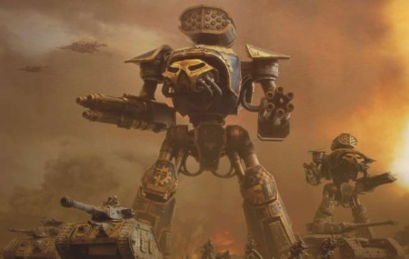

# 1456 泰坦 Titan

精校状态：中文行文已逐段精校，部分术语仍为暂定

分类：载具 / 地面 / 步行者

原文来源：https://www.bilibili.com/opus/1191811647553929253

原作者：帝国神选罐头

原文时间：2026年04月16日 16:37

[返回分类目录](目录.md) · [全书目录](../../目录.md)

<!-- A1456-B0001 -->
**英文原文**

Titans are immense war machines built in humanoid form. Most of the major races and forces of the galaxy utilize their own forms of Titans.

<!-- /A1456-B0001 -->

<!-- A1456-B0002 -->

原译文

泰坦是以人形建造的巨大战争机器。银河系的大多数主要种族和势力都使用自己的泰坦形态。

**校订译文**

泰坦是外形仿照人形建造的巨大战争机器。银河系大多数主要种族与势力都使用各自的泰坦。

<!-- /A1456-B0002 -->

<!-- A1456-B0003 图片 -->

<!-- A1456-B0004 -->

原译文

Reaver Battle Titan in action 行动中的掠夺者战斗泰坦

**校订译文**

Reaver Battle Titan in action 作战中的掠夺者级战斗泰坦

<!-- /A1456-B0004 -->

<!-- A1456-B0005 -->
## Imperial Titans 帝国泰坦

<!-- /A1456-B0005 -->

<!-- A1456-B0006 -->
**英文原文**

Imperial Titans are known as God-Engines and are controlled by the Collegia Titanica, a powerful military arm of the Adeptus Mechanicus. The Collegia oversees the various Titan Legions, each of which are based on a Forge World. Titans originally began as Human technology to allow settlers on new worlds to function in hostile environments, but today the god-engines are the most powerful fighting machines of the forces of the Emperor. The construction of Imperial Titans takes many years, and many of the more complex designs are considered lost technology.

<!-- /A1456-B0006 -->

<!-- A1456-B0007 -->

原译文

帝国泰坦被称为神之引擎，由机械神教的强大军事武装泰坦修会控制。修会负责监督各个泰坦军团，每个军团都基于一个铸造世界。泰坦最初是人类的技术，允许新世界的定居者在敌对环境中运作，但今天，神之引擎是帝皇的部队中最强大的战斗机械。帝国泰坦的建造需要很多年，许多更复杂的设计被认为是失落技术。

**校订译文**

帝国泰坦被称为“神之引擎”，由机械修会麾下强大的军事机构泰坦修会掌管。泰坦修会监管各支泰坦军团，每支军团都以一个铸造世界为基地。泰坦最初源于人类开发的一项技术，用来帮助新世界的定居者在恶劣环境中作业；如今，这些神之引擎已成为帝皇麾下最强大的战争机器。建造帝国泰坦需要多年时间，许多更复杂型号的设计技术被认为已经失传。

<!-- /A1456-B0007 -->

<!-- A1456-B0008 -->
### Imperial Titan Classes 帝国泰坦类别

<!-- /A1456-B0008 -->

<!-- A1456-B0009 -->

原译文

Warhound Scout Titan 战犬侦察泰坦

**校订译文**

Warhound Scout Titan 战犬级侦察泰坦

<!-- /A1456-B0009 -->

<!-- A1456-B0010 -->

原译文

Rapier Scout Titan 轻剑侦查泰坦

**校订译文**

Rapier Scout Titan 刺剑侦察泰坦

<!-- /A1456-B0010 -->

<!-- A1456-B0011 -->

原译文

Reaver Battle Titan 掠夺者战斗泰坦

**校订译文**

Reaver Battle Titan 掠夺者级战斗泰坦

<!-- /A1456-B0011 -->

<!-- A1456-B0012 -->

原译文

Dire Wolf Heavy Scout Titan 恐狼重型侦查泰坦

**校订译文**

Dire Wolf Heavy Scout Titan 恐狼重型侦察泰坦

<!-- /A1456-B0012 -->

<!-- A1456-B0013 -->

原译文

Punisher Titan 惩罚者泰坦

**校订译文**

Punisher Titan 惩罚者泰坦

<!-- /A1456-B0013 -->

<!-- A1456-B0014 -->

原译文

Executor Titan 执行者泰坦

**校订译文**

Executor Titan 执行者泰坦

<!-- /A1456-B0014 -->

<!-- A1456-B0015 -->

原译文

Warbringer Nemesis Battle Titan 战争使者复仇女神战斗泰坦

**校订译文**

Warbringer Nemesis Battle Titan 战争使者型天罚级战斗泰坦

<!-- /A1456-B0015 -->

<!-- A1456-B0016 -->

原译文

Warlord Battle Titan 军阀战斗泰坦

**校订译文**

Warlord Battle Titan 战将级战斗泰坦

<!-- /A1456-B0016 -->

<!-- A1456-B0017 -->

原译文

Psi-Titan 灵能泰坦

**校订译文**

Psi-Titan 灵能泰坦

<!-- /A1456-B0017 -->

<!-- A1456-B0018 -->

原译文

Warmaster Titan 战帅泰坦

**校订译文**

Warmaster Titan 战帅泰坦

<!-- /A1456-B0018 -->

<!-- A1456-B0019 -->

原译文

Warmaster Iconoclast Titan 战帅圣像破坏者泰坦

**校订译文**

Warmaster Iconoclast Titan 战帅圣像破坏者泰坦

<!-- /A1456-B0019 -->

<!-- A1456-B0020 -->

原译文

Emperor Titan 帝皇泰坦

**校订译文**

Emperor Titan 帝皇泰坦

<!-- /A1456-B0020 -->

<!-- A1456-B0021 -->

原译文

Imperator Titan 统治者泰坦

**校订译文**

Imperator Titan 统治者泰坦

<!-- /A1456-B0021 -->

<!-- A1456-B0022 -->

原译文

Warmonger Titan 好战者泰坦

**校订译文**

Warmonger Titan 好战者泰坦

<!-- /A1456-B0022 -->

<!-- A1456-B0023 -->

原译文

Siege Titan 攻城泰坦

**校订译文**

Siege Titan 攻城泰坦

<!-- /A1456-B0023 -->

<!-- A1456-B0024 -->

原译文

Apocalypse Titan 启示录泰坦

**校订译文**

Apocalypse Titan 启示录泰坦

<!-- /A1456-B0024 -->

<!-- A1456-B0025 -->

原译文

Mirage Titan 蜃景泰坦

**校订译文**

Mirage Titan 蜃景泰坦

<!-- /A1456-B0025 -->

<!-- A1456-B0026 -->

原译文

Komodo Titan 科莫多泰坦

**校订译文**

Komodo Titan 科莫多泰坦

<!-- /A1456-B0026 -->

<!-- A1456-B0027 -->

原译文

Carnivore Titan 食肉者泰坦

**校订译文**

Carnivore Titan 食肉者泰坦

<!-- /A1456-B0027 -->

<!-- A1456-B0028 -->

原译文

Warrior Titan 勇士泰坦

**校订译文**

Warrior Titan 勇士泰坦

<!-- /A1456-B0028 -->

<!-- A1456-B0029 -->
## Chaos Titans 混沌泰坦

<!-- /A1456-B0029 -->

<!-- A1456-B0030 -->
**英文原文**

The forces of Chaos utilize Titans largely derived from those of the Imperium. These are operated by the Traitor Titan Legions and maintained by the Dark Mechanicus. Many of these Titan engines have become corrupted over the years by the powers of the Warp and are now furious engines of hate possessed by Daemons, their pilot little more than a slave to the machine. Chaos Titans are heavily mutated, often sprouting tails or techno-organic appendages.

<!-- /A1456-B0030 -->

<!-- A1456-B0031 -->

原译文

混沌部队主要利用了来自帝国的泰坦。这些由叛徒泰坦军团操作，由黑暗机械教维护。多年来，许多泰坦引擎已经被亚空间的力量腐化，现在是恶魔占据的狂怒憎恨引擎，他们的驾驶员只不过是机器的奴隶。混沌泰坦是严重变异的，经常长出尾巴或技术有机副肢。

**校订译文**

混沌势力使用的泰坦大多源自帝国型号，由叛徒泰坦军团操控，黑暗机械教负责维护。多年来，其中许多机体已遭亚空间力量腐化，变成被恶魔附身、满怀狂怒与憎恨的战争机器，驾驶员几乎沦为机体的奴隶。混沌泰坦常发生严重变异，长出尾巴或机械与有机组织混合的附肢。

<!-- /A1456-B0031 -->

<!-- A1456-B0032 -->
### Chaos Titan Classes 混沌泰坦类别

原题：Chaos Titan Classes 混沌骑士类别

**校注：** 英文为 Chaos Titan Classes，原译误为混沌骑士类别。

<!-- /A1456-B0032 -->

<!-- A1456-B0033 -->

原译文

Feral Scout Titan 野蛮侦查泰坦

**校订译文**

Feral Scout Titan 野蛮侦察泰坦

<!-- /A1456-B0033 -->

<!-- A1456-B0034 -->

原译文

Ravager Titan 蹂躏者泰坦

**校订译文**

Ravager Titan 蹂躏者泰坦

<!-- /A1456-B0034 -->

<!-- A1456-B0035 -->

原译文

Chaos Reaver Titan 混沌掠夺者泰坦

**校订译文**

Chaos Reaver Titan 混沌掠夺者级泰坦

<!-- /A1456-B0035 -->

<!-- A1456-B0036 -->

原译文

Warbringer Nemesis Titan 战争使者复仇女神泰坦

**校订译文**

Warbringer Nemesis Titan 战争使者型天罚级泰坦

<!-- /A1456-B0036 -->

<!-- A1456-B0037 -->

原译文

Chaos Warlord Titan 混沌军阀泰坦

**校订译文**

Chaos Warlord Titan 混沌战将级泰坦

<!-- /A1456-B0037 -->

<!-- A1456-B0038 -->

原译文

Banelord Titan 灾祸领主泰坦

**校订译文**

Banelord Titan 灾祸领主泰坦

<!-- /A1456-B0038 -->

<!-- A1456-B0039 -->

原译文

Plaguelord Titan 瘟疫领主泰坦

**校订译文**

Plaguelord Titan 瘟疫领主泰坦

<!-- /A1456-B0039 -->

<!-- A1456-B0040 -->

原译文

Warmaster Titan 战帅泰坦

**校订译文**

Warmaster Titan 战帅泰坦

<!-- /A1456-B0040 -->

<!-- A1456-B0041 -->

原译文

Emperor Titan 帝皇泰坦

**校订译文**

Emperor Titan 帝皇泰坦

<!-- /A1456-B0041 -->

<!-- A1456-B0042 -->

原译文

Reviler Titan 辱骂者泰坦

**校订译文**

Reviler Titan 辱骂者泰坦

<!-- /A1456-B0042 -->

<!-- A1456-B0043 -->

原译文

Questor 探索者

**校订译文**

Questor 探索者

<!-- /A1456-B0043 -->

<!-- A1456-B0044 -->

原译文

Subjugator 征服者

**校订译文**

Subjugator 征服者

<!-- /A1456-B0044 -->

<!-- A1456-B0045 -->
### Titan-class Daemons 泰坦级恶魔

<!-- /A1456-B0045 -->

<!-- A1456-B0046 -->

原译文

Daemon Behemoth 恶魔巨兽

**校订译文**

Daemon Behemoth 恶魔巨兽

<!-- /A1456-B0046 -->

<!-- A1456-B0047 -->
## Craftworld Eldar Titans 方舟世界灵族泰坦

<!-- /A1456-B0047 -->

<!-- A1456-B0048 -->
**英文原文**

Craftworld Eldar Titans are tall, slender, and graceful and built around an Infinity Circuit housed within a skeleton of psycho-plastic known as Wraithbone. They benefit not only from the experiences of their crews, who are most often brought up within Titan Clans from birth, but the collective conciousness of their ancestors within the large Spirit Stone at its core. This gives Eldar Titans a consciousness of their own.

<!-- /A1456-B0048 -->

<!-- A1456-B0049 -->

原译文

方舟世界灵族泰坦高大、苗条、优雅，围绕着一个无限回路建造，该回路位于一个被称为灵骨的灵能塑型骨架内。他们不仅受益于他们的乘员的经验，他们从出生起就经常在泰坦氏族中长大，而且受益于他们先祖在其核心的大灵石中的集体意识。这让灵族泰坦有了自己的意识。

**校订译文**

方舟世界灵族的泰坦高大修长，姿态优雅。机体围绕无限回路建造，回路位于一种名为灵骨的灵能可塑材料骨架中。驾驶员大多自出生起便在泰坦氏族中成长，积累了丰富经验；此外，机体核心的巨大灵石中还保存着祖先的集体意识。二者共同作用，使灵族泰坦拥有了自身的意识。

<!-- /A1456-B0049 -->

<!-- A1456-B0050 -->
### Craftworld Eldar Titan Classes 方舟世界灵族泰坦类别

<!-- /A1456-B0050 -->

<!-- A1456-B0051 -->

原译文

Warlock Battle Titan 战巫战斗泰坦

**校订译文**

Warlock Battle Titan 战巫战斗泰坦

<!-- /A1456-B0051 -->

<!-- A1456-B0052 -->

原译文

Phantom Battle Titan 幻影战斗泰坦

**校订译文**

Phantom Battle Titan 幻影战斗泰坦

<!-- /A1456-B0052 -->

<!-- A1456-B0053 -->

原译文

Revenant Scout Titan 亡魂侦查泰坦

**校订译文**

Revenant Scout Titan 亡魂侦察泰坦

<!-- /A1456-B0053 -->

<!-- A1456-B0054 -->
## Dark Eldar Titans 黑暗灵族泰坦

<!-- /A1456-B0054 -->

<!-- A1456-B0055 -->
**英文原文**

The Dark Eldar are known to operate a twisted version of the Phantom Titan used by the Craftworld Eldar.

<!-- /A1456-B0055 -->

<!-- A1456-B0056 -->

原译文

众所周知，黑暗灵族操作着方舟世界灵族使用的幻影泰坦的扭曲版本。

**校订译文**

已知黑暗灵族使用一种由方舟世界灵族幻影泰坦扭曲改造而来的型号。

<!-- /A1456-B0056 -->

<!-- A1456-B0057 -->
### Types of Dark Eldar Titans 黑暗灵族泰坦的类别

<!-- /A1456-B0057 -->

<!-- A1456-B0058 -->

原译文

Shadow Stalker Titan 暗影追猎者泰坦

**校订译文**

Shadow Stalker Titan 暗影追猎者泰坦

<!-- /A1456-B0058 -->

<!-- A1456-B0059 -->
## Ork Titans 欧克泰坦

<!-- /A1456-B0059 -->

<!-- A1456-B0060 -->
**英文原文**

Ork Titans are normally given the classification of Gargant. These are ramshackle warmachines that begin to appear in particularly successful Waaagh!'s and are religious totems to honour Gork and Mork. Gargants are miracles of Ork ingenuity, built by prodigious Mekboyz and crewed by a combination of Orks, Gretchin, and Snotlings. Though crudely built, they carry awesome firepower and bizarre technologies.

<!-- /A1456-B0060 -->

<!-- A1456-B0061 -->

原译文

欧克泰坦通常被归类为加冈特。这些摇摇欲坠的战争机器开始出现在特别成功的Waaagh！是纪念搞哥和毛哥的宗教图腾。加冈特是欧克独创性的奇迹，由惊人的技师小子建造，由欧克、屁精和鼻涕精组合而成。尽管建造简陋，但它们携带着可怕的火力和奇怪的技术。

**校订译文**

欧克泰坦通常被统称为加冈特。这些拼凑而成的战争机器往往出现在战果尤其辉煌的 Waaagh! 中，也是尊奉搞哥与毛哥的宗教图腾。加冈特由才华惊人的技师小子建造，堪称欧克创造力的奇迹，其乘员则由欧克、屁精和鼻涕精共同组成。尽管做工粗糙，它们仍拥有惊人的火力和稀奇古怪的技术。

<!-- /A1456-B0061 -->

<!-- A1456-B0062 -->
### Ork Titan Classes 欧克泰坦类别

<!-- /A1456-B0062 -->

<!-- A1456-B0063 -->

原译文

Stompa 古巨圾

**校订译文**

Stompa 践踏巨机

<!-- /A1456-B0063 -->

<!-- A1456-B0064 -->

原译文

Supa-Stompas 超级古巨圾

**校订译文**

Supa-Stompas 超级古巨圾

<!-- /A1456-B0064 -->

<!-- A1456-B0065 -->

原译文

Gargant 加冈特

**校订译文**

Gargant 加冈特

<!-- /A1456-B0065 -->

<!-- A1456-B0066 -->

原译文

Steam Gargant 蒸汽加冈特

**校订译文**

Steam Gargant 蒸汽加冈特

<!-- /A1456-B0066 -->

<!-- A1456-B0067 -->

原译文

Mekboy Gargant 技师小子加冈特

**校订译文**

Mekboy Gargant 技师小子加冈特

<!-- /A1456-B0067 -->

<!-- A1456-B0068 -->

原译文

Great Gargant 大加冈特

**校订译文**

Great Gargant 大加冈特

<!-- /A1456-B0068 -->

<!-- A1456-B0069 -->

原译文

Mega Gargant 超级加冈特

**校订译文**

Mega Gargant 超级加冈特

<!-- /A1456-B0069 -->

<!-- A1456-B0070 -->
## Tyranid Bio-Titans 泰伦生物泰坦

<!-- /A1456-B0070 -->

<!-- A1456-B0071 -->
**英文原文**

The Tyranids have created a number of species that are Titan in size. These are wholly organic beings often resemble giant spiders and scorpions and are deployed against the most stubborn foes of the Hive Mind. As with all Tyranid organisms, rapid mutation and adaptability is common to Bio-Titans. They appear to be a composite of several creatures so closely meshed together that they have since become indistinguishable. Bio-Titans are notoriously difficult to kill. Equipped with the thickest of chitin armour, the creature can still often function even if badly damaged.

<!-- /A1456-B0071 -->

<!-- A1456-B0072 -->

原译文

泰伦虫族创造了许多泰坦大小的物种。这些是完全有机的生物，通常类似于巨型蜘蛛和蝎子，用于对抗虫巢思维最顽固的敌人。与所有泰伦生物一样，生物泰坦的快速突变和适应性是常见的。它们似乎是由几种紧密结合在一起的生物组成的，以至于它们已经变得无法区分。众所周知，生物泰坦很难杀死。这种生物装备了最厚的几丁质盔甲，即使严重受损，它仍然可以正常工作。

**校订译文**

泰伦虫族创造了多种体形堪比泰坦的生物。它们完全由有机组织构成，外形常似巨型蜘蛛或蝎子，被用来对付虫巢意志最顽强的敌人。与其他泰伦生物一样，生物泰坦也具备迅速变异和适应的能力。它们似乎由数种生物紧密融合而成，彼此已无法分辨。生物泰坦极难杀死，覆盖全身的厚重几丁质甲壳使其即使遭受重创，也往往仍能行动。

<!-- /A1456-B0072 -->

<!-- A1456-B0073 -->
### Types of Bio-Titans 生物泰坦类别

<!-- /A1456-B0073 -->

<!-- A1456-B0074 -->

原译文

Dominatrix 施虐者

**校订译文**

Dominatrix 施虐者

<!-- /A1456-B0074 -->

<!-- A1456-B0075 -->

原译文

Hierophant 教皇

**校订译文**

Hierophant 圣师兽

**校注：** 沿核心兵种名“圣师兽”，与宗教职衔 Hierophant 分义。

<!-- /A1456-B0075 -->

<!-- A1456-B0076 -->

原译文

Viciator 征服者

**校订译文**

Viciator 征服者

<!-- /A1456-B0076 -->

<!-- A1456-B0077 -->

原译文

Nautiloid 鹦鹉螺

**校订译文**

Nautiloid 鹦鹉螺

<!-- /A1456-B0077 -->

<!-- A1456-B0078 -->

原译文

Vermis-class Bio-Titan 蠕虫级生物泰坦

**校订译文**

Vermis-class Bio-Titan 蠕虫级生物泰坦

<!-- /A1456-B0078 -->

<!-- A1456-B0079 -->
## Necron Titans 太空死灵泰坦

原题：Necron Titans 死灵泰坦

<!-- /A1456-B0079 -->

<!-- A1456-B0080 -->
**英文原文**

The Necrons do not utilize standard Titan war engines, though they do have several titan-scale war engines such as the Megalith,Æonic Orb, and Abattoir.

<!-- /A1456-B0080 -->

<!-- A1456-B0081 -->

原译文

死灵不使用标准的泰坦战争引擎，尽管他们确实有几个泰坦级的战争引擎，如巨石、永恒之球和屠宰场。

**校订译文**

太空死灵并不使用通常意义上的泰坦，但拥有数种体量达到泰坦级别的战争机器，例如巨石、永恒之球和屠宰场。

<!-- /A1456-B0081 -->

本篇核心术语与暂定项

以下列出本篇出现的英文原形及核心术语表用词。同形词可能指不同对象，具体词义以本篇正文和校注为准；单复数、别名和仅见于图注的名称可能尚未列入。完整候选见[术语表](../../术语表/双语术语候选.csv)。

| 英文 | 采用中文 | 状态 |
| --- | --- | --- |
| Adeptus Mechanicus | 机械修会 | 官方已核对 |
| Eldar | 灵族 | 暂定·语境区分 |
| Dark Eldar | 黑暗灵族 | 暂定·旧称对应 |
| Tyranids | 泰伦虫族 | 官方已核对 |
| Necrons | 太空死灵 | 官方已核对 |
| Orks | 欧克蛮人 | 官方已核对 |
| Warp | 亚空间 | 官方已核对 |
| Imperium | 帝国 | 暂定·简称 |
| Craftworld | 方舟世界 | 官方已核对 |
| Waaagh! | Waaagh! | 暂定·保留原文 |
| Hive Mind | 虫巢意志 | 官方已核对 |
| Emperor | 帝皇 | 官方已核对 |
| Forge World | 铸造世界 | 暂定·官方待核 |
| Gretchin | 屁精 | 官方已核对 |
| Collegia Titanica | 泰坦修会 | 暂定·官方待核 |
| Titan | 泰坦 | 暂定·官方待核 |
| Powers | 能天使 | 暂定·官方待核 |
| Dark Mechanicus | 黑暗机械教 | 暂定·官方待核 |
| Spirit Stone | 魂石 | 暂定·官方待核 |
| Infinity Circuit | 无限回路 | 暂定·官方待核 |
| Wraithbone | 灵骨 | 暂定·官方待核 |
| Mekboyz | 技师小子 | 暂定·官方待核 |
| Gork | 搞哥 | 暂定·官方待核 |
| Mork | 毛哥 | 暂定·官方待核 |
| Gargant | 加冈特 | 暂定·官方待核 |
| The Dark | 《黑暗》 | 暂定·官方待核 |
| Megalith | 巨石 | 暂定·官方待核 |
| Æonic Orb | 永恒之球 | 暂定·官方待核 |
| Abattoir | 屠宰场 | 暂定·官方待核 |
| Titan Legions | 泰坦军团 | 暂定·官方待核 |

