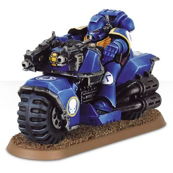
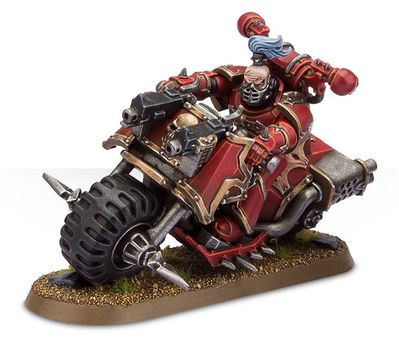
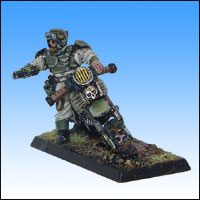
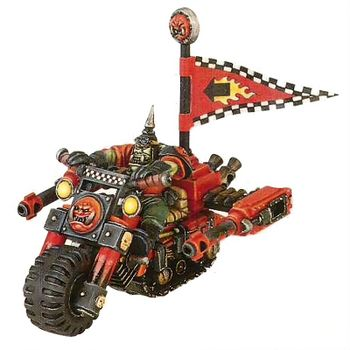
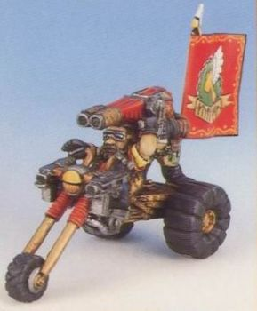
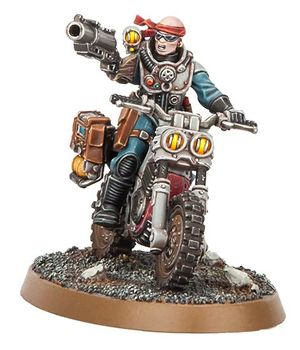

# 1457 摩托 Bike

精校状态：中文行文已逐段精校，部分术语仍为暂定

分类：载具 / 地面 / 轻型

原文来源：https://www.bilibili.com/opus/1038438262292611076

原作者：帝国神选罐头

原文时间：2025年02月27日 09:10

[返回分类目录](目录.md) · [全书目录](../../目录.md)

<!-- A1457-B0001 -->
**英文原文**

Bikes are fast-moving ground vehicles capable of carrying up to one rider and usually mounting a light weapon. Bikes are used by several forces of the Imperium, Chaos Space Marines, Eldar, Orks and Squats, among others, often for reconnaissance and rapid support roles. Other species, such as the Kroot, Exodite Eldar, and Feral Orks, do not possess the technology needed for such vehicles, and usually employ living animals as mounts instead.

<!-- /A1457-B0001 -->

<!-- A1457-B0002 -->

原译文

摩托是一种快速移动的地面车辆，最多可搭载一名骑手，通常装有轻武器。帝国、混沌星际战士、灵族、欧克蛮人和矮人等部队经常使用摩托进行侦察和快速支援。其他物种，如克鲁特、蛮荒灵族和蛮荒兽人，不具备此类车辆所需的技术，通常使用活体动物作为坐骑。

**校订译文**

摩托是一种高速地面载具，通常搭载一名骑手并安装轻武器。帝国的多支部队、混沌星际战士、灵族、欧克和矮人等都使用摩托，主要执行侦察和快速支援任务。克鲁特、蛮荒灵族及蛮荒欧克等群体缺少制造这类载具所需的技术，通常以活体动物代步。

<!-- /A1457-B0002 -->

<!-- A1457-B0003 图片 -->

<!-- A1457-B0004 -->

原译文

Ultramarines Bike 极限战士摩托

**校订译文**

Ultramarines Bike 极限战士摩托

<!-- /A1457-B0004 -->

<!-- A1457-B0005 -->
## Known Variants 已知变体

<!-- /A1457-B0005 -->

<!-- A1457-B0006 -->
### Space Marine Bikes 星际战士摩托

<!-- /A1457-B0006 -->

<!-- A1457-B0007 -->
**英文原文**

Most Space Marine bikes are armed with twin-linked bolters mounted between the handle-bars. Chaos Space Marine bikes are of a nearly identical design, although the riders often carry Close Combat Weapons to slaughter their enemies in passing.

<!-- /A1457-B0007 -->

<!-- A1457-B0008 -->

原译文

大多数星际战士摩托都配备了安装在把手之间的双连爆矢枪。混沌星际战士摩托的设计几乎完全相同，尽管骑手经常携带近战武器在经过时屠杀敌人。

**校订译文**

大多数星际战士摩托都在车把之间装有双联爆矢枪。混沌星际战士的摩托设计几乎相同，骑手还常携带近战武器，在疾驰而过时杀戮敌人。

<!-- /A1457-B0008 -->

<!-- A1457-B0009 图片 -->

<!-- A1457-B0010 -->

原译文

Chaos Space Marine Bike 混沌星际战士摩托

**校订译文**

Chaos Space Marine Bike 混沌星际战士摩托

<!-- /A1457-B0010 -->

<!-- A1457-B0011 -->
### Imperial Guard 帝国卫队

<!-- /A1457-B0011 -->

<!-- A1457-B0012 -->
**英文原文**

Certain Rough Rider units of the Imperial Guard use mechanical bikes as mounts; although much less robust and heavily armed than their Space Marine counterparts, these bikes are used in very similar roles.

<!-- /A1457-B0012 -->

<!-- A1457-B0013 -->

原译文

帝国卫队的某些蛮骑兵部队使用机械摩托作为坐骑；尽管这些摩托的坚固性和全副武装程度远低于星际战士，但它们的用途非常相似。

**校订译文**

帝国卫队的部分蛮骑兵部队使用机械摩托作为坐骑。这些摩托的坚固程度与武器配置都远逊于星际战士所用型号，但承担的任务非常相似。

<!-- /A1457-B0013 -->

<!-- A1457-B0014 图片 -->

<!-- A1457-B0015 -->

原译文

Cadian Shock Troops Rough Rider 卡迪亚突击队蛮骑兵

**校订译文**

Cadian Shock Troops Rough Rider 卡迪亚突击军蛮骑兵

<!-- /A1457-B0015 -->

<!-- A1457-B0016 -->
### Ork Warbikes 欧克战争摩托

<!-- /A1457-B0016 -->

<!-- A1457-B0017 -->
**英文原文**

Ork Warbikes are ramshackle machines but are sturdy enough to fulfil the Ork desire to go fast. They are often painted red for extra speed and are deadly in combat.

<!-- /A1457-B0017 -->

<!-- A1457-B0018 -->

原译文

欧克战争摩托是摇摇欲坠的机器，但足够坚固，可以满足欧克跑得快的愿望。它们通常被涂成红色以获得额外的速度，在战斗中是致命的。

**校订译文**

欧克战争摩托虽是拼凑而成的机器，却足够坚固，能满足欧克对速度的渴望。它们常被涂成红色以获得更快的速度，在战斗中也极为致命。

<!-- /A1457-B0018 -->

<!-- A1457-B0019 图片 -->

<!-- A1457-B0020 -->

原译文

Ork Warbikes 欧克战争摩托

**校订译文**

Ork Warbikes 欧克战争摩托

<!-- /A1457-B0020 -->

<!-- A1457-B0021 -->
### Squat Bikes 矮人摩托

<!-- /A1457-B0021 -->

<!-- A1457-B0022 -->
**英文原文**

Squat bikes are sturdy and designed to move Squat warriors rapidly around the battlefield where they can engage in combat with various deadly combat weapons. The Squats also used Trikes, which were larger and had a crew of two. The difference in name reflected size and role, rather than number of wheels; both varieties normally possessed three wheels.

<!-- /A1457-B0022 -->

<!-- A1457-B0023 -->

原译文

矮人摩托坚固耐用，旨在让矮人战士在战场上快速移动，在那里他们可以使用各种致命的战斗武器进行战斗。矮人还使用了更大的三轮车，有两名乘员。名称的不同反映了大小和作用，而不是轮子的数量；这两个品种通常都有三个轮子。

**校订译文**

矮人摩托坚固耐用，能将矮人战士迅速送往战场各处，让他们以各种致命武器投入战斗。矮人也使用体积更大、由两名乘员操控的“三轮摩托”。这两类名称的区别在于尺寸与用途，而非车轮数量，因为两种车型通常都有三个轮子。

<!-- /A1457-B0023 -->

<!-- A1457-B0024 图片 -->

<!-- A1457-B0025 -->

原译文

Squat Bikes 矮人摩托

**校订译文**

Squat Bikes 矮人摩托

<!-- /A1457-B0025 -->

<!-- A1457-B0026 -->
### Genestealer Cults 基因窃取者教派

<!-- /A1457-B0026 -->

<!-- A1457-B0027 -->
**英文原文**

Outrider elements of the Genestealer Cults make use of Atlan-class dirtcycles.

<!-- /A1457-B0027 -->

<!-- A1457-B0028 -->

原译文

基因窃取者教派的先导者成员使用阿塔兰级越野摩托。

**校订译文**

基因窃取者教派的前出侦骑使用阿塔兰级越野摩托。

<!-- /A1457-B0028 -->

<!-- A1457-B0029 图片 -->

<!-- A1457-B0030 -->

原译文

Atalan Jackal on dirtcycle 越野摩托上的阿塔兰豺狼

**校订译文**

Atalan Jackal on dirtcycle 驾驶越野摩托的阿塔兰豺狼摩托手

<!-- /A1457-B0030 -->

<!-- A1457-B0031 -->
### Jetbikes 喷气摩托

原题：Jetbikes 喷气摩托/悬浮摩托

<!-- /A1457-B0031 -->

<!-- A1457-B0032 -->
**英文原文**

Jetbikes utilize rare anti-gravity technology that allow them to hover off the ground. They are commonly used by the Eldar (Craftworld and Dark Eldar alike), while the necessary technology has been lost to the Imperium, leaving only one functioning Imperial Jetbike in service, ridden by Sammael of the Dark Angels Space Marines Chapter.

<!-- /A1457-B0032 -->

<!-- A1457-B0033 -->

原译文

喷气摩托利用了罕见的反重力技术，使它们能够在地面上悬停。它们通常被灵族（方舟世界和黑暗灵族都是如此）使用，然而对于帝国而言，这项必备的技术已经失传。只剩下一辆运行中的帝国悬浮摩托，由黑暗天使星际战士战团的萨麦尔驾驶。

**校订译文**

喷气摩托采用罕见的反重力技术，可以离地悬浮。方舟世界灵族和黑暗灵族都广泛使用这类载具；帝国则已丧失相关技术，按本段说法，只有一辆仍在服役，由黑暗天使战团的萨麦尔驾驶。

**校注：** “只剩萨麦尔一辆”是源文旧叙述；1459篇同时记述禁军型号、民用品及苏博登座驾。保留原段断言范围，勿作为全设定现状。

<!-- /A1457-B0033 -->

<!-- A1457-B0034 -->
## Other 其他

<!-- /A1457-B0034 -->

<!-- A1457-B0035 -->
**英文原文**

The Adeptus Arbites utilize the Rumbler bike.

<!-- /A1457-B0035 -->

<!-- A1457-B0036 -->

原译文

法务部使用隆音摩托。

**校订译文**

法务部使用隆音摩托。

<!-- /A1457-B0036 -->

<!-- A1457-B0037 -->
**英文原文**

The Tau and Necrons do not use bikes, although they do employ special vehicles (Tetras and Destroyers, respectively), in similar battlefield roles.

<!-- /A1457-B0037 -->

<!-- A1457-B0038 -->

原译文

钛和死灵不使用摩托，尽管他们在类似的战场角色中确实使用了特种车辆（分别是水虎鱼和飞蝗毁灭者）。

**校订译文**

钛族和太空死灵不使用摩托，但会以特种载具承担相近的战场任务，分别是水虎鱼和毁灭者。

<!-- /A1457-B0038 -->

本篇核心术语与暂定项

以下列出本篇出现的英文原形及核心术语表用词。同形词可能指不同对象，具体词义以本篇正文和校注为准；单复数、别名和仅见于图注的名称可能尚未列入。完整候选见[术语表](../../术语表/双语术语候选.csv)。

| 英文 | 采用中文 | 状态 |
| --- | --- | --- |
| Space Marines | 星际战士 | 官方已核对 |
| Dark Angels | 黑暗天使 | 官方已核对 |
| Imperial Guard | 帝国卫队 | 暂定·语境区分 |
| Chaos Space Marines | 混沌星际战士 | 官方已核对 |
| Eldar | 灵族 | 暂定·语境区分 |
| Dark Eldar | 黑暗灵族 | 暂定·旧称对应 |
| Genestealer Cults | 基因窃取者教派 | 官方已核对 |
| Necrons | 太空死灵 | 官方已核对 |
| Orks | 欧克蛮人 | 官方已核对 |
| Imperium | 帝国 | 暂定·简称 |
| Craftworld | 方舟世界 | 官方已核对 |
| Kroot | 克鲁特 | 暂定 |
| Adeptus Arbites | 法务部 | 暂定 |
| Exodite | 蛮荒灵族 | 暂定·官方待核 |
| Squats | 矮人 | 暂定·官方待核 |
| Outrider | 先遣者 | 暂定·官方待核 |
| Space Marine | 星际战士 | 暂定·官方待核 |
| Chapter | 战团 | 暂定·官方待核 |
| Sammael | 萨麦尔 | 官方已核 |
| Destroyers | 毁灭者 | 暂定·官方待核 |
| Feral Orks | 蛮荒欧克 | 暂定·官方待核 |
| Bikes | 摩托 | 暂定·官方待核 |
| The Dark | 《黑暗》 | 暂定·官方待核 |
| Atlan | 阿特兰 | 暂定·官方待核 |
| Jetbike | 喷气摩托 | 暂定·官方待核 |
| Rumbler bike | 隆音摩托 | 暂定·官方待核 |

