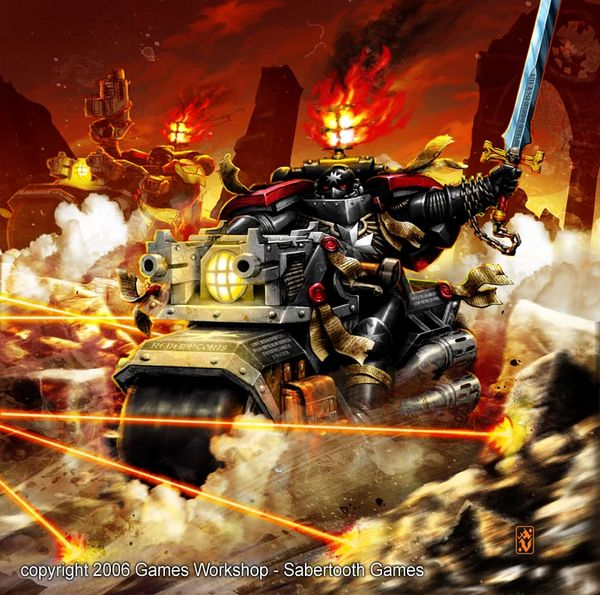
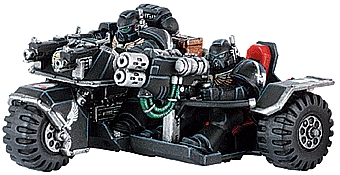
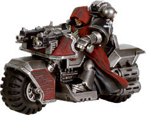
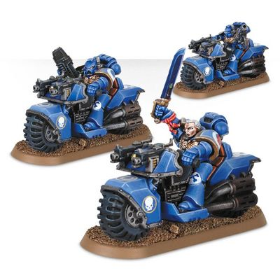
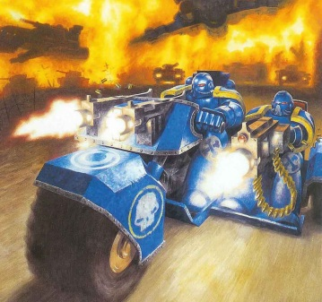
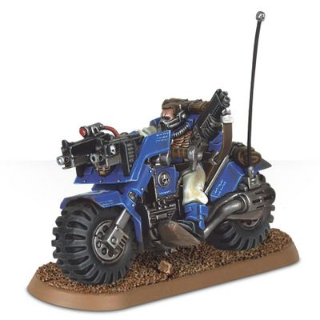
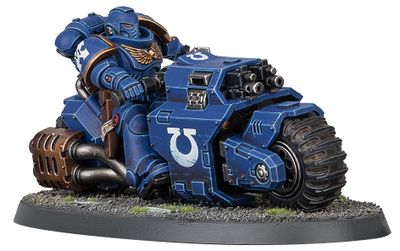

# 1458 星际战士摩托 Space Marine Bike

精校状态：中文行文已逐段精校，部分术语仍为暂定

分类：载具 / 地面 / 轻型

原文来源：https://www.bilibili.com/opus/1038438395440791553

原作者：帝国神选罐头

原文时间：2025年02月27日 09:11

[返回分类目录](目录.md) · [全书目录](../../目录.md)

<!-- A1458-B0001 -->
**英文原文**

Space Marine Bikes are incredibly deadly and robust bikes used by the Space Marine Bike Squads for lightning-quick raids and reconnaissance.

<!-- /A1458-B0001 -->

<!-- A1458-B0002 -->

原译文

星际战士摩托是星际战士摩托小队使用的极其致命和坚固的摩托，用于闪电般的突袭和侦察。

**校订译文**

星际战士摩托坚固耐用、杀伤力强，由星际战士摩托小队用于闪电突袭和侦察。

<!-- /A1458-B0002 -->

<!-- A1458-B0003 图片 -->

<!-- A1458-B0004 -->

原译文

Black Templar on a Space Marine Bike 星际战士摩托上的黑色圣堂

**校订译文**

Black Templar on a Space Marine Bike 星际战士摩托上的黑色圣堂

<!-- /A1458-B0004 -->

<!-- A1458-B0005 -->
## Overview 概述

<!-- /A1458-B0005 -->

<!-- A1458-B0006 -->
**英文原文**

These vehicles are equipped with powerful engines, required to propel a fully-armoured Space Marine at high speeds, and boast highly-responsive controls required to perform complex battlefield maneuvers. They are able to be operated in a wide range of environments, from shifting dune seas to ice-strewn wastelands to rocky moonscapes, and are simple enough in design that their riders can perform repairs in the field if necessary. Their sturdy construction and wide, thick tires allows the bike to easily smash through rockcrete walls at full speed without harm to either bike or rider. The average bike weighed nigh on a ton.

<!-- /A1458-B0006 -->

<!-- A1458-B0007 -->

原译文

这些车辆配备了强大的发动机，需要高速推进全装甲的星际战士，并拥有执行复杂战场机动所需的高响应控制。它们能够在各种各样的环境中运行，从不断变化的沙丘海到布满冰块的荒地再到岩石的月球景观，而且设计足够简单，必要时骑手可以在现场进行维修。它们坚固的结构和宽而厚的轮胎使摩托能够全速轻松地撞破岩石混凝土墙，而不会对摩托或骑手造成伤害。这些摩托的平均重量接近一吨。

**校订译文**

这些载具配备强劲的发动机，足以载着身披全套装甲的星际战士高速前进；灵敏的操控系统则让骑手能够完成复杂的战场机动。它们能适应多种环境，包括流动的沙丘、冰封荒原和岩石遍布的卫星表面。设计也足够简洁，必要时骑手可以就地维修。凭借坚固的车身与宽厚的轮胎，摩托能全速撞穿岩石混凝土墙，而车辆和骑手都安然无恙。一辆摩托的平均重量接近一吨。

<!-- /A1458-B0007 -->

<!-- A1458-B0008 图片 -->

<!-- A1458-B0009 -->

原译文

Dark Angels Mk2 Attack Bike 黑暗天使Mk2攻击坦克

**校订译文**

Dark Angels Mk2 Attack Bike 黑暗天使Mk2攻击摩托

<!-- /A1458-B0009 -->

<!-- A1458-B0010 -->
**英文原文**

The typical armament of a Codex Space Marine Bike is a set of twin Bolters mounted on either side of the bike's headlight.

<!-- /A1458-B0010 -->

<!-- A1458-B0011 -->

原译文

圣典星际战士摩托的典型武器是一组安装在摩托前灯两侧的双联爆矢枪。

**校订译文**

遵循圣典的星际战士战团通常使用在车灯两侧装有一对爆矢枪的摩托。

<!-- /A1458-B0011 -->

<!-- A1458-B0012 图片 -->

<!-- A1458-B0013 -->

原译文

Guardians of the Covenant Bike 圣约守卫摩托

**校订译文**

Guardians of the Covenant Bike 圣约守卫摩托

<!-- /A1458-B0013 -->

<!-- A1458-B0014 -->
## Space Marine Bike Squad 星际战士摩托小队

<!-- /A1458-B0014 -->

<!-- A1458-B0015 -->
**英文原文**

Space Marine Bike Squads are fast moving, light-attack units mounted on Space Marine Bikes.

<!-- /A1458-B0015 -->

<!-- A1458-B0016 -->

原译文

星际战士摩托小队是配备星际战士摩托的快速移动的轻型攻击部队。

**校订译文**

星际战士摩托小队是乘坐摩托行动的高速轻型攻击单位。

<!-- /A1458-B0016 -->

<!-- A1458-B0017 图片 -->

<!-- A1458-B0018 -->

原译文

Space Marine Bike Squad 星际战士摩托小队

**校订译文**

Space Marine Bike Squad 星际战士摩托小队

<!-- /A1458-B0018 -->

<!-- A1458-B0019 -->
### Attack Bike 攻击摩托

<!-- /A1458-B0019 -->

<!-- A1458-B0020 -->
**英文原文**

A variant of the Bike is the Space Marine Attack Bike, which includes a Heavy Bolter or Multi-Melta mounted on an attached sidecar. These heavy weapons, combined with the manoeuvrability of the Assault Bike, makes it excellent at rapidly deploying large amounts of heavy fire-power to those areas which require it urgently.

<!-- /A1458-B0020 -->

<!-- A1458-B0021 -->

原译文

这种摩托的一种变体是星际战士攻击摩托，它包括一个安装在侧车上的重型爆矢枪或多管热熔。这些重型武器，再加上突击摩托的机动性，使其能够将大量重型火力快速部署到急需的地区。

**校订译文**

星际战士攻击摩托是一种带边车的变体，边车上装有重型爆矢枪或多管热熔。这些重武器与摩托的机动性相结合，使其能够迅速为急需支援的区域提供大量重火力。

<!-- /A1458-B0021 -->

<!-- A1458-B0022 图片 -->

<!-- A1458-B0023 -->

原译文

Ultramarines Space Marine Attack Bike 极限战士攻击摩托

**校订译文**

Ultramarines Space Marine Attack Bike 极限战士攻击摩托

<!-- /A1458-B0023 -->

<!-- A1458-B0024 -->
### Scout Bike 侦察摩托

原题：Scout Bike 侦查摩托

<!-- /A1458-B0024 -->

<!-- A1458-B0025 -->
**英文原文**

A Scout Bike Squadron is a mounted, rapid-strike version of the Scout Squad. The squadron is made up of a Sergeant and between two and four Scouts, all mounted. All wear lighter Carapace Armour, but are excellent at scouting out forces a long distance away, which would take too long for Scouts on foot to investigate.\[3\] The bike is usually armed with either twin-linked Bolters or an Astartes Grenade Launcher, while the rider typically carries a shotgun, bolt pistol, combat knife, frag grenades, and krak grenades.

<!-- /A1458-B0025 -->

<!-- A1458-B0026 -->

原译文

侦察摩托中队是侦察兵小队的一种快速打击版本。该中队由一名军士和两到四名侦察兵组成，他们都是骑兵。所有人都穿着较轻的侦察盔甲，擅长侦察远距离的部队，对步行的侦察兵来说需要很长时间才能进行调查。这辆摩托通常配备双联爆矢枪或阿斯塔特榴弹发射器，而骑手通常携带霰弹枪、爆矢手枪、战斗刀、破片手榴弹和穿甲手榴弹。

**校订译文**

侦察摩托中队是侦察兵小队的乘车快速打击形式，由一名军士和两至四名侦察兵组成，全员驾驶摩托。他们都穿着较轻的甲壳甲，擅长侦察远处的敌军动向，而徒步侦察兵要调查同一地区往往需要更长时间。摩托通常装有双联爆矢枪或阿斯塔特榴弹发射器；骑手一般携带霰弹枪、爆矢手枪、战斗刀、破片榴弹和穿甲榴弹。

**校注：** Carapace Armour 为甲壳甲，原译侦察盔甲丢失护甲类别。

<!-- /A1458-B0026 -->

<!-- A1458-B0027 图片 -->

<!-- A1458-B0028 -->

原译文

Ultramarines Scout Bike 极限战士侦查摩托

**校订译文**

Ultramarines Scout Bike 极限战士侦察摩托

<!-- /A1458-B0028 -->

<!-- A1458-B0029 -->
### Outrider Bike 摩托警卫用摩托

原题：Outrider Bike 先遣者摩托

<!-- /A1458-B0029 -->

<!-- A1458-B0030 -->
**英文原文**

These bikes are used by the newer Primaris Outriders. The pattern is known as the Raider Pattern Combat Bike.

<!-- /A1458-B0030 -->

<!-- A1458-B0031 -->

原译文

这些摩托被较新的原铸先遣者使用。这种型号被称为突袭者型战斗摩托。

**校订译文**

这些摩托由较新的原铸摩托警卫使用，型号称为突袭者型战斗摩托。

<!-- /A1458-B0031 -->

<!-- A1458-B0032 图片 -->

<!-- A1458-B0033 -->

原译文

Primaris Outrider on Bike 摩托上的原铸先遣者

**校订译文**

Primaris Outrider on Bike 驾驶摩托的原铸摩托警卫

<!-- /A1458-B0033 -->

本篇核心术语与暂定项

以下列出本篇出现的英文原形及核心术语表用词。同形词可能指不同对象，具体词义以本篇正文和校注为准；单复数、别名和仅见于图注的名称可能尚未列入。完整候选见[术语表](../../术语表/双语术语候选.csv)。

| 英文 | 采用中文 | 状态 |
| --- | --- | --- |
| Bolt Pistol | 爆矢手枪 | 官方已核对 |
| Scout Squad | 侦察小队 | 官方已核对 |
| Frag Grenades | 破片手榴弹 | 暂定·官方待核 |
| Krak Grenades | 穿甲手榴弹 | 暂定·官方待核 |
| Space Marine | 星际战士 | 暂定·官方待核 |
| Sergeant | 军士 | 暂定·官方待核 |
| Scout | 侦察兵 | 暂定·官方待核 |
| Bike Squads | 摩托小队 | 暂定·官方待核 |
| Raider | 掠袭者飞艇 | 官方已核对 |
| Bikes | 摩托 | 暂定·官方待核 |
| Shotgun | 霰弹枪 | 暂定·官方待核 |
| Grenade launcher | 榴弹发射器 | 暂定·官方待核 |
| Astartes Grenade Launcher | 阿斯塔特榴弹发射器 | 暂定·官方待核 |
| Bolt | 爆矢 | 暂定·官方待核 |
| Bolter | 爆矢枪 | 暂定·官方待核 |
| Heavy bolter | 重型爆矢枪 | 官方已核对 |
| Multi-melta | 多管热熔 | 官方已核对 |
| Combat Knife | 战斗刀 | 暂定·官方待核 |
| Grenade | 手榴弹 | 暂定·官方待核 |
| Carapace Armour | 甲壳盔甲 | 暂定·官方待核 |
| Raider Pattern Combat Bike | 突袭者型战斗摩托 | 暂定·官方待核 |

