# 1459 帝国喷气摩托 Imperial jetbike

精校状态：中文行文已逐段精校，部分术语仍为暂定

分类：载具 / 地面 / 轻型

原文来源：https://www.bilibili.com/opus/1045149436488974343

原作者：帝国神选罐头

原文时间：编辑于 2026年01月10日 10:19

[返回分类目录](目录.md) · [全书目录](../../目录.md)

<!-- A1459-B0001 -->
**英文原文**

Imperial jetbikes were sleek craft utilizing anti-grav technology, and were commonly used by the Space Marine Legions during the Great Crusade. After the Horus Heresy however, the ability to produce them was eventually lost and now only one Imperial jetbike is known to exist outside of the Adeptus Custodes(many more exist within the greater Imperium).

<!-- /A1459-B0001 -->

<!-- A1459-B0002 -->

原译文

帝国悬浮摩托是一种利用反重力技术的流线型飞行器，在大远征期间，星际战士经常使用。然而，在荷鲁斯叛乱之后，生产它们的能力最终丧失了，现在已知只有一辆帝国悬浮摩托存在禁军之外（更多的存在于更大的帝国内部）。

**校订译文**

帝国喷气摩托是一种采用反重力技术的流线型飞行载具，大远征期间在星际战士军团中十分常见。荷鲁斯之乱后，帝国最终失去了制造它们的能力。按本段说法，如今已知帝皇禁军之外只剩一辆帝国喷气摩托，不过括注又称，更广泛的帝国疆域内仍有更多此类载具。

**校注：** 英文主句称禁军之外仅存一辆，括注却称帝国范围内仍有更多，内部范围矛盾照录并提示；后文有军事/民用分野，但此处没有自行替作者消除。

<!-- /A1459-B0002 -->

<!-- A1459-B0003 图片 -->
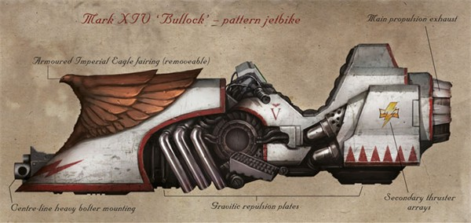

<!-- A1459-B0004 -->

原译文

"Bullock" Jetbike used by the White Scars 白色疤痕使用的“布洛克”悬浮摩托

**校订译文**

"Bullock" Jetbike used by the White Scars 白疤使用的“布洛克”喷气摩托

<!-- /A1459-B0004 -->

<!-- A1459-B0005 -->
## Pre-Heresy 叛乱前

<!-- /A1459-B0005 -->

<!-- A1459-B0006 -->
**英文原文**

Imperial jetbikes were common among the Space Marine Legions during the Great Crusade and the Heresy, typically operated by Sky Hunter Squadrons.

<!-- /A1459-B0006 -->

<!-- A1459-B0007 -->

原译文

帝国悬浮摩托在大远征和叛乱时期的星际战士中很常见，通常由天空猎手中队操作。

**校订译文**

在大远征和荷鲁斯之乱期间，帝国喷气摩托在星际战士军团中很常见，通常由天空猎手中队使用。

<!-- /A1459-B0007 -->

<!-- A1459-B0008 图片 -->
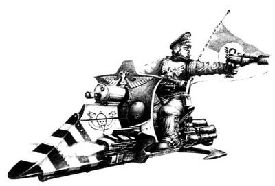

<!-- A1459-B0009 -->

原译文

Imperial Guard Jetbike 帝国卫队悬浮摩托

**校订译文**

Imperial Guard Jetbike 帝国卫队喷气摩托

<!-- /A1459-B0009 -->

<!-- A1459-B0010 -->
## Post-Heresy 叛乱后

<!-- /A1459-B0010 -->

<!-- A1459-B0011 -->
**英文原文**

The last known version was the Mk14 'Bullock' jet-cycle, equipped with integrated auto-drive, and additionally, some were equipped with bio-scanners, energy-scanners, communicators, and auto-aim devices linked to the vehicle's weapons. Standard weapons were twin forward-firing bolters and could seat a single rider. The jet-cycle was capable of both flight and hover modes, and could be used in aerial-drop separation tactics (dropping out of drop ships before the ships land).

<!-- /A1459-B0011 -->

<!-- A1459-B0012 -->

原译文

最后一个已知的版本是Mk14“布洛克”悬浮摩托，配备了集成自动驾驶，此外，一些还配备了生物扫描仪、能量扫描仪、通信器和与车辆武器相连的自动瞄准装置。标准武器是前向射击的双联爆矢枪，可以让一名骑手就座。悬浮摩托既能飞行，也能悬停，可用于空投分离战术（在船只降落前从空投船上降落）。

**校订译文**

最后一种已知型号是 Mk14“布洛克”喷气摩托，配有集成自动驾驶系统，部分车辆还装有生物扫描仪、能量扫描仪、通讯设备，以及与武器联动的自动瞄准装置。该型可搭载一名骑手，标准武器是一对向前射击的爆矢枪。车辆既能飞行，也能悬停，还可执行空投脱离战术，即在运输艇着陆前直接驶离运输艇、空降投入作战。

<!-- /A1459-B0012 -->

<!-- A1459-B0013 -->
## Modern Imperium 现代帝国

<!-- /A1459-B0013 -->

<!-- A1459-B0014 -->
**英文原文**

The technology used in the production of military-grade jetbikes has been lost to the Imperium as of M41. The venerable Mk14 having been lost "many centuries ago", ending a tradition of jet-bike units stretching perhaps up to 9000 years. The only astartes jetbike known to survive into the 41st Millennium is Corvex, used by the Grand Master of the Ravenwing company of the Dark Angels chapter, currently Sammael. Jetbikes and their technology are now distrusted by the imperium as being alien and inhuman, particularly in the examples of the Eldar and T'au. particularly in the examples of the Eldar and T'au. Sammael's jetbike was built to the highest standards, mounting a plasma cannon and twin-linked storm bolters. It is possible that some Second Founding chapters of the Dark Angels maintain other examples of jetbikes in their armouries or vaults. At least one modern Primaris Space Marine utilizes a jetbike, as seen in the Grav-Bike design utilized by Suboden Khan.

<!-- /A1459-B0014 -->

<!-- A1459-B0015 -->

原译文

从M41开始，用于生产军用级悬浮摩托的技术在帝国已经失传了。古老的Mk14在“几个世纪前”就已经丢失，结束了可能长达9000年的悬浮摩托的传统。已知唯一一辆存活到第41个千年的阿斯塔特悬浮摩托是渡鸦，由黑暗天使战团的鸦翼连队的大导师使用，目前是萨麦尔。悬浮摩托及其技术现在被帝国怀疑是外星人和非人的，特别是在灵族和钛的例子中。特别是在灵族和钛的例子中。萨麦尔的悬浮摩托是按照最高标准制造的，安装了等离子炮和双联风暴爆矢枪。黑暗天使的一些二次建军战团可能在他们的军械库或秘库中保留了其他悬浮摩托的例子。至少有一名现代原铸星际战士使用悬浮摩托，正如苏博登可汗使用的反重力摩托设计所示。

**校订译文**

截至第41千年，帝国已经丧失制造军用级喷气摩托的技术。古老的 Mk14 据称在“许多个世纪前”便已失传，结束了可能延续达九千年的喷气摩托部队传统。已知延续至第41千年的阿斯塔特喷气摩托只有渡鸦号，由黑暗天使鸦翼连队的大导师使用；按本稿记述，现任使用者是萨麦尔。帝国如今对喷气摩托及其技术抱有疑虑，视其为异形和非人类之物，尤其因为灵族与钛族也使用类似技术。萨麦尔的座驾按最高标准打造，装有等离子炮和双联风暴爆矢枪。黑暗天使的某些二次建军战团也可能在军械库或秘库中保存着其他喷气摩托。至少还有一位当代原铸星际战士在使用这类载具，即驾驶反重力摩托的苏博登可汗。

**校注：** 英文“particularly in the examples of the Eldar and T’au”重复一次，译文仅保留一次；“唯一”断言与段末苏博登座驾并存，按源文保留并标示版本拼接疑点。

<!-- /A1459-B0015 -->

<!-- A1459-B0016 图片 -->
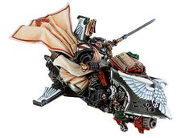

<!-- A1459-B0017 -->

原译文

Sammael riding the Corvex 萨麦尔驾驶渡鸦

**校订译文**

Sammael riding the Corvex 萨麦尔驾驶渡鸦号

<!-- /A1459-B0017 -->

<!-- A1459-B0018 -->
**英文原文**

The Adeptus Custodes still operate Jetbike formations, notably the Vertus Praetors who ride atop Dawneagle Pattern Bikes. Civilian grade jet-bikes are known to be present on highly developed worlds, likely for wealthy nobles and the elites. Some Gangs of the Underhive are known to craft jurry-rigged jet-bikes by combining anti-grav tech with large turbines.

<!-- /A1459-B0018 -->

<!-- A1459-B0019 -->

原译文

禁军仍在维持悬浮摩托编队，特别是骑在晨鹰型摩托上的英勇执政官。众所周知，民用级悬浮摩托出现在高度发达的世界，可能是富裕的贵族和精英阶层。众所周知，下巢的一些帮派将反重力技术与大型涡轮机相结合，制造了装有护具的悬浮摩托。

**校订译文**

帝皇禁军仍保有喷气摩托编队，其中尤以驾驶晨鹰型喷气摩托的骁骑禁军为代表。高度发达的世界上也存在民用喷气摩托，使用者很可能是富裕贵族和社会精英。已知一些下巢帮派会把反重力技术与大型涡轮机结合，拼装出简陋的喷气摩托。

**校注：** jurry-rigged 为 jury-rigged 的误拼，指临时拼装，原译“装有护具”错误。

<!-- /A1459-B0019 -->

<!-- A1459-B0020 -->
## Known Patterns 已知型号

<!-- /A1459-B0020 -->

<!-- A1459-B0021 -->

原译文

Space Marine 星际战士

**校订译文**

Space Marine 星际战士

<!-- /A1459-B0021 -->

<!-- A1459-B0022 -->
**英文原文**

Scimitar Jetbike - the main pattern used by the Legions during the Heresy-era

<!-- /A1459-B0022 -->

<!-- A1459-B0023 -->

原译文

弯刀悬浮摩托 - 叛乱时期军团使用的主要型号

**校订译文**

弯刀喷气摩托——荷鲁斯之乱时期各军团使用的主要型号。

<!-- /A1459-B0023 -->

<!-- A1459-B0024 图片 -->
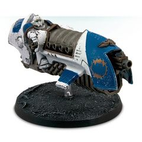

<!-- A1459-B0025 -->

原译文

Scimitar Pattern Jetbike 弯刀型悬浮摩托

**校订译文**

Scimitar Pattern Jetbike 弯刀型喷气摩托

<!-- /A1459-B0025 -->

<!-- A1459-B0026 -->

原译文

- Shamshir Jetbike - a rare variant of the Scimitar, favored by the White Scars. - 舍施尔悬浮摩托 - 一种罕见的弯刀变体，受到白色伤疤的青睐。

**校订译文**

- Shamshir Jetbike - a rare variant of the Scimitar, favored by the White Scars. - 舍施尔喷气摩托——罕见的弯刀变体，受到白疤青睐。

<!-- /A1459-B0026 -->

<!-- A1459-B0027 -->
**英文原文**

Sojutsu Pattern Voidbike - Used by Jaghatai Khan

<!-- /A1459-B0027 -->

<!-- A1459-B0028 -->

原译文

枪术型虚空摩托 - 由察合台可汗使用

**校订译文**

枪术型虚空摩托 - 由察合台可汗使用

<!-- /A1459-B0028 -->

<!-- A1459-B0029 图片 -->
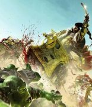

<!-- A1459-B0030 -->

原译文

Jaghatai Khan on his Sojutsu Voidbike 察合台可汗在他的枪术型虚空摩托上

**校订译文**

Jaghatai Khan on his Sojutsu Voidbike 察合台可汗在他的枪术型虚空摩托上

<!-- /A1459-B0030 -->

<!-- A1459-B0031 -->
**英文原文**

Falcata Pattern - Used by the White Scars during the Horus Heresy

<!-- /A1459-B0031 -->

<!-- A1459-B0032 -->

原译文

弯刃型 - 荷鲁斯叛乱时期白色伤疤使用

**校订译文**

弯刃型——荷鲁斯之乱期间由白疤使用。

<!-- /A1459-B0032 -->

<!-- A1459-B0033 -->
**英文原文**

Hornet Pattern - Used by the White Scars during the Horus Heresy

<!-- /A1459-B0033 -->

<!-- A1459-B0034 -->

原译文

大黄蜂型 - 荷鲁斯叛乱时期白色伤疤使用

**校订译文**

大黄蜂型——荷鲁斯之乱期间由白疤使用。

<!-- /A1459-B0034 -->

<!-- A1459-B0035 -->
**英文原文**

Taiga Pattern - Used by the White Scars during the Horus Heresy

<!-- /A1459-B0035 -->

<!-- A1459-B0036 -->

原译文

泰加型 - 荷鲁斯叛乱时期白色伤疤所用

**校订译文**

泰加型——荷鲁斯之乱期间由白疤使用。

<!-- /A1459-B0036 -->

<!-- A1459-B0037 -->
**英文原文**

Bullock Pattern - Used by the White Scars during the Horus Heresy

<!-- /A1459-B0037 -->

<!-- A1459-B0038 -->

原译文

布洛克型 - 荷鲁斯叛乱时期白色伤疤使用

**校订译文**

布洛克型——荷鲁斯之乱期间由白疤使用。

<!-- /A1459-B0038 -->

<!-- A1459-B0039 -->
**英文原文**

Mk.14 Bullock Jet-Cycle Pattern such as the Corvex

<!-- /A1459-B0039 -->

<!-- A1459-B0040 -->

原译文

Mk.14布洛克喷气循环型，如渡鸦

**校订译文**

Mk.14布洛克喷气摩托型，例如渡鸦号。

<!-- /A1459-B0040 -->

<!-- A1459-B0041 图片 -->
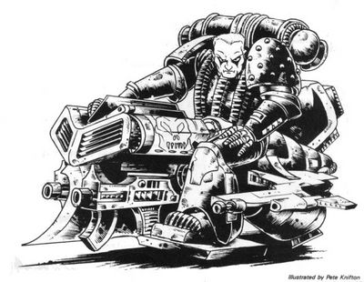

<!-- A1459-B0042 -->

原译文

Mk.14 Bullock Jet-Cycle Mk.14布洛克悬浮摩托

**校订译文**

Mk.14 Bullock Jet-Cycle Mk.14布洛克喷气摩托

<!-- /A1459-B0042 -->

<!-- A1459-B0043 图片 -->
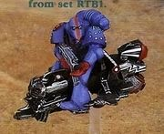

<!-- A1459-B0044 -->
**英文原文**

Estoc Pattern Jetbike - Heresy-era

<!-- /A1459-B0044 -->

<!-- A1459-B0045 -->

原译文

刺剑型悬浮摩托 - 叛乱时期

**校订译文**

刺剑型喷气摩托——荷鲁斯之乱时期型号。

<!-- /A1459-B0045 -->

<!-- A1459-B0046 -->
**英文原文**

Skyhunter - Used by the Ravenwing during the Horus Heresy

<!-- /A1459-B0046 -->

<!-- A1459-B0047 -->

原译文

天空猎手 - 荷鲁斯叛乱时期白色伤疤所用

**校订译文**

天空猎手——荷鲁斯之乱期间由鸦翼使用。

**校注：** 原文明确 Ravenwing 鸦翼，原译误成白疤。

<!-- /A1459-B0047 -->

<!-- A1459-B0048 -->

原译文

Talons of the Emperor 帝皇之爪

**校订译文**

Talons of the Emperor 帝皇之爪

<!-- /A1459-B0048 -->

<!-- A1459-B0049 -->
**英文原文**

Gyrfalcon Pattern - Used in the Agamatus Jetbike Squadron - Heresy-era

<!-- /A1459-B0049 -->

<!-- A1459-B0050 -->

原译文

矛隼型 - 用于阿伽马图斯悬浮摩托中队-叛乱时代

**校订译文**

矛隼型——荷鲁斯之乱时期由阿伽马图斯喷气摩托中队使用。

<!-- /A1459-B0050 -->

<!-- A1459-B0051 图片 -->
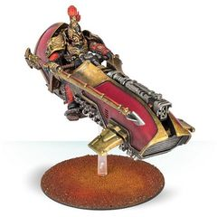

<!-- A1459-B0052 -->

原译文

Gyrfalcon Pattern Jetbike 矛隼型悬浮摩托

**校订译文**

Gyrfalcon Pattern Jetbike 矛隼型喷气摩托

<!-- /A1459-B0052 -->

<!-- A1459-B0053 -->
**英文原文**

Dawneagle Pattern - Used by the Adeptus Custodes. Relic of the Great Crusade. More durable and can deliver near supersonic turn of speed

<!-- /A1459-B0053 -->

<!-- A1459-B0054 -->

原译文

晨鹰型 - 由禁军使用。大远征的圣物。更耐用，可以提供接近超音速的转弯速度

**校订译文**

晨鹰型——帝皇禁军使用的大远征遗物，更加坚固，能骤然加速至接近音速。

**校注：** turn of speed 指突然加速的能力，不是转弯速度。

<!-- /A1459-B0054 -->

<!-- A1459-B0055 图片 -->
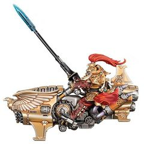

<!-- A1459-B0056 -->

原译文

Dawneagle Pattern Jetbike 晨鹰型悬浮摩托

**校订译文**

Dawneagle Pattern Jetbike 晨鹰型喷气摩托

<!-- /A1459-B0056 -->

<!-- A1459-B0057 -->
**英文原文**

Erinyes Pattern - Used by the Silent Sisterhood

<!-- /A1459-B0057 -->

<!-- A1459-B0058 -->

原译文

厄里倪厄斯型 - 由寂静修女使用

**校订译文**

厄里倪厄斯型 - 由寂静修女使用

<!-- /A1459-B0058 -->

<!-- A1459-B0059 -->

原译文

Other 其他

**校订译文**

Other 其他

<!-- /A1459-B0059 -->

<!-- A1459-B0060 -->
**英文原文**

Escher Cutter - Used by House Escher on Necromunda

<!-- /A1459-B0060 -->

<!-- A1459-B0061 -->

原译文

埃舍尔切割者 - 埃舍尔家族在涅克罗蒙达上使用

**校订译文**

埃舍尔切割者——涅克洛蒙达的埃舍尔家族使用。

<!-- /A1459-B0061 -->

<!-- A1459-B0062 图片 -->
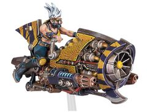

<!-- A1459-B0063 -->

原译文

Escher Cutter 埃舍尔切割者

**校订译文**

Escher Cutter 埃舍尔切割者

<!-- /A1459-B0063 -->

<!-- A1459-B0064 -->
### Unknown Patterns 未知型号

<!-- /A1459-B0064 -->

<!-- A1459-B0065 -->
**英文原文**

Suboden Khan rides a jetbike, specifically a grav-bike, although the name of its pattern is unknown.

<!-- /A1459-B0065 -->

<!-- A1459-B0066 -->

原译文

苏博登可汗骑着一辆悬浮摩托，特别是一架反重力摩托，尽管其型号的名称尚不清楚。

**校订译文**

苏博登可汗驾驶一辆喷气摩托，具体来说是一种反重力摩托，但其型号名称不详。

<!-- /A1459-B0066 -->

<!-- A1459-B0067 图片 -->
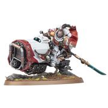

<!-- A1459-B0068 -->

原译文

Suboden Khan on his grav-bike 苏博登可汗在他的反重力摩托上

**校订译文**

Suboden Khan on his grav-bike 苏博登可汗在他的反重力摩托上

<!-- /A1459-B0068 -->

<!-- A1459-B0069 -->
**英文原文**

Air-Bikes - An unspecified pattern simply referred locally as "Air-Bikes" on the planet Gudrun, with several examples seen driven by civilians in the sky during a parade and celebrations. Gregor Eisenhorn and Midas Betancore were experienced in riding these flying bikes.

<!-- /A1459-B0069 -->

<!-- A1459-B0070 -->

原译文

飞空摩托 - 一种未指明的型号，在古德伦星球当地简称为“空中摩托”，有几个例子是在游行和庆祝活动中由平民驾驶的。格雷戈·艾森霍恩和米达斯·贝坦科尔在驾驶这些飞行摩托方面经验丰富。

**校订译文**

飞空摩托——古德伦星球当地称为“飞空摩托”的一种未知型号。在游行庆典期间，曾见到多名平民驾驶它们飞行于空中。格雷戈·艾森霍恩和米达斯·贝坦科尔都熟练掌握这类飞行摩托的驾驶技巧。

<!-- /A1459-B0070 -->

本篇核心术语与暂定项

以下列出本篇出现的英文原形及核心术语表用词。同形词可能指不同对象，具体词义以本篇正文和校注为准；单复数、别名和仅见于图注的名称可能尚未列入。完整候选见[术语表](../../术语表/双语术语候选.csv)。

| 英文 | 采用中文 | 状态 |
| --- | --- | --- |
| Dark Angels | 黑暗天使 | 官方已核对 |
| Adeptus Custodes | 帝皇禁军 | 官方已核对 |
| Eldar | 灵族 | 暂定·语境区分 |
| Horus Heresy | 荷鲁斯之乱 | 官方已核对 |
| Imperium | 帝国 | 暂定·简称 |
| Necromunda | 涅克罗蒙达 | 暂定·官方待核 |
| House Escher | 埃舍尔家族 | 暂定·官方待核 |
| Great Crusade | 大远征 | 暂定·官方待核 |
| Horus | 荷鲁斯 | 暂定·官方待核 |
| Gregor Eisenhorn | 格雷戈·艾森霍恩 | 暂定·官方待核 |
| Tech | 技术语 | 暂定·官方待核 |
| Master | 导师（审判庭职衔）／舰务官（舰员职务） | 语境定译·官方待核 |
| Vertus Praetors | 骁骑禁军 | 官方已核对 |
| White Scars | 白疤 | 官方已核 |
| Second Founding | 二次建军 | 暂定·官方待核 |
| Scars | 伤疤 | 暂定·官方待核 |
| Founding | 建军 | 暂定·官方待核 |
| Space Marine | 星际战士 | 暂定·官方待核 |
| Chapter | 战团 | 暂定·官方待核 |
| Primaris Space Marine | 原铸星际战士 | 暂定·官方待核 |
| Sammael | 萨麦尔 | 官方已核 |
| Grand Master of the Ravenwing | 鸦翼大导师 | 暂定·官方待核 |
| Corvex | 渡鸦号 | 暂定·官方待核 |
| T'au | 钛族 | 暂定·官方待核 |
| Jaghatai Khan | 察合台可汗 | 暂定·官方待核 |
| Bikes | 摩托 | 暂定·官方待核 |
| Grand Master | 大导师 | 暂定·官方待核 |
| Sojutsu pattern voidbike | 枪术型虚空摩托 | 暂定·官方待核 |
| Gudrun | 古德伦 | 暂定·官方待核 |
| Midas Betancore | 米达斯·贝坦科尔 | 暂定·官方待核 |
| Suboden Khan | 苏博登可汗 | 暂定·官方待核 |
| The Dark | 《黑暗》 | 暂定·官方待核 |
| Plasma cannon | 等离子炮 | 官方已核对 |
| Jetbike | 喷气摩托 | 暂定·官方待核 |
| Erinyes Pattern | 厄里倪厄斯型 | 暂定·官方待核 |

