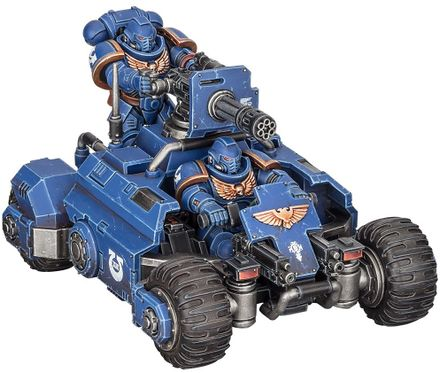

# 1460 入侵者全地形车 Invader ATV

精校状态：中文行文已逐段精校，部分术语仍为暂定

分类：载具 / 地面 / 轻型

原文来源：https://www.bilibili.com/opus/1024792146156191799

原作者：帝国神选罐头

原文时间：2025年01月21日 14:36

[返回分类目录](目录.md) · [全书目录](../../目录.md)

<!-- A1460-B0001 -->
**英文原文**

The Invader ATV is a Primaris Space Marine vehicle

<!-- /A1460-B0001 -->

<!-- A1460-B0002 -->

原译文

入侵者全地形车是原铸星际战士载具

**校订译文**

入侵者全地形车是一种原铸星际战士载具。

<!-- /A1460-B0002 -->

<!-- A1460-B0003 -->
**英文原文**

The Invader is a highly flexible all-terrain vehicle perfectly adapted to the aggressive reconnaissance role. Outfitted with either a Multi-Melta or Onslaught Gatling Cannon, it can rapidly deliver punishing fire against vulnerable parts of the enemy line, or swiftly engage and destroy scouting elements of the opposing force.

<!-- /A1460-B0003 -->

<!-- A1460-B0004 -->

原译文

入侵者是一种高度灵活的全地形车，非常适合执行攻击性侦察任务。它配备了多管热熔或突击加特林炮，可以迅速对敌方战线的脆弱部分进行惩戒射击，或迅速交战并摧毁敌方部队的侦察部队。

**校订译文**

入侵者是一种机动灵活的全地形车，尤其适合执行武装侦察任务。它配备多管热熔或猛攻加特林炮，既能迅速向敌方战线的薄弱处倾泻猛烈火力，也能快速接战并摧毁敌方侦察部队。

<!-- /A1460-B0004 -->

<!-- A1460-B0005 图片 -->

<!-- A1460-B0006 -->

原译文

Ultramarines Invader ATV 极限战士入侵者全地形车

**校订译文**

Ultramarines Invader ATV 极限战士入侵者全地形车

<!-- /A1460-B0006 -->

<!-- A1460-B0007 -->
**英文原文**

The Invader is extremely flexible and can overcame most battlefield obstacles at speed, thanks to its independent wheel suspension and drive units.

<!-- /A1460-B0007 -->

<!-- A1460-B0008 -->

原译文

入侵者非常灵活，由于其独立的车轮悬架和驱动单元，可以快速克服大多数战场障碍。

**校订译文**

得益于独立车轮悬架和驱动单元，入侵者拥有极佳的机动性，能高速越过大多数战场障碍。

<!-- /A1460-B0008 -->

本篇核心术语与暂定项

以下列出本篇出现的英文原形及核心术语表用词。同形词可能指不同对象，具体词义以本篇正文和校注为准；单复数、别名和仅见于图注的名称可能尚未列入。完整候选见[术语表](../../术语表/双语术语候选.csv)。

| 英文 | 采用中文 | 状态 |
| --- | --- | --- |
| Space Marine | 星际战士 | 暂定·官方待核 |
| Primaris Space Marine | 原铸星际战士 | 暂定·官方待核 |
| Invader ATV | 入侵者全地形车 | 官方已核对 |
| Onslaught Gatling Cannon | 猛攻加特林炮 | 暂定·官方待核 |
| Multi-melta | 多管热熔 | 官方已核对 |

