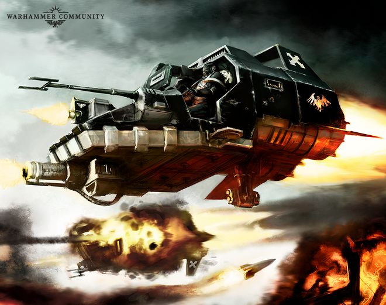
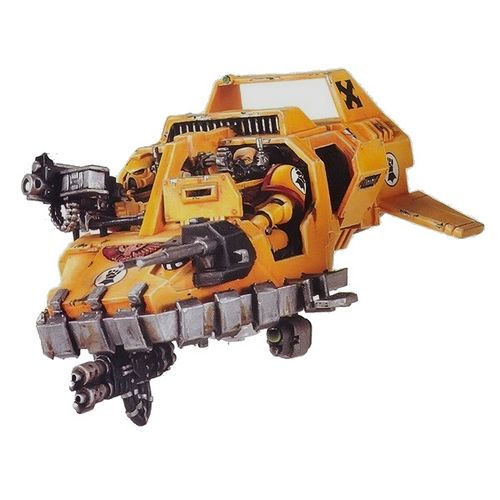
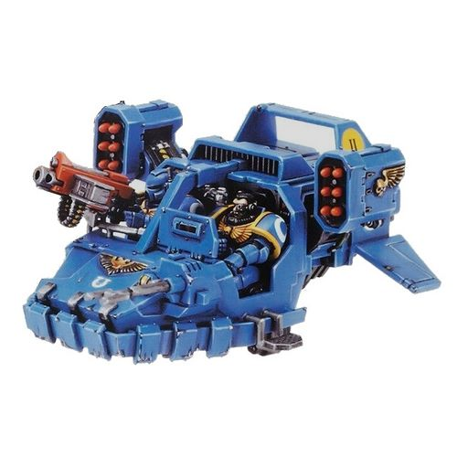
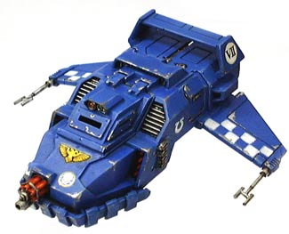
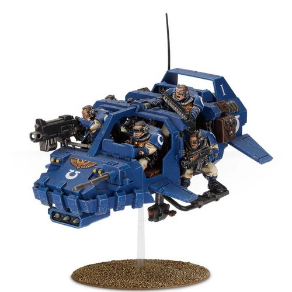
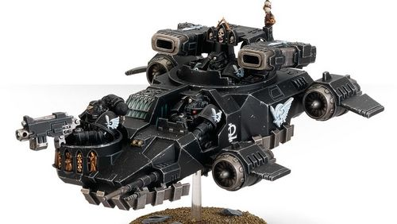

# 1461 兰德速攻艇 Land Speeder

精校状态：中文行文已逐段精校，部分术语仍为暂定

分类：载具 / 地面 / 轻型

原文来源：https://www.bilibili.com/opus/1038438515725041702

原作者：帝国神选罐头

原文时间：2025年02月27日 09:11

[返回分类目录](目录.md) · [全书目录](../../目录.md)

<!-- A1461-B0001 -->
**英文原文**

Land Speeders are light anti-gravity vehicles, serving as the primary reconnaissance, scouting, resupply and fast attack vehicles of the Imperial Space Marine Chapters.

<!-- /A1461-B0001 -->

<!-- A1461-B0002 -->

原译文

兰德速攻艇是轻型反重力载具，是帝国星际战士的主要侦察、搜索、补给和快速攻击载具。

**校订译文**

兰德速攻艇是一种轻型反重力载具，是帝国星际战士战团执行侦察、搜索、补给与快速攻击任务的主力载具。

<!-- /A1461-B0002 -->

<!-- A1461-B0003 -->
## History 历史

<!-- /A1461-B0003 -->

<!-- A1461-B0004 -->
**英文原文**

Land Speeders are based on STC data recovered in M31 by the famous Techno-archaeologist Arkhan Land, and afterwards became widely produced and used throughout the Imperium. Land Speeders were also originally used by the Imperial Guard, but since then the plasma and anti-gravity technologies required to produce them have become increasingly rare and hard to maintain. Only extremely resource rich planets like Ryza or organisations such as the Space Marines can afford to create them. There are 50 plus Land Speeders in a typical Chapter.

<!-- /A1461-B0004 -->

<!-- A1461-B0005 -->

原译文

兰德速攻艇基于著名技术考古士阿坎·兰德在M31恢复的STC数据，后来在整个帝国中被广泛生产和使用。兰德速攻艇最初也被帝国卫队使用，但从那时起，生产它们所需的等离子体和反重力技术变得越来越罕见，也越来越难以维护。只有像瑞扎这样资源极其丰富的行星或星际战士这样的组织才能制造它们。一个平常的战团中有50辆个兰德速攻艇。

**校订译文**

兰德速攻艇根据著名技术考古士阿坎·兰德在第31千年重新发现的 STC 数据制造，此后在帝国各地广泛生产和使用。帝国卫队起初也使用兰德速攻艇，但制造所需的等离子与反重力技术日渐稀缺，维护也越来越困难。只有瑞扎这类资源极其丰富的星球，或星际战士这样的组织，才有能力继续制造。一个典型战团通常拥有五十架以上的兰德速攻艇。

<!-- /A1461-B0005 -->

<!-- A1461-B0006 图片 -->

<!-- A1461-B0007 -->

原译文

Space Marine Land Speeders 星际战士兰德速攻艇

**校订译文**

Space Marine Land Speeders 星际战士兰德速攻艇

<!-- /A1461-B0007 -->

<!-- A1461-B0008 -->
## Design 设计

<!-- /A1461-B0008 -->

<!-- A1461-B0009 -->
**英文原文**

The anti-gravitic plates which give the Land Speeder its ability to fly remains a mystery restricted mostly to the Tech-Magos of the Adeptus Mechanicus. Placed around the nose and cockpit of the vehicle they create an inverse gravity field which, in combination with afterburning ramjets, allows it to climb to a height of one hundred meters but the official doctrine dictated that Land Speeders should use the ground as cover and don't climb up to high height. Though its anti-gravitic plates won't function at higher altitudes, they can be used to perform a control descent at these heights, allowing their deployment from an overflying Thunderhawk for rapid assaults. The Land Speeder is even capable of barrel-rolling until the vehicle is upside down, whilst maintaining speed and firing its weapons.

<!-- /A1461-B0009 -->

<!-- A1461-B0010 -->

原译文

使兰德速攻艇具有飞行能力的反重力板仍然是一个谜，主要局限于机械神教的技术贤者。它们被放置在载具的机头和驾驶舱周围，形成了一个反重力场，与加力冲压发动机相结合，使其能够爬升到一百米的高度，但官方的原则规定，兰德速攻艇应该使用地面作为掩护，不要爬升到很高的高度。虽然它的反重力板在更高的高度上不会起作用，但它们可以用来在这些高度上执行控制降落，从而允许它们从飞越的雷鹰部署以进行快速攻击。兰德速攻艇甚至能够进行滚桶式机动，直至车身倒置，同时保持速度并开火射击。

**校订译文**

让兰德速攻艇能够飞行的反重力板，其原理仍是一项主要由机械修会技术贤者掌握的秘密。这些板件安装在艇首和驾驶舱周围，产生反向重力场，配合加力冲压发动机，可使载具爬升至一百米高空。不过，正式作战准则要求速攻艇利用地形掩护，避免飞得过高。反重力板无法在更高空中维持正常飞行，却能用于控制下降，使速攻艇可以从飞越战场的雷鹰中直接投放，发起迅速突击。它甚至能一边保持速度和开火，一边作桶滚机动，直至艇身完全倒置。

<!-- /A1461-B0010 -->

<!-- A1461-B0011 -->
**英文原文**

The Land Speeder is lightly armoured - indeed the power armour of its Space Marine crew provides them with more protection - instead relying on its speed and maneuverability to avoid enemy fire. Its primary armament is a Heavy Bolter, although this is replaced in some Land Speeders with a Multi-Melta for anti-armour firepower.

<!-- /A1461-B0011 -->

<!-- A1461-B0012 -->

原译文

兰德速攻艇装甲较轻 - 事实上，其星际战士乘员的动力盔甲为他们提供了更多的保护 - 依靠其速度和机动性来躲避敌人的火力。它的主要武器是重型爆矢枪，尽管在一些兰德速攻艇中，它被用于反装甲火力的多管热熔所取代。

**校订译文**

兰德速攻艇的装甲很薄，乘员自己的动力甲甚至比艇身提供的防护更多，因此主要依靠速度和机动性躲避敌火。其主武器通常是重型爆矢枪，部分机体则换装多管热熔，以获得反装甲火力。

<!-- /A1461-B0012 -->

<!-- A1461-B0013 -->
## Battlefield Role 战场角色

<!-- /A1461-B0013 -->

<!-- A1461-B0014 -->
**英文原文**

The advantages of the Land Speeder is that it can be tasked to fulfill a variety of missions. These can range from light reconnaissance to tank-hunting and search-and-destroy operations. Land Speeders are typically fielded in squadrons of one to three vehicles, and normally piloted by Assault Marines, with each Battle Company maintaining its own stockpile. However, the majority are held by the Chapter's Reserve Companies, with the 7th Company trained and equipped to deploy en masse on Land Speeders, acting as a fast-response strike group which can be used to respond to enemy penetrations or exploit a hole in their battle lines. On average the typical Chapter will have between fifty to seventy Land Speeders of various types, though this varies depending upon the Chapter's wealth or tactical doctrine. For example, the Dark Angels and White Scars, along with their successor Chapters, each field several hundred Land Speeders.

<!-- /A1461-B0014 -->

<!-- A1461-B0015 -->

原译文

兰德速攻艇的优点是它可以执行各种任务。从轻型侦察到坦克狩猎以及搜索和摧毁行动。兰德速攻艇通常以一到三辆的中队部署，通常由突击星际战士驾驶，每个战斗连都有自己的储备。然而，大部分由战团的预备连持有，第7连经过训练和装备，可以集体部署在兰德速攻艇上，作为快速反应打击小组，可用于应对敌人的渗透或利用其战线上的漏洞。平均而言，平常的战团将有五十到七十个不同类型的兰德速攻艇，尽管这取决于战团的资产或战术学说。例如，黑暗天使和白色伤疤，以及他们的子战团，每个领域都有数百辆兰德速攻艇。

**校订译文**

兰德速攻艇能够执行多种任务，从轻度侦察到猎杀坦克、搜索歼敌皆可胜任。它们通常以一至三架编成中队，由突击星际战士驾驶，各战斗连都保有自己的机体。不过，大多数速攻艇由战团预备连掌管；第7连接受相关训练并配齐装备，能够全连乘坐速攻艇部署，作为快速反应打击部队，堵截敌军突破或利用敌方战线的缺口。典型战团一般拥有五十至七十架各型兰德速攻艇，具体数量随资源和战术准则而异。例如，黑暗天使、白疤及其子战团各自都能部署数百架。

<!-- /A1461-B0015 -->

<!-- A1461-B0016 -->
## Technical Information 技术资料

原题：Technical Information 技术信息

<!-- /A1461-B0016 -->

<!-- A1461-B0017 -->
### Technical Specifications 技术信息

<!-- /A1461-B0017 -->

<!-- A1461-B0018 -->
**英文原文**

Type:Utility Skimmer

<!-- /A1461-B0018 -->

<!-- A1461-B0019 -->

原译文

类型：多功能悬浮载具

**校订译文**

类型：多功能悬浮载具

<!-- /A1461-B0019 -->

<!-- A1461-B0020 -->
**英文原文**

Vehicle Name:Land Speeder

<!-- /A1461-B0020 -->

<!-- A1461-B0021 -->

原译文

载具名称：兰德速攻艇

**校订译文**

载具名称：兰德速攻艇

<!-- /A1461-B0021 -->

<!-- A1461-B0022 -->
**英文原文**

Forge World of Origin:Mars

<!-- /A1461-B0022 -->

<!-- A1461-B0023 -->

原译文

起源铸造世界：火星

**校订译文**

起源铸造世界：火星

<!-- /A1461-B0023 -->

<!-- A1461-B0024 -->
**英文原文**

Known Patterns:I-XXV

<!-- /A1461-B0024 -->

<!-- A1461-B0025 -->

原译文

已知型号：I - XXV

**校订译文**

已知型号：I - XXV

<!-- /A1461-B0025 -->

<!-- A1461-B0026 -->
**英文原文**

Crew:Pilot, Gunner

<!-- /A1461-B0026 -->

<!-- A1461-B0027 -->

原译文

乘员：驾驶员、炮手

**校订译文**

乘员：驾驶员、炮手

<!-- /A1461-B0027 -->

<!-- A1461-B0028 -->
**英文原文**

Powerplant:2x AS 9-60 Ramjets

<!-- /A1461-B0028 -->

<!-- A1461-B0029 -->

原译文

动力装置：2x AS 9-60冲压发动机

**校订译文**

动力装置：2台 AS 9-60 冲压发动机

<!-- /A1461-B0029 -->

<!-- A1461-B0030 -->
**英文原文**

Weight:3.5 tonnes

<!-- /A1461-B0030 -->

<!-- A1461-B0031 -->

原译文

重量：3.5吨

**校订译文**

重量：3.5吨

<!-- /A1461-B0031 -->

<!-- A1461-B0032 -->
**英文原文**

Length:4.7m

<!-- /A1461-B0032 -->

<!-- A1461-B0033 -->

原译文

长度：4.7米

**校订译文**

长度：4.7米

<!-- /A1461-B0033 -->

<!-- A1461-B0034 -->
**英文原文**

Wingspan:5.0m

<!-- /A1461-B0034 -->

<!-- A1461-B0035 -->

原译文

翼展：5.0米

**校订译文**

翼展：5.0米

<!-- /A1461-B0035 -->

<!-- A1461-B0036 -->
**英文原文**

Height:3.0m

<!-- /A1461-B0036 -->

<!-- A1461-B0037 -->

原译文

高度：3.0米

**校订译文**

高度：3.0米

<!-- /A1461-B0037 -->

<!-- A1461-B0038 -->
**英文原文**

Operational Ceiling:100m

<!-- /A1461-B0038 -->

<!-- A1461-B0039 -->

原译文

使用升限：100米

**校订译文**

使用升限：100米

<!-- /A1461-B0039 -->

<!-- A1461-B0040 -->
**英文原文**

Max Speed:350kph

<!-- /A1461-B0040 -->

<!-- A1461-B0041 -->

原译文

最高时速：350公里/小时

**校订译文**

最高时速：350公里/小时

<!-- /A1461-B0041 -->

<!-- A1461-B0042 -->
**英文原文**

Range:4000km in atmosphere

<!-- /A1461-B0042 -->

<!-- A1461-B0043 -->

原译文

射程：大气层内4000公里

**校订译文**

航程：大气层内4000公里

**校注：** Range 在载具性能表中指航程，不是武器射程；同篇其他型号一并修正。

<!-- /A1461-B0043 -->

<!-- A1461-B0044 -->
**英文原文**

Main Armament:Heavy Bolter or Multi-Melta

<!-- /A1461-B0044 -->

<!-- A1461-B0045 -->

原译文

主武器：重型爆矢枪或多管热熔

**校订译文**

主武器：重型爆矢枪或多管热熔

<!-- /A1461-B0045 -->

<!-- A1461-B0046 -->
**英文原文**

Secondary Armament:N/A

<!-- /A1461-B0046 -->

<!-- A1461-B0047 -->

原译文

次要武器：无

**校订译文**

次要武器：无

<!-- /A1461-B0047 -->

<!-- A1461-B0048 -->
**英文原文**

Main Ammunition:500 rounds

<!-- /A1461-B0048 -->

<!-- A1461-B0049 -->

原译文

主要弹药：500发

**校订译文**

主武器载弹量：500发

<!-- /A1461-B0049 -->

<!-- A1461-B0050 -->
**英文原文**

Secondary Ammunition:N/A

<!-- /A1461-B0050 -->

<!-- A1461-B0051 -->

原译文

次要弹药：无

**校订译文**

次要弹药：无

<!-- /A1461-B0051 -->

<!-- A1461-B0052 -->
### Armour 装甲

<!-- /A1461-B0052 -->

<!-- A1461-B0053 -->
**英文原文**

Superstructure:15mm

<!-- /A1461-B0053 -->

<!-- A1461-B0054 -->

原译文

上部结构：15mm

**校订译文**

上部结构：15mm

<!-- /A1461-B0054 -->

<!-- A1461-B0055 -->
**英文原文**

Hull:15mm

<!-- /A1461-B0055 -->

<!-- A1461-B0056 -->

原译文

车体：15mm

**校订译文**

车体：15mm

<!-- /A1461-B0056 -->

<!-- A1461-B0057 -->
### Variants 变体

<!-- /A1461-B0057 -->

<!-- A1461-B0058 -->
### Tornado 狂风

<!-- /A1461-B0058 -->

<!-- A1461-B0059 -->
**英文原文**

Land Speeder Tornadoes are more heavily armed variants of the standard Land Speeder, mounting a heavy flamer as its primary armament with a heavy bolter for additional firepower. The heavy flamer is sometimes replaced with an assault cannon, with the heavy bolter replaced with a multi-melta.

<!-- /A1461-B0059 -->

<!-- A1461-B0060 -->

原译文

兰德速攻艇狂风是标准兰德速攻艇的更重型武装变体，安装了重型火焰枪作为其主要武器，并配有重型爆矢枪以获得额外的火力。重型火焰枪有时会被突击炮所取代，重型爆矢枪则被多管热熔所取代。

**校订译文**

狂风型兰德速攻艇在标准型号基础上加强了武装，以重型火焰喷射器为主武器，并配备重型爆矢枪补充火力。重型火焰喷射器有时会换成突击炮，重型爆矢枪也可换成多管热熔。

<!-- /A1461-B0060 -->

<!-- A1461-B0061 图片 -->

<!-- A1461-B0062 -->

原译文

Tornado variant 狂风变体

**校订译文**

Tornado variant 狂风变体

<!-- /A1461-B0062 -->

<!-- A1461-B0063 -->
### Technical Specifications 技术信息

<!-- /A1461-B0063 -->

<!-- A1461-B0064 -->
**英文原文**

Type:Attack Skimmer

<!-- /A1461-B0064 -->

<!-- A1461-B0065 -->

原译文

类型：攻击悬浮载具

**校订译文**

类型：攻击悬浮载具

<!-- /A1461-B0065 -->

<!-- A1461-B0066 -->
**英文原文**

Vehicle Name:Land Speeder Tornado

<!-- /A1461-B0066 -->

<!-- A1461-B0067 -->

原译文

载具名称：兰德速攻艇狂风

**校订译文**

载具名称：狂风型兰德速攻艇

<!-- /A1461-B0067 -->

<!-- A1461-B0068 -->
**英文原文**

Forge World of Origin:Mars

<!-- /A1461-B0068 -->

<!-- A1461-B0069 -->

原译文

起源铸造世界：火星

**校订译文**

起源铸造世界：火星

<!-- /A1461-B0069 -->

<!-- A1461-B0070 -->
**英文原文**

Known Patterns:III-XXII

<!-- /A1461-B0070 -->

<!-- A1461-B0071 -->

原译文

已知型号：III - XXII

**校订译文**

已知型号：III - XXII

<!-- /A1461-B0071 -->

<!-- A1461-B0072 -->
**英文原文**

Crew:Pilot, Gunner

<!-- /A1461-B0072 -->

<!-- A1461-B0073 -->

原译文

乘员：驾驶员、炮手

**校订译文**

乘员：驾驶员、炮手

<!-- /A1461-B0073 -->

<!-- A1461-B0074 -->
**英文原文**

Powerplant:2x AS 9-60 Ramjets

<!-- /A1461-B0074 -->

<!-- A1461-B0075 -->

原译文

动力装置：2x AS 9-60冲压发动机

**校订译文**

动力装置：2台 AS 9-60 冲压发动机

<!-- /A1461-B0075 -->

<!-- A1461-B0076 -->
**英文原文**

Weight:3.6 tonnes

<!-- /A1461-B0076 -->

<!-- A1461-B0077 -->

原译文

重量：3.6吨

**校订译文**

重量：3.6吨

<!-- /A1461-B0077 -->

<!-- A1461-B0078 -->
**英文原文**

Length:4.7m

<!-- /A1461-B0078 -->

<!-- A1461-B0079 -->

原译文

长度：4.7米

**校订译文**

长度：4.7米

<!-- /A1461-B0079 -->

<!-- A1461-B0080 -->
**英文原文**

Wingspan:5.0m

<!-- /A1461-B0080 -->

<!-- A1461-B0081 -->

原译文

翼展：5.0米

**校订译文**

翼展：5.0米

<!-- /A1461-B0081 -->

<!-- A1461-B0082 -->
**英文原文**

Height:3.0m

<!-- /A1461-B0082 -->

<!-- A1461-B0083 -->

原译文

高度：3.0米

**校订译文**

高度：3.0米

<!-- /A1461-B0083 -->

<!-- A1461-B0084 -->
**英文原文**

Operational Ceiling:100m

<!-- /A1461-B0084 -->

<!-- A1461-B0085 -->

原译文

使用升限：100米

**校订译文**

使用升限：100米

<!-- /A1461-B0085 -->

<!-- A1461-B0086 -->
**英文原文**

Max Speed:350kph

<!-- /A1461-B0086 -->

<!-- A1461-B0087 -->

原译文

最高时速：350公里/小时

**校订译文**

最高时速：350公里/小时

<!-- /A1461-B0087 -->

<!-- A1461-B0088 -->
**英文原文**

Range:4000km in atmosphere

<!-- /A1461-B0088 -->

<!-- A1461-B0089 -->

原译文

射程：大气层内4000公里

**校订译文**

航程：大气层内4000公里

<!-- /A1461-B0089 -->

<!-- A1461-B0090 -->
**英文原文**

Main Armament:Heavy Flamer

<!-- /A1461-B0090 -->

<!-- A1461-B0091 -->

原译文

主武器：重型火焰枪

**校订译文**

主武器：重型火焰喷射器

<!-- /A1461-B0091 -->

<!-- A1461-B0092 -->
**英文原文**

Secondary Armament:Heavy Bolter

<!-- /A1461-B0092 -->

<!-- A1461-B0093 -->

原译文

次要武器：重型爆矢枪

**校订译文**

次要武器：重型爆矢枪

<!-- /A1461-B0093 -->

<!-- A1461-B0094 -->
**英文原文**

Main Ammunition:10 shots

<!-- /A1461-B0094 -->

<!-- A1461-B0095 -->

原译文

主要弹药：10发

**校订译文**

主武器弹药：可供10次射击

<!-- /A1461-B0095 -->

<!-- A1461-B0096 -->
**英文原文**

Secondary Ammunition:500 rounds

<!-- /A1461-B0096 -->

<!-- A1461-B0097 -->

原译文

次要弹药：500发

**校订译文**

副武器载弹量：500发

<!-- /A1461-B0097 -->

<!-- A1461-B0098 -->
### Armour 装甲

<!-- /A1461-B0098 -->

<!-- A1461-B0099 -->
**英文原文**

Superstructure:15mm

<!-- /A1461-B0099 -->

<!-- A1461-B0100 -->

原译文

上部结构：15mm

**校订译文**

上部结构：15mm

<!-- /A1461-B0100 -->

<!-- A1461-B0101 -->
**英文原文**

Hull:15mm

<!-- /A1461-B0101 -->

<!-- A1461-B0102 -->

原译文

车体：15mm

**校订译文**

车体：15mm

<!-- /A1461-B0102 -->

<!-- A1461-B0103 -->
### Typhoon 台风

<!-- /A1461-B0103 -->

<!-- A1461-B0104 -->
**英文原文**

Land Speeder Typhoons are a more heavily-armed version of the standard Land Speeder. In addition to the Heavy Bolter, it mounts twin-linked missile launchers. The heavy bolter can also be replaced with a multi-melta. The missile launcher is of the Sextus pattern and fires multiple fragmentation warheads.

<!-- /A1461-B0104 -->

<!-- A1461-B0105 -->

原译文

兰德速攻艇台风是标准兰德速攻艇的更重型武装版本。除了重型爆矢枪外，它还安装了双联导弹发射器。重型爆矢枪也可以用多管热熔代替。导弹发射器是塞克斯图斯型，发射多枚破片弹头。

**校订译文**

台风型兰德速攻艇也是强化武装的变体，除重型爆矢枪外，还装有双联导弹发射器；重型爆矢枪可换成多管热熔。导弹发射器采用塞克斯图斯型，能够发射多枚破片弹头。

<!-- /A1461-B0105 -->

<!-- A1461-B0106 图片 -->

<!-- A1461-B0107 -->

原译文

Typhoon variant 台风变体

**校订译文**

Typhoon variant 台风变体

<!-- /A1461-B0107 -->

<!-- A1461-B0108 -->
**英文原文**

The Typhoon is held afloat by use of the M30 pattern gravitic lifting plate and propels itself with the help of the Lucius pattern enhanced turbo fan unit. It also incorporates a passive augury probe and a ground-proximity sensor, with some vehicles modified to mount a Merrett pattern aggressive sensor.

<!-- /A1461-B0108 -->

<!-- A1461-B0109 -->

原译文

台风通过M30型重力抬升板保持漂浮，并在卢修斯型增强型涡轮风扇装置的帮助下自行推进。它还集成了一个被动占卜探头和一个近地传感器，一些车辆经过改装，安装了梅雷特型主动传感器。

**校订译文**

台风型依靠 M30 型重力升力板悬浮，由卢修斯型增强涡扇装置推进。它还配有被动探测探头和近地传感器，部分机体改装了梅雷特型主动传感器。

<!-- /A1461-B0109 -->

<!-- A1461-B0110 -->
**英文原文**

The Typhoon can sustain an angle of attack between -46 and +46 degrees and its acceleration is rated at seventeen gees for Space Marines and seven gees for baseline human crews.

<!-- /A1461-B0110 -->

<!-- A1461-B0111 -->

原译文

台风可以维持-46至+46度之间的攻角，其加速度对星际战士来说为17G，对普通人类来说为7G。

**校订译文**

台风型可维持−46°至+46°的攻角。星际战士乘员驾驶时，其额定加速度为17g；若由普通人类乘员驾驶，则为7g。

<!-- /A1461-B0111 -->

<!-- A1461-B0112 -->
### Technical Specifications 技术信息

<!-- /A1461-B0112 -->

<!-- A1461-B0113 -->
**英文原文**

Type:Attack Skimmer

<!-- /A1461-B0113 -->

<!-- A1461-B0114 -->

原译文

类型：攻击悬浮载具

**校订译文**

类型：攻击悬浮载具

<!-- /A1461-B0114 -->

<!-- A1461-B0115 -->
**英文原文**

Vehicle Name:Land Speeder Typhoon

<!-- /A1461-B0115 -->

<!-- A1461-B0116 -->

原译文

载具名称：兰德速攻艇台风

**校订译文**

载具名称：台风型兰德速攻艇

<!-- /A1461-B0116 -->

<!-- A1461-B0117 -->
**英文原文**

Forge World of Origin:Mars

<!-- /A1461-B0117 -->

<!-- A1461-B0118 -->

原译文

起源铸造世界：火星

**校订译文**

起源铸造世界：火星

<!-- /A1461-B0118 -->

<!-- A1461-B0119 -->
**英文原文**

Known Patterns:I-XIV

<!-- /A1461-B0119 -->

<!-- A1461-B0120 -->

原译文

已知型号：I - XIV

**校订译文**

已知型号：I - XIV

<!-- /A1461-B0120 -->

<!-- A1461-B0121 -->
**英文原文**

Crew:Pilot, Gunner

<!-- /A1461-B0121 -->

<!-- A1461-B0122 -->

原译文

乘员：驾驶员、炮手

**校订译文**

乘员：驾驶员、炮手

<!-- /A1461-B0122 -->

<!-- A1461-B0123 -->
**英文原文**

Powerplant:2x AS 9-60 Ramjets

<!-- /A1461-B0123 -->

<!-- A1461-B0124 -->

原译文

动力装置：2x AS 9-60冲压发动机

**校订译文**

动力装置：2台 AS 9-60 冲压发动机

<!-- /A1461-B0124 -->

<!-- A1461-B0125 -->
**英文原文**

Weight:3.7 tonnes

<!-- /A1461-B0125 -->

<!-- A1461-B0126 -->

原译文

重量：3.7吨

**校订译文**

重量：3.7吨

<!-- /A1461-B0126 -->

<!-- A1461-B0127 -->
**英文原文**

Length:4.7m

<!-- /A1461-B0127 -->

<!-- A1461-B0128 -->

原译文

长度：4.7米

**校订译文**

长度：4.7米

<!-- /A1461-B0128 -->

<!-- A1461-B0129 -->
**英文原文**

Wingspan:5.0m

<!-- /A1461-B0129 -->

<!-- A1461-B0130 -->

原译文

翼展：5.0米

**校订译文**

翼展：5.0米

<!-- /A1461-B0130 -->

<!-- A1461-B0131 -->
**英文原文**

Height:3.0m

<!-- /A1461-B0131 -->

<!-- A1461-B0132 -->

原译文

高度：3.0米

**校订译文**

高度：3.0米

<!-- /A1461-B0132 -->

<!-- A1461-B0133 -->
**英文原文**

Operational Ceiling:100m

<!-- /A1461-B0133 -->

<!-- A1461-B0134 -->

原译文

使用升限：100米

**校订译文**

使用升限：100米

<!-- /A1461-B0134 -->

<!-- A1461-B0135 -->
**英文原文**

Max Speed:350kph

<!-- /A1461-B0135 -->

<!-- A1461-B0136 -->

原译文

最高时速：350公里/小时

**校订译文**

最高时速：350公里/小时

<!-- /A1461-B0136 -->

<!-- A1461-B0137 -->
**英文原文**

Range:4000km in atmosphere

<!-- /A1461-B0137 -->

<!-- A1461-B0138 -->

原译文

射程：大气层内4000公里

**校订译文**

航程：大气层内4000公里

<!-- /A1461-B0138 -->

<!-- A1461-B0139 -->
**英文原文**

Main Armament:Twin-linked Missile Launcher

<!-- /A1461-B0139 -->

<!-- A1461-B0140 -->

原译文

主武器：双联导弹发射器

**校订译文**

主武器：双联导弹发射器

<!-- /A1461-B0140 -->

<!-- A1461-B0141 -->
**英文原文**

Secondary Armament:Heavy Bolter

<!-- /A1461-B0141 -->

<!-- A1461-B0142 -->

原译文

次要武器：重型爆矢枪

**校订译文**

次要武器：重型爆矢枪

<!-- /A1461-B0142 -->

<!-- A1461-B0143 -->
**英文原文**

Main Ammunition:12 missiles

<!-- /A1461-B0143 -->

<!-- A1461-B0144 -->

原译文

主要弹药：12枚导弹

**校订译文**

主武器载弹量：12枚导弹

<!-- /A1461-B0144 -->

<!-- A1461-B0145 -->
**英文原文**

Secondary Ammunition:500 rounds

<!-- /A1461-B0145 -->

<!-- A1461-B0146 -->

原译文

次要弹药：500发

**校订译文**

副武器载弹量：500发

<!-- /A1461-B0146 -->

<!-- A1461-B0147 -->
### Armour 装甲

<!-- /A1461-B0147 -->

<!-- A1461-B0148 -->
**英文原文**

Superstructure:15mm

<!-- /A1461-B0148 -->

<!-- A1461-B0149 -->

原译文

上部结构：15mm

**校订译文**

上部结构：15mm

<!-- /A1461-B0149 -->

<!-- A1461-B0150 -->
**英文原文**

Hull:15mm

<!-- /A1461-B0150 -->

<!-- A1461-B0151 -->

原译文

车体：15mm

**校订译文**

车体：15mm

<!-- /A1461-B0151 -->

<!-- A1461-B0152 -->
### Tempest 暴风

<!-- /A1461-B0152 -->

<!-- A1461-B0153 -->
**英文原文**

The Land Speeder Tempest is unique for being fully enclosed, forgoing the Land Speeder's long-range patrol role to become a dedicated gunship.

<!-- /A1461-B0153 -->

<!-- A1461-B0154 -->

原译文

兰德速攻艇暴风的独特之处在于完全封闭，放弃了兰德速攻艇的远程巡逻作用，成为一架专用的武装炮艇。

**校订译文**

暴风型兰德速攻艇的独特之处在于全封闭艇体。它不再承担兰德速攻艇的远程巡逻任务，而成为专用武装炮艇。

<!-- /A1461-B0154 -->

<!-- A1461-B0155 图片 -->

<!-- A1461-B0156 -->

原译文

Tempest variant 暴风变体

**校订译文**

Tempest variant 暴风变体

<!-- /A1461-B0156 -->

<!-- A1461-B0157 -->
**英文原文**

The Tempest was first fielded by the White Scars in M38 during the Evacuation of Barac. A squadron of three Tempests, led by Veteran Sergeant Jegun, was credited with destroying a traitor Flaming Skulls Reaver Titan that was about to overrun the Chapter's command post. Sergent Jegun was killed when the Reaver fell on his Tempest and destroyed it, but his heroic sacrifice started a tradition of the White Scars naming one Tempest squadron "Jegun's Avengers". Other Chapters have used plans provided by the White Scars to create their own Tempests, such as the Dark Angels' Ravenwing, although they remain less common than Tornados and Typhoons.

<!-- /A1461-B0157 -->

<!-- A1461-B0158 -->

原译文

暴风于M38巴拉克撤离期间，首次由白色疤痕投入战场。由老兵军士杰根率领的三架暴风组成的中队，成功摧毁了一台即将占领战团指挥所的叛徒燃烧颅骨军团的掠夺者泰坦。当这台掠夺者泰坦倒下砸毁杰根军士所驾驶的暴风时，他不幸牺牲，但他的英勇献身开启了白色疤痕战团的一项传统，将一支暴风中队命名为“杰根复仇者”。其他战团也采用了白色疤痕战团提供的设计方案，打造自己的暴风，比如黑暗天使战团的鸦翼部队。不过，相较于旋风和台风，暴风的数量依然较少。

**校订译文**

第38千年的巴拉克撤离行动中，白疤首次部署暴风型。老兵军士杰根率领一个由三架暴风型组成的中队，摧毁了叛徒燃烧颅骨军团的一台掠夺者级泰坦，当时该泰坦正要冲垮战团指挥所。泰坦倒下时砸毁了杰根的座驾，军士也随之牺牲。他的英勇献身开创了一项传统：白疤始终保留一支名为“杰根复仇者”的暴风型中队。其他战团也依据白疤提供的图纸制造自己的暴风型，例如黑暗天使鸦翼，但这种型号仍不如狂风型和台风型普遍。

<!-- /A1461-B0158 -->

<!-- A1461-B0159 -->
**英文原文**

Slightly larger than the standard Land Speeder, the Tempest carries heavier armour, weapons, an armoured cockpit and a ground tracking scanner. To save on weight, the gunner is replaced with a slaved targeting system with the pilot's aim assisted by a Machine Spirit. Weaponry includes a fixed-forward Assault Cannon and twin-linked Missile Launchers controlled through a multi-spectral targeting surveyor. Despite the heavier armour, standard combat tactics remain the same, with Tempests flying nap-of-the-earth to avoid enemy fire.

<!-- /A1461-B0159 -->

<!-- A1461-B0160 -->

原译文

暴风比标准兰德速攻艇稍大，携带更重的装甲、武器、装甲驾驶舱和地面跟踪扫描仪。为了减轻重量，炮手被替换为随动瞄准系统，驾驶员的瞄准由机魂辅助。武器包括一门固定的前向突击炮和通过多光谱瞄准测量仪控制的双联导弹发射器。尽管装甲更重，但标准的作战战术保持不变，暴风在地面飞行以躲避敌人的火力。

**校订译文**

暴风型比标准兰德速攻艇略大，拥有更厚的装甲、更重的武器、装甲驾驶舱和地面追踪扫描仪。为减轻重量，设计以联动瞄准系统取代炮手，并由机魂辅助驾驶员瞄准。武器包括固定向前射击的突击炮，以及由多光谱瞄准探测器控制的双联导弹发射器。虽然装甲加强，其基本战术依旧：紧贴地形飞行，借此躲避敌火。

<!-- /A1461-B0160 -->

<!-- A1461-B0161 -->
### Technical Specifications 技术信息

<!-- /A1461-B0161 -->

<!-- A1461-B0162 -->
**英文原文**

Type:Attack Skimmer

<!-- /A1461-B0162 -->

<!-- A1461-B0163 -->

原译文

类型：攻击悬浮载具

**校订译文**

类型：攻击悬浮载具

<!-- /A1461-B0163 -->

<!-- A1461-B0164 -->
**英文原文**

Vehicle Name:Land Speeder Tempest

<!-- /A1461-B0164 -->

<!-- A1461-B0165 -->

原译文

载具名称：兰德速攻艇暴风

**校订译文**

载具名称：暴风型兰德速攻艇

<!-- /A1461-B0165 -->

<!-- A1461-B0166 -->
**英文原文**

Forge World of Origin:Chogoris

<!-- /A1461-B0166 -->

<!-- A1461-B0167 -->

原译文

起源铸造世界：乔高里斯

**校订译文**

起源铸造世界：乔高里斯

**校注：** 源表将乔高里斯置于“起源铸造世界”栏，未据此把乔高里斯改判为铸造世界。

<!-- /A1461-B0167 -->

<!-- A1461-B0168 -->
**英文原文**

Known Patterns:II-VI

<!-- /A1461-B0168 -->

<!-- A1461-B0169 -->

原译文

已知型号：II - VI

**校订译文**

已知型号：II - VI

<!-- /A1461-B0169 -->

<!-- A1461-B0170 -->
**英文原文**

Crew:Pilot, Gunner

<!-- /A1461-B0170 -->

<!-- A1461-B0171 -->

原译文

乘员：驾驶员、炮手

**校订译文**

乘员：驾驶员、炮手

**校注：** 本表列驾驶员、炮手，但前文称炮手被自动系统取代；按源文保留两种记载。

<!-- /A1461-B0171 -->

<!-- A1461-B0172 -->
**英文原文**

Powerplant:2x VF-33-SD Ramjets

<!-- /A1461-B0172 -->

<!-- A1461-B0173 -->

原译文

动力装置：2台VF-33-SD冲压发动机

**校订译文**

动力装置：2台VF-33-SD冲压发动机

<!-- /A1461-B0173 -->

<!-- A1461-B0174 -->
**英文原文**

Weight:4.0 tonnes

<!-- /A1461-B0174 -->

<!-- A1461-B0175 -->

原译文

重量：4.0吨

**校订译文**

重量：4.0吨

<!-- /A1461-B0175 -->

<!-- A1461-B0176 -->
**英文原文**

Length:5.9m

<!-- /A1461-B0176 -->

<!-- A1461-B0177 -->

原译文

长度：5.9米

**校订译文**

长度：5.9米

<!-- /A1461-B0177 -->

<!-- A1461-B0178 -->
**英文原文**

Wingspan:6.2m

<!-- /A1461-B0178 -->

<!-- A1461-B0179 -->

原译文

翼展：6.2米

**校订译文**

翼展：6.2米

<!-- /A1461-B0179 -->

<!-- A1461-B0180 -->
**英文原文**

Height:3.0m

<!-- /A1461-B0180 -->

<!-- A1461-B0181 -->

原译文

高度：3.0米

**校订译文**

高度：3.0米

<!-- /A1461-B0181 -->

<!-- A1461-B0182 -->
**英文原文**

Operational Ceiling:100m

<!-- /A1461-B0182 -->

<!-- A1461-B0183 -->

原译文

使用升限：100米

**校订译文**

使用升限：100米

<!-- /A1461-B0183 -->

<!-- A1461-B0184 -->
**英文原文**

Max Speed:300 kph (350kph with afterburners)

<!-- /A1461-B0184 -->

<!-- A1461-B0185 -->

原译文

最大速度：300公里/小时（带加力燃烧室时为350公里/小时）

**校订译文**

最大速度：300公里/小时；开启加力时为350公里/小时

<!-- /A1461-B0185 -->

<!-- A1461-B0186 -->
**英文原文**

Range:4000km in atmosphere

<!-- /A1461-B0186 -->

<!-- A1461-B0187 -->

原译文

射程：大气层内4000公里

**校订译文**

航程：大气层内4000公里

<!-- /A1461-B0187 -->

<!-- A1461-B0188 -->
**英文原文**

Main Armament:Twin-linked Missile Launcher

<!-- /A1461-B0188 -->

<!-- A1461-B0189 -->

原译文

主武器：双联导弹发射器

**校订译文**

主武器：双联导弹发射器

<!-- /A1461-B0189 -->

<!-- A1461-B0190 -->
**英文原文**

Secondary Armament:Assault Cannon

<!-- /A1461-B0190 -->

<!-- A1461-B0191 -->

原译文

次要武器：突击炮

**校订译文**

次要武器：突击炮

<!-- /A1461-B0191 -->

<!-- A1461-B0192 -->
**英文原文**

Main Ammunition:8 missiles

<!-- /A1461-B0192 -->

<!-- A1461-B0193 -->

原译文

主要弹药：8枚导弹

**校订译文**

主武器载弹量：8枚导弹

<!-- /A1461-B0193 -->

<!-- A1461-B0194 -->
**英文原文**

Secondary Ammunition:1000 rounds

<!-- /A1461-B0194 -->

<!-- A1461-B0195 -->

原译文

次要弹药：1000发

**校订译文**

副武器载弹量：1000发

<!-- /A1461-B0195 -->

<!-- A1461-B0196 -->
### Armour 装甲

<!-- /A1461-B0196 -->

<!-- A1461-B0197 -->
**英文原文**

Superstructure:20mm

<!-- /A1461-B0197 -->

<!-- A1461-B0198 -->

原译文

上部结构：20mm

**校订译文**

上部结构：20mm

<!-- /A1461-B0198 -->

<!-- A1461-B0199 -->
**英文原文**

Hull:15mm

<!-- /A1461-B0199 -->

<!-- A1461-B0200 -->

原译文

车体：15mm

**校订译文**

车体：15mm

<!-- /A1461-B0200 -->

<!-- A1461-B0201 -->
### Storm 风暴

<!-- /A1461-B0201 -->

<!-- A1461-B0202 -->
**英文原文**

Land Speeder Storms are significant modifications to the standard Land Speeder, designed for use by the Chapter's Scout Squads. Though equal to the standard model in speed and maneuverability, it trades it's heavy armament for the ability to carry five Marine Scouts into battle. It is further altered with baffled engines and a sophisticated spy array, allowing for stealthy insertions behind enemy lines.

<!-- /A1461-B0202 -->

<!-- A1461-B0203 -->

原译文

兰德速攻艇风暴是对标准兰德速攻艇的重大修改，专为战团侦察小队使用而设计。虽然在速度和机动性上与标准型号相当，但它用重型武器换取了携带五名星际战士侦察兵作战的能力。它还通过带挡板的发动机和复杂的探查阵列进行了进一步的改装，允许在敌后隐形插入。

**校订译文**

风暴型兰德速攻艇在标准型号上作了大幅改动，专供战团侦察兵小队使用。它保持了标准型号的速度和机动性，同时削减重武器，以容纳五名星际战士侦察兵。经过消声处理的发动机和先进侦察阵列，使其能够隐蔽渗透至敌后。

<!-- /A1461-B0203 -->

<!-- A1461-B0204 图片 -->

<!-- A1461-B0205 -->

原译文

Land Speeder Storm 兰德速攻艇风暴

**校订译文**

Land Speeder Storm 风暴型兰德速攻艇

<!-- /A1461-B0205 -->

<!-- A1461-B0206 -->
**英文原文**

The weapons include a standard Heavy Bolter and a light Cerebus Launcher, a tri-barreled missile launcher capable of shooting frag, stun and blind rockets or other types. It is also equipped with an advanced jamming beacon that operates in both electro-magnetic and etheric bands, allowing it to interfere with enemy communications and cause teleport homers to malfunction within its area of effect. The heavy bolter can also be replaced with a heavy flamer, multi-melta or assault cannon.

<!-- /A1461-B0206 -->

<!-- A1461-B0207 -->

原译文

这些武器包括一个标准的重型爆矢枪和一个轻型三头犬发射器，这是一种三管导弹发射器，能够发射破片、眩晕和致盲或其他类型的火箭。它还配备了一个先进的干扰信标，可在电磁和以太频段工作，使其能够干扰敌方通信，并导致其影响范围内的远程传送信标发生故障。重型爆矢枪也可以用重型火焰枪、多管热熔或突击炮代替。

**校订译文**

其武器包括标准重型爆矢枪和轻型三头犬发射器。后者是一种三管导弹发射器，可发射破片、震晕、致盲及其他类型的火箭弹。风暴型还配有先进干扰信标，可同时作用于电磁和以太频段，干扰敌军通讯，并使范围内的传送定位信标失灵。重型爆矢枪也可换成重型火焰喷射器、多管热熔或突击炮。

<!-- /A1461-B0207 -->

<!-- A1461-B0208 -->
**英文原文**

The exact origins of the Land Speeder Storm is unknown; it sees extensive use by the Ultramarines and Raven Guard, along with their successors, and so is thought to be one of their inventions. Conversely, the Storm is all but unheard of within the armouries of the Space Wolves and Blood Angels.

<!-- /A1461-B0208 -->

<!-- A1461-B0209 -->

原译文

兰德速攻艇风暴的确切起源尚不清楚；它被极限战士和暗鸦守卫及其子战团广泛使用，因此被认为是他们的发明之一。相反，在太空野狼和圣血天使的军械库里，风暴几乎闻所未闻。

**校订译文**

风暴型兰德速攻艇的确切起源不明。极限战士、暗鸦守卫及其子战团广泛使用这一型号，因此有人认为它出自这些战团之一。相比之下，太空野狼和圣血天使的军械库中几乎见不到风暴型。

<!-- /A1461-B0209 -->

<!-- A1461-B0210 -->
### Technical Specifications 技术信息

<!-- /A1461-B0210 -->

<!-- A1461-B0211 -->
**英文原文**

Type:Scout Skimmer

<!-- /A1461-B0211 -->

<!-- A1461-B0212 -->

原译文

类型：侦察悬浮载具

**校订译文**

类型：侦察悬浮载具

<!-- /A1461-B0212 -->

<!-- A1461-B0213 -->
**英文原文**

Vehicle Name:Land Speeder Storm

<!-- /A1461-B0213 -->

<!-- A1461-B0214 -->

原译文

载具名称：兰德速攻艇风暴

**校订译文**

载具名称：风暴型兰德速攻艇

<!-- /A1461-B0214 -->

<!-- A1461-B0215 -->
**英文原文**

Forge World of Origin:Unknown

<!-- /A1461-B0215 -->

<!-- A1461-B0216 -->

原译文

起源铸造世界：未知

**校订译文**

起源铸造世界：未知

<!-- /A1461-B0216 -->

<!-- A1461-B0217 -->
**英文原文**

Known Patterns:Unknown

<!-- /A1461-B0217 -->

<!-- A1461-B0218 -->

原译文

已知型号：未知

**校订译文**

已知型号：未知

<!-- /A1461-B0218 -->

<!-- A1461-B0219 -->
**英文原文**

Crew:Pilot + 5 Scouts

<!-- /A1461-B0219 -->

<!-- A1461-B0220 -->

原译文

机组人员：驾驶员+5名侦察兵

**校订译文**

乘员：驾驶员及5名侦察兵

<!-- /A1461-B0220 -->

<!-- A1461-B0221 -->
**英文原文**

Powerplant:N/A

<!-- /A1461-B0221 -->

<!-- A1461-B0222 -->

原译文

动力装置：无

**校订译文**

动力装置：未提供（N/A）

<!-- /A1461-B0222 -->

<!-- A1461-B0223 -->
**英文原文**

Weight:N/A

<!-- /A1461-B0223 -->

<!-- A1461-B0224 -->

原译文

重量：无

**校订译文**

重量：未提供（N/A）

<!-- /A1461-B0224 -->

<!-- A1461-B0225 -->
**英文原文**

Length:N/A

<!-- /A1461-B0225 -->

<!-- A1461-B0226 -->

原译文

长度：无

**校订译文**

长度：未提供（N/A）

<!-- /A1461-B0226 -->

<!-- A1461-B0227 -->
**英文原文**

Wingspan:N/a

<!-- /A1461-B0227 -->

<!-- A1461-B0228 -->

原译文

翼展：无

**校订译文**

翼展：未提供（N/A）

<!-- /A1461-B0228 -->

<!-- A1461-B0229 -->
**英文原文**

Height:n/a

<!-- /A1461-B0229 -->

<!-- A1461-B0230 -->

原译文

高度：无

**校订译文**

高度：未提供（N/A）

<!-- /A1461-B0230 -->

<!-- A1461-B0231 -->
**英文原文**

Operational Ceiling:N/A

<!-- /A1461-B0231 -->

<!-- A1461-B0232 -->

原译文

使用升限：无

**校订译文**

使用升限：未提供（N/A）

<!-- /A1461-B0232 -->

<!-- A1461-B0233 -->
**英文原文**

Max Speed:N/A

<!-- /A1461-B0233 -->

<!-- A1461-B0234 -->

原译文

最大速度：无

**校订译文**

最大速度：未提供（N/A）

<!-- /A1461-B0234 -->

<!-- A1461-B0235 -->
**英文原文**

Range:N/A

<!-- /A1461-B0235 -->

<!-- A1461-B0236 -->

原译文

范围：无

**校订译文**

航程：未提供（N/A）

<!-- /A1461-B0236 -->

<!-- A1461-B0237 -->
**英文原文**

Main Armament:Heavy Bolter

<!-- /A1461-B0237 -->

<!-- A1461-B0238 -->

原译文

主武器：重型爆矢枪

**校订译文**

主武器：重型爆矢枪

<!-- /A1461-B0238 -->

<!-- A1461-B0239 -->
**英文原文**

Secondary Armament:Cerebus Launcher

<!-- /A1461-B0239 -->

<!-- A1461-B0240 -->

原译文

次要武器：三头犬发射器

**校订译文**

次要武器：三头犬发射器

<!-- /A1461-B0240 -->

<!-- A1461-B0241 -->
**英文原文**

Main Ammunition:N/A

<!-- /A1461-B0241 -->

<!-- A1461-B0242 -->

原译文

主要弹药：无

**校订译文**

主武器载弹量：未提供（N/A）

**校注：** N/A 未给实际数值，不能解释为没有弹药；风暴型副武器弹药则原文明写 None，保留原意。

<!-- /A1461-B0242 -->

<!-- A1461-B0243 -->
**英文原文**

Secondary Ammunition:None

<!-- /A1461-B0243 -->

<!-- A1461-B0244 -->

原译文

次要弹药：无

**校订译文**

次要弹药：无

<!-- /A1461-B0244 -->

<!-- A1461-B0245 -->
### Armour 装甲

<!-- /A1461-B0245 -->

<!-- A1461-B0246 -->
**英文原文**

Superstructure:N/A

<!-- /A1461-B0246 -->

<!-- A1461-B0247 -->

原译文

上部结构：无

**校订译文**

上部结构：未提供（N/A）

<!-- /A1461-B0247 -->

<!-- A1461-B0248 -->
**英文原文**

Hull:N/A

<!-- /A1461-B0248 -->

<!-- A1461-B0249 -->

原译文

车体：无

**校订译文**

艇体：未提供（N/A）

<!-- /A1461-B0249 -->

<!-- A1461-B0250 -->
### Vengeance 复仇

<!-- /A1461-B0250 -->

<!-- A1461-B0251 -->
**英文原文**

The Land Speeder Vengeance is a large variant of Land Speeder used exclusively by the Dark Angels and their Successor Chapters. The STC design was discovered by the Dark Angels in M36. Most commonly employed by their Ravenwing formations, the Land Speeder Vengeance has proven its worth on the battlefield time and time again, able to keep pace with the fastest of the Ravenwing vehicles and able to deliver devastating volleys from its deadly Plasma Storm Battery and Assault Cannon. A more archaic version of the Land Speeder Vengeance, the Ravenwing Darkshroud, is also employed by the Dark Angels and their successors.

<!-- /A1461-B0251 -->

<!-- A1461-B0252 -->

原译文

兰德速攻艇复仇是兰德速攻艇的一个大型变体，仅由黑暗天使及其子战团使用。STC的设计是在M36由黑暗天使发现的。最常被其鸦翼编队使用的兰德速攻艇复仇在战场上一次又一次地证明了它的价值，能够跟上鸦翼最快的车辆，并能够用其致命的等离子风暴排炮和突击炮进行毁灭性的凌空攻击。一个更古老的兰德速攻艇复仇版本，鸦翼黑幕，也被黑暗天使及其子战团使用。

**校订译文**

复仇型兰德速攻艇是一种大型变体，仅由黑暗天使及其子战团使用。黑暗天使于第36千年发现了它的 STC 设计。该型主要装备鸦翼编队，已在无数战斗中证明价值：它能跟上鸦翼最快的载具，并以等离子风暴炮组和突击炮打出毁灭性的齐射。黑暗天使及其子战团还使用一种更古老的复仇型变体，即鸦翼黑幕飞艇。

**校注：** volleys 指齐射，原译“凌空攻击”误解。

<!-- /A1461-B0252 -->

<!-- A1461-B0253 图片 -->

<!-- A1461-B0254 -->

原译文

Land Speeder Vengeance 兰德速攻艇复仇

**校订译文**

Land Speeder Vengeance 复仇型兰德速攻艇

<!-- /A1461-B0254 -->

<!-- A1461-B0255 -->
### Proteus 普罗透斯

<!-- /A1461-B0255 -->

<!-- A1461-B0256 -->
## Notable Land Speeders 著名兰德速攻艇

<!-- /A1461-B0256 -->

<!-- A1461-B0257 -->
**英文原文**

Sableclaw — Customized Land Speeder used by Sammael of the Dark Angels.

<!-- /A1461-B0257 -->

<!-- A1461-B0258 -->

原译文

黑爪 — 黑暗天使萨麦尔使用的特制兰德速攻艇。

**校订译文**

黑爪号——黑暗天使萨麦尔使用的特制兰德速攻艇。

<!-- /A1461-B0258 -->

<!-- A1461-B0259 -->
**英文原文**

Spectral Nine — Star Phantoms. Took part in the Badab War.

<!-- /A1461-B0259 -->

<!-- A1461-B0260 -->

原译文

幽冥之九 — 星辰幻影。参加了巴达布战争

**校订译文**

幽影九号——星辰幻影所属，参加过巴达布战争。

<!-- /A1461-B0260 -->

本篇核心术语与暂定项

以下列出本篇出现的英文原形及核心术语表用词。同形词可能指不同对象，具体词义以本篇正文和校注为准；单复数、别名和仅见于图注的名称可能尚未列入。完整候选见[术语表](../../术语表/双语术语候选.csv)。

| 英文 | 采用中文 | 状态 |
| --- | --- | --- |
| Space Marines | 星际战士 | 官方已核对 |
| Blood Angels | 圣血天使 | 官方已核对 |
| Dark Angels | 黑暗天使 | 官方已核对 |
| Space Wolves | 太空野狼 | 官方已核对 |
| Adeptus Mechanicus | 机械修会 | 官方已核对 |
| Imperial Guard | 帝国卫队 | 暂定·语境区分 |
| Ultramarines | 极限战士 | 官方已核对 |
| Imperium | 帝国 | 暂定·简称 |
| Forge World | 铸造世界 | 暂定·官方待核 |
| STC | 标准建造模板 | 暂定·官方待核 |
| Badab | 巴达布 | 暂定·官方待核 |
| Mars | 火星 | 暂定·官方待核 |
| Lucius | 卢修斯 | 暂定·官方待核 |
| Ryza | 瑞扎 | 暂定·官方待核 |
| Chogoris | 乔高里斯 | 暂定·官方待核 |
| Titan | 泰坦 | 暂定·官方待核 |
| Land Speeder Vengeance | 复仇型兰德速攻艇 | 官方已核对 |
| Tech | 技术语 | 暂定·官方待核 |
| Arkhan Land | 阿坎·兰德 | 暂定·官方待核 |
| White Scars | 白疤 | 官方已核 |
| Raven Guard | 暗鸦守卫 | 官方已核 |
| Scars | 伤疤 | 暂定·官方待核 |
| Power Armour | 动力盔甲 | 暂定·官方待核 |
| Space Marine | 星际战士 | 暂定·官方待核 |
| Chapter | 战团 | 暂定·官方待核 |
| Veteran | 老兵 | 暂定·官方待核 |
| Sergeant | 军士 | 暂定·官方待核 |
| Scout | 侦察兵 | 暂定·官方待核 |
| Sammael | 萨麦尔 | 官方已核 |
| Star Phantoms | 星辰幻影 | 暂定·官方待核 |
| Land Speeders | 兰德速攻艇 | 暂定·官方待核 |
| Avengers | 复仇者 | 暂定·官方待核 |
| Missile Launchers | 导弹发射器 | 暂定·官方待核 |
| Reserve Companies | 预备连队 | 暂定·官方待核 |
| Ravenwing Darkshroud | 鸦翼黑幕飞艇 | 官方已核 |
| Spectral Nine | 幽影九号 | 暂定·官方待核 |
| Vengeance | 复仇号 | 暂定·官方待核 |
| Reaver Titan | 掠夺者级泰坦 | 官方已核对 |
| The Dark | 《黑暗》 | 暂定·官方待核 |
| System | 星系（恒星系统） | 暂定·官方待核 |
| Missile Launcher | 导弹发射器 | 暂定·官方待核 |
| Assault Cannon | 突击炮 | 暂定·官方待核 |
| Bolter | 爆矢枪 | 暂定·官方待核 |
| Heavy bolter | 重型爆矢枪 | 官方已核对 |
| Flamer | 火焰喷射器（武器）／火妖（奸奇单位） | 语境定译·对应官译已核 |
| Heavy flamer | 重型火焰喷射器 | 官方已核对 |
| Multi-melta | 多管热熔 | 官方已核对 |
| Scanner | 扫描仪 | 暂定·官方待核 |
| Surveyor | 勘测仪 | 暂定·官方待核 |
| Jamming Beacon | 干扰信标 | 暂定·官方待核 |
| Land Speeder Tornado | 狂风型兰德速攻艇 | 暂定·官方待核 |
| Land Speeder Typhoon | 台风型兰德速攻艇 | 暂定·官方待核 |
| Land Speeder Tempest | 暴风型兰德速攻艇 | 暂定·官方待核 |
| Land Speeder Storm | 风暴型兰德速攻艇 | 暂定·官方待核 |
| Sableclaw | 黑爪号 | 暂定·官方待核 |
| Jegun | 杰根 | 暂定·官方待核 |
| Jegun's Avengers | 杰根复仇者 | 暂定·官方待核 |
| Sextus pattern | 塞克斯图斯型 | 暂定·官方待核 |
| Merrett pattern | 梅雷特型 | 暂定·官方待核 |

