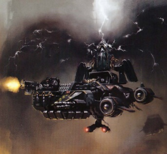
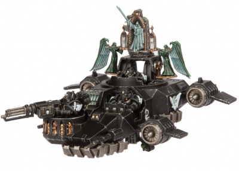

# 1462 鸦翼黑幕飞艇 Ravenwing Darkshroud

精校状态：中文行文已逐段精校，部分术语仍为暂定

分类：载具 / 地面 / 轻型

原文来源：https://www.bilibili.com/opus/1039569900294635545

原作者：帝国神选罐头

原文时间：2025年03月02日 10:22

[返回分类目录](目录.md) · [全书目录](../../目录.md)

<!-- A1462-B0001 -->
**英文原文**

The Ravenwing Darkshroud is an archaic version of the Land Speeder Vengeance used by the Dark Angels and their Successor Chapters. These vehicles drift forward, emitting partially seen force fields of haze that spew from their ancient reliquaries. Of all the weapons deployed by the Unforgiven, it is said that the ten Darkshrouds deployed by the Ravenwing are the strangest.

<!-- /A1462-B0001 -->

<!-- A1462-B0002 -->

原译文

鸦翼黑幕飞艇是黑暗天使及其子战团使用的兰德速攻艇复仇的古老版本。这些车辆向前漂移，从其古老的圣髑盒中喷出部分可见的黑幕力场。在不可饶恕者部署的所有武器中，据说鸦翼部署的十个黑幕飞艇是最奇怪的。

**校订译文**

鸦翼黑幕飞艇是复仇型兰德速攻艇的一种古老变体，由黑暗天使及其子战团使用。载具缓缓前行时，古老圣髑匣会释放出若隐若现的雾状力场。据说，在戴罪者投入战场的所有武器中，鸦翼的十架黑幕飞艇最为奇异。

<!-- /A1462-B0002 -->

<!-- A1462-B0003 图片 -->

<!-- A1462-B0004 -->

原译文

Ravenwing Darkshroud 鸦翼黑幕飞艇

**校订译文**

Ravenwing Darkshroud 鸦翼黑幕飞艇

<!-- /A1462-B0004 -->

<!-- A1462-B0005 -->
## History 历史

<!-- /A1462-B0005 -->

<!-- A1462-B0006 -->
**英文原文**

The Darkshroud's origins can be traced back to the destruction of Caliban 10,000 years before the 41st Millennium. Despite the planet's shattering at the hands of a massive Warp Storm, the Dark Angels' Fortress-Monastery remained due to the aid of its powerful force fields. The collision of Warp energies, however, had many repercussions. Ten of the stone statues of past ages that topped the fortress's tallest spiral had survived the catastrophe, now glowing with mysterious energies. The Stone Guardians, or Ten Brothers of the Order as they were known, were taken below into The Rock and locked in stasis fields for years. It was not until the desperation of the Vendetta Campaign that the Dark Angels unleashed the arcane powers of these artifacts on the field. Each statue was mounted upon a Ravenwing Land Speeder Vengeance with great cables siphoning off its mysterious energies and amplifying it. The result was a potent power field generator which partially obscures and protects Bikes and light vehicles. The force fields generated by the Darkshroud are powerful enough to block a Lascannon shot, allowing nearby Ravenwing troops to advance without fear.

<!-- /A1462-B0006 -->

<!-- A1462-B0007 -->

原译文

黑幕飞艇的起源可以追溯到第41千年的10000年前卡利班的毁灭。尽管星球在一场巨大的亚空间风暴中粉碎，但由于其强大的力场的帮助，黑暗天使的堡垒修道院仍然存在。然而，亚空间能量的碰撞产生了许多影响。 堡垒最高的螺旋塔顶上，有十尊往昔岁月的石像在那场灾难中幸存下来，此刻正散发着神秘的能量。石头守护者，或他们所熟知的骑士团十兄弟，被带到巨石之下，并被放置在停滞场多年。直到仇杀之战陷入绝境之时，黑暗天使才将这些神器的神秘力量在战场上释放出来。每尊雕像都被安置在鸦翼兰德速攻艇复仇上，巨大的线缆吸走了它神秘的能量并放大了。结果是一个强大的能量场发生器，部分遮挡和保护了摩托和轻型车辆。黑幕飞艇产生的力场足以阻挡激光炮的射击，使附近的鸦翼部队能够毫无恐惧地前进。

**校订译文**

黑幕飞艇的起源可追溯至第41千年以前约一万年前的卡利班毁灭事件。虽然巨大的亚空间风暴撕碎了整颗星球，黑暗天使的要塞修道院却凭借强大的力场幸存下来。然而，亚空间能量的碰撞留下了种种后果。堡垒最高塔顶上的十尊古代石像在灾难中完好留存，却开始散发神秘能量。这些被称为“石像守卫”或“骑士团十兄弟”的雕像，被移入巨石深处，在停滞力场中封存多年。直到仇杀战役陷入绝境，黑暗天使才将这些圣物的神秘力量释放到战场上。每尊石像都被装载于一架鸦翼复仇型兰德速攻艇，以粗大缆线抽取并放大其能量，从而形成强大的力场发生器，为摩托和轻型载具提供遮蔽与防护。黑幕飞艇的力场甚至足以挡住激光炮射击，使附近鸦翼部队能够无畏推进。

**校注：** 原文 spiral 疑为 spire 的笔误，按塔顶石像语境译作高塔；below into The Rock 指移至巨石内部下层，不是巨石外部下方。

<!-- /A1462-B0007 -->

<!-- A1462-B0008 图片 -->

<!-- A1462-B0009 -->

原译文

Darkshroud 黑幕飞艇

**校订译文**

Darkshroud 黑幕飞艇

<!-- /A1462-B0009 -->

<!-- A1462-B0010 -->
## Known Darkshrouds 著名黑幕飞艇

<!-- /A1462-B0010 -->

<!-- A1462-B0011 -->

原译文

Shadow of Caliban 卡利班阴影

**校订译文**

Shadow of Caliban 卡利班阴影号

<!-- /A1462-B0011 -->

本篇核心术语与暂定项

以下列出本篇出现的英文原形及核心术语表用词。同形词可能指不同对象，具体词义以本篇正文和校注为准；单复数、别名和仅见于图注的名称可能尚未列入。完整候选见[术语表](../../术语表/双语术语候选.csv)。

| 英文 | 采用中文 | 状态 |
| --- | --- | --- |
| Dark Angels | 黑暗天使 | 官方已核对 |
| Warp | 亚空间 | 官方已核对 |
| The Order | 秩序 | 暂定·官方待核 |
| Caliban | 卡利班 | 暂定·官方待核 |
| Land Speeder Vengeance | 复仇型兰德速攻艇 | 官方已核对 |
| Unforgiven | 戴罪者 | 暂定·官方待核 |
| Ancient | 旗手 | 官方已核对 |
| Fortress-monastery | 要塞修道院 | 暂定·官方待核 |
| Ravenwing Darkshroud | 鸦翼黑幕飞艇 | 官方已核 |
| Powers | 能天使 | 暂定·官方待核 |
| Vengeance | 复仇号 | 暂定·官方待核 |
| Bikes | 摩托 | 暂定·官方待核 |
| The Dark | 《黑暗》 | 暂定·官方待核 |
| Warp Storm | 亚空间风暴 | 暂定·官方待核 |
| Lascannon | 激光炮 | 官方已核对 |
| Stone Guardians | 石像守卫 | 暂定·官方待核 |
| Ten Brothers of the Order | 骑士团十兄弟 | 暂定·官方待核 |
| Vendetta Campaign | 仇杀战役 | 暂定·官方待核 |

