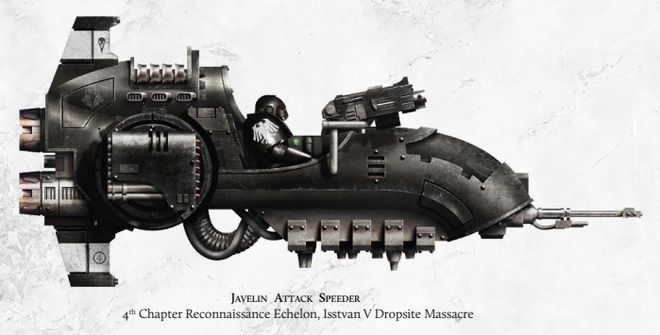
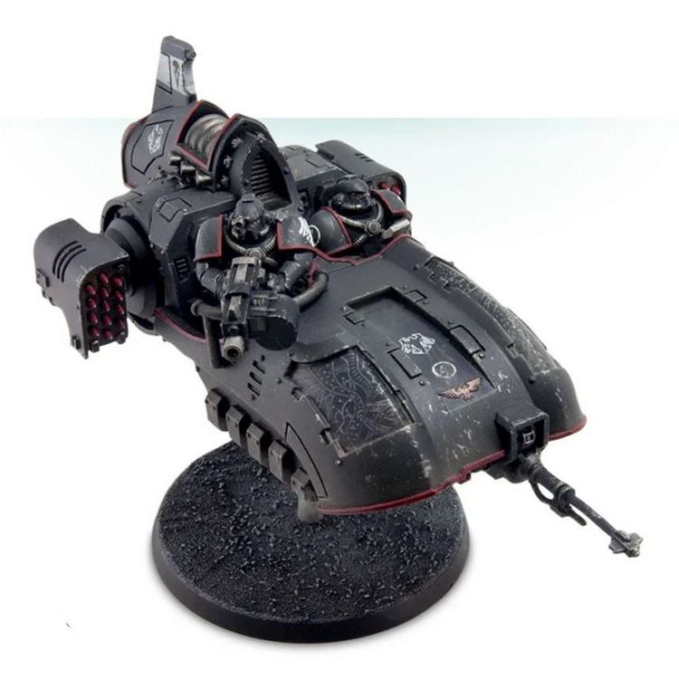
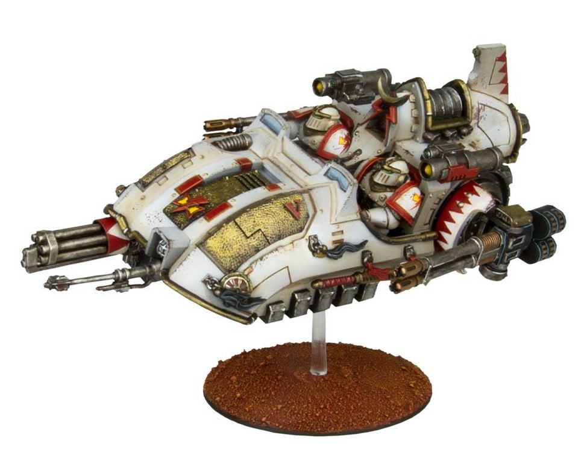

# 1463 标枪突击艇 Javelin Attack Speeder

精校状态：中文行文已逐段精校，部分术语仍为暂定

分类：载具 / 地面 / 轻型

原文来源：https://www.bilibili.com/opus/1045950087101939731

原作者：帝国神选罐头

原文时间：2025年03月19日 15:00

[返回分类目录](目录.md) · [全书目录](../../目录.md)

<!-- A1463-B0001 -->
**英文原文**

The Javelin Attack Speeder was an Imperial anti-grav fast attack vehicle used by the Legiones Astartes during the Horus Heresy.

<!-- /A1463-B0001 -->

<!-- A1463-B0002 -->

原译文

标枪攻击艇是荷鲁斯叛乱时期阿斯塔特军团使用的一种帝国反重力快速攻击载具。

**校订译文**

标枪突击艇是荷鲁斯之乱时期阿斯塔特军团使用的一种帝国反重力快速攻击载具。

<!-- /A1463-B0002 -->

<!-- A1463-B0003 图片 -->

<!-- A1463-B0004 -->

原译文

Javelin Attack Speeder from the Raven Guard 暗鸦守卫标枪攻击艇

**校订译文**

Javelin Attack Speeder from the Raven Guard 暗鸦守卫的标枪突击艇

<!-- /A1463-B0004 -->

<!-- A1463-B0005 -->
## Overview 概述

<!-- /A1463-B0005 -->

<!-- A1463-B0006 -->
**英文原文**

Javelin attack speeders share many of the advanced systems found in the Scimitar Jetbikes, making them rare and highly valued. They are mounted with antigrav impellor technology so esoteric that some amongst the Mechanicum regard them with distrust. Javelin attack speeders are time-consuming to construct and difficult to repair should they sustain battle damage.

<!-- /A1463-B0006 -->

<!-- A1463-B0007 -->

原译文

标枪攻击艇共享了弯刀悬浮摩托中的许多先进系统，使其稀有且具有很高的价值。它们安装了反重力推进技术，这种技术非常深奥，以至于机械神教中的一些人对它们不信任。标枪攻击艇建造耗时，如果受到战斗损伤，很难修复。

**校订译文**

标枪突击艇与弯刀型喷气摩托共用许多先进系统，因此既罕见又备受珍视。其反重力推进技术深奥到连部分机械教成员都心存疑虑。这类载具制造耗时，遭受战损后也很难修复。

<!-- /A1463-B0007 -->

<!-- A1463-B0008 -->
**英文原文**

Larger and more heavily armoured than the modern pattern of Land Speeder, the Javelin is an irreplaceable relic and the ability to manufacture the craft as of M41 has been lost. Its advanced gravitic nullification allowed it to mount an array of heavy weaponry more akin to a tank destroyer, allowing them to make pinpoint strikes on enemy armour or infantry with devastating Lascannon or Missile barrages. Those Chapters of Space Marines who date back to the days of the Heresy may still possess a few Javelins.

<!-- /A1463-B0008 -->

<!-- A1463-B0009 -->

原译文

标枪比现代兰德速攻艇更大、装甲更重，是一种不可替代的圣物，从M41开始，制造这种飞行器的能力已经丧失。其先进的重力抵消功能使其能够安装一系列更类似于坦克破坏炮的重型武器，使其能够用毁灭性的激光炮或导弹弹幕对敌方装甲或步兵进行精确打击。那些可以追溯到叛乱时代的星际战士可能仍然拥有一些标枪。

**校订译文**

标枪比现代兰德速攻艇更大，装甲也更厚，是不可替代的遗物；截至第41千年，其制造技术已经失传。先进的重力抵消系统使它能搭载近似坦克歼击车的重武器，以威力强大的激光炮或导弹齐射精准打击敌方装甲和步兵。部分历史可追溯至荷鲁斯之乱时代的星际战士战团，可能仍保有少量标枪。

**校注：** tank destroyer 为坦克歼击车类别，原译坦克破坏炮误当单件武器。

<!-- /A1463-B0009 -->

<!-- A1463-B0010 -->
**英文原文**

Nevertheless, they are fast, highly manoeuvrable, have an extended operational range and, perhaps most importantly, are able to carry a heavy payload of weapon systems.

<!-- /A1463-B0010 -->

<!-- A1463-B0011 -->

原译文

然而，它们速度快、机动性强、作战范围广，也许最重要的是，能够携带重型武器系统。

**校订译文**

尽管如此，标枪仍具备速度快、机动性强、行动半径大的优势；或许最重要的是，它能够承载沉重的武器系统。

<!-- /A1463-B0011 -->

<!-- A1463-B0012 图片 -->

<!-- A1463-B0013 -->

原译文

Javelin Attack Speeder with Missile Launchers 配备导弹发射器的标枪攻击艇

**校订译文**

Javelin Attack Speeder with Missile Launchers 配备导弹发射器的标枪突击艇

<!-- /A1463-B0013 -->

<!-- A1463-B0014 -->
**英文原文**

The Javelin is armed as standard with a twin-linked Lascannon. This may be replaced by a type of Cyclone Missile Launcher (a forerunner of the the same system carried now by Space Marines in Terminator Armour).

<!-- /A1463-B0014 -->

<!-- A1463-B0015 -->

原译文

标枪的标准装备是双联激光炮。这可能会被一种旋风导弹发射器（现在由星际战士在终结者盔甲中携带的相同系统的前身）所取代。

**校订译文**

标枪的标准武器是双联激光炮，也可换装一种旋风导弹发射器；后者是如今终结者装甲星际战士所用同类系统的前身。

<!-- /A1463-B0015 -->

<!-- A1463-B0016 -->
### Kyzagan Assault Speeder 凯扎根突击艇

<!-- /A1463-B0016 -->

<!-- A1463-B0017 -->
**英文原文**

A variant of the Javelin, the Kyzagan Assault Speeder, was developed by the White Scars mounted with a Kheres-pattern Assault Cannon, Hunter-Killer Missiles, and two Reaper Autocannons.

<!-- /A1463-B0017 -->

<!-- A1463-B0018 -->

原译文

标枪的一种变体，凯扎根突击艇，安装有克雷斯型突击炮、猎杀飞弹和两门收割者自动炮，是由白色伤疤开发的。

**校订译文**

白疤研制了标枪的变体——凯扎根突击艇，配备克雷斯型突击炮、猎杀导弹和两门收割者自动炮。

<!-- /A1463-B0018 -->

<!-- A1463-B0019 图片 -->

<!-- A1463-B0020 -->

原译文

Kyzagan Assault Speeder 凯扎根突击艇

**校订译文**

Kyzagan Assault Speeder 凯扎根突击艇

<!-- /A1463-B0020 -->

<!-- A1463-B0021 -->
## Weapons 武器

<!-- /A1463-B0021 -->

<!-- A1463-B0022 -->

原译文

Cyclone Missile Launchers 旋风导弹发射器

**校订译文**

Cyclone Missile Launchers 旋风导弹发射器

<!-- /A1463-B0022 -->

<!-- A1463-B0023 -->

原译文

Lascannons 激光炮

**校订译文**

Lascannons 激光炮

<!-- /A1463-B0023 -->

<!-- A1463-B0024 -->

原译文

Volkite Culverins 爆燃长炮

**校订译文**

Volkite Culverins 爆燃长炮

<!-- /A1463-B0024 -->

<!-- A1463-B0025 -->

原译文

Heavy Flamer 重型火焰枪

**校订译文**

Heavy Flamer 重型火焰喷射器

<!-- /A1463-B0025 -->

<!-- A1463-B0026 -->

原译文

Multi-Melta 多管热熔

**校订译文**

Multi-Melta 多管热熔

<!-- /A1463-B0026 -->

<!-- A1463-B0027 -->

原译文

Heavy Bolter 重型爆矢枪

**校订译文**

Heavy Bolter 重型爆矢枪

<!-- /A1463-B0027 -->

<!-- A1463-B0028 -->

原译文

Hunter-Killer Missile 猎杀飞弹

**校订译文**

Hunter-Killer Missile 猎杀导弹

<!-- /A1463-B0028 -->

本篇核心术语与暂定项

以下列出本篇出现的英文原形及核心术语表用词。同形词可能指不同对象，具体词义以本篇正文和校注为准；单复数、别名和仅见于图注的名称可能尚未列入。完整候选见[术语表](../../术语表/双语术语候选.csv)。

| 英文 | 采用中文 | 状态 |
| --- | --- | --- |
| Space Marines | 星际战士 | 官方已核对 |
| Terminator | 终结者 | 官方已核对 |
| Horus Heresy | 荷鲁斯之乱 | 官方已核对 |
| Mechanicum | 机械教 | 暂定·历史称谓 |
| Horus | 荷鲁斯 | 暂定·官方待核 |
| Hunter-Killer | 猎杀者 | 暂定·官方待核 |
| Legiones Astartes | 阿斯塔特军团 | 暂定·官方待核 |
| White Scars | 白疤 | 官方已核 |
| Scars | 伤疤 | 暂定·官方待核 |
| Destroyer | 毁灭者 | 暂定·官方待核 |
| Reaper | 收割者号 | 暂定·官方待核 |
| System | 星系（恒星系统） | 暂定·官方待核 |
| Missile Launcher | 导弹发射器 | 暂定·官方待核 |
| Cyclone Missile Launcher | 旋风导弹发射器 | 暂定·官方待核 |
| Assault Cannon | 突击炮 | 暂定·官方待核 |
| Lascannon | 激光炮 | 官方已核对 |
| Terminator Armour | 终结者盔甲 | 暂定·官方待核 |
| Javelin Attack Speeder | 标枪突击艇 | 暂定·官方待核 |
| Kyzagan Assault Speeder | 凯扎根突击艇 | 暂定·官方待核 |

