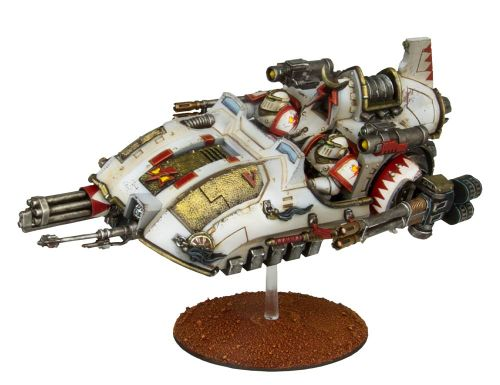

# 1464 凯扎根突击艇 Kyzagan Assault Speeder

精校状态：中文行文已逐段精校，部分术语仍为暂定

分类：载具 / 地面 / 轻型

原文来源：https://www.bilibili.com/opus/1045950155813027846

原作者：帝国神选罐头

原文时间：2025年03月19日 15:00

[返回分类目录](目录.md) · [全书目录](../../目录.md)

<!-- A1464-B0001 -->
**英文原文**

The Kyzagan Assault Speeder was a type of grav-vehicle used by the White Scars during the Great Crusade and Horus Heresy.

<!-- /A1464-B0001 -->

<!-- A1464-B0002 -->

原译文

凯扎根突击艇是大远征和荷鲁斯叛乱期间白色伤疤使用的一种轻型载具。

**校订译文**

凯扎根突击艇是白疤在大远征和荷鲁斯之乱期间使用的一种反重力载具。

**校注：** grav-vehicle 指反重力载具，不是轻型载具。

<!-- /A1464-B0002 -->

<!-- A1464-B0003 图片 -->

<!-- A1464-B0004 -->

原译文

Kyzagan Assault Speeder 凯扎根突击艇

**校订译文**

Kyzagan Assault Speeder 凯扎根突击艇

<!-- /A1464-B0004 -->

<!-- A1464-B0005 -->
## Overview 概述

<!-- /A1464-B0005 -->

<!-- A1464-B0006 -->
**英文原文**

Developed from the Javelin, the Kyzagan Assault Speeder was able to keep pace with the swift Brotherhoods of the White Scars in battle while still acting as a hard-hitting support vehicle. Mounted with a Kheres-pattern Assault Cannon, Hunter-Killer Missiles, and two Reaper Autocannons, the Kyzagan served as a highly agile heavy weapons platform that was capable of tearing through both armored vehicles and infantry with ease, while able to provide support to the rest of the Legion's swift-moving Jetbike squadrons.

<!-- /A1464-B0006 -->

<!-- A1464-B0007 -->

原译文

从标枪发展而来的凯扎根突击艇能够在战斗中跟上白色伤疤兄弟的快速步伐，同时仍然作为一种强有力的支援载具。凯扎根配备了克雷斯型突击炮、猎杀飞弹和两门收割者自动炮，是一个高度敏捷的重型武器平台，能够轻松撕裂装甲车和步兵，同时能够为军团其他快速移动的悬浮摩托中队提供支援。

**校订译文**

凯扎根突击艇由标枪发展而来，既能跟上白疤各兄弟会迅捷的战场机动，又能提供强有力的火力支援。它搭载克雷斯型突击炮、猎杀导弹和两门收割者自动炮，是高度灵活的重武器平台，能够轻易撕裂装甲载具与步兵，并为军团其他高速行动的喷气摩托中队提供支援。

<!-- /A1464-B0007 -->

<!-- A1464-B0008 -->
**英文原文**

These agile vehicles were in high demand among the White Scars, as they added an impressive firepower to the Legion's "Zao" and Scouting missions. The Kyzagan was proven during the Great Crusade and Heresy to be a heavily versatile vehicle on the battlefield; it did not rely on conventional tracks as the heavy armour of the Legions did, allowing it to engage in almost every conflict the White Scars pursued.

<!-- /A1464-B0008 -->

<!-- A1464-B0009 -->

原译文

这些敏捷的载具在白色伤疤中需求量很大，因为它们为军团的“Zao”和侦察任务增添了令人印象深刻的火力。凯扎根在大远征和叛乱中被证明是战场上功能强大的载具；它不像军团的重型装甲那样依赖传统的道路，这使它几乎可以参与白色伤疤所追求的每一场冲突。

**校订译文**

白疤对这些灵活载具需求极大，因为它们能为军团的“凿式突击”和侦察任务增添强劲火力。大远征和荷鲁斯之乱的战场证明了凯扎根的多用途能力：它不像军团重型装甲载具那样依赖传统履带，因此几乎能参与白疤发起的任何战斗。

**校注：** conventional tracks 指传统履带，原译道路改变了技术含义；Zao沿较早白疤篇已定“凿式突击”。

<!-- /A1464-B0009 -->

本篇核心术语与暂定项

以下列出本篇出现的英文原形及核心术语表用词。同形词可能指不同对象，具体词义以本篇正文和校注为准；单复数、别名和仅见于图注的名称可能尚未列入。完整候选见[术语表](../../术语表/双语术语候选.csv)。

| 英文 | 采用中文 | 状态 |
| --- | --- | --- |
| Horus Heresy | 荷鲁斯之乱 | 官方已核对 |
| Great Crusade | 大远征 | 暂定·官方待核 |
| Horus | 荷鲁斯 | 暂定·官方待核 |
| Hunter-Killer | 猎杀者 | 暂定·官方待核 |
| White Scars | 白疤 | 官方已核 |
| Scars | 伤疤 | 暂定·官方待核 |
| Zao | 凿式突击 | 暂定·官方待核 |
| Reaper | 收割者号 | 暂定·官方待核 |
| Assault Cannon | 突击炮 | 暂定·官方待核 |
| Jetbike | 喷气摩托 | 暂定·官方待核 |
| Kyzagan Assault Speeder | 凯扎根突击艇 | 暂定·官方待核 |
| Grav-vehicle | 反重力载具 | 暂定·官方待核 |

