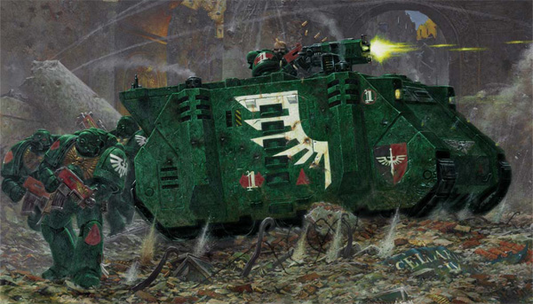
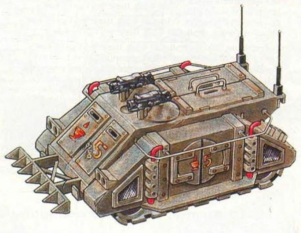
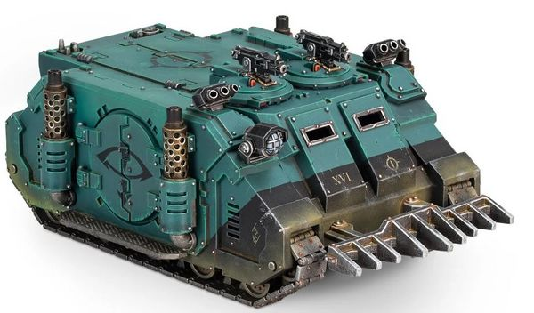
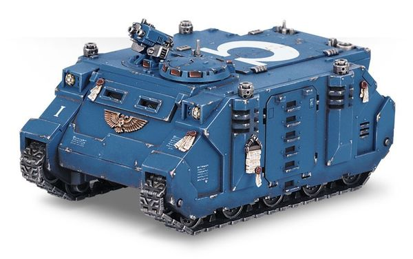
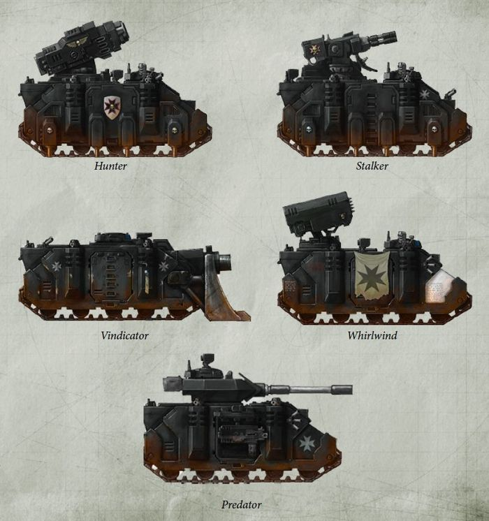
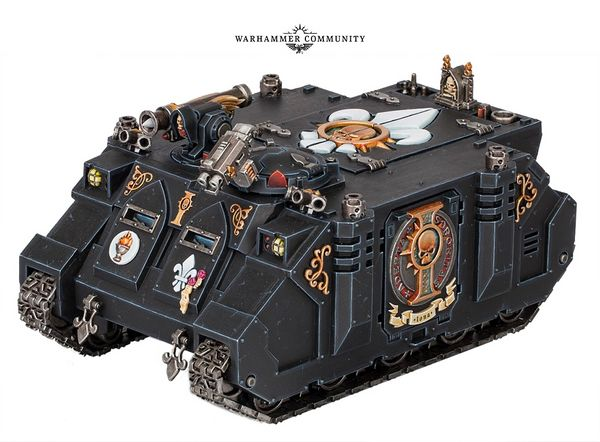
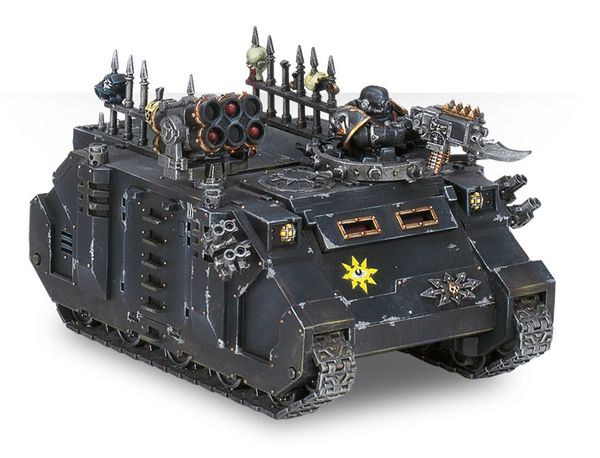
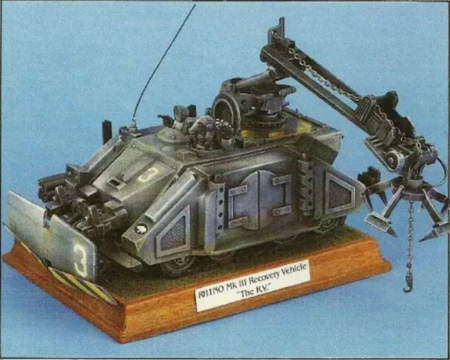
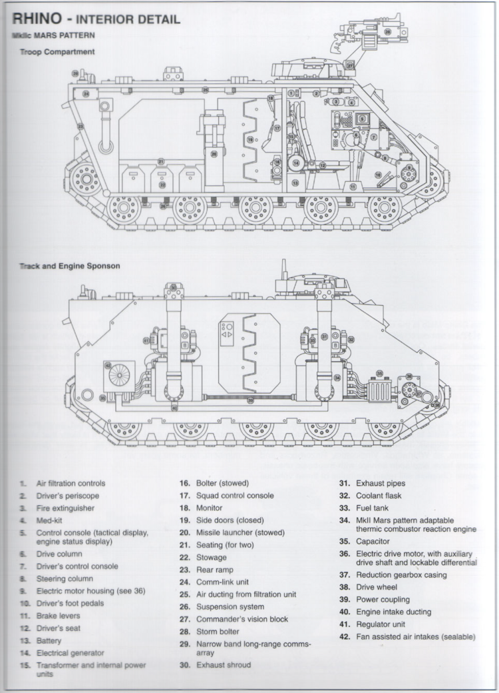
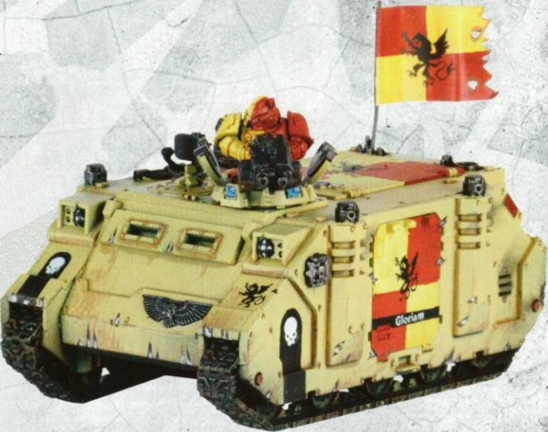

# 1465 犀牛战车 Rhino

精校状态：中文行文已逐段精校，部分术语仍为暂定

分类：载具 / 地面 / 轻型

原文来源：https://www.bilibili.com/opus/1037408363486380035

原作者：帝国神选罐头

原文时间：编辑于 2026年09月10日 09:18

[返回分类目录](目录.md) · [全书目录](../../目录.md)

原篇名：犀牛装甲车 Rhino

<!-- A1465-B0001 -->
**英文原文**

The Rhino is a common armoured troop transport produced by the Imperium. Its use is entrusted to only the most loyal of soldiers: the Space Marines, Sisters of Battle, Adeptus Arbites and the Inquisition.

<!-- /A1465-B0001 -->

<!-- A1465-B0002 -->

原译文

犀牛装甲车是帝国生产的一种常见的装甲运兵车。它的使用只委托给最忠诚的士兵：星际战士、战斗修女、法务部和审判庭。

**校订译文**

犀牛战车是帝国生产的一种常见装甲运兵车，仅交由最忠诚的部队和机构使用：星际战士、战斗修女、法务部与审判庭。

<!-- /A1465-B0002 -->

<!-- A1465-B0003 -->
**英文原文**

The Rhino is also used by the Chaos Space Marines, who either took their Rhinos with them after the Horus Heresy, or have stolen them in the millennia since then.

<!-- /A1465-B0003 -->

<!-- A1465-B0004 -->

原译文

混沌星际战士也使用犀牛装甲车，他们要么在荷鲁斯叛乱之后带走了犀牛装甲车，要么在此后的数千年里偷走了犀牛装甲车。

**校订译文**

混沌星际战士也使用犀牛战车。其中一些车辆是在荷鲁斯之乱后随主人一同叛离的，另一些则在此后数千年间从帝国夺来。

<!-- /A1465-B0004 -->

<!-- A1465-B0005 图片 -->

<!-- A1465-B0006 -->

原译文

Dark Angels MkIIc Mars-Pattern Rhino APC 黑暗天使MkIIc火星型犀牛装甲运兵车

**校订译文**

Dark Angels MkIIc Mars-Pattern Rhino APC 黑暗天使MkIIc火星型犀牛装甲运兵车

<!-- /A1465-B0006 -->

<!-- A1465-B0007 -->
**英文原文**

The Rhino's versatile design has allowed the development (mostly through the rediscovery of STC designs) of several variants, each fulfilling a different tactical role. Popular variants include the Razorback, Predator, Whirlwind and Immolator.

<!-- /A1465-B0007 -->

<!-- A1465-B0008 -->

原译文

犀牛装甲车的多功能设计允许开发（主要是通过重新发现STC设计）几种变体，每种变体都扮演着不同的战术角色。流行的变体包括豪猪战车、掠食者坦克、旋风战车和献祭者战车。

**校订译文**

犀牛战车的设计用途广泛，衍生出多种承担不同战术任务的变体，大多得益于重新发现的 STC 设计。常见变体包括豪猪战车、掠食者坦克、旋风战车和献祭者装甲车。

<!-- /A1465-B0008 -->

<!-- A1465-B0009 -->
## History 历史

<!-- /A1465-B0009 -->

<!-- A1465-B0010 -->
**英文原文**

The Rhino has been in service throughout the history of the Imperium. As a Standard Template Construct vehicle, the Rhino dates back to the distant time of Mankind's initial colonisation of the galaxy.

<!-- /A1465-B0010 -->

<!-- A1465-B0011 -->

原译文

犀牛装甲车在帝国历史上一直服役。作为一种标准模板构建载具，犀牛装甲车可以追溯到人类最初殖民银河系的遥远时代。

**校订译文**

犀牛战车贯穿帝国整个历史。作为标准模板建造系统设计的载具，其源头可追溯至人类最初殖民银河系的遥远年代。

<!-- /A1465-B0011 -->

<!-- A1465-B0012 -->
**英文原文**

Originally named "RH1-N0 Tracked Exploration and Multi-Purpose Defense Vehicle," it was used to explore newly colonised worlds. First field-tested on Mars, the "Rhino," as it came to be known, was a success, thanks to its extreme dependability, ability to run on any semi-combustible fuel source, and the fact that it can be produced from any locally available material, thus it is a simple and extremely adaptable vehicle. The material composition of a standard template Rhino is roughly 60 percent various metals and 40 percent other materials.

<!-- /A1465-B0012 -->

<!-- A1465-B0013 -->

原译文

它最初被命名为“RH1-N0履带式探索和多用途防御车”，用于探索新殖民的世界。首次在火星上进行实地测试的“犀牛”取得了成功，这要归功于它的极高可靠性、在使用任何半可燃燃料源运行的能力，以及它可以用任何当地可用的材料生产的事实，因此它是一种简单且适应性极强的车辆。标准模板犀牛装甲车的材料成分大约是60%的各种金属和40%的其他材料。

**校订译文**

它最初名为“RH1-N0履带式探索与多用途防御车”，用于探索新近殖民的世界。在火星完成首次实地测试后，这种后来被称为“犀牛”的载具取得了成功：它极为可靠，几乎任何能燃烧的材料都能用作燃料，还能以当地可得材料制造。因此，犀牛既简单又极具适应性。标准模板设计中，约60%的材料是各类金属，其余40%为其他材料。

<!-- /A1465-B0013 -->

<!-- A1465-B0014 -->
## Military Use 军用

<!-- /A1465-B0014 -->

<!-- A1465-B0015 -->
**英文原文**

The military value of such a vehicle was soon recognised, and soon each planet in the burgeoning human empire had its own customised versions of the Rhino, fitted with tons of varying weapons.

<!-- /A1465-B0015 -->

<!-- A1465-B0016 -->

原译文

这种载具的军事价值很快得到了认可，很快，新兴的人类帝国的每个星球都有自己的定制版本的犀牛，配备了大量不同的武器。

**校订译文**

这种载具的军事价值很快得到认可。随着人类疆域扩张，各个星球很快都有了装配多种武器的本地定制犀牛。

<!-- /A1465-B0016 -->

<!-- A1465-B0017 -->
**英文原文**

According to the ancient Liber Armorum the earliest evidence of the Rhino in combat was at Torben's World in battle against the indigenous alien population. During the attack, three hundred Rhinos were deployed to the largest alien city. The speed of the assault meant the xenos had no idea of the coming of the humans and had not prepared any defences. The Rhinos poured their firepower into the flimsy structures and then deployed nearly three thousand warriors. The city was destroyed and, with the alien presence removed, the colonisation proceeded easily. The news of this victory spread and the use of the Rhino was adopted more and more by other planets and local colonies.

<!-- /A1465-B0017 -->

<!-- A1465-B0018 -->

原译文

根据古代的装甲之书，犀牛装甲车在战斗中的最早证据是在托尔本世界与土著外星人作战。在袭击期间，三百辆犀牛装甲车被部署到最大的外星城市。攻击的速度意味着异型不知道人类的到来，也没有准备任何防御措施。犀牛装甲车将火力倾注在脆弱的建筑上，然后部署了近三千名战士。这座城市被摧毁，随着外星人的消失，殖民很容易进行。这一胜利的消息传开了，犀牛装甲车的使用越来越多地被其他行星和当地殖民地采用。

**校订译文**

古老的《装甲之书》记载，犀牛最早投入战斗的证据来自托尔本世界，对手是当地原生异形。三百辆犀牛向最大的异形城市发起突袭；进攻速度之快，让异形根本没察觉人类来袭，更无从组织防御。犀牛先以火力扫荡脆弱的建筑，随后放下近三千名战士。城市被毁，异形被清除，人类殖民也得以顺利展开。捷报传开后，越来越多星球和殖民地开始采用犀牛。

<!-- /A1465-B0018 -->

<!-- A1465-B0019 -->
**英文原文**

In the early Imperium, the Rhino was a far more ubiquitous vehicle, employed by most Imperial military forces. Since then, knowledge has faded, and the employment of the Rhino has become limited to the Space Marines and a few other Imperial organisations.

<!-- /A1465-B0019 -->

<!-- A1465-B0020 -->

原译文

在帝国早期，犀牛装甲车是一种更普遍的交通工具，被大多数帝国军队使用。在那之后，知识就消失了，犀牛装甲车的使用仅限于星际战士和其他一些帝国组织。

**校订译文**

帝国早期，犀牛的使用远比后来普遍，大多数帝国军事力量都曾配备。此后相关知识逐渐散失，使用范围才收缩至星际战士和少数帝国机构。

<!-- /A1465-B0020 -->

<!-- A1465-B0021 -->
**英文原文**

As the empire expanded, more aliens were encountered, and the STC system gave a forward army access to advanced vehicles such as the Predator, Immolator and Whirlwind. Unfortunately, during the Age of Strife, the STC systems were lost, and all the planets of the empire were affected. With the loss of the STC systems, the ability to construct Rhinos was also temporarily lost, leading to many Rhinos becoming holy relics, thousands of years old. Eventually the rediscovery of STC printouts (hard copy blueprints and information on their construction) by the Adeptus Mechanicus allowing the construction of Rhinos to resume.

<!-- /A1465-B0021 -->

<!-- A1465-B0022 -->

原译文

随着帝国的扩张，遇到了更多的外星人，STC系统使前线军队能够获得掠食者坦克、献祭者战锤和旋风战锤等先进车辆。不幸的是，在纷争时代，STC系统丢失了，帝国的所有行星都受到了影响。随着STC系统的丢失，建造犀牛装甲车的能力也暂时丧失，导致许多犀牛装甲车成为数千年前的圣物。最终，机械神教重新发现了STC打印资料（硬拷贝蓝图及其构造信息），使犀牛装甲车的制造得以恢复。

**校订译文**

随着人类疆域扩张、遭遇的异形增多，STC 系统为前线军队提供了掠食者、献祭者和旋风等先进载具。纷争时代到来后，STC 系统失落，各地人类世界都受到波及。制造犀牛的能力也一度丧失，许多残存车辆在历经数千年后被奉为圣物。直到机械修会重新发现 STC 打印资料——记载构造信息的实体蓝图——犀牛的生产才得以恢复。

**校注：** 此段叙述纷争时代以前的人类扩张，英文 empire 不宜一律当作帝皇建立的 Imperium，中文依时间关系表述为人类疆域。

<!-- /A1465-B0022 -->

<!-- A1465-B0023 -->
## Patterns 型号

<!-- /A1465-B0023 -->

<!-- A1465-B0024 -->
### MkIb Mars Pattern MkIb火星型

<!-- /A1465-B0024 -->

<!-- A1465-B0025 -->
**英文原文**

The oldest surviving Rhino pattern is the MkIb Mars Pattern, which was produced in such numbers that many surviving examples still exist. However, these machines are considered past their prime and no longer constructed, though they are still used with honour and respect. Compared to the current MkIIc pattern, the MkI's drive and engine system is less robust, lacking the same redundancy system. However it has a slightly higher top speed, load-bearing capacity, and requires less maintenance time.

<!-- /A1465-B0025 -->

<!-- A1465-B0026 -->

原译文

现存最古老的犀牛装甲车型号是MkIb火星型，其数量之多，以至于许多幸存的例子仍然存在。然而，这些机器被认为已经过了鼎盛时期，不再被建造，尽管它们仍然被荣誉和尊重地使用。与目前的MkIIc型号相比，MkI的驱动和发动机系统不太稳健，缺乏相同的冗余系统。然而，它具有略高的最高速度、承载能力，并且需要较少的维护时间。

**校订译文**

现存最古老的犀牛型号是 MkIb 火星型。当年的产量极大，因而至今仍有不少留存。这些机体虽已被认为过时、不再生产，却仍受到尊重并继续服役。相较于如今的 MkIIc，MkI 的驱动和引擎系统不够坚固，也缺少同等冗余设计；不过，它的极速与承载能力略高，所需维护时间更少。

<!-- /A1465-B0026 -->

<!-- A1465-B0027 图片 -->

<!-- A1465-B0028 -->

原译文

Rhino MkIb Armoured Assault Vehicle 犀牛MkIb装甲突击载具

**校订译文**

Rhino MkIb Armoured Assault Vehicle 犀牛MkIb装甲突击载具

<!-- /A1465-B0028 -->

<!-- A1465-B0029 -->
### MkIc Deimos Pattern MkIc迪莫斯型

原题：MkIc Deimos Pattern MkIc火卫二型

<!-- /A1465-B0029 -->

<!-- A1465-B0030 -->
**英文原文**

A variant of the MkIb, the MkIc or Deimos Pattern was the mainstay of the Legiones Astartes during the Great Crusade and Horus Heresy. The MkIc Deimos Pattern Rhino is amongst one of the oldest variants, first issued en-masse to the Space Marine Legions of the Great Crusade. It standard armament consisted of two pintle-mounted remotely controlled Bolters. The MkIc is more sophisticated than the MkIIc, featuring more advanced functionalities and a superior machine spirit.

<!-- /A1465-B0030 -->

<!-- A1465-B0031 -->

原译文

MkIb的一种变体，MkIc或火卫二型是大远征和荷鲁斯叛乱期间阿斯塔特军团的支柱。MkIc火卫二型犀牛装甲车是最古老的变体之一，首次大规模供给大远征的星际战士。它的标准武器由两个枢轴安装的远程控制爆矢枪组成。MkIc比MkIIc更复杂，具有更先进的功能和卓越的机魂。

**校订译文**

MkIc 又称迪莫斯型，是 MkIb 的变体，也是大远征和荷鲁斯之乱时期阿斯塔特军团的主力车型。它属于最古老的犀牛变体之一，曾在大远征期间率先大批配发给星际战士军团。标准武器是两挺安装在枢轴枪架上的遥控爆矢枪。MkIc 比 MkIIc 更精密，功能更先进，机魂也更为优越。

<!-- /A1465-B0031 -->

<!-- A1465-B0032 图片 -->

<!-- A1465-B0033 -->

原译文

Deimos Pattern Rhino 火卫二型犀牛装甲车

**校订译文**

Deimos Pattern Rhino 迪莫斯型犀牛战车

<!-- /A1465-B0033 -->

<!-- A1465-B0034 -->
### Deimos Rhino Variants 迪莫斯犀牛战车变体

原题：Deimos Rhino Variants 火卫二犀牛装甲车变体

<!-- /A1465-B0034 -->

<!-- A1465-B0035 -->

原译文

Damocles Command Rhino 达摩克里斯指挥犀牛装甲车

**校订译文**

Damocles Command Rhino 达摩克利斯指挥犀牛

<!-- /A1465-B0035 -->

<!-- A1465-B0036 -->

原译文

Deimos Pattern Predator 火卫二型掠食者坦克

**校订译文**

Deimos Pattern Predator 迪莫斯型掠食者坦克

<!-- /A1465-B0036 -->

<!-- A1465-B0037 -->

原译文

Deimos Pattern Vindicator 火卫二型维护者坦克

**校订译文**

Deimos Pattern Vindicator 迪莫斯型维护者战车

<!-- /A1465-B0037 -->

<!-- A1465-B0038 -->

原译文

Rhino Advancer 犀牛装甲推进者

**校订译文**

Rhino Advancer 推进犀牛

<!-- /A1465-B0038 -->

<!-- A1465-B0039 -->

原译文

Castellan Rhino 堡主犀牛装甲车

**校订译文**

Castellan Rhino 堡主犀牛战车

<!-- /A1465-B0039 -->

<!-- A1465-B0040 -->

原译文

Whirlwind Scorpius 天蝎型旋风战车

**校订译文**

Whirlwind Scorpius 天蝎型旋风战车

<!-- /A1465-B0040 -->

<!-- A1465-B0041 -->
### MkIIc Mars pattern MkIIc火星型

<!-- /A1465-B0041 -->

<!-- A1465-B0042 -->
**英文原文**

The modern Mars Pattern Rhino(MkIIc) also saw use during the Great Crusade, thought not at the levels seen with the Deimos pattern. The Mars Pattern Rhino was more easily reproduced, but had inferior environmental and secondary systems.

<!-- /A1465-B0042 -->

<!-- A1465-B0043 -->

原译文

现代火星型犀牛装甲车（MkIIc）在大远征期间也得到了使用，被认为没有火卫二型的水平。火星型犀牛更容易生产，但环境和次级系统较差。

**校订译文**

现代火星型犀牛（MkIIc）在大远征期间也已服役，只是使用规模不及迪莫斯型。火星型更易生产，但环境调节系统和辅助系统性能较逊。

**校注：** thought 应为 though 的笔误；not at the levels 指使用规模较小，并非型号技术水平较低。

<!-- /A1465-B0043 -->

<!-- A1465-B0044 图片 -->

<!-- A1465-B0045 -->

原译文

Ultramarines Rhino MkIIc 极限战士MkIIc犀牛装甲车

**校订译文**

Ultramarines Rhino MkIIc 极限战士MkIIc犀牛战车

<!-- /A1465-B0045 -->

<!-- A1465-B0046 -->
**英文原文**

Now, only the Adeptus Mechanicus possess the knowledge to build a Rhino (although a Rhino could easily be built on virtually any world in the Imperium if it possessed a copy of the Rhino design schemes). Each Rhino is purified and blessed, each piece appeased before being put in place. Should a Rhino be lost in battle, it will be salvaged and repaired if possible, being sent back out into the field to give the Machine Spirit a chance for retribution against its enemies.

<!-- /A1465-B0046 -->

<!-- A1465-B0047 -->

原译文

现在，只有机械神教拥有建造犀牛装甲车的知识（尽管如果拥有犀牛装甲车设计方案的副本，犀牛装甲车几乎可以在帝国的任何世界上建造）。每一辆犀牛装甲车都经过净化和祝福，每一辆犀牛装甲车在放置到位之前都得到了安抚。如果犀牛装甲车在战斗中丢失，如果可能的话，它将被抢救和修复，并被送回战场，让机魂有机会对敌人进行复仇。

**校订译文**

如今只有机械修会掌握制造犀牛的知识，不过，只要取得设计图副本，帝国几乎任何世界都能轻易生产。每辆犀牛都要经过净化和祝福，每个零件在安装前也都须接受安抚。车辆若在战斗中损失，只要可能便会被回收修复，随后重新投入战场，让机魂有机会向敌人复仇。

**校注：** each piece 指每个零件，原译重复为每辆车。

<!-- /A1465-B0047 -->

<!-- A1465-B0048 -->
### Design 设计

<!-- /A1465-B0048 -->

<!-- A1465-B0049 -->
**英文原文**

At its most basic level the Mars-Pattern MkIIc Rhino is an armoured personnel carrier with large tracks designed to cope with any terrain and protect its passengers from harm. It is such a basic design, able to be constructed from almost any material and be powered by any semi-combustible material, that little has changed throughout its 10,000 year history.\[2b\] Such is its resiliency that damage sustained in battle can often be repaired in the field by the crew themselves.

<!-- /A1465-B0049 -->

<!-- A1465-B0050 -->

原译文

在最基本的层面上，火星型MkIIc犀牛装甲车是一种装甲运兵车，其大型履带设计用于应对任何地形并保护乘客免受伤害。它是一种基本的设计，几乎可以用任何材料制造，并由任何半可燃材料提供动力，在其10000年的历史中几乎没有变化。由于其韧性，战斗中遭受的损坏通常可以由车组人员自己在现场修复。

**校订译文**

从基本构造看，MkIIc 火星型犀牛是一种装甲运兵车，以大型履带适应各种地形，并保护搭载人员。其设计简单，几乎可由任何材料制造，也能以各种可燃材料驱动，因此一万年来变化甚微。它坚固耐用，战损往往可由车组在战地自行修复。

<!-- /A1465-B0050 -->

<!-- A1465-B0051 -->
### Armament 军备

<!-- /A1465-B0051 -->

<!-- A1465-B0052 -->
**英文原文**

The MkIIc Rhino is primarily armed with a Storm Bolter for close defense, which is remotely operated by the driver. It can also be equipped with a second pintle-mounted Storm Bolter, which can be fired by a passenger from the top hatch, as well as Hunter-Killer missiles and frag- or blind-grenades Auto-launchers. These cupola-mounted weapons can operate autonomously, tracking and engaging potential targets with the help of targeting augurs and range-finding lenses, even detecting and reacting to active weapon signatures.

<!-- /A1465-B0052 -->

<!-- A1465-B0053 -->

原译文

MkIIc犀牛装甲车主要配备风暴爆矢枪进行近距离防御，由驾驶员远程操作。它还可以配备第二个枢轴安装的风暴爆矢枪，乘员可以从顶部舱口射击，以及猎杀飞弹和破片或致盲榴弹自动发射器。这些安装在穹顶上的武器可以自动操作，在瞄准鸟卜仪和测距透镜的帮助下跟踪和攻击潜在目标，甚至可以检测和应对主动武器信号特征。

**校订译文**

MkIIc 犀牛的主要自卫武器是一挺由驾驶员遥控的风暴爆矢枪。车辆还能在枢轴枪架上增设第二挺风暴爆矢枪，由乘员从顶部舱口操纵；另可配备猎杀导弹，以及发射破片或致盲榴弹的自动发射器。这些安装在车顶指挥塔上的武器可自主运作，借助瞄准探测器和测距透镜追踪并攻击潜在目标，甚至能够察觉正在运作的武器信号，并作出反应。

<!-- /A1465-B0053 -->

<!-- A1465-B0054 -->
### Armour 装甲

<!-- /A1465-B0054 -->

<!-- A1465-B0055 -->
**英文原文**

The most common form of armouring is a bonded ceramite layer over a cast plasteel hull. However, other materials have been known to be used instead, from composite carbon compounds to conventional hardened steel, adamantium or even special riveted plates.

<!-- /A1465-B0055 -->

<!-- A1465-B0056 -->

原译文

最常见的装甲形式是在铸造的塑钢车体上覆盖一层增强陶钢层。然而，已知可以使用其他材料代替，从复合碳化合物到传统的硬化钢、精金，甚至特殊的铆接板。

**校订译文**

最常见的防护结构是在铸造塑钢车体上结合一层陶钢装甲。但也存在使用其他材料的型号，例如碳基复合材料、传统硬化钢、精金，乃至特殊铆接板。

<!-- /A1465-B0056 -->

<!-- A1465-B0057 -->
### Engine 引擎

<!-- /A1465-B0057 -->

<!-- A1465-B0058 -->
**英文原文**

The MkIIc Rhino is powered by four MkII Mars-pattern adaptable thermic combustor reactor engines. The engines are fed by a fan-assisted air intake and each one is hooked into a dynamo, which in turn is connected via power coupling to two electric motors, which power the vehicle's batteries. Each engine also has its own fuel tank and air supply to use if necessary (i.e. fighting in toxic atmospheres or vacuum). This level of redundancy means that, should one engine be disabled, power reduction is minimal; if both engines on one side are lost, the remaining two can still power the drive wheels through an auxiliary drive shaft and locking differential, though the Rhino's speed will be cut in half. Should all four engines be destroyed, electrical energy stored in the vehicle's batteries, recharged by the electric motors, can be used to continue operation for a short period of time. In addition, most Rhinos include rudimentary self-repair systems able to restore motive and drive functions. This basic design feature lends towards the Rhino's reputation as a rugged carrier, able to keep moving after suffering damage that would cripple lesser vehicles. The Rhino's track are made from plasteel.

<!-- /A1465-B0058 -->

<!-- A1465-B0059 -->

原译文

MkIIc犀牛装甲车由四台MkII火星型适应性热燃烧反应堆发动机提供动力。发动机由风扇辅助进气口供气，每台发动机都连接着一台发电机，而发电机又通过动力耦合装置与两台电动机相连，这两台电动机为车辆的电池充电。每台发动机都有自己的油箱和空气供给，必要时可以使用（即在有毒环境或真空中作战）。这种程度的冗余意味着，万一一台发动机失灵，动力下降幅度极小；要是一侧的两台发动机都无法运转，剩下的两台发动机仍能通过一根辅助驱动轴和锁止差速器为驱动轮提供动力，尽管犀牛装甲车的速度将减半。如果四台发动机全部被毁，由电动机充电并存储在车辆电池中的电能可用于维持车辆短时间运行。此外，大多数犀牛装甲车配备了基础的自我修复系统，能够恢复车辆的移动和驱动功能。这一基本设计特点成就了犀牛装甲车坚固耐用的声誉，即便遭受足以使其他性能较差的车辆瘫痪的损伤，它仍能继续前行。犀牛运兵车的履带由塑钢制成。

**校订译文**

MkIIc 犀牛由四台 MkII 火星型自适应热燃烧反应堆引擎驱动。风扇辅助进气口为引擎供气，每台引擎各连接一台发电机，再通过动力耦合装置与两台电动机相连；按原文所述，后者还为车载电池供电。每台引擎都有独立油箱和空气供应，可在有毒大气或真空中使用。这种冗余设计使单台引擎失效时的动力损失很小；即使同一侧两台引擎全被毁，另一侧的两台仍能通过辅助传动轴和锁止差速器驱动履带，只是车速减半。四台引擎全部损坏后，电池中储存的电能还能维持短时行驶。此外，多数犀牛配有基础自修复系统，能够恢复动力与传动功能。正因如此，犀牛以坚固耐用著称：遭受足以使较弱车辆瘫痪的损伤后，它仍能前进。其履带由塑钢制成。

**校注：** 英文把 dynamo、electric motors 与电池供电/充电关系混写，按其叙述保留，不以现实工程常识擅自改写线路。

<!-- /A1465-B0059 -->

<!-- A1465-B0060 -->
### Equipment 装备

原题：Equipment 设备

<!-- /A1465-B0060 -->

<!-- A1465-B0061 -->
**英文原文**

Each MkIIc Rhino comes equipped with a Searchlight and Smoke Launchers, and can be further upgraded with Dozer Blades, a Hunter-killer Missile and Extra Armour.

<!-- /A1465-B0061 -->

<!-- A1465-B0062 -->

原译文

每辆MkIIc犀牛装甲车都配备了探照灯和烟雾发射器，并可以进一步升级推土铲、猎杀飞弹和额外装甲。

**校订译文**

每辆 MkIIc 犀牛都配有探照灯和烟雾发射器，还可加装推土铲、猎杀导弹和附加装甲。

<!-- /A1465-B0062 -->

<!-- A1465-B0063 -->
### Transport capacity 运输能力

<!-- /A1465-B0063 -->

<!-- A1465-B0064 -->
**英文原文**

The capacity of a MkIIc Rhino is ten Power Armoured warriors, although it is not equipped to handle Terminator Armour or Jump Pack-equipped Space Marines. Two side hatches and a rear ramp allow for quick exits, while a fourth top hatch allows two passengers to fire from the Rhino, in addition to serving as an emergency escape hatch. The Rhino allows Space Marines to restock their supplies and refuel their reactor packs.

<!-- /A1465-B0064 -->

<!-- A1465-B0065 -->

原译文

MkIIc犀牛装甲车的容量是10名动力盔甲战士，尽管它没有配备处理终结者装甲或配备跳跃背包的星际战士的装备。两个侧舱门和一个后坡道允许快速出入，而第四个顶部舱门除了作为紧急逃生舱门外，还允许两名乘客从犀牛装甲车上开火。犀牛装甲车允许星际战士补充补给并为反应堆背包充能。

**校订译文**

MkIIc 犀牛可搭载十名身穿动力甲的战士，但无法容纳身披终结者装甲或携带跳跃背包的星际战士。两侧舱门和后部跳板便于快速上下车；顶部另有第四处舱口，既供两名乘员向外射击，也可用于紧急逃生。星际战士还能在车内补充物资，并为反应堆背包补充燃料。

<!-- /A1465-B0065 -->

<!-- A1465-B0066 -->
## Known Variants 已知变体

<!-- /A1465-B0066 -->

<!-- A1465-B0067 -->
## Space Marines 星际战士

<!-- /A1465-B0067 -->

<!-- A1465-B0068 -->
**英文原文**

It is known that when manufacturing the Rhino APC, Tech-Priests carry out a wide variety of rituals, peculiar blessing as it is tend to vehicles of any kind. This process is followed by predictions and omens, during which they investigate the properties of Machine Spirits of each individual machine. As a result Rhino can be earmarked as the primary Rhino, or the vehicle is returned to the forges to be outfitted as one of the many variants.

<!-- /A1465-B0068 -->

<!-- A1465-B0069 -->

原译文

众所周知，在制造犀牛装甲运兵车时，技术神甫会进行各种各样的仪式，对任何类型的车辆都有特殊的祝福。这一过程之后是预测和预兆，在此期间，他们研究了每台机器的机魂的特性。因此，犀牛装甲车可以被指定为基本的犀牛装甲车，或者车辆被送回铸造厂，作为许多变体之一进行装备。

**校订译文**

制造犀牛装甲运兵车时，技术祭司会举行一系列仪式，像照料其他载具一样给予祝福。随后他们通过占卜和兆象，考察每台机体的机魂特性，再决定将它作为基本型犀牛使用，还是送回锻炉，改装成众多变体之一。

<!-- /A1465-B0069 -->

<!-- A1465-B0070 图片 -->

<!-- A1465-B0071 -->

原译文

Rhino variants 犀牛装甲车变体

**校订译文**

Rhino variants 犀牛战车变体

<!-- /A1465-B0071 -->

<!-- A1465-B0072 -->

原译文

Predator 掠食者坦克a more heavily armed and armoured version of the Rhino personnel carrier.犀牛装甲车的更重型武装和装甲版本。

**校订译文**

Predator 掠食者坦克a more heavily armed and armoured version of the Rhino personnel carrier.犀牛战车的更重型武装和装甲版本。

<!-- /A1465-B0072 -->

<!-- A1465-B0073 -->

原译文

Razorback 豪猪战车a support tank with heavier weapons and reduced transport capacity配备重型武器和运输能力降低的支援坦克

**校订译文**

Razorback 豪猪战车

<!-- /A1465-B0073 -->

<!-- A1465-B0074 -->

原译文

Vindicator 维护者坦克a short ranged siege tank短程攻城坦克

**校订译文**

Vindicator 维护者战车a short ranged siege tank短程攻城坦克

<!-- /A1465-B0074 -->

<!-- A1465-B0075 -->

原译文

Whirlwind 旋风战车a Rhino-based multiple rocket launcher基于犀牛装甲车的多管火箭发射车

**校订译文**

Whirlwind 旋风战车a Rhino-based multiple rocket launcher基于犀牛战车的多管火箭发射车

<!-- /A1465-B0075 -->

<!-- A1465-B0076 -->

原译文

Hunter 猎手战车an anti-aircraft missile vehicle variant of the Whirlwind旋风战车的防空导弹变体

**校订译文**

Hunter 猎手战车an anti-aircraft missile vehicle variant of the Whirlwind旋风战车的防空导弹变体

<!-- /A1465-B0076 -->

<!-- A1465-B0077 -->

原译文

Stalker 追猎者战车an air defense vehicle.防空载具

**校订译文**

Stalker 追猎者战车an air defense vehicle.防空载具

<!-- /A1465-B0077 -->

<!-- A1465-B0078 -->

原译文

Damocles Command Rhino 达摩克里斯指挥犀牛装甲车a Rhino-based command vehicle基于犀牛装甲车的指挥载具

**校订译文**

Damocles Command Rhino 达摩克利斯指挥犀牛a Rhino-based command vehicle基于犀牛战车的指挥载具

<!-- /A1465-B0078 -->

<!-- A1465-B0079 -->

原译文

Sabre Tank Hunter 军刀坦克猎手an Imperial attack vehicle based on the Rhino armoured carrier, incorporating a fixed, forward firing weapon in its front hull一种以犀牛装甲车为基础的帝国攻击载具，在其前装甲中装有固定的前射武器

**校订译文**

Sabre Tank Hunter 军刀坦克猎手an Imperial attack vehicle based on the Rhino armoured carrier, incorporating a fixed, forward firing weapon in its front hull一种以犀牛战车为基础的帝国攻击载具，在其前装甲中装有固定的前射武器

<!-- /A1465-B0079 -->

<!-- A1465-B0080 -->

原译文

Rhino Primaris 尖峰犀牛装甲车battlefield support variant and command version of the Rhino犀牛装甲车的战场支援变体和指挥版本

**校订译文**

Rhino Primaris 尖峰犀牛战车battlefield support variant and command version of the Rhino犀牛战车的战场支援变体和指挥版本

<!-- /A1465-B0080 -->

<!-- A1465-B0081 -->

原译文

Rhino Advancer 犀牛装甲推进者

**校订译文**

Rhino Advancer 推进犀牛

<!-- /A1465-B0081 -->

<!-- A1465-B0082 -->

原译文

Medical Rhino 医用犀牛装甲车

**校订译文**

Medical Rhino 医疗犀牛

<!-- /A1465-B0082 -->

<!-- A1465-B0083 -->

原译文

Techmarine Rhino 技术军士犀牛

**校订译文**

Techmarine Rhino 科技战士犀牛

<!-- /A1465-B0083 -->

<!-- A1465-B0084 -->
## Adepta Sororitas Rhinos 修女会犀牛战车

原题：Adepta Sororitas Rhinos 修女会犀牛装甲车

<!-- /A1465-B0084 -->

<!-- A1465-B0085 -->
**英文原文**

In addition to the Mk.IIc that they also operate, the Sisters of Battle have the exclusive use of the Mk.IIIa Mars-pattern Rhino. Based upon improvements made by the incorporation of the Immolator STC, this version is slightly taller, featuring a superstructure with vision blocks arranged for all-round observation of the battlefield from inside, as well as two large circular hatches that can serve as access and firing points, or mount an observation cupola (or a turret in the case of the Immolator).

<!-- /A1465-B0085 -->

<!-- A1465-B0086 -->

原译文

除了他们也操作的Mk.IIc之外，战斗修女还独家使用Mk.IIIa火星犀牛装甲车。基于引入献祭者STC所做的改进，该版本略高，其上层结构设有观察窗，便于车内人员全方位观察战场情况。此外，还有两个大型圆形舱口，既可作为出入口与射击点，也能安装观察指挥塔（对于献祭者型而言，则可安装炮塔）。

**校订译文**

除 MkIIc 外，战斗修女还专用 MkIIIa 火星型犀牛。该型吸收了献祭者 STC 的改进，车身稍高，上部结构的观察窗让乘员可从车内环视战场。两个大型圆形舱口既能供人员出入和射击，也可安装观察指挥塔；改作献祭者时，则可安装炮塔。

<!-- /A1465-B0086 -->

<!-- A1465-B0087 图片 -->

<!-- A1465-B0088 -->

原译文

Mk.IIc Rhino of the Adepta Sororitas 修女会的Mk.IIc犀牛装甲车

**校订译文**

Mk.IIc Rhino of the Adepta Sororitas 修女会的Mk.IIc犀牛战车

<!-- /A1465-B0088 -->

<!-- A1465-B0089 -->
**英文原文**

Like the Space Marine versions, those Rhinos possess embarkation stations to which the passengers can connect their power armour, in order to recharge their motive core and exchange data. This version is generally held as superior to the Mk.II when used in dense terrain due to its viewports and fireports arrangement, at the price of an increased vulnerability to anti-tank weaponry due to its higher profile.

<!-- /A1465-B0089 -->

<!-- A1465-B0090 -->

原译文

与星际战士型号一样，这些犀牛拥有搭载站，乘员可以将其动力盔甲连接到该搭载站，以便为其动力核心充电并交换数据。由于其观察口和炮口布置，该版本在密集地形的使用通常被认为优于Mk.II，但由于其更高的轮廓，其对反坦克武器的脆弱性增加。

**校订译文**

与星际战士车型一样，这些犀牛设有乘员接驳装置，可连接动力甲，为其动力核心充能并交换数据。由于观察口和射击孔布局更好，该型在复杂密集地形中通常被认为优于 MkII；代价是车身更高，更容易遭反坦克武器命中。

<!-- /A1465-B0090 -->

<!-- A1465-B0091 -->
**英文原文**

Some Adepta Sororitas Rhinos also are equipped with twin cannons next to the driver's hatch instead of a storm bolter.

<!-- /A1465-B0091 -->

<!-- A1465-B0092 -->

原译文

一些修女会犀牛装甲车也在驾驶舱旁边配备了双联加农炮，而不是风暴爆矢枪。

**校订译文**

部分修女会犀牛在驾驶员舱口旁安装一对机关炮，取代风暴爆矢枪。

**校注：** 英文 twin cannons 只说明成对火炮，未明确 twin-linked，故不强译为双联。

<!-- /A1465-B0092 -->

<!-- A1465-B0093 -->
### Sororitas Rhino Variants 修女犀牛战车变体

原题：Sororitas Rhino Variants 修女犀牛装甲车变体

<!-- /A1465-B0093 -->

<!-- A1465-B0094 -->

原译文

Immolator 献祭者战车

**校订译文**

Immolator 献祭者装甲车

<!-- /A1465-B0094 -->

<!-- A1465-B0095 -->

原译文

Exorcist 驱魔者战车

**校订译文**

Exorcist 驱魔者战车

<!-- /A1465-B0095 -->

<!-- A1465-B0096 -->

原译文

Repressor 镇压者装甲车

**校订译文**

Repressor 镇压者装甲车

<!-- /A1465-B0096 -->

<!-- A1465-B0097 -->

原译文

Castigator Battle Tank 惩戒者战斗坦克

**校订译文**

Castigator Battle Tank 惩戒者战斗坦克

<!-- /A1465-B0097 -->

<!-- A1465-B0098 -->
## Chaos Rhinos 混沌犀牛战车

原题：Chaos Rhinos 混沌犀牛装甲车

<!-- /A1465-B0098 -->

<!-- A1465-B0099 -->
**英文原文**

Chaos Rhinos are Rhino vehicles in the service of Chaos Space Marines. Serving as their most common vehicle, over the ten thousand years since the Long War began, Chaos Marines have continued to use the robust Rhino as their favored main transport. Chaos forces are known to loot and confiscate Rhinos from Imperial armies, though they quickly burn them clean of Imperial insignia and replace them with spikes, blades, and gory trophies. In some cases these rhinos may even be outright possessed by a bound daemon, nullifying the need for a crew.

<!-- /A1465-B0099 -->

<!-- A1465-B0100 -->

原译文

混沌犀牛装甲车是为混沌星际战士服务的犀牛载具。作为他们最常见的交通工具，自长战开始以来的一万多年里，混沌星际战士一直使用坚固的犀牛装甲车作为他们最喜欢的主要交通工具。众所周知，混沌势力会从帝国军队中掠夺和没收犀牛装甲车，尽管他们很快就会把犀牛装甲车身上的帝国徽章烧掉，并用尖刺、刀片和血淋淋的战利品取而代之。在某些情况下，这些犀牛装甲车甚至可能被一个束缚的恶魔完全占有，从而不需要乘员。

**校订译文**

混沌犀牛是混沌星际战士使用的犀牛战车，也是他们最普遍的载具。万古长战开始以来的一万年中，这种坚固的车辆一直是他们偏爱的主力运输工具。混沌部队常从帝国军队手中掠夺、缴获犀牛，随即烧去帝国标记，换上尖刺、刀刃与血腥战利品。有些车辆甚至被束缚其中的恶魔完全附身，无须车组便可行动。

<!-- /A1465-B0100 -->

<!-- A1465-B0101 图片 -->

<!-- A1465-B0102 -->

原译文

Chaos Space Marine Rhino 混沌星际战士犀牛装甲车

**校订译文**

Chaos Space Marine Rhino 混沌星际战士犀牛战车

<!-- /A1465-B0102 -->

<!-- A1465-B0103 -->
## Adeptus Arbites Rhinos 法务部犀牛战车

原题：Adeptus Arbites Rhinos 法务部犀牛装甲车

<!-- /A1465-B0103 -->

<!-- A1465-B0104 -->
**英文原文**

The Rhinos of the Adeptus Arbites are employed for urban pacification and riot control. They have a narrow interior, full with lockers and weapon racks for holding stub guns, mauls, grenade launchers, grapplehawks, shotguns and shields and carry ten Arbitrators and four cyber-mastiffs. Some Arbites Rhinos are armed with a pintle-mounted storm bolter, while others have a pintle-mounted heavy stubber firing man-stopper bullets and a grenade launcher equipped with choke grenades.

<!-- /A1465-B0104 -->

<!-- A1465-B0105 -->

原译文

法务部的犀牛被用来平定城市和控制暴乱。它们有一个狭窄的内部空间，里面装满了储物柜和武器架，用于存放短管枪、槌、榴弹发射器、搏斗鹰、霰弹枪和盾牌，并携带了10名仲裁员和4只智控獒犬。一些法务部犀牛配备了枢轴式风暴爆矢枪，而另一些犀牛则配备了一个可以发射人员制止子弹的枢轴式重型伐木枪和一个装有窒息榴弹的榴弹发射器。

**校订译文**

法务部用犀牛执行城市平定与防暴任务。狭窄车厢内布满储物柜和武器架，存放短管枪、战槌、榴弹发射器、格斗天鹰、霰弹枪和盾牌，可搭载十名仲裁官与四只智控獒犬。部分车辆装有枢轴枪架风暴爆矢枪；另一些则配备发射高制止力弹药的重机枪，以及发射窒息榴弹的榴弹发射器。

**校注：** Heavy stubber 按GW04/GW11官方名统一“重机枪”；Arbitrators 沿核心仲裁官。

<!-- /A1465-B0105 -->

<!-- A1465-B0106 -->
### Abductor-pattern Rhino 劫持者型犀牛

<!-- /A1465-B0106 -->

<!-- A1465-B0107 -->
**英文原文**

The Abductor-pattern Rhino is a Rhino variant fielded by the Adeptus Arbites. It is used to transport prisoners, either by cramming them into its interior or carrying them on the outside on carry-hooks.

<!-- /A1465-B0107 -->

<!-- A1465-B0108 -->

原译文

劫持者型犀牛是法务部部署的犀牛变体。它被用来运送囚犯，要么把他们塞进里面，要么用钩子把他们带在外面。

**校订译文**

劫持者型是法务部使用的犀牛变体，专门运输囚犯：既可将囚犯塞入车厢，也可用携行挂钩悬挂于车外。

<!-- /A1465-B0108 -->

<!-- A1465-B0109 -->
### Admonisher 告诫者

<!-- /A1465-B0109 -->

<!-- A1465-B0110 -->
**英文原文**

The Admonisher is an open-topped Rhino variant fielded by the Adeptus Arbites and prison wardens. Its front is equipped with a huge, V-shaped man catcher.

<!-- /A1465-B0110 -->

<!-- A1465-B0111 -->

原译文

告诫者是一种开放式犀牛变体，由法务部和监狱看守使用。它的前部装有一个巨大的V形捕人手。

**校订译文**

告诫者是法务部和监狱看守使用的敞顶犀牛变体，车头装有巨大的 V 形捕人器。

<!-- /A1465-B0111 -->

<!-- A1465-B0112 -->
### Castigator Crowd Control Vehicle 斥责者人群控制载具

<!-- /A1465-B0112 -->

<!-- A1465-B0113 -->
**英文原文**

The Castigator Crowd Control Vehicle is a Rhino variant fielded by the Adeptus Arbites, which is used for crowd control.

<!-- /A1465-B0113 -->

<!-- A1465-B0114 -->

原译文

斥责者人群控制载具是法务部部署的犀牛变体，用于控制人群。

**校订译文**

斥责者人群控制载具是法务部用于控制人群的犀牛变体。

<!-- /A1465-B0114 -->

<!-- A1465-B0115 -->
### Legatus-pattern command Rhino 使节型指挥犀牛

<!-- /A1465-B0115 -->

<!-- A1465-B0116 -->
**英文原文**

The Legatus-pattern command Rhino is a Rhino variant fielded by the Adeptus Arbites. It is equipped with a variety of transmitter vanes and serves as a command post when deployed.

<!-- /A1465-B0116 -->

<!-- A1465-B0117 -->

原译文

使节型指挥犀牛是法务部部署的犀牛变体。它配备了各种发射台翼，部署后可作为指挥所。

**校订译文**

使节型指挥犀牛是法务部使用的变体，装有多种发射天线，部署后可充当指挥所。

<!-- /A1465-B0117 -->

<!-- A1465-B0118 -->
## Other Variants 其他变体

<!-- /A1465-B0118 -->

<!-- A1465-B0119 -->

原译文

Grav-Rhino 反重力犀牛

**校订译文**

Grav-Rhino 反重力犀牛

<!-- /A1465-B0119 -->

<!-- A1465-B0120 -->

原译文

Iron Fist 铁拳

**校订译文**

Iron Fist 铁拳

<!-- /A1465-B0120 -->

<!-- A1465-B0121 -->
**英文原文**

MkIII Recovery Vehicle "RV" - A recovery vehicle variant of Rhino.

<!-- /A1465-B0121 -->

<!-- A1465-B0122 -->

原译文

MkIII回收载具“RV” - 犀牛的回收载具变体。

**校订译文**

MkIII抢修车“RV”——犀牛的抢修变体。

<!-- /A1465-B0122 -->

<!-- A1465-B0123 图片 -->

<!-- A1465-B0124 -->

原译文

MkIII Recovery Rhino MkIII回收犀牛

**校订译文**

MkIII Recovery Rhino MkIII抢修犀牛

<!-- /A1465-B0124 -->

<!-- A1465-B0125 -->
## Technical Information 技术资料

原题：Technical Information 技术信息

<!-- /A1465-B0125 -->

<!-- A1465-B0126 -->
**英文原文**

These are the technical specifications of the MkIIc Mars Pattern Rhino.

<!-- /A1465-B0126 -->

<!-- A1465-B0127 -->

原译文

这些是MkIIc火星型犀牛的技术规格。

**校订译文**

这些是MkIIc火星型犀牛的技术规格。

<!-- /A1465-B0127 -->

<!-- A1465-B0128 图片 -->

<!-- A1465-B0129 -->

原译文

The Interior Specifications of the MkIIc Mars Pattern Rhino MkIIc火星型犀牛的内部规格

**校订译文**

The Interior Specifications of the MkIIc Mars Pattern Rhino MkIIc火星型犀牛的内部规格

<!-- /A1465-B0129 -->

<!-- A1465-B0130 -->
**英文原文**

Vehicle Name:Rhino Armoured Personnel Carrier

<!-- /A1465-B0130 -->

<!-- A1465-B0131 -->

原译文

载具名称：犀牛装甲运兵车

**校订译文**

载具名称：犀牛装甲运兵车

<!-- /A1465-B0131 -->

<!-- A1465-B0132 -->
**英文原文**

Forge World of Origin:Mars

<!-- /A1465-B0132 -->

<!-- A1465-B0133 -->

原译文

起源铸造世界：火星

**校订译文**

起源铸造世界：火星

<!-- /A1465-B0133 -->

<!-- A1465-B0134 -->
**英文原文**

Known Patterns:I-XXXV

<!-- /A1465-B0134 -->

<!-- A1465-B0135 -->

原译文

已知型号：I - XXXV

**校订译文**

已知型号：I - XXXV

<!-- /A1465-B0135 -->

<!-- A1465-B0136 -->
**英文原文**

Crew:Driver

<!-- /A1465-B0136 -->

<!-- A1465-B0137 -->

原译文

组员：驾驶员

**校订译文**

乘员：驾驶员

<!-- /A1465-B0137 -->

<!-- A1465-B0138 -->
**英文原文**

Powerplant:Quad MkII Adaptable Thermic Combustor Reactor

<!-- /A1465-B0138 -->

<!-- A1465-B0139 -->

原译文

动力装置：四联MkII适应性热燃烧反应堆

**校订译文**

动力装置：4台 MkII 自适应热燃烧反应堆

<!-- /A1465-B0139 -->

<!-- A1465-B0140 -->
**英文原文**

Weight:30.0 tonnes

<!-- /A1465-B0140 -->

<!-- A1465-B0141 -->

原译文

重量：30.0吨

**校订译文**

重量：30.0吨

<!-- /A1465-B0141 -->

<!-- A1465-B0142 -->
**英文原文**

Length:6.6m

<!-- /A1465-B0142 -->

<!-- A1465-B0143 -->

原译文

长度：6.6米

**校订译文**

长度：6.6米

<!-- /A1465-B0143 -->

<!-- A1465-B0144 -->
**英文原文**

Width:4.5m

<!-- /A1465-B0144 -->

<!-- A1465-B0145 -->

原译文

宽度：4.5米

**校订译文**

宽度：4.5米

<!-- /A1465-B0145 -->

<!-- A1465-B0146 -->
**英文原文**

Height:3.6m

<!-- /A1465-B0146 -->

<!-- A1465-B0147 -->

原译文

高度：3.6米

**校订译文**

高度：3.6米

<!-- /A1465-B0147 -->

<!-- A1465-B0148 -->
**英文原文**

Ground Clearance:0.44m

<!-- /A1465-B0148 -->

<!-- A1465-B0149 -->

原译文

离地间隙：0.44m

**校订译文**

离地间隙：0.44米

<!-- /A1465-B0149 -->

<!-- A1465-B0150 -->
**英文原文**

Fording Depth:

<!-- /A1465-B0150 -->

<!-- A1465-B0151 -->

原译文

涉水深度：

**校订译文**

涉水深度：

**校注：** 英文未提供涉水深度数值，保留空项。

<!-- /A1465-B0151 -->

<!-- A1465-B0152 -->
**英文原文**

Max Speed - on road70kph

<!-- /A1465-B0152 -->

<!-- A1465-B0153 -->

原译文

最大速度-公路上70千米每小时

**校订译文**

最大公路速度：70公里/小时

<!-- /A1465-B0153 -->

<!-- A1465-B0154 -->
**英文原文**

Max Speed - off road:55kph

<!-- /A1465-B0154 -->

<!-- A1465-B0155 -->

原译文

最大速度-越野：55千米每小时小时

**校订译文**

最大越野速度：55公里/小时

<!-- /A1465-B0155 -->

<!-- A1465-B0156 -->
**英文原文**

Transport Capacity:10

<!-- /A1465-B0156 -->

<!-- A1465-B0157 -->

原译文

运输能力：10

**校订译文**

载员能力：10人

<!-- /A1465-B0157 -->

<!-- A1465-B0158 -->
**英文原文**

Access Points:3

<!-- /A1465-B0158 -->

<!-- A1465-B0159 -->

原译文

入口：3

**校订译文**

出入口：3处

<!-- /A1465-B0159 -->

<!-- A1465-B0160 -->
**英文原文**

Main Armament:Storm Bolter

<!-- /A1465-B0160 -->

<!-- A1465-B0161 -->

原译文

主武器：风暴爆矢枪

**校订译文**

主武器：风暴爆矢枪

<!-- /A1465-B0161 -->

<!-- A1465-B0162 -->
**英文原文**

Secondary Armament:N/A

<!-- /A1465-B0162 -->

<!-- A1465-B0163 -->

原译文

次要武器：无

**校订译文**

次要武器：无

<!-- /A1465-B0163 -->

<!-- A1465-B0164 -->
**英文原文**

Traverse:360°

<!-- /A1465-B0164 -->

<!-- A1465-B0165 -->

原译文

横向：360°

**校订译文**

水平射界：360°

<!-- /A1465-B0165 -->

<!-- A1465-B0166 -->
**英文原文**

Elevation:From -65° to +45°

<!-- /A1465-B0166 -->

<!-- A1465-B0167 -->

原译文

仰角：从-65°到+45°

**校订译文**

俯仰角：−65°至+45°

<!-- /A1465-B0167 -->

<!-- A1465-B0168 -->
**英文原文**

Main Ammunition:800 rounds

<!-- /A1465-B0168 -->

<!-- A1465-B0169 -->

原译文

主要弹药：800发

**校订译文**

主武器载弹量：800发

<!-- /A1465-B0169 -->

<!-- A1465-B0170 -->
**英文原文**

Secondary Ammunition:N/A

<!-- /A1465-B0170 -->

<!-- A1465-B0171 -->

原译文

次要弹药：无Armour 装甲

**校订译文**

副武器载弹量：不适用

Armour 装甲

<!-- /A1465-B0171 -->

<!-- A1465-B0172 -->
**英文原文**

Superstructure:60mm

<!-- /A1465-B0172 -->

<!-- A1465-B0173 -->

原译文

上部结构：60mm

**校订译文**

上部结构：60mm

<!-- /A1465-B0173 -->

<!-- A1465-B0174 -->
**英文原文**

Hull:60mm

<!-- /A1465-B0174 -->

<!-- A1465-B0175 -->

原译文

车体：60mm

**校订译文**

车体：60mm

<!-- /A1465-B0175 -->

<!-- A1465-B0176 -->
**英文原文**

Gun Mantlet:N/A

<!-- /A1465-B0176 -->

<!-- A1465-B0177 -->

原译文

炮盾：无

**校订译文**

炮盾：无

<!-- /A1465-B0177 -->

<!-- A1465-B0178 -->
**英文原文**

Vehicle Designation:0120-766-0724-PR113

<!-- /A1465-B0178 -->

<!-- A1465-B0179 -->

原译文

载具编号：0120-766-0724-PR113

**校订译文**

载具编号：0120-766-0724-PR113

<!-- /A1465-B0179 -->

<!-- A1465-B0180 -->
**英文原文**

Firing Ports:1

<!-- /A1465-B0180 -->

<!-- A1465-B0181 -->

原译文

开火口：1

**校订译文**

射击孔：1处

<!-- /A1465-B0181 -->

<!-- A1465-B0182 -->
**英文原文**

Turret:N/A

<!-- /A1465-B0182 -->

<!-- A1465-B0183 -->

原译文

炮塔：无

**校订译文**

炮塔：无

<!-- /A1465-B0183 -->

<!-- A1465-B0184 -->
## Named Rhinos 著名犀牛战车

原题：Named Rhinos 著名犀牛装甲车

<!-- /A1465-B0184 -->

<!-- A1465-B0185 -->
**英文原文**

Gloriam — Howling Griffons

<!-- /A1465-B0185 -->

<!-- A1465-B0186 -->

原译文

辉煌号 — 咆哮狮鹫

**校订译文**

荣耀号——咆哮狮鹫。

**校注：** 同车沿较早449篇既定“荣耀号”，本段原稿别名“辉煌号”。

<!-- /A1465-B0186 -->

<!-- A1465-B0187 图片 -->

<!-- A1465-B0188 -->

原译文

Howling Griffons Rhino Gloriam 咆哮狮鹫犀牛装甲车辉煌号

**校订译文**

Howling Griffons Rhino Gloriam 咆哮狮鹫犀牛战车荣耀号

<!-- /A1465-B0188 -->

<!-- A1465-B0189 -->
**英文原文**

Fulmen - Novamarines

<!-- /A1465-B0189 -->

<!-- A1465-B0190 -->

原译文

闪电号 - 新星战士

**校订译文**

闪电号 - 新星战士

<!-- /A1465-B0190 -->

<!-- A1465-B0191 -->
**英文原文**

Nocturne's Hammer - Salamanders

<!-- /A1465-B0191 -->

<!-- A1465-B0192 -->

原译文

夜曲星之锤 - 火蜥蜴

**校订译文**

夜曲星之锤号——火蜥蜴。

<!-- /A1465-B0192 -->

本篇核心术语与暂定项

以下列出本篇出现的英文原形及核心术语表用词。同形词可能指不同对象，具体词义以本篇正文和校注为准；单复数、别名和仅见于图注的名称可能尚未列入。完整候选见[术语表](../../术语表/双语术语候选.csv)。

| 英文 | 采用中文 | 状态 |
| --- | --- | --- |
| Space Marines | 星际战士 | 官方已核对 |
| Adepta Sororitas | 修女会 | 官方已核对 |
| Adeptus Mechanicus | 机械修会 | 官方已核对 |
| Chaos Space Marines | 混沌星际战士 | 官方已核对 |
| Terminator | 终结者 | 官方已核对 |
| Horus Heresy | 荷鲁斯之乱 | 官方已核对 |
| Inquisition | 审判庭 | 暂定 |
| Imperium | 帝国 | 暂定·简称 |
| History | 历史 | 编辑用语已统一 |
| Adeptus Arbites | 法务部 | 暂定 |
| Forge World | 铸造世界 | 暂定·官方待核 |
| Great Crusade | 大远征 | 暂定·官方待核 |
| Age of Strife | 纷争时代 | 暂定·官方待核 |
| Horus | 荷鲁斯 | 暂定·官方待核 |
| STC | 标准建造模板 | 暂定·官方待核 |
| Hunter-Killer | 猎杀者 | 暂定·官方待核 |
| Sisters of Battle | 战斗修女 | 暂定·官方待核 |
| Arbitrators | 仲裁官 | 暂定·官方待核 |
| Legiones Astartes | 阿斯塔特军团 | 暂定·官方待核 |
| Salamanders | 火蜥蜴 | 暂定·官方待核 |
| Mars | 火星 | 暂定·官方待核 |
| Deimos | 迪莫斯 | 暂定·官方待核 |
| Nocturne | 夜曲星 | 暂定·官方待核 |
| Immolator | 献祭者装甲车 | 官方已核对 |
| Tech | 技术语 | 暂定·官方待核 |
| Standard Template Construct | 标准模板构造 | 暂定·官方待核 |
| Castigator | 惩戒者坦克 | 官方已核对 |
| Ancient | 旗手 | 官方已核对 |
| Rhino | 犀牛战车 | 官方已核对 |
| Razorback | 豪猪战车 | 官方已核对 |
| Whirlwind | 旋风战车 | 官方已核对 |
| Long War | 万古长战 | 暂定·官方待核 |
| Power Armour | 动力盔甲 | 暂定·官方待核 |
| Space Marine | 星际战士 | 暂定·官方待核 |
| Novamarines | 新星战士 | 暂定·官方待核 |
| Rhinos | 犀牛 | 暂定·官方待核 |
| Howling Griffons | 咆哮狮鹫 | 暂定·官方待核 |
| Xenos | 异形 | 暂定·官方待核 |
| Gloriam | 荣耀号 | 暂定·官方待核 |
| Nocturne's Hammer | 夜曲星之锤号 | 暂定·官方待核 |
| Gun | 甘 | 暂定·官方待核 |
| Price | 普莱斯 | 暂定·官方待核 |
| System | 星系（恒星系统） | 暂定·官方待核 |
| Bullets | 子弹 | 暂定·官方待核 |
| Hunter-killer missile | 猎杀导弹 | 官方已核对 |
| Grenade launcher | 榴弹发射器 | 暂定·官方待核 |
| Heavy stubber | 重机枪 | 官方已核对 |
| Bolter | 爆矢枪 | 暂定·官方待核 |
| Storm bolter | 风暴爆矢枪 | 官方已核对 |
| Jump Pack | 跳跃背包 | 暂定·官方待核 |
| Grenade | 手榴弹 | 暂定·官方待核 |
| Terminator Armour | 终结者盔甲 | 暂定·官方待核 |
| Holy relics | 圣遗物 | 暂定·官方待核 |
| Liber Armorum | 《装甲之书》 | 暂定·官方待核 |
| Torben's World | 托尔本世界 | 暂定·官方待核 |
| Abductor-pattern Rhino | 劫持者型犀牛 | 暂定·官方待核 |
| Castigator Crowd Control Vehicle | 斥责者人群控制载具 | 暂定·官方待核 |
| Legatus-pattern command Rhino | 使节型指挥犀牛 | 暂定·官方待核 |
| MkIII Recovery Vehicle | MkIII抢修车 | 暂定·官方待核 |
| Fulmen | 闪电号 | 暂定·官方待核 |
| The Loss | 失落 | 暂定·官方待核 |
| Extra Armour | 额外装甲 | 暂定·官方待核 |
| Admonisher | 告诫者 | 暂定·官方待核 |

